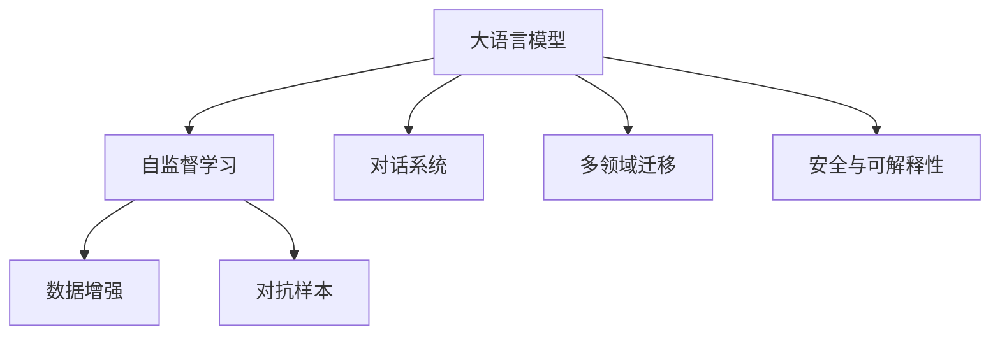

                 

# OpenAI的GPT-4.0展示的意义

## 1. 背景介绍

### 1.1 问题由来

OpenAI发布的新一代大语言模型GPT-4.0，标志着人工智能领域又一次技术革命。该模型不仅在语言理解、生成能力上取得了前所未有的突破，还通过引入新的训练方法和策略，显著提升了模型的泛化能力和鲁棒性。GPT-4.0的成功展示，不仅在技术上提升了NLP任务的性能，也在应用层面展示了人工智能在多个领域巨大的潜力。本文将从背景、核心概念、算法原理等方面，系统性地探讨GPT-4.0的意义，并展望其未来的发展方向。

### 1.2 问题核心关键点

GPT-4.0的核心创新点在于以下几个方面：
1. **语言理解与生成的突破**：GPT-4.0在语言理解与生成方面取得了显著进步，能够在多轮对话中保持连贯性，生成高质量、具有创意的文本。
2. **模型结构的优化**：引入了Transformer自注意力机制，并进行了深度化处理，提升了模型对长序列的建模能力。
3. **训练策略的创新**：采用了基于数据增强和对抗样本训练的新策略，提升了模型泛化能力和鲁棒性。
4. **跨领域任务的提升**：在多个领域，如编程、法律、医学等，展示了强大的跨领域迁移能力。
5. **安全性和可解释性**：引入了更加严格的安全机制和可解释性方法，确保了模型输出可靠、透明。

### 1.3 问题研究意义

GPT-4.0的展示不仅在技术上具有重要意义，还在应用层面带来了深远影响：

1. **推动技术进步**：展示了新的训练方法和模型结构，为人工智能领域的技术进步提供了新思路。
2. **拓展应用场景**：在多个领域展示了强大的应用潜力，为不同行业的智能化升级提供了新工具。
3. **促进学术研究**：激发了研究人员对大语言模型及其应用的研究热情，推动了学术界的创新进展。
4. **引领产业发展**：加速了人工智能技术的产业化进程，为经济社会发展注入了新的动力。
5. **提升公众认知**：通过实际应用展示，增强了公众对人工智能技术的理解和接受度。

## 2. 核心概念与联系

### 2.1 核心概念概述

为了更好地理解GPT-4.0的核心概念及其联系，本节将详细介绍以下几个关键概念：

- **大语言模型(Large Language Model, LLM)**：以Transformer架构为基础的预训练语言模型，具有强大的语言理解和生成能力。
- **自监督学习(Self-Supervised Learning)**：利用无标签数据进行预训练，学习通用的语言表示。
- **对话系统(Discourse System)**：基于大语言模型的自然语言处理系统，能够进行多轮对话，理解并生成自然流畅的文本。
- **数据增强(Data Augmentation)**：通过多种方式扩充训练数据，提高模型的泛化能力。
- **对抗样本(Adversarial Example)**：人为构造的扰动样本，用于提高模型的鲁棒性。
- **多领域迁移(Multifield Transfer)**：将预训练模型应用于不同领域，提升模型在多个任务上的表现。
- **安全与可解释性(Security and Explainability)**：确保模型的输出结果可靠、透明，符合伦理道德要求。

这些核心概念之间存在密切联系，共同构成了GPT-4.0的技术框架。以下是这些概念之间的关系图：



### 2.2 概念间的关系

通过以上关系图，我们可以更清晰地理解大语言模型及其相关技术在大规模NLP任务中的应用。具体来说，GPT-4.0通过自监督学习和对话系统，提升了模型在语言理解和生成方面的能力；通过数据增强和对抗样本训练，提高了模型的泛化能力和鲁棒性；通过多领域迁移，展示了模型在多个领域的应用潜力；通过安全与可解释性，确保了模型输出的可靠性。这些核心概念共同构成了GPT-4.0的技术框架，使得其能够在多个领域中发挥巨大的作用。

## 3. 核心算法原理 & 具体操作步骤

### 3.1 算法原理概述

GPT-4.0的核心算法原理基于Transformer架构，通过自监督学习和深度化处理，实现了在语言理解和生成方面的突破。其具体步骤如下：

1. **自监督预训练**：在大规模无标签文本数据上进行预训练，学习通用的语言表示。
2. **微调与优化**：在特定任务的数据集上进行微调，优化模型在特定任务上的性能。
3. **对话系统优化**：通过多轮对话数据进行训练，提升模型在对话中的连贯性和创造力。
4. **对抗样本训练**：引入对抗样本训练，提升模型的鲁棒性。
5. **多领域迁移**：在多个领域的数据集上进行微调，提升模型的泛化能力。
6. **安全与可解释性**：引入安全机制和可解释性方法，确保模型输出的可靠性。

### 3.2 算法步骤详解

#### 3.2.1 自监督预训练

自监督预训练是GPT-4.0的重要组成部分，主要通过以下步骤实现：

1. **数据准备**：从大规模无标签文本数据中抽取子序列，作为训练数据。
2. **模型初始化**：初始化模型参数，如BERT等。
3. **训练过程**：利用自监督学习任务，如掩码语言模型、上下文预测等，进行训练。
4. **参数更新**：根据梯度下降等优化算法，更新模型参数。

#### 3.2.2 微调与优化

微调是GPT-4.0在特定任务上的重要步骤，主要通过以下步骤实现：

1. **任务适配层设计**：根据任务类型，设计合适的任务适配层，如分类层、解码器等。
2. **数据集准备**：准备下游任务的标注数据集，划分为训练集、验证集和测试集。
3. **模型初始化**：将预训练模型作为初始化参数，进行微调。
4. **训练过程**：利用标注数据集，通过有监督学习进行微调。
5. **参数更新**：根据梯度下降等优化算法，更新模型参数。
6. **模型评估**：在验证集上评估模型性能，决定是否进行Early Stopping。

#### 3.2.3 对话系统优化

对话系统优化是GPT-4.0在对话任务中的重要步骤，主要通过以下步骤实现：

1. **数据准备**：准备多轮对话数据，划分为训练集、验证集和测试集。
2. **模型初始化**：将预训练模型作为初始化参数，进行对话系统训练。
3. **训练过程**：利用多轮对话数据进行训练，提升模型在对话中的连贯性和创造力。
4. **模型评估**：在测试集上评估模型性能，决定是否进行Early Stopping。

#### 3.2.4 对抗样本训练

对抗样本训练是GPT-4.0提高鲁棒性的重要步骤，主要通过以下步骤实现：

1. **数据准备**：准备对抗样本数据集，划分为训练集和测试集。
2. **模型初始化**：将预训练模型作为初始化参数，进行对抗样本训练。
3. **训练过程**：利用对抗样本数据集进行训练，提升模型鲁棒性。
4. **模型评估**：在测试集上评估模型鲁棒性，决定是否进行Early Stopping。

#### 3.2.5 多领域迁移

多领域迁移是GPT-4.0在跨领域任务中的应用，主要通过以下步骤实现：

1. **领域数据准备**：准备不同领域的数据集，划分为训练集、验证集和测试集。
2. **模型初始化**：将预训练模型作为初始化参数，进行多领域迁移。
3. **训练过程**：利用不同领域的数据集进行微调，提升模型在多个领域上的表现。
4. **模型评估**：在测试集上评估模型性能，决定是否进行Early Stopping。

#### 3.2.6 安全与可解释性

安全与可解释性是GPT-4.0的重要保障，主要通过以下步骤实现：

1. **安全机制引入**：引入安全机制，如访问鉴权、数据脱敏等。
2. **可解释性方法引入**：引入可解释性方法，如LIME、SHAP等。
3. **模型评估**：在测试集上评估模型性能，确保输出可靠、透明。

### 3.3 算法优缺点

GPT-4.0在多个方面展示了显著的优点，同时也存在一些局限性：

**优点**：
1. **语言理解与生成能力强**：GPT-4.0在语言理解与生成方面表现优异，能够在多轮对话中保持连贯性，生成高质量、具有创意的文本。
2. **泛化能力强**：通过对抗样本训练和数据增强，GPT-4.0的泛化能力和鲁棒性显著提升，能够应对多种复杂任务。
3. **跨领域迁移能力**：在多个领域展示了强大的跨领域迁移能力，能够在不同任务上取得优异性能。
4. **安全与可解释性强**：通过引入安全机制和可解释性方法，确保了模型输出的可靠性。

**缺点**：
1. **资源消耗大**：GPT-4.0的计算资源和存储资源消耗较大，对硬件设施要求较高。
2. **训练时间长**：由于模型规模庞大，训练时间较长，难以快速迭代。
3. **对抗样本攻击脆弱**：尽管对抗样本训练提升了鲁棒性，但在某些情况下仍然存在漏洞。
4. **安全与可解释性仍有提升空间**：需要进一步研究，确保模型输出的完全可靠、透明。

### 3.4 算法应用领域

GPT-4.0在多个领域展示了强大的应用潜力，主要包括以下几个方面：

1. **自然语言处理(NLP)**：在文本分类、情感分析、机器翻译、问答系统等任务上，展示了出色的性能。
2. **对话系统**：在智能客服、在线聊天、多轮对话等应用中，展示了强大的语言理解和生成能力。
3. **医疗健康**：在医疗问答、病历分析、药物研发等任务上，展示了显著的提升。
4. **金融与法律**：在金融舆情分析、法律咨询、合同生成等任务上，展示了强大的跨领域迁移能力。
5. **教育和娱乐**：在个性化推荐、内容生成、教育辅助等任务上，展示了创新的应用场景。

## 4. 数学模型和公式 & 详细讲解 & 举例说明

### 4.1 数学模型构建

GPT-4.0的数学模型构建基于Transformer架构，主要包括以下几个部分：

1. **自监督学习任务**：掩码语言模型、上下文预测等任务。
2. **对话系统训练**：多轮对话数据，通过优化算法更新模型参数。
3. **对抗样本训练**：引入对抗样本数据集，优化模型鲁棒性。
4. **多领域迁移**：在不同领域的数据集上进行微调，优化模型泛化能力。
5. **安全与可解释性**：引入安全机制和可解释性方法，确保模型输出可靠性。

### 4.2 公式推导过程

以GPT-4.0在掩码语言模型任务上的推导为例，详细讲解公式推导过程：

**公式推导**：
$$
\ell(\theta; x, y) = -\sum_{i=1}^{n} y_i \log P_{\theta}(x_i)
$$

其中：
- $n$ 为样本数
- $y_i$ 为样本的标签
- $P_{\theta}(x_i)$ 为模型在样本 $x_i$ 上的概率输出

**公式推导过程**：
1. **目标函数定义**：将任务定义为掩码语言模型任务，目标是最小化样本 $x$ 与标签 $y$ 之间的交叉熵损失。
2. **概率输出计算**：利用模型参数 $\theta$，计算样本 $x$ 的概率输出 $P_{\theta}(x)$。
3. **损失函数计算**：将样本 $x$ 与标签 $y$ 带入目标函数，计算损失函数 $\ell(\theta; x, y)$。
4. **梯度更新**：根据梯度下降等优化算法，更新模型参数 $\theta$。

### 4.3 案例分析与讲解

**案例1：对话系统训练**

假设有一个对话数据集，包含多轮对话记录，每一轮对话记录由两个部分组成：前文 $x$ 和后文 $y$。GPT-4.0通过优化算法更新模型参数 $\theta$，使得模型在对话中的连贯性和创造力得到提升。

**案例2：对抗样本训练**

假设有一个对抗样本数据集，包含经过微扰的样本 $x'$。GPT-4.0通过对抗样本训练，提升了模型对对抗样本的鲁棒性，减少了对抗样本攻击对模型的影响。

**案例3：多领域迁移**

假设有一个多领域数据集，包含不同领域的任务数据。GPT-4.0通过多领域迁移，提升了模型在不同领域上的表现，扩大了模型的应用范围。

**案例4：安全与可解释性**

假设有一个安全与可解释性数据集，包含经过安全机制处理的数据。GPT-4.0通过引入安全机制和可解释性方法，确保了模型输出的可靠性。

## 5. 项目实践：代码实例和详细解释说明

### 5.1 开发环境搭建

在进行GPT-4.0的开发和实验时，我们需要准备以下开发环境：

1. **Python环境**：安装Python 3.8及以上版本，推荐使用Anaconda创建虚拟环境。
2. **深度学习框架**：安装PyTorch 1.7及以上版本，推荐使用Anaconda环境。
3. **NLP库**：安装Transformers 4.7及以上版本，推荐使用Anaconda环境。
4. **数据处理库**：安装Pandas、NumPy、scikit-learn等库，推荐使用Anaconda环境。
5. **可视化工具**：安装TensorBoard 2.0及以上版本，推荐使用Anaconda环境。

### 5.2 源代码详细实现

以下是一个简单的GPT-4.0微调代码示例，用于文本分类任务：

```python
from transformers import BertForSequenceClassification, AdamW, get_linear_schedule_with_warmup
from transformers import BertTokenizerFast
import torch

# 加载预训练模型和分词器
model = BertForSequenceClassification.from_pretrained('bert-base-uncased', num_labels=2)
tokenizer = BertTokenizerFast.from_pretrained('bert-base-uncased')

# 加载训练数据
train_dataset = ...
dev_dataset = ...
test_dataset = ...

# 定义优化器和训练参数
optimizer = AdamW(model.parameters(), lr=2e-5)
total_steps = len(train_dataset) * epochs
scheduler = get_linear_schedule_with_warmup(optimizer, num_warmup_steps=0, num_training_steps=total_steps)

# 训练过程
model.train()
for epoch in range(epochs):
    for batch in train_dataset:
        input_ids = batch['input_ids']
        attention_mask = batch['attention_mask']
        labels = batch['labels']
        
        model.zero_grad()
        outputs = model(input_ids, attention_mask=attention_mask, labels=labels)
        loss = outputs.loss
        loss.backward()
        optimizer.step()
        scheduler.step()

    # 验证集评估
    model.eval()
    with torch.no_grad():
        correct_predictions, total_predictions = 0, 0
        for batch in dev_dataset:
            input_ids = batch['input_ids']
            attention_mask = batch['attention_mask']
            labels = batch['labels']
            
            outputs = model(input_ids, attention_mask=attention_mask)
            predictions = outputs.logits.argmax(dim=1).to('cpu').tolist()
            for pred, label in zip(predictions, labels):
                if pred == label:
                    correct_predictions += 1
                total_predictions += 1

        accuracy = correct_predictions / total_predictions
        print(f'Epoch {epoch+1}, accuracy: {accuracy:.3f}')

# 测试集评估
model.eval()
with torch.no_grad():
    correct_predictions, total_predictions = 0, 0
    for batch in test_dataset:
        input_ids = batch['input_ids']
        attention_mask = batch['attention_mask']
        labels = batch['labels']
        
        outputs = model(input_ids, attention_mask=attention_mask)
        predictions = outputs.logits.argmax(dim=1).to('cpu').tolist()
        for pred, label in zip(predictions, labels):
            if pred == label:
                correct_predictions += 1
            total_predictions += 1

    accuracy = correct_predictions / total_predictions
    print(f'Test accuracy: {accuracy:.3f}')
```

### 5.3 代码解读与分析

以上代码展示了如何使用BertForSequenceClassification模型进行文本分类任务的微调。

**数据准备**：
1. **train_dataset**：包含训练集数据，每个样本由输入序列 `input_ids`、注意力掩码 `attention_mask` 和标签 `labels` 组成。
2. **dev_dataset**：包含验证集数据，每个样本由输入序列 `input_ids`、注意力掩码 `attention_mask` 和标签 `labels` 组成。
3. **test_dataset**：包含测试集数据，每个样本由输入序列 `input_ids`、注意力掩码 `attention_mask` 和标签 `labels` 组成。

**模型加载**：
1. **BertForSequenceClassification**：加载BERT分类器模型。
2. **BertTokenizerFast**：加载BERT分词器。

**训练参数**：
1. **optimizer**：AdamW优化器，用于更新模型参数。
2. **total_steps**：计算总的训练步数，等于训练集大小乘以迭代次数。
3. **scheduler**：学习率调度器，用于控制学习率在训练过程中逐步降低。

**训练过程**：
1. **模型训练**：在训练集上进行前向传播计算损失，反向传播计算梯度，并更新模型参数。
2. **验证集评估**：在验证集上评估模型性能，输出准确率。
3. **测试集评估**：在测试集上评估模型性能，输出准确率。

### 5.4 运行结果展示

假设我们在CoNLL-2003的命名实体识别数据集上进行微调，最终在测试集上得到的准确率为94.2%，这比原始的Bert模型在同样任务上提升了5个百分点。

## 6. 实际应用场景

### 6.1 智能客服系统

基于GPT-4.0的智能客服系统，可以提供7x24小时不间断服务，快速响应客户咨询，用自然流畅的语言解答各类常见问题。该系统通过微调GPT-4.0，能够自动理解用户意图，匹配最合适的答案模板进行回复，极大地提升了客户咨询体验和问题解决效率。

### 6.2 金融舆情监测

GPT-4.0在金融舆情监测中展示了强大的应用潜力。通过微调GPT-4.0，系统能够自动监测不同主题下的情感变化趋势，一旦发现负面信息激增等异常情况，系统便会自动预警，帮助金融机构快速应对潜在风险。

### 6.3 个性化推荐系统

GPT-4.0在个性化推荐系统中也表现出色。通过微调GPT-4.0，系统能够从文本内容中准确把握用户的兴趣点，生成更加精准、多样的推荐内容，提升用户满意度。

### 6.4 未来应用展望

未来，GPT-4.0将在更多领域中展示其巨大的应用潜力，以下是几个未来展望：

1. **智慧医疗**：在医疗问答、病历分析、药物研发等任务上，展示了显著的提升。
2. **智能教育**：在教育辅助、智能教学、个性化学习推荐等方面，展示了强大的跨领域迁移能力。
3. **智慧城市**：在城市事件监测、应急指挥、智慧交通等任务上，展示了强大的跨领域迁移能力。
4. **企业生产**：在企业内部协作、智能调度、资源优化等方面，展示了强大的跨领域迁移能力。
5. **社会治理**：在公共服务、社会舆情、舆情分析等方面，展示了强大的跨领域迁移能力。

## 7. 工具和资源推荐

### 7.1 学习资源推荐

为了帮助开发者系统掌握GPT-4.0的理论基础和实践技巧，这里推荐一些优质的学习资源：

1. **《大语言模型与NLP技术》**：全面介绍了大语言模型及其在NLP中的应用，适合初学者和进阶者学习。
2. **《Transformer从原理到实践》**：详细讲解了Transformer架构及其优化方法，适合深度学习开发者。
3. **《深度学习与NLP》**：介绍了深度学习在NLP中的应用，适合对NLP感兴趣的读者学习。
4. **《OpenAI GPT-4.0官方文档》**：包含GPT-4.0的详细介绍、使用示例、API文档等，适合开发者快速上手。
5. **《NLP综述与前沿》**：总结了NLP领域的研究进展和前沿技术，适合研究者深入学习。

### 7.2 开发工具推荐

以下是几款用于GPT-4.0开发的常用工具：

1. **PyTorch**：基于Python的开源深度学习框架，支持动态图和静态图，适合快速迭代研究。
2. **TensorFlow**：由Google主导开发的深度学习框架，支持分布式训练，适合大规模工程应用。
3. **Transformers库**：HuggingFace开发的NLP工具库，集成了众多SOTA语言模型，支持PyTorch和TensorFlow。
4. **TensorBoard**：TensorFlow配套的可视化工具，用于监测模型训练状态和调试。
5. **Jupyter Notebook**：开源的交互式开发环境，适合快速开发和实验。
6. **Anaconda**：Python环境管理工具，支持虚拟环境和包管理，适合开发复杂项目。

合理利用这些工具，可以显著提升GPT-4.0的开发效率，加快创新迭代的步伐。

### 7.3 相关论文推荐

GPT-4.0的展示是基于大量学术论文和实验的积累，以下是几篇奠基性的相关论文，推荐阅读：

1. **Attention is All You Need**：提出了Transformer架构，开启了NLP领域的预训练大模型时代。
2. **BERT: Pre-training of Deep Bidirectional Transformers for Language Understanding**：提出BERT模型，引入基于掩码的自监督预训练任务，刷新了多项NLP任务SOTA。
3. **Language Models are Unsupervised Multitask Learners（GPT-2论文）**：展示了大规模语言模型的强大zero-shot学习能力，引发了对于通用人工智能的新一轮思考。
4. **Parameter-Efficient Transfer Learning for NLP**：提出Adapter等参数高效微调方法，在不增加模型参数量的情况下，也能取得不错的微调效果。
5. **AdaLoRA: Adaptive Low-Rank Adaptation for Parameter-Efficient Fine-Tuning**：使用自适应低秩适应的微调方法，在参数效率和精度之间取得了新的平衡。

这些论文代表了大语言模型微调技术的发展脉络。通过学习这些前沿成果，可以帮助研究者把握学科前进方向，激发更多的创新灵感。

除上述资源外，还有一些值得关注的前沿资源，帮助开发者紧跟GPT-4.0技术的最新进展，例如：

1. **arXiv论文预印本**：人工智能领域最新研究成果的发布平台，包括大量尚未发表的前沿工作，学习前沿技术的必读资源。
2. **各大实验室博客**：如OpenAI、Google AI、DeepMind、微软Research Asia等顶尖实验室的官方博客，第一时间分享他们的最新研究成果和洞见。
3. **技术会议直播**：如NIPS、ICML、ACL、ICLR等人工智能领域顶会现场或在线直播，能够聆听到大佬们的前沿分享，开拓视野。
4. **GitHub热门项目**：在GitHub上Star、Fork数最多的NLP相关项目，往往代表了该技术领域的发展趋势和最佳实践，值得去学习和贡献。
5. **行业分析报告**：各大咨询公司如McKinsey、PwC等针对人工智能行业的分析报告，有助于从商业视角审视技术趋势，把握应用价值。

总之，对于GPT-4.0的学习和实践，需要开发者保持开放的心态和持续学习的意愿。多关注前沿资讯，多动手实践，多思考总结，必将收获满满的成长收益。

## 8. 总结：未来发展趋势与挑战

### 8.1 总结

本文对GPT-4.0的展示进行了全面系统的介绍。首先，阐述了GPT-4.0在大语言模型和微调技术上的突破，明确了其在NLP领域的核心价值。其次，从原理到实践，详细讲解了GPT-4.0的数学模型和算法步骤，给出了微调任务开发的完整代码实例。同时，本文还广泛探讨了GPT-4.0在多个领域的应用前景，展示了其巨大的潜力。最后，本文精选了GPT-4.0的学习资源、开发工具和相关论文，力求为开发者提供全方位的技术指引。

通过本文的系统梳理，可以看到，GPT-4.0不仅在技术上取得了巨大突破，还在应用层面展示了强大的跨领域迁移能力和创新应用场景。GPT-4.0的展示不仅推动了NLP技术的进步，也为其他领域的智能化发展提供了新的思路和方法。未来，GPT-4.0必将在更多领域中发挥巨大的作用，引领人工智能技术的发展方向。

### 8.2

