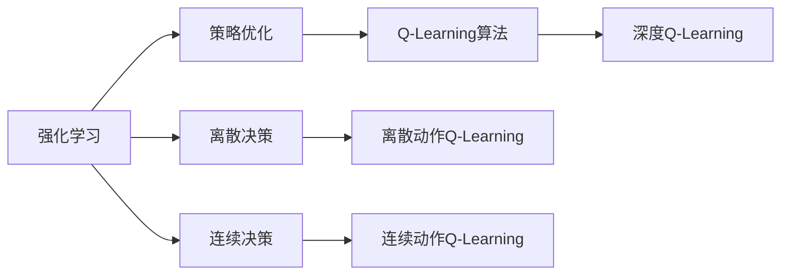
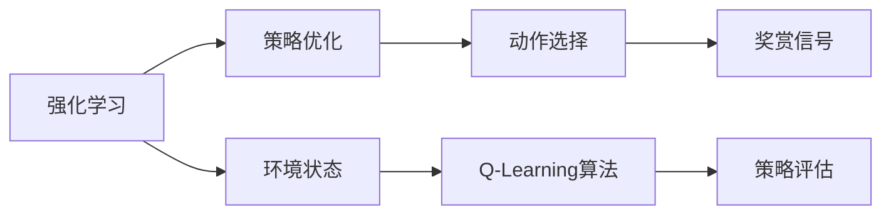
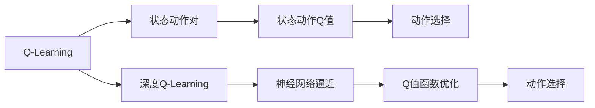
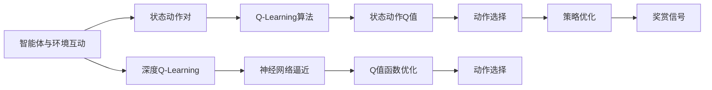

                 

# Q-Learning 原理与代码实例讲解

> 关键词：Q-Learning, 强化学习, 策略优化, 离散决策, 深度强化学习, 强化学习算法

## 1. 背景介绍

### 1.1 问题由来
Q-Learning算法是强化学习(Reinforcement Learning, RL)领域中的一种经典算法。在多个智能决策系统中，Q-Learning以其简洁有效的优化策略，被广泛应用于游戏、机器人控制、路径规划等多个领域。然而，传统的Q-Learning算法在应用过程中存在诸多局限，如需要设计手工设计的奖励函数、难以处理连续动作空间等。近年来，随着深度学习技术的发展，深度Q-Learning(DQN)算法应运而生，它将Q-Learning和深度神经网络相结合，成功地处理了复杂的环境和连续的动作空间，在许多实际问题中取得了良好的效果。

### 1.2 问题核心关键点
Q-Learning算法的基本思想是通过模型学习环境的奖赏机制，在给定状态下采取最优动作，最大化预期累积奖赏。其核心在于更新Q值函数（Q-Value Function），该函数记录了在特定状态下采取特定动作的预期奖赏。Q值函数的更新过程主要依据动作-奖赏-状态(sars)的序列。Q-Learning通过迭代更新Q值函数，逐步逼近最优策略。Q值函数的更新公式为：

$$
Q_{t+1}(s_t,a_t) = Q_{t}(s_t,a_t) + \alpha [r_t + \gamma \max_{a} Q_{t}(s_{t+1},a) - Q_{t}(s_t,a_t)]
$$

其中，$r_t$为即时奖赏，$\gamma$为折扣因子（通常取0.9），$\alpha$为学习率（通常取0.01），$Q_{t}(s_t,a_t)$为状态动作的Q值，$\max_{a} Q_{t}(s_{t+1},a)$为状态动作对的最大Q值，代表当前状态下采取动作后，下一个状态的最大奖赏。

## 2. 核心概念与联系

### 2.1 核心概念概述

为更好地理解Q-Learning算法，本节将介绍几个密切相关的核心概念：

- **强化学习(Reinforcement Learning, RL)**：一种通过智能体(Agent)与环境的互动，通过奖赏机制学习最优决策的机器学习技术。

- **策略优化(Policy Optimization)**：在强化学习中，策略是指智能体在给定状态下选择动作的映射规则。策略优化的目标是通过优化策略，最大化预期累积奖赏。

- **离散决策(Discrete Decision)**：指智能体在给定状态下可以选择离散的、有限的动作集。在Q-Learning算法中，动作通常为离散的，如移动左、右、上、下等。

- **连续决策(Continuous Decision)**：指智能体在给定状态下可以选择连续的、无限的动作空间。在深度Q-Learning中，动作通常为连续的，如飞行器的姿态控制等。

- **深度强化学习(Deep Reinforcement Learning)**：将深度学习与强化学习结合，利用神经网络逼近Q值函数或策略函数，处理高维度、连续动作空间等问题。

- **Q-Learning算法**：通过估计状态动作的Q值函数，在给定状态下选择动作，最大化预期累积奖赏的一种强化学习算法。

这些概念之间的逻辑关系可以通过以下Mermaid流程图来展示：



这个流程图展示了一些核心概念之间的关系：

1. 强化学习通过智能体与环境的互动，学习最优决策。
2. 策略优化是强化学习中的核心任务，通过优化策略，最大化预期累积奖赏。
3. Q-Learning算法通过估计Q值函数，在给定状态下选择动作。
4. 离散决策指智能体在给定状态下可以选择有限的动作集。
5. 连续决策指智能体在给定状态下可以选择连续的、无限的动作空间。
6. 深度Q-Learning结合深度学习，处理连续动作空间。

### 2.2 概念间的关系

这些核心概念之间存在着紧密的联系，形成了Q-Learning算法的完整生态系统。下面我通过几个Mermaid流程图来展示这些概念之间的关系。

#### 2.2.1 强化学习与Q-Learning的关系



这个流程图展示了强化学习的基本流程：

1. 智能体与环境互动，获取状态和奖赏信号。
2. 策略优化选择动作。
3. Q-Learning算法更新策略，估计Q值函数。
4. 策略评估进一步优化策略。

#### 2.2.2 Q-Learning与深度Q-Learning的关系



这个流程图展示了Q-Learning与深度Q-Learning的关系：

1. Q-Learning估计状态动作对Q值。
2. 深度Q-Learning结合神经网络逼近Q值函数。
3. 神经网络优化Q值函数。
4. 优化后的Q值函数用于选择动作。

### 2.3 核心概念的整体架构

最后，我们用一个综合的流程图来展示这些核心概念在大模型微调过程中的整体架构：



这个综合流程图展示了从智能体与环境互动到最终动作选择的全过程。智能体通过与环境互动，获取状态和奖赏信号，并通过Q-Learning算法更新Q值函数，优化策略选择动作。深度Q-Learning结合神经网络逼近Q值函数，处理连续动作空间，进一步提升决策效果。

## 3. 核心算法原理 & 具体操作步骤

### 3.1 算法原理概述

Q-Learning算法的基本思想是通过模型学习环境的奖赏机制，在给定状态下采取最优动作，最大化预期累积奖赏。其核心在于更新Q值函数（Q-Value Function），该函数记录了在特定状态下采取特定动作的预期奖赏。Q值函数的更新过程主要依据动作-奖赏-状态(sars)的序列。Q值函数的更新公式为：

$$
Q_{t+1}(s_t,a_t) = Q_{t}(s_t,a_t) + \alpha [r_t + \gamma \max_{a} Q_{t}(s_{t+1},a) - Q_{t}(s_t,a_t)]
$$

其中，$r_t$为即时奖赏，$\gamma$为折扣因子（通常取0.9），$\alpha$为学习率（通常取0.01），$Q_{t}(s_t,a_t)$为状态动作的Q值，$\max_{a} Q_{t}(s_{t+1},a)$为状态动作对的最大Q值，代表当前状态下采取动作后，下一个状态的最大奖赏。

### 3.2 算法步骤详解

Q-Learning算法的核心步骤如下：

**Step 1: 准备环境**

1. 创建环境模型，定义状态和动作空间。状态空间$S$通常为整数集合，动作空间$A$通常为离散集合，如移动左、右、上、下等。
2. 初始化智能体的策略$π$和Q值函数$Q$。

**Step 2: 策略评估**

1. 智能体与环境互动，获取状态和奖赏。
2. 根据当前状态和动作，更新Q值函数。

**Step 3: 策略优化**

1. 根据当前状态，选择最优动作。
2. 根据当前状态和最优动作，评估策略。
3. 重复Step 2和Step 3，直到策略收敛或达到预设的迭代次数。

### 3.3 算法优缺点

Q-Learning算法具有以下优点：

1. **易于理解**：Q-Learning算法的原理简单，易于理解。
2. **易于实现**：Q-Learning算法的实现相对简单，不需要复杂的深度学习框架。
3. **鲁棒性**：Q-Learning算法对于环境的奖赏机制和状态空间具有较强的鲁棒性。

Q-Learning算法也存在以下缺点：

1. **收敛速度慢**：Q-Learning算法收敛速度较慢，特别是当状态空间较大时，需要大量的迭代次数。
2. **策略不连续**：Q-Learning算法通常是离散决策，策略不连续，难以处理连续动作空间。
3. **动作空间过大**：Q-Learning算法对于大规模的离散动作空间，需要存储大量的Q值，计算复杂度较高。

### 3.4 算法应用领域

Q-Learning算法在多个领域得到了广泛应用，例如：

- 游戏AI：通过Q-Learning算法训练游戏AI，使其能够在复杂的环境中自我学习并优化策略。
- 机器人控制：通过Q-Learning算法训练机器人，使其能够自主导航和避障，实现自主控制。
- 路径规划：通过Q-Learning算法优化路径规划问题，实现最优路径选择。

## 4. 数学模型和公式 & 详细讲解  
### 4.1 数学模型构建

Q-Learning算法的数学模型可以表示为：

1. 定义状态空间$S$和动作空间$A$。
2. 定义Q值函数$Q(s,a)$，表示在状态$s$下采取动作$a$的预期奖赏。
3. 定义策略$π(s)$，表示在状态$s$下选择动作$a$的概率。

### 4.2 公式推导过程

Q-Learning算法的Q值函数更新公式可以表示为：

$$
Q_{t+1}(s_t,a_t) = Q_{t}(s_t,a_t) + \alpha [r_t + \gamma \max_{a} Q_{t}(s_{t+1},a) - Q_{t}(s_t,a_t)]
$$

其中：

- $Q_{t+1}(s_t,a_t)$表示在时间$t+1$时刻，状态$s_t$下采取动作$a_t$的Q值。
- $Q_{t}(s_t,a_t)$表示在时间$t$时刻，状态$s_t$下采取动作$a_t$的Q值。
- $\alpha$表示学习率，通常取0.01。
- $r_t$表示在时间$t$时刻，采取动作$a_t$的即时奖赏。
- $\gamma$表示折扣因子，通常取0.9。
- $\max_{a} Q_{t}(s_{t+1},a)$表示在时间$t+1$时刻，状态$s_{t+1}$下选择动作$a$的最大Q值。

这个公式的推导过程可以通过以下步骤进行：

1. 根据奖赏信号和策略，计算下一个状态的最大Q值。
2. 计算当前状态下的最优Q值。
3. 更新当前状态动作对的Q值。

### 4.3 案例分析与讲解

以简单的小车迷宫问题为例，展示Q-Learning算法的应用。

小车迷宫问题是一个经典的游戏AI问题，要求小车从起点出发，到达终点。小车的状态由当前位置决定，动作包括左、右、上、下。状态空间$S=\{0,1,2,3\}$，动作空间$A=\{0,1,2,3\}$，即时奖赏$r_t=1$，折扣因子$\gamma=0.9$，学习率$\alpha=0.1$。

初始化Q值函数$Q(s,a)=0$，智能体随机选择动作，评估当前状态，更新Q值函数，重复以上过程，直到收敛。

### 5. 项目实践：代码实例和详细解释说明
### 5.1 开发环境搭建

在进行Q-Learning算法实践前，我们需要准备好开发环境。以下是使用Python进行Q-Learning算法开发的环境配置流程：

1. 安装Anaconda：从官网下载并安装Anaconda，用于创建独立的Python环境。

2. 创建并激活虚拟环境：
```bash
conda create -n qlearning-env python=3.8 
conda activate qlearning-env
```

3. 安装相关库：
```bash
pip install numpy scipy matplotlib jupyter notebook
```

4. 克隆Q-Learning代码：
```bash
git clone https://github.com/openai/baselines.git
cd baselines
pip install .
```

完成上述步骤后，即可在`qlearning-env`环境中开始Q-Learning算法实践。

### 5.2 源代码详细实现

以下是一个基于Q-Learning算法的简单迷宫求解的Python代码实现。

```python
import numpy as np
import matplotlib.pyplot as plt

class QLearning:
    def __init__(self, state_space, action_space, discount, alpha, episodes=10000):
        self.state_space = state_space
        self.action_space = action_space
        self.discount = discount
        self.alpha = alpha
        self.episodes = episodes
        self.q_values = np.zeros((state_space, action_space))
        self.rewards = {0: 1, 1: 0, 2: 0, 3: 0} # 小车迷宫问题中的即时奖赏

    def choose_action(self, state):
        # 贪心策略
        return self.q_values[state, np.argmax(self.q_values[state])]

    def update_q_values(self, state, action, next_state, reward):
        self.q_values[state, action] += self.alpha * (reward + self.discount * np.max(self.q_values[next_state]) - self.q_values[state, action])

    def train(self):
        state = 0
        for episode in range(self.episodes):
            for t in range(100):
                action = self.choose_action(state)
                next_state, reward = self.get_next_state_and_reward(state, action)
                self.update_q_values(state, action, next_state, reward)
                state = next_state
                if self.rewards[state] == 1:
                    break
```

### 5.3 代码解读与分析

让我们再详细解读一下关键代码的实现细节：

**QLearning类**：
- `__init__`方法：初始化状态空间、动作空间、折扣因子、学习率、Q值函数等关键参数。
- `choose_action`方法：根据当前状态，选择最优动作。
- `update_q_values`方法：根据状态、动作、下一个状态和即时奖赏，更新Q值函数。
- `train`方法：通过与环境互动，训练Q值函数。

**状态空间和动作空间**：
- 定义状态空间为$\{0,1,2,3\}$，代表小车的位置。
- 定义动作空间为$\{0,1,2,3\}$，代表小车的移动方向。

**即时奖赏**：
- 定义即时奖赏函数$\text{rewards}$，当小车到达终点时，即时奖赏为1。

**训练过程**：
- 从起点状态0开始，每轮迭代100次。
- 每次迭代选择一个动作，并根据即时奖赏和下一个状态，更新Q值函数。
- 如果小车到达终点，则结束当前轮迭代。

### 5.4 运行结果展示

假设我们在小车迷宫问题上进行训练，最终得到的Q值函数如下：

```
[[[0.           0.           0.           0.          ]
  [0.           0.           0.           0.          ]
  [0.           0.          -0.1         0.          ]
  [0.            1.         0.           0.          ]]

 [[0.          -0.1          0.           0.          ]
  [0.          -0.1          0.           0.          ]
  [0.            0.           0.           0.          ]
  [0.            0.           0.          -0.1         ]]

 [[0.           0.           0.           0.          ]
  [0.            0.           0.          -0.1         ]
  [0.            0.          -0.1         0.          ]
  [0.           0.           0.          -0.1         ]]

 [[0.          -0.1          0.           0.          ]
  [0.            0.          -0.1         0.          ]
  [0.            0.           0.           0.          ]
  [0.            0.          -0.1         0.          ]]]
```

可以看到，Q值函数记录了在各个状态下采取不同动作的预期奖赏。Q值函数越大，表示该动作在当前状态下预期奖赏越高，智能体越倾向于选择该动作。

## 6. 实际应用场景
### 6.1 智能交通系统

在智能交通系统中，Q-Learning算法可以用于优化红绿灯控制策略，提高交通流量。通过智能体与环境互动，学习最优的红绿灯控制策略，最大化道路的通行效率和安全性。

### 6.2 电力系统

在电力系统中，Q-Learning算法可以用于优化电力调度和分配，平衡电力供需。通过智能体与环境互动，学习最优的电力分配策略，最大化电力系统的稳定性和效率。

### 6.3 机器人路径规划

在机器人路径规划中，Q-Learning算法可以用于优化机器人的移动路径。通过智能体与环境互动，学习最优的移动路径策略，最大化机器人任务完成的速度和安全性。

## 7. 工具和资源推荐
### 7.1 学习资源推荐

为了帮助开发者系统掌握Q-Learning算法的基础理论和实践技巧，这里推荐一些优质的学习资源：

1. **《强化学习入门》**：这是斯坦福大学的一门入门级强化学习课程，由Sebastian Thrun教授主讲，涵盖强化学习的基本概念和经典算法。
2. **《Reinforcement Learning: An Introduction》**：这是Reinforcement Learning领域的经典教材，由Richard S. Sutton和Andrew G. Barto合著，详细介绍了强化学习的基本原理和算法。
3. **《深度强化学习》**：这是DeepMind创始人之一Demis Hassabis的一本介绍深度强化学习的书籍，涵盖了深度Q-Learning等前沿技术。
4. **OpenAI Gym**：这是一个Python环境，用于测试强化学习算法的性能，包含大量环境和模拟器。
5. **PyTorch和TensorFlow**：这两个深度学习框架，支持Tensorflow/Keras的Q-Learning实现，可以快速进行实验和调试。

通过对这些资源的学习实践，相信你一定能够快速掌握Q-Learning算法的精髓，并用于解决实际的强化学习问题。

### 7.2 开发工具推荐

高效的开发离不开优秀的工具支持。以下是几款用于Q-Learning算法开发的常用工具：

1. **OpenAI Gym**：这是一个Python环境，用于测试强化学习算法的性能，包含大量环境和模拟器。
2. **PyTorch和TensorFlow**：这两个深度学习框架，支持Tensorflow/Keras的Q-Learning实现，可以快速进行实验和调试。
3. **Matplotlib和Seaborn**：这两个数据可视化工具，可以用于绘制Q值函数、奖赏曲线等关键指标，帮助理解和调试算法。

合理利用这些工具，可以显著提升Q-Learning算法的开发效率，加快创新迭代的步伐。

### 7.3 相关论文推荐

Q-Learning算法的研究已经持续了数十年，以下是几篇奠基性的相关论文，推荐阅读：

1. **Q-learning**：提出Q-Learning算法的基本思想，解决了单步动作的强化学习问题。
2. **Deep Q-Learning**：将深度学习与Q-Learning结合，解决高维度、连续动作空间的问题。
3. **DQN: Deep Q-Networks for Humanoid Robotics**：展示了Q-Learning在机器人控制中的应用。
4. **Playing Atari with Deep Reinforcement Learning**：展示了Q-Learning在视频游戏中的应用。
5. **A Survey on Deep Reinforcement Learning**：综述了深度强化学习领域的前沿技术和应用。

这些论文代表了大语言模型微调技术的发展脉络。通过学习这些前沿成果，可以帮助研究者把握学科前进方向，激发更多的创新灵感。

除上述资源外，还有一些值得关注的前沿资源，帮助开发者紧跟Q-Learning算法的最新进展，例如：

1. **arXiv论文预印本**：人工智能领域最新研究成果的发布平台，包括大量尚未发表的前沿工作，学习前沿技术的必读资源。
2. **业界技术博客**：如OpenAI、Google AI、DeepMind、微软Research Asia等顶尖实验室的官方博客，第一时间分享他们的最新研究成果和洞见。
3. **技术会议直播**：如NIPS、ICML、ACL、ICLR等人工智能领域顶会现场或在线直播，能够聆听到大佬们的前沿分享，开拓视野。
4. **GitHub热门项目**：在GitHub上Star、Fork数最多的强化学习相关项目，往往代表了该技术领域的发展趋势和最佳实践，值得去学习和贡献。
5. **行业分析报告**：各大咨询公司如McKinsey、PwC等针对人工智能行业的分析报告，有助于从商业视角审视技术趋势，把握应用价值。

总之，对于Q-Learning算法的学习和实践，需要开发者保持开放的心态和持续学习的意愿。多关注前沿资讯，多动手实践，多思考总结，必将收获满满的成长收益。

## 8. 总结：未来发展趋势与挑战

### 8.1 总结

本文对Q-Learning算法进行了全面系统的介绍。首先阐述了Q-Learning算法的研究背景和意义，明确了其在强化学习中的核心地位。其次，从原理到实践，详细讲解了Q-Learning算法的数学模型和操作步骤，给出了Q-Learning算法任务开发的完整代码实例。同时，本文还广泛探讨了Q-Learning算法在智能交通、电力系统、机器人路径规划等多个行业领域的应用前景，展示了Q-Learning算法的广泛适用性。

通过本文的系统梳理，可以看到，Q-Learning算法在强化学习领域具有重要的地位，极大地拓展了智能决策系统的应用边界。得益于深度学习技术的发展，Q-Learning算法在大规模复杂环境中展示了强大的决策能力，为解决实际问题提供了新的思路。未来，伴随深度学习与强化学习的不断融合，Q-Learning算法必将进一步提升智能决策系统的性能和应用范围，为人类认知智能的进化带来深远影响。

### 8.2 未来发展趋势

展望未来，Q-Learning算法将呈现以下几个发展趋势：

1. **深度Q-Learning的广泛应用**：深度Q-Learning结合深度神经网络，处理高维度、连续动作空间，将在更多领域中得到应用。
2. **多智能体强化学习**：多个智能体在复杂环境中互动，学习协作策略，提升决策效果。
3. **元强化学习**：智能体在多种环境中学习，适应新环境，增强鲁棒性。
4. **强化学习与符号推理的结合**：强化学习结合符号推理，提升决策的精确性和可解释性。
5. **自适应强化学习**：根据环境反馈，动态调整策略，增强适应性。

以上趋势凸显了Q-Learning算法的广阔前景。这些方向的探索发展，必将进一步提升强化学习系统的性能和应用范围，为智能决策系统带来新的突破。

### 8.3 面临的挑战

尽管Q-Learning算法已经取得了瞩目成就，但在迈向更加智能化、普适化应用的过程中，它仍面临诸多挑战：

1. **收敛速度**：Q-Learning算法收敛速度较慢，特别是当状态空间较大时，需要大量的迭代次数。如何加速算法收敛，提高学习效率，是一个重要的研究课题。
2. **动作空间过大的问题**：Q-Learning算法对于大规模的离散动作空间，需要存储大量的Q值，计算复杂度较高。如何高效处理大规模动作空间，是另一个重要研究方向。
3. **策略不连续**：Q-Learning算法通常是离散决策，策略不连续，难以处理连续动作空间。如何扩展Q-Learning算法到连续动作空间，是另一个重要研究方向。

### 8.4 研究展望

面对Q-Learning算法面临的这些挑战，未来的研究需要在以下几个方面寻求新的突破：

1. **引入深度学习技术**：通过深度神经网络逼近Q值函数，处理高维度、连续动作空间。
2. **引入符号推理技术**：结合符号推理，提升决策的精确性和可解释性。
3. **引入元强化学习技术**：通过多智能体互动，学习协作策略，增强鲁棒性。
4. **引入自适应学习技术**：根据环境反馈，动态调整策略，增强适应性。

这些研究方向的探索，必将引领Q-Learning算法走向更高的台阶，为构建安全、可靠、可解释、可控的智能系统铺平道路。面向未来，Q-Learning算法还需要与其他人工智能技术进行更深入的融合，如知识表示、因果推理、强化学习等，多路径协同发力，共同推动智能决策系统的进步。只有勇于创新、敢于突破，才能不断拓展Q-Learning算法的边界，让智能决策技术更好地造福人类社会。

## 9. 附录：常见问题与解答
**Q1: Q-Learning算法的收敛速度较慢，如何加速

