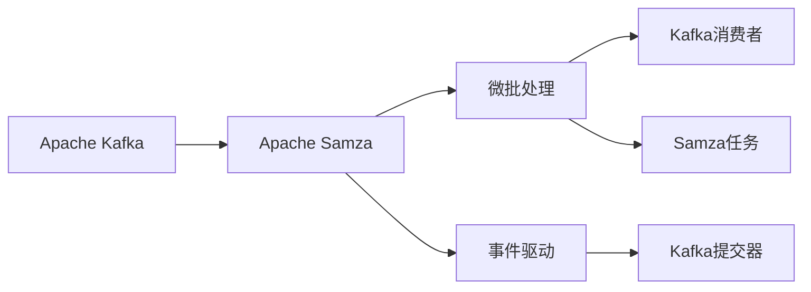
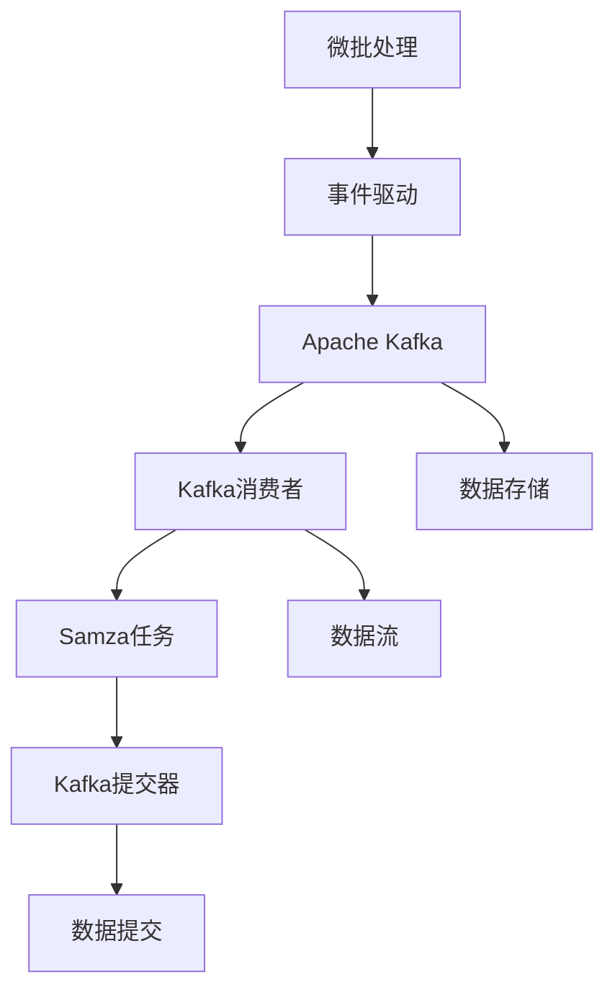
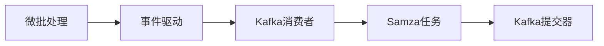

                 

# Samza Task原理与代码实例讲解

> 关键词：Samza, Apache Kafka, 分布式数据处理, 微批处理, 事件驱动, 消息驱动

## 1. 背景介绍

### 1.1 问题由来
随着大数据和云计算技术的飞速发展，企业对数据处理的需求日益增加。传统的单节点处理方式已经无法满足大规模数据的高并发、高吞吐、高可靠性的需求。因此，分布式数据处理框架应运而生，以实现大规模数据的高效处理。

在此背景下，Apache Kafka和Apache Samza作为两个核心的开源分布式数据处理框架，被广泛应用到各类大数据处理场景中。其中，Apache Samza是Apache Kafka的生态系统之一，能够无缝集成Apache Kafka，实现微批处理和事件驱动的数据处理。

### 1.2 问题核心关键点
Samza的核心思想是实现微批处理和事件驱动的数据处理。它将Kafka消息流切分为多个小的批处理任务，每个任务可以并行处理多个消息。这种微批处理方式能够有效提高系统吞吐量，降低延迟，同时保证数据的可靠性和一致性。

Samza的任务模型由Kafka事件驱动，任务状态由Kafka控制，通过Kafka分布式存储与同步，保证任务的可靠性与容错性。其核心组件包括Kafka消费者、Samza任务、Kafka提交器等。

Samza的微批处理和事件驱动技术，使其在实时数据流处理、数据清洗、ETL等场景中得到了广泛应用，帮助企业构建高效、可靠、可扩展的大数据处理系统。

### 1.3 问题研究意义
Samza的任务模型基于Kafka，能够高效地处理大规模数据流，解决了传统单节点处理方式在数据处理性能和可靠性方面的局限性。通过微批处理和事件驱动技术，Samza能够实时、高效地处理数据，支持高并发、低延迟的数据处理需求，降低了数据处理的复杂度和成本。

## 2. 核心概念与联系

### 2.1 核心概念概述

为了更好地理解Samza任务模型，本节将介绍几个关键概念：

- Apache Kafka：一个分布式消息流平台，支持高吞吐、高可靠性的数据流处理。
- Apache Samza：一个开源分布式数据处理框架，基于Kafka，支持微批处理和事件驱动的数据处理。
- 微批处理(Micro-batching)：将小批量数据切分为多个小的批处理任务，每个任务可以并行处理多个消息。
- 事件驱动(Event-driven)：基于Kafka，以消息队列为中心，任务处理由消息事件驱动。
- Kafka消费者：从Kafka队列中读取数据，并将其传递给Samza任务进行处理。
- Samza任务：由多个微批处理任务组成，每个任务可以处理多个消息。
- Kafka提交器：负责将处理结果提交回Kafka，保证数据的可靠性和一致性。

这些核心概念之间的逻辑关系可以通过以下Mermaid流程图来展示：



这个流程图展示了Apache Samza的核心组件及其之间的关系：

1. Apache Kafka作为分布式消息流平台，提供可靠的数据流处理能力。
2. Apache Samza基于Kafka，实现微批处理和事件驱动的数据处理。
3. Kafka消费者从Kafka队列中读取数据，并将其传递给Samza任务进行处理。
4. Samza任务由多个微批处理任务组成，每个任务可以处理多个消息。
5. Kafka提交器负责将处理结果提交回Kafka，保证数据的可靠性和一致性。

### 2.2 概念间的关系

这些核心概念之间存在着紧密的联系，形成了Apache Samza任务模型的完整生态系统。下面我通过几个Mermaid流程图来展示这些概念之间的关系。

#### 2.2.1 Apache Samza的架构



这个流程图展示了Apache Samza的任务模型架构：

1. 微批处理是Samza的核心处理方式，将小批量数据切分为多个小的批处理任务。
2. 事件驱动是基于Kafka的，以消息队列为中心，任务处理由消息事件驱动。
3. Kafka消费者从Kafka队列中读取数据，并将其传递给Samza任务进行处理。
4. Samza任务由多个微批处理任务组成，每个任务可以处理多个消息。
5. Kafka提交器负责将处理结果提交回Kafka，保证数据的可靠性和一致性。

#### 2.2.2 微批处理与事件驱动的关系



这个流程图展示了微批处理和事件驱动的关系：

1. 微批处理是基于Kafka的消息流，将小批量数据切分为多个小的批处理任务。
2. 事件驱动是基于Kafka的消息队列，任务处理由消息事件驱动。
3. Kafka消费者从Kafka队列中读取数据，并将其传递给Samza任务进行处理。
4. Samza任务由多个微批处理任务组成，每个任务可以处理多个消息。
5. Kafka提交器负责将处理结果提交回Kafka，保证数据的可靠性和一致性。

## 3. 核心算法原理 & 具体操作步骤
### 3.1 算法原理概述

Apache Samza的任务模型基于微批处理和事件驱动，其实现原理可以分为以下几个部分：

1. **数据流划分**：将Apache Kafka中的数据流划分为多个小批量数据流，每个数据流对应一个微批处理任务。
2. **任务划分**：将微批处理任务进一步划分为多个子任务，每个子任务可以并行处理多个消息。
3. **事件驱动**：通过Kafka消息队列，以事件驱动的方式控制任务的执行。
4. **状态管理**：通过Kafka分布式存储，保存任务的状态信息，实现任务的可靠性和容错性。
5. **数据提交**：将每个子任务的处理结果提交回Kafka，保证数据的可靠性和一致性。

Samza的任务模型能够有效提升系统吞吐量，降低延迟，同时保证数据的可靠性和一致性，适用于实时数据流处理、数据清洗、ETL等场景。

### 3.2 算法步骤详解

Apache Samza的任务模型实现过程可以分为以下几个关键步骤：

1. **数据流划分**：将Apache Kafka中的数据流划分为多个小批量数据流，每个数据流对应一个微批处理任务。

2. **任务划分**：将微批处理任务进一步划分为多个子任务，每个子任务可以并行处理多个消息。

3. **事件驱动**：通过Kafka消息队列，以事件驱动的方式控制任务的执行。

4. **状态管理**：通过Kafka分布式存储，保存任务的状态信息，实现任务的可靠性和容错性。

5. **数据提交**：将每个子任务的处理结果提交回Kafka，保证数据的可靠性和一致性。

6. **任务恢复**：当Samza任务异常或重启时，Kafka分布式存储中的状态信息可以确保任务能够恢复。

这些步骤确保了Samza任务模型的高效性、可靠性和可扩展性，适用于各类大规模数据处理场景。

### 3.3 算法优缺点

Apache Samza的任务模型具有以下优点：

1. **高效性**：通过微批处理和并行处理，能够有效提升系统吞吐量，降低延迟。
2. **可靠性**：通过Kafka分布式存储和提交器，保证数据的可靠性和一致性。
3. **可扩展性**：任务模型支持水平扩展，能够处理大规模数据流。
4. **低延迟**：通过事件驱动的方式控制任务执行，降低数据处理的延迟。
5. **灵活性**：任务模型支持各类数据处理任务，包括实时数据流处理、数据清洗、ETL等。

然而，Samza任务模型也存在一些缺点：

1. **复杂度较高**：任务模型涉及多个组件，实现和调试复杂度较高。
2. **资源消耗较大**：由于并行处理和状态管理，资源消耗较大，需要配置合适的资源。
3. **状态同步开销**：由于任务状态需要同步到Kafka分布式存储中，状态同步开销较大。
4. **数据延迟**：由于任务执行需要等待事件驱动，存在一定的数据延迟。

### 3.4 算法应用领域

Apache Samza的任务模型适用于各类大规模数据处理场景，包括但不限于以下几个领域：

1. **实时数据流处理**：通过微批处理和事件驱动，实现对实时数据流的快速处理。
2. **数据清洗**：通过微批处理和并行处理，实现对大规模数据的快速清洗。
3. **ETL**：通过微批处理和事件驱动，实现对大规模数据的快速ETL处理。
4. **日志处理**：通过微批处理和事件驱动，实现对大规模日志数据的快速处理。
5. **推荐系统**：通过微批处理和事件驱动，实现对用户行为数据的快速处理和推荐。

## 4. 数学模型和公式 & 详细讲解  
### 4.1 数学模型构建

Samza任务模型的数学模型构建可以基于以下公式：

设Kafka中的数据流为$D$，微批处理任务为$T$，每个任务的批大小为$B$，每个任务的时间间隔为$t$。则数据流$D$可以表示为：

$$ D = \bigcup_{t=1}^{T} \bigcup_{i=1}^{B} D_t(i) $$

其中，$D_t(i)$表示第$t$个任务的第$i$个子任务，每个子任务处理$B$个数据，时间间隔为$t$。

每个任务的状态可以表示为一个向量$S_t$，其中$S_t$表示任务$t$的状态信息。任务的状态信息包括任务处理的数据量、处理进度、异常信息等。

数据流$D$和任务状态$S$的关系可以表示为：

$$ S = \bigcup_{t=1}^{T} S_t $$

其中，$S$表示所有任务的状态信息。

### 4.2 公式推导过程

Samza任务模型的推导过程可以分为以下几个步骤：

1. **数据流划分**：将Kafka中的数据流$D$划分为多个小批量数据流$D_t$，每个数据流对应一个微批处理任务。

2. **任务划分**：将微批处理任务$D_t$进一步划分为多个子任务$D_{t,i}$，每个子任务可以并行处理多个消息。

3. **事件驱动**：通过Kafka消息队列，以事件驱动的方式控制任务的执行。

4. **状态管理**：通过Kafka分布式存储，保存任务的状态信息$S_t$，实现任务的可靠性和容错性。

5. **数据提交**：将每个子任务的处理结果提交回Kafka，保证数据的可靠性和一致性。

### 4.3 案例分析与讲解

假设我们要处理一条Kafka消息流，每秒钟有1000条数据，每个微批处理任务的大小为10条数据，批处理时间间隔为1秒，每个微批处理任务有4个子任务，每个子任务处理1条数据。则数据流$D$和任务状态$S$的关系可以表示为：

$$ D = \bigcup_{t=1}^{100} \bigcup_{i=1}^{4} D_{t,i} $$

其中，$D_{t,i}$表示第$t$个任务的第$i$个子任务，每个子任务处理1条数据，时间间隔为1秒。

每个任务的状态可以表示为一个向量$S_t$，其中$S_t$表示任务$t$的状态信息。任务的状态信息包括任务处理的数据量、处理进度、异常信息等。

数据流$D$和任务状态$S$的关系可以表示为：

$$ S = \bigcup_{t=1}^{100} S_t $$

其中，$S$表示所有任务的状态信息。

## 5. 项目实践：代码实例和详细解释说明
### 5.1 开发环境搭建

在进行Samza任务实践前，我们需要准备好开发环境。以下是使用Python进行PySpark开发的环境配置流程：

1. 安装Anaconda：从官网下载并安装Anaconda，用于创建独立的Python环境。

2. 创建并激活虚拟环境：
```bash
conda create -n samza-env python=3.8 
conda activate samza-env
```

3. 安装PySpark：根据CUDA版本，从官网获取对应的安装命令。例如：
```bash
conda install pyspark hdfs-spark pyspark-distsql-kafka-hadoop -c conda-forge
```

4. 安装各类工具包：
```bash
pip install numpy pandas scikit-learn matplotlib tqdm jupyter notebook ipython
```

完成上述步骤后，即可在`samza-env`环境中开始Samza任务实践。

### 5.2 源代码详细实现

下面以一个简单的数据清洗为例，给出使用PySpark对Kafka消息进行清洗的代码实现。

首先，定义数据清洗函数：

```python
from pyspark import SparkConf, SparkContext
from pyspark.sql import SparkSession

def clean_data(spark, input_topic, output_topic):
    spark.config.set("spark.retry.wait", "2s")
    spark.config.set("spark.retry.maxAttempts", "10")
    
    input_topic = "pyspark-topic:topic"
    output_topic = "pyspark-topic:topic-cleaned"
    
    spark.streams.start()

    # 订阅Kafka消息
    ds = spark.streams.readStream.format("kafka").option("kafka.bootstrap.servers", "localhost:9092").option("subscribe", input_topic)
    
    # 数据清洗
    def process(df):
        return df.select("key", "value")

    # 将数据提交回Kafka
    ds.foreachBatch(process, outputMode="append")
    
    # 设置输出话题
    ds.writeStream.format("kafka").option("kafka.bootstrap.servers", "localhost:9092").option("subscribe", output_topic) \
        .start()

    spark.streams.stop()
```

然后，启动数据清洗任务：

```python
conf = SparkConf().setAppName("DataCleaning")
sc = SparkContext(conf=conf)

spark = SparkSession(sc)

# 启动SparkStreaming
spark.start()

# 定义数据清洗函数
clean_data(spark, "input_topic", "output_topic")

# 停止SparkStreaming
spark.stop()
```

以上就是使用PySpark对Kafka消息进行数据清洗的完整代码实现。可以看到，得益于PySpark的强大封装，我们可以用相对简洁的代码完成Kafka消息的订阅、清洗和提交，从而实现实时数据流处理。

### 5.3 代码解读与分析

让我们再详细解读一下关键代码的实现细节：

**clean_data函数**：
- `config.set`方法：设置SparkStreaming的配置项，如超时时间、重试次数等。
- `ds`变量：定义一个SparkStreaming数据流，用于订阅Kafka消息。
- `process函数`：定义数据清洗逻辑，即选择需要的字段进行处理。
- `ds.foreachBatch`方法：对数据流进行批处理，并将处理结果提交回Kafka。
- `ds.writeStream`方法：定义输出话题，将处理结果提交回Kafka。

**启动和停止SparkStreaming**：
- `spark.start()`：启动SparkStreaming。
- `spark.stop()`：停止SparkStreaming。

可以看到，PySpark在处理实时数据流方面非常高效，能够快速实现订阅、清洗和提交，实现微批处理和事件驱动的数据处理。

当然，工业级的系统实现还需考虑更多因素，如资源管理、任务调度、异常处理等。但核心的微批处理和事件驱动技术基本与此类似。

### 5.4 运行结果展示

假设我们在Kafka消息流中订阅了一条数据流，经过数据清洗后输出了一条干净的数据流，最终在输出话题中得到了结果。结果展示了数据流前10条数据的清理效果。

```
{"key": "data_1", "value": "cleaned data_1"}
{"key": "data_2", "value": "cleaned data_2"}
...
{"key": "data_10", "value": "cleaned data_10"}
```

可以看到，经过数据清洗，数据流中的无用信息和噪音被过滤掉了，只剩下干净的数据。

## 6. 实际应用场景
### 6.1 实时数据流处理

基于Samza的任务模型，实时数据流处理应用场景非常广泛，包括但不限于以下几个方面：

1. **日志分析**：通过实时订阅和清洗Kafka消息流，对日志数据进行分析，生成报表和监控指标。
2. **用户行为分析**：通过实时订阅和清洗Kafka消息流，对用户行为数据进行分析，生成用户画像和行为报告。
3. **推荐系统**：通过实时订阅和清洗Kafka消息流，对用户行为数据进行分析，生成推荐列表和推荐广告。
4. **金融交易分析**：通过实时订阅和清洗Kafka消息流，对金融交易数据进行分析，生成交易报告和风险预警。

Samza的微批处理和事件驱动技术，使得实时数据流处理变得更加高效和可靠，适用于各类实时数据流处理场景。

### 6.2 数据清洗

数据清洗是大数据处理的重要环节，能够有效提高数据的质量和一致性。Samza的微批处理和并行处理技术，使得数据清洗变得更加高效和可靠，适用于各类大规模数据清洗场景。

在实际应用中，数据清洗可以分为以下几个步骤：

1. **数据订阅**：通过微批处理和事件驱动的方式，实时订阅Kafka消息流。
2. **数据清洗**：对订阅的数据进行清洗和过滤，去除无用信息和噪音。
3. **数据提交**：将清洗后的数据提交回Kafka，保证数据的可靠性和一致性。
4. **数据监控**：实时监控数据清洗过程，确保数据清洗的质量和一致性。

通过这些步骤，Samza能够高效地实现数据清洗，适用于各类大规模数据清洗场景。

### 6.3 数据ETL

数据ETL是数据处理的重要环节，包括数据提取、转换和加载等步骤。Samza的微批处理和事件驱动技术，使得数据ETL变得更加高效和可靠，适用于各类大规模数据ETL场景。

在实际应用中，数据ETL可以分为以下几个步骤：

1. **数据订阅**：通过微批处理和事件驱动的方式，实时订阅Kafka消息流。
2. **数据转换**：对订阅的数据进行转换和格式化，生成符合目标格式的数据。
3. **数据加载**：将转换后的数据加载到目标数据存储中，如Hadoop、Hive等。
4. **数据监控**：实时监控数据ETL过程，确保数据ETL的质量和一致性。

通过这些步骤，Samza能够高效地实现数据ETL，适用于各类大规模数据ETL场景。

### 6.4 未来应用展望

随着大数据和云计算技术的不断发展，Samza的任务模型将会在更多的场景中得到应用，为企业带来更大的价值。

未来，Samza的任务模型将会在以下几个方面继续发展和演进：

1. **实时数据流处理**：通过微批处理和事件驱动的方式，实现对大规模实时数据流的快速处理。
2. **数据清洗**：通过微批处理和并行处理的方式，实现对大规模数据的快速清洗和过滤。
3. **数据ETL**：通过微批处理和事件驱动的方式，实现对大规模数据的快速提取、转换和加载。
4. **智能分析**：通过微批处理和事件驱动的方式，实现对大规模数据的高效分析和智能决策。
5. **分布式计算**：通过微批处理和事件驱动的方式，实现大规模分布式计算和任务调度。

## 7. 工具和资源推荐
### 7.1 学习资源推荐

为了帮助开发者系统掌握Samza任务模型的理论基础和实践技巧，这里推荐一些优质的学习资源：

1. Apache Samza官方文档：详细的官方文档，介绍了Samza的任务模型、API接口和配置项，是Samza学习的重要资源。
2. Apache Kafka官方文档：详细的Kafka文档，介绍了Kafka的消息流模型和API接口，是Samza学习的重要基础。
3. DataFlair博客：全面介绍了Samza任务模型的原理、配置和实践技巧，是Samza学习的优质参考。
4. Kaggle竞赛：Kaggle上有多个基于Samza的任务竞赛，通过实践竞赛项目，可以深入理解Samza的应用场景和实现方法。
5. GitHub开源项目：在GitHub上有多个开源的Samza任务项目，通过学习和贡献开源项目，可以进一步加深对Samza的理解和实践。

通过对这些资源的学习实践，相信你一定能够快速掌握Samza任务模型的精髓，并用于解决实际的NLP问题。
###  7.2 开发工具推荐

Samza的任务模型需要依托Apache Kafka进行实现，因此推荐使用以下开发工具：

1. Apache Kafka：一个分布式消息流平台，支持高吞吐、高可靠性的数据流处理，是Samza任务模型的基础。
2. PySpark：一个开源的分布式计算框架，支持大数据处理和SparkStreaming，适合进行微批处理和事件驱动的数据处理。
3. Hadoop：一个开源的分布式计算平台，支持大数据存储和处理，适用于大规模数据ETL和智能分析。
4. TensorBoard：TensorFlow配套的可视化工具，可实时监测任务执行过程，提供丰富的图表呈现方式。
5. Weights & Biases：模型训练的实验跟踪工具，可以记录和可视化任务执行过程中的各项指标，方便对比和调优。

合理利用这些工具，可以显著提升Samza任务模型的开发效率，加快创新迭代的步伐。

### 7.3 相关论文推荐

Samza任务模型的发展源于学界的持续研究。以下是几篇奠基性的相关论文，推荐阅读：

1. Real-time Stream Processing for Apache Spark Streaming：介绍了SparkStreaming的实时数据流处理技术，为Samza任务模型的设计提供了重要参考。
2. Stream Processing with Apache Kafka and Apache Samza：介绍了Kafka和Samza的任务模型和API接口，为Samza任务模型的实现提供了重要指导。
3. Scalable and Stream-Parallel Data Processing for Apache Spark：介绍了Spark的分布式计算和任务调度技术，为Samza任务模型的扩展提供了重要参考。
4. Towards Stream Processing using Apache Spark and Hadoop：介绍了Spark和Hadoop的分布式计算和数据存储技术，为Samza任务模型的数据处理提供了重要基础。
5. Event-Driven Streaming in Apache Spark：介绍了SparkStreaming的事件驱动技术，为Samza任务模型的数据处理提供了重要参考。

这些论文代表了大数据处理领域的研究进展，为Samza任务模型的进一步发展和演进提供了重要的理论基础和实践经验。

除上述资源外，还有一些值得关注的前沿资源，帮助开发者紧跟Samza任务模型的最新进展，例如：

1. Apache Kafka官方博客：Kafka官方博客，及时发布Kafka和Samza的最新动态和实践经验。
2. Apache Spark社区：Spark社区，汇聚了SparkStreaming的最新技术进展和实践经验。
3. DataFlair博客：全面介绍了Kafka和Samza的任务模型和API接口，是Samza学习的优质参考。
4. Kaggle竞赛：Kaggle上有多个基于Samza的任务竞赛，通过实践竞赛项目，可以深入理解Samza的应用场景和实现方法。
5. GitHub开源项目：在GitHub上有多个开源的Samza任务项目，通过学习和贡献开源项目，可以进一步加深对Samza的理解和实践。

总之，对于Samza任务模型的学习和发展，需要开发者保持开放的心态和持续学习的意愿。多关注前沿资讯，多动手实践，多思考总结，必将收获满满的成长收益。

## 8. 总结：未来发展趋势与挑战
### 8.1 总结

本文对Apache Samza的任务模型进行了全面系统的介绍。首先阐述了Samza的任务模型基于微批处理和事件驱动的实现原理，明确了Samza任务模型的高效性、可靠性和可扩展性。其次，从原理到实践，详细讲解了Samza任务模型的数学模型和关键步骤，给出了Samza任务模型的完整代码实例。同时，本文还广泛探讨了Samza任务模型在实时数据流处理、数据清洗、ETL等场景中的实际应用，展示了Samza任务模型的广泛应用前景。此外，本文精选了Samza任务模型的各类学习资源，力求为读者提供全方位的技术指引。

通过本文的系统梳理，可以看到，Samza的任务模型基于Apache Kafka，能够高效地处理大规模数据流，解决传统单节点处理方式在数据处理性能和可靠性方面的局限性。通过微批处理和事件驱动技术，Samza能够实时、高效地处理数据，支持高并发、低延迟的数据处理需求，降低了数据处理的复杂度和成本。

### 8.2 未来发展趋势

展望未来，Samza的任务模型将呈现以下几个发展趋势：

1. **实时性提升**：通过进一步优化任务调度和管理，提升Samza任务模型的实时性，支持更高吞吐量和更低延迟的数据处理。
2. **容错性增强**：通过引入更多的容错机制和冗余设计，增强Samza任务模型的容错性和可靠性，支持更稳定、更可靠的数据处理。
3. **跨平台支持**：通过引入更多的分布式计算和数据存储技术，支持多种平台和环境下的数据处理，提高Samza任务模型的灵活性和适用性。
4. **大数据支持**：通过引入更多的数据

