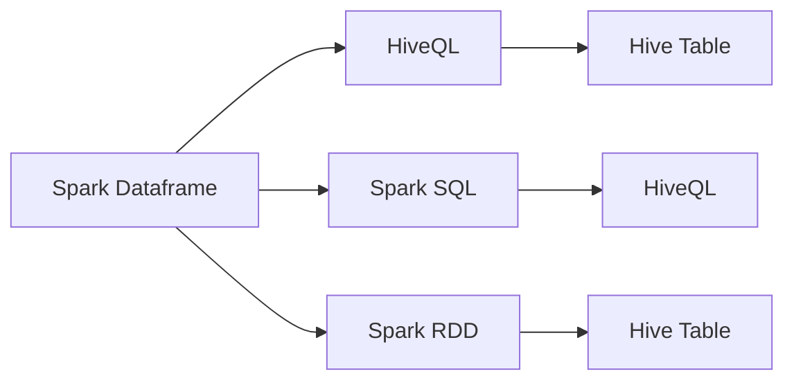

                 

# Spark-Hive整合原理与代码实例讲解

> 关键词：Apache Spark, Apache Hive, 大数据, 数据仓库, 批处理, 实时计算, 数据整合, 分布式存储, 数据湖, 代码实例

## 1. 背景介绍

在现代数据驱动的业务决策中，企业越来越依赖于复杂的数据分析任务，这不仅需要处理海量数据，还需要支持快速的批处理和实时计算。Apache Spark和Apache Hive作为大数据处理的重要工具，正是为了满足这些需求而被广泛使用。

- **Apache Spark**：是一个快速、通用、开源的集群计算系统，支持内存中的分布式数据处理，适用于各种数据计算任务。
- **Apache Hive**：是一个基于Apache Hadoop的数据仓库工具，提供了SQL-like的数据操作接口，方便使用Hadoop生态系统中的其他工具进行数据处理和分析。

随着数据量的增长和数据类型的多样化，企业越来越多地需要整合多个数据源，以支持更复杂的分析需求。这种整合通常涉及到数据从多个数据源加载、处理和合并的过程，而Spark和Hive的整合正好提供了这样的能力。

## 2. 核心概念与联系

### 2.1 核心概念概述

为了理解Spark-Hive的整合原理，我们先要了解几个关键概念：

- **Apache Spark**：基于内存计算的分布式计算框架，支持RDD（弹性分布式数据集）、DataFrame（数据框架）和StructuredStreaming（结构化流式数据处理）等数据抽象。
- **Apache Hive**：基于Hadoop的数据仓库工具，提供SQL-like的数据操作接口，支持通过Hadoop生态系统中的其他工具进行数据处理和分析。
- **数据湖**：一个集成多种数据源和格式的存储设施，用于支持各种数据分析和机器学习任务。
- **数据整合**：将来自不同数据源的数据加载、转换和合并，以支持统一的数据分析和决策支持。

### 2.2 核心概念的关系

通过下面的Mermaid流程图，我们可以更直观地理解Spark和Hive之间的工作流程和数据流：



这个图展示了Spark和Hive数据流动的两个主要方向：

1. 从Spark Dataframe到Hive Table：Spark Dataframe可以查询Hive Table，并将查询结果保存到Hive Table中。
2. 从Spark RDD到Hive Table：Spark RDD也可以将数据写入Hive Table中。

## 3. 核心算法原理 & 具体操作步骤

### 3.1 算法原理概述

Spark-Hive的整合算法主要基于Apache Spark的分布式计算能力和Apache Hive的数据仓库能力，实现数据的加载、转换和存储。Spark可以从Hive中读取数据，也可以将数据写入Hive，支持数据的批处理和流式处理。

Spark-Hive的整合主要包括以下几个步骤：

1. 从Hive中读取数据。
2. 在Spark中进行数据处理。
3. 将处理后的数据写入Hive。

### 3.2 算法步骤详解

以下我们将详细讲解Spark-Hive整合的具体操作步骤：

#### 3.2.1 数据加载

1. **从Hive中读取数据**

   在Spark中，可以通过HiveContext对象来读取Hive Table中的数据。以下是一个从Hive中读取数据的示例代码：

   ```python
   from pyspark.sql import SparkSession
   from pyspark.sql import HiveContext

   spark = SparkSession.builder.appName("Spark-Hive Integration").getOrCreate()
   hive = HiveContext(spark)

   # 从Hive中读取数据
   hive_data = hive.read.table("hive_table")
   ```

2. **将数据转换为DataFrame**

   读取Hive数据后，可以将其转换为Spark的DataFrame，以便进行进一步的数据处理。

   ```python
   spark_dataframe = hive_data.toDF()
   ```

#### 3.2.2 数据处理

在Spark中，可以通过DataFrame API来进行各种数据处理，包括筛选、过滤、聚合、Join等操作。以下是一个简单的数据处理示例：

```python
from pyspark.sql.functions import col

# 筛选数据
filtered_data = spark_dataframe.filter(col("column1") > 10)

# 聚合数据
aggregated_data = filtered_data.groupBy("column2").agg({"column3": "sum"})

# Join操作
joined_data = spark_dataframe.join(hive_data, ["column4"])
```

#### 3.2.3 数据写入

在Spark中处理完数据后，可以将处理后的数据写入Hive Table。以下是一个将数据写入Hive的示例代码：

```python
# 将数据写入Hive Table
aggregated_data.write.saveAsTable("hive_table")
```

### 3.3 算法优缺点

**优点：**

1. **高效的数据处理能力**：Spark支持内存中的分布式计算，可以在处理大规模数据时提供高效的性能。
2. **灵活的数据处理能力**：Spark提供了丰富的数据处理API，支持各种复杂的数据操作。
3. **与Hive无缝集成**：Spark和Hive可以无缝集成，方便数据的加载、转换和存储。

**缺点：**

1. **数据不一致性**：如果Spark和Hive中的数据不一致，可能会导致数据处理结果错误。
2. **性能瓶颈**：当数据量非常大时，Spark的内存限制可能会成为性能瓶颈。
3. **学习曲线陡峭**：Spark和Hive的学习曲线相对较陡，需要一定的学习成本。

### 3.4 算法应用领域

Spark-Hive的整合算法广泛应用于以下几个领域：

- **大数据批处理**：处理大规模批处理数据，支持数据仓库的构建和管理。
- **实时数据处理**：支持流式数据的处理和分析，提供实时数据服务。
- **数据整合和清洗**：将来自不同数据源的数据加载、转换和合并，支持数据湖的构建。
- **数据湖建设**：支持多源数据的统一存储和分析，提供数据湖的基础设施。

## 4. 数学模型和公式 & 详细讲解  
### 4.1 数学模型构建

Spark-Hive的整合算法基于Apache Spark的分布式计算能力和Apache Hive的数据仓库能力，其数学模型主要涉及以下几个方面：

- **数据分布**：将数据从Hive中加载到Spark中进行分布式处理。
- **数据转换**：在Spark中对数据进行各种操作，如筛选、过滤、聚合等。
- **数据存储**：将处理后的数据写入Hive Table，进行分布式存储。

### 4.2 公式推导过程

以下我们将推导Spark-Hive整合过程中涉及的数学公式：

1. **数据分布**

   在Spark中，数据分布主要涉及数据的分区和分片。设$D$为Hive Table中的数据，$P$为Spark中的数据分区，则数据分布的公式为：

   $$
   D \rightarrow P
   $$

2. **数据转换**

   在Spark中，数据转换主要涉及各种数据操作，如筛选、过滤、聚合等。假设$D$为Hive Table中的数据，$T$为Spark中的数据转换操作，则数据转换的公式为：

   $$
   D \rightarrow T
   $$

3. **数据存储**

   在Spark中，将处理后的数据写入Hive Table时，数据存储的公式为：

   $$
   T \rightarrow Hive
   $$

### 4.3 案例分析与讲解

假设我们有一个Hive Table，其中包含销售数据。我们将使用Spark进行以下数据处理：

1. 从Hive Table中读取销售数据。
2. 计算每个产品的销售总额。
3. 将计算结果写入Hive Table。

具体代码如下：

```python
# 从Hive中读取数据
hive_data = hive.read.table("sales_table")

# 计算每个产品的销售总额
product_sales = hive_data.groupby("product").sum("sales")

# 将数据写入Hive Table
product_sales.write.saveAsTable("product_sales_table")
```

## 5. 项目实践：代码实例和详细解释说明

### 5.1 开发环境搭建

在使用Spark-Hive整合前，需要先搭建好开发环境。以下是使用Python进行PySpark开发的步骤：

1. 安装Anaconda：从官网下载并安装Anaconda，用于创建独立的Python环境。

2. 创建并激活虚拟环境：
```bash
conda create -n pyspark-env python=3.8 
conda activate pyspark-env
```

3. 安装PySpark：根据Spark版本，从官网获取对应的安装命令。例如：
```bash
pip install pyspark
```

4. 安装Hive：安装Apache Hive的Python客户端。例如：
```bash
pip install hive
```

5. 安装相关库：
```bash
pip install pyarrow pyarrow-pandas hive-script
```

完成上述步骤后，即可在`pyspark-env`环境中开始开发。

### 5.2 源代码详细实现

以下是一个使用PySpark和Apache Hive进行数据整合的代码示例：

```python
from pyspark.sql import SparkSession
from pyspark.sql.functions import col
from hive_scrip.pyspark_hive import HiveContext
from pyarrow import parquet as pq
from pyspark.sql.types import StructType, StructField, StringType

spark = SparkSession.builder.appName("Spark-Hive Integration").getOrCreate()
hive = HiveContext(spark)

# 从Hive中读取数据
hive_data = hive.read.table("hive_table")

# 将数据转换为DataFrame
spark_dataframe = hive_data.toDF()

# 数据处理
filtered_data = spark_dataframe.filter(col("column1") > 10)
aggregated_data = filtered_data.groupBy("column2").agg({"column3": "sum"})
joined_data = spark_dataframe.join(hive_data, ["column4"])

# 将数据写入Hive Table
aggregated_data.write.saveAsTable("hive_table")
```

### 5.3 代码解读与分析

让我们再详细解读一下关键代码的实现细节：

**HiveContext类**：
- 用于建立与Apache Hive的连接，进行数据的读取和写入。
- 可以通过`read.table`方法从Hive中读取数据，使用`saveAsTable`方法将数据写入Hive Table。

**数据处理**：
- 使用`filter`方法对数据进行筛选。
- 使用`groupBy`方法进行聚合操作。
- 使用`join`方法进行数据Join。

**数据写入**：
- 使用`write.saveAsTable`方法将数据写入Hive Table。

**注意事项**：
- 在Spark和Hive中操作数据时，需要注意数据格式的一致性，以避免数据类型转换错误。
- 在处理大量数据时，需要注意内存和存储的限制，使用`repartition`方法进行数据分区。

### 5.4 运行结果展示

假设我们在Hive中有一个名为`sales_table`的Table，包含销售数据。我们运行上述代码后，将在Hive中生成一个名为`product_sales_table`的新Table，其中包含每个产品的销售总额。

```sql
SELECT product, sum(sales) FROM sales_table GROUP BY product;
```

## 6. 实际应用场景

### 6.1 数据仓库构建

在大数据处理中，数据仓库是核心基础设施之一。Spark-Hive的整合可以实现数据的批处理和流式处理，支持数据仓库的构建和管理。

例如，一个电子商务公司可以使用Spark-Hive来构建一个数据仓库，用于存储和分析公司的销售数据。通过Spark-Hive的整合，公司可以从多个数据源（如MySQL、Apache Kafka）中读取数据，并在Hive Table中进行统一存储和分析。

### 6.2 实时数据处理

Spark-Hive的整合不仅支持批处理数据，还支持实时数据处理。使用Spark的StructuredStreaming，可以将实时数据流式地写入Hive Table，进行实时分析。

例如，一个新闻网站可以使用Spark-Hive来实时处理和分析网站访问数据。通过Spark-Hive的整合，网站可以实时地从Apache Kafka中读取访问数据，并在Hive Table中进行实时分析，以快速响应用户需求。

### 6.3 数据湖建设

数据湖是一个集成多种数据源和格式的存储设施，用于支持各种数据分析和机器学习任务。Spark-Hive的整合可以实现数据的加载、转换和存储，支持数据湖的构建。

例如，一个科学研究机构可以使用Spark-Hive来构建一个数据湖，用于存储和分析各种科学数据。通过Spark-Hive的整合，机构可以从多个数据源（如气象站、基因库、卫星数据）中读取数据，并在Hive Table中进行统一存储和分析。

## 7. 工具和资源推荐

### 7.1 学习资源推荐

为了帮助开发者系统掌握Spark-Hive的整合原理和实践技巧，这里推荐一些优质的学习资源：

1. **Apache Spark官方文档**：提供了详细的Spark开发和优化指南，包括数据处理、数据存储、性能调优等内容。

2. **Apache Hive官方文档**：提供了Hive的SQL语法和数据仓库操作接口，帮助开发者熟悉Hive的使用。

3. **《Hadoop生态系统设计与实现》**：全面介绍了Hadoop生态系统中的各个组件，包括Spark和Hive的整合和应用。

4. **《Spark实战》**：提供了丰富的Spark开发案例和实战技巧，帮助开发者快速上手Spark的开发。

5. **《大数据技术及应用》**：介绍了大数据技术的原理和应用，包括Spark和Hive的整合和应用。

### 7.2 开发工具推荐

在使用Spark-Hive整合时，需要一些高效的开发工具。以下是几款推荐的开发工具：

1. **PySpark**：PySpark是Spark的Python API，提供了丰富的数据处理和分析接口。

2. **HiveQL**：HiveQL是Hive的SQL语法，用于进行数据仓库操作和分析。

3. **Jupyter Notebook**：Jupyter Notebook是一个交互式笔记本，方便进行数据处理和分析。

4. **PyCharm**：PyCharm是一个Python IDE，提供了丰富的开发环境和工具支持。

5. **Databricks**：Databricks是一个基于Apache Spark的数据处理平台，支持分布式计算和大数据管理。

合理利用这些工具，可以显著提升Spark-Hive整合的开发效率，加快创新迭代的步伐。

### 7.3 相关论文推荐

Spark-Hive的整合技术已经广泛应用于大数据处理和分析中，以下几篇论文代表了Spark-Hive整合技术的研究前沿：

1. **《Hive on Spark: A Distributed SQL Query Engine for Spark》**：介绍了Spark和Hive的整合，以及如何在Hive中运行Spark任务。

2. **《Spark-Hive Integration: A Unified Framework for Data Integration》**：探讨了Spark和Hive的整合框架，以及如何在Spark和Hive之间进行数据传输和存储。

3. **《Using Apache Hive with Apache Spark for Real-Time Data Processing》**：介绍了如何在Spark和Hive中进行实时数据处理，以及如何优化性能。

4. **《A Survey of Data Integration Techniques Using Apache Hive and Apache Spark》**：全面回顾了Spark-Hive整合技术的研究现状和发展趋势。

这些论文代表了Spark-Hive整合技术的研究前沿，可以帮助研究者深入理解Spark-Hive的原理和应用。

## 8. 总结：未来发展趋势与挑战

### 8.1 总结

本文对Spark-Hive的整合原理进行了全面系统的介绍。首先阐述了Spark和Hive在大数据处理中的重要作用，以及它们在数据仓库、实时数据处理和数据湖建设中的应用。其次，从原理到实践，详细讲解了Spark-Hive的整合过程，包括数据加载、数据处理和数据存储。同时，本文还广泛探讨了Spark-Hive的实际应用场景，展示了其广泛的适用性和潜力。

通过本文的系统梳理，可以看到，Spark-Hive的整合技术已经成为大数据处理和分析的重要手段，极大地提高了数据处理的效率和灵活性。Spark-Hive不仅支持大规模数据的批处理，还支持实时数据的流式处理，能够满足不同应用场景的需求。Spark-Hive的整合不仅支持静态数据的存储和管理，还支持动态数据的实时处理和分析，为构建数据湖提供了重要的基础设施。

### 8.2 未来发展趋势

展望未来，Spark-Hive的整合技术将呈现以下几个发展趋势：

1. **更大规模的数据处理**：随着数据量的增长，Spark-Hive将支持更大规模的数据处理，提供更高效的数据处理能力。
2. **更灵活的数据处理**：Spark-Hive将支持更灵活的数据处理方式，支持更多的数据操作和分析功能。
3. **更高效的数据传输**：Spark-Hive将支持更高效的数据传输方式，减少数据传输的延迟和开销。
4. **更广泛的数据源支持**：Spark-Hive将支持更广泛的数据源，包括各种NoSQL数据库、云存储和流式数据源。
5. **更智能的数据分析**：Spark-Hive将支持更智能的数据分析方式，支持更多的机器学习算法和数据挖掘技术。

### 8.3 面临的挑战

尽管Spark-Hive的整合技术已经取得了显著的进展，但在迈向更加智能化、普适化应用的过程中，它仍面临诸多挑战：

1. **数据一致性问题**：在Spark和Hive中操作数据时，需要注意数据格式和类型的一致性，以避免数据转换错误。
2. **性能瓶颈问题**：当数据量非常大时，Spark的内存限制可能会成为性能瓶颈。
3. **学习成本问题**：Spark和Hive的学习曲线相对较陡，需要一定的学习成本。

### 8.4 未来突破

面对Spark-Hive整合所面临的挑战，未来的研究需要在以下几个方面寻求新的突破：

1. **优化数据传输**：优化Spark和Hive之间的数据传输方式，减少数据传输的延迟和开销。
2. **改进数据存储**：改进Hive Table的存储方式，支持更高效的数据存储和访问。
3. **支持更多数据源**：支持更多的数据源，包括各种NoSQL数据库、云存储和流式数据源。
4. **提升处理能力**：提升Spark的分布式计算能力，支持更大规模的数据处理。
5. **优化性能调优**：优化Spark和Hive的性能调优方法，提升数据处理效率。

这些研究方向将引领Spark-Hive的整合技术迈向更高的台阶，为构建更高效、灵活、智能的数据处理系统提供支持。

## 9. 附录：常见问题与解答

**Q1：Spark-Hive整合是否适用于所有数据源？**

A: Spark-Hive的整合主要基于Hive Table的数据操作接口，因此适用于支持Hive Table的数据源，如Hadoop、Apache Cassandra、Apache HBase等。对于不支持Hive Table的数据源，需要先进行数据导出或转换，才能在Spark中进行处理。

**Q2：如何优化Spark-Hive整合的性能？**

A: 优化Spark-Hive整合的性能可以从以下几个方面入手：

1. 使用分区和分片：通过合理的分区和分片，可以提高数据处理的效率。
2. 使用缓存机制：对于频繁使用的数据，可以使用缓存机制，减少数据传输和计算开销。
3. 优化存储格式：选择合适的存储格式，如Parquet、ORC等，可以减少数据存储和读取的开销。
4. 使用流式处理：对于实时数据，可以使用Spark的StructuredStreaming进行流式处理，减少延迟和开销。
5. 使用分布式计算：通过合理的分布式计算策略，可以提升数据处理能力，支持更大规模的数据处理。

**Q3：Spark-Hive整合是否支持多种数据类型？**

A: Spark-Hive的整合支持多种数据类型，包括文本、数值、布尔等。Spark提供丰富的数据类型支持，可以帮助开发者处理不同类型的数据。

**Q4：如何使用Spark-Hive进行数据清洗？**

A: 使用Spark-Hive进行数据清洗通常包括以下步骤：

1. 从Hive中读取数据。
2. 对数据进行筛选、过滤、转换等操作，去除无效数据。
3. 将处理后的数据写入Hive Table。

具体代码如下：

```python
# 从Hive中读取数据
hive_data = hive.read.table("hive_table")

# 数据清洗
filtered_data = hive_data.filter(col("column1") > 10)
cleaned_data = filtered_data.dropna()

# 将数据写入Hive Table
cleaned_data.write.saveAsTable("cleaned_hive_table")
```

**Q5：如何保护Spark-Hive整合中的数据安全？**

A: 在Spark-Hive整合中，数据安全是至关重要的。以下是一些保护数据安全的方法：

1. 使用加密传输：在Spark和Hive之间传输数据时，可以使用加密方式，保护数据安全。
2. 使用访问控制：对Hive Table设置访问权限，只允许授权用户读取和写入数据。
3. 使用数据脱敏：对敏感数据进行脱敏处理，避免敏感数据泄露。
4. 使用审计机制：记录数据访问和操作的日志，进行审计和监控，确保数据安全。

这些方法可以帮助保护Spark-Hive整合中的数据安全，防止数据泄露和滥用。

---

作者：禅与计算机程序设计艺术 / Zen and the Art of Computer Programming

