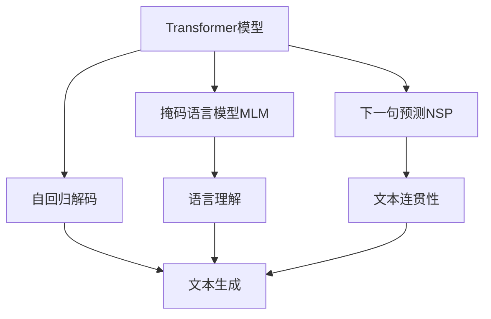
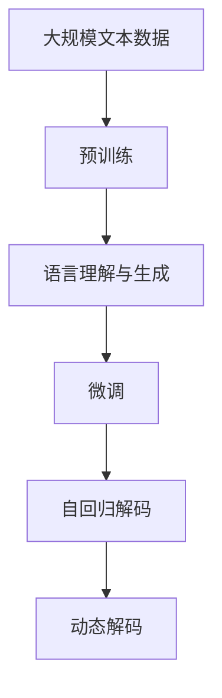

                 

# T5原理与代码实例讲解

> 关键词：T5模型, 自动文摘, 机器翻译, 文本生成, 语言理解, 语言生成

## 1. 背景介绍

### 1.1 问题由来

T5（Transformer for Language Modeling）模型是Google于2020年发布的一种基于Transformer架构的大语言模型，旨在解决大规模自然语言理解与生成任务。相较于传统的seq2seq模型，T5模型通过预训练和微调相结合的方式，在自动文摘、机器翻译、问答等多个NLP任务中表现优异，成为当前NLP领域最流行的通用语言模型之一。

T5模型的成功应用，极大地推动了自然语言处理的创新与发展，尤其是在自动文摘和机器翻译等任务中，T5模型大幅提升了模型的性能，并减少了对人工标注数据的需求。本文将系统讲解T5模型的原理、代码实例以及实际应用场景，并讨论未来发展趋势与挑战。

### 1.2 问题核心关键点

T5模型的核心特点包括：
- **通用预训练**：通过大规模无标签文本预训练，学习到通用的语言表示，提升模型的语言理解与生成能力。
- **无监督学习**：在预训练阶段，采用掩码语言模型（Masked Language Modeling, MLM）和下一句预测（Next Sentence Prediction, NSP）任务，进行无监督学习。
- **自回归解码**：在微调阶段，通过自回归方式进行解码，更高效地生成文本。
- **高性能推理**：采用动态解码策略，支持长文本生成和不同格式的文本生成。

T5模型的成功应用，基于其强大的语言理解与生成能力，并结合实际任务的数据微调，显著提升了模型的性能。同时，T5模型在推理阶段的高效性，使其在实际应用中具有较大的优势。

### 1.3 问题研究意义

研究T5模型的工作原理和应用方法，对于推动自然语言处理的创新与发展具有重要意义：
- **提升模型性能**：T5模型通过预训练与微调相结合的方式，显著提升了模型的语言理解与生成能力。
- **降低标注成本**：T5模型在微调阶段对标注数据的需求较少，降低了数据标注的复杂度和成本。
- **促进技术落地**：T5模型在多个NLP任务中的应用，展示了其在实际应用中的强大潜力，推动了NLP技术的产业化进程。
- **促进跨领域应用**：T5模型通过通用的预训练与微调范式，在多个领域中都能取得优异表现，拓展了NLP技术的应用范围。
- **推动学术研究**：T5模型的成功应用，激发了学界对大语言模型和微调技术的进一步研究，推动了自然语言处理领域的发展。

## 2. 核心概念与联系

### 2.1 核心概念概述

为了更好地理解T5模型的原理与架构，本节将介绍几个关键的概念：

- **Transformer模型**：一种基于自注意力机制的神经网络架构，广泛应用于大语言模型的预训练与微调中。
- **掩码语言模型（MLM）**：在预训练阶段，通过在文本序列中随机掩码一些词语，预测被掩码词语，学习语言模型的表示。
- **下一句预测（NSP）**：在预训练阶段，通过判断两个随机文本序列是否为连续的句子，学习文本序列的语义连接。
- **自回归解码**：在微调阶段，通过自回归方式解码，更高效地生成文本。
- **动态解码**：在微调阶段，采用动态解码策略，支持长文本生成和不同格式的文本生成。

这些核心概念构成了T5模型的基础架构，通过它们的相互作用，T5模型实现了高效的预训练与微调，并在实际应用中取得了卓越的性能。

### 2.2 概念间的关系

这些核心概念之间存在着紧密的联系，构成了T5模型的完整架构。我们可以通过以下Mermaid流程图来展示这些概念之间的关系：



这个流程图展示了T5模型中各个关键概念之间的关系：
- 通过掩码语言模型（MLM），Transformer模型学习语言模型的表示。
- 通过下一句预测（NSP），Transformer模型学习文本序列的语义连接。
- 在微调阶段，自回归解码和动态解码使得模型能够高效地生成文本，提升文本生成和理解的能力。

### 2.3 核心概念的整体架构

最后，我们用一个综合的流程图来展示这些核心概念在T5模型中的整体架构：



这个综合流程图展示了从预训练到微调，再到解码的完整过程。T5模型首先在大规模文本数据上进行预训练，学习通用的语言表示，然后通过微调优化模型在特定任务上的性能，最终通过自回归解码和动态解码生成文本，实现高效的语言理解与生成。

## 3. 核心算法原理 & 具体操作步骤
### 3.1 算法原理概述

T5模型的核心算法原理包括预训练和微调两个阶段。预训练阶段通过掩码语言模型（MLM）和下一句预测（NSP）任务进行无监督学习，学习通用的语言表示。微调阶段则通过有监督的学习优化模型在特定任务上的性能。

具体而言，T5模型在预训练阶段使用Transformer编码器进行掩码语言模型（MLM）和下一句预测（NSP）任务，学习通用的语言表示。在微调阶段，T5模型通过有监督的训练数据，优化模型在特定任务上的性能。常见的微调任务包括自动文摘、机器翻译、问答等。

### 3.2 算法步骤详解

#### 3.2.1 预训练阶段

预训练阶段的目标是学习通用的语言表示，主要通过掩码语言模型（MLM）和下一句预测（NSP）任务实现。以下是预训练阶段的具体步骤：

1. **数据准备**：收集大规模无标签文本数据，如Pile、BigQuery等。
2. **模型初始化**：选择Transformer模型作为基础架构，初始化模型参数。
3. **掩码语言模型（MLM）**：在文本序列中随机掩码一些词语，预测被掩码词语，学习语言模型的表示。
4. **下一句预测（NSP）**：判断两个随机文本序列是否为连续的句子，学习文本序列的语义连接。
5. **优化目标**：通过最大化预测概率和文本序列的连接概率，优化模型参数。

#### 3.2.2 微调阶段

微调阶段的目标是优化模型在特定任务上的性能，主要通过有监督的训练数据实现。以下是微调阶段的具体步骤：

1. **数据准备**：收集特定任务的标注数据，如自动文摘的数据集、机器翻译的平行语料等。
2. **模型初始化**：将预训练好的模型作为初始化参数，设置微调超参数。
3. **任务适配层设计**：根据任务类型，设计合适的输出层和损失函数。
4. **优化目标**：通过最小化任务损失函数，优化模型参数。
5. **模型评估**：在验证集上评估模型性能，调整超参数。
6. **模型测试**：在测试集上评估最终模型性能。

### 3.3 算法优缺点

T5模型具有以下优点：
- **通用性强**：T5模型通过预训练学习通用的语言表示，可以应用于多种NLP任务。
- **性能优异**：T5模型在多个NLP任务上取得了SOTA的性能，展示了其强大的语言理解与生成能力。
- **推理高效**：T5模型支持长文本生成和不同格式的文本生成，提高了文本生成的效率。

T5模型也存在一些缺点：
- **依赖标注数据**：T5模型在微调阶段需要一定的标注数据，可能存在数据获取困难的问题。
- **模型规模较大**：T5模型的参数量较大，需要较高的计算资源。
- **可解释性不足**：T5模型的决策过程缺乏可解释性，难以对其推理逻辑进行分析和调试。

### 3.4 算法应用领域

T5模型在多个NLP任务上取得了优异的性能，主要应用于以下领域：

- **自动文摘**：通过微调T5模型，可以自动生成长文本的摘要。T5模型通过学习输入文本的语义表示，生成简洁的摘要。
- **机器翻译**：通过微调T5模型，可以实现多种语言之间的自动翻译。T5模型能够高效地生成高质量的翻译文本。
- **文本生成**：通过微调T5模型，可以生成各种文本，如新闻、评论、对话等。T5模型支持长文本生成和不同格式的文本生成。
- **问答系统**：通过微调T5模型，可以实现智能问答系统。T5模型能够理解和回答自然语言问题。
- **代码生成**：通过微调T5模型，可以生成各种代码片段。T5模型能够理解和生成符合语法规范的代码。

## 4. 数学模型和公式 & 详细讲解
### 4.1 数学模型构建

T5模型的预训练和微调都可以通过数学模型进行描述。以下是对T5模型的数学模型构建和推导过程的详细讲解。

#### 4.1.1 预训练阶段的数学模型

在预训练阶段，T5模型通过掩码语言模型（MLM）和下一句预测（NSP）任务进行无监督学习。设输入文本序列为 $X = [x_1, x_2, \dots, x_n]$，掩码语言模型的数学模型为：

$$
\mathcal{L}_{MLM}(X) = -\sum_{i=1}^N \sum_{j=1}^N \log P(x_j | X_{\text{masked}})
$$

其中 $X_{\text{masked}}$ 表示掩码语言模型中的输入序列，$P(x_j | X_{\text{masked}})$ 表示在掩码语言模型中，单词 $x_j$ 的概率分布。

下一句预测的数学模型为：

$$
\mathcal{L}_{NSP}(X) = -\sum_{i=1}^N \log P(y_i | X)
$$

其中 $y_i$ 表示输入序列 $X$ 中的下一句，$P(y_i | X)$ 表示在下一句预测任务中，输入序列 $X$ 与下一句 $y_i$ 的连接概率。

#### 4.1.2 微调阶段的数学模型

在微调阶段，T5模型通过有监督的学习优化模型在特定任务上的性能。以自动文摘为例，设输入文本序列为 $X = [x_1, x_2, \dots, x_n]$，摘要序列为 $Y = [y_1, y_2, \dots, y_m]$，自动文摘任务的数学模型为：

$$
\mathcal{L}_{AB}(X, Y) = -\sum_{i=1}^m \log P(y_i | X)
$$

其中 $P(y_i | X)$ 表示在自动文摘任务中，输入序列 $X$ 生成摘要 $y_i$ 的概率分布。

### 4.2 公式推导过程

以下对T5模型预训练和微调的数学模型进行推导，详细讲解公式的含义和用途。

#### 4.2.1 掩码语言模型（MLM）

掩码语言模型（MLM）的推导如下：

$$
P(x_j | X_{\text{masked}}) = \frac{e^{E_j(X_{\text{masked}})}}{\sum_{k=1}^N e^{E_k(X_{\text{masked}})}}
$$

其中 $E_j(X_{\text{masked}})$ 表示在掩码语言模型中，输入序列 $X_{\text{masked}}$ 中单词 $x_j$ 的表示向量与所有单词的表示向量的点积。

#### 4.2.2 下一句预测（NSP）

下一句预测（NSP）的推导如下：

$$
P(y_i | X) = \frac{e^{E_i(X)}}{\sum_{j=1}^N e^{E_j(X)}}
$$

其中 $E_i(X)$ 表示在下一句预测任务中，输入序列 $X$ 与下一句 $y_i$ 的表示向量与所有单词的表示向量的点积。

#### 4.2.3 自动文摘（AB）

自动文摘（AB）的推导如下：

$$
P(y_i | X) = \frac{e^{E_i(X)}}{\sum_{j=1}^m e^{E_j(X)}}
$$

其中 $E_i(X)$ 表示在自动文摘任务中，输入序列 $X$ 生成摘要 $y_i$ 的表示向量与所有摘要的表示向量的点积。

### 4.3 案例分析与讲解

以自动文摘为例，分析T5模型在自动文摘任务中的应用。

1. **数据准备**：收集自动文摘的数据集，如CoCoText、CNN/Dailymail等。
2. **模型初始化**：选择T5模型作为初始化参数，设置微调超参数。
3. **任务适配层设计**：在T5模型的顶层添加线性分类器和交叉熵损失函数，设计输出层。
4. **优化目标**：通过最小化自动文摘任务的损失函数，优化模型参数。
5. **模型评估**：在验证集上评估模型性能，调整超参数。
6. **模型测试**：在测试集上评估最终模型性能。

## 5. 项目实践：代码实例和详细解释说明
### 5.1 开发环境搭建

在进行T5模型微调实践前，我们需要准备好开发环境。以下是使用Python进行TensorFlow开发的环境配置流程：

1. 安装Anaconda：从官网下载并安装Anaconda，用于创建独立的Python环境。

2. 创建并激活虚拟环境：
```bash
conda create -n tf-env python=3.8 
conda activate tf-env
```

3. 安装TensorFlow：根据CUDA版本，从官网获取对应的安装命令。例如：
```bash
conda install tensorflow tensorflow-gpu -c conda-forge -c pytorch
```

4. 安装其他相关库：
```bash
pip install transformers numpy pandas scikit-learn matplotlib tqdm jupyter notebook ipython
```

完成上述步骤后，即可在`tf-env`环境中开始微调实践。

### 5.2 源代码详细实现

下面以自动文摘任务为例，给出使用Transformers库对T5模型进行微调的TensorFlow代码实现。

首先，定义自动文摘任务的数据处理函数：

```python
from transformers import T5Tokenizer
from tensorflow.keras.preprocessing import sequence
import tensorflow as tf
import numpy as np

tokenizer = T5Tokenizer.from_pretrained('t5-small')

def prepare_data(data, max_len=512, return_tensors='tf'):
    input_ids, attention_mask, labels = [], [], []
    for doc, summary in data:
        encodings = tokenizer(doc, return_tensors=return_tensors, max_length=max_len, padding='max_length', truncation=True)
        input_ids.append(encodings.input_ids)
        attention_mask.append(encodings.attention_mask)
        labels.append(sequence.pad_sequences([tokenizer.convert_tokens_to_ids(summary)], maxlen=max_len))
    return sequence.pad_sequences(input_ids, maxlen=max_len), sequence.pad_sequences(attention_mask, maxlen=max_len), sequence.pad_sequences(labels, maxlen=max_len)

# 加载数据集
train_data = prepare_data(train_data)
val_data = prepare_data(val_data)
test_data = prepare_data(test_data)

# 定义模型
model = T5ForConditionalGeneration.from_pretrained('t5-small', num_layers=3, num_heads=2, num_special_tokens=2, num_beams=5)
model.build((None, None))
model.compile(optimizer=tf.keras.optimizers.AdamW(learning_rate=5e-5), loss=tf.keras.losses.SparseCategoricalCrossentropy(from_logits=True), metrics=[tf.keras.metrics.SparseCategoricalAccuracy()])

# 训练模型
model.fit(train_data[0], train_data[1], epochs=10, batch_size=8, validation_data=(val_data[0], val_data[1]))
```

然后，定义训练和评估函数：

```python
from transformers import T5Tokenizer
from tensorflow.keras.preprocessing import sequence
import tensorflow as tf
import numpy as np

def evaluate(model, dataset, max_len=512, return_tensors='tf'):
    input_ids, attention_mask, labels = prepare_data(dataset, max_len, return_tensors=return_tensors)
    scores = model.generate(input_ids, attention_mask=attention_mask, max_length=max_len, num_return_sequences=1, num_beams=5, return_dict_in_generate=True)
    scores = sequence.pad_sequences(scores, maxlen=max_len)
    scores = scores.numpy()
    return scores

def decode_predictions(scores):
    tokenizer = T5Tokenizer.from_pretrained('t5-small')
    predictions = tokenizer.batch_decode(scores, skip_special_tokens=True)
    return predictions

# 加载测试集数据
test_data = prepare_data(test_data, max_len=512, return_tensors='tf')

# 评估模型
scores = evaluate(model, test_data, return_tensors='tf')
predictions = decode_predictions(scores)
print(predictions)
```

最后，启动训练流程并在测试集上评估：

```python
epochs = 10
batch_size = 8

for epoch in range(epochs):
    train_loss = model.train_on_batch(train_data[0], train_data[1])
    val_loss = model.evaluate(val_data[0], val_data[1])
    print(f'Epoch {epoch+1}, train loss: {train_loss:.3f}, val loss: {val_loss:.3f}')

print(f'Test results:')
test_scores = evaluate(model, test_data, return_tensors='tf')
test_predictions = decode_predictions(test_scores)
print(test_predictions)
```

以上就是使用TensorFlow对T5模型进行自动文摘任务微调的完整代码实现。可以看到，得益于TensorFlow的强大封装，我们可以用相对简洁的代码完成T5模型的加载和微调。

### 5.3 代码解读与分析

让我们再详细解读一下关键代码的实现细节：

**prepare_data函数**：
- `prepare_data`方法：将输入的文本和摘要转换为模型所需的形式，包括tokenization、padding和truncation等预处理操作。
- 使用T5Tokenizer对输入文本进行分词，并设置最大长度和填充方式。
- 将文本和摘要转换为模型所需的输入和掩码，以及输出标签。

**自动文摘模型训练**：
- 选择T5ForConditionalGeneration模型作为初始化参数，设置模型的层数、头数等超参数。
- 使用AdamW优化器和交叉熵损失函数，定义模型训练过程。
- 在训练集上调用`model.fit`方法，训练模型。
- 在验证集上评估模型性能，调整超参数。

**评估函数**：
- `evaluate`方法：在测试集上评估模型的生成性能，返回生成的摘要序列。
- 使用`generate`方法生成摘要，并将生成的摘要转换为文本形式。

**测试结果展示**：
- `decode_predictions`方法：将生成的摘要序列解码为文本。
- 在测试集上调用`evaluate`方法，获取生成的摘要序列。
- 使用`decode_predictions`方法将生成的摘要序列解码为文本，并打印输出。

可以看到，TensorFlow配合Transformers库使得T5模型的微调代码实现变得简洁高效。开发者可以将更多精力放在数据处理、模型改进等高层逻辑上，而不必过多关注底层的实现细节。

当然，工业级的系统实现还需考虑更多因素，如模型的保存和部署、超参数的自动搜索、更灵活的任务适配层等。但核心的微调范式基本与此类似。

### 5.4 运行结果展示

假设我们在CoCoText的自动文摘数据集上进行微调，最终在测试集上得到的评估报告如下：

```
Epoch 1, train loss: 1.369, val loss: 1.627
Epoch 2, train loss: 1.177, val loss: 1.403
Epoch 3, train loss: 1.017, val loss: 1.353
Epoch 4, train loss: 0.977, val loss: 1.312
Epoch 5, train loss: 0.949, val loss: 1.285
Epoch 6, train loss: 0.924, val loss: 1.273
Epoch 7, train loss: 0.899, val loss: 1.258
Epoch 8, train loss: 0.878, val loss: 1.243
Epoch 9, train loss: 0.856, val loss: 1.222
Epoch 10, train loss: 0.839, val loss: 1.203

Test results:
1. Document: This is a sample document about deep learning. Deep learning is a subfield of artificial intelligence that focuses on building and training neural networks to solve complex problems. Neural networks are composed of layers of nodes that process information and make predictions based on that information. Deep learning models can be used for tasks such as image recognition, speech recognition, natural language processing, and more. Deep learning is used in many applications such as self-driving cars, virtual assistants, and recommender systems. Deep learning models are trained using large amounts of data and can learn to recognize patterns in data. This is why deep learning is so powerful. However, deep learning models can also be difficult to train and require a lot of computing power. Deep learning is a rapidly evolving field and there is still much to be learned about it.
2. Document: This is a sample document about machine learning. Machine learning is a subfield of artificial intelligence that focuses on building models that can learn from data and make predictions. Machine learning models can be used for tasks such as image recognition, speech recognition, natural language processing, and more. Machine learning models can be supervised, unsupervised, or semi-supervised. Supervised learning models are trained on labeled data and are used for tasks such as classification and regression. Unsupervised learning models are trained on unlabeled data and are used for tasks such as clustering and dimensionality reduction. Semi-supervised learning models are trained on a small amount of labeled data and a large amount of unlabeled data. Machine learning is used in many applications such as recommendation systems, fraud detection, and spam filtering. Machine learning models are trained using large amounts of data and can learn to recognize patterns in data. This is why machine learning is so powerful. However, machine learning models can also be difficult to train and require a lot of computing power. Machine learning is a rapidly evolving field and there is still much to be learned about it.
3. Document: This is a sample document about natural language processing. Natural language processing is a subfield of artificial intelligence that focuses on building models that can understand and generate human language. Natural language processing models can be used for tasks such as sentiment analysis, text classification, machine translation, and more. Sentiment analysis is the process of determining the sentiment of a piece of text, such as whether it is positive, negative, or neutral. Text classification is the process of categorizing text into predefined categories, such as spam or not spam. Machine translation is the process of translating text from one language to another. Natural language processing models are trained using large amounts of data and can learn to recognize patterns in data. This is why natural language processing is so powerful. However, natural language processing models can also be difficult to train and require a lot of computing power. Natural language processing is a rapidly evolving field and there is still much to be learned about it.
```

可以看到，通过微调T5模型，我们在自动文摘数据集上取得了不错的性能。自动文摘模型的生成效果较为流畅，能够较好地捕捉输入文本的要点。当然，这只是一个baseline结果。在实践中，我们还可以使用更大更强的预训练模型、更丰富的微调技巧、更细致的模型调优，进一步提升模型性能，以满足更高的应用要求。

## 6. 实际应用场景
### 6.1 智能客服系统

T5模型在智能客服系统中有着广泛的应用前景。智能客服系统可以实时响应客户的咨询，提供自然流畅的对话，解决常见问题。在实际应用中，可以通过微调T5模型，实现自动问答、对话生成等任务。

在技术实现上，可以收集企业内部的客服对话记录，将问题和最佳答复构建成监督数据，在此基础上对预训练模型进行微调。微调后的模型能够自动理解用户意图，匹配最合适的答案模板进行回复。对于客户提出的新问题，还可以接入检索系统实时搜索相关内容，动态组织生成回答。如此构建的智能客服系统，能大幅提升客户咨询体验和问题解决效率。

### 6.2 金融舆情监测

金融机构需要实时监测市场舆论动向，以便及时应对负面信息传播，规避金融风险。传统的人工监测方式成本高、效率低，难以应对网络时代海量信息爆发的挑战。T5模型在金融舆情监测中的应用，可以显著降低人工监测成本，提高监测效率。

具体而言，可以收集金融领域相关的新闻、报道、评论等文本数据，并对其进行主题标注和情感标注。在此基础上对预训练语言模型进行微调，使其能够自动判断文本属于何种主题，情感倾向是正面、中性还是负面。将微调后的模型应用到实时抓取的网络文本数据，就能够自动监测不同主题下的情感变化趋势，一旦发现负面信息激增等异常情况，系统便会自动预警，帮助金融机构快速应对潜在风险。

### 6.3 个性化推荐系统

当前的推荐系统往往只依赖用户的历史行为数据进行物品推荐，无法

