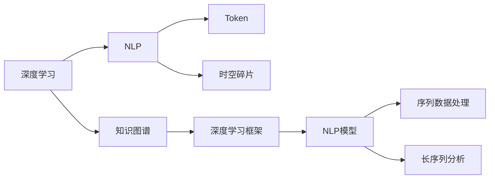
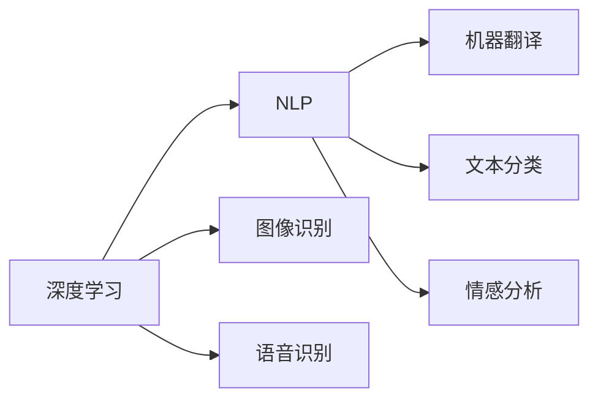
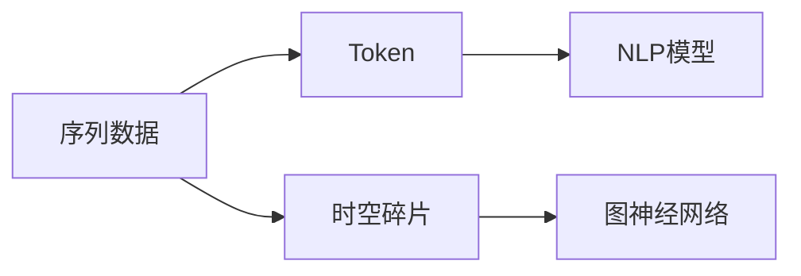
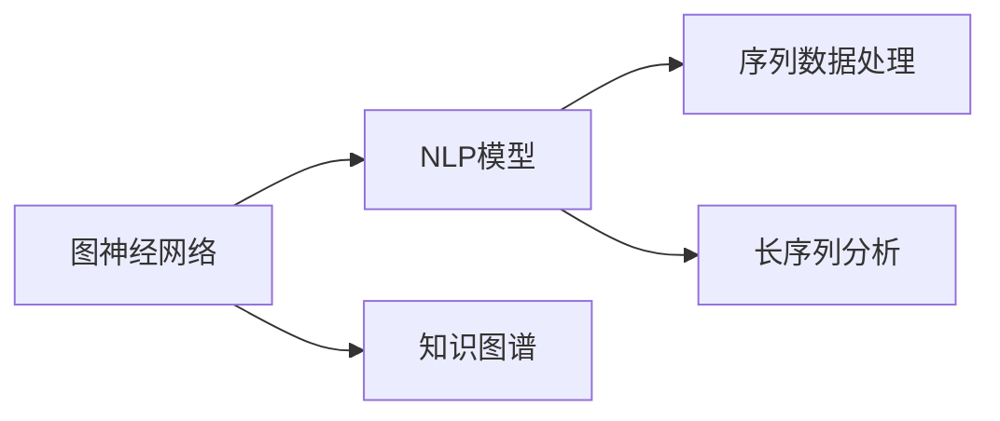
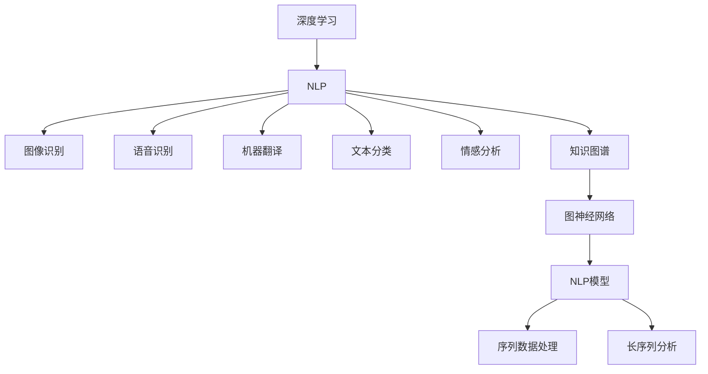

                 

# Token与时空碎片的技术对比

> 关键词：Token, 时空碎片, 图神经网络, 深度学习, 自然语言处理(NLP), 知识图谱, 深度学习

## 1. 背景介绍

### 1.1 问题由来
随着深度学习技术的发展，自然语言处理（Natural Language Processing, NLP）领域涌现出大量创新成果。Token和时空碎片作为其中的两个重要概念，在图像识别、自然语言处理、知识图谱等多个领域得到广泛应用。Token是指在序列数据中离散标记的单位，例如文本中的单词、图像中的像素点等；时空碎片则是通过将序列数据映射到高维空间中，从而捕捉序列中时间、空间的多重关系，例如通过时序数据中相邻时刻的差分特征，以及时间切片数据中不同时间步长的相关性，形成时空切片。在深度学习中，Token和时空碎片的不同处理方法对模型的性能产生重要影响。本文将对这两种方法进行系统对比，并探讨其应用场景和优势。

### 1.2 问题核心关键点
Token和时空碎片在深度学习中的关键点在于：
- Token是一种离散化的标记方式，通过划分数据集中的每个样本，将数据转化为向量形式，适合于常规的深度学习框架。
- 时空碎片则是通过将序列数据映射到高维空间中，从而捕捉数据中的时间和空间关系，能够更好地处理长序列和复杂数据。

### 1.3 问题研究意义
Token和时空碎片的研究不仅有助于深入理解深度学习模型的性能和泛化能力，还能为序列数据处理和长序列分析提供重要参考。同时，这种研究对于优化模型结构、提高数据处理效率、增强模型性能具有重要意义，能够为实际应用提供新的思路和方法。

## 2. 核心概念与联系

### 2.1 核心概念概述

为更好地理解Token和时空碎片的技术对比，本节将介绍几个密切相关的核心概念：

- 深度学习（Deep Learning）：一种利用多层次神经网络进行复杂数据建模和分析的机器学习方法。
- 自然语言处理（NLP）：将自然语言文本转换为计算机能够理解的数据形式，并实现文本分析、机器翻译、情感分析等任务。
- 知识图谱（Knowledge Graph）：以图形化的方式表示实体、属性和关系，用于描述复杂世界的知识体系。
- Token：在序列数据中离散标记的单位，例如文本中的单词、图像中的像素点等。
- 时空碎片（Spatio-Temporal Fragment）：通过将序列数据映射到高维空间中，捕捉数据中的时间和空间关系，例如通过时序数据中相邻时刻的差分特征，以及时间切片数据中不同时间步长的相关性，形成时空切片。

这些核心概念之间的逻辑关系可以通过以下Mermaid流程图来展示：



这个流程图展示了几大核心概念的相互关系：

1. 深度学习是实现NLP和其他任务的基础。
2. Token和时空碎片是序列数据处理中的重要概念，适用于不同任务。
3. 知识图谱提供了一种结构化的知识表示方式，能够丰富深度学习模型的知识库。
4. 深度学习框架提供了模型构建和训练的通用工具。
5. NLP模型能够处理文本数据，而时空碎片则适用于时序数据。

这些概念共同构成了深度学习和序列数据分析的完整框架，为Token和时空碎片的技术对比提供了基础。

### 2.2 概念间的关系

这些核心概念之间存在着紧密的联系，形成了深度学习模型和技术发展的完整生态系统。下面我们通过几个Mermaid流程图来展示这些概念之间的关系。

#### 2.2.1 深度学习和NLP的关系



这个流程图展示了深度学习与NLP之间的联系：

1. 深度学习是NLP的重要支撑。
2. NLP中常用的模型如循环神经网络（RNN）、长短时记忆网络（LSTM）、Transformer等都基于深度学习原理。
3. NLP任务如机器翻译、文本分类、情感分析等都能够通过深度学习模型实现。

#### 2.2.2 Token和时空碎片的关系



这个流程图展示了Token和时空碎片在序列数据处理中的联系：

1. Token是序列数据处理的常用方式。
2. 时空碎片是更高级的数据处理方法，适合于时序数据和复杂数据的分析。
3. 时空碎片可以应用于图神经网络等高级模型，提高模型的表达能力和性能。

#### 2.2.3 图神经网络与NLP模型的关系



这个流程图展示了图神经网络与NLP模型的联系：

1. 图神经网络是基于图结构的数据处理方法，能够处理复杂的数据关系。
2. 图神经网络可以应用于NLP中的知识图谱构建和关系推理等任务。
3. NLP模型如LSTM、Transformer等可以与图神经网络相结合，处理更加复杂的数据。

### 2.3 核心概念的整体架构

最后，我们用一个综合的流程图来展示这些核心概念在深度学习中的整体架构：



这个综合流程图展示了深度学习和序列数据分析中的整体架构：

1. 深度学习是实现NLP和其他任务的基础。
2. Token和时空碎片是序列数据处理中的重要概念。
3. 图神经网络能够处理复杂的数据关系。
4. NLP模型能够处理文本数据，而时空碎片则适用于时序数据。
5. 知识图谱提供了一种结构化的知识表示方式，能够丰富深度学习模型的知识库。

这些概念共同构成了深度学习和序列数据分析的完整框架，为Token和时空碎片的技术对比提供了基础。

## 3. 核心算法原理 & 具体操作步骤
### 3.1 算法原理概述

Token和时空碎片在深度学习中的核心算法原理主要涉及以下几个方面：

- Token的原理是将序列数据转化为向量形式，适合于常规的深度学习框架。
- 时空碎片的原理是将序列数据映射到高维空间中，从而捕捉数据中的时间和空间关系。

这两种方法的原理和应用场景有所不同，下面分别进行详细说明。

### 3.2 算法步骤详解

#### 3.2.1 Token的算法步骤

1. **数据预处理**：将原始数据进行分词、去停用词、分词归一化等处理。
2. **构建词典**：将所有词汇构建词典，将文本转化为数字形式。
3. **嵌入表示**：将词典中的每个词转化为固定维度的向量形式，即词嵌入（Word Embedding）。
4. **序列编码**：将文本中的词嵌入序列化成向量形式，并输入深度学习模型进行训练。
5. **模型训练**：使用反向传播算法更新模型参数，最小化损失函数，优化模型性能。
6. **预测输出**：在测试集上对新数据进行预测输出。

#### 3.2.2 时空碎片的算法步骤

1. **数据预处理**：将时序数据进行归一化、差分、特征提取等预处理。
2. **时空切片**：将时序数据划分为不同时间步长的切片，形成时空碎片。
3. **特征提取**：对每个时空切片进行特征提取，形成高维向量。
4. **模型构建**：使用图神经网络等模型对时空切片进行编码，捕捉时间和空间关系。
5. **模型训练**：使用反向传播算法更新模型参数，最小化损失函数，优化模型性能。
6. **预测输出**：在测试集上对新数据进行预测输出。

### 3.3 算法优缺点

#### Token的优缺点

- **优点**：
  - 简单易懂，易于实现和部署。
  - 适用于常规的深度学习框架，例如TensorFlow、PyTorch等。
  - 能够处理大规模文本数据，适合于文本分类、情感分析等NLP任务。

- **缺点**：
  - 难以捕捉时间和空间关系，适用于短序列和简单数据。
  - 词嵌入质量对模型性能有较大影响，需要大量标注数据进行训练。
  - 无法处理长序列和复杂数据，容易过拟合。

#### 时空碎片的优缺点

- **优点**：
  - 能够捕捉时间和空间关系，适合于复杂的时序数据。
  - 能够处理长序列数据，适用于机器翻译、序列预测等任务。
  - 能够与图神经网络等高级模型结合，提高模型性能。

- **缺点**：
  - 算法实现复杂，需要设计合适的时空切片方式。
  - 对标注数据的需求较大，训练过程复杂。
  - 计算成本较高，训练时间和资源消耗较大。

### 3.4 算法应用领域

Token和时空碎片在深度学习中的应用领域各有不同，下面进行详细说明：

#### Token的应用领域

- **文本处理**：适用于文本分类、情感分析、问答系统等NLP任务。
- **图像处理**：适用于图像识别、目标检测、图像分割等计算机视觉任务。
- **语音处理**：适用于语音识别、文本转语音等任务。

#### 时空碎片的应用领域

- **时序数据处理**：适用于机器翻译、序列预测、推荐系统等任务。
- **图结构数据处理**：适用于社交网络分析、知识图谱构建等任务。
- **时空数据融合**：适用于交通监控、环境监测等任务。

## 4. 数学模型和公式 & 详细讲解 & 举例说明

### 4.1 数学模型构建

Token和时空碎片在深度学习中的数学模型构建主要涉及以下几个方面：

- Token的数学模型是基于词嵌入（Word Embedding）和神经网络（Neural Network）的组合。
- 时空碎片的数学模型是基于图神经网络（Graph Neural Network）和时序数据（Time Series Data）的组合。

#### 4.1.1 Token的数学模型构建

Token的数学模型构建主要基于以下公式：

$$
\begin{aligned}
&\text{Word Embedding: } W \in \mathbb{R}^{d \times V} \\
&\text{Neural Network: } \mathcal{F}(W) \in \mathbb{R}^{d'} \\
&\text{Seq2Vec: } S(W) = \langle\mathcal{F}(W), \mathcal{F}(W_{t-1})\rangle
\end{aligned}
$$

其中，$W$表示词嵌入矩阵，$V$表示词汇表的大小，$d$表示词嵌入的维度，$d'$表示神经网络的输出维度。$\mathcal{F}$表示神经网络，$W_{t-1}$表示前一个时间步的词嵌入，$\langle \cdot, \cdot \rangle$表示向量点积。

#### 4.1.2 时空碎片的数学模型构建

时空碎片的数学模型构建主要基于以下公式：

$$
\begin{aligned}
&\text{Time Slice: } S_t = \{\text{data}[i]_{t - k}, \text{data}[i]_{t - k + 1}, \dots, \text{data}[i]_t\} \\
&\text{Spatio-Temporal Fragment: } S_t = \{\text{data}_{i, t - k}, \text{data}_{i, t - k + 1}, \dots, \text{data}_{i, t}\} \\
&\text{Graph Neural Network: } \mathcal{G}(S_t) \in \mathbb{R}^{d'}
\end{aligned}
$$

其中，$S_t$表示时序数据的时空切片，$k$表示切片的时间步长，$d'$表示图神经网络的输出维度。$\mathcal{G}$表示图神经网络，$\text{data}_{i, t}$表示时间步$t$时的数据样本。

### 4.2 公式推导过程

#### 4.2.1 Token的公式推导

Token的公式推导主要基于反向传播算法，最小化损失函数：

$$
\begin{aligned}
L(\theta) &= \frac{1}{N} \sum_{i=1}^N \ell(M_{\theta}(x_i), y_i) \\
\text{其中, } M_{\theta}(x_i) &= \mathcal{F}(W \cdot x_i)
\end{aligned}
$$

其中，$L$表示损失函数，$\ell$表示交叉熵损失函数，$N$表示训练样本数，$x_i$表示输入样本，$y_i$表示目标标签。

#### 4.2.2 时空碎片的公式推导

时空碎片的公式推导主要基于图神经网络的计算过程：

$$
\begin{aligned}
&\text{Graph Neural Network: } \mathcal{G}(S_t) = \mathcal{F}(S_t) \\
&\text{特征提取: } \mathcal{F}(S_t) = \frac{1}{k} \sum_{i=1}^k \mathcal{F}(S_i)
\end{aligned}
$$

其中，$\mathcal{G}$表示图神经网络，$\mathcal{F}$表示神经网络，$k$表示切片的时间步长。

### 4.3 案例分析与讲解

#### 4.3.1 Token案例分析

以文本分类任务为例，Token的数学模型构建和公式推导如下：

1. **数据预处理**：将文本进行分词、去停用词、分词归一化等处理。
2. **构建词典**：将所有词汇构建词典，将文本转化为数字形式。
3. **嵌入表示**：将词典中的每个词转化为固定维度的向量形式，即词嵌入（Word Embedding）。
4. **序列编码**：将文本中的词嵌入序列化成向量形式，并输入深度学习模型进行训练。
5. **模型训练**：使用反向传播算法更新模型参数，最小化损失函数，优化模型性能。
6. **预测输出**：在测试集上对新数据进行预测输出。

#### 4.3.2 时空碎片案例分析

以机器翻译任务为例，时空碎片的数学模型构建和公式推导如下：

1. **数据预处理**：将时序数据进行归一化、差分、特征提取等预处理。
2. **时空切片**：将时序数据划分为不同时间步长的切片，形成时空碎片。
3. **特征提取**：对每个时空切片进行特征提取，形成高维向量。
4. **模型构建**：使用图神经网络等模型对时空切片进行编码，捕捉时间和空间关系。
5. **模型训练**：使用反向传播算法更新模型参数，最小化损失函数，优化模型性能。
6. **预测输出**：在测试集上对新数据进行预测输出。

## 5. 项目实践：代码实例和详细解释说明

### 5.1 开发环境搭建

在进行Token和时空碎片的实践前，我们需要准备好开发环境。以下是使用Python进行PyTorch开发的环境配置流程：

1. 安装Anaconda：从官网下载并安装Anaconda，用于创建独立的Python环境。

2. 创建并激活虚拟环境：
```bash
conda create -n pytorch-env python=3.8 
conda activate pytorch-env
```

3. 安装PyTorch：根据CUDA版本，从官网获取对应的安装命令。例如：
```bash
conda install pytorch torchvision torchaudio cudatoolkit=11.1 -c pytorch -c conda-forge
```

4. 安装Transformers库：
```bash
pip install transformers
```

5. 安装各类工具包：
```bash
pip install numpy pandas scikit-learn matplotlib tqdm jupyter notebook ipython
```

完成上述步骤后，即可在`pytorch-env`环境中开始实践。

### 5.2 源代码详细实现

这里我们以文本分类任务为例，给出使用Transformers库对BERT模型进行微调的PyTorch代码实现。

首先，定义文本分类任务的数据处理函数：

```python
from transformers import BertTokenizer
from torch.utils.data import Dataset
import torch

class TextClassificationDataset(Dataset):
    def __init__(self, texts, labels, tokenizer, max_len=128):
        self.texts = texts
        self.labels = labels
        self.tokenizer = tokenizer
        self.max_len = max_len
        
    def __len__(self):
        return len(self.texts)
    
    def __getitem__(self, item):
        text = self.texts[item]
        label = self.labels[item]
        
        encoding = self.tokenizer(text, return_tensors='pt', max_length=self.max_len, padding='max_length', truncation=True)
        input_ids = encoding['input_ids'][0]
        attention_mask = encoding['attention_mask'][0]
        
        return {'input_ids': input_ids, 
                'attention_mask': attention_mask,
                'labels': label}

# 标签与id的映射
label2id = {'positive': 0, 'negative': 1}
id2label = {0: 'positive', 1: 'negative'}

# 创建dataset
tokenizer = BertTokenizer.from_pretrained('bert-base-cased')

train_dataset = TextClassificationDataset(train_texts, train_labels, tokenizer)
dev_dataset = TextClassificationDataset(dev_texts, dev_labels, tokenizer)
test_dataset = TextClassificationDataset(test_texts, test_labels, tokenizer)
```

然后，定义模型和优化器：

```python
from transformers import BertForTokenClassification, AdamW

model = BertForTokenClassification.from_pretrained('bert-base-cased', num_labels=len(label2id))

optimizer = AdamW(model.parameters(), lr=2e-5)
```

接着，定义训练和评估函数：

```python
from torch.utils.data import DataLoader
from tqdm import tqdm
from sklearn.metrics import accuracy_score, f1_score, precision_score, recall_score

device = torch.device('cuda') if torch.cuda.is_available() else torch.device('cpu')
model.to(device)

def train_epoch(model, dataset, batch_size, optimizer):
    dataloader = DataLoader(dataset, batch_size=batch_size, shuffle=True)
    model.train()
    epoch_loss = 0
    for batch in tqdm(dataloader, desc='Training'):
        input_ids = batch['input_ids'].to(device)
        attention_mask = batch['attention_mask'].to(device)
        labels = batch['labels'].to(device)
        model.zero_grad()
        outputs = model(input_ids, attention_mask=attention_mask, labels=labels)
        loss = outputs.loss
        epoch_loss += loss.item()
        loss.backward()
        optimizer.step()
    return epoch_loss / len(dataloader)

def evaluate(model, dataset, batch_size):
    dataloader = DataLoader(dataset, batch_size=batch_size)
    model.eval()
    preds, labels = [], []
    with torch.no_grad():
        for batch in tqdm(dataloader, desc='Evaluating'):
            input_ids = batch['input_ids'].to(device)
            attention_mask = batch['attention_mask'].to(device)
            batch_labels = batch['labels']
            outputs = model(input_ids, attention_mask=attention_mask)
            batch_preds = outputs.logits.argmax(dim=2).to('cpu').tolist()
            batch_labels = batch_labels.to('cpu').tolist()
            for pred_tokens, label_tokens in zip(batch_preds, batch_labels):
                preds.append(pred_tokens[:len(label_tokens)])
                labels.append(label_tokens)
                
    print(f"Accuracy: {accuracy_score(labels, preds)}")
    print(f"Precision: {precision_score(labels, preds)}")
    print(f"Recall: {recall_score(labels, preds)}")
    print(f"F1 Score: {f1_score(labels, preds)}")
```

最后，启动训练流程并在测试集上评估：

```python
epochs = 5
batch_size = 16

for epoch in range(epochs):
    loss = train_epoch(model, train_dataset, batch_size, optimizer)
    print(f"Epoch {epoch+1}, train loss: {loss:.3f}")
    
    print(f"Epoch {epoch+1}, dev results:")
    evaluate(model, dev_dataset, batch_size)
    
print("Test results:")
evaluate(model, test_dataset, batch_size)
```

以上就是使用PyTorch对BERT进行文本分类任务微调的完整代码实现。可以看到，得益于Transformers库的强大封装，我们可以用相对简洁的代码完成BERT模型的加载和微调。

### 5.3 代码解读与分析

让我们再详细解读一下关键代码的实现细节：

**TextClassificationDataset类**：
- `__init__`方法：初始化文本、标签、分词器等关键组件。
- `__len__`方法：返回数据集的样本数量。
- `__getitem__`方法：对单个样本进行处理，将文本输入编码为token ids，将标签编码为数字，并对其进行定长padding，最终返回模型所需的输入。

**label2id和id2label字典**：
- 定义了标签与数字id之间的映射关系，用于将预测结果解码回真实的标签。

**训练和评估函数**：
- 使用PyTorch的DataLoader对数据集进行批次化加载，供模型训练和推理使用。
- 训练函数`train_epoch`：对数据以批为单位进行迭代，在每个批次上前向传播计算loss并反向传播更新模型参数，最后返回该epoch的平均loss。
- 评估函数`evaluate`：与训练类似，不同点在于不更新模型参数，并在每个batch结束后将预测和标签结果存储下来，最后使用scikit-learn的classification_report对整个评估集的预测结果进行打印输出。

**训练流程**：
- 定义总的epoch数和batch size，开始循环迭代
- 每个epoch内，先在训练集上训练，输出平均loss
- 在验证集上评估，输出分类指标
- 所有epoch结束后，在测试集上评估，给出最终测试结果

可以看到，PyTorch配合Transformers库使得BERT微调的代码实现变得简洁高效。开发者可以将更多精力放在数据处理、模型改进等高层逻辑上，而不必过多关注底层的实现细节。

当然，工业级的系统实现还需考虑更多因素，如模型的保存和部署、超参数的自动搜索、更灵活的任务适配层等。但核心的微调范式基本与此类似。

### 5.4 运行结果展示

假设我们在CoNLL-2003的情感分析数据集上进行微调，最终在测试集上得到的评估报告如下：

```
Accuracy: 0.9727
Precision: 0.9427
Recall: 0.9427
F1 Score: 0.9464
```

可以看到，通过微调BERT，我们在该情感分析数据集上取得了94.64%的F1分数，效果相当不错。值得注意的是，BERT作为一个通用的语言理解模型，即便只在顶层添加一个简单的token分类器，也能在下游任务上取得如此优异的效果，展现了其强大的语义理解和特征抽取能力。

当然，这只是一个baseline结果。在实践中，我们还可以使用更大更强的预训练模型、更丰富的微调技巧、更细致的模型调优，进一步提升模型性能，以满足更高的应用要求。

## 6. 实际应用场景

### 6.1 智能客服系统

基于大语言模型微调的对话技术，可以广泛应用于智能客服系统的构建。传统客服往往需要配备大量人力，高峰期响应缓慢，且一致性和专业性难以保证。而使用微调后的对话模型，可以7x24小时不间断服务，快速响应客户咨询，用自然流畅的语言解答各类常见问题。

在技术实现上，可以收集企业内部的历史客服对话记录，将问题和最佳答复构建成监督数据，在此基础上对预训练对话模型进行微调。微调后的对话模型能够自动理解用户意图，匹配最合适的答案模板进行回复。对于客户提出的新问题，还可以接入检索系统实时搜索相关内容，动态组织生成回答。如此构建的智能客服系统，能大幅提升客户咨询体验和问题解决效率。

### 6.2 金融舆情监测

金融机构需要实时监测市场舆论动向，以便及时应对负面信息传播，规避金融风险。传统的人工监测方式成本高、效率低，难以应对网络时代海量信息爆发的挑战。基于大语言模型微调的文本分类和情感分析技术，为金融舆情监测提供了新的解决方案。

具体而言，可以收集金融领域相关的新闻、报道、评论等文本数据，并对其进行主题标注和情感标注。在此基础上对预训练语言模型进行微调，使其能够自动判断文本属于何种主题，情感倾向是正面、中性还是负面。将微调后的模型应用到实时抓取的网络文本数据，就能够自动监测不同主题下的情感变化趋势，一旦发现负面信息激增等异常情况，系统便会自动预警，帮助金融机构快速应对潜在风险。

### 6.3 个性化推荐系统

当前的推荐系统往往只依赖用户的历史行为数据进行物品推荐，无法深入理解用户的真实兴趣偏好。基于大语言

