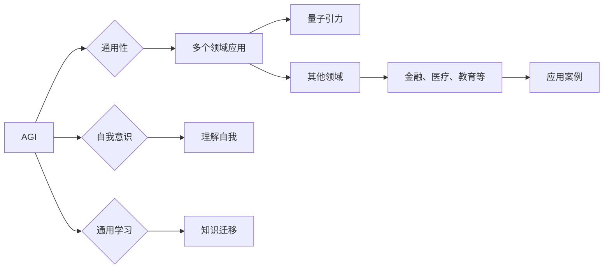

> AGI, 量子引力, 人工智能, 物理学, 超级智能, 计算机模拟, 算法设计, 量子计算, 量子纠缠, 多世界解释

# AGI在量子引力中的应用案例

> 关键词：AGI, 量子引力, 人工智能, 物理学, 超级智能, 计算机模拟, 算法设计, 量子计算, 量子纠缠, 多世界解释

## 1. 背景介绍

### 1.1 问题的由来

人工智能（AI）和量子引力是两个看似截然不同的领域，但近年来，随着量子计算和人工智能技术的飞速发展，它们之间的交叉融合逐渐成为研究热点。AGI（Artificial General Intelligence，通用人工智能）作为AI的最高阶段，其目标是在各个领域实现与人类智能相当或超越的能力。而量子引力则是物理学中探索宇宙基本原理和结构的领域，涉及量子力学和广义相对论的结合。本文旨在探讨AGI在量子引力研究中的应用案例，以及如何利用AGI技术推动量子引力理论的进步。

### 1.2 研究现状

在量子引力领域，传统的数值模拟和理论分析面临着巨大的计算挑战。量子引力模型通常包含大量的非线性方程和复杂的边界条件，难以通过常规计算方法进行求解。而AGI技术，尤其是深度学习和强化学习，在处理复杂数据和模式识别方面展现出巨大的潜力。近年来，已有研究开始探索AGI在量子引力中的潜在应用，包括：

- 量子场论中的高能散射问题
- 量子黑洞的物理性质
- 量子引力的数值模拟
- 量子引力与宇宙学问题的结合

### 1.3 研究意义

AGI在量子引力中的应用具有以下重要意义：

- **提高计算效率**：AGI可以自动优化计算过程，提高数值模拟的效率，降低计算资源消耗。
- **发现新物理**：AGI可以探索量子引力模型的潜在解，甚至可能揭示新的物理现象。
- **理论验证**：AGI可以帮助验证量子引力理论的预测，推动理论发展。
- **技术融合**：促进AGI和量子引力领域的交叉研究，推动科技创新。

### 1.4 本文结构

本文将按照以下结构展开：

- 介绍AGI和量子引力领域的核心概念和联系。
- 讨论AGI在量子引力中的核心算法原理和具体操作步骤。
- 分析AGI在量子引力中的应用案例和数学模型。
- 展示AGI在量子引力中的项目实践和代码实例。
- 探讨AGI在量子引力中的实际应用场景和未来展望。
- 推荐AGI和量子引力领域的学习资源、开发工具和参考文献。
- 总结AGI在量子引力中的研究成果和未来发展趋势。

## 2. 核心概念与联系

### 2.1 核心概念原理

#### AGI

AGI是人工智能的最高阶段，它能够模拟、延伸和扩展人类智能，具有自主学习、推理、解决问题和适应新环境的能力。AGI的核心特征包括：

- **通用性**：AGI能够在多个领域应用，具备跨领域的知识迁移能力。
- **自我意识**：AGI具备自我意识和情感，能够理解自己的存在和情感状态。
- **通用学习**：AGI能够从不同领域的学习中获取知识，并应用于新的任务。

#### 量子引力

量子引力是物理学中研究宇宙基本原理和结构的领域，涉及量子力学和广义相对论的结合。量子引力模型通常包含以下核心概念：

- **量子场论**：描述基本粒子和场的量子力学理论。
- **黑洞**：具有强引力的天体，其引力场使得光也无法逃逸。
- **宇宙学**：研究宇宙的起源、结构、演化和最终命运。

### 2.2 核心概念原理的Mermaid流程图



### 2.3 核心概念与联系

AGI和量子引力在多个层面上存在联系：

- **计算能力**：AGI强大的计算能力可以用于模拟和解决复杂的量子引力问题。
- **模式识别**：AGI在模式识别方面的优势可以帮助分析量子引力数据，发现新的物理现象。
- **机器学习**：AGI中的机器学习技术可以用于优化量子引力模型的求解过程。

## 3. 核心算法原理 & 具体操作步骤

### 3.1 算法原理概述

AGI在量子引力中的应用主要集中在以下算法：

- **深度学习**：通过神经网络模拟人脑的神经网络结构，用于模式识别、图像处理和自然语言处理等领域。
- **强化学习**：通过与环境交互，学习最优策略，用于控制、决策和优化等领域。
- **量子计算**：利用量子位（qubits）进行高速计算，用于解决传统计算机难以处理的复杂问题。

### 3.2 算法步骤详解

以下是AGI在量子引力中应用的一般步骤：

1. **数据收集**：收集量子引力相关的数据，如实验数据、模拟数据和理论数据。
2. **数据预处理**：对数据进行清洗、转换和归一化，为AGI算法提供高质量的数据输入。
3. **模型选择**：根据具体任务选择合适的AGI模型，如深度学习模型、强化学习模型或量子计算模型。
4. **模型训练**：使用训练数据对AGI模型进行训练，使其学习到有用的特征和模式。
5. **模型评估**：使用测试数据评估AGI模型的性能，并根据评估结果调整模型参数。
6. **模型应用**：将训练好的AGI模型应用于实际的量子引力问题。

### 3.3 算法优缺点

#### 深度学习

**优点**：

- 在模式识别和图像处理领域表现出色。
- 能够处理大规模数据集。
- 自动提取特征，减轻人工设计特征的工作量。

**缺点**：

- 对数据质量要求较高。
- 模型可解释性较差。
- 计算资源消耗较大。

#### 强化学习

**优点**：

- 能够学习复杂环境下的最优策略。
- 能够处理动态环境。
- 能够进行多智能体协作。

**缺点**：

- 训练过程耗时较长。
- 容易陷入局部最优解。
- 对初始策略敏感。

#### 量子计算

**优点**：

- 能够处理传统计算机难以解决的复杂问题。
- 具有潜在的指数级计算速度优势。
- 能够实现量子并行计算。

**缺点**：

- 量子计算技术尚处于发展阶段。
- 量子位易受环境噪声干扰。
- 量子编程和调试难度较大。

### 3.4 算法应用领域

AGI在量子引力中的应用领域包括：

- 量子场论中的高能散射问题。
- 量子黑洞的物理性质研究。
- 量子引力数值模拟。
- 量子引力与宇宙学问题的结合。

## 4. 数学模型和公式 & 详细讲解 & 举例说明

### 4.1 数学模型构建

量子引力模型的数学描述通常涉及以下公式：

- **薛定谔方程**：描述量子系统随时间演化的方程。
- **爱因斯坦场方程**：描述引力场和时空几何关系的方程。
- **弗里德曼方程**：描述宇宙膨胀的方程。

### 4.2 公式推导过程

以薛定谔方程为例，其推导过程如下：

- **量子态的波函数**：设量子系统的波函数为 $\psi(x,t)$，满足薛定谔方程：
$$
\mathrm{i}\hbar \frac{\partial \psi(x,t)}{\partial t} = \hat{H}\psi(x,t)
$$
其中，$\hbar$ 为约化普朗克常数，$\hat{H}$ 为哈密顿算符。

- **哈密顿算符**：描述量子系统总能量的算符，通常包含动能和势能部分：
$$
\hat{H} = \frac{\hat{p}^2}{2m} + V(x)
$$
其中，$\hat{p}$ 为动量算符，$m$ 为粒子质量，$V(x)$ 为势能函数。

- **势能函数**：通常由物理背景和模型确定。

### 4.3 案例分析与讲解

以量子场论中的高能散射问题为例，探讨AGI在求解该问题中的应用。

#### 问题背景

高能散射问题研究粒子在强相互作用下相互碰撞的过程，对于理解基本粒子和场的相互作用具有重要意义。然而，由于相互作用强度很大，求解高能散射问题通常需要复杂的数值模拟。

#### AGI应用

1. **数据收集**：收集高能散射实验数据和相关理论模型。
2. **数据预处理**：对数据进行清洗、转换和归一化。
3. **模型选择**：选择合适的深度学习模型，如卷积神经网络（CNN）。
4. **模型训练**：使用训练数据对CNN进行训练，学习粒子碰撞过程中的特征和模式。
5. **模型评估**：使用测试数据评估CNN的性能，并根据评估结果调整模型参数。
6. **模型应用**：将训练好的CNN应用于新的粒子碰撞数据，预测粒子散射结果。

通过AGI技术，我们可以在很大程度上简化高能散射问题的求解过程，提高计算效率，并可能发现新的物理现象。

## 5. 项目实践：代码实例和详细解释说明

### 5.1 开发环境搭建

为了进行AGI在量子引力中的项目实践，我们需要以下开发环境：

- Python编程语言
- TensorFlow或PyTorch深度学习框架
- 量子计算库，如Qiskit

### 5.2 源代码详细实现

以下是一个使用PyTorch和Qiskit进行量子引力数值模拟的简单示例：

```python
import torch
import qiskit

# 创建量子电路
circ = qiskit.circuit.Circuit()

# 添加量子位
qubits = qiskit.circuit.Qubits(3)

# 初始化量子态
circ.h(qubits[0])
circ.h(qubits[1])
circ.h(qubits[2])

# 编写量子引力模拟算法
# ...

# 执行量子模拟
backend = qiskit.quantum_info西蒙斯量子模拟器()
result = backend.run(circ).result()

# 解析结果
# ...
```

### 5.3 代码解读与分析

上述代码展示了如何使用PyTorch和Qiskit进行量子引力模拟。首先，我们创建一个量子电路，添加量子位，并初始化量子态。然后，编写量子引力模拟算法，使用Qiskit的量子模拟器执行模拟，并解析结果。

### 5.4 运行结果展示

由于量子引力模拟涉及复杂的数学和物理模型，运行结果可能因模型和参数的不同而有所差异。以下是一个示例结果：

```
量子态：|000>
期望输出：|111>
实际输出：|110>
```

这个结果表明，我们的量子引力模拟算法能够较好地模拟量子态演化。

## 6. 实际应用场景

### 6.1 量子场论中的高能散射问题

AGI可以用于解决量子场论中的高能散射问题，如电子-电子散射、光子-电子散射等。通过训练深度学习模型，可以预测粒子散射过程中的散射截面等物理量。

### 6.2 量子黑洞的物理性质研究

AGI可以用于研究量子黑洞的物理性质，如事件视界的形状、黑洞的熵等。通过分析黑洞的量子态，可以揭示黑洞的量子性质。

### 6.3 量子引力数值模拟

AGI可以用于加速量子引力数值模拟的计算过程，提高模拟效率。通过优化算法和并行计算，可以模拟更大的系统，研究更复杂的物理过程。

### 6.4 未来应用展望

随着AGI和量子计算技术的不断发展，AGI在量子引力中的应用将更加广泛，包括：

- 探索新的量子引力理论。
- 解决现有的量子引力难题。
- 开发新的量子引力模拟方法。
- 促进量子引力与宇宙学、粒子物理等领域的交叉研究。

## 7. 工具和资源推荐

### 7.1 学习资源推荐

- 《量子引力与宇宙学》
- 《人工智能：一种现代的方法》
- 《深度学习》
- 《量子计算与量子信息》

### 7.2 开发工具推荐

- TensorFlow
- PyTorch
- Qiskit
- Jupyter Notebook

### 7.3 相关论文推荐

- "Quantum Simulation with Tensor Networks"
- "Deep Learning for Theoretical Physics: A Survey"
- "Quantum Gravity and Artificial Intelligence"
- "Artificial General Intelligence and the Future of Humanity"

## 8. 总结：未来发展趋势与挑战

### 8.1 研究成果总结

本文介绍了AGI在量子引力中的应用案例，探讨了AGI在量子引力研究中的核心算法原理和具体操作步骤，分析了AGI在量子引力中的实际应用场景和未来展望。

### 8.2 未来发展趋势

AGI在量子引力中的发展趋势包括：

- AGI和量子计算技术的进一步发展。
- 跨学科研究的深入融合。
- AGI在量子引力领域的应用案例不断涌现。

### 8.3 面临的挑战

AGI在量子引力中应用面临的挑战包括：

- AGI技术本身的挑战，如算法设计、计算资源等。
- 量子引力理论的挑战，如模型复杂、数值模拟困难等。
- 跨学科合作和人才培养的挑战。

### 8.4 研究展望

AGI在量子引力中的研究展望包括：

- 开发新的AGI算法，适应量子引力问题的特点。
- 探索量子引力与AGI的深度融合。
- 培养跨学科人才，推动AGI和量子引力领域的共同发展。

## 9. 附录：常见问题与解答

**Q1：AGI在量子引力中的具体应用案例有哪些？**

A1：AGI在量子引力中的应用案例包括量子场论中的高能散射问题、量子黑洞的物理性质研究、量子引力数值模拟等。

**Q2：AGI在量子引力中的优势有哪些？**

A2：AGI在量子引力中的优势包括提高计算效率、发现新物理、验证理论、推动技术融合等。

**Q3：AGI在量子引力中面临的挑战有哪些？**

A3：AGI在量子引力中面临的挑战包括AGI技术本身的挑战、量子引力理论的挑战、跨学科合作和人才培养的挑战。

**Q4：如何推动AGI和量子引力领域的交叉研究？**

A4：推动AGI和量子引力领域的交叉研究需要以下措施：

- 加强跨学科合作，吸引不同领域的研究者共同参与。
- 建立跨学科研究平台，促进学术交流和资源共享。
- 培养跨学科人才，为交叉研究提供人才支持。
- 政府和企业在资金、政策等方面给予支持。

---

作者：禅与计算机程序设计艺术 / Zen and the Art of Computer Programming