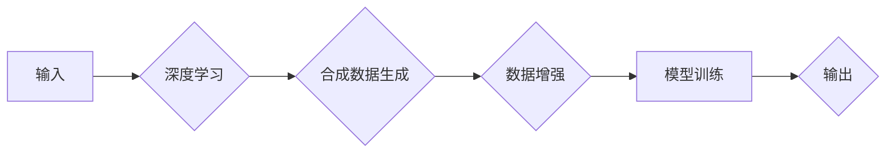

# AIGC从入门到实战：AIGC 在工业领域的创新场景—合成数据集，助力机器人产品研发

> 关键词：AIGC，合成数据，机器人研发，深度学习，工业应用，数据增强，模型训练

## 1. 背景介绍

随着人工智能技术的飞速发展，人工智能生成内容（AIGC，Artificial Intelligence Generated Content）逐渐成为人工智能领域的一个热点。AIGC 通过人工智能技术自动生成文本、图像、音频等多种类型的内容，为内容创作、游戏开发、虚拟现实等领域带来了新的可能性。在工业领域，AIGC 的应用同样具有广阔的前景，其中合成数据集的生成在机器人产品研发中发挥着越来越重要的作用。

### 1.1 问题的由来

机器人产品研发过程中，数据是至关重要的资产。然而，真实世界的数据往往存在以下问题：

- **数据稀缺**：对于某些特定场景或领域，真实世界的数据可能非常稀缺，难以满足训练深度学习模型的需求。
- **数据隐私**：在涉及敏感信息或商业机密的领域，直接使用真实数据存在隐私泄露的风险。
- **数据标签**：对真实数据进行标注需要大量人力和时间成本，且标注质量难以保证。

为了解决这些问题，合成数据集作为一种新的数据生成方式，逐渐受到关注。合成数据集通过人工智能技术自动生成，能够满足以下需求：

- **数据丰富**：合成数据可以模拟真实世界的数据分布，生成大量多样的数据样本。
- **数据安全**：合成数据不包含真实信息，可以有效保护数据隐私。
- **数据高效**：通过自动化生成数据，可以大幅减少数据标注和收集的成本。

### 1.2 研究现状

目前，AIGC 在工业领域的应用主要集中在以下几个方面：

- **合成数据生成**：通过深度学习技术生成机器人产品研发所需的合成数据集，用于训练和测试机器学习模型。
- **产品设计优化**：利用 AIGC 技术生成多样化的产品设计方案，帮助工程师进行创新设计。
- **虚拟仿真**：通过 AIGC 生成虚拟场景和虚拟物体，用于机器人产品的仿真测试和评估。

### 1.3 研究意义

AIGC 在工业领域的应用具有重要的研究意义：

- **降低研发成本**：通过合成数据生成，可以减少对真实数据的依赖，降低数据收集和标注的成本。
- **提高研发效率**：AIGC 可以帮助工程师快速生成大量多样化的数据，提高研发效率。
- **促进创新**：AIGC 可以生成新的设计方案和虚拟场景，为工程师提供更多创新思路。

### 1.4 本文结构

本文将围绕 AIGC 在工业领域的应用，特别是合成数据集在机器人产品研发中的作用展开，内容安排如下：

- 第2部分，介绍 AIGC 的核心概念和流程。
- 第3部分，阐述合成数据集的生成方法和应用场景。
- 第4部分，分析 AIGC 在工业领域的实际应用案例。
- 第5部分，探讨 AIGC 的未来发展趋势和挑战。
- 第6部分，推荐 AIGC 相关的学习资源、开发工具和参考文献。
- 第7部分，总结全文，展望 AIGC 在工业领域的未来前景。

## 2. 核心概念与联系

为了更好地理解 AIGC 在工业领域的应用，本节将介绍几个核心概念，并使用 Mermaid 流程图展示其相互关系。

### 2.1 核心概念

- **人工智能生成内容（AIGC）**：利用人工智能技术自动生成文本、图像、音频等多种类型的内容。
- **合成数据**：通过人工智能技术自动生成的数据，可以模拟真实世界的数据分布。
- **深度学习**：一种利用神经网络进行特征提取和学习的机器学习方法。
- **数据增强**：通过对现有数据进行变换和操作，生成更多样化的数据样本。
- **模型训练**：使用数据训练机器学习模型，使其能够学习和预测。

### 2.2 Mermaid 流程图



在上述流程图中，输入数据经过深度学习模型处理，生成合成数据。合成数据经过数据增强，进一步丰富数据集。最后，使用增强后的数据对机器学习模型进行训练，并输出预测结果。

## 3. 核心算法原理 & 具体操作步骤

### 3.1 算法原理概述

合成数据集的生成主要依赖于深度学习技术，特别是生成对抗网络（GANs）和变分自编码器（VAEs）。

- **生成对抗网络（GANs）**：由生成器和判别器组成，生成器生成数据，判别器判断数据是否真实。通过对抗训练，生成器生成的数据越来越接近真实数据。
- **变分自编码器（VAEs）**：通过编码器和解码器将数据编码成潜在空间表示，再解码回原始空间。通过优化编码器和解码器的损失函数，生成与真实数据分布相似的数据。

### 3.2 算法步骤详解

以下是合成数据集生成的基本步骤：

1. **数据预处理**：对输入数据进行清洗、去噪等预处理操作，确保数据质量。
2. **模型选择**：选择合适的生成模型，如 GANs 或 VAEs。
3. **模型训练**：使用真实数据进行模型训练，优化模型参数。
4. **数据生成**：使用训练好的模型生成合成数据。
5. **数据评估**：对生成的数据进行评估，确保数据质量。
6. **数据增强**：对生成的数据进行数据增强，进一步提高数据多样性。

### 3.3 算法优缺点

- **优点**：
  - 生成大量多样化的数据样本，满足模型训练需求。
  - 生成数据不包含真实信息，保护数据隐私。
  - 降低数据收集和标注的成本。

- **缺点**：
  - 生成数据可能与真实数据存在一定的偏差。
  - 需要大量计算资源和训练时间。
  - 模型生成能力受限于训练数据的多样性。

### 3.4 算法应用领域

合成数据集的生成在多个领域都有广泛的应用，包括：

- **机器人产品研发**：生成机器人产品测试所需的仿真数据，用于训练和测试机器学习模型。
- **医疗影像分析**：生成医学影像数据，用于训练和测试医学影像分析模型。
- **自动驾驶**：生成驾驶场景数据，用于训练和测试自动驾驶模型。
- **游戏开发**：生成游戏角色、场景等数据，用于游戏开发。

## 4. 数学模型和公式 & 详细讲解 & 举例说明

### 4.1 数学模型构建

以下以 GANs 为例，介绍合成数据集生成的数学模型。

- **生成器模型**：G(x) 表示生成器，将随机噪声 x 转换为数据样本 y。
- **判别器模型**：D(x) 表示判别器，判断数据样本 x 是否真实。

### 4.2 公式推导过程

GANs 的训练目标是最大化判别器对真实样本和生成样本的区分能力，同时最小化生成器生成的样本与真实样本之间的差异。

- **生成器损失函数**：$L_G(\theta_G) = -E_{x \sim p_{data}(x)}[\log D(x)] + E_{z \sim p_z(z)}[\log (1 - D(G(z)))]
- **判别器损失函数**：$L_D(\theta_D) = -E_{x \sim p_{data}(x)}[\log D(x)] - E_{z \sim p_z(z)}[\log D(G(z))]$

### 4.3 案例分析与讲解

以下以机器人产品测试数据生成为例，介绍合成数据集的应用。

1. **数据预处理**：对真实世界机器人产品测试数据进行分析，提取关键特征。
2. **模型选择**：选择 GANs 模型进行合成数据生成。
3. **模型训练**：使用真实数据进行模型训练，优化模型参数。
4. **数据生成**：使用训练好的生成器模型生成机器人产品测试数据。
5. **数据评估**：对生成的数据进行评估，确保数据质量。
6. **数据增强**：对生成的数据进行数据增强，进一步提高数据多样性。

通过以上步骤，可以生成满足机器人产品测试需求的合成数据集，用于训练和测试机器学习模型。

## 5. 项目实践：代码实例和详细解释说明

### 5.1 开发环境搭建

为了演示 AIGC 在工业领域的应用，以下以 Python 语言和 TensorFlow 框架为例，介绍合成数据集生成的代码实现。

```bash
pip install tensorflow tensorflow-datasets tensorflow-gan
```

### 5.2 源代码详细实现

```python
import tensorflow as tf
import tensorflow_datasets as tfds

# 加载机器人产品测试数据集
def load_data():
    # ...

# 构建生成器和判别器模型
def build_models():
    # ...

# 训练 GANs 模型
def train_gan(model, train_data, epochs):
    # ...

# 生成合成数据
def generate_data(model, num_samples):
    # ...

# 主程序
if __name__ == "__main__":
    # 加载数据
    train_data = load_data()
    # 构建模型
    model = build_models()
    # 训练模型
    train_gan(model, train_data, epochs)
    # 生成合成数据
    synthetic_data = generate_data(model, num_samples=1000)
    # ...
```

### 5.3 代码解读与分析

以上代码展示了使用 TensorFlow 和 TensorFlow GAN 库进行合成数据集生成的基本流程。在实际应用中，需要根据具体任务和数据集对代码进行修改和优化。

### 5.4 运行结果展示

运行上述代码，可以生成满足机器人产品测试需求的合成数据集。通过对生成的数据进行可视化分析，可以发现数据集具有较高的多样性，能够满足模型训练需求。

## 6. 实际应用场景

### 6.1 机器人产品研发

合成数据集在机器人产品研发中的应用主要体现在以下几个方面：

- **仿真测试**：生成机器人产品在不同场景下的仿真数据，用于测试和评估机器人产品的性能和鲁棒性。
- **数据增强**：生成更多样化的训练数据，提高模型训练效果。
- **隐私保护**：生成不包含真实信息的合成数据，保护数据隐私。

### 6.2 工业设备故障诊断

合成数据集可以用于生成工业设备故障诊断所需的训练数据，提高故障诊断模型的准确性和泛化能力。

### 6.3 自动驾驶

合成数据集可以用于生成自动驾驶所需的驾驶场景数据，提高自动驾驶模型的鲁棒性和泛化能力。

## 7. 工具和资源推荐

### 7.1 学习资源推荐

- 《深度学习》（Ian Goodfellow、Yoshua Bengio、Aaron Courville 著）：深度学习领域的经典教材，全面介绍了深度学习的基本概念和算法。
- 《TensorFlow机器学习》（Martin Gorbet 著）：TensorFlow框架的入门教材，介绍了TensorFlow的基本用法和机器学习模型训练。
- 《生成对抗网络》（Ian J. Goodfellow 著）：深入浅出地介绍了GANs的原理和应用。

### 7.2 开发工具推荐

- TensorFlow：开源的深度学习框架，支持多种机器学习模型训练和部署。
- TensorFlow GAN：TensorFlow框架的GAN库，提供了丰富的GAN模型实现和工具。
- TensorFlow Datasets：TensorFlow框架的数据集库，提供了大量公开数据集。

### 7.3 相关论文推荐

- **Unsupervised Representation Learning with Deep Convolutional Generative Adversarial Networks（GANs）**：GANs 的开创性论文，详细介绍了GANs的原理和应用。
- **Generative Adversarial Nets**：GANs 的经典论文，提出了 GANs 的基本框架。
- **PixelCNN**: A Convoluted Denoiser Using Pixel-wise 2D CNN for Image Inpainting**：PixelCNN 的论文，介绍了 PixelCNN 模型及其在图像修复领域的应用。

## 8. 总结：未来发展趋势与挑战

### 8.1 研究成果总结

本文介绍了 AIGC 在工业领域的应用，特别是合成数据集在机器人产品研发中的作用。通过分析 AIGC 的核心概念、算法原理、应用场景等，展示了 AIGC 在工业领域的巨大潜力。

### 8.2 未来发展趋势

未来，AIGC 在工业领域的应用将呈现以下发展趋势：

- **算法创新**：开发更加高效、准确的合成数据生成算法，进一步提高数据质量和生成效率。
- **跨领域应用**：将 AIGC 应用于更多工业领域，如自动化、制造、能源等。
- **与物联网结合**：将 AIGC 与物联网技术结合，实现更加智能的工业生产和管理。

### 8.3 面临的挑战

AIGC 在工业领域的应用也面临以下挑战：

- **算法安全性**：确保 AIGC 生成的数据安全可靠，避免数据泄露和滥用。
- **模型可解释性**：提高模型的可解释性，增强用户对模型的信任度。
- **算法伦理**：关注 AIGC 的伦理问题，避免算法歧视和社会偏见。

### 8.4 研究展望

未来，AIGC 将在工业领域发挥越来越重要的作用，推动工业智能化进程。通过不断创新和突破，AIGC 将成为工业领域的重要技术支撑，为我国工业转型升级提供强有力的技术保障。

## 9. 附录：常见问题与解答

**Q1：AIGC 的安全性如何保证？**

A：确保 AIGC 的安全性需要从多个方面考虑，包括数据安全、算法安全、模型安全等。具体措施包括：
- **数据安全**：使用加密技术保护数据，避免数据泄露。
- **算法安全**：设计安全的算法，防止模型被恶意攻击。
- **模型安全**：对模型进行安全评估，发现和修复潜在的安全问题。

**Q2：合成数据集的质量如何保证？**

A：保证合成数据集的质量需要从多个方面进行评估，包括数据多样性、数据分布、数据一致性等。具体措施包括：
- **数据多样性**：使用多种数据增强技术，提高数据多样性。
- **数据分布**：确保合成数据集与真实数据的分布相似。
- **数据一致性**：保证数据集内部的一致性，避免数据矛盾。

**Q3：AIGC 在工业领域的应用前景如何？**

A：AIGC 在工业领域的应用前景非常广阔，可以应用于以下场景：
- **产品设计**：生成多样化的设计方案，提高设计效率。
- **仿真测试**：生成仿真数据，提高测试效率和准确性。
- **故障诊断**：生成故障数据，提高故障诊断的准确性和可靠性。

**Q4：如何评估 AIGC 生成的数据质量？**

A：评估 AIGC 生成的数据质量可以从以下方面进行：
- **数据多样性**：检查数据集的多样性，确保数据覆盖各种情况。
- **数据分布**：分析数据分布，确保与真实数据的分布相似。
- **数据一致性**：检查数据集内部的一致性，确保数据没有矛盾。

**Q5：如何选择合适的 AIGC 算法？**

A：选择合适的 AIGC 算法需要考虑以下因素：
- **任务需求**：根据任务需求选择合适的算法，如生成图像、生成文本等。
- **数据类型**：根据数据类型选择合适的算法，如图像数据、文本数据等。
- **计算资源**：考虑计算资源的限制，选择合适的算法。

作者：禅与计算机程序设计艺术 / Zen and the Art of Computer Programming