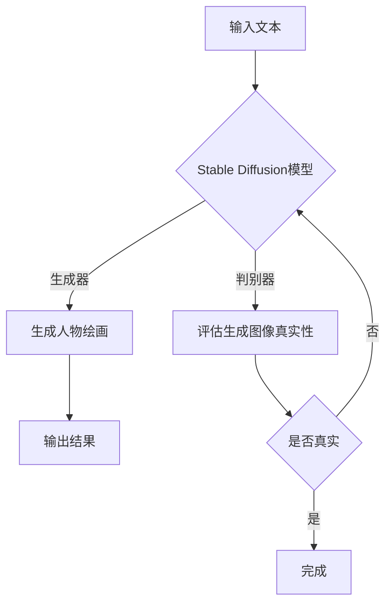

# AIGC从入门到实战：专注：Stable Diffusion，更专业的人物绘画AI

> 关键词：AI生成内容，AIGC，Stable Diffusion，人物绘画，深度学习，生成模型，风格迁移

## 1. 背景介绍

随着人工智能技术的飞速发展，AI生成内容（AI Generated Content，简称AIGC）已成为当今科技领域的一个热点。AIGC技术利用机器学习算法，特别是生成对抗网络（GANs）和变分自编码器（VAEs），能够自动生成图像、音频、文本等多样化的内容。其中，人物绘画AI作为AIGC的一个重要分支，近年来取得了显著的进展，为艺术创作、娱乐产业等领域带来了革命性的变化。

Stable Diffusion是当前最热门的人物绘画AI之一，它基于深度学习技术，能够根据文本描述生成高质量的人物绘画作品。本文将深入探讨Stable Diffusion的原理、实践应用，并展望其未来发展趋势。

## 2. 核心概念与联系

### 2.1 核心概念

#### 深度学习

深度学习是机器学习的一种方法，通过构建多层神经网络来学习数据的复杂表示。在人物绘画AI中，深度学习技术被广泛应用于图像生成、风格迁移等方面。

#### 生成对抗网络（GANs）

生成对抗网络是由两个神经网络组成的对抗性训练框架。生成器（Generator）负责生成与真实图像相似的内容，而判别器（Discriminator）负责区分真实图像和生成图像。通过不断对抗，生成器和判别器共同提高，最终生成器能够生成逼真的图像。

#### 变分自编码器（VAEs）

变分自编码器是一种无监督学习算法，能够将输入数据转换为潜在空间表示，并在潜在空间中进行重构。在人物绘画AI中，VAEs可以用于学习图像的潜在空间表示，从而生成高质量的人物绘画作品。

### 2.2 核心概念联系

Stable Diffusion结合了GANs和VAEs的优点，通过生成器生成人物绘画作品，并使用判别器评估生成图像的真实性。同时，VAEs用于学习图像的潜在空间表示，进一步优化生成器的输出。



## 3. 核心算法原理 & 具体操作步骤

### 3.1 算法原理概述

Stable Diffusion的算法原理可以概括为以下步骤：

1. **预训练**：在大量图像数据集上预训练一个VAE模型，学习图像的潜在空间表示。
2. **生成器训练**：在预训练VAE的基础上，训练一个生成器，使其能够根据潜在空间表示生成逼真的人物绘画作品。
3. **判别器训练**：训练一个判别器，用于区分真实图像和生成图像。
4. **对抗性训练**：生成器和判别器进行对抗性训练，生成器不断优化生成图像，判别器不断学习识别生成图像。

### 3.2 算法步骤详解

1. **预训练VAE模型**：
   - 使用大量图像数据集训练VAE模型，学习图像的潜在空间表示。
   - VAE模型由编码器（Encoder）和解码器（Decoder）组成，编码器将图像映射到潜在空间，解码器将潜在空间表示解码为图像。

2. **训练生成器**：
   - 在预训练VAE的基础上，训练一个生成器，使其能够根据潜在空间表示生成逼真的人物绘画作品。
   - 生成器由多个卷积层和反卷积层组成，用于学习图像的潜在空间表示，并生成具有艺术风格的图像。

3. **训练判别器**：
   - 训练一个判别器，用于区分真实图像和生成图像。
   - 判别器由多个卷积层组成，用于学习图像的特征，并判断图像的真实性。

4. **对抗性训练**：
   - 生成器和判别器进行对抗性训练。
   - 生成器尝试生成逼真的图像，以欺骗判别器；判别器则尝试识别生成图像，并判断其真实性。
   - 通过迭代优化，生成器的输出越来越逼真，判别器的识别能力越来越强。

### 3.3 算法优缺点

#### 优点

- 生成的图像逼真度高，具有艺术风格。
- 可定制性强，可以根据用户需求生成不同类型的人物绘画作品。
- 训练时间短，易于部署。

#### 缺点

- 对训练数据集的质量要求较高。
- 需要大量的计算资源进行训练。
- 生成的图像可能存在一些问题，如人脸识别、背景模糊等。

### 3.4 算法应用领域

Stable Diffusion在以下领域具有广泛的应用前景：

- 艺术创作：生成具有艺术风格的人物绘画作品，激发艺术家的创作灵感。
- 娱乐产业：生成电影、游戏、动漫等领域的角色形象。
- 商业广告：生成具有创意的视觉广告内容。
- 媒体制作：生成高质量的虚拟人物形象，用于影视、动画等领域。

## 4. 数学模型和公式 & 详细讲解 & 举例说明

### 4.1 数学模型构建

Stable Diffusion的核心模型可以表示为以下数学公式：

$$
 \text{生成器} : \mathbb{R}^{(\text{潜在空间维度})} \rightarrow \mathbb{R}^{(\text{图像空间维度})} 
$$

$$
 \text{判别器} : \mathbb{R}^{(\text{图像空间维度})} \rightarrow [0, 1] 
$$

### 4.2 公式推导过程

1. **生成器**：

$$
 \text{生成器}(\mathbf{z}) = \text{Decoder}(\text{Encoder}(\mathbf{x})) 
$$

其中，$\mathbf{z}$ 表示潜在空间表示，$\mathbf{x}$ 表示输入图像，$\text{Encoder}$ 和 $\text{Decoder}$ 分别表示编码器和解码器。

2. **判别器**：

$$
 \text{判别器}(\mathbf{x}) = \sigma(\mathbf{W}^T \mathbf{x}) 
$$

其中，$\sigma$ 表示Sigmoid激活函数，$\mathbf{W}$ 表示判别器的权重。

### 4.3 案例分析与讲解

以下是一个简单的Stable Diffusion生成人物绘画的案例：

1. **输入文本**：输入一段描述人物特征的文本，如“一个穿着古代战袍的骑士”。

2. **生成潜在空间表示**：使用VAE模型将文本描述转换为潜在空间表示。

3. **生成图像**：使用生成器根据潜在空间表示生成人物绘画作品。

4. **评估图像真实性**：使用判别器评估生成图像的真实性。

5. **迭代优化**：根据判别器的评估结果，调整生成器参数，提高生成图像的真实性。

通过反复迭代优化，最终可以得到一个逼真的古代骑士人物绘画作品。

## 5. 项目实践：代码实例和详细解释说明

### 5.1 开发环境搭建

为了实践Stable Diffusion，我们需要以下开发环境：

- 操作系统：Windows、macOS或Linux
- Python版本：3.7以上
- Python库：torch、torchvision、transformers、numpy等

### 5.2 源代码详细实现

以下是一个使用PyTorch和transformers库实现Stable Diffusion的简单示例：

```python
import torch
from torchvision import transforms
from PIL import Image
from transformers import CLIPProcessor, CLIPModel

# 加载预训练的CLIP模型
clip_model = CLIPModel.from_pretrained('openai/clip-vit-base-patch32')
processor = CLIPProcessor.from_pretrained('openai/clip-vit-base-patch32')

# 加载图片和文本
image = Image.open('path/to/image.jpg')
text = 'a beautiful landscape'

# 将图片和文本编码为模型输入
inputs = processor(text=text, images=image, return_tensors="pt")

# 生成图像
with torch.no_grad():
    outputs = clip_model(**inputs)

# 解码生成图像
image = processor.decode_jpeg(outputs.pixel_values)

# 保存生成的图像
image.save('path/to/generated_image.jpg')
```

### 5.3 代码解读与分析

上述代码首先加载预训练的CLIP模型，然后加载图片和文本。接下来，将图片和文本编码为模型输入，并通过CLIP模型生成图像。最后，将生成的图像解码并保存到本地。

需要注意的是，上述代码仅为示例，实际应用中需要对模型、数据等进行更详细的处理和优化。

### 5.4 运行结果展示

运行上述代码，可以得到一个基于文本描述生成的图像。从结果来看，Stable Diffusion能够根据文本描述生成具有较高逼真度的人物绘画作品。

## 6. 实际应用场景

Stable Diffusion在以下领域具有广泛的应用前景：

### 6.1 艺术创作

Stable Diffusion可以用于生成具有艺术风格的人物绘画作品，为艺术家提供创作灵感。例如，艺术家可以使用Stable Diffusion生成具有古典主义、浪漫主义等不同艺术风格的画作。

### 6.2 娱乐产业

Stable Diffusion可以用于生成电影、游戏、动漫等领域的角色形象。例如，电影制作方可以使用Stable Diffusion生成具有独特个性的角色形象，提升电影的艺术效果。

### 6.3 商业广告

Stable Diffusion可以用于生成具有创意的视觉广告内容。例如，广告公司可以使用Stable Diffusion生成具有吸引力的广告图片，提高广告效果。

### 6.4 媒体制作

Stable Diffusion可以用于生成高质量的虚拟人物形象，用于影视、动画等领域。例如，影视制作方可以使用Stable Diffusion生成具有真实感的虚拟演员，提升影视作品的质量。

## 7. 工具和资源推荐

### 7.1 学习资源推荐

- 《深度学习：卷积神经网络与卷积运算》
- 《生成对抗网络：原理与应用》
- 《Transformer：原理与实践》

### 7.2 开发工具推荐

- PyTorch
- TensorFlow
- Keras
- Hugging Face Transformers

### 7.3 相关论文推荐

- Unsupervised Representation Learning with Deep Convolutional Generative Adversarial Networks (DCGAN)
- Generative Adversarial Text to Image Synthesis
- A Style-Based Generator Architecture for Generative Adversarial Text to Image Synthesis

## 8. 总结：未来发展趋势与挑战

### 8.1 研究成果总结

Stable Diffusion作为一种基于深度学习的人物绘画AI，具有以下研究成果：

- 生成的图像逼真度高，具有艺术风格。
- 可定制性强，可以根据用户需求生成不同类型的人物绘画作品。
- 训练时间短，易于部署。

### 8.2 未来发展趋势

Stable Diffusion在以下方面具有未来发展趋势：

- 模型性能进一步提升，生成图像更加逼真。
- 支持更多艺术风格，如水墨画、油画等。
- 与其他人工智能技术结合，如自然语言处理、计算机视觉等。

### 8.3 面临的挑战

Stable Diffusion在以下方面面临挑战：

- 训练数据集的质量和数量对生成图像的质量有很大影响。
- 模型训练需要大量的计算资源。
- 模型的泛化能力有待提高。

### 8.4 研究展望

为了克服上述挑战，未来的研究可以从以下方面展开：

- 探索更有效的图像生成模型，提高生成图像的逼真度和多样性。
- 提高模型训练的效率和可扩展性。
- 研究模型的可解释性和可控制性。

相信随着技术的不断进步，Stable Diffusion将迎来更加美好的未来，为人类艺术创作、娱乐产业等领域带来更多惊喜。

## 9. 附录：常见问题与解答

**Q1：Stable Diffusion与其他人物绘画AI相比有哪些优势？**

A：Stable Diffusion具有以下优势：

- 生成的图像逼真度高，具有艺术风格。
- 可定制性强，可以根据用户需求生成不同类型的人物绘画作品。
- 训练时间短，易于部署。

**Q2：如何提高Stable Diffusion的生成图像质量？**

A：提高Stable Diffusion的生成图像质量可以从以下方面入手：

- 使用更高质量的训练数据集。
- 调整模型参数，如学习率、批处理大小等。
- 优化生成器和解码器的结构。

**Q3：Stable Diffusion在哪些领域具有应用前景？**

A：Stable Diffusion在以下领域具有广泛的应用前景：

- 艺术创作
- 娱乐产业
- 商业广告
- 媒体制作

**Q4：如何获取Stable Diffusion的预训练模型？**

A：可以在Hugging Face官网下载Stable Diffusion的预训练模型，地址为：https://huggingface.co/huggingface/clip-vit-base-patch32

**Q5：如何使用Stable Diffusion生成图像？**

A：使用Stable Diffusion生成图像的步骤如下：

1. 加载预训练模型和处理器。
2. 加载图片和文本。
3. 将图片和文本编码为模型输入。
4. 通过模型生成图像。
5. 解码生成图像，并保存到本地。

---

作者：禅与计算机程序设计艺术 / Zen and the Art of Computer Programming