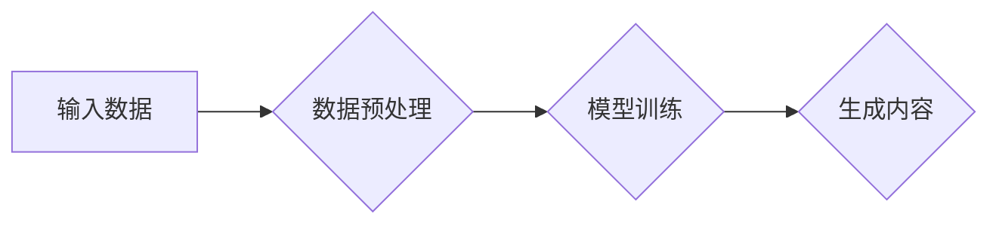

> AIGC, 幻觉问题, 数据质量, 生成式AI, 文本生成, 图像生成, 机器学习, 数据预处理, 模型训练

# AIGC的幻觉问题与数据质量

随着人工智能技术的飞速发展，生成式AI（AIGC）技术已经在文本生成、图像生成、音频生成等领域取得了显著的成果。然而，AIGC模型在生成内容时也常常出现“幻觉”问题，即生成的内容与现实世界不符，甚至包含虚假信息。本文将深入探讨AIGC的幻觉问题，并分析数据质量在这一问题中的关键作用。

## 1. 背景介绍

### 1.1 AIGC技术概述

AIGC（AI-Generated Content）是指通过人工智能技术自动生成文本、图像、音频等内容的系统。近年来，随着深度学习技术的进步，AIGC在多个领域取得了突破性进展，如文本生成、图像生成、视频生成等。

### 1.2 AIGC的幻觉问题

尽管AIGC技术在生成内容方面表现出色，但幻觉问题始终是制约其应用的一大难题。幻觉问题主要表现为以下几个方面：

- **事实错误**：生成的内容包含与事实不符的信息。
- **逻辑矛盾**：生成的内容在逻辑上存在矛盾。
- **风格不一致**：生成的内容在风格上与训练数据不一致。
- **重复性高**：生成的内容存在大量重复。

### 1.3 数据质量与幻觉问题

数据质量是影响AIGC模型性能的关键因素。高质量的数据可以帮助模型学习到更准确、丰富的知识，从而减少幻觉问题的发生。然而，现实世界中存在大量噪声、错误和偏差的数据，这些数据会直接影响AIGC模型的训练效果。

## 2. 核心概念与联系

### 2.1 AIGC模型架构

AIGC模型通常采用以下架构：



### 2.2 数据预处理

数据预处理是AIGC模型训练的重要环节，主要包括以下步骤：

- **数据清洗**：去除噪声、错误和重复数据。
- **数据增强**：通过旋转、缩放、裁剪等方式扩充数据集。
- **数据标注**：为数据添加标签，用于模型训练。

### 2.3 模型训练

模型训练是AIGC技术核心环节，主要包括以下步骤：

- **选择模型**：根据任务需求选择合适的模型架构。
- **训练模型**：使用高质量数据进行模型训练。
- **模型评估**：评估模型在测试集上的性能。

### 2.4 生成内容

生成内容是AIGC模型的应用环节，主要包括以下步骤：

- **输入提示**：输入提示信息，引导模型生成内容。
- **内容生成**：模型根据输入提示生成内容。
- **内容评估**：评估生成内容的质量。

## 3. 核心算法原理 & 具体操作步骤

### 3.1 算法原理概述

AIGC模型的算法原理主要包括以下两个方面：

- **生成模型**：使用生成模型（如Gaussian Mixture Model、Generative Adversarial Network等）生成内容。
- **判别模型**：使用判别模型（如神经网络）评估生成内容的质量。

### 3.2 算法步骤详解

**3.2.1 数据预处理**

1. **数据清洗**：使用数据清洗工具去除噪声、错误和重复数据。
2. **数据增强**：使用图像处理、文本处理等技术扩充数据集。
3. **数据标注**：人工标注数据标签，或使用自动标注工具进行标注。

**3.2.2 模型训练**

1. **选择模型**：根据任务需求选择合适的模型架构。
2. **训练模型**：使用高质量数据进行模型训练。
3. **模型评估**：评估模型在测试集上的性能。

**3.2.3 生成内容**

1. **输入提示**：输入提示信息，引导模型生成内容。
2. **内容生成**：模型根据输入提示生成内容。
3. **内容评估**：评估生成内容的质量。

### 3.3 算法优缺点

**优点**：

- **生成能力强**：AIGC模型可以生成高质量的内容，满足不同应用场景的需求。
- **泛化能力强**：AIGC模型可以学习到丰富的知识，适应不同的数据分布。

**缺点**：

- **数据依赖性强**：AIGC模型的性能高度依赖于数据质量。
- **幻觉问题**：AIGC模型在生成内容时可能出现幻觉问题。

### 3.4 算法应用领域

AIGC模型在以下领域具有广泛的应用：

- **文本生成**：新闻生成、对话生成、创意写作等。
- **图像生成**：艺术创作、广告设计、游戏开发等。
- **音频生成**：音乐生成、语音合成、语音识别等。

## 4. 数学模型和公式 & 详细讲解 & 举例说明

### 4.1 数学模型构建

AIGC模型的数学模型主要包括以下部分：

- **生成模型**：假设生成模型 $G$ 可以从随机噪声 $z$ 生成数据 $x$，即 $x = G(z)$。
- **判别模型**：假设判别模型 $D$ 可以判断数据 $x$ 的真实性，即 $D(x) = p(x)$。

### 4.2 公式推导过程

**4.2.1 生成模型**

生成模型通常采用以下公式：

$$
p(x) = \int p(x|z)p(z)dz
$$

其中，$p(x|z)$ 为生成模型生成的概率分布，$p(z)$ 为噪声分布。

**4.2.2 判别模型**

判别模型通常采用以下公式：

$$
p(x) = \frac{p(x|z)p(z)}{\int p(x|z)p(z)dz}
$$

其中，$p(x)$ 为数据 $x$ 的概率分布。

### 4.3 案例分析与讲解

以下以图像生成任务为例，分析AIGC模型的数学模型。

**4.3.1 生成模型**

假设生成模型采用生成对抗网络（GAN）结构，其中生成器 $G$ 和判别器 $D$ 分别为：

$$
G(z) = \mathcal{D}(z; \theta_G)
$$

$$
D(x) = \mathcal{D}(x; \theta_D)
$$

其中，$\theta_G$ 和 $\theta_D$ 分别为生成器和判别器的参数。

**4.3.2 判别模型**

假设判别器采用二元交叉熵损失函数，即：

$$
L_D(\theta_D) = -\frac{1}{N}\sum_{i=1}^N [D(x_i) \log(D(x_i)) + (1-D(x_i)) \log(1-D(x_i))]
$$

其中，$N$ 为样本数量，$x_i$ 为输入样本。

## 5. 项目实践：代码实例和详细解释说明

### 5.1 开发环境搭建

以下以Python为例，介绍AIGC项目的开发环境搭建。

1. 安装Python：从官网下载并安装Python 3.8及以上版本。
2. 安装深度学习框架：安装PyTorch或TensorFlow等深度学习框架。
3. 安装数据处理库：安装NumPy、Pandas等数据处理库。

### 5.2 源代码详细实现

以下以文本生成任务为例，展示AIGC模型的代码实现。

```python
import torch
import torch.nn as nn
import torch.optim as optim

# 定义生成器
class Generator(nn.Module):
    def __init__(self, z_dim, hidden_dim, output_dim):
        super(Generator, self).__init__()
        self.fc1 = nn.Linear(z_dim, hidden_dim)
        self.fc2 = nn.Linear(hidden_dim, output_dim)

    def forward(self, z):
        x = torch.relu(self.fc1(z))
        x = self.fc2(x)
        return x

# 定义判别器
class Discriminator(nn.Module):
    def __init__(self, input_dim):
        super(Discriminator, self).__init__()
        self.fc1 = nn.Linear(input_dim, 1024)
        self.fc2 = nn.Linear(1024, 1)

    def forward(self, x):
        x = torch.relu(self.fc1(x))
        x = torch.sigmoid(self.fc2(x))
        return x

# 模型参数
z_dim = 100
hidden_dim = 256
output_dim = 500
batch_size = 64

# 实例化模型
generator = Generator(z_dim, hidden_dim, output_dim).to(device)
discriminator = Discriminator(output_dim).to(device)

# 优化器
optimizer_G = optim.Adam(generator.parameters(), lr=0.001)
optimizer_D = optim.Adam(discriminator.parameters(), lr=0.001)

# 训练模型
# ...
```

### 5.3 代码解读与分析

以上代码实现了AIGC模型的基本结构，包括生成器和判别器。生成器从随机噪声 $z$ 生成文本 $x$，判别器判断文本 $x$ 的真实性。

### 5.4 运行结果展示

通过运行以上代码，可以训练一个简单的文本生成模型。生成的文本质量取决于模型参数、训练数据等。

## 6. 实际应用场景

### 6.1 新闻生成

AIGC模型可以用于新闻生成，自动生成新闻报道，提高新闻生产效率。

### 6.2 对话生成

AIGC模型可以用于对话生成，如智能客服、聊天机器人等，提高用户体验。

### 6.3 艺术创作

AIGC模型可以用于艺术创作，如音乐生成、绘画生成等，激发创意灵感。

### 6.4 未来应用展望

AIGC技术在未来将会有更广泛的应用，如：

- **娱乐产业**：自动生成电影、电视剧剧本、音乐等。
- **教育领域**：自动生成个性化学习资料、在线课程等。
- **医疗领域**：自动生成医学报告、病例分析等。

## 7. 工具和资源推荐

### 7.1 学习资源推荐

- **书籍**：
  - 《生成式对抗网络：原理与应用》
  - 《深度学习生成模型》
- **在线课程**：
  - Coursera上的《深度学习》课程
  - edX上的《深度学习与人工智能》课程
- **技术博客**：
  - Hugging Face
  - Medium上的机器学习博客

### 7.2 开发工具推荐

- **深度学习框架**：
  - PyTorch
  - TensorFlow
- **数据处理库**：
  - NumPy
  - Pandas

### 7.3 相关论文推荐

- **生成式对抗网络**：
  - Generative Adversarial Nets
  - Improved Generative Adversarial Networks
- **文本生成**：
  - SeqGAN: Sequence Generative Adversarial Nets with Policy Gradient
  - StyleGAN

## 8. 总结：未来发展趋势与挑战

### 8.1 研究成果总结

AIGC技术在近年来取得了显著的进展，但同时也面临着许多挑战。数据质量是影响AIGC模型性能的关键因素，幻觉问题是制约AIGC应用的一大难题。

### 8.2 未来发展趋势

未来，AIGC技术将朝着以下方向发展：

- **数据质量提升**：通过数据清洗、数据增强等技术提升数据质量。
- **模型鲁棒性增强**：提高模型对噪声和对抗样本的鲁棒性。
- **可解释性增强**：提高模型的可解释性，方便用户理解和信任。

### 8.3 面临的挑战

AIGC技术面临的挑战主要包括：

- **数据质量**：如何获取高质量的数据，是AIGC技术发展的关键。
- **幻觉问题**：如何减少幻觉问题，提高生成内容的质量。
- **可解释性**：如何提高模型的可解释性，增强用户对模型的信任。

### 8.4 研究展望

AIGC技术在未来将会有更广泛的应用，为人类社会带来更多便利。同时，需要持续关注数据质量、幻觉问题和可解释性等问题，推动AIGC技术的健康发展。

## 9. 附录：常见问题与解答

**Q1：AIGC技术的主要应用领域有哪些？**

A：AIGC技术在文本生成、图像生成、音频生成等领域具有广泛的应用。

**Q2：如何提升AIGC模型的数据质量？**

A：通过数据清洗、数据增强等技术提升数据质量。

**Q3：如何减少AIGC模型的幻觉问题？**

A：通过引入对抗训练、注意力机制等技术减少幻觉问题。

**Q4：AIGC技术有哪些潜在风险？**

A：AIGC技术可能产生虚假信息、歧视性内容等风险。

**Q5：AIGC技术未来发展趋势如何？**

A：AIGC技术将朝着数据质量提升、模型鲁棒性增强、可解释性增强等方向发展。

作者：禅与计算机程序设计艺术 / Zen and the Art of Computer Programming