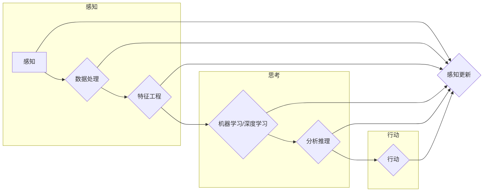

> 关键词：人工智能代理，工作流，保险行业，风险预测，机器学习，深度学习，自然语言处理，强化学习

# AI人工智能代理工作流 AI Agent WorkFlow：在保险风险预测中的应用

保险行业是风险管理的重要领域，随着大数据和人工智能技术的快速发展，利用AI技术进行风险预测成为提升保险业务效率和准确性的关键。人工智能代理（AI Agent）作为一种新兴的AI技术，能够在保险风险预测中扮演重要角色。本文将探讨AI Agent WorkFlow在保险风险预测中的应用，分析其核心概念、算法原理、实践步骤以及未来发展趋势。

## 1. 背景介绍

### 1.1 保险行业风险预测的挑战

保险行业面临着诸多挑战，其中风险预测是至关重要的环节。以下是保险行业风险预测面临的一些主要挑战：

- **数据质量与多样性**：保险行业数据通常包含多种类型，如结构化数据、半结构化数据和非结构化数据。数据质量参差不齐，且多样性大，给数据预处理和模型训练带来困难。
- **特征工程**：有效特征的选择和提取对于风险预测至关重要。然而，保险数据中的特征往往难以直接获得，需要大量的专业知识和经验。
- **模型复杂度**：保险风险预测涉及的因素繁多，需要复杂的模型来捕捉数据中的复杂关系。
- **实时性**：保险业务对风险预测的实时性要求较高，需要快速响应市场变化和客户需求。

### 1.2 人工智能代理的兴起

人工智能代理是一种具有自主决策能力的智能实体，能够在复杂环境中执行任务。在保险风险预测中，AI Agent可以自动收集数据、分析风险、制定策略，提高风险预测的效率和准确性。

## 2. 核心概念与联系

### 2.1 核心概念原理

AI Agent WorkFlow的核心概念包括：

- **感知**：AI Agent通过传感器、数据库等获取信息。
- **思考**：AI Agent基于感知到的信息，利用机器学习、深度学习等技术进行分析和推理。
- **行动**：AI Agent根据分析结果采取行动，如调整保险产品、优化理赔流程等。

### 2.2 架构的 Mermaid 流程图



## 3. 核心算法原理 & 具体操作步骤

### 3.1 算法原理概述

AI Agent WorkFlow在保险风险预测中的应用主要包括以下算法：

- **机器学习**：通过分析历史数据，建立预测模型，如线性回归、逻辑回归、决策树等。
- **深度学习**：利用神经网络模型，如卷积神经网络（CNN）、循环神经网络（RNN）、长短期记忆网络（LSTM）等，捕捉数据中的复杂关系。
- **自然语言处理（NLP）**：对文本数据进行处理和分析，如情感分析、实体识别等。
- **强化学习**：通过与环境交互，不断学习最优策略。

### 3.2 算法步骤详解

1. **数据收集**：收集保险公司的历史数据，包括索赔数据、客户信息、市场数据等。
2. **数据预处理**：对数据进行清洗、去重、填充等操作，提高数据质量。
3. **特征工程**：根据任务需求，提取有价值的特征，如客户年龄、性别、职业、保险产品类型等。
4. **模型选择**：根据数据特点和任务需求，选择合适的机器学习、深度学习、NLP或强化学习模型。
5. **模型训练**：使用训练数据进行模型训练，优化模型参数。
6. **模型评估**：使用验证数据评估模型性能，调整模型参数。
7. **模型部署**：将训练好的模型部署到生产环境，进行风险预测。

### 3.3 算法优缺点

- **机器学习**：优点是算法简单、解释性强；缺点是模型复杂度较高，需要大量数据。
- **深度学习**：优点是能够捕捉数据中的复杂关系，效果较好；缺点是模型难以解释，需要大量数据。
- **NLP**：优点是能够处理文本数据，适用于文本分析任务；缺点是数据预处理和特征工程较为复杂。
- **强化学习**：优点是能够学习最优策略，适用于需要与环境交互的任务；缺点是需要大量数据进行训练。

### 3.4 算法应用领域

AI Agent WorkFlow在保险风险预测中的应用领域包括：

- **欺诈检测**：识别和预防保险欺诈行为。
- **风险评估**：评估客户的风险等级，为保险产品定价提供依据。
- **理赔自动化**：自动化理赔流程，提高理赔效率。
- **客户流失预测**：预测客户流失风险，采取相应的挽留策略。

## 4. 数学模型和公式 & 详细讲解 & 举例说明

### 4.1 数学模型构建

以下是保险风险预测中常用的数学模型：

- **线性回归**：$y = \beta_0 + \beta_1x_1 + \beta_2x_2 + \cdots + \beta_nx_n + \epsilon$

- **逻辑回归**：$P(y=1) = \frac{1}{1 + e^{-(\beta_0 + \beta_1x_1 + \beta_2x_2 + \cdots + \beta_nx_n)}}$

- **神经网络**：$y = f(W \cdot x + b)$，其中 $W$ 是权重，$b$ 是偏置，$f$ 是激活函数。

### 4.2 公式推导过程

以下以线性回归为例，介绍公式推导过程：

1. **损失函数**：均方误差（MSE）：$\mathcal{L}(\theta) = \frac{1}{2} \sum_{i=1}^n (y_i - \hat{y}_i)^2$
2. **梯度下降**：求导后，对 $\theta$ 求偏导，得到梯度 $\nabla \mathcal{L}(\theta)$，然后进行梯度下降更新 $\theta$。

### 4.3 案例分析与讲解

以下是一个简单的保险欺诈检测案例：

- **数据集**：包含客户的个人信息、保险产品信息、索赔信息等。
- **特征**：年龄、性别、职业、保险产品类型、索赔金额等。
- **模型**：使用逻辑回归进行欺诈检测。

通过训练数据训练模型，可以得到一个逻辑回归模型，用于对新客户进行欺诈检测。如果模型预测概率大于某个阈值，则认为该客户存在欺诈风险。

## 5. 项目实践：代码实例和详细解释说明

### 5.1 开发环境搭建

1. 安装Python和必要的库，如NumPy、SciPy、Pandas、Scikit-learn等。
2. 选择合适的机器学习库，如Scikit-learn、TensorFlow、PyTorch等。

### 5.2 源代码详细实现

以下是一个使用Scikit-learn进行逻辑回归的简单案例：

```python
import numpy as np
import pandas as pd
from sklearn.model_selection import train_test_split
from sklearn.linear_model import LogisticRegression

# 加载数据
data = pd.read_csv('insurance_data.csv')

# 特征和标签
X = data.drop('fraud', axis=1)
y = data['fraud']

# 划分训练集和测试集
X_train, X_test, y_train, y_test = train_test_split(X, y, test_size=0.2)

# 训练模型
model = LogisticRegression()
model.fit(X_train, y_train)

# 预测
y_pred = model.predict(X_test)

# 评估
score = model.score(X_test, y_test)
print('Accuracy:', score)
```

### 5.3 代码解读与分析

以上代码演示了如何使用Scikit-learn进行逻辑回归模型训练、预测和评估。首先，加载数据集，然后划分训练集和测试集。接着，使用逻辑回归模型进行训练，并使用测试集进行预测。最后，计算模型准确率。

### 5.4 运行结果展示

假设测试集准确率为80%，则表明该模型具有一定的欺诈检测能力。

## 6. 实际应用场景

### 6.1 欺诈检测

AI Agent WorkFlow在保险欺诈检测中的应用，可以自动识别和预防欺诈行为，提高理赔效率，降低保险公司损失。

### 6.2 风险评估

AI Agent WorkFlow可以分析客户的风险等级，为保险公司提供产品定价、风险评估等决策依据。

### 6.3 理赔自动化

AI Agent WorkFlow可以自动化理赔流程，减少人工干预，提高理赔效率。

### 6.4 客户流失预测

AI Agent WorkFlow可以预测客户流失风险，采取相应的挽留策略，提高客户满意度。

## 7. 工具和资源推荐

### 7.1 学习资源推荐

- 《机器学习实战》
- 《深度学习》
- 《Python机器学习》
- 《强化学习：原理与实践》

### 7.2 开发工具推荐

- Python编程语言
- Scikit-learn、TensorFlow、PyTorch等机器学习库
- Jupyter Notebook等开发工具

### 7.3 相关论文推荐

- “Data Augmentation for Heterogeneous Graph Neural Networks”
- “Dynamic Risk Prediction for Insurance Applications Using Deep Learning”
- “An Overview of Artificial Intelligence in Insurance”
- “A Review of Machine Learning Techniques in Fraud Detection”

## 8. 总结：未来发展趋势与挑战

### 8.1 研究成果总结

AI Agent WorkFlow在保险风险预测中的应用取得了显著的成果，提高了风险预测的效率和准确性。然而，仍存在一些挑战需要克服。

### 8.2 未来发展趋势

- **多模态融合**：将文本、图像、语音等多模态数据融合到风险预测模型中。
- **迁移学习**：利用迁移学习技术在少量标注数据上进行模型训练。
- **可解释性**：提高模型的可解释性，帮助用户理解模型的决策过程。

### 8.3 面临的挑战

- **数据质量**：保险数据的质量参差不齐，需要进一步改进数据质量。
- **模型解释性**：提高模型的可解释性，以便用户理解模型的决策过程。
- **伦理道德**：确保AI Agent在风险预测中的应用符合伦理道德标准。

### 8.4 研究展望

未来，AI Agent WorkFlow将在保险风险预测中发挥越来越重要的作用。通过不断改进算法、优化模型、提高数据质量，AI Agent WorkFlow将为保险行业带来更多价值。

## 9. 附录：常见问题与解答

**Q1：AI Agent WorkFlow在保险风险预测中的优势是什么？**

A：AI Agent WorkFlow在保险风险预测中的优势包括：
- 提高风险预测的效率和准确性。
- 自动化理赔流程，提高理赔效率。
- 识别和预防欺诈行为，降低保险公司损失。
- 为保险公司提供产品定价、风险评估等决策依据。

**Q2：如何保证AI Agent WorkFlow的模型解释性？**

A：为了保证AI Agent WorkFlow的模型解释性，可以采取以下措施：
- 使用可解释的机器学习模型，如决策树、规则学习等。
- 分析模型的特征重要性，解释模型决策过程。
- 采用可视化技术，展示模型决策过程。

**Q3：AI Agent WorkFlow在保险行业有哪些应用场景？**

A：AI Agent WorkFlow在保险行业有以下应用场景：
- 欺诈检测
- 风险评估
- 理赔自动化
- 客户流失预测

**Q4：如何选择合适的AI Agent WorkFlow模型？**

A：选择合适的AI Agent WorkFlow模型需要考虑以下因素：
- 数据特点
- 任务需求
- 模型性能
- 模型解释性

**Q5：AI Agent WorkFlow在保险行业的发展前景如何？**

A：AI Agent WorkFlow在保险行业具有广阔的发展前景。随着AI技术的不断发展和应用，AI Agent WorkFlow将在保险行业发挥越来越重要的作用。

---

作者：禅与计算机程序设计艺术 / Zen and the Art of Computer Programming