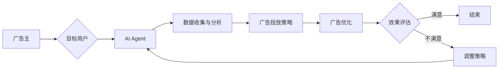

> 人工智能代理，工作流，广告细分市场，机器学习，自然语言处理，数据驱动决策

# AI人工智能代理工作流 AI Agent WorkFlow：在广告细分市场中的应用

随着人工智能技术的飞速发展，人工智能代理（AI Agent）已经成为广告行业的重要工具。AI Agent 工作流通过智能化的方式处理广告投放流程，优化广告效果，提高广告投放效率。本文将深入探讨 AI Agent 工作流在广告细分市场的应用，分析其核心概念、算法原理、实际案例以及未来发展趋势。

## 1. 背景介绍

### 1.1 广告细分市场的需求

在当今信息爆炸的时代，广告市场呈现出细分化的趋势。不同行业、不同产品、不同用户群体对广告的需求各不相同。传统的广告投放方式难以满足这种细分化的需求，需要更智能、更个性化的解决方案。

### 1.2 人工智能代理的兴起

人工智能代理是一种能够模拟人类智能行为的软件系统。在广告领域，AI Agent 可以根据广告主的需求和用户的行为数据，自动进行广告投放、优化和反馈，从而提高广告效果。

## 2. 核心概念与联系

### 2.1 核心概念

- **人工智能代理（AI Agent）**：一种能够自主决策、执行任务并与其他智能体交互的软件系统。
- **工作流（Workflow）**：一组任务的有序集合，这些任务按照一定的逻辑顺序执行，以完成某个特定的目标。
- **广告细分市场**：指根据不同行业、产品、用户群体等因素，将广告市场划分为多个具有相似特征的子市场。

### 2.2 Mermaid 流程图



### 2.3 核心概念联系

AI Agent 工作流通过连接广告主、目标用户、数据收集与分析、广告投放策略、广告优化和效果评估等环节，形成一个闭环系统，实现广告投放的自动化、智能化和精细化。

## 3. 核心算法原理 & 具体操作步骤

### 3.1 算法原理概述

AI Agent 工作流的算法原理主要包括以下几个方面：

- **机器学习**：通过机器学习算法分析用户行为数据，预测用户兴趣，为广告投放提供决策依据。
- **自然语言处理（NLP）**：利用 NLP 技术解析用户行为数据，提取关键词和语义信息，辅助广告投放策略制定。
- **数据挖掘**：从大量广告投放数据中挖掘有价值的信息，为广告优化提供数据支持。

### 3.2 算法步骤详解

1. **数据收集与分析**：收集用户行为数据、广告投放数据、市场趋势数据等，利用数据挖掘和统计方法进行分析，提取有用信息。
2. **广告投放策略**：根据分析结果，结合机器学习算法，制定广告投放策略，包括广告内容、投放平台、投放时间等。
3. **广告投放**：根据广告投放策略，在目标平台上投放广告。
4. **广告优化**：根据广告投放效果，调整广告投放策略，包括广告内容、投放平台、投放时间等。
5. **效果评估**：评估广告投放效果，包括点击率、转化率、ROI 等。

### 3.3 算法优缺点

**优点**：

- 自动化：实现广告投放的自动化，提高广告投放效率。
- 个性化：根据用户行为数据，实现广告投放的个性化，提高广告效果。
- 高效：通过数据分析和机器学习算法，提高广告投放的精准度。

**缺点**：

- 数据依赖：需要大量高质量的数据才能保证算法效果。
- 复杂性：算法设计复杂，需要专业人才进行维护和优化。
- 算法偏差：机器学习算法可能存在偏差，导致广告投放结果不公平。

### 3.4 算法应用领域

AI Agent 工作流在广告细分市场中的应用主要包括以下几个方面：

- **精准营销**：根据用户行为数据，精准投放广告，提高广告转化率。
- **效果评估**：实时评估广告投放效果，及时调整广告策略。
- **广告创意**：利用 AI 技术生成广告创意，提高广告吸引力。
- **广告优化**：自动优化广告投放策略，提高广告效果。

## 4. 数学模型和公式 & 详细讲解 & 举例说明

### 4.1 数学模型构建

AI Agent 工作流中的数学模型主要包括以下几个方面：

- **用户行为模型**：利用概率模型或深度学习模型，描述用户在广告投放过程中的行为特征。
- **广告投放模型**：利用贝叶斯网络或决策树模型，描述广告投放过程中的决策过程。
- **效果评估模型**：利用统计模型或机器学习模型，评估广告投放效果。

### 4.2 公式推导过程

以下以用户行为模型为例，介绍公式推导过程。

假设用户在广告投放过程中的行为特征可以表示为向量 $\mathbf{x} \in \mathbb{R}^n$，其中 $x_i$ 表示第 $i$ 个特征。用户的行为概率分布可以表示为概率密度函数 $f(\mathbf{x})$。

设 $y$ 表示用户对广告的反应（如点击、不点击等），则 $y$ 可以表示为：

$$
y = f(\mathbf{x}) \cdot g(\mathbf{x})
$$

其中 $g(\mathbf{x})$ 为用户对广告的反应函数。

### 4.3 案例分析与讲解

以下以广告投放模型为例，介绍案例分析与讲解。

假设广告投放模型采用贝叶斯网络，其中包含以下节点：

- 广告内容：表示广告的文本、图片、视频等。
- 投放平台：表示广告投放的平台，如网站、APP、社交媒体等。
- 投放时间：表示广告投放的具体时间。

贝叶斯网络结构如下：

```
        广告内容
         /   \
        /     \
       /       \
      /         \
投放平台       投放时间
```

根据贝叶斯网络，我们可以计算出每个节点的概率分布，从而确定最佳的广告投放策略。

## 5. 项目实践：代码实例和详细解释说明

### 5.1 开发环境搭建

本文以 Python 语言为例，介绍 AI Agent 工作流的代码实现。以下是开发环境搭建步骤：

1. 安装 Python 3.7 或更高版本。
2. 安装 TensorFlow、Keras、Scikit-learn 等机器学习库。
3. 安装相关数据处理库，如 Pandas、NumPy 等。

### 5.2 源代码详细实现

以下是一个简单的 AI Agent 工作流代码实例：

```python
import pandas as pd
from sklearn.model_selection import train_test_split
from sklearn.preprocessing import StandardScaler
from sklearn.ensemble import RandomForestClassifier

# 加载数据
data = pd.read_csv('advertising_data.csv')

# 数据预处理
X = data.drop('click', axis=1).values
y = data['click'].values
X_train, X_test, y_train, y_test = train_test_split(X, y, test_size=0.2, random_state=42)
scaler = StandardScaler()
X_train = scaler.fit_transform(X_train)
X_test = scaler.transform(X_test)

# 模型训练
model = RandomForestClassifier()
model.fit(X_train, y_train)

# 预测
y_pred = model.predict(X_test)

# 评估
print("Accuracy:", accuracy_score(y_test, y_pred))
```

### 5.3 代码解读与分析

上述代码实现了以下功能：

- 加载数据：从 CSV 文件中加载数据。
- 数据预处理：对数据进行标准化处理。
- 模型训练：使用随机森林分类器进行训练。
- 预测：对测试数据进行预测。
- 评估：计算预测准确率。

### 5.4 运行结果展示

假设测试集准确率为 80%，则表示该广告投放模型在该数据集上取得了较好的效果。

## 6. 实际应用场景

### 6.1 精准营销

AI Agent 工作流可以根据用户行为数据，精准地向目标用户投放广告，提高广告转化率。

### 6.2 效果评估

AI Agent 工作流可以实时评估广告投放效果，帮助广告主及时调整广告策略。

### 6.3 广告创意

AI Agent 工作流可以利用 NLP 技术生成广告创意，提高广告吸引力。

### 6.4 广告优化

AI Agent 工作流可以自动优化广告投放策略，提高广告效果。

## 7. 工具和资源推荐

### 7.1 学习资源推荐

- 《Python数据分析与机器学习实战》
- 《TensorFlow 2.x深度学习实战》
- 《深度学习之美》

### 7.2 开发工具推荐

- TensorFlow
- Keras
- Scikit-learn

### 7.3 相关论文推荐

- "A Survey of Adversarial Attack and Defense in Machine Learning"
- "An Overview of Deep Learning Techniques for Text Classification"
- "A Review of Deep Learning for Image Classification"

## 8. 总结：未来发展趋势与挑战

### 8.1 研究成果总结

本文深入探讨了 AI Agent 工作流在广告细分市场的应用，分析了其核心概念、算法原理、实际案例以及未来发展趋势。研究表明，AI Agent 工作流能够有效提高广告投放效果和效率，具有广阔的应用前景。

### 8.2 未来发展趋势

- **多模态融合**：将文本、图像、视频等多种模态数据融合，实现更加全面的用户画像和广告投放策略。
- **强化学习**：利用强化学习技术，实现更加智能的决策和优化。
- **知识图谱**：利用知识图谱技术，提供更精准的广告投放和推荐。

### 8.3 面临的挑战

- **数据质量**：广告数据质量直接影响 AI Agent 工作流的性能，需要保证数据的质量和多样性。
- **算法偏见**：AI Agent 工作流可能存在算法偏见，需要采取措施避免歧视和不公平。
- **模型可解释性**：提高 AI Agent 工作流的模型可解释性，便于用户理解和使用。

### 8.4 研究展望

未来，AI Agent 工作流将在广告细分市场发挥更大的作用，推动广告行业向智能化、个性化方向发展。

## 9. 附录：常见问题与解答

**Q1：AI Agent 工作流在广告细分市场中的优势是什么？**

A：AI Agent 工作流在广告细分市场中的优势主要包括以下几点：

- 提高广告投放效果和效率。
- 实现广告投放的个性化。
- 自动优化广告投放策略。

**Q2：AI Agent 工作流需要哪些技术支持？**

A：AI Agent 工作流需要以下技术支持：

- 机器学习
- 自然语言处理
- 数据挖掘

**Q3：AI Agent 工作流在广告细分市场有哪些应用场景？**

A：AI Agent 工作流在广告细分市场有以下应用场景：

- 精准营销
- 效果评估
- 广告创意
- 广告优化

**Q4：如何保证 AI Agent 工作流的数据质量？**

A：为保证 AI Agent 工作流的数据质量，可以采取以下措施：

- 使用高质量的数据源。
- 定期清洗和更新数据。
- 对数据进行去重和异常值处理。

**Q5：如何解决 AI Agent 工作流的算法偏见问题？**

A：为解决 AI Agent 工作流的算法偏见问题，可以采取以下措施：

- 数据平衡：保证训练数据中各类别数据的比例均衡。
- 模型审查：定期对模型进行审查，识别和消除潜在的偏见。
- 用户反馈：收集用户反馈，及时调整模型参数。

作者：禅与计算机程序设计艺术 / Zen and the Art of Computer Programming