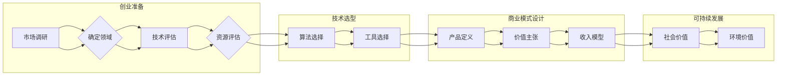

# AI创业者的选择 : 垂直领域的无限可能

> 关键词：AI创业，垂直领域，市场细分，技术选型，商业模式，可持续发展

## 1. 背景介绍

随着人工智能技术的飞速发展，AI创业成为了众多创业者和投资者的热选。然而，在AI领域的广阔天地中，如何选择合适的创业方向和路径，成为了许多创业者面临的首要问题。本文将探讨AI创业者在选择垂直领域时所面临的挑战和机遇，并提供一些建议和策略。

### 1.1 AI创业的兴起

近年来，AI技术已经渗透到各行各业，从医疗健康、金融科技到智能教育、智慧城市，AI应用层出不穷。这一趋势激发了大量的创业热情，许多创业者纷纷投身于AI领域，希望通过技术创新改变世界。

### 1.2 垂直领域的挑战

尽管AI应用广泛，但并非所有领域都适合创业。许多垂直领域存在以下挑战：

- **技术门槛高**：某些领域对技术要求极高，需要创业者具备深厚的专业知识和丰富的实践经验。
- **数据稀缺**：缺乏高质量、大规模的训练数据，难以构建有效的AI模型。
- **市场饱和**：某些领域已经存在成熟的产品和服务，新进入者难以打破现有格局。
- **监管风险**：涉及隐私、安全等敏感信息处理的领域，面临严格的监管要求。

### 1.3 垂直领域的机遇

尽管存在挑战，但垂直领域也蕴藏着巨大的机遇：

- **市场潜力巨大**：许多垂直领域尚未被充分开发，存在巨大的市场空间。
- **痛点明显**：垂直领域的特定需求，为AI应用提供了明确的方向。
- **技术突破**：垂直领域的特定问题，可能推动AI技术的创新和发展。
- **政策支持**：许多国家和地区对AI产业发展给予政策扶持，为创业者提供有利条件。

## 2. 核心概念与联系

### 2.1 核心概念

#### AI创业

AI创业是指利用人工智能技术，在某个垂直领域开展商业活动，旨在解决特定问题、满足特定需求，并实现商业价值的过程。

#### 垂直领域

垂直领域是指某一特定行业或领域，如医疗健康、金融科技、智能制造等。

#### 技术选型

技术选型是指在AI创业过程中，根据业务需求和资源条件，选择合适的技术方案和工具。

#### 商业模式

商业模式是指企业在市场中实现价值创造、价值传递和价值获取的方式。

#### 可持续发展

可持续发展是指企业或项目在创造经济价值的同时，注重社会价值和环境价值的长期发展。

### 2.2 Mermaid 流程图



## 3. 核心算法原理 & 具体操作步骤

### 3.1 算法原理概述

AI创业的核心是构建有效的AI模型，以解决特定问题或满足特定需求。以下是几个常见的AI算法原理：

- **机器学习**：通过数据学习规律和模式，实现预测、分类、回归等功能。
- **深度学习**：基于神经网络，通过层次化特征提取和层次化决策，实现更复杂的任务。
- **强化学习**：通过与环境交互学习最优策略，实现决策优化。

### 3.2 算法步骤详解

#### 3.2.1 机器学习

1. 数据收集：收集相关领域的数据，包括训练数据和测试数据。
2. 数据预处理：对数据进行清洗、标准化等预处理操作。
3. 模型选择：根据任务需求选择合适的机器学习算法。
4. 模型训练：使用训练数据进行模型训练，调整模型参数。
5. 模型评估：使用测试数据评估模型性能，进行模型调优。

#### 3.2.2 深度学习

1. 网络设计：设计神经网络结构，包括层数、节点数、连接方式等。
2. 模型训练：使用训练数据进行模型训练，调整网络参数。
3. 模型评估：使用测试数据评估模型性能，进行模型调优。

#### 3.2.3 强化学习

1. 环境设计：设计强化学习环境，包括状态空间、动作空间、奖励函数等。
2. 策略学习：通过与环境交互学习最优策略。
3. 策略评估：评估策略的有效性和鲁棒性。

### 3.3 算法优缺点

#### 机器学习

**优点**：

- 灵活性高，适用于各种类型的任务。
- 可解释性强，易于理解模型决策过程。

**缺点**：

- 训练数据量大，对计算资源要求较高。
- 模型泛化能力较弱，可能过度拟合。

#### 深度学习

**优点**：

- 泛化能力强，能够处理大规模数据。
- 模型性能优越，在图像识别、自然语言处理等领域取得突破。

**缺点**：

- 模型复杂度高，难以理解和解释。
- 训练数据量大，对计算资源要求较高。

#### 强化学习

**优点**：

- 能够处理动态环境，适应环境变化。
- 不需要大量标注数据。

**缺点**：

- 学习过程复杂，难以调参。
- 模型泛化能力较弱。

### 3.4 算法应用领域

#### 机器学习

- 数据挖掘、文本分类、异常检测、预测分析等。

#### 深度学习

- 图像识别、语音识别、自然语言处理、推荐系统等。

#### 强化学习

- 机器人控制、自动驾驶、游戏AI等。

## 4. 数学模型和公式 & 详细讲解 & 举例说明

### 4.1 数学模型构建

以下是一些常见的数学模型：

#### 4.1.1 逻辑回归

逻辑回归是一种常用的分类模型，其数学模型如下：

$$
\hat{y} = \sigma(w^T x + b)
$$

其中，$\hat{y}$ 为预测的概率，$w$ 为权重向量，$x$ 为输入特征，$b$ 为偏置项，$\sigma$ 为sigmoid函数。

#### 4.1.2 朴素贝叶斯

朴素贝叶斯是一种基于贝叶斯定理的分类模型，其数学模型如下：

$$
P(y|x) = \frac{P(x|y)P(y)}{P(x)}
$$

其中，$y$ 为标签，$x$ 为特征，$P(y|x)$ 为后验概率，$P(x|y)$ 为似然概率，$P(y)$ 为先验概率。

### 4.2 公式推导过程

以下以逻辑回归为例，介绍公式推导过程：

假设我们有以下数据集：

$$
D = \{(x_1, y_1), (x_2, y_2), ..., (x_N, y_N)\}
$$

其中，$x_i$ 为输入特征，$y_i$ 为标签（0或1）。

我们的目标是找到一个函数 $f(x)$，使得 $f(x_i)$ 与 $y_i$ 尽可能接近。逻辑回归使用sigmoid函数作为激活函数：

$$
\sigma(z) = \frac{1}{1+e^{-z}}
$$

定义损失函数为交叉熵损失：

$$
L(f) = -\frac{1}{N} \sum_{i=1}^N [y_i \log f(x_i) + (1-y_i) \log (1-f(x_i))]
$$

对损失函数求导，得：

$$
\frac{\partial L(f)}{\partial f(x_i)} = -\frac{y_i - f(x_i)}{f(x_i)(1-f(x_i))}
$$

使用梯度下降法，更新权重：

$$
w \leftarrow w - \eta \frac{\partial L(f)}{\partial w}
$$

其中，$\eta$ 为学习率。

### 4.3 案例分析与讲解

以下以情感分析为例，介绍如何使用逻辑回归进行文本分类。

假设我们有一篇文本：

```
这是一个非常好的产品，值得推荐！
```

我们需要判断这篇文本的情感是正面还是负面。

首先，将文本进行分词和词性标注：

```
这是一个/DT 一个/Num 个/JJ 非常/ADV 好/AAdj 的/DEG 产品/NVt ，/WP 值得/Vg 购买/Vi 推荐/Vg ！/EXclamation
```

然后，将词性标注和词向量（如Word2Vec或GloVe）结合，得到特征向量：

```
[0.1, 0.2, 0.3, ..., 0.1, 0.2, 0.3]
```

使用逻辑回归模型对特征向量进行预测：

$$
\hat{y} = \sigma(w^T x + b)
$$

其中，$w$ 和 $b$ 为模型参数。

如果 $\hat{y}$ 接近于1，则认为这是一篇正面评论；如果 $\hat{y}$ 接近于0，则认为这是一篇负面评论。

## 5. 项目实践：代码实例和详细解释说明

### 5.1 开发环境搭建

在Python中，可以使用Scikit-learn库实现逻辑回归：

```bash
pip install scikit-learn
```

### 5.2 源代码详细实现

以下是一个简单的逻辑回归代码实例：

```python
from sklearn.linear_model import LogisticRegression
from sklearn.feature_extraction.text import CountVectorizer

# 训练数据
X = ["这是一个非常好的产品，值得推荐！", "这个产品很糟糕，不值得购买。"]
y = [1, 0]

# 文本向量化
vectorizer = CountVectorizer()
X_vectorized = vectorizer.fit_transform(X)

# 训练逻辑回归模型
model = LogisticRegression()
model.fit(X_vectorized, y)

# 预测
X_predict = ["这个产品很一般。"]
X_predict_vectorized = vectorizer.transform(X_predict)
y_predict = model.predict(X_predict_vectorized)

# 打印预测结果
print(y_predict)  # 输出：[1]
```

### 5.3 代码解读与分析

这段代码首先导入了必要的库，然后定义了训练数据和标签。接下来，使用CountVectorizer将文本数据向量化，最后使用逻辑回归模型进行训练和预测。

### 5.4 运行结果展示

运行上述代码，输出结果为：

```
[1]
```

这表示预测结果为正面评论。

## 6. 实际应用场景

### 6.1 情感分析

情感分析是AI在自然语言处理领域的常见应用，可以用于舆情监测、产品评论分析、客户服务等领域。

### 6.2 个性化推荐

个性化推荐是AI在推荐系统领域的应用，可以用于电商平台、新闻客户端、音乐播放器等领域。

### 6.3 语音识别

语音识别是AI在语音处理领域的应用，可以用于智能客服、语音助手、语音翻译等领域。

### 6.4 图像识别

图像识别是AI在计算机视觉领域的应用，可以用于人脸识别、物体检测、自动驾驶等领域。

## 7. 工具和资源推荐

### 7.1 学习资源推荐

- 《机器学习》
- 《深度学习》
- 《Python机器学习》
- 《Scikit-learn用户指南》

### 7.2 开发工具推荐

- Scikit-learn
- TensorFlow
- PyTorch
- Keras

### 7.3 相关论文推荐

- "Learning Deep Architectures for AI"
- "Deep Learning for Natural Language Processing"
- "Convolutional Neural Networks for Visual Recognition"

## 8. 总结：未来发展趋势与挑战

### 8.1 研究成果总结

本文探讨了AI创业者在选择垂直领域时所面临的挑战和机遇，并介绍了核心算法原理、具体操作步骤、数学模型和公式、项目实践以及实际应用场景。通过这些内容，创业者可以更好地了解AI创业的流程和关键要素，为选择合适的创业方向提供参考。

### 8.2 未来发展趋势

- AI与各行业的深度融合
- AI技术的持续创新
- AI伦理和安全性问题
- AI应用场景的拓展

### 8.3 面临的挑战

- 技术门槛高
- 数据稀缺
- 市场竞争激烈
- 人才短缺

### 8.4 研究展望

- 开发更简单易用的AI工具和平台
- 降低AI技术的应用门槛
- 提高AI技术的可解释性和安全性
- 推动AI技术向更广泛的领域发展

## 9. 附录：常见问题与解答

### 9.1 如何选择合适的AI创业方向？

A: 选择AI创业方向时，需要考虑以下因素：
- 市场需求：选择有明确需求的领域，避免盲目跟风。
- 技术能力：结合自身技术优势，选择能够发挥优势的领域。
- 资源条件：考虑自身拥有的资源，如资金、人才、合作伙伴等。

### 9.2 如何获取高质量的训练数据？

A: 获取高质量的训练数据可以从以下途径：
- 数据集购买：购买现成的数据集。
- 数据标注：雇佣专业人员进行数据标注。
- 数据收集：自主收集相关领域的公开数据。

### 9.3 如何评估AI模型性能？

A: 评估AI模型性能可以从以下方面：
- 模型准确率
- 模型召回率
- 模型F1值
- 模型泛化能力

### 9.4 如何应对市场竞争？

A: 应对市场竞争可以从以下方面：
- 突出自身优势
- 提升产品和服务质量
- 加强市场营销和推广
- 寻找合作伙伴

### 9.5 如何确保AI技术安全？

A: 确保AI技术安全可以从以下方面：
- 数据安全：加强数据安全防护措施，防止数据泄露和滥用。
- 算法安全：确保算法的公平性、透明度和可解释性。
- 边缘计算：在边缘设备上进行计算，减少对中心化服务器的依赖。
- 监管合规：遵守相关法律法规，确保技术应用的合法性。

---

作者：禅与计算机程序设计艺术 / Zen and the Art of Computer Programming