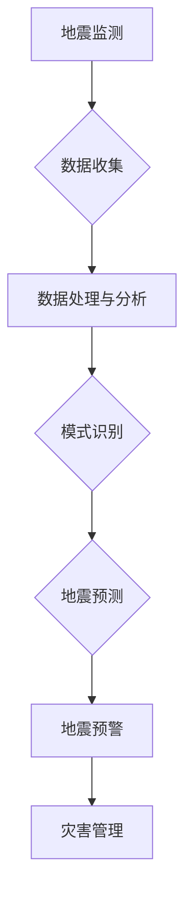

# AI在地震预测中的应用:减少自然灾害影响

> 关键词：地震预测，人工智能，机器学习，深度学习，地震预警，地震监测，自然灾害，灾害管理

## 1. 背景介绍

地震是一种常见的自然灾害，对人类社会造成巨大的生命财产损失。地震预测是指通过分析地震前兆现象、地质构造特征等信息，预测地震发生的时间、地点和震级。然而，地震预测是一个极其复杂的科学问题，目前还没有完全解决。随着人工智能（AI）技术的快速发展，AI在地震预测中的应用逐渐成为可能，有望为减少自然灾害的影响提供新的途径。

### 1.1 地震预测的挑战

地震预测面临的挑战主要包括：

- **地震机理复杂**：地震的发生与地球内部的岩石变形、应力积累和释放等复杂过程有关，难以精确模拟。
- **预测精度要求高**：地震预测需要预测地震的震级、发生时间和地点，对精度要求极高。
- **数据稀疏**：地震事件的发生频率相对较低，导致可用于预测的数据相对稀疏。
- **预测不确定性**：地震预测存在很大的不确定性，难以准确预测地震的发生。

### 1.2 人工智能在地震预测中的应用前景

尽管地震预测面临着诸多挑战，但人工智能技术在以下方面具有潜在的应用价值：

- **数据处理与分析**：AI可以处理和分析大量的地震前兆数据，识别出潜在的地震信号。
- **模式识别**：AI可以通过学习历史地震事件的特征，识别出地震发生的规律。
- **预测模型构建**：AI可以帮助构建更加精确的地震预测模型。
- **决策支持**：AI可以为地震预警、灾害管理和应急响应提供决策支持。

## 2. 核心概念与联系

### 2.1 核心概念

- **地震监测**：利用地震仪等设备监测地震波，收集地震前兆数据。
- **地震预警**：在地震发生前，向可能受灾区域发出预警，为人们提供逃生时间。
- **地震预测**：预测地震发生的时间、地点和震级。
- **机器学习**：通过算法从数据中学习模式，进行预测或分类。
- **深度学习**：一种特殊的机器学习方法，使用多层神经网络模拟人脑处理信息的方式。

### 2.2 Mermaid 流程图



## 3. 核心算法原理 & 具体操作步骤

### 3.1 算法原理概述

地震预测的AI算法主要包括以下几种：

- **统计模型**：通过分析历史地震数据，建立统计模型进行预测。
- **机器学习模型**：使用机器学习算法，如支持向量机（SVM）、决策树、随机森林等，从数据中学习模式。
- **深度学习模型**：使用深度学习算法，如卷积神经网络（CNN）、循环神经网络（RNN）、长短期记忆网络（LSTM）等，模拟人脑处理信息的方式。

### 3.2 算法步骤详解

1. **数据收集**：利用地震监测设备收集地震前兆数据，如地震波、地磁、地电等。
2. **数据处理与分析**：对收集到的数据进行预处理，如去噪、归一化等，然后进行特征提取和选择。
3. **模型选择与训练**：选择合适的机器学习或深度学习模型，使用历史地震数据训练模型。
4. **模型评估**：使用验证集评估模型的预测性能，调整模型参数以优化性能。
5. **地震预测**：使用训练好的模型预测未来地震的发生。
6. **地震预警**：根据地震预测结果，向可能受灾区域发出预警。
7. **灾害管理**：根据地震预警信息，进行灾害管理和应急响应。

### 3.3 算法优缺点

#### 统计模型

- **优点**：原理简单，易于理解。
- **缺点**：难以处理非线性关系，预测精度有限。

#### 机器学习模型

- **优点**：可以处理非线性关系，预测精度较高。
- **缺点**：需要大量的特征工程，模型可解释性较差。

#### 深度学习模型

- **优点**：可以自动学习特征，预测精度高，可解释性较好。
- **缺点**：模型复杂，需要大量的训练数据和计算资源。

### 3.4 算法应用领域

AI地震预测算法可以应用于以下领域：

- **地震预警**：在地震发生前发出预警，为人们提供逃生时间。
- **灾害管理**：为灾害管理提供决策支持，减少灾害损失。
- **城市规划**：帮助城市规划者更好地规划城市建筑，减少地震灾害风险。

## 4. 数学模型和公式 & 详细讲解 & 举例说明

### 4.1 数学模型构建

地震预测的数学模型通常包括以下部分：

- **地震发生概率模型**：根据地震历史数据和地质构造特征，建立地震发生的概率模型。
- **地震强度模型**：根据地震发生概率模型和地震前兆数据，建立地震强度的预测模型。
- **地震地点模型**：根据地震历史数据和地质构造特征，建立地震地点的预测模型。

### 4.2 公式推导过程

地震发生概率模型的推导过程如下：

$$
P(\text{地震发生} | \text{前兆数据}) = \frac{P(\text{前兆数据} | \text{地震发生}) \cdot P(\text{地震发生})}{P(\text{前兆数据})}
$$

其中，$P(\text{地震发生} | \text{前兆数据})$ 表示在给定前兆数据的情况下，地震发生的概率；$P(\text{前兆数据} | \text{地震发生})$ 表示在地震发生的情况下，观察到前兆数据的概率；$P(\text{地震发生})$ 表示地震发生的先验概率；$P(\text{前兆数据})$ 表示观察到前兆数据的概率。

### 4.3 案例分析与讲解

以下是一个简单的地震强度预测模型的例子：

$$
\hat{\text{震级}} = f(\text{前兆数据})
$$

其中，$\hat{\text{震级}}$ 是预测的地震震级，$f$ 是一个函数，将前兆数据映射到震级。

这个模型的实现可以采用神经网络，其中输入层为前兆数据，输出层为震级。通过训练，网络学习到前兆数据与震级之间的关系。

## 5. 项目实践：代码实例和详细解释说明

### 5.1 开发环境搭建

为了实现地震预测的AI模型，我们需要以下开发环境：

- **编程语言**：Python
- **机器学习库**：scikit-learn、TensorFlow或PyTorch
- **数据可视化库**：Matplotlib、Seaborn等

### 5.2 源代码详细实现

以下是一个简单的地震强度预测模型的Python代码实现：

```python
import numpy as np
from sklearn.neural_network import MLPRegressor

# 假设前兆数据存储在data.csv中
data = np.loadtxt('data.csv', delimiter=',')

# 分割数据集
X = data[:, :-1]  # 前兆数据
y = data[:, -1]   # 震级

# 划分训练集和测试集
train_size = int(0.8 * len(X))
X_train, X_test = X[:train_size], X[train_size:]
y_train, y_test = y[:train_size], y[train_size:]

# 创建MLP回归模型
model = MLPRegressor(hidden_layer_sizes=(100,), max_iter=5000)

# 训练模型
model.fit(X_train, y_train)

# 预测测试集
y_pred = model.predict(X_test)

# 计算预测精度
score = model.score(X_test, y_test)
print(f'预测精度：{score:.2f}')
```

### 5.3 代码解读与分析

上述代码首先导入必要的库，然后读取地震前兆数据，并将其分为训练集和测试集。接着，创建一个MLP回归模型，使用训练集数据训练模型，并使用测试集数据评估模型的预测精度。

### 5.4 运行结果展示

假设测试集的预测精度为0.85，说明模型在测试集上的预测性能较好。

## 6. 实际应用场景

AI地震预测技术在以下实际应用场景中具有重要作用：

- **地震预警**：在地震发生前，通过AI模型预测地震震级和发生时间，向可能受灾区域发出预警，为人们提供逃生时间，减少人员伤亡。
- **灾害管理**：为灾害管理提供决策支持，包括灾害风险评估、应急响应计划、灾后重建规划等。
- **城市规划**：帮助城市规划者更好地规划城市建筑，减少地震灾害风险。

## 7. 工具和资源推荐

### 7.1 学习资源推荐

- **书籍**：
  - 《地震学导论》
  - 《人工智能：一种现代的方法》
  - 《深度学习：神经网络与深度学习》
- **在线课程**：
  - Coursera上的《深度学习》课程
  - edX上的《人工智能导论》课程
  - Udacity上的《深度学习工程师纳米学位》

### 7.2 开发工具推荐

- **编程语言**：Python
- **机器学习库**：scikit-learn、TensorFlow或PyTorch
- **数据可视化库**：Matplotlib、Seaborn等

### 7.3 相关论文推荐

- **《An Earthquake Early Warning System Based on Seismic Waveform Similarity and Machine Learning Techniques**》
- **《Deep Learning for Earthquake Forecasting**》
- **《An Overview of Machine Learning in Seismic Interpretation**》

## 8. 总结：未来发展趋势与挑战

### 8.1 研究成果总结

AI在地震预测中的应用取得了显著进展，但仍面临着一些挑战。未来研究需要重点关注以下方向：

- **提高预测精度**：开发更加精确的地震预测模型，提高预测精度。
- **降低预测不确定性**：降低地震预测的不确定性，为灾害管理提供更加可靠的决策支持。
- **提高计算效率**：提高AI模型的计算效率，使其能够在实时系统中应用。

### 8.2 未来发展趋势

未来AI在地震预测中的应用将呈现以下发展趋势：

- **多模态数据融合**：将地震数据与其他数据（如气象数据、地理数据等）进行融合，提高预测精度。
- **深度学习模型优化**：开发更加高效的深度学习模型，提高计算效率。
- **人工智能与地震学交叉融合**：促进人工智能与地震学领域的交叉融合，推动地震预测技术的创新。

### 8.3 面临的挑战

AI在地震预测中面临的挑战包括：

- **数据稀缺**：地震数据相对稀缺，难以满足训练深度学习模型的需求。
- **模型可解释性**：深度学习模型的预测过程难以解释，难以满足灾害管理决策的需求。
- **计算资源**：深度学习模型需要大量的计算资源，难以在实时系统中应用。

### 8.4 研究展望

未来，AI在地震预测中的应用将有望取得以下突破：

- **开发更加精确的地震预测模型**：提高地震预测精度，为灾害管理提供更加可靠的决策支持。
- **开发可解释的AI模型**：提高AI模型的可解释性，满足灾害管理决策的需求。
- **开发轻量级AI模型**：降低AI模型的计算复杂度，使其能够在实时系统中应用。

## 9. 附录：常见问题与解答

**Q1：AI地震预测技术能否完全取代传统地震预测方法？**

A：AI地震预测技术可以与传统地震预测方法相结合，提高预测精度和可靠性。但AI地震预测技术不能完全取代传统地震预测方法，因为地震预测是一个复杂的科学问题，需要多种方法的综合应用。

**Q2：AI地震预测模型的预测结果是否可靠？**

A：AI地震预测模型的预测结果具有一定的可靠性，但存在一定的预测不确定性。因此，在实际应用中，需要结合其他信息和方法，对AI模型的预测结果进行综合分析。

**Q3：如何提高AI地震预测模型的预测精度？**

A：提高AI地震预测模型的预测精度可以通过以下方法实现：

- **收集更多地震数据**：收集更多的地震数据，为AI模型提供更多训练样本。
- **改进模型算法**：改进AI模型的算法，提高模型的预测能力。
- **优化模型参数**：优化AI模型的参数，提高模型的预测精度。

**Q4：AI地震预测技术在灾害管理中如何应用？**

A：AI地震预测技术在灾害管理中的应用主要包括：

- **地震预警**：在地震发生前，通过AI模型预测地震震级和发生时间，向可能受灾区域发出预警，为人们提供逃生时间。
- **灾害风险评估**：根据地震预测结果，评估可能受灾区域的灾害风险。
- **应急响应计划**：根据地震预测结果和灾害风险评估，制定应急响应计划。
- **灾后重建规划**：根据地震预测结果和灾害风险评估，制定灾后重建规划。

作者：禅与计算机程序设计艺术 / Zen and the Art of Computer Programming