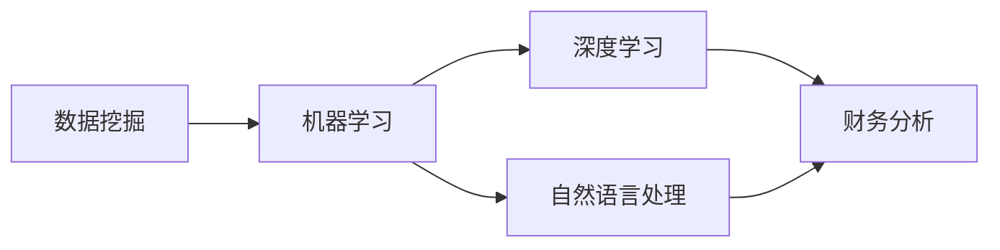

> 关键词：人工智能，财务分析，预测模型，机器学习，自然语言处理，数据挖掘，深度学习，金融市场

# AI在财务分析与预测中的作用

随着信息技术的飞速发展，人工智能（AI）技术已广泛应用于各个领域，其中财务分析与预测领域尤为显著。AI技术为财务分析提供了强大的工具和方法，使得财务工作者能够更加高效、准确地处理和分析海量数据，从而做出更加明智的决策。本文将深入探讨AI在财务分析与预测中的作用，包括核心概念、算法原理、实际应用场景以及未来发展趋势。

## 1. 背景介绍

### 1.1 问题的由来

在传统财务分析中，财务工作者通常需要花费大量时间收集、整理和分析数据，以获取有价值的洞察。然而，随着企业规模和业务复杂性的增加，传统方法在效率和准确性方面逐渐显现出不足。AI技术的出现为财务分析领域带来了新的机遇和挑战。

### 1.2 研究现状

目前，AI技术在财务分析与预测领域的应用主要包括以下几个方面：

- **财务报告分析**：通过自然语言处理（NLP）技术，自动从财务报告中提取关键信息，进行定量和定性分析。
- **财务预测**：利用机器学习算法，对企业的财务指标进行预测，为企业决策提供支持。
- **风险管理**：通过数据挖掘技术，识别潜在风险，并采取相应的防范措施。
- **投资分析**：利用深度学习技术，分析市场趋势和公司基本面，为投资决策提供依据。

### 1.3 研究意义

AI技术在财务分析与预测领域的应用具有以下重要意义：

- 提高财务分析的效率和准确性。
- 降低人为错误和主观偏见。
- 为企业决策提供数据支持。
- 提升企业的竞争力。

### 1.4 本文结构

本文将分为以下几个部分：

- 介绍AI在财务分析与预测中的核心概念。
- 阐述AI在财务分析与预测中的核心算法原理。
- 分析AI在财务分析与预测中的实际应用场景。
- 探讨AI在财务分析与预测领域的未来发展趋势与挑战。

## 2. 核心概念与联系

### 2.1 核心概念原理

在财务分析与预测中，以下核心概念至关重要：

- **数据挖掘**：从海量数据中提取有价值信息的过程。
- **机器学习**：使计算机系统能够从数据中学习并做出决策的技术。
- **深度学习**：一种特殊的机器学习技术，使用多层神经网络模拟人脑的感知和认知过程。
- **自然语言处理**：使计算机能够理解和生成人类语言的技术。

### 2.2 核心概念架构

以下Mermaid流程图展示了这些核心概念之间的联系：



## 3. 核心算法原理 & 具体操作步骤

### 3.1 算法原理概述

AI在财务分析与预测中的核心算法主要包括以下几种：

- **线性回归**：通过线性函数拟合数据，预测连续型财务指标。
- **逻辑回归**：通过逻辑函数拟合数据，预测离散型财务指标。
- **决策树**：通过树形结构对数据进行分类或回归分析。
- **随机森林**：通过集成学习技术，结合多个决策树模型，提高预测精度。
- **神经网络**：通过多层神经网络模拟人脑的感知和认知过程，进行复杂的数据分析。

### 3.2 算法步骤详解

以下是使用神经网络进行财务预测的步骤：

1. **数据预处理**：对原始数据进行清洗、转换和标准化处理。
2. **特征工程**：选择与预测目标相关的特征，并进行特征提取和特征选择。
3. **模型训练**：使用训练数据对神经网络模型进行训练，调整模型参数。
4. **模型评估**：使用验证数据评估模型性能，调整模型结构或参数。
5. **模型部署**：将训练好的模型应用于实际预测任务。

### 3.3 算法优缺点

- **线性回归**：简单易用，但可能无法捕捉复杂的数据关系。
- **逻辑回归**：适用于二分类问题，但可能无法捕捉多分类问题中的复杂关系。
- **决策树**：易于理解和解释，但可能产生过拟合。
- **随机森林**：能够有效降低过拟合，但难以解释模型决策过程。
- **神经网络**：能够处理复杂的数据关系，但难以解释模型决策过程。

### 3.4 算法应用领域

AI在财务分析与预测中的算法应用领域主要包括：

- 财务指标预测：如销售额、利润、成本等。
- 投资组合优化：根据市场趋势和公司基本面，构建最优投资组合。
- 风险管理：识别和评估潜在风险，采取相应的防范措施。
- 财务报告分析：从财务报告中提取关键信息，进行定量和定性分析。

## 4. 数学模型和公式 & 详细讲解 & 举例说明

### 4.1 数学模型构建

以下是一个简单的线性回归模型：

$$
y = \beta_0 + \beta_1x_1 + \beta_2x_2 + ... + \beta_nx_n + \epsilon
$$

其中，$y$ 是预测值，$x_i$ 是特征值，$\beta_i$ 是模型参数，$\epsilon$ 是误差项。

### 4.2 公式推导过程

假设我们有一个线性回归模型，其中包含两个特征 $x_1$ 和 $x_2$，预测值 $y$ 为：

$$
y = \beta_0 + \beta_1x_1 + \beta_2x_2 + \epsilon
$$

为了找到最优的模型参数 $\beta_0, \beta_1, \beta_2$，我们需要最小化损失函数：

$$
L(\beta) = \frac{1}{2} \sum_{i=1}^n (y_i - (\beta_0 + \beta_1x_{1i} + \beta_2x_{2i})^2
$$

对损失函数求导，并令导数为零，得到：

$$
\beta_0 = \frac{1}{n} \sum_{i=1}^n (y_i - (\beta_1x_{1i} + \beta_2x_{2i})) \\
\beta_1 = \frac{1}{n} \sum_{i=1}^n (y_i - (\beta_0 + \beta_1x_{1i} + \beta_2x_{2i}))x_{1i} \\
\beta_2 = \frac{1}{n} \sum_{i=1}^n (y_i - (\beta_0 + \beta_1x_{1i} + \beta_2x_{2i}))x_{2i}
$$

### 4.3 案例分析与讲解

以下是一个使用Python进行线性回归的案例：

```python
import numpy as np
from sklearn.linear_model import LinearRegression

# 生成模拟数据
np.random.seed(0)
X = np.random.rand(100, 1)
y = 5 + 3 * X + np.random.randn(100)

# 创建线性回归模型
model = LinearRegression()

# 训练模型
model.fit(X, y)

# 预测值
y_pred = model.predict(X)

# 模型系数
print("系数：", model.coef_)
print("截距：", model.intercept_)
```

在这个案例中，我们使用sklearn库中的LinearRegression类创建了一个线性回归模型，并使用模拟数据对其进行了训练。通过预测值和真实值的比较，我们可以看到模型的预测效果。

## 5. 项目实践：代码实例和详细解释说明

### 5.1 开发环境搭建

在进行AI在财务分析与预测的项目实践前，我们需要准备好开发环境。以下是使用Python进行项目开发的环境配置流程：

1. 安装Anaconda：从官网下载并安装Anaconda，用于创建独立的Python环境。
2. 创建并激活虚拟环境：
```bash
conda create -n finance-ai python=3.8
conda activate finance-ai
```
3. 安装必要的库：
```bash
conda install numpy pandas scikit-learn matplotlib seaborn
```
4. 安装Jupyter Notebook：
```bash
pip install notebook
```

### 5.2 源代码详细实现

以下是一个使用Python和sklearn库进行财务预测的案例：

```python
import pandas as pd
from sklearn.linear_model import LinearRegression
import matplotlib.pyplot as plt

# 加载数据
data = pd.read_csv('finance_data.csv')

# 特征和目标变量
X = data[['age', 'annual_income']]
y = data['house_value']

# 创建线性回归模型
model = LinearRegression()

# 训练模型
model.fit(X, y)

# 预测值
y_pred = model.predict(X)

# 可视化
plt.scatter(X, y)
plt.plot(X, y_pred, color='red')
plt.xlabel('Age')
plt.ylabel('House Value')
plt.title('House Value vs. Age')
plt.show()
```

在这个案例中，我们使用sklearn库中的LinearRegression类创建了一个线性回归模型，并使用房地产数据对其进行了训练。通过可视化，我们可以看到年龄与房屋价值之间的关系。

### 5.3 代码解读与分析

- `import pandas as pd`：导入pandas库，用于数据处理。
- `from sklearn.linear_model import LinearRegression`：导入线性回归模型。
- `import matplotlib.pyplot as plt`：导入matplotlib库，用于数据可视化。
- `data = pd.read_csv('finance_data.csv')`：加载数据。
- `X = data[['age', 'annual_income']]`：定义特征变量。
- `y = data['house_value']`：定义目标变量。
- `model = LinearRegression()`：创建线性回归模型。
- `model.fit(X, y)`：使用训练数据训练模型。
- `y_pred = model.predict(X)`：使用训练好的模型进行预测。
- `plt.scatter(X, y)`：绘制散点图。
- `plt.plot(X, y_pred, color='red')`：绘制预测曲线。
- `plt.xlabel('Age')`：设置x轴标签。
- `plt.ylabel('House Value')`：设置y轴标签。
- `plt.title('House Value vs. Age')`：设置标题。
- `plt.show()`：显示图表。

### 5.4 运行结果展示

运行上述代码后，将显示一个散点图，其中红色的曲线代表年龄与房屋价值之间的关系。这表明年龄与房屋价值之间存在一定的线性关系。

## 6. 实际应用场景

### 6.1 财务报告分析

AI技术可以自动从财务报告中提取关键信息，如收入、支出、利润等，并进行定量和定性分析。这有助于财务工作者快速了解企业的财务状况，为决策提供依据。

### 6.2 预测分析

AI技术可以基于历史数据预测企业的未来财务指标，如销售额、利润、成本等。这有助于企业制定合理的经营策略和预算计划。

### 6.3 投资分析

AI技术可以分析市场趋势和公司基本面，为投资者提供投资建议。这有助于投资者做出更加明智的投资决策。

### 6.4 风险管理

AI技术可以识别和评估潜在风险，如市场风险、信用风险、操作风险等，并采取相应的防范措施。这有助于企业降低风险，确保业务的稳健发展。

## 7. 工具和资源推荐

### 7.1 学习资源推荐

- 《Python数据分析实战》
- 《机器学习实战》
- 《深度学习》
- 《自然语言处理实战》

### 7.2 开发工具推荐

- Jupyter Notebook：用于数据分析和可视化。
- Pandas：用于数据处理。
- Scikit-learn：用于机器学习。
- TensorFlow：用于深度学习。
- Matplotlib：用于数据可视化。

### 7.3 相关论文推荐

- "Deep Learning for Financial Time Series Prediction"
- "A Survey on Deep Learning for Financial Prediction"
- "Natural Language Processing for Financial Analysis"

## 8. 总结：未来发展趋势与挑战

### 8.1 研究成果总结

本文深入探讨了AI在财务分析与预测中的作用，包括核心概念、算法原理、实际应用场景以及未来发展趋势。通过本文的介绍，我们可以看到AI技术在财务分析领域的巨大潜力。

### 8.2 未来发展趋势

- **多模态数据分析**：将文本、图像、音频等多模态数据融合，提供更全面、深入的财务分析。
- **可解释性AI**：提高AI模型的透明度和可解释性，使其更易于被财务工作者理解和接受。
- **实时分析**：实现实时财务数据分析，为决策提供更加及时、准确的信息。

### 8.3 面临的挑战

- **数据质量**：财务数据质量直接影响AI模型的效果。
- **模型可解释性**：提高AI模型的可解释性，使其更易于被财务工作者理解和接受。
- **伦理和隐私**：确保AI技术在财务分析中的应用符合伦理和隐私要求。

### 8.4 研究展望

随着AI技术的不断发展，相信未来AI在财务分析与预测领域的应用将会更加广泛和深入。通过不断探索和创新，AI技术将为财务分析领域带来更多的变革和机遇。

## 9. 附录：常见问题与解答

**Q1：AI在财务分析中的具体应用有哪些？**

A：AI在财务分析中的具体应用包括财务报告分析、预测分析、投资分析、风险管理等。

**Q2：AI在财务分析与预测中的优势有哪些？**

A：AI在财务分析与预测中的优势包括提高效率、降低人为错误、提供数据支持、提升决策质量等。

**Q3：AI在财务分析中面临哪些挑战？**

A：AI在财务分析中面临的数据质量、模型可解释性、伦理和隐私等挑战。

**Q4：如何提高AI在财务分析中的应用效果？**

A：提高AI在财务分析中的应用效果可以通过以下方法实现：
- 提高数据质量
- 优化模型结构
- 选择合适的算法
- 增强模型可解释性

**Q5：AI技术是否能够完全取代财务工作者？**

A：AI技术可以帮助财务工作者提高工作效率，但无法完全取代财务工作者的专业知识和经验。未来，财务工作者与AI技术将形成互补的关系，共同推动财务分析领域的发展。

---

作者：禅与计算机程序设计艺术 / Zen and the Art of Computer Programming