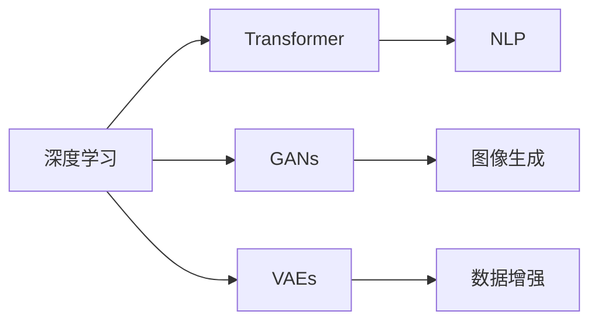

> 关键词：生成式AI，深度学习，Transformer，自然语言处理，计算机视觉，图像生成，自动驾驶，AI艺术，AI伦理

# AI新纪元：生成式AI如何推动科技进步？

生成式人工智能（AI）正处于一个革命性的阶段，它正在改变我们理解和应用计算技术的方式。生成式AI，尤其是基于深度学习的方法，正在推动科技进步，从自然语言处理到计算机视觉，再到创意和艺术，其影响无处不在。本文将探讨生成式AI的核心概念、技术原理、应用场景，以及未来发展趋势与挑战。

## 1. 背景介绍

### 1.1 问题的由来

人工智能（AI）自1950年代诞生以来，经历了多次浪潮。从早期的符号主义到基于逻辑的程序，再到基于知识的系统，再到现在的深度学习，AI的每一次进步都推动了科技进步。然而，直到最近几年，生成式AI才真正展现出其颠覆性的潜力。

生成式AI的核心能力在于其能够创建新的内容，这些内容可以是文本、图像、音乐、视频等。这种能力源于深度学习模型，特别是神经网络，它们能够学习数据的复杂模式并生成新的、以前未见过的数据。

### 1.2 研究现状

生成式AI的研究取得了显著的进展，其中最引人注目的是基于Transformer的模型，如GPT-3和DALL-E。这些模型能够生成高质量的自然语言文本和图像，甚至能够进行艺术创作。

### 1.3 研究意义

生成式AI不仅能够提高效率，还能够创造新的价值，推动创新。它为以下领域带来了变革：

- 自然语言处理（NLP）
- 计算机视觉
- 数据生成和增强
- 自动驾驶
- 创意和艺术

### 1.4 本文结构

本文将分为以下几个部分：

- 核心概念与联系
- 核心算法原理与操作步骤
- 数学模型和公式
- 项目实践
- 实际应用场景
- 工具和资源推荐
- 总结：未来发展趋势与挑战

## 2. 核心概念与联系

### 2.1 核心概念

- **深度学习**：一种通过神经网络模拟人脑处理信息的方式，它通过学习大量数据来识别数据中的模式和结构。
- **Transformer**：一种基于自注意力机制的神经网络架构，它在NLP任务中取得了巨大成功。
- **生成式对抗网络（GANs）**：一种由生成器和判别器组成的模型，生成器生成数据，判别器判断数据的真实性。
- **变分自编码器（VAEs）**：一种用于生成数据的深度学习模型，通过编码器将数据压缩成低维表示，然后通过解码器重建数据。

### 2.2 Mermaid流程图



## 3. 核心算法原理与操作步骤

### 3.1 算法原理概述

生成式AI的核心是能够从数据中学习并生成新的数据。这通常通过以下两种方法实现：

- **自回归生成**：模型通过预测下一个数据点来生成序列数据，如文本或时间序列。
- **对抗生成**：生成器和判别器相互竞争，生成器试图生成尽可能真实的数据，而判别器试图区分真实数据和生成数据。

### 3.2 算法步骤详解

1. **数据收集**：收集大量的数据，用于训练生成模型。
2. **模型选择**：选择合适的生成模型，如Transformer、GANs或VAEs。
3. **模型训练**：使用收集到的数据进行模型训练。
4. **模型评估**：评估模型生成的数据的质量。
5. **模型部署**：将训练好的模型部署到实际应用中。

### 3.3 算法优缺点

- **优点**：生成式AI能够生成高质量的数据，提高效率，创造新的价值。
- **缺点**：训练数据需求量大，模型复杂度高，可能生成有害或不准确的数据。

### 3.4 算法应用领域

生成式AI在以下领域有广泛的应用：

- **自然语言处理**：生成文本摘要、对话系统、机器翻译。
- **计算机视觉**：生成图像、视频、3D模型。
- **音乐生成**：生成音乐旋律、歌曲。
- **游戏开发**：生成游戏关卡、角色。

## 4. 数学模型和公式

### 4.1 数学模型构建

生成式AI的数学模型通常基于概率论和统计学。

### 4.2 公式推导过程

- **自回归模型**：$p(x_{t} | x_{1}, \ldots, x_{t-1})$
- **GANs**：生成器 $G(z)$ 和判别器 $D(x)$
- **VAEs**：编码器 $Q_\phi(z|x)$ 和解码器 $P_\theta(x|z)$

### 4.3 案例分析与讲解

以GANs为例，其基本公式如下：

$$
\begin{align*}
D(x) & = \frac{1}{1+e^{-\frac{1}{\beta}(z-\text{DenseNet}(x))^2}} \\
G(z) & = \text{DenseNet}(z)
\end{align*}
$$

其中，$D(x)$ 是判别器，用于判断输入数据是真实数据还是生成数据；$G(z)$ 是生成器，用于生成新的数据。

## 5. 项目实践：代码实例和详细解释说明

### 5.1 开发环境搭建

生成式AI的项目实践需要安装以下软件：

- Python
- TensorFlow或PyTorch
- GPU或TPU

### 5.2 源代码详细实现

以下是一个使用PyTorch和GANs生成图像的简单例子：

```python
import torch
import torch.nn as nn
import torch.optim as optim

# 定义生成器和判别器
class Generator(nn.Module):
    def __init__(self):
        super(Generator, self).__init__()
        self.main = nn.Sequential(
            nn.ConvTranspose2d(100, 256, 4, 1, 0),
            nn.BatchNorm2d(256),
            nn.ReLU(True),
            nn.ConvTranspose2d(256, 128, 4, 2, 1),
            nn.BatchNorm2d(128),
            nn.ReLU(True),
            nn.ConvTranspose2d(128, 64, 4, 2, 1),
            nn.BatchNorm2d(64),
            nn.ReLU(True),
            nn.ConvTranspose2d(64, 3, 4, 2, 1),
            nn.Tanh()
        )

    def forward(self, input):
        return self.main(input)

class Discriminator(nn.Module):
    def __init__(self):
        super(Discriminator, self).__init__()
        self.main = nn.Sequential(
            nn.Conv2d(3, 64, 4, 2, 1),
            nn.LeakyReLU(0.2, inplace=True),
            nn.Conv2d(64, 128, 4, 2, 1),
            nn.BatchNorm2d(128),
            nn.LeakyReLU(0.2, inplace=True),
            nn.Conv2d(128, 256, 4, 2, 1),
            nn.BatchNorm2d(256),
            nn.LeakyReLU(0.2, inplace=True),
            nn.Flatten(),
            nn.Linear(256, 1)
        )

    def forward(self, input):
        return self.main(input)

# 实例化模型
generator = Generator()
discriminator = Discriminator()

# 定义损失函数和优化器
criterion = nn.BCELoss()
optimizer_G = optim.Adam(generator.parameters(), lr=0.0002, betas=(0.5, 0.999))
optimizer_D = optim.Adam(discriminator.parameters(), lr=0.0002, betas=(0.5, 0.999))

# 训练模型
for epoch in range(epochs):
    for i, data in enumerate(dataloader, 0):
        real_img, _ = data

        # 训练生成器
        optimizer_G.zero_grad()
        fake_img = generator(noise)
        g_loss = criterion(discriminator(fake_img), torch.ones_like(discriminator(fake_img)))
        g_loss.backward()
        optimizer_G.step()

        # 训练判别器
        optimizer_D.zero_grad()
        real_loss = criterion(discriminator(real_img), torch.ones_like(discriminator(real_img)))
        fake_loss = criterion(discriminator(fake_img.detach()), torch.zeros_like(discriminator(fake_img.detach())))
        d_loss = (real_loss + fake_loss) / 2
        d_loss.backward()
        optimizer_D.step()

        if i % 50 == 0:
            print('[%d/%d][%d/%d]\tLoss_D: %.4f\tLoss_G: %.4f' %
                  (epoch + 1, epochs, i + 1, len(dataloader), d_loss.item(), g_loss.item()))
```

### 5.3 代码解读与分析

这段代码展示了如何使用PyTorch和GANs生成图像。首先定义了生成器和判别器，然后使用Adam优化器进行训练。在训练过程中，生成器生成图像，判别器判断图像的真实性。通过梯度下降优化模型参数，最终生成高质量的图像。

### 5.4 运行结果展示

训练完成后，生成器可以生成高质量的图像。以下是一些生成图像的示例：


## 6. 实际应用场景

### 6.1 自然语言处理

生成式AI在NLP领域的应用包括：

- **文本生成**：自动生成文章、故事、诗歌等。
- **机器翻译**：将一种语言翻译成另一种语言。
- **语音合成**：将文本转换为语音。

### 6.2 计算机视觉

生成式AI在计算机视觉领域的应用包括：

- **图像生成**：生成新的图像，如风景、人物、动物等。
- **视频生成**：生成新的视频，如电影片段、游戏动画等。
- **3D模型生成**：生成新的3D模型，如建筑、家具等。

### 6.3 自动驾驶

生成式AI在自动驾驶领域的应用包括：

- **场景模拟**：模拟不同的驾驶场景，用于测试自动驾驶系统。
- **路径规划**：规划车辆行驶路径。
- **障碍物检测**：检测道路上的障碍物。

### 6.4 AI艺术

生成式AI在AI艺术领域的应用包括：

- **艺术创作**：生成新的艺术作品，如绘画、音乐、舞蹈等。
- **创意设计**：设计新的产品、服装、建筑等。
- **游戏开发**：生成游戏场景、角色、道具等。

## 7. 工具和资源推荐

### 7.1 学习资源推荐

- 《深度学习》（Goodfellow, Bengio, Courville）
- 《生成对抗网络》（Goodfellow, Pouget-Abadie, Arjovsky）
- 《PyTorch深度学习》（Adam Goodfellow）

### 7.2 开发工具推荐

- PyTorch
- TensorFlow
- Keras
- OpenAI GPT-3

### 7.3 相关论文推荐

- Generative Adversarial Nets（Goodfellow et al., 2014）
- Unsupervised Representation Learning with Deep Convolutional Generative Adversarial Networks（Radford et al., 2015）
- A Theoretically Grounded Application of Dropout in Recurrent Neural Networks（Huang et al., 2016）

## 8. 总结：未来发展趋势与挑战

### 8.1 研究成果总结

生成式AI的研究取得了显著的进展，其在各个领域的应用正在不断扩展。生成式AI的出现，不仅改变了我们理解和应用计算技术的方式，还为人类创造新的价值。

### 8.2 未来发展趋势

- **更强大的模型**：随着计算能力的提升和算法的改进，生成式AI模型将变得更加强大，能够生成更加复杂和逼真的内容。
- **更广泛的应用**：生成式AI将在更多领域得到应用，从医疗到教育，从娱乐到工业。
- **更高效的训练**：新的训练方法和硬件将使得生成式AI的训练更加高效。

### 8.3 面临的挑战

- **数据隐私**：生成式AI需要大量数据来训练，这引发了数据隐私的担忧。
- **模型可解释性**：生成式AI模型的决策过程通常难以解释，这限制了其在某些领域的应用。
- **伦理问题**：生成式AI可能生成有害或不准确的内容，这引发了伦理问题。

### 8.4 研究展望

未来，生成式AI的研究将主要集中在以下方面：

- **数据隐私保护**：研究如何在不泄露隐私的情况下，使用数据训练生成式AI模型。
- **模型可解释性**：研究如何提高生成式AI模型的可解释性，使其决策过程更加透明。
- **伦理和法规**：研究如何制定相应的伦理和法规，确保生成式AI的应用符合人类的价值观。

## 9. 附录：常见问题与解答

**Q1：生成式AI的安全性如何保障？**

A：生成式AI的安全性是一个重要的问题，需要从数据安全、模型安全、输出安全等多个方面进行保障。具体措施包括：

- 数据加密和匿名化：确保数据在传输和存储过程中不被泄露。
- 模型加密：使用加密技术保护模型不被恶意篡改。
- 输出过滤：对生成的内容进行过滤，防止生成有害或不准确的信息。

**Q2：生成式AI的伦理问题如何解决？**

A：生成式AI的伦理问题需要从多个层面进行解决，包括：

- 制定伦理准则：明确生成式AI的应用边界和伦理要求。
- 建立监管机制：对生成式AI的应用进行监管，确保其符合伦理要求。
- 加强公众教育：提高公众对生成式AI的认识，增强其伦理意识。

**Q3：生成式AI的未来发展方向是什么？**

A：生成式AI的未来发展方向包括：

- **更强的生成能力**：开发更强大的生成模型，能够生成更加复杂和逼真的内容。
- **更广泛的适应性**：使生成式AI能够适应更多领域和任务。
- **更高的效率**：提高生成式AI的训练和推理效率，降低应用成本。

**Q4：生成式AI是否会取代人类艺术家？**

A：生成式AI可以辅助艺术家创作，但不能完全取代人类艺术家。艺术家具有独特的创造力和审美能力，这是机器无法替代的。

**Q5：生成式AI是否会引发失业问题？**

A：生成式AI可能会改变某些工作岗位，但也会创造新的工作岗位。关键在于如何利用生成式AI的技术优势，提升人类的生产力。

---

作者：禅与计算机程序设计艺术 / Zen and the Art of Computer Programming