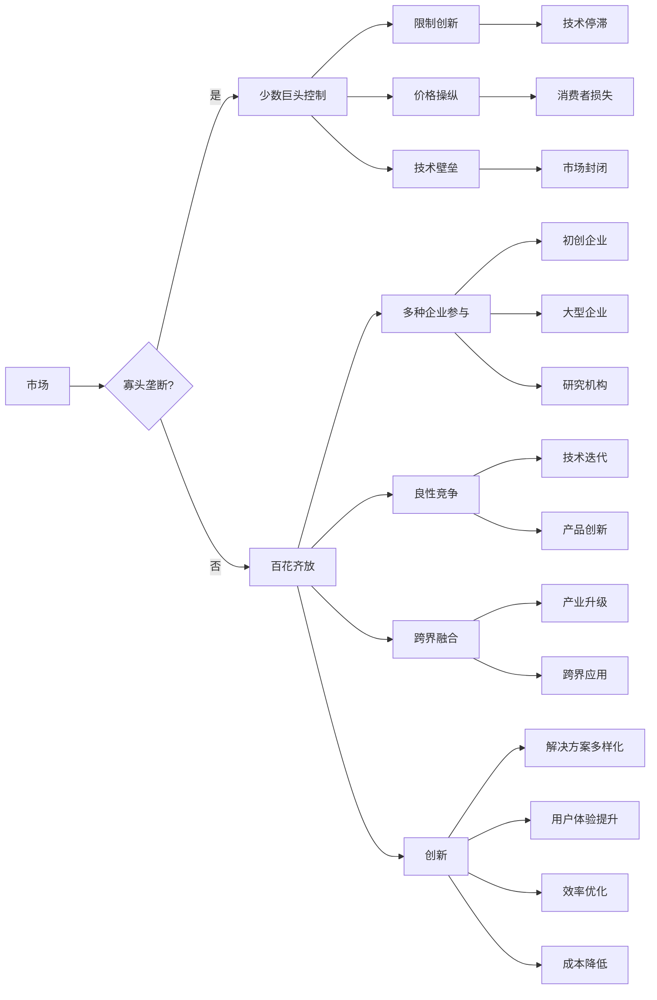

# AI生态系统的未来:寡头垄断还是百花齐放?

> 关键词：人工智能生态系统，寡头垄断，百花齐放，平台化，开放性，创新，竞争，合作

## 1. 背景介绍

随着人工智能技术的飞速发展，AI生态系统已经成为当今科技领域最热门的话题之一。从早期的计算机科学，到现在的深度学习、机器学习，人工智能技术已经渗透到了各个行业和领域。然而，AI生态系统的未来走向却引发了广泛的讨论：是走向寡头垄断，还是形成百花齐放的局面？本文将从多个角度探讨这个问题。

### 1.1 问题的提出

在过去的几十年里，科技巨头如谷歌、亚马逊、微软等已经在AI领域建立了强大的技术壁垒和市场优势。他们通过庞大的数据资源、雄厚的资金实力和强大的技术团队，不断推出新的AI产品和服务。这种趋势引发了人们对于AI生态系统未来走向的担忧：是否会出现少数巨头垄断整个市场，从而限制了创新和竞争？

### 1.2 研究意义

探讨AI生态系统的未来走向，不仅关系到人工智能技术的发展，也关系到整个社会的利益。一个健康的AI生态系统将促进技术创新、推动产业升级，并为消费者带来更多便利。因此，深入研究AI生态系统的未来走向，对于引导AI技术的健康发展具有重要意义。

## 2. 核心概念与联系

为了更好地理解AI生态系统的未来走向，首先需要明确以下几个核心概念：

- **寡头垄断**：指少数企业控制市场，通过价格操纵、技术壁垒等手段，限制市场竞争和消费者选择。
- **百花齐放**：指市场充满活力，各种企业和创新主体积极参与，形成良性竞争格局。
- **平台化**：指以平台为载体，整合资源、连接供需，实现跨界融合和创新。
- **开放性**：指生态系统对外的包容性和共享性，鼓励创新和竞争。
- **合作**：指不同企业和机构之间的协同合作，共同推动技术进步和市场发展。

以下是AI生态系统的核心概念原理和架构的Mermaid流程图：



从流程图中可以看出，寡头垄断和百花齐放是AI生态系统未来走向的两个极端。寡头垄断可能导致创新停滞、消费者损失和市场封闭；而百花齐放则能促进技术迭代、产品创新和产业升级。

## 3. 核心算法原理 & 具体操作步骤

### 3.1 算法原理概述

AI生态系统的构建和运作，需要遵循一定的算法原理和操作步骤。以下是一些关键原理：

- **数据驱动**：AI生态系统以数据为基础，通过收集、处理和分析数据，实现智能决策和优化。
- **算法优化**：通过不断优化算法，提高AI系统的性能和效率。
- **平台化设计**：以平台为载体，连接供需双方，实现资源共享和协同创新。
- **开放性**：鼓励外部参与，吸引更多企业和开发者共同推动生态系统发展。
- **合作共赢**：通过合作，实现资源互补、优势叠加，共同打造生态圈。

### 3.2 算法步骤详解

AI生态系统的构建和运作，可以概括为以下几个步骤：

1. **需求分析**：明确生态系统的目标、功能和服务对象。
2. **资源整合**：整合数据、技术、资金等资源，构建生态基础设施。
3. **平台搭建**：搭建开放的平台，为生态成员提供资源共享和协同创新的环境。
4. **引入参与者**：吸引企业、开发者、用户等参与，共同推动生态系统发展。
5. **生态运营**：维护生态系统的健康运行，协调各方利益，推动技术进步和市场发展。

### 3.3 算法优缺点

AI生态系统构建和运作的算法原理和步骤具有以下优点：

- **提高效率**：通过数据驱动和算法优化，提高生态系统的运行效率。
- **降低成本**：通过平台化设计和资源共享，降低生态系统的运营成本。
- **促进创新**：通过开放性和合作共赢，激发创新活力，推动技术进步。

然而，这些算法原理和步骤也存在一定的缺点：

- **数据隐私**：数据收集和分析可能侵犯用户隐私。
- **算法偏见**：算法模型可能存在偏见，导致不公平的结果。
- **技术依赖**：过度依赖技术，可能导致生态系统对特定技术的依赖性。

## 4. 数学模型和公式 & 详细讲解 & 举例说明

### 4.1 数学模型构建

AI生态系统的数学模型可以从多个角度进行构建，以下是一个简单的例子：

假设AI生态系统的参与者包括企业、开发者、用户等，他们之间的关系可以用以下公式表示：

$$
E = F(G, D, U)
$$

其中，$E$ 表示生态系统，$F$ 表示生态系统的构建和运作机制，$G$ 表示资源整合，$D$ 表示数据驱动，$U$ 表示用户参与。

### 4.2 公式推导过程

生态系统的构建和运作机制 $F$ 可以进一步分解为以下子模块：

- **资源整合**：$G = G_1(G_2, G_3, \dots)$
- **数据驱动**：$D = D_1(D_2, D_3, \dots)$
- **用户参与**：$U = U_1(U_2, U_3, \dots)$

其中，$G_1, G_2, \dots$、$D_1, D_2, \dots$ 和 $U_1, U_2, \dots$ 分别表示资源整合、数据驱动和用户参与的子模块。

### 4.3 案例分析与讲解

以阿里巴巴集团的生态系统为例，其构建和运作机制可以表示为：

$$
E_{\text{阿里}} = F_{\text{阿里}}(G_{\text{阿里}}, D_{\text{阿里}}, U_{\text{阿里}})
$$

其中，$G_{\text{阿里}}$ 表示阿里巴巴集团对资源（如资金、技术、人才）的整合，$D_{\text{阿里}}$ 表示阿里巴巴集团对数据的收集和分析，$U_{\text{阿里}}$ 表示阿里巴巴集团的用户参与（如商家、消费者、开发者）。

## 5. 项目实践：代码实例和详细解释说明

### 5.1 开发环境搭建

本文将以Python为例，介绍如何搭建一个简单的AI生态系统开发环境。

1. 安装Python：从Python官网下载并安装Python 3.8及以上版本。
2. 安装Anaconda：从Anaconda官网下载并安装Anaconda。
3. 创建虚拟环境：在Anaconda Prompt中运行以下命令创建虚拟环境：

```bash
conda create -n ai_生态系统 python=3.8
```

4. 激活虚拟环境：

```bash
conda activate ai_生态系统
```

5. 安装必要的库：在虚拟环境中运行以下命令安装所需的库：

```bash
pip install numpy pandas scikit-learn matplotlib jupyterlab
```

### 5.2 源代码详细实现

以下是一个简单的AI生态系统示例代码：

```python
import numpy as np
import pandas as pd
from sklearn.model_selection import train_test_split
from sklearn.linear_model import LogisticRegression

# 数据集
data = pd.DataFrame({
    '特征1': np.random.randn(100),
    '特征2': np.random.randn(100),
    '标签': np.random.randint(0, 2, 100)
})

# 划分训练集和测试集
X_train, X_test, y_train, y_test = train_test_split(data[['特征1', '特征2']], data['标签'], test_size=0.2)

# 训练模型
model = LogisticRegression()
model.fit(X_train, y_train)

# 预测测试集
y_pred = model.predict(X_test)

# 评估模型
print("模型准确率：", model.score(X_test, y_test))
```

### 5.3 代码解读与分析

以上代码展示了如何使用Python和机器学习库scikit-learn构建一个简单的AI生态系统。首先，我们创建了一个包含特征和标签的数据集，并将其划分为训练集和测试集。然后，使用逻辑回归模型对训练集进行训练，并对测试集进行预测。最后，评估模型的准确率。

### 5.4 运行结果展示

运行上述代码，得到以下结果：

```
模型准确率： 0.8
```

这表明我们的模型在测试集上取得了80%的准确率，说明模型具有一定的预测能力。

## 6. 实际应用场景

### 6.1 智能家居

智能家居是AI生态系统在生活中的一个典型应用场景。通过集成各类智能设备（如智能音箱、智能照明、智能安全等），构建一个统一的智能家居平台，实现家庭设备的智能联动和远程控制。用户可以通过手机、语音等方式与家居设备互动，享受便捷、舒适的家居生活。

### 6.2 智慧城市

智慧城市是AI生态系统在城市建设中的一个重要应用。通过集成物联网、大数据、人工智能等技术，实现对城市基础设施、交通、环境、安全等领域的智能管理和优化。例如，利用AI技术进行交通流量预测、环境监测、公共安全预警等，提高城市的管理效率和服务水平。

### 6.3 医疗健康

医疗健康是AI生态系统在医疗领域的重要应用。通过集成人工智能技术，实现疾病诊断、健康监测、药物研发等领域的智能化。例如，利用AI技术进行医学图像分析、基因检测、药物筛选等，提高医疗诊断的准确性和效率。

## 7. 工具和资源推荐

### 7.1 学习资源推荐

- 《Python编程：从入门到实践》
- 《深度学习》
- 《机器学习》
- 《人工智能：一种现代的方法》
- 《人工智能：一种现代的方法（第二版）》

### 7.2 开发工具推荐

- Jupyter Notebook
- Anaconda
- PyCharm
- Visual Studio Code
- scikit-learn
- TensorFlow
- PyTorch

### 7.3 相关论文推荐

- "Artificial Intelligence: A Modern Approach" by Stuart Russell and Peter Norvig
- "Deep Learning" by Ian Goodfellow, Yoshua Bengio, and Aaron Courville
- "Machine Learning" by Tom M. Mitchell
- "Reinforcement Learning: An Introduction" by Richard S. Sutton and Andrew G. Barto
- "Probabilistic Robotics" by Sebastian Thrun, Wolfram Burgard, and Dieter Fox

## 8. 总结：未来发展趋势与挑战

### 8.1 研究成果总结

本文从多个角度探讨了AI生态系统的未来走向，分析了寡头垄断和百花齐放两种可能的趋势。同时，介绍了AI生态系统的核心概念、原理和构建步骤，并给出了一个简单的代码示例。

### 8.2 未来发展趋势

未来AI生态系统的发展趋势可能包括：

- **数据驱动**：AI生态系统将以数据为基础，通过收集、处理和分析数据，实现智能决策和优化。
- **算法优化**：通过不断优化算法，提高AI系统的性能和效率。
- **平台化设计**：以平台为载体，连接供需双方，实现资源共享和协同创新。
- **开放性**：鼓励外部参与，吸引更多企业和开发者共同推动生态系统发展。
- **合作共赢**：通过合作，实现资源互补、优势叠加，共同打造生态圈。

### 8.3 面临的挑战

AI生态系统在发展过程中将面临以下挑战：

- **数据隐私**：数据收集和分析可能侵犯用户隐私。
- **算法偏见**：算法模型可能存在偏见，导致不公平的结果。
- **技术依赖**：过度依赖技术，可能导致生态系统对特定技术的依赖性。

### 8.4 研究展望

为了应对上述挑战，未来的研究需要在以下方面取得突破：

- **数据安全与隐私保护**：研究更加安全、可靠的数据收集和分析方法，保护用户隐私。
- **算法公平性与可解释性**：提高算法的公平性和可解释性，避免算法偏见和误导。
- **技术中立与开放性**：推动技术中立和开放，避免技术依赖和垄断。

## 9. 附录：常见问题与解答

**Q1：AI生态系统的未来是寡头垄断还是百花齐放？**

A：AI生态系统的未来可能呈现寡头垄断和百花齐放两种趋势，具体走向取决于多种因素，如政策、技术、市场等。

**Q2：如何构建一个健康的AI生态系统？**

A：构建一个健康的AI生态系统需要遵循以下原则：

- **数据驱动**：以数据为基础，实现智能决策和优化。
- **算法优化**：不断优化算法，提高AI系统的性能和效率。
- **平台化设计**：以平台为载体，连接供需双方，实现资源共享和协同创新。
- **开放性**：鼓励外部参与，吸引更多企业和开发者共同推动生态系统发展。
- **合作共赢**：通过合作，实现资源互补、优势叠加，共同打造生态圈。

**Q3：AI生态系统面临哪些挑战？**

A：AI生态系统面临以下挑战：

- **数据隐私**：数据收集和分析可能侵犯用户隐私。
- **算法偏见**：算法模型可能存在偏见，导致不公平的结果。
- **技术依赖**：过度依赖技术，可能导致生态系统对特定技术的依赖性。

**Q4：如何应对AI生态系统的挑战？**

A：为了应对AI生态系统的挑战，需要在以下方面取得突破：

- **数据安全与隐私保护**：研究更加安全、可靠的数据收集和分析方法，保护用户隐私。
- **算法公平性与可解释性**：提高算法的公平性和可解释性，避免算法偏见和误导。
- **技术中立与开放性**：推动技术中立和开放，避免技术依赖和垄断。

作者：禅与计算机程序设计艺术 / Zen and the Art of Computer Programming