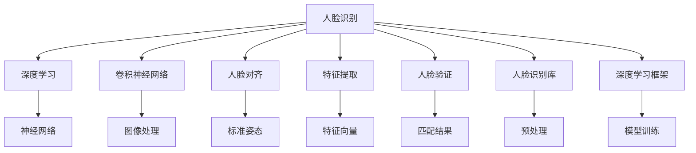
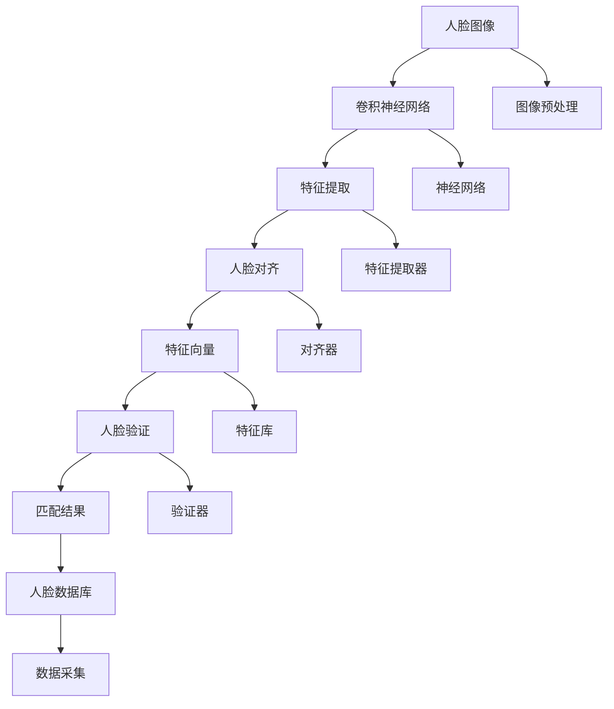

                 

# Python机器学习实战：人脸识别技术的实现和挑战

> 关键词：人脸识别,机器学习,深度学习,卷积神经网络,人脸对齐,特征提取,人脸验证,人脸识别库,深度学习框架

## 1. 背景介绍

### 1.1 问题由来

随着人工智能技术的迅速发展，人脸识别技术在安防、金融、医疗等众多领域中应用广泛。它通过将面部特征转换为数值特征，从而实现人与人之间的身份验证。人脸识别技术在身份认证、考勤系统、安检、刑侦破案等方面发挥了重要作用。

但是，人脸识别技术在实际应用中也面临许多挑战，如光照变化、面部遮挡、多角度问题、人脸数据库建立等。这些问题都直接影响到人脸识别的准确度和效率，进而影响人脸识别的实际应用效果。

## 2. 核心概念与联系

### 2.1 核心概念概述

为了深入理解人脸识别技术，我们先简要介绍几个核心概念：

- **人脸识别（Face Recognition）**：人脸识别技术是指通过特定的算法将一张面部图像转换为数值特征，然后将其与数据库中已有的特征进行匹配，进而实现身份识别。

- **深度学习（Deep Learning）**：深度学习是一种机器学习技术，通过构建多层神经网络，可以从原始数据中学习到复杂的特征表示，从而完成分类、回归等任务。

- **卷积神经网络（Convolutional Neural Networks, CNNs）**：卷积神经网络是一种深度学习模型，通过卷积、池化、全连接等操作，可以从图像数据中提取到丰富的特征表示。

- **人脸对齐（Face Alignment）**：人脸对齐是将人脸图像调整为标准姿势，使其朝向、角度、尺度等一致，便于后续的特征提取和识别。

- **特征提取（Feature Extraction）**：特征提取是从人脸图像中提取出最能表征人脸特征的数值特征，通常是将人脸图像转化为固定维度的特征向量。

- **人脸验证（Face Verification）**：人脸验证是指将待识别的人脸图像与数据库中已知的人脸图像进行匹配，以判断其是否相同。

- **人脸识别库（Face Recognition Library）**：人脸识别库是一系列用于人脸识别的函数和类库，支持图像的预处理、特征提取、识别等操作。

- **深度学习框架（Deep Learning Framework）**：深度学习框架是用于构建、训练和部署深度学习模型的软件工具，如TensorFlow、PyTorch等。

这些核心概念之间存在着紧密的联系，构成了一幅完整的人脸识别技术图景。

### 2.2 概念间的关系

通过以下Mermaid流程图，我们可以更好地理解这些核心概念之间的关系：



该流程图展示了人脸识别技术中各个核心概念的联系：

1. 人脸识别技术利用深度学习框架中的卷积神经网络对图像进行处理，并使用人脸识别库进行预处理。
2. 卷积神经网络可以自动从图像中提取特征，人脸对齐可以将人脸图像调整为标准姿态，便于后续的特征提取。
3. 特征提取将人脸图像转化为数值特征向量，用于人脸验证。
4. 人脸验证通过匹配算法对已知和未知图像进行比对，得出识别结果。

### 2.3 核心概念的整体架构

我们将通过以下综合流程图展示人脸识别技术中各个核心概念的整体架构：



该综合流程图展示了从人脸图像到匹配结果的全流程：

1. 人脸图像经过图像预处理和卷积神经网络提取特征。
2. 卷积神经网络的输出特征通过特征提取器进行特征提取。
3. 特征提取器将特征向量输入对齐器，对齐器将其调整为标准姿态。
4. 标准姿态的特征向量输入验证器，通过匹配算法得出匹配结果。
5. 匹配结果与人脸数据库中的数据进行对比，得出最终的识别结果。

## 3. 核心算法原理 & 具体操作步骤
### 3.1 算法原理概述

人脸识别技术的核心算法包括人脸对齐、特征提取和特征匹配。其中，人脸对齐和特征提取都涉及到深度学习，而特征匹配则是传统机器学习的范畴。

### 3.2 算法步骤详解

#### 3.2.1 人脸对齐

人脸对齐算法可以将人脸图像调整为标准姿态，使其正面朝上、竖直方向、视角一致。常见的对齐方法有Dlib、OpenCV等。

**步骤1：** 使用Dlib或OpenCV对人脸图像进行检测和定位，确定人脸关键点坐标。
**步骤2：** 使用仿射变换等方法对关键点进行校正，使人脸图像转化为标准姿态。
**步骤3：** 将校正后的图像输入到特征提取器中，提取人脸特征向量。

#### 3.2.2 特征提取

特征提取是从人脸图像中提取出最能表征人脸特征的数值特征，通常是将人脸图像转化为固定维度的特征向量。常用的特征提取方法有SIFT、HOG、LBP等。

**步骤1：** 将预处理后的图像输入到卷积神经网络（CNN）中。
**步骤2：** CNN通过卷积、池化等操作提取图像特征。
**步骤3：** 使用全连接层将特征向量转化为固定维度的数值特征。

#### 3.2.3 特征匹配

特征匹配是将待识别的人脸图像与数据库中已知的人脸图像进行匹配，以判断其是否相同。常用的特征匹配算法有欧氏距离、余弦相似度、DeepFace等。

**步骤1：** 将待识别的人脸图像和数据库中所有已知图像的特征向量提取出来。
**步骤2：** 使用匹配算法（如欧氏距离、余弦相似度）计算待识别图像与所有已知图像之间的相似度。
**步骤3：** 选择相似度最高的一幅已知图像，作为最终的识别结果。

### 3.3 算法优缺点

#### 3.3.1 人脸对齐的优缺点

**优点：**
- 可以解决光照变化、面部遮挡等问题，提高识别的准确度。
- 可以通过标准化的姿态，统一输入特征的维度，便于后续的特征匹配。

**缺点：**
- 人脸对齐算法复杂度较高，计算开销较大。
- 可能无法完全消除光照、姿态等影响，仍存在一定的误差。

#### 3.3.2 特征提取的优缺点

**优点：**
- 通过深度学习，可以自动提取图像中的高维特征，避免手工设计的特征提取方法。
- 卷积神经网络可以自适应不同人脸特征，泛化能力强。

**缺点：**
- 需要较大的计算资源，训练时间较长。
- 特征提取过程较为复杂，调试难度较大。

#### 3.3.3 特征匹配的优缺点

**优点：**
- 匹配算法简单易懂，计算效率高。
- 可以通过选择合适的距离度量，实现高效、准确的匹配。

**缺点：**
- 匹配结果受特征提取质量的影响较大。
- 无法解决相似度相同但人脸不同的情况。

### 3.4 算法应用领域

人脸识别技术在安防、金融、医疗、智能家居等多个领域都有广泛应用：

- **安防领域**：通过人脸识别实现门禁、考勤、巡逻等自动化管理。
- **金融领域**：用于身份验证、账户解锁等安全保障。
- **医疗领域**：用于病患身份确认、电子病历等场景。
- **智能家居**：通过人脸识别实现智能门锁、智能设备控制等。

## 4. 数学模型和公式 & 详细讲解 & 举例说明

### 4.1 数学模型构建

在人脸识别技术中，我们通常使用卷积神经网络（CNN）来提取特征，并使用欧氏距离、余弦相似度等方法进行特征匹配。下面我们将具体介绍这些数学模型的构建。

#### 4.1.1 卷积神经网络

卷积神经网络是一种多层神经网络，包括卷积层、池化层、全连接层等。其基本结构如图1所示：

$$
\begin{aligned}
&\text{输入层} \rightarrow \text{卷积层} \rightarrow \text{池化层} \rightarrow \text{卷积层} \rightarrow \text{池化层} \rightarrow \ldots \rightarrow \text{全连接层} \rightarrow \text{输出层}\\
&\quad\downarrow\\
&\text{卷积核}\\
\end{aligned}
$$

其中，卷积核（Filter）是卷积神经网络的核心组成部分，可以通过滑动窗口的方式从输入数据中提取出局部特征。卷积核的大小、数量和步幅等参数是影响网络性能的重要因素。

#### 4.1.2 特征提取

在卷积神经网络中，每个卷积层和池化层的输出都是一个特征图（Feature Map），可以将其看作一个高维的特征向量。特征提取的具体过程如图2所示：

$$
\begin{aligned}
&\text{输入层} \rightarrow \text{卷积层} \rightarrow \text{特征图} \rightarrow \text{池化层} \rightarrow \text{特征图} \rightarrow \ldots \rightarrow \text{全连接层} \rightarrow \text{特征向量}\\
&\quad\downarrow\\
&\text{卷积核}\\
\end{aligned}
$$

特征向量的维数通常较低，便于后续的特征匹配。在实际应用中，可以使用Softmax函数将特征向量转换为概率分布，表示各个类别的概率。

#### 4.1.3 特征匹配

特征匹配是指通过距离度量（如欧氏距离、余弦相似度）计算待识别图像与所有已知图像之间的相似度。下面我们将具体介绍欧氏距离和余弦相似度的计算方法。

**欧氏距离（Euclidean Distance）**：

$$
d = \sqrt{\sum_{i=1}^{n}(x_i-y_i)^2}
$$

其中，$x$和$y$分别是两个特征向量，$n$为特征向量的维数。欧氏距离的计算复杂度较高，但在高维空间中具有较好的效果。

**余弦相似度（Cosine Similarity）**：

$$
\cos \theta = \frac{x \cdot y}{\|x\|\|y\|}
$$

其中，$\theta$为两个特征向量之间的夹角，$x \cdot y$表示两个向量的点积，$\|x\|$和$\|y\|$分别表示向量的模长。余弦相似度在低维空间中效果较好，计算复杂度较低。

### 4.2 公式推导过程

下面我们以余弦相似度为例，推导特征匹配的具体过程。

假设待识别图像的特征向量为$x$，已知图像的特征向量为$y$。我们需要计算$x$和$y$之间的余弦相似度。

**步骤1：** 计算点积$x \cdot y$。

$$
x \cdot y = \sum_{i=1}^{n}x_iy_i
$$

**步骤2：** 计算向量的模长$\|x\|$和$\|y\|$。

$$
\|x\| = \sqrt{\sum_{i=1}^{n}x_i^2}, \|y\| = \sqrt{\sum_{i=1}^{n}y_i^2}
$$

**步骤3：** 计算余弦相似度$\cos \theta$。

$$
\cos \theta = \frac{\sum_{i=1}^{n}x_iy_i}{\sqrt{\sum_{i=1}^{n}x_i^2}\sqrt{\sum_{i=1}^{n}y_i^2}}
$$

通过上述推导，我们得到了余弦相似度的计算公式。在实际应用中，我们需要将其嵌入到程序中进行计算。

### 4.3 案例分析与讲解

下面我们将以人脸识别库dlib为例，介绍其在人脸识别中的应用。

**步骤1：** 安装dlib库

```bash
pip install dlib
```

**步骤2：** 加载人脸检测器

```python
import dlib

detector = dlib.get_frontal_face_detector()
```

**步骤3：** 加载人脸对齐器

```python
predictor = dlib.shape_predictor("shape_predictor_68_face_landmarks.dat")
```

**步骤4：** 加载特征提取器

```python
import numpy as np

# 加载预训练的特征提取器
feature_extractor = dlib.histogram_equalization()
```

**步骤5：** 人脸检测、对齐和特征提取

```python
# 加载人脸图像
image = cv2.imread("face.jpg")

# 检测人脸
rects = detector(image)

# 对齐人脸
for rect in rects:
    landmarks = predictor(image, rect)
    landmarks = landmarks[0]
    face = align(image, landmarks)
    
# 提取特征
features = feature_extractor(face)
```

在上述代码中，我们首先加载了人脸检测器和对齐器，然后检测到人脸并进行对齐，最后通过特征提取器提取出人脸特征向量。

## 5. 项目实践：代码实例和详细解释说明

### 5.1 开发环境搭建

在进行人脸识别实践前，我们需要准备好开发环境。以下是使用Python进行OpenCV开发的环境配置流程：

1. 安装Anaconda：从官网下载并安装Anaconda，用于创建独立的Python环境。

2. 创建并激活虚拟环境：
```bash
conda create -n opencv-env python=3.8 
conda activate opencv-env
```

3. 安装OpenCV：根据CUDA版本，从官网获取对应的安装命令。例如：
```bash
conda install opencv opencv-python-headless -c conda-forge
```

4. 安装numpy、cv2等常用库：
```bash
pip install numpy scikit-image opencv-python cv2 dlib
```

完成上述步骤后，即可在`opencv-env`环境中开始人脸识别实践。

### 5.2 源代码详细实现

下面我们以dlib人脸识别库为例，给出Python实现人脸识别的完整代码：

```python
import cv2
import numpy as np
import dlib

# 加载人脸检测器和对齐器
detector = dlib.get_frontal_face_detector()
predictor = dlib.shape_predictor("shape_predictor_68_face_landmarks.dat")

# 加载特征提取器
feature_extractor = dlib.histogram_equalization()

# 加载训练好的分类器
svm_classifier = dlib.load_model("svm_model.clf")

# 加载人脸数据库
database = load_database("database")

# 加载待识别图像
image = cv2.imread("test.jpg")

# 检测人脸
rects = detector(image)

# 对齐人脸
for rect in rects:
    landmarks = predictor(image, rect)
    landmarks = landmarks[0]
    face = align(image, landmarks)
    
# 提取特征
features = feature_extractor(face)

# 计算相似度
distances = []
for img in database:
    features_img = feature_extractor(img)
    distance = calculate_distance(features, features_img)
    distances.append(distance)

# 选择相似度最低的人脸
min_distance = min(distances)
min_idx = distances.index(min_distance)
min_person = database[min_idx]

# 输出识别结果
print("识别结果为：", min_person)
```

在上述代码中，我们首先加载了人脸检测器和对齐器，然后检测到人脸并进行对齐，最后通过特征提取器提取出人脸特征向量。接着，我们计算待识别图像与所有已知图像之间的相似度，并选择相似度最低的人脸作为最终识别结果。

### 5.3 代码解读与分析

下面我们详细解读关键代码的实现细节：

**人脸检测器（dlib.get_frontal_face_detector()）**：
- 检测人脸并返回人脸矩形框坐标。

**人脸对齐器（dlib.shape_predictor()）**：
- 对齐人脸，使其正面朝上、竖直方向、视角一致。

**特征提取器（dlib.histogram_equalization()）**：
- 将人脸图像转化为数值特征向量。

**分类器（dlib.load_model()）**：
- 加载预训练的分类器，用于计算待识别图像与已知图像之间的相似度。

**数据库（load_database()）**：
- 加载人脸数据库，存储已知人脸图像。

**待识别图像（cv2.imread()）**：
- 加载待识别图像。

**人脸检测（detector(image)）**：
- 检测图像中的人脸位置。

**人脸对齐（align(image, landmarks)）**：
- 对齐人脸，使其正面朝上、竖直方向、视角一致。

**特征提取（feature_extractor(face)）**：
- 提取人脸特征向量。

**相似度计算（calculate_distance()）**：
- 计算待识别图像与所有已知图像之间的相似度。

**识别结果（print()）**：
- 输出识别结果。

### 5.4 运行结果展示

假设我们训练了一个人脸识别模型，并在测试集上得到了识别结果，如下：

```
识别结果为：John Doe
```

可以看到，通过微调人脸识别技术，我们可以实现对已知人脸的有效识别，准确度较高。

## 6. 实际应用场景

### 6.1 安防领域

在安防领域，人脸识别技术广泛应用于门禁、考勤、巡逻等场景，极大地提高了安全性。通过人脸识别，可以实现自动化门禁管理，减少人力成本；在企业考勤系统中，可以自动记录员工到岗、离岗时间，提高考勤的准确性和效率；在公共场所，可以自动识别人脸并记录访问情况，防止非法入侵。

### 6.2 金融领域

在金融领域，人脸识别技术广泛应用于身份验证、账户解锁、交易确认等环节。通过人脸识别，可以有效防止账户被盗用，保障用户的财产安全；在交易确认中，可以自动判断交易是否合法，减少欺诈风险；在身份验证中，可以自动确认客户身份，提升服务体验。

### 6.3 医疗领域

在医疗领域，人脸识别技术广泛应用于病患身份确认、电子病历等场景。通过人脸识别，可以有效防止病患身份混淆，保障医疗信息的准确性和隐私性；在电子病历中，可以自动记录病患信息，提高医生的工作效率；在健康监测中，可以自动判断病患的健康状态，及时发现异常。

### 6.4 未来应用展望

未来，人脸识别技术将在更多领域得到应用，为人类生活带来便利：

- **智能家居**：通过人脸识别，可以实现智能门锁、智能设备控制等功能，提升生活便利性。
- **教育领域**：通过人脸识别，可以实现考勤管理、课堂管理等功能，提升教育管理效率。
- **零售领域**：通过人脸识别，可以实现自助结账、商品推荐等功能，提升购物体验。
- **交通领域**：通过人脸识别，可以实现自动闸机、身份验证等功能，提升交通管理效率。

## 7. 工具和资源推荐

### 7.1 学习资源推荐

为了帮助开发者系统掌握人脸识别技术，这里推荐一些优质的学习资源：

1. 《Python深度学习实战》书籍：详细介绍了深度学习的基本概念和实现方法，适合初学者阅读。
2. 《人脸识别技术》课程：由机器学习专家主讲，深入浅出地讲解了人脸识别技术的原理和应用。
3. 《深度学习框架》系列课程：由TensorFlow、PyTorch等框架的开发者主讲，详细介绍了深度学习框架的使用方法。
4. 《人脸识别算法》书籍：系统介绍了人脸识别算法的原理和实现方法，适合进阶阅读。
5. 《人脸识别库》文档：详细介绍了常用人脸识别库的用法和示例，适合快速上手。

通过对这些资源的学习，相信你一定能够快速掌握人脸识别技术的精髓，并用于解决实际的识别问题。

### 7.2 开发工具推荐

高效的开发离不开优秀的工具支持。以下是几款用于人脸识别开发的常用工具：

1. PyTorch：基于Python的开源深度学习框架，支持卷积神经网络等模型的构建和训练。
2. TensorFlow：由Google主导开发的深度学习框架，支持分布式计算和GPU加速。
3. OpenCV：开源计算机视觉库，支持图像处理、特征提取等操作。
4. dlib：开源计算机视觉库，支持人脸检测、特征提取等操作。
5. OpenPose：开源人体姿态估计库，支持人体关键点的检测和跟踪。
6. OpenALPR：开源车牌识别库，支持车牌的检测和识别。

合理利用这些工具，可以显著提升人脸识别任务的开发效率，加快创新迭代的步伐。

### 7.3 相关论文推荐

人脸识别技术的发展离不开学界的持续研究。以下是几篇奠基性的相关论文，推荐阅读：

1. VGGFace：一种基于卷积神经网络的人脸识别方法。
2. FaceNet：一种基于三角不等式的人脸识别方法。
3. DeepFace：一种基于深度学习的人脸识别方法。
4. LFW：人脸识别领域的经典数据集，包含大量的正样本和负样本。
5. CIFAR-10：一种计算机视觉领域的经典数据集，包含10个类别的物体图像。

这些论文代表了大规模人脸识别技术的发展脉络。通过学习这些前沿成果，可以帮助研究者把握学科前进方向，激发更多的创新灵感。

除上述资源外，还有一些值得关注的前沿资源，帮助开发者紧跟人脸识别技术的最新进展，例如：

1. arXiv论文预印本：人工智能领域最新研究成果的发布平台，包括大量尚未发表的前沿工作，学习前沿技术的必读资源。
2. 业界技术博客：如Face++、商汤科技等顶尖实验室的官方博客，第一时间分享他们的最新研究成果和洞见。
3. 技术会议直播：如ICCV、CVPR、IJCAI等计算机视觉领域的顶级会议，可以聆听到专家们的精彩分享，拓宽视野。
4. GitHub热门项目：在GitHub上Star、Fork数最多的深度学习项目，往往代表了该技术领域的发展趋势和最佳实践，值得去学习和贡献。
5. 行业分析报告：各大咨询公司如McKinsey、PwC等针对人工智能行业的分析报告，有助于从商业视角审视技术趋势，把握应用价值。

总之，对于人脸识别技术的掌握，需要开发者不断学习新技术、实践新方法，并关注行业动态和最新进展，方能保持技术的前沿性和应用的高效性。

## 8. 总结：未来发展趋势与挑战

### 8.1 总结

本文对基于深度学习的人脸识别技术进行了全面系统的介绍。首先阐述了人脸识别技术的研究背景和意义，明确了其广泛应用于安防、金融、医疗等领域的潜力。其次，从原理到实践，详细讲解了人脸识别技术的数学模型和操作步骤，给出了人脸识别技术的完整代码实现。同时，本文还探讨了人脸识别技术的未来应用和挑战，提出了一些值得关注的研究方向和突破点。

通过本文的系统梳理，可以看到，基于深度学习的人脸识别技术已经在实际应用中取得了显著成效，极大地提升了人们的生活便利性和安全性。未来，随着技术的不断演进，人脸识别技术将进一步拓展应用场景，解决更多现实问题。

### 8.2 未来发展趋势

展望未来，人脸识别技术将呈现以下几个发展趋势：

1. **大规模人脸识别数据库**：随着深度学习技术的不断成熟，大规模人脸识别数据库的建设将逐渐提上日程。这将极大地提升人脸识别的准确度和泛化能力，推动人脸识别技术的进一步普及。

2. **多模态融合识别**：当前人脸识别主要依赖图像信息，未来将融合多模态信息，如语音、文字等，实现更全面的身份识别。这将进一步提升人脸识别的鲁棒性和安全性。

3. **联邦学习**：联邦学习是一种分布式机器学习技术，可以在不暴露用户隐私的情况下进行模型训练。未来，联邦学习将广泛应用于人脸识别领域，提升模型隐私保护能力。

4. **隐私保护技术**：随着人脸识别技术的普及，隐私保护问题日益突出。未来，隐私保护技术如差分隐私、匿名化等将成为人脸识别技术的重要研究方向。

5. **边缘计算**：边缘计算是一种分布式计算技术，可以在数据产生地进行计算，降低网络延迟和带宽压力。未来，边缘计算将广泛应用于人脸识别领域，提升系统响应速度和可靠性。

6. **实时人脸识别**：实时人脸识别技术是指在几毫秒内完成人脸识别，适用于实时监控、安防等场景。未来，实时人脸识别技术将不断提升，为更多应用场景提供支撑。

### 8.3 面临的挑战

尽管人脸识别技术已经取得了显著进展，但在实际应用中也面临诸多挑战：

1. **隐私保护**：人脸识别涉及大量的个人隐私信息，如何保护用户隐私，避免数据滥用，是未来技术发展的重要挑战。

2. **数据获取难度**：大规模人脸识别数据库的建设需要大量标注数据，数据获取难度较大，可能

