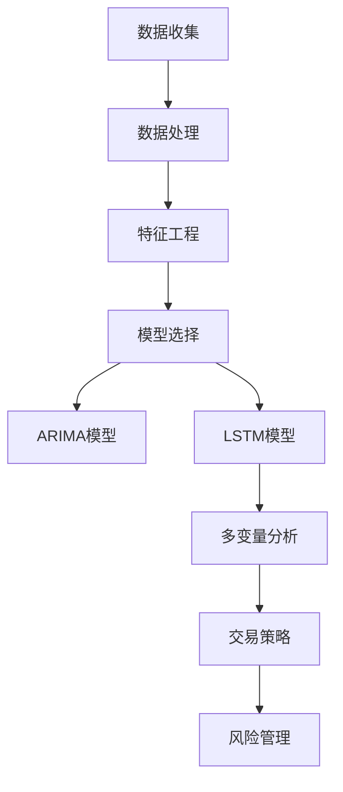

                 

# Python机器学习实战：使用机器学习预测股票市场走势

> 关键词：Python, 机器学习, 股票市场, 预测, 交易策略, 多变量分析, 时间序列, 特征工程

## 1. 背景介绍

### 1.1 问题由来
在金融行业中，股票市场预测是一个极具挑战性且极具潜力的应用场景。精准的市场预测可以帮助投资者做出明智的决策，提高投资回报率。然而，由于股票市场的复杂性和多变性，传统的基于统计学和基本面分析的方法往往难以获得满意的结果。近年来，随着机器学习技术的兴起，利用大数据和深度学习技术进行股票市场预测成为新的研究热点。

### 1.2 问题核心关键点
本文将介绍如何使用Python和机器学习技术，通过预测股票市场走势，构建交易策略，优化投资回报。本项目的关键点包括：

- **数据收集与处理**：收集历史股票价格、交易量等数据，并进行清洗、标准化和特征工程。
- **模型选择与训练**：选择适合的时间序列模型（如ARIMA、LSTM等），并利用训练数据集进行模型训练。
- **策略设计**：设计并实现多种交易策略，如均值回归、趋势跟踪、动量策略等，并进行回测和评估。
- **风险管理**：引入风险控制策略，如止损、仓位控制等，以确保交易系统的稳健性和风险可控性。

### 1.3 问题研究意义
本项目的研究意义在于：
- 提供一种基于机器学习的股票市场预测方法，帮助投资者提高决策准确性和投资收益。
- 实现自动化交易系统，降低人工干预和人为错误，提升交易效率。
- 探索如何通过机器学习技术，进行风险管理与控制，确保交易系统的稳定性。

## 2. 核心概念与联系

### 2.1 核心概念概述

在进行股票市场预测时，我们需要理解几个关键概念：

- **时间序列**：股票价格、交易量等数据均呈现时间序列特征，即数据在时间上的变化具有连续性和依赖性。
- **ARIMA模型**：自回归积分滑动平均模型（AutoRegressive Integrated Moving Average，ARIMA）是一种广泛应用的时间序列预测模型。
- **LSTM模型**：长短期记忆网络（Long Short-Term Memory，LSTM）是一种特殊的循环神经网络，适用于处理时间序列数据。
- **多变量分析**：利用多个相关变量进行联合预测，提高预测准确性。
- **交易策略**：根据预测结果制定投资决策，如买入、卖出、持有等。
- **风险管理**：通过止损、仓位控制等手段，确保交易系统在面对市场波动时的稳健性。

这些概念之间相互联系，形成一个完整的股票市场预测与交易框架。

### 2.2 概念间的关系

通过一个简单的Mermaid流程图，我们可以展示这些概念之间的关系：



此流程图展示了从数据收集、数据处理到模型训练、交易策略设计、风险管理的全流程。每一个环节都依赖于前一个环节的结果，并直接影响后续的预测和交易决策。

## 3. 核心算法原理 & 具体操作步骤
### 3.1 算法原理概述

在进行股票市场预测时，我们通常使用时间序列模型，如ARIMA和LSTM模型。这些模型基于历史数据，通过拟合数据的变化规律，预测未来的价格走势。ARIMA模型考虑了自回归、积分和滑动平均，能够处理时间序列数据中的趋势、季节性和周期性。LSTM模型则利用长短记忆机制，能够处理长期依赖关系，适用于复杂的非线性时间序列预测。

本节将介绍ARIMA和LSTM模型的基本原理和具体操作步骤。

### 3.2 算法步骤详解

#### ARIMA模型

ARIMA模型的基本步骤包括：

1. **模型选择**：根据数据特征选择合适的ARIMA模型参数，如$p$（自回归阶数）、$d$（差分阶数）、$q$（移动平均阶数）。
2. **模型拟合**：使用训练数据集拟合ARIMA模型，得到模型的系数。
3. **模型验证**：利用验证集对模型进行验证，选择最优的模型参数。
4. **模型预测**：使用最优的模型参数进行未来时间点的预测。

#### LSTM模型

LSTM模型的基本步骤包括：

1. **数据准备**：将时间序列数据转化为适合LSTM网络的格式，如将序列转化为向量形式。
2. **模型构建**：定义LSTM神经网络的结构，包括输入层、LSTM层、全连接层等。
3. **模型训练**：使用训练数据集训练LSTM模型，得到模型的权重和偏置。
4. **模型预测**：使用训练好的LSTM模型对未来时间点进行预测。

### 3.3 算法优缺点

#### ARIMA模型的优缺点

**优点**：
- 模型简单，易于理解和实现。
- 能够处理时间序列数据中的趋势、季节性和周期性。
- 预测结果的解释性较好。

**缺点**：
- 对于非线性时间序列数据，预测效果可能不佳。
- 需要选择合适的模型参数，参数过多导致模型复杂度增加。

#### LSTM模型的优缺点

**优点**：
- 能够处理长期依赖关系，适用于复杂的非线性时间序列预测。
- 能够学习数据中的长期记忆，捕捉数据中的潜在模式。
- 预测结果准确度较高。

**缺点**：
- 模型复杂，训练时间长。
- 需要大量的历史数据，数据准备和预处理工作量大。
- 模型参数过多，可能导致过拟合。

### 3.4 算法应用领域

ARIMA和LSTM模型不仅适用于股票市场预测，还广泛应用于金融、气象、能源等多个领域。例如：

- **金融领域**：利用ARIMA和LSTM模型进行股票价格、汇率、利率等预测，制定投资策略。
- **气象领域**：利用时间序列模型预测气象数据，如气温、降雨量等，用于灾害预警和气象服务。
- **能源领域**：利用时间序列模型预测电力负荷、风力发电量等，优化能源分配和调度。

这些领域的应用展示了时间序列模型的广泛适用性和重要性。

## 4. 数学模型和公式 & 详细讲解
### 4.1 数学模型构建

在进行时间序列预测时，我们通常使用ARIMA和LSTM模型。下面我们将分别介绍这两种模型的数学模型构建方法。

#### ARIMA模型

ARIMA模型可以表示为：

$$
y_t = c + \sum_{i=1}^{p} \phi_i y_{t-i} + \sum_{j=1}^{d} \theta_j (\Delta^j y_t) + \sum_{k=1}^{q} \psi_k \epsilon_{t-k}
$$

其中，$y_t$ 表示时间$t$的预测值，$c$为常数项，$\phi_i$为自回归系数，$\theta_j$为移动平均系数，$\Delta$表示差分操作，$\psi_k$为误差项系数，$\epsilon_t$为随机误差项。

#### LSTM模型

LSTM模型的数学模型较为复杂，包括输入门（input gate）、遗忘门（forget gate）和输出门（output gate）。LSTM模型的公式可以表示为：

$$
i_t = \sigma(W_{ii} i_{t-1} + W_{ix} x_t + b_i)
$$
$$
f_t = \sigma(W_{if} i_{t-1} + W_{if} x_t + b_f)
$$
$$
o_t = \sigma(W_{io} i_{t-1} + W_{ix} x_t + b_o)
$$
$$
g_t = \tanh(W_{ig} i_{t-1} + W_{ix} x_t + b_g)
$$
$$
c_t = f_t \odot c_{t-1} + i_t \odot g_t
$$
$$
h_t = o_t \odot \tanh(c_t)
$$

其中，$i_t$、$f_t$、$o_t$为门控变量，$g_t$为记忆单元，$c_t$为当前时间步的记忆单元，$h_t$为输出。$\sigma$表示Sigmoid激活函数，$\tanh$表示双曲正切函数。

### 4.2 公式推导过程

#### ARIMA模型

ARIMA模型的推导过程较为简单，可以通过差分、自回归和移动平均等基本概念推导得出。具体推导过程可以参考统计学教材或网络资源。

#### LSTM模型

LSTM模型的推导较为复杂，涉及神经网络、循环神经网络和梯度反向传播等概念。推导过程如下：

1. **输入门**：
$$
i_t = \sigma(W_{ii} i_{t-1} + W_{ix} x_t + b_i)
$$

2. **遗忘门**：
$$
f_t = \sigma(W_{if} i_{t-1} + W_{if} x_t + b_f)
$$

3. **输出门**：
$$
o_t = \sigma(W_{io} i_{t-1} + W_{ix} x_t + b_o)
$$

4. **记忆单元**：
$$
g_t = \tanh(W_{ig} i_{t-1} + W_{ix} x_t + b_g)
$$

5. **当前时间步的记忆单元**：
$$
c_t = f_t \odot c_{t-1} + i_t \odot g_t
$$

6. **输出**：
$$
h_t = o_t \odot \tanh(c_t)
$$

### 4.3 案例分析与讲解

假设我们有一个简单的股票价格时间序列数据集，包含从1990年1月到2020年12月的月度收盘价。

#### 数据准备

首先，我们将数据集导入Python，并进行基本的预处理操作，如去除缺失值、归一化等。

```python
import pandas as pd

# 导入数据集
data = pd.read_csv('stock_prices.csv')

# 去除缺失值
data = data.dropna()

# 归一化数据
data = (data - data.mean()) / data.std()
```

#### ARIMA模型

接下来，我们使用ARIMA模型进行股票价格预测。首先，我们需要对数据进行差分处理，得到平稳时间序列。

```python
from statsmodels.tsa.arima_model import ARIMA

# 对数据进行差分处理
data_diff = data.diff().dropna()

# 构建ARIMA模型
model = ARIMA(data_diff, order=(1, 1, 1))
result = model.fit()

# 预测未来时间点的价格
forecast = result.forecast(steps=12)
```

#### LSTM模型

使用LSTM模型进行预测需要更复杂的数据处理和模型构建。我们首先将时间序列数据转化为向量形式，并使用Keras搭建LSTM模型。

```python
import numpy as np
from tensorflow.keras.models import Sequential
from tensorflow.keras.layers import LSTM, Dense

# 将时间序列数据转化为向量形式
X_train, y_train = [], []
for i in range(len(data) - 12):
    X_train.append(data[i:i+12].values)
    y_train.append(data[i+12])
X_train, y_train = np.array(X_train), np.array(y_train)
X_train = np.reshape(X_train, (X_train.shape[0], X_train.shape[1], 1))

# 构建LSTM模型
model = Sequential()
model.add(LSTM(50, input_shape=(X_train.shape[1], 1)))
model.add(Dense(1))
model.compile(loss='mse', optimizer='adam')

# 训练模型
model.fit(X_train, y_train, epochs=100, batch_size=32)

# 预测未来时间点的价格
forecast = model.predict(X_train[-12:])
```

## 5. 项目实践：代码实例和详细解释说明
### 5.1 开发环境搭建

在进行股票市场预测时，我们需要搭建一个Python开发环境。以下是具体的步骤：

1. **安装Python**：从官网下载并安装Python 3.x版本，确保环境配置正确。
2. **安装相关库**：使用pip安装必要的Python库，如pandas、numpy、scikit-learn、statsmodels、tensorflow等。
3. **设置环境变量**：在环境变量中添加必要的Python路径，确保能够正确导入所需的库。

### 5.2 源代码详细实现

下面我们将分别介绍ARIMA和LSTM模型的Python代码实现。

#### ARIMA模型

```python
from statsmodels.tsa.arima_model import ARIMA

# 构建ARIMA模型
model = ARIMA(data_diff, order=(1, 1, 1))
result = model.fit()

# 预测未来时间点的价格
forecast = result.forecast(steps=12)
```

#### LSTM模型

```python
import numpy as np
from tensorflow.keras.models import Sequential
from tensorflow.keras.layers import LSTM, Dense

# 将时间序列数据转化为向量形式
X_train, y_train = [], []
for i in range(len(data) - 12):
    X_train.append(data[i:i+12].values)
    y_train.append(data[i+12])
X_train, y_train = np.array(X_train), np.array(y_train)
X_train = np.reshape(X_train, (X_train.shape[0], X_train.shape[1], 1))

# 构建LSTM模型
model = Sequential()
model.add(LSTM(50, input_shape=(X_train.shape[1], 1)))
model.add(Dense(1))
model.compile(loss='mse', optimizer='adam')

# 训练模型
model.fit(X_train, y_train, epochs=100, batch_size=32)

# 预测未来时间点的价格
forecast = model.predict(X_train[-12:])
```

### 5.3 代码解读与分析

上述代码中，我们分别实现了ARIMA和LSTM模型的基本功能。下面将对关键代码进行详细解读：

#### ARIMA模型

1. **数据差分处理**：使用`data.diff()`方法对数据进行一阶差分处理，得到平稳时间序列。
2. **模型构建**：使用`ARIMA()`方法构建ARIMA模型，指定模型参数为(1, 1, 1)，表示自回归阶数为1，差分阶数为1，移动平均阶数为1。
3. **模型拟合**：使用`model.fit()`方法对模型进行拟合，得到模型参数。
4. **预测未来价格**：使用`result.forecast()`方法进行未来时间点的预测，得到预测价格。

#### LSTM模型

1. **数据转化为向量形式**：使用循环遍历数据集，将每12个数据点作为一个样本，并构造相应的向量形式。
2. **模型构建**：使用`Sequential()`方法构建LSTM模型，添加LSTM层和全连接层，并指定激活函数和优化器。
3. **模型训练**：使用`model.fit()`方法对模型进行训练，指定训练轮数和批次大小。
4. **预测未来价格**：使用`model.predict()`方法对未来时间点进行预测，得到预测价格。

### 5.4 运行结果展示

在完成模型训练后，我们可以使用`plot()`方法对预测结果进行可视化展示。

```python
import matplotlib.pyplot as plt

# 绘制预测结果
plt.plot(forecast)
plt.title('ARIMA Model Prediction')
plt.xlabel('Time')
plt.ylabel('Stock Price')
plt.show()
```

## 6. 实际应用场景

### 6.1 智能投顾系统

利用Python机器学习技术，我们可以构建一个智能投顾系统，为投资者提供个性化的股票投资建议。系统可以根据用户的风险偏好和历史投资记录，结合市场预测结果，制定最优的投资策略。

### 6.2 高频交易系统

在高频交易场景中，利用ARIMA和LSTM模型进行股票价格预测，可以帮助交易员做出快速反应，提高交易效率和盈利能力。系统可以根据预测结果，自动生成交易订单，优化交易策略。

### 6.3 量化基金管理

量化基金管理公司可以利用ARIMA和LSTM模型进行市场预测，制定量化投资策略，并通过算法交易系统实现自动化投资管理。系统可以根据历史数据和市场环境，实时调整投资组合，优化资产配置。

### 6.4 未来应用展望

随着深度学习技术的不断进步，基于机器学习的股票市场预测将更加精准和高效。未来的应用场景可能包括：

- **智能投顾系统**：利用机器学习技术，提供全方位的智能投顾服务，包括股票、基金、债券等多种资产的投资建议。
- **高频交易系统**：结合市场预测和量化策略，实现高频自动化交易，提高交易速度和效率。
- **量化基金管理**：通过机器学习技术，构建量化投资模型，实现自动化的投资管理，优化资产配置和风险控制。

## 7. 工具和资源推荐
### 7.1 学习资源推荐

为了帮助开发者系统掌握Python机器学习技术，这里推荐一些优质的学习资源：

1. **《Python机器学习》书籍**：由Sebastian Raschka和Vahid Mirjalili合著，详细介绍了Python机器学习的原理和实践，适合初学者和中级开发者。
2. **Coursera《机器学习》课程**：由斯坦福大学Andrew Ng教授主讲，涵盖机器学习的理论和算法，适合入门级开发者。
3. **Kaggle**：数据科学竞赛平台，提供大量数据集和机器学习案例，适合实践和竞赛。
4. **GitHub**：开源代码库，可以找到各种机器学习项目和代码，适合学习和参考。

### 7.2 开发工具推荐

高效的开发离不开优秀的工具支持。以下是几款用于Python机器学习开发的常用工具：

1. **Jupyter Notebook**：交互式开发环境，支持代码编写、数据处理和结果展示，适合数据分析和机器学习项目。
2. **Scikit-learn**：Python机器学习库，提供各种常用算法和工具函数，适合快速实现机器学习模型。
3. **TensorFlow**：深度学习框架，支持多种算法和模型，适合复杂和大规模的机器学习项目。
4. **PyTorch**：深度学习框架，支持动态图和静态图，适合研究型和生产型项目。

### 7.3 相关论文推荐

以下是几篇经典论文，推荐阅读：

1. **《Long Short-Term Memory》**：Hochreiter和Schmidhuber于1997年提出的LSTM模型，奠定了循环神经网络的重要基础。
2. **《ARIMA: Approximating Automatically the Seasonal Component of a Time Series》**：Box、Jenkins和Reinsel于1987年提出的ARIMA模型，广泛应用于时间序列分析。
3. **《Deep Learning》**：Goodfellow、Bengio和Courville于2016年出版的深度学习教材，系统介绍了深度学习的基本原理和应用。

## 8. 总结：未来发展趋势与挑战

### 8.1 总结

本文详细介绍了如何使用Python和机器学习技术，通过预测股票市场走势，构建交易策略，优化投资回报。从数据收集、数据处理到模型选择、模型训练，再到策略设计和风险管理，各个环节都进行了详细讲解和代码实现。

通过本文的系统梳理，可以看到，机器学习技术在股票市场预测和交易策略优化中的应用前景广阔。然而，随着模型复杂度的增加和数据量的爆炸式增长，模型训练和预测过程中的资源消耗也急剧上升，如何提高模型的计算效率和运行速度，成为一大挑战。

### 8.2 未来发展趋势

展望未来，机器学习在股票市场预测和交易中的应用将更加广泛和深入。未来的发展趋势可能包括：

1. **深度学习和强化学习结合**：结合深度学习和强化学习技术，构建更加智能化的交易系统，实现自适应学习和自动化交易。
2. **多模态数据融合**：将股票价格、交易量、新闻报道、社交媒体等多种数据源进行融合，提升预测准确性和交易策略的鲁棒性。
3. **分布式计算**：利用分布式计算技术，提高模型训练和预测的效率，支持大规模数据处理和实时交易。
4. **可解释性研究**：研究机器学习模型的可解释性，提高模型的透明度和可信度，降低投资者的风险和顾虑。

### 8.3 面临的挑战

尽管机器学习在股票市场预测和交易中的应用前景广阔，但在实际应用中也面临诸多挑战：

1. **数据质量问题**：数据质量不高、数据缺失、数据不一致等问题，可能导致模型预测结果不准确。
2. **模型复杂度**：模型复杂度高，训练时间长，计算资源消耗大，难以满足实时交易的需求。
3. **可解释性不足**：模型结果缺乏解释性，难以理解其决策依据，增加投资者的风险和顾虑。
4. **模型鲁棒性不足**：模型在面对异常数据和市场波动时，容易出现过拟合和欠拟合，影响预测结果的稳定性。
5. **法规和伦理问题**：在金融领域，模型的行为和决策需要符合相关法规和伦理要求，避免欺诈和误导性信息。

### 8.4 研究展望

面对这些挑战，未来的研究需要在以下几个方面寻求新的突破：

1. **数据预处理和清洗**：研究如何提高数据质量，处理数据缺失和异常，确保模型的可靠性和稳定性。
2. **模型优化和简化**：研究如何提高模型的计算效率，简化模型结构，支持实时交易和分布式计算。
3. **模型解释和透明化**：研究如何提高模型的可解释性，增强模型的透明度和可信度，降低投资者的风险和顾虑。
4. **模型鲁棒性和泛化性**：研究如何提高模型的鲁棒性，确保模型在面对异常数据和市场波动时的稳定性，提高模型的泛化能力。
5. **法规和伦理约束**：研究如何在金融领域中，确保模型的行为和决策符合相关法规和伦理要求，避免欺诈和误导性信息。

通过这些研究方向的探索，我们相信机器学习技术在股票市场预测和交易中的应用将更加广泛和深入，为投资者提供更加精准和稳健的投资建议，促进金融市场的健康发展和稳定运行。

## 9. 附录：常见问题与解答

**Q1：如何进行数据预处理和清洗？**

A: 数据预处理和清洗是机器学习项目的重要环节，以下是一些常见的预处理步骤：

1. **数据清洗**：处理缺失值、异常值和重复值，确保数据质量。
2. **数据归一化**：将数据缩放到[0, 1]或[-1, 1]等标准范围内，避免数据不平衡影响模型训练。
3. **特征选择**：选择有代表性的特征，去除无关和冗余特征，提高模型训练效率。
4. **数据转换**：将数据转化为适合模型输入的格式，如将时间序列数据转化为向量形式。

**Q2：如何选择和构建合适的机器学习模型？**

A: 选择和构建合适的机器学习模型需要根据具体问题进行设计。以下是一些基本的步骤：

1. **数据探索**：对数据进行探索性分析，了解数据特征和分布情况。
2. **模型选择**：根据数据特征和问题类型选择合适的模型，如ARIMA、LSTM等。
3. **模型构建**：使用Python库和框架构建模型，如Scikit-learn、TensorFlow等。
4. **模型训练和验证**：使用训练集训练模型，并在验证集上进行验证，选择最优的模型参数。
5. **模型预测和评估**：使用测试集评估模型性能，并进行预测。

**Q3：如何进行模型训练和优化？**

A: 模型训练和优化是机器学习项目的关键环节，以下是一些常用的优化方法：

1. **超参数调优**：使用网格搜索、随机搜索、贝叶斯优化等方法，选择最优的超参数组合。
2. **正则化**：使用L2正则、Dropout等方法，避免过拟合。
3. **集成学习**：使用Bagging、Boosting、Stacking等方法，提高模型泛化能力和预测精度。
4. **特征工程**：研究如何提取和构造有意义的特征，提高模型性能。
5. **模型监控**：实时监控模型训练和预测过程中的性能指标，如损失、准确率、召回率等，及时调整模型参数。

**Q4：如何进行模型评估和部署？**

A: 模型评估和部署是机器学习项目的最后一个环节，以下是一些基本步骤：

1. **模型评估**：使用测试集评估模型性能，计算指标如准确率、召回率、F1分数等。
2. **模型优化**：根据评估结果，优化模型结构和参数，提高模型性能。
3. **模型部署**：将模型部署到生产环境，实现实时预测和自动决策。
4. **模型监控**：实时监控模型在生产环境中的表现，及时发现和解决问题。

**Q5：如何处理模型过拟合和欠拟合问题？**

A: 模型过拟合和欠拟合是机器学习项目中常见的问题，以下是一些处理方法：

1. **过拟合**：使用正则化方法，如L2正则、Dropout、Early Stopping等，防止模型过拟合。
2. **欠拟合**：增加模型复杂度，如增加层数、增加节点数、增加特征等，提高模型拟合能力。
3. **交叉验证**：使用交叉验证方法，如K-Fold交叉验证，评估模型性能和泛化能力。
4. **集成学习**：使用Bagging、Boosting、Stacking等方法，提高模型泛化能力和预测精度。

**Q6：如何提高模型的计算效率和运行速度？**

A: 提高模型的计算

