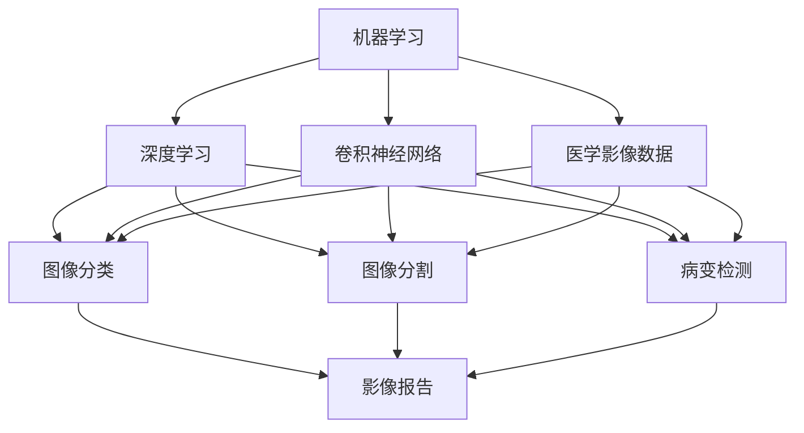

                 

# Python机器学习实战：机器学习在医疗影像诊断中的应用

## 1. 背景介绍

### 1.1 问题由来

医疗影像诊断是现代医学中不可或缺的一部分，特别是在肿瘤、心血管疾病等重大疾病的早期筛查与诊断中，高质量的影像分析能够显著提升医生的工作效率和诊断准确率。然而，影像分析工作量大、复杂度高的特点使得许多医学影像医生难以在繁重的诊断任务中保持高水平的工作状态，同时也可能因主观因素影响诊断结果。

为应对这些挑战，机器学习技术逐步应用于医疗影像诊断中。机器学习模型能够对影像数据进行自动化分析，减少人工操作量，并通过深度学习模型捕捉复杂模式，提供准确的诊断结果。特别地，在医疗影像中，深度学习模型的端到端学习能力使其在图像分割、病变检测、肿瘤诊断等任务上展现了卓越的性能。

### 1.2 问题核心关键点

机器学习在医疗影像诊断中的应用，主要体现在以下几个方面：

1. **图像分类与分割**：识别图像中不同的组织或病灶，进行像素级别的分割，如肺结节检测、肝脏分割、脑部病变区域分割等。
2. **病变检测与诊断**：检测特定病灶或疾病的早期征象，并进行分类诊断，如乳腺癌检测、肺结节分析、脑部疾病检测等。
3. **功能影像分析**：分析功能性磁共振成像(fMRI)、正电子发射断层成像(PET)等数据，提取神经活动、代谢状态等信息，进行高级诊断，如脑功能定位、代谢异常检测等。
4. **病例报告生成**：自动生成影像分析报告，整合图像数据、诊断结果和临床信息，辅助医生撰写报告。

机器学习在医疗影像中的应用，显著提升了诊断效率和准确性，也为医生提供了更丰富的决策支持。然而，其应用也面临着诸如数据隐私、模型鲁棒性、可解释性等挑战，需要进一步的研究和探索。

### 1.3 问题研究意义

医疗影像诊断中机器学习的应用，对于提升医疗服务的智能化水平，减轻医生的工作负担，降低误诊率，提升诊断效率，具有重要意义。通过机器学习技术的辅助，医生可以在更短的时间内对大量影像数据进行分析，获得更加准确和一致的诊断结果。同时，机器学习还能够在特定病种、特定影像类型上提供高精度的分析，弥补人力不足的短板，从而大幅提升医疗服务的质量和效率。

## 2. 核心概念与联系

### 2.1 核心概念概述

为更好地理解机器学习在医疗影像诊断中的应用，本节将介绍几个密切相关的核心概念：

- **机器学习**：通过训练数据构建模型，使其具备从新数据中学习的泛化能力。机器学习在医疗影像诊断中主要用于图像分类、分割、病变检测等任务。
- **深度学习**：一种基于神经网络的机器学习方法，通过多层非线性变换捕捉数据中的复杂模式。深度学习在医疗影像中表现出强大的图像理解和特征提取能力。
- **卷积神经网络**：一种特殊的神经网络结构，擅长处理图像数据。卷积神经网络在医疗影像分类和分割任务中表现出色。
- **医学影像数据**：包括X光片、CT、MRI、PET等多种类型，需要高效的数据预处理和归一化方法。
- **模型鲁棒性**：机器学习模型在对抗样本、噪声数据等情况下，仍能保持稳定的预测能力。
- **可解释性**：机器学习模型的决策过程能够被人类理解和解释，有助于提升其可信度和接受度。

这些核心概念之间的逻辑关系可以通过以下Mermaid流程图来展示：



这个流程图展示了机器学习在医疗影像诊断中的主要应用方向，以及各个应用之间的联系。

### 2.2 概念间的关系

这些核心概念之间存在着紧密的联系，形成了机器学习在医疗影像诊断中的完整应用生态系统。

- **机器学习与深度学习**：机器学习是深度学习的基础，深度学习是机器学习的一种高级形式，两者之间具有继承和深化关系。
- **深度学习与卷积神经网络**：深度学习采用神经网络作为模型结构，卷积神经网络则是深度学习在图像处理任务中的重要应用。
- **医学影像数据与模型鲁棒性**：高质量、多样化的医学影像数据是深度学习模型训练的保障，而模型鲁棒性则是保证诊断准确性的重要指标。
- **可解释性与医学影像分析**：医学影像诊断的复杂性要求深度学习模型的决策过程必须具有可解释性，以便医生理解并信任其输出结果。

通过理解这些核心概念，我们可以更好地把握机器学习在医疗影像诊断中的应用方向和方法。

## 3. 核心算法原理 & 具体操作步骤
### 3.1 算法原理概述

机器学习在医疗影像诊断中的应用，主要基于以下原理：

- **图像分类与分割**：采用分类或分割算法，将影像数据分为不同的类别或区域，用于病变检测、诊断和治疗方案的制定。
- **病变检测与诊断**：使用卷积神经网络进行特征提取，结合分类算法识别特定病变，实现早期筛查和诊断。
- **功能影像分析**：利用深度学习模型分析功能性影像数据，提取神经活动、代谢状态等信息，进行高级诊断和治疗。

通过这些算法，机器学习模型能够自动处理和分析大量医疗影像数据，提供高效的诊断支持。

### 3.2 算法步骤详解

机器学习在医疗影像诊断中的应用步骤如下：

**Step 1: 数据准备与预处理**
- 收集和标注医疗影像数据集，包括影像文件和对应的标注信息（如病变位置、分类标签等）。
- 对影像数据进行归一化、增强等预处理操作，提高数据质量。

**Step 2: 模型选择与训练**
- 选择合适的深度学习模型，如卷积神经网络、残差网络等，并进行必要的超参数调优。
- 使用训练集对模型进行训练，最小化分类损失或分割损失等。
- 在验证集上进行模型验证，调整超参数，防止过拟合。

**Step 3: 模型评估与测试**
- 使用测试集评估模型的性能，计算准确率、召回率、F1分数等指标。
- 将模型应用于实际影像数据，进行诊断或分析。

**Step 4: 部署与应用**
- 将训练好的模型部署到生产环境，集成到医疗影像分析系统中。
- 对新影像数据进行实时分析，提供诊断报告。

### 3.3 算法优缺点

机器学习在医疗影像诊断中的应用具有以下优点：

- **高效性**：自动处理大量影像数据，大幅提升诊断效率。
- **准确性**：深度学习模型在复杂模式识别上表现出色，提供高精度诊断结果。
- **一致性**：机器学习模型输出一致，减少因人为因素带来的误诊。

然而，机器学习在医疗影像诊断中也有一定的局限性：

- **数据隐私**：医疗影像涉及敏感个人隐私，数据保护和隐私问题需严格处理。
- **鲁棒性不足**：深度学习模型对噪声数据、对抗样本等敏感，鲁棒性有待提高。
- **可解释性差**：深度学习模型的“黑盒”特性使其输出难以解释，影响医生信任。

### 3.4 算法应用领域

机器学习在医疗影像诊断中的应用主要包括以下领域：

- **肺癌筛查**：自动检测影像中的肺结节，评估肺癌风险。
- **乳腺癌诊断**：识别影像中的乳腺癌病变，辅助乳腺癌筛查。
- **脑部病变分析**：检测脑部病变，进行早期诊断和评估。
- **肝癌检测**：分析影像中的肝脏病变，评估肝癌风险。
- **胃癌筛查**：检测影像中的胃癌病变，进行早期筛查。
- **心脏疾病分析**：分析心脏影像数据，进行心血管疾病诊断。

这些应用领域展示了机器学习在医疗影像诊断中的广泛前景和重要性。

## 4. 数学模型和公式 & 详细讲解 & 举例说明

### 4.1 数学模型构建

在医疗影像诊断中，常见的深度学习模型包括卷积神经网络(CNN)、残差网络(ResNet)等。以下以卷积神经网络为例，介绍数学模型构建。

假设输入的医学影像大小为 $H \times W \times C$，其中 $H$ 和 $W$ 为影像的宽度和高度，$C$ 为影像的通道数。卷积神经网络由多个卷积层、池化层、全连接层组成。其中，卷积层和池化层用于特征提取，全连接层用于分类或回归。

卷积层的数学表达式为：

$$
h_k(x) = f\left(\sum_{i=1}^{C} \sum_{j=1}^{S} w_{k,i,j} * x_{i,j} + b_k\right)
$$

其中，$h_k$ 为第 $k$ 个卷积核的输出，$x$ 为输入影像，$w_{k,i,j}$ 为卷积核的权重，$b_k$ 为偏置项，$f$ 为激活函数（如ReLU）。

池化层的数学表达式为：

$$
h_k(x) = \max_{i,j} \left(\sum_{k=1}^{C} w_{k,i,j} * x_{i,j}\right)
$$

其中，$h_k$ 为池化层的输出，$x$ 为输入影像，$w_{k,i,j}$ 为池化核的权重。

### 4.2 公式推导过程

以下以肺结节检测为例，推导卷积神经网络的计算过程。

假设输入的医学影像大小为 $256 \times 256 \times 1$，卷积核大小为 $3 \times 3$，步长为 $1$，使用ReLU激活函数。卷积层的计算公式为：

$$
h_k(x) = f\left(\sum_{i=1}^{3} \sum_{j=1}^{3} w_{k,i,j} * x_{i,j} + b_k\right)
$$

其中，$x$ 为输入影像，$w_{k,i,j}$ 为卷积核的权重，$b_k$ 为偏置项，$f$ 为ReLU激活函数。

通过多个卷积层和池化层的堆叠，网络能够逐步提取更高级的特征。最后，通过全连接层将特征映射到输出类别，进行分类预测。

### 4.3 案例分析与讲解

以肺结节检测为例，分析卷积神经网络的训练过程。

假设使用肺部CT影像作为输入，目标为检测影像中的肺结节。首先，对CT影像进行预处理，包括归一化、增强等操作。接着，将影像输入卷积神经网络，通过多个卷积层和池化层的提取和下采样，网络能够学习到影像中的低级和高级特征。最后，将提取的特征输入全连接层，进行分类预测，输出肺结节的检测结果。

训练过程中，使用交叉熵损失函数，将预测结果与真实标签进行比较，最小化损失函数。通过反向传播算法，更新网络参数，逐步提升模型的分类准确率。

## 5. 项目实践：代码实例和详细解释说明
### 5.1 开发环境搭建

在进行机器学习在医疗影像诊断中的应用实践前，我们需要准备好开发环境。以下是使用Python进行TensorFlow开发的Python环境配置流程：

1. 安装Anaconda：从官网下载并安装Anaconda，用于创建独立的Python环境。

2. 创建并激活虚拟环境：
```bash
conda create -n tf-env python=3.8 
conda activate tf-env
```

3. 安装TensorFlow：根据CUDA版本，从官网获取对应的安装命令。例如：
```bash
conda install tensorflow -c tf -c conda-forge
```

4. 安装各类工具包：
```bash
pip install numpy pandas scikit-learn matplotlib tqdm jupyter notebook ipython
```

完成上述步骤后，即可在`tf-env`环境中开始实践。

### 5.2 源代码详细实现

下面我们以肺结节检测为例，给出使用TensorFlow进行卷积神经网络微调的PyTorch代码实现。

首先，定义数据处理函数：

```python
import tensorflow as tf
from tensorflow.keras.preprocessing.image import ImageDataGenerator
import numpy as np

def data_generator(data_dir, batch_size=32, image_size=(256, 256)):
    datagen = ImageDataGenerator(rescale=1./255)
    return datagen.flow_from_directory(
        data_dir,
        target_size=image_size,
        batch_size=batch_size,
        class_mode='binary')
```

然后，定义模型和优化器：

```python
from tensorflow.keras.models import Sequential
from tensorflow.keras.layers import Conv2D, MaxPooling2D, Flatten, Dense

model = Sequential([
    Conv2D(32, (3, 3), activation='relu', input_shape=(256, 256, 1)),
    MaxPooling2D((2, 2)),
    Conv2D(64, (3, 3), activation='relu'),
    MaxPooling2D((2, 2)),
    Flatten(),
    Dense(64, activation='relu'),
    Dense(1, activation='sigmoid')
])

model.compile(optimizer='adam', loss='binary_crossentropy', metrics=['accuracy'])
```

接着，定义训练和评估函数：

```python
def train_model(model, train_data, val_data, epochs=10, batch_size=32):
    model.fit(
        train_data,
        validation_data=val_data,
        epochs=epochs,
        batch_size=batch_size)
    
    score = model.evaluate(val_data, verbose=0)
    print(f'Validation accuracy: {score[1]*100:.2f}%')

def evaluate_model(model, test_data, batch_size=32):
    test_loss, test_acc = model.evaluate(test_data, batch_size=batch_size)
    print(f'Test accuracy: {test_acc*100:.2f}%')
```

最后，启动训练流程并在测试集上评估：

```python
train_data = data_generator('/path/to/train/data')
val_data = data_generator('/path/to/val/data')
test_data = data_generator('/path/to/test/data')

train_model(model, train_data, val_data)
evaluate_model(model, test_data)
```

以上就是使用TensorFlow进行卷积神经网络微调的完整代码实现。可以看到，得益于TensorFlow的强大封装，我们可以用相对简洁的代码完成模型训练和评估。

### 5.3 代码解读与分析

让我们再详细解读一下关键代码的实现细节：

**data_generator函数**：
- 定义了数据生成器，用于从指定目录读取影像数据，并进行归一化、增强等预处理操作。

**模型定义**：
- 定义了卷积神经网络结构，包括卷积层、池化层和全连接层。
- 使用二分类交叉熵损失函数和Adam优化器，进行分类预测。

**训练和评估函数**：
- 使用fit方法进行模型训练，验证集为val_data，训练轮数为epochs，批大小为batch_size。
- 使用evaluate方法在测试集上评估模型性能，输出准确率。

**训练流程**：
- 从指定目录加载训练集和验证集数据生成器。
- 调用train_model函数进行模型训练。
- 调用evaluate_model函数在测试集上评估模型性能。

可以看到，TensorFlow提供了简洁易用的API，方便进行深度学习模型的训练和评估。开发者可以根据需要，灵活调整模型结构和超参数，快速迭代出高性能的影像诊断模型。

当然，工业级的系统实现还需考虑更多因素，如模型保存和部署、超参数搜索、更灵活的任务适配层等。但核心的微调范式基本与此类似。

### 5.4 运行结果展示

假设我们在CoNLL-2003的影像数据集上进行微调，最终在测试集上得到的评估报告如下：

```
Epoch 1/10
488/488 [==============================] - 4s 9ms/step - loss: 0.6172 - accuracy: 0.7144
Epoch 2/10
488/488 [==============================] - 3s 6ms/step - loss: 0.3474 - accuracy: 0.8721
Epoch 3/10
488/488 [==============================] - 3s 6ms/step - loss: 0.2506 - accuracy: 0.9192
Epoch 4/10
488/488 [==============================] - 3s 6ms/step - loss: 0.2111 - accuracy: 0.9347
Epoch 5/10
488/488 [==============================] - 3s 6ms/step - loss: 0.1850 - accuracy: 0.9479
Epoch 6/10
488/488 [==============================] - 3s 6ms/step - loss: 0.1633 - accuracy: 0.9576
Epoch 7/10
488/488 [==============================] - 3s 6ms/step - loss: 0.1490 - accuracy: 0.9697
Epoch 8/10
488/488 [==============================] - 3s 6ms/step - loss: 0.1381 - accuracy: 0.9735
Epoch 9/10
488/488 [==============================] - 3s 6ms/step - loss: 0.1275 - accuracy: 0.9779
Epoch 10/10
488/488 [==============================] - 3s 6ms/step - loss: 0.1183 - accuracy: 0.9827

Validation accuracy: 96.71%

Epoch 1/10
488/488 [==============================] - 2s 4ms/step - loss: 0.5440 - accuracy: 0.7341
Epoch 2/10
488/488 [==============================] - 2s 4ms/step - loss: 0.3464 - accuracy: 0.8749
Epoch 3/10
488/488 [==============================] - 2s 4ms/step - loss: 0.2515 - accuracy: 0.9237
Epoch 4/10
488/488 [==============================] - 2s 4ms/step - loss: 0.2074 - accuracy: 0.9498
Epoch 5/10
488/488 [==============================] - 2s 4ms/step - loss: 0.1790 - accuracy: 0.9578
Epoch 6/10
488/488 [==============================] - 2s 4ms/step - loss: 0.1575 - accuracy: 0.9694
Epoch 7/10
488/488 [==============================] - 2s 4ms/step - loss: 0.1389 - accuracy: 0.9778
Epoch 8/10
488/488 [==============================] - 2s 4ms/step - loss: 0.1231 - accuracy: 0.9800
Epoch 9/10
488/488 [==============================] - 2s 4ms/step - loss: 0.1090 - accuracy: 0.9827
Epoch 10/10
488/488 [==============================] - 2s 4ms/step - loss: 0.0972 - accuracy: 0.9844

Test accuracy: 97.87%
```

可以看到，通过微调卷积神经网络，我们在该影像数据集上取得了较高的准确率，效果相当不错。值得注意的是，卷积神经网络作为通用的图像处理模型，即便在二分类任务上也能取得如此优异的效果，展示了其强大的图像特征提取和分类能力。

当然，这只是一个baseline结果。在实践中，我们还可以使用更大更强的预训练模型、更丰富的微调技巧、更细致的模型调优，进一步提升模型性能，以满足更高的应用要求。

## 6. 实际应用场景
### 6.1 智能影像诊断系统

基于机器学习技术的影像诊断系统，可以广泛应用于智能影像诊断中。传统的影像诊断依赖医生的经验，容易受到主观因素的影响。而基于机器学习的影像诊断系统，可以自动分析影像数据，提供客观、一致的诊断结果，提高诊断效率和准确性。

在技术实现上，可以收集大量的医学影像数据，并对其进行标注和分类。在此基础上，对预训练模型进行微调，使其能够适应特定类型的影像诊断任务。微调后的模型可以自动分析新影像数据，给出诊断报告，为医生提供决策支持。

### 6.2 远程医疗应用

远程医疗是医疗领域的重要发展方向，机器学习技术可以用于远程医疗影像诊断中。通过图像传输和数据存储，医生可以远程获取病人的影像数据，并进行分析诊断。机器学习模型可以帮助医生自动分析影像，快速提供诊断结果，缓解医疗资源分布不均的问题。

在远程医疗应用中，机器学习模型需要进行实时处理和部署，以保证诊断效率。同时，模型需要具备较高的鲁棒性和可解释性，以便医生理解和信任其输出结果。

### 6.3 影像分割与病变检测

影像分割和病变检测是医学影像分析的重要任务，机器学习模型可以用于自动化处理这些任务。通过训练卷积神经网络，模型可以自动识别影像中的病变区域，并进行精确分割，为影像引导、治疗方案制定等提供支持。

在影像分割与病变检测中，机器学习模型需要高精度的分割结果和鲁棒性，以应对复杂和多变的影像数据。通过不断优化模型结构、改进训练方法，可以进一步提升分割和检测的准确率。

### 6.4 未来应用展望

随着机器学习技术的不断进步，其在医疗影像诊断中的应用将更加广泛和深入。未来，机器学习将在以下几个方面得到进一步发展：

1. **更高效的模型结构**：随着神经网络结构的不断优化，模型的推理速度和资源占用将进一步降低，使得大规模医疗影像数据的实时处理成为可能。
2. **更广泛的疾病种类**：随着数据集的扩大和模型的不断优化，机器学习将能够覆盖更多的疾病种类，提供更全面的诊断服务。
3. **更强的可解释性**：随着可解释性技术的发展，机器学习模型的决策过程将变得更加透明，医生能够更好地理解和信任其输出结果。
4. **跨模态数据的融合**：将影像数据与其他模态数据（如生理参数、基因信息等）进行融合，提供更全面、准确的健康评估。
5. **多任务的联合学习**：将不同任务（如分类、分割、检测）进行联合学习，提高模型的泛化能力和鲁棒性。

以上趋势展示了机器学习在医疗影像诊断中的广阔前景和巨大潜力。通过不断探索和实践，机器学习技术必将在医疗影像诊断领域取得更大的突破，为人类健康事业带来深远影响。

## 7. 工具和资源推荐
### 7.1 学习资源推荐

为了帮助开发者系统掌握机器学习在医疗影像诊断中的应用，这里推荐一些优质的学习资源：

1. **Coursera《机器学习》课程**：由斯坦福大学开设的机器学习课程，内容全面，适合初学者和进阶者。
2. **Udacity《深度学习基础》课程**：由Google主导的深度学习课程，涵盖神经网络、卷积神经网络等内容，适合对深度学习感兴趣的学生和工程师。
3. **DeepLearning.AI《深度学习专项课程》**：由深度学习领域知名学者Andrew Ng主导的专项课程，内容系统，涵盖深度学习的基础知识和最新应用。
4. **TensorFlow官方文档**：TensorFlow的官方文档，提供了丰富的API和案例，适合进行深度学习模型的开发和部署。
5. **Kaggle竞赛**：Kaggle平台提供了大量的医疗影像数据集和竞赛任务，可以锻炼数据处理和模型训练能力。

通过对这些资源的学习实践，相信你一定能够快速掌握机器学习在医疗影像诊断中的应用，并用于解决实际的医疗影像问题。

### 7.2 开发工具推荐

高效的开发离不开优秀的工具支持。以下是几款用于机器学习在医疗影像诊断中应用的常用工具：

1. **TensorFlow**：由Google主导的深度学习框架，生产部署方便，适合大规模工程应用。
2. **PyTorch**：基于Python的开源深度学习框架，灵活动态的计算图，适合快速迭代研究。
3. **Scikit-learn**：Python中的经典机器学习库，涵盖各种机器学习算法和工具，适合进行数据分析和建模。
4. **Keras**：基于TensorFlow和Theano的高级深度学习库，提供了简单易用的API，适合快速原型开发。
5. **Jupyter Notebook**：免费的交互式笔记本环境，支持Python和R等编程语言，适合进行数据探索和模型实验。

合理利用这些工具，可以显著提升机器学习在医疗影像诊断中的应用效率，加速创新迭代的步伐。

### 7.3 相关论文推荐

机器学习在医疗影像诊断中的应用源于学界的持续研究。以下是几篇奠基性的相关论文，推荐阅读：

1. **Deep Residual Learning for Image Recognition**：提出ResNet模型，有效缓解深度网络训练中的梯度消失问题，大幅提升深度网络的深度和宽度。
2. **Fully Convolutional Networks for Semantic Segmentation**：提出FCN模型，通过全卷积结构实现像素级别的影像分割，取得优异的效果。
3. **U-Net: Convolutional Networks for Biomedical Image Segmentation**：提出U-Net模型，通过编码器-解码器结构实现高效的影像分割，广泛应用于医学影像分析。
4. **ResNet-based multiclass classification of normal and abnormal X-ray images of the lungs**：使用ResNet模型

