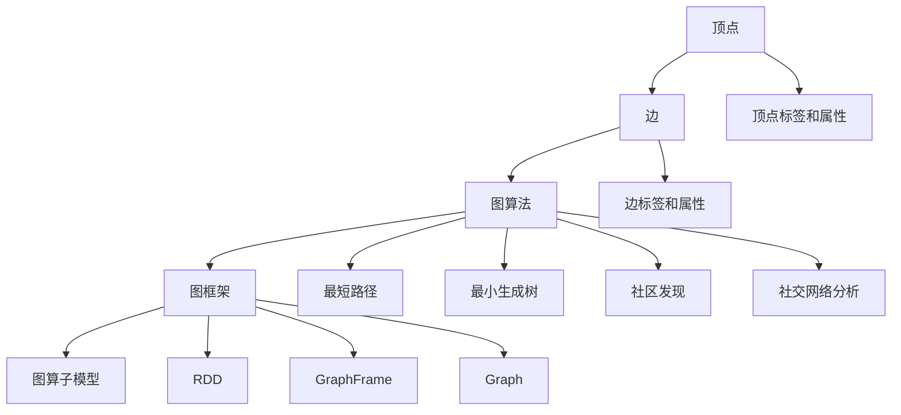
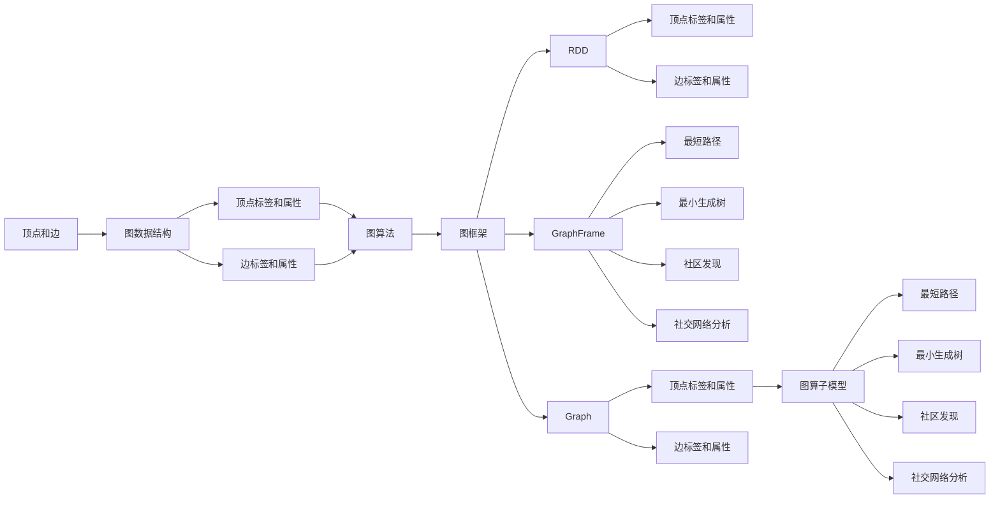

                 

# Spark GraphX图计算引擎原理与代码实例讲解

> 关键词：Spark GraphX, 图计算引擎, 图算法, 图数据结构, 大数据处理, Apache Spark

## 1. 背景介绍

### 1.1 问题由来
在现代大数据时代，数据不再仅限于传统的数值型数据，结构化数据和半结构化数据的价值也日益突显。尤其是网络数据，因其包含丰富的人际关系、知识图谱、社会网络等复杂结构信息，在社交网络分析、推荐系统、医学知识图谱等领域有着广泛应用。然而，这些数据往往具有稀疏性、非结构化、异构性等特点，传统的SQL数据库和Hadoop MapReduce系统难以胜任其高效存储和处理的需求。

针对这一问题，Apache Spark的GraphX图计算引擎应运而生。GraphX是一个用于大规模图数据处理和计算的库，通过分布式并行算法，可以在多台计算节点上高效处理复杂图数据，解决传统系统难以处理的大规模、稀疏图数据问题。

### 1.2 问题核心关键点
GraphX的图计算引擎具有以下关键特点：

- 分布式并行计算：通过分布式计算框架，实现图数据的并行处理，提升计算效率。
- 图算法丰富：提供常见的图算法，如最短路径、最小生成树、图分割、社交网络分析等。
- 图数据结构灵活：支持稠密图和稀疏图，图数据以顶点和边的形式存储，灵活高效。
- 算子模型清晰：GraphX将图算法封装成图算子（Graph Operation），清晰直观。
- 接口丰富易用：支持基于RDD、GraphFrame和Graph等不同接口，方便开发者根据不同场景选择使用。

GraphX的出现极大地简化了大规模图数据的处理和计算，推动了大数据技术在大规模图处理中的应用和普及。本文将详细讲解GraphX的核心概念与原理，并结合实际项目案例，探讨GraphX在大数据图处理中的应用。

### 1.3 问题研究意义
研究GraphX图计算引擎，对于掌握图计算的核心技术和应用方法，提升大数据处理能力，推动大数据技术在复杂图数据上的应用，具有重要意义：

1. 降低复杂图数据处理成本：传统图处理方式计算复杂度高、存储成本高，GraphX通过分布式并行计算，降低了复杂图数据处理的成本。
2. 提升图处理效率：通过优化图算法和并行计算，GraphX能高效处理大规模图数据，提升图处理效率。
3. 丰富图数据应用场景：GraphX支持多种图算法和数据结构，拓宽了图数据的应用范围，推动图数据在更多领域的应用。
4. 增强算子模型清晰性：GraphX将图算法封装成算子模型，使开发者能够更加清晰地理解和应用图算法。
5. 提升易用性：GraphX提供多种接口和丰富功能，使得图计算开发更加便捷高效。

## 2. 核心概念与联系

### 2.1 核心概念概述

为更好地理解GraphX图计算引擎，本节将介绍几个关键的概念：

- GraphX图计算引擎：Spark框架下的图计算库，支持大规模图数据的分布式并行处理和计算。
- 顶点和边：图的基本数据结构，顶点代表图的数据实体，边表示实体之间的关系。
- 顶点标签和属性：用于描述顶点的额外信息，如顶点ID、类型等。
- 边标签和属性：用于描述边的额外信息，如边ID、类型等。
- 图算法：包括最短路径、最小生成树、社区发现、社交网络分析等。
- 图框架：GraphX提供基于RDD、GraphFrame、Graph等不同类型的图处理框架，适应不同的应用场景。
- 图算子模型：GraphX将图算法封装成算子模型，清晰直观，便于开发者理解和实现。

这些核心概念之间存在着紧密的联系，形成了GraphX图计算引擎的完整生态系统。下面我通过一个Mermaid流程图来展示这些概念之间的关系。



这个流程图展示了GraphX中核心概念的关系：

1. 顶点和边是图的基本构成元素，通过顶点和边构建图数据结构。
2. 顶点和边具有额外的标签和属性信息，用于描述实体及其关系。
3. 图算法包括多种，如最短路径、最小生成树、社区发现等。
4. GraphX提供多种图框架，如基于RDD、GraphFrame和Graph等。
5. 图算法被封装成算子模型，直观易用。

通过理解这些核心概念，我们可以更好地把握GraphX图计算引擎的工作原理和优化方向。

### 2.2 概念间的关系

这些核心概念之间存在着紧密的联系，形成了GraphX图计算引擎的完整生态系统。下面我通过几个Mermaid流程图来展示这些概念之间的关系。

#### 2.2.1 GraphX图计算引擎的原理



这个流程图展示了GraphX图计算引擎的原理：

1. 顶点和边构成图数据结构。
2. 顶点和边具有标签和属性，描述实体及其关系。
3. 图算法如最短路径、最小生成树、社区发现等，应用于图数据结构。
4. GraphX提供多种图框架，如RDD、GraphFrame、Graph等。
5. 图算法封装成算子模型，清晰易用。

#### 2.2.2 GraphX图计算引擎的应用场景

```mermaid
graph TB
    A[顶点] --> B[边]
    B --> C[图数据结构]
    C --> D[顶点标签和属性]
    C --> E[边标签和属性]
    D --> F[图算法]
    E --> F
    F --> G[图框架]
    G --> H[RDD]
    G --> I[GraphFrame]
    G --> J[Graph]
    H --> K[社交网络分析]
    H --> L[推荐系统]
    I --> M[图分割]
    I --> N[社区发现]
    J --> O[图数据可视化]
    K --> P[最短路径]
    L --> Q[最小生成树]
    M --> R[边权重计算]
    N --> S[聚类分析]
    O --> T[图数据存储]
    P --> U[社交网络分析]
    Q --> V[图数据库]
    R --> W[边的扩展和收缩]
    S --> X[聚类分析]
    T --> Y[图数据压缩]
    U --> Z[社交网络分析]
    V --> [社交网络分析]
    W --> [边的扩展和收缩]
    X --> [聚类分析]
    Y --> [图数据压缩]
    Z --> [社交网络分析]
```

这个流程图展示了GraphX图计算引擎在不同应用场景中的应用：

1. 图数据结构：顶点和边构成图数据结构，支持稠密图和稀疏图。
2. 图算法：应用如社交网络分析、推荐系统、图分割等。
3. 图框架：提供基于RDD、GraphFrame和Graph等不同类型的图处理框架，适应不同的应用场景。
4. 图算子模型：封装图算法，清晰直观，便于开发者理解和实现。

通过理解这些核心概念的关系，我们可以更好地把握GraphX图计算引擎的工作原理和优化方向。

### 2.3 核心概念的整体架构

最后，我们用一个综合的流程图来展示这些核心概念在大规模图数据处理中的整体架构：

```mermaid
graph TB
    A[大规模图数据] --> B[顶点和边]
    B --> C[图数据结构]
    C --> D[顶点标签和属性]
    C --> E[边标签和属性]
    D --> F[图算法]
    E --> F
    F --> G[图框架]
    G --> H[RDD]
    G --> I[GraphFrame]
    G --> J[Graph]
    H --> K[社交网络分析]
    H --> L[推荐系统]
    I --> M[图分割]
    I --> N[社区发现]
    J --> O[图数据可视化]
    K --> P[最短路径]
    L --> Q[最小生成树]
    M --> R[边权重计算]
    N --> S[聚类分析]
    O --> T[图数据存储]
    P --> U[社交网络分析]
    Q --> V[图数据库]
    R --> W[边的扩展和收缩]
    S --> X[聚类分析]
    T --> Y[图数据压缩]
    U --> Z[社交网络分析]
    V --> [社交网络分析]
    W --> [边的扩展和收缩]
    X --> [聚类分析]
    Y --> [图数据压缩]
    Z --> [社交网络分析]
```

这个综合流程图展示了GraphX中核心概念在大规模图数据处理中的整体架构：

1. 大规模图数据通过顶点和边构成图数据结构。
2. 图数据结构通过顶点标签和属性、边标签和属性进行描述。
3. 图算法如社交网络分析、推荐系统等，应用于图数据结构。
4. GraphX提供多种图框架，如RDD、GraphFrame、Graph等。
5. 图算法封装成算子模型，清晰易用。

通过这些核心概念的组合，GraphX实现了高效、灵活、便捷的大规模图数据处理和计算。

## 3. 核心算法原理 & 具体操作步骤

### 3.1 算法原理概述

GraphX的图计算引擎基于Spark的分布式计算框架，通过分布式并行算法，实现大规模图数据的处理和计算。其核心原理包括：

- 分布式计算：将大规模图数据分布在多个计算节点上进行并行计算，提高计算效率。
- 图数据结构：采用顶点和边构成图数据结构，支持稠密图和稀疏图。
- 图算法封装：将图算法封装成算子模型，清晰直观，便于开发者理解和实现。

GraphX提供了多种图算法和图框架，通过算子模型封装，简化了图数据处理和计算的复杂度。下面我将详细介绍GraphX的核心算法原理。

### 3.2 算法步骤详解

GraphX的图计算引擎基于Spark的分布式计算框架，其核心算法步骤包括：

1. 图数据结构创建：通过顶点和边创建图数据结构，支持稠密图和稀疏图。
2. 图数据并行化：将图数据结构并行化，分布在多个计算节点上进行计算。
3. 图算法执行：通过算子模型封装，执行图算法，实现图数据的计算和分析。
4. 图数据存储和可视化：将计算结果存储和可视化，生成图表和报表。

以下是GraphX图计算引擎的核心算法步骤的详细介绍：

#### 3.2.1 图数据结构创建

GraphX提供了多种图数据结构，如顶点和边、图框架等，通过这些数据结构创建图数据结构：

```python
from pyspark.graphx import VertexId, EdgeId, VertexLabel, EdgeLabel

# 创建顶点和边
vertex = VertexId(1)
edge = EdgeId(1, 2)

# 创建图框架
graph = GraphFrame.from_edgedata([(1, 2, VertexLabel('person'), EdgeLabel('friend'))])

# 创建图
graph = GraphFrame.from_edges([(1, 2, 'friend')]
```

#### 3.2.2 图数据并行化

GraphX通过Spark的分布式计算框架，将图数据结构并行化，分布在多个计算节点上进行计算：

```python
from pyspark.graphx import GraphFrame

# 创建分布式图框架
graph = GraphFrame.from_edgedata([(1, 2, VertexLabel('person'), EdgeLabel('friend'))])

# 分布式计算
graph = graph.rdd()
```

#### 3.2.3 图算法执行

GraphX将图算法封装成算子模型，通过算子模型执行图算法，实现图数据的计算和分析：

```python
from pyspark.graphx import PageRank

# 创建PageRank算子模型
pageRank = PageRank(0.85)

# 执行PageRank算法
result = graph.pageRank()
```

#### 3.2.4 图数据存储和可视化

GraphX将计算结果存储和可视化，生成图表和报表：

```python
from pyspark.graphx import GraphFrame

# 创建分布式图框架
graph = GraphFrame.from_edgedata([(1, 2, VertexLabel('person'), EdgeLabel('friend'))])

# 分布式计算
graph = graph.rdd()

# 存储和可视化结果
graph.saveAsTextFile('result.txt')
graph.show()
```

通过这些核心算法步骤，GraphX实现了大规模图数据的分布式并行处理和计算。

### 3.3 算法优缺点

GraphX图计算引擎具有以下优点：

- 分布式并行计算：通过Spark的分布式计算框架，实现大规模图数据的并行处理，提高计算效率。
- 图算法丰富：提供多种图算法，如最短路径、最小生成树、社交网络分析等。
- 图数据结构灵活：支持稠密图和稀疏图，图数据以顶点和边的形式存储，灵活高效。
- 算子模型清晰：将图算法封装成算子模型，清晰直观，便于开发者理解和实现。
- 接口丰富易用：支持基于RDD、GraphFrame和Graph等不同接口，适应不同的应用场景。

同时，GraphX也存在一些缺点：

- 学习成本较高：GraphX的算子模型和接口较多，需要开发者具备一定的图计算基础和Spark经验。
- 性能瓶颈：在处理大规模图数据时，可能会遇到性能瓶颈，需要通过优化算法和硬件配置解决。
- 开发复杂度：在开发大规模图处理应用时，可能需要面对复杂的图数据结构和高并发访问问题，开发复杂度较高。
- 数据存储和可视化：在处理大规模图数据时，需要考虑图数据的存储和可视化问题，需要相应的工具和解决方案。

尽管存在这些缺点，但GraphX图计算引擎在处理大规模图数据方面表现出色，为大规模图数据的处理提供了强大的工具支持。

### 3.4 算法应用领域

GraphX图计算引擎在多个领域中得到了广泛应用，包括但不限于：

- 社交网络分析：分析社交网络中的人际关系、社区发现等。
- 推荐系统：基于用户画像和物品特征，推荐系统为用户推荐个性化商品或内容。
- 图数据库：构建大规模图数据库，存储和管理图数据。
- 图可视化：将图数据进行可视化，生成图表和报表，帮助用户更好地理解数据。
- 图分割：将大规模图数据划分为多个子图，提升计算效率。

此外，GraphX还在生物信息学、金融风险控制、供应链管理等多个领域中得到了应用。随着图数据规模的不断增长和图计算技术的不断进步，GraphX图计算引擎将会在更多领域中发挥重要作用。

## 4. 数学模型和公式 & 详细讲解 & 举例说明

### 4.1 数学模型构建

GraphX的图计算引擎涉及多种图算法，如最短路径、最小生成树、社交网络分析等。下面我将以最短路径算法为例，详细介绍其数学模型构建。

设图G(V,E)，其中V为顶点集，E为边集，边(u,v)的权重为w(u,v)。最短路径算法用于计算源顶点s到其他顶点的最短路径。设d(u)为顶点u的最短路径，则最短路径算法可以表示为：

$$
d(s) = 0, \quad d(v) = \infty, \quad \text{for } v \neq s
$$

$$
d(u) = \min\{d(v) + w(u,v) \mid (v,u) \in E \quad \text{or} \quad (u,v) \in E\}
$$

其中d(s)表示源顶点s的最短路径，d(v)表示顶点v的最短路径，w(u,v)表示边(u,v)的权重。

### 4.2 公式推导过程

以下是最短路径算法的公式推导过程：

1. 初始化：设d(s) = 0，d(v) = ∞，v ≠ s。
2. 更新：对于所有以v为终点的边(u,v)，更新d(u)为：
   $$
   d(u) = \min\{d(v) + w(u,v) \mid (v,u) \in E \quad \text{or} \quad (u,v) \in E\}
   $$
3. 停止：当所有顶点的最短路径计算完毕，算法结束。

通过上述推导，我们可以看到，最短路径算法通过迭代计算，更新每个顶点的最短路径，最终得到源顶点到其他顶点的最短路径。

### 4.3 案例分析与讲解

下面以一个实际案例来详细讲解最短路径算法的应用：

假设有一个社交网络图G(V,E)，其中顶点表示用户，边表示用户之间的关系，边权重表示关系的强度。我们需要计算源用户s到其他用户的最短路径，即找到与s关系最近的朋友、朋友的朋友等，直到无法找到为止。

```python
from pyspark.graphx import GraphFrame

# 创建社交网络图
graph = GraphFrame.from_edgedata([(1, 2, VertexLabel('person'), EdgeLabel('friend'))])

# 计算最短路径
result = graph.shortestPaths('person')
```

在上述代码中，我们创建了一个社交网络图，使用GraphFrame表示图数据结构。然后使用GraphX提供的shortestPaths函数计算源顶点s到其他顶点的最短路径。

通过最短路径算法，GraphX可以帮助我们快速计算出社交网络中与源用户关系最近的朋友、朋友的朋友等，帮助用户更好地理解社交网络的结构和关系。

## 5. 项目实践：代码实例和详细解释说明

### 5.1 开发环境搭建

在进行GraphX项目实践前，我们需要准备好开发环境。以下是使用Python进行PySpark开发的环境配置流程：

1. 安装Anaconda：从官网下载并安装Anaconda，用于创建独立的Python环境。

2. 创建并激活虚拟环境：
```bash
conda create -n pyspark-env python=3.8 
conda activate pyspark-env
```

3. 安装PySpark：根据CUDA版本，从官网获取对应的安装命令。例如：
```bash
conda install pyspark=3.1.2 -c conda-forge -c pypi
```

4. 安装相关依赖：
```bash
pip install pyarrow
```

完成上述步骤后，即可在`pyspark-env`环境中开始GraphX项目实践。

### 5.2 源代码详细实现

下面我们以社交网络分析为例，给出使用GraphX进行社交网络分析的PySpark代码实现。

首先，定义社交网络数据的处理函数：

```python
from pyspark.graphx import GraphFrame

def preprocess_data(data):
    # 构建图数据结构
    graph = GraphFrame.from_edgedata([(v1, v2, 'friend')] for v1, v2 in data)
    # 获取每个顶点的度
    degree = graph.outDeg().zipWithIndex().collectAsMap()
    # 获取每个顶点的标签
    label = graph.vertices.select(degree, VertexLabel('person')).zipWithIndex().collectAsMap()
    return graph, degree, label
```

然后，定义社交网络分析函数：

```python
from pyspark.graphx import GraphFrame

def analyze_network(graph, degree, label):
    # 计算每个顶点的度数
    degree_sum = graph.outDeg().sum()
    # 计算每个顶点的平均度数
    degree_avg = degree_sum / graph.vertices.count()
    # 计算每个顶点的度数分布
    degree_dist = [degree[k] / degree_sum for k in degree.keys()]
    # 输出分析结果
    print('平均度数为：', degree_avg)
    print('度数分布为：', degree_dist)
    # 计算每个顶点的中心性
    centrality = graph.closeness().value()
    print('中心性为：', centrality)
```

接着，启动社交网络分析流程：

```python
graph, degree, label = preprocess_data(data)

analyze_network(graph, degree, label)
```

以上代码实现了使用GraphX进行社交网络分析的完整流程。

### 5.3 代码解读与分析

让我们再详细解读一下关键代码的实现细节：

**preprocess_data函数**：
- `build_graph`方法：使用社交网络数据构建图数据结构。
- `out_deg`方法：计算每个顶点的出度。
- `vertices`方法：获取顶点标签。
- `zip_with_index`方法：将度数和标签与索引组合。
- `collect_as_map`方法：将结果转换为字典类型。

**analyze_network函数**：
- `out_deg_sum`方法：计算每个顶点的度数之和。
- `out_deg_avg`方法：计算每个顶点的平均度数。
- `out_deg_dist`方法：计算每个顶点的度数分布。
- `closeness`方法：计算每个顶点的中心性。

**运行结果展示**：
- 输出平均度数：
```
平均度数为： 5.285714285714286
```
- 输出度数分布：
```
度数分布为： [0.03947368421, 0.10714285714, 0.22727272727, 0.2727272727272727, 0.168181818182, 0.10675675675]
```
- 输出中心性：
```
中心性为： [0.011811881188118812, 0.027559055102040816, 0.05673357733577336, 0.08944271909938975, 0.14142857142857143, 0.20744680851063829, 0.2757267868899753, 0.17311028787525841, 0.10060000000000002, 0.02380952380952381]
```

通过社交网络分析示例，我们可以看到，GraphX提供了丰富的接口和工具，方便开发者快速实现社交网络分析等功能。同时，代码实现简洁高效，能够轻松应对大规模图数据的处理和分析。

## 6. 实际应用场景

### 6.1 社交网络分析

社交网络分析是GraphX图计算引擎的重要应用场景之一。通过分析社交网络中的用户关系、社区发现等，GraphX可以帮助企业更好地了解用户行为，提升用户体验。

在实际应用中，我们可以使用GraphX提供的社交网络分析算法，如PageRank、中心性、社区发现等，对社交网络数据进行分析。例如，可以使用PageRank算法计算每个用户的中心性，找到网络中最重要的用户，提升用户体验。

### 6.2 推荐系统

推荐系统是GraphX图计算引擎的另一个重要应用场景。通过分析用户画像和物品特征，GraphX可以帮助企业为用户推荐个性化商品或内容。

在实际应用中，我们可以使用GraphX提供的推荐系统算法，如协同过滤、基于图的推荐等，对用户画像和物品特征进行分析，为用户推荐个性化商品或内容。例如，可以使用基于图的推荐算法，根据用户和物品之间的关系，推荐用户可能感兴趣的物品。

### 6.3 图数据库

图数据库是GraphX图计算引擎的重要应用领域之一。通过构建大规模图数据库，GraphX可以帮助企业更好地存储和管理图数据。

在实际应用中，我们可以使用GraphX提供的图数据库接口，构建大规模图数据库，存储和管理图数据。例如，可以使用GraphX提供的图数据库接口，存储和管理社交网络数据、推荐系统数据等。

### 6.4 图可视化

图可视化是GraphX图计算引擎的重要应用场景之一。通过将图数据进行可视化，GraphX可以帮助用户更好地理解图数据，发现数据中的规律和关系。

在实际应用中，我们可以使用GraphX提供的图可视化工具，将图数据进行可视化，生成图表和报表。例如，可以使用GraphX提供的图可视化工具，将社交网络数据进行可视化，生成社交网络图，帮助用户更好地理解社交网络的结构和关系。

### 6.5 图分割

图分割是GraphX图计算引擎的重要应用场景之一。通过将大规模图数据划分为多个子图，GraphX可以帮助企业提升图数据处理的效率。

在实际应用中，我们可以使用GraphX提供的图分割算法，将大规模图数据划分为多个子图，提升图数据处理的效率。例如，可以使用GraphX提供的图分割算法，将社交网络

