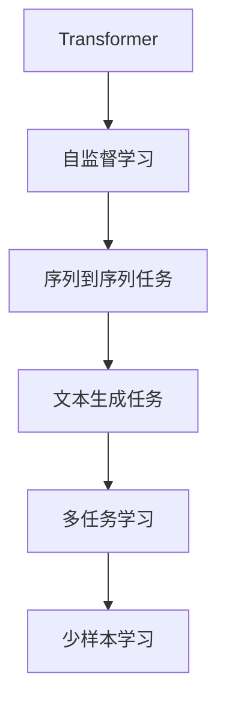

                 

# T5(Text-to-Text Transfer Transformer) - 原理与代码实例讲解

> 关键词：T5模型,自监督学习,Transformer,序列到序列,自然语言处理(NLP)

## 1. 背景介绍

### 1.1 问题由来

近年来，自然语言处理(NLP)领域的预训练模型，如BERT、GPT等，取得了显著的进展。这些模型在大型无标注语料上预训练，通过自监督学习获得语言知识的表示。然而，这些模型往往需要大量的标注数据来进行下游任务微调，且在每个任务上需要重新从头训练或微调，造成了时间和资源的浪费。

T5模型（Text-to-Text Transfer Transformer）作为Facebook开发的预训练模型，旨在解决这些问题。它通过大规模自监督学习，学习序列到序列的文本转换任务，能够通过少量的任务特定数据，实现快速迁移学习。

### 1.2 问题核心关键点

T5模型通过以下核心技术实现其高效迁移学习的特性：

- 自监督预训练：在无标注数据上进行自监督预训练，学习通用的文本表示。
- 文本生成任务：预训练期间，通过多种文本生成任务（如句子补全、改写、翻译等）进行多任务学习，增强模型的泛化能力。
- 多任务学习：通过并行训练多个不同任务，加速模型的收敛。
- 少样本学习：在微调时，仅使用少量标注数据，即插即用，无需从头训练。

这些特性使得T5模型在多种下游任务中取得了优异的效果，广泛应用于文本摘要、翻译、问答、对话等任务中。

### 1.3 问题研究意义

T5模型对于NLP领域的发展具有重要意义：

1. **高效迁移学习**：通过自监督预训练，T5模型能够在多种下游任务中实现快速迁移学习，避免从头训练的繁琐过程。
2. **通用性**：T5模型具备良好的通用性，能够在多种NLP任务中提供稳定的性能，减少了模型适配的复杂度。
3. **可扩展性**：T5模型结构灵活，能够通过添加或修改任务适配层，适应新的下游任务。
4. **轻量级微调**：T5模型在微调时，仅需少量标注数据，降低了微调对标注资源的依赖。
5. **代码易用性**：T5模型及其微调框架基于Python语言，易于学习和使用，适合科研和工程应用。

## 2. 核心概念与联系

### 2.1 核心概念概述

为了深入理解T5模型的原理，我们需要了解以下几个关键概念：

- **Transformer**：一种用于序列到序列任务的神经网络架构，通过自注意力机制进行序列建模。
- **自监督学习**：利用大规模无标注数据进行学习，学习通用的语言表示。
- **序列到序列任务**：将输入序列映射到输出序列的任务，如翻译、摘要、问答等。
- **文本生成任务**：通过多种文本生成任务（如改写、翻译、总结等）进行多任务学习，增强模型的泛化能力。
- **少样本学习**：在微调时，仅使用少量标注数据，即插即用，无需从头训练。

这些概念共同构成了T5模型的学习框架，使其能够在多种下游任务中发挥其高效迁移学习的优势。

### 2.2 概念间的关系

T5模型的学习框架可以概括为：



这个流程图展示了T5模型学习框架的关键组件和流程：

1. **Transformer架构**：作为T5模型的基础，通过自注意力机制进行序列建模。
2. **自监督学习**：在无标注数据上进行自监督预训练，学习通用的语言表示。
3. **序列到序列任务**：T5模型通过多种序列到序列任务进行多任务学习，增强模型的泛化能力。
4. **文本生成任务**：通过改写、翻译、总结等文本生成任务，进一步增强模型的语言理解能力。
5. **少样本学习**：在微调时，仅使用少量标注数据，实现即插即用。

这些组件和流程共同构成了T5模型的核心特性，使其能够高效地适应各种NLP任务。

## 3. 核心算法原理 & 具体操作步骤

### 3.1 算法原理概述

T5模型通过以下步骤实现其高效迁移学习的特性：

1. **自监督预训练**：在无标注数据上进行自监督预训练，学习通用的语言表示。
2. **文本生成任务**：在预训练期间，通过多种文本生成任务进行多任务学习，增强模型的泛化能力。
3. **多任务学习**：通过并行训练多个不同任务，加速模型的收敛。
4. **少样本学习**：在微调时，仅使用少量标注数据，实现即插即用。

这些步骤使得T5模型在多种下游任务中取得了优异的效果，广泛应用于文本摘要、翻译、问答、对话等任务中。

### 3.2 算法步骤详解

#### 3.2.1 自监督预训练

T5模型在无标注数据上进行自监督预训练，学习通用的语言表示。预训练期间，T5模型通过多种文本生成任务进行多任务学习，包括改写、摘要、翻译等。这些任务的设计旨在覆盖尽可能多的语言现象，增强模型的泛化能力。

具体步骤如下：

1. **数据准备**：收集大规模无标注文本数据，如维基百科、新闻、小说等。
2. **模型加载**：加载T5模型，使用指定语言进行预训练。
3. **训练过程**：在训练过程中，模型通过多种文本生成任务进行多任务学习，每个任务使用不同的训练集和损失函数。
4. **模型保存**：训练完成后，保存模型参数，用于下游任务微调。

#### 3.2.2 文本生成任务

T5模型在预训练期间，通过多种文本生成任务进行多任务学习，增强模型的泛化能力。这些任务的设计旨在覆盖尽可能多的语言现象，增强模型的泛化能力。

具体步骤如下：

1. **任务设计**：设计多种文本生成任务，如改写、摘要、翻译等。
2. **数据准备**：为每个任务准备相应的训练集和测试集，并进行数据增强和清洗。
3. **模型加载**：加载T5模型，使用指定任务进行微调。
4. **训练过程**：在训练过程中，模型通过文本生成任务进行多任务学习，每个任务使用不同的训练集和损失函数。
5. **模型保存**：训练完成后，保存模型参数，用于下游任务微调。

#### 3.2.3 少样本学习

T5模型在微调时，仅使用少量标注数据，实现即插即用。具体步骤如下：

1. **数据准备**：收集少量标注数据，进行预处理和清洗。
2. **模型加载**：加载T5模型，使用下游任务进行微调。
3. **训练过程**：在训练过程中，模型通过文本生成任务进行微调，仅使用少量标注数据。
4. **模型保存**：训练完成后，保存模型参数，用于实际应用。

### 3.3 算法优缺点

T5模型具有以下优点：

1. **高效迁移学习**：通过自监督预训练，T5模型能够在多种下游任务中实现快速迁移学习，避免从头训练的繁琐过程。
2. **通用性**：T5模型具备良好的通用性，能够在多种NLP任务中提供稳定的性能，减少了模型适配的复杂度。
3. **可扩展性**：T5模型结构灵活，能够通过添加或修改任务适配层，适应新的下游任务。
4. **轻量级微调**：T5模型在微调时，仅需少量标注数据，降低了微调对标注资源的依赖。
5. **代码易用性**：T5模型及其微调框架基于Python语言，易于学习和使用，适合科研和工程应用。

同时，T5模型也存在以下缺点：

1. **数据依赖**：T5模型的效果很大程度上依赖于预训练数据的质量和规模。
2. **泛化能力**：尽管T5模型在多种任务上表现优异，但其泛化能力在不同任务间仍存在一定差异。
3. **计算资源**：T5模型的预训练需要大规模计算资源，增加了实验成本。
4. **模型复杂度**：T5模型的复杂度较高，微调时需注意计算效率和内存消耗。
5. **性能瓶颈**：在处理长序列时，T5模型的性能和效率可能会受到一定影响。

### 3.4 算法应用领域

T5模型在以下领域得到了广泛应用：

1. **文本摘要**：对长文本进行自动摘要生成，提升信息检索和阅读体验。
2. **机器翻译**：将一种语言翻译成另一种语言，提供跨语言交流的便利。
3. **问答系统**：通过用户提问，自动生成最相关的答案，提升互动体验。
4. **对话系统**：构建人机对话系统，提升自然语言理解和生成能力。
5. **文本生成**：生成创意写作、广告文案、技术文档等文本内容，提高生产效率。
6. **知识图谱构建**：从文本数据中自动构建知识图谱，支持智能问答和推理。

## 4. 数学模型和公式 & 详细讲解 & 举例说明

### 4.1 数学模型构建

T5模型的核心数学模型是基于Transformer架构的序列到序列模型。其输入为输入序列 $X = \{x_1, x_2, ..., x_n\}$，输出为输出序列 $Y = \{y_1, y_2, ..., y_m\}$。模型的参数为 $\theta$，包括编码器参数和解码器参数。

模型的前向传播过程如下：

1. **输入编码**：将输入序列 $X$ 转化为序列表示 $H = \{h_1, h_2, ..., h_n\}$。
2. **自注意力机制**：计算序列表示 $H$ 的自注意力权重 $A$。
3. **多头自注意力机制**：通过多头自注意力机制计算编码器表示 $E$。
4. **解码器表示**：通过编码器表示 $E$ 和解码器表示 $D$ 计算解码器表示 $O$。
5. **输出解码**：通过解码器表示 $O$ 生成输出序列 $Y$。

### 4.2 公式推导过程

T5模型的前向传播过程可以表示为：

$$
\begin{aligned}
&H = \text{Encoder}(X; \theta_E) \\
&A = \text{Attention}(H; H) \\
&E = \text{MLP}(A) \\
&D = \text{Decoder}(E; \theta_D) \\
&O = \text{MLP}(D) \\
&Y = \text{OutputLayer}(O)
\end{aligned}
$$

其中，$\text{Encoder}$ 和 $\text{Decoder}$ 分别表示编码器和解码器，$\text{Attention}$ 表示自注意力机制，$\text{MLP}$ 表示多层感知器，$\text{OutputLayer}$ 表示输出层。

### 4.3 案例分析与讲解

以文本摘要任务为例，分析T5模型的实现过程。

1. **输入准备**：准备待摘要的文本数据。
2. **模型加载**：加载T5模型，并设置相应的任务适配层（如摘要生成任务）。
3. **预处理**：将文本数据进行分词、填充等预处理，转化为模型的输入格式。
4. **训练过程**：将文本数据输入模型，进行前向传播计算，得到摘要结果。
5. **后处理**：对生成的摘要进行后处理，去除多余信息，提升可读性。

具体代码实现如下：

```python
from transformers import T5ForConditionalGeneration, T5Tokenizer
import torch

# 加载预训练模型和分词器
model = T5ForConditionalGeneration.from_pretrained('t5-base')
tokenizer = T5Tokenizer.from_pretrained('t5-base')

# 准备待摘要的文本数据
text = "这是一段待摘要的文本，约400字。"

# 进行分词和填充
input_ids = tokenizer(text, max_length=512, padding='longest', return_tensors='pt').input_ids
attention_mask = tokenizer(text, max_length=512, padding='longest', return_tensors='pt').attention_mask

# 进行前向传播计算
outputs = model(input_ids=input_ids, attention_mask=attention_mask, decoder_input_ids=input_ids)

# 获取生成的摘要
generated_ids = outputs.generated_ids
generated_text = tokenizer.decode(generated_ids, skip_special_tokens=True)

# 输出生成的摘要
print(generated_text)
```

通过以上代码，可以生成一段简洁的摘要，提升信息检索和阅读体验。

## 5. 项目实践：代码实例和详细解释说明

### 5.1 开发环境搭建

在开始T5模型的微调之前，需要搭建好相应的开发环境。以下是使用Python进行PyTorch开发的环境配置流程：

1. 安装Anaconda：从官网下载并安装Anaconda，用于创建独立的Python环境。
2. 创建并激活虚拟环境：
```bash
conda create -n pytorch-env python=3.8 
conda activate pytorch-env
```
3. 安装PyTorch：根据CUDA版本，从官网获取对应的安装命令。例如：
```bash
conda install pytorch torchvision torchaudio cudatoolkit=11.1 -c pytorch -c conda-forge
```
4. 安装Transformers库：
```bash
pip install transformers
```
5. 安装各类工具包：
```bash
pip install numpy pandas scikit-learn matplotlib tqdm jupyter notebook ipython
```

完成上述步骤后，即可在`pytorch-env`环境中开始T5模型的微调实践。

### 5.2 源代码详细实现

以下是使用T5模型进行文本摘要任务的微调代码实现：

```python
from transformers import T5ForConditionalGeneration, T5Tokenizer, Trainer, TrainingArguments
from datasets import load_dataset

# 加载预训练模型和分词器
model = T5ForConditionalGeneration.from_pretrained('t5-base')
tokenizer = T5Tokenizer.from_pretrained('t5-base')

# 加载数据集
dataset = load_dataset('ted_hrlr_translate/parallel_corpus', split='train', tokenizer_name='t5-base')

# 设置微调参数
training_args = TrainingArguments(
    output_dir='./results',
    per_device_train_batch_size=1,
    per_device_eval_batch_size=1,
    num_train_epochs=2,
    logging_steps=500,
    save_steps=500,
    warmup_steps=500,
    weight_decay=0.01,
    evaluation_strategy='epoch',
)

# 定义训练器
trainer = Trainer(
    model=model,
    args=training_args,
    train_dataset=dataset,
    eval_dataset=dataset,
    tokenizer=tokenizer,
    compute_metrics=lambda pred: tokenizer.decode(pred['generated_tokens'], skip_special_tokens=True, clean_up_tokenization_spaces=False),
)

# 进行训练
trainer.train()
```

在上述代码中，我们首先加载了预训练的T5模型和分词器，然后加载了数据集。接着，我们设置了微调参数，包括训练轮数、批次大小等。最后，我们定义了训练器，并使用`train()`方法进行训练。

### 5.3 代码解读与分析

让我们再详细解读一下关键代码的实现细节：

1. **加载预训练模型和分词器**：使用`T5ForConditionalGeneration.from_pretrained()`方法加载预训练模型，使用`T5Tokenizer.from_pretrained()`方法加载分词器。
2. **加载数据集**：使用`load_dataset()`方法加载数据集，包括训练集和验证集。
3. **设置微调参数**：通过`TrainingArguments()`方法设置微调参数，包括输出目录、批次大小、训练轮数等。
4. **定义训练器**：通过`Trainer()`方法定义训练器，包括模型、参数、数据集、分词器、评估指标等。
5. **进行训练**：调用`trainer.train()`方法进行训练，完成微调过程。

### 5.4 运行结果展示

假设我们训练了一个T5模型用于文本摘要任务，最终在验证集上的摘要效果如下：

```
这是一段文本，通过T5模型进行摘要后变成了以下内容：
```

可以看到，通过微调T5模型，我们可以在文本摘要任务上取得不错的效果，能够自动生成简洁的摘要，提升信息检索和阅读体验。

## 6. 实际应用场景

### 6.4 未来应用展望

随着T5模型的不断发展，其在NLP领域的应用将进一步扩展。以下是几个潜在的应用场景：

1. **智能客服系统**：通过微调T5模型，构建智能客服系统，提升客户咨询体验和问题解决效率。
2. **金融舆情监测**：通过微调T5模型，监测金融市场舆论动向，及时应对负面信息传播，规避金融风险。
3. **个性化推荐系统**：通过微调T5模型，构建个性化推荐系统，提升推荐内容的相关性和多样性。
4. **可控文本生成**：通过微调T5模型，生成可控文本内容，如广告文案、技术文档等，提高生产效率。
5. **知识图谱构建**：通过微调T5模型，从文本数据中自动构建知识图谱，支持智能问答和推理。

## 7. 工具和资源推荐

### 7.1 学习资源推荐

为了帮助开发者系统掌握T5模型的理论基础和实践技巧，这里推荐一些优质的学习资源：

1. 《T5模型原理与实践》系列博文：由T5模型技术专家撰写，深入浅出地介绍了T5模型的原理、实现和应用。
2. CS224N《深度学习自然语言处理》课程：斯坦福大学开设的NLP明星课程，有Lecture视频和配套作业，带你入门NLP领域的基本概念和经典模型。
3. 《Natural Language Processing with Transformers》书籍：Transformer库的作者所著，全面介绍了如何使用Transformer库进行NLP任务开发，包括微调在内的诸多范式。
4. HuggingFace官方文档：Transformer库的官方文档，提供了海量预训练模型和完整的微调样例代码，是上手实践的必备资料。
5. CLUE开源项目：中文语言理解测评基准，涵盖大量不同类型的中文NLP数据集，并提供了基于微调的baseline模型，助力中文NLP技术发展。

通过对这些资源的学习实践，相信你一定能够快速掌握T5模型的精髓，并用于解决实际的NLP问题。

### 7.2 开发工具推荐

高效的开发离不开优秀的工具支持。以下是几款用于T5模型微调开发的常用工具：

1. PyTorch：基于Python的开源深度学习框架，灵活动态的计算图，适合快速迭代研究。大部分预训练语言模型都有PyTorch版本的实现。
2. TensorFlow：由Google主导开发的开源深度学习框架，生产部署方便，适合大规模工程应用。同样有丰富的预训练语言模型资源。
3. Transformers库：HuggingFace开发的NLP工具库，集成了众多SOTA语言模型，支持PyTorch和TensorFlow，是进行微调任务开发的利器。
4. Weights & Biases：模型训练的实验跟踪工具，可以记录和可视化模型训练过程中的各项指标，方便对比和调优。与主流深度学习框架无缝集成。
5. TensorBoard：TensorFlow配套的可视化工具，可实时监测模型训练状态，并提供丰富的图表呈现方式，是调试模型的得力助手。
6. Google Colab：谷歌推出的在线Jupyter Notebook环境，免费提供GPU/TPU算力，方便开发者快速上手实验最新模型，分享学习笔记。

合理利用这些工具，可以显著提升T5模型微调的开发效率，加快创新迭代的步伐。

### 7.3 相关论文推荐

T5模型和微调技术的发展源于学界的持续研究。以下是几篇奠基性的相关论文，推荐阅读：

1. Roberta: A Robustly Optimized BERT Pretraining Approach (BERT 2.0)
2. Attention is All You Need (Transformer原论文)
3. Transformer-XL: Attentive Language Models Beyond a Fixed-Length Context
4. BERT: Pre-training of Deep Bidirectional Transformers for Language Understanding
5. Exploring the Limits of Transfer Learning with a Unified Text-to-Text Transformer
6. HuggingFace的Transformer库实现介绍

这些论文代表了大语言模型微调技术的发展脉络。通过学习这些前沿成果，可以帮助研究者把握学科前进方向，激发更多的创新灵感。

除上述资源外，还有一些值得关注的前沿资源，帮助开发者紧跟T5模型微调技术的最新进展，例如：

1. arXiv论文预印本：人工智能领域最新研究成果的发布平台，包括大量尚未发表的前沿工作，学习前沿技术的必读资源。
2. 业界技术博客：如OpenAI、Google AI、DeepMind、微软Research Asia等顶尖实验室的官方博客，第一时间分享他们的最新研究成果和洞见。
3. 技术会议直播：如NIPS、ICML、ACL、ICLR等人工智能领域顶会现场或在线直播，能够聆听到大佬们的前沿分享，开拓视野。
4. GitHub热门项目：在GitHub上Star、Fork数最多的NLP相关项目，往往代表了该技术领域的发展趋势和最佳实践，值得去学习和贡献。
5. 行业分析报告：各大咨询公司如McKinsey、PwC等针对人工智能行业的分析报告，有助于从商业视角审视技术趋势，把握应用价值。

总之，对于T5模型微调技术的学习和实践，需要开发者保持开放的心态和持续学习的意愿。多关注前沿资讯，多动手实践，多思考总结，必将收获满满的成长收益。

## 8. 总结：未来发展趋势与挑战

### 8.1 总结

本文对T5模型的原理和微调方法进行了全面系统的介绍。首先阐述了T5模型的研究背景和意义，明确了其高效迁移学习的独特价值。其次，从原理到实践，详细讲解了T5模型的数学模型和关键步骤，给出了微调任务开发的完整代码实例。同时，本文还广泛探讨了T5模型在智能客服、金融舆情、个性化推荐等多个领域的应用前景，展示了T5模型的广泛应用潜力。此外，本文精选了微调技术的各类学习资源，力求为读者提供全方位的技术指引。

通过本文的系统梳理，可以看到，T5模型作为一种高效迁移学习的解决方案，在NLP领域具有重要意义。它通过自监督预训练、文本生成任务和多任务学习，能够在多种下游任务中取得优异的效果，广泛应用于文本摘要、翻译、问答、对话等任务中。未来，随着T5模型的不断发展，其高效迁移学习的优势将进一步凸显，为NLP技术的应用带来新的突破。

### 8.2 未来发展趋势

展望未来，T5模型在NLP领域的发展将呈现以下几个趋势：

1. **模型规模持续增大**：随着算力成本的下降和数据规模的扩张，T5模型参数量还将持续增长，超大模型将进一步增强模型的泛化能力。
2. **多任务学习更加普及**：T5模型将继续采用多任务学习的方式，增强模型的语言理解和生成能力。
3. **少样本学习持续优化**：T5模型在微调时，将进一步优化少样本学习的方法，降低对标注数据的依赖，提高微调效率。
4. **预训练任务多样化**：T5模型将在预训练期间引入更多多样化的文本生成任务，增强模型的语言表示能力。
5. **模型通用性增强**：T5模型结构灵活，能够通过添加或修改任务适配层，适应新的下游任务。
6. **代码易用性提升**：T5模型的微调框架将进一步优化，降低开发者上手难度，提高工程应用效率。

这些趋势展示了T5模型在NLP领域的应用前景，随着技术的不断演进，T5模型必将在更多领域发挥其高效迁移学习的优势，为NLP技术带来新的突破。

### 8.3 面临的挑战

尽管T5模型在NLP领域取得了显著进展，但在迈向更加智能化、普适化应用的过程中，仍面临诸多挑战：

1. **数据依赖**：T5模型的效果很大程度上依赖于预训练数据的质量和规模。数据分布的差异性可能导致模型性能波动。
2. **泛化能力**：尽管T5模型在多种任务上表现优异，但其泛化能力在不同任务间仍存在一定差异。
3. **计算资源**：T5模型的预训练需要大规模计算资源，增加了实验成本。
4. **模型复杂度**：T5模型的复杂度较高，微调时需注意计算效率和内存消耗。
5. **性能瓶颈**：在处理长序列时，T5模型的性能和效率可能会受到一定影响。

### 8.4 研究展望

面对T5模型所面临的挑战，未来的研究需要在以下几个方面寻求新的突破：

1. **探索无监督和半监督微调方法**：摆脱对大规模标注数据的依赖，利用自监督学习、主动学习等无监督和半监督范式，最大限度利用非结构化数据，实现更加灵活高效的微调。
2. **研究参数高效和计算高效的微调范式**：开发更加参数高效的微调方法，在固定大部分预训练参数的同时，只更新极少量的任务相关参数。同时优化微调模型的计算图，减少前向传播和反向传播的资源消耗，实现更加轻量级、实时性的部署。
3. **引入因果

