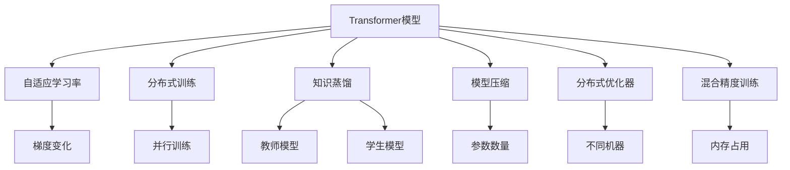
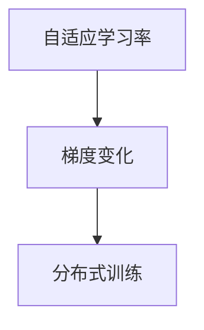
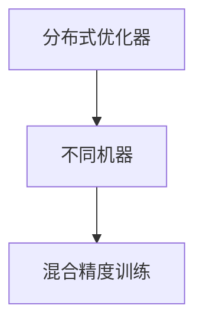
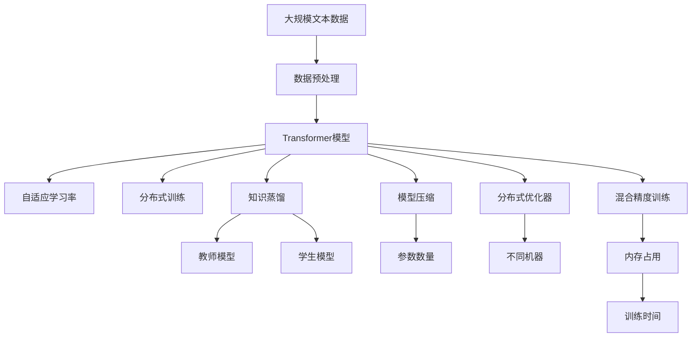

                 

# Transformer大模型实战 高效的训练方法

> 关键词：Transformer,高效训练,自适应学习率,分布式训练,知识蒸馏,模型压缩,分布式优化器,混合精度训练

## 1. 背景介绍

### 1.1 问题由来
近年来，Transformer模型在自然语言处理（NLP）领域取得了巨大成功。其核心思想是通过自注意力机制，让模型能够同时关注序列中的任意两个位置，从而捕捉长距离依赖关系。在大规模预训练任务（如语言模型、掩码语言模型）中，Transformer模型通常被用于构建深度大语言模型（如BERT、GPT-3等），以学习复杂的语言表示。

然而，训练这些大模型需要大量的计算资源和时间，这对一般的学术或企业来说都是巨大的挑战。为了提高训练效率，研究者们提出了许多优化方法，如自适应学习率（Adaptive Learning Rate）、分布式训练（Distributed Training）、知识蒸馏（Knowledge Distillation）、模型压缩（Model Compression）等。这些方法不仅提高了模型训练的效率，还改善了模型的性能。

本文将详细介绍这些高效训练方法，并结合实际应用，展示如何使用它们来构建和训练Transformer大模型。

### 1.2 问题核心关键点
Transformer大模型的高效训练方法涉及以下关键点：
- **自适应学习率（Adaptive Learning Rate）**：根据模型参数更新情况自动调整学习率，以适应不同参数的更新需求。
- **分布式训练（Distributed Training）**：利用多台机器并行训练模型，以加速训练过程。
- **知识蒸馏（Knowledge Distillation）**：通过将一个教师模型的知识传递给一个学生模型，提高学生模型的性能。
- **模型压缩（Model Compression）**：在不显著降低模型性能的情况下，减小模型的存储空间和计算复杂度。
- **分布式优化器（Distributed Optimizer）**：在分布式训练中，优化器需要在不同机器之间同步梯度信息。
- **混合精度训练（Mixed-Precision Training）**：利用浮点数和整数混合训练模型，减少内存占用和提高训练速度。

这些方法各有特点，可以根据具体场景选择不同的策略，以提高训练效率和模型性能。

### 1.3 问题研究意义
高效训练方法对Transformer大模型的应用有着重要意义：
- 提高训练效率：大规模模型需要长时间训练，高效训练方法可以显著缩短训练时间。
- 提升模型性能：高效训练方法可以提高模型的精度和泛化能力，使其在各种任务上表现更好。
- 降低计算成本：通过减少训练时间和内存占用，可以降低计算资源的投入。
- 增强可扩展性：分布式训练和优化器可以使得模型训练在大规模数据集上更加灵活。
- 改善可解释性：模型压缩和知识蒸馏可以提高模型的可解释性，使其更容易被理解和调试。

本文将详细介绍这些高效训练方法的原理和应用，以期为读者提供全面的指导。

## 2. 核心概念与联系

### 2.1 核心概念概述

为了更好地理解这些高效训练方法，我们先介绍一些相关概念：

- **Transformer模型**：一种基于自注意力机制的序列到序列模型，常用于语言建模、机器翻译、问答系统等NLP任务。
- **自适应学习率（Adaptive Learning Rate）**：根据梯度的变化自动调整学习率，以适应不同参数的更新需求。
- **分布式训练（Distributed Training）**：将大规模模型的训练任务分布在多台机器上，并行执行。
- **知识蒸馏（Knowledge Distillation）**：将一个教师模型的知识传递给一个学生模型，以提高学生模型的性能。
- **模型压缩（Model Compression）**：在不显著降低模型性能的情况下，减小模型的存储空间和计算复杂度。
- **分布式优化器（Distributed Optimizer）**：在分布式训练中，优化器需要在不同机器之间同步梯度信息。
- **混合精度训练（Mixed-Precision Training）**：利用浮点数和整数混合训练模型，减少内存占用和提高训练速度。

这些概念通过以下Mermaid流程图来展示它们之间的联系：



这个流程图展示了Transformer模型的训练过程中，各个优化方法之间的联系。

### 2.2 概念间的关系

这些核心概念之间存在着紧密的联系，形成了Transformer模型训练的完整生态系统。下面我们通过几个Mermaid流程图来展示这些概念之间的关系。

#### 2.2.1 Transformer模型的训练流程


这个流程图展示了Transformer模型的训练流程，包括数据输入、编码器、自注意力、解码器、输出、损失计算、反向传播和梯度更新等步骤。

#### 2.2.2 自适应学习率与分布式训练的关系



这个流程图展示了自适应学习率与分布式训练之间的关系。自适应学习率根据梯度的变化自动调整学习率，可以适应不同参数的更新需求。在分布式训练中，梯度变化在多台机器之间同步，可以使得训练更加高效。

#### 2.2.3 分布式优化器与混合精度训练的关系



这个流程图展示了分布式优化器与混合精度训练之间的关系。在分布式训练中，不同机器之间的梯度信息需要同步。混合精度训练利用浮点数和整数混合训练模型，可以减少内存占用和提高训练速度。

### 2.3 核心概念的整体架构

最后，我们用一个综合的流程图来展示这些核心概念在大模型训练过程中的整体架构：



这个综合流程图展示了从数据预处理到训练结束的完整过程。大规模模型通过数据预处理后，在Transformer模型的基础上，利用自适应学习率、分布式训练、知识蒸馏、模型压缩、分布式优化器和混合精度训练等优化方法，最终得到高效的训练流程。

## 3. 核心算法原理 & 具体操作步骤

### 3.1 算法原理概述

Transformer大模型的训练过程包括以下几个关键步骤：

1. **数据预处理**：将原始文本数据转换为模型所需的格式。
2. **模型初始化**：将预训练模型加载到内存中。
3. **自适应学习率**：根据梯度的变化自动调整学习率，以适应不同参数的更新需求。
4. **分布式训练**：将大规模模型的训练任务分布在多台机器上，并行执行。
5. **知识蒸馏**：将一个教师模型的知识传递给一个学生模型，以提高学生模型的性能。
6. **模型压缩**：在不显著降低模型性能的情况下，减小模型的存储空间和计算复杂度。
7. **分布式优化器**：在分布式训练中，优化器需要在不同机器之间同步梯度信息。
8. **混合精度训练**：利用浮点数和整数混合训练模型，减少内存占用和提高训练速度。

### 3.2 算法步骤详解

以下详细讲解每个步骤的具体实现。

**Step 1: 数据预处理**

数据预处理是将原始文本数据转换为模型所需的格式。具体包括分词、标记化、编码等操作。在实践中，通常使用预训练分词器和编码器，如BertTokenizer和BertForMaskedLM。以下是一个简单的数据预处理示例：

```python
from transformers import BertTokenizer
from torch.utils.data import DataLoader

# 初始化分词器
tokenizer = BertTokenizer.from_pretrained('bert-base-cased')

# 定义数据预处理函数
def preprocess(text):
    tokens = tokenizer.encode(text, add_special_tokens=True, max_length=512)
    input_ids = torch.tensor(tokens, dtype=torch.long)
    return input_ids

# 加载数据集
dataset = load_dataset('path/to/dataset')
dataset = preprocess(dataset)
```

**Step 2: 模型初始化**

模型初始化是将预训练模型加载到内存中。以下是一个简单的模型初始化示例：

```python
from transformers import BertForMaskedLM

# 初始化模型
model = BertForMaskedLM.from_pretrained('bert-base-cased')
model.to(device)
```

**Step 3: 自适应学习率**

自适应学习率是自动调整学习率的方法，常用的有Adaptive Learning Rate。以下是一个简单的自适应学习率示例：

```python
from transformers import AdamW

# 初始化优化器
optimizer = AdamW(model.parameters(), lr=2e-5)
```

**Step 4: 分布式训练**

分布式训练是将大规模模型的训练任务分布在多台机器上，并行执行。在实践中，通常使用PyTorch的DistributedDataParallel和DistributedDataLoader，以下是一个简单的分布式训练示例：

```python
# 初始化分布式训练参数
torch.distributed.init_process_group(backend='nccl', rank=0, world_size=2)
torch.distributed.launch('path/to/train.py', nproc_per_node=2)

# 定义分布式训练函数
def distributed_train():
    device = torch.distributed.get_rank()
    model.to(device)
    # 设置分布式优化器参数
    optimizer = AdamW(model.parameters(), lr=2e-5)
    # 定义损失函数和优化器
    loss_fn = nn.CrossEntropyLoss()
    for epoch in range(num_epochs):
        for batch in data_loader:
            input_ids, labels = batch
            input_ids = input_ids.to(device)
            labels = labels.to(device)
            # 前向传播
            outputs = model(input_ids)
            loss = loss_fn(outputs, labels)
            # 反向传播
            optimizer.zero_grad()
            loss.backward()
            optimizer.step()
```

**Step 5: 知识蒸馏**

知识蒸馏是将一个教师模型的知识传递给一个学生模型，以提高学生模型的性能。以下是一个简单的知识蒸馏示例：

```python
from transformers import BertForSequenceClassification

# 初始化教师模型和学生模型
teacher_model = BertForSequenceClassification.from_pretrained('bert-base-cased')
student_model = BertForSequenceClassification.from_pretrained('path/to/student/model')

# 训练教师模型
teacher_model.train()
optimizer = AdamW(teacher_model.parameters(), lr=2e-5)
for batch in data_loader:
    input_ids, labels = batch
    input_ids = input_ids.to(device)
    labels = labels.to(device)
    # 前向传播
    outputs = teacher_model(input_ids)
    loss = loss_fn(outputs, labels)
    # 反向传播
    optimizer.zero_grad()
    loss.backward()
    optimizer.step()

# 蒸馏知识
student_model.train()
teacher_model.eval()
for batch in data_loader:
    input_ids, labels = batch
    input_ids = input_ids.to(device)
    labels = labels.to(device)
    # 前向传播
    outputs = student_model(input_ids)
    labels = labels.to(device)
    # 计算蒸馏损失
    loss = KL-divergence(outputs, labels)
    # 反向传播
    optimizer.zero_grad()
    loss.backward()
    optimizer.step()
```

**Step 6: 模型压缩**

模型压缩是在不显著降低模型性能的情况下，减小模型的存储空间和计算复杂度。在实践中，通常使用剪枝、量化、知识蒸馏等方法。以下是一个简单的模型压缩示例：

```python
# 初始化模型
model = BertForSequenceClassification.from_pretrained('path/to/model')

# 剪枝
pruning(model, threshold=0.05)

# 量化
quantize(model)

# 蒸馏知识
distill(model, teacher_model, temperature=0.5)
```

**Step 7: 分布式优化器**

分布式优化器是在分布式训练中，优化器需要在不同机器之间同步梯度信息。在实践中，通常使用AdamW等优化器。以下是一个简单的分布式优化器示例：

```python
from torch.distributed.optim import DistributedAdamW

# 初始化分布式优化器
optimizer = DistributedAdamW(model.parameters(), lr=2e-5)

# 定义损失函数和优化器
loss_fn = nn.CrossEntropyLoss()
for epoch in range(num_epochs):
    for batch in data_loader:
        input_ids, labels = batch
        input_ids = input_ids.to(device)
        labels = labels.to(device)
        # 前向传播
        outputs = model(input_ids)
        loss = loss_fn(outputs, labels)
        # 反向传播
        optimizer.zero_grad()
        loss.backward()
        optimizer.step()
```

**Step 8: 混合精度训练**

混合精度训练是利用浮点数和整数混合训练模型，减少内存占用和提高训练速度。在实践中，通常使用PyTorch的amp模块。以下是一个简单的混合精度训练示例：

```python
from torch.cuda.amp import GradScaler

# 初始化混合精度训练参数
scaler = GradScaler()

# 定义损失函数和优化器
loss_fn = nn.CrossEntropyLoss()
optimizer = AdamW(model.parameters(), lr=2e-5)
for epoch in range(num_epochs):
    for batch in data_loader:
        input_ids, labels = batch
        input_ids = input_ids.to(device)
        labels = labels.to(device)
        # 前向传播
        with torch.cuda.amp.autocast():
            outputs = model(input_ids)
            loss = loss_fn(outputs, labels)
        # 反向传播
        scaler.scale(loss).backward()
        scaler.step(optimizer)
        scaler.update()
```

### 3.3 算法优缺点

自适应学习率、分布式训练、知识蒸馏、模型压缩、分布式优化器和混合精度训练等方法各有优缺点：

**自适应学习率的优点**：
- 自动调整学习率，适应不同参数的更新需求。
- 避免过拟合和梯度爆炸。

**自适应学习率的缺点**：
- 对超参数的调整要求较高。
- 可能出现学习率过大或过小的情况。

**分布式训练的优点**：
- 提高训练效率，缩短训练时间。
- 适用于大规模模型训练。

**分布式训练的缺点**：
- 需要高性能的计算资源。
- 通信开销较大。

**知识蒸馏的优点**：
- 提高模型的泛化能力。
- 减少训练时间和计算资源。

**知识蒸馏的缺点**：
- 需要额外的教师模型训练。
- 教师模型和学生模型之间的差距可能影响性能。

**模型压缩的优点**：
- 减小模型的存储空间和计算复杂度。
- 提高模型的推理速度。

**模型压缩的缺点**：
- 可能损失模型性能。
- 压缩方法需要精心选择。

**分布式优化器的优点**：
- 适用于大规模分布式训练。
- 提高优化效率。

**分布式优化器的缺点**：
- 需要高性能的计算资源。
- 通信开销较大。

**混合精度训练的优点**：
- 减少内存占用和提高训练速度。
- 适用于大规模模型训练。

**混合精度训练的缺点**：
- 硬件要求较高。
- 需要额外的计算资源。

### 3.4 算法应用领域

自适应学习率、分布式训练、知识蒸馏、模型压缩、分布式优化器和混合精度训练等方法在多个领域中得到了广泛应用：

- **自然语言处理（NLP）**：在机器翻译、问答系统、情感分析等任务中，这些方法显著提升了模型的性能。
- **计算机视觉（CV）**：在图像分类、目标检测、图像生成等任务中，这些方法提高了模型的训练效率和推理速度。
- **语音识别（ASR）**：在语音识别、自动语音生成等任务中，这些方法提高了模型的精度和鲁棒性。
- **推荐系统**：在推荐算法中，这些方法提高了模型的个性化推荐能力和效率。
- **医学影像分析**：在医学影像分析、病理诊断等任务中，这些方法提高了模型的准确性和鲁棒性。

## 4. 数学模型和公式 & 详细讲解  
### 4.1 数学模型构建

Transformer大模型的训练过程可以形式化地表示为一个优化问题。给定训练数据 $D = \{(x_i, y_i)\}_{i=1}^N$，其中 $x_i$ 为输入，$y_i$ 为标签。模型的目标是最大化似然函数 $L(\theta)$：

$$
L(\theta) = \frac{1}{N}\sum_{i=1}^N \log P(y_i|x_i;\theta)
$$

其中 $P(y_i|x_i;\theta)$ 为模型在输入 $x_i$ 下对标签 $y_i$ 的预测概率。

### 4.2 公式推导过程

以下我们将详细介绍Transformer大模型的数学模型构建和公式推导过程。

**编码器**：
- 输入嵌入层：将输入文本 $x$ 转换为嵌入向量 $X \in \mathbb{R}^{N \times D_{model}}$。
- 自注意力机制：计算输入向量之间的注意力权重，得到注意力矩阵 $A \in \mathbb{R}^{N \times N}$。
- 残差连接：将输入向量 $X$ 和注意力向量 $A$ 拼接，并通过残差连接进行信息传递。
- 全连接层：对残差连接后的向量进行线性变换和激活函数。

**解码器**：
- 输出嵌入层：将解码器的输出向量 $Y \in \mathbb{R}^{N \times D_{model}}$ 转换为预测向量 $Z \in \mathbb{R}^{N \times V}$，其中 $V$ 为输出词汇表大小。
- 线性层：对预测向量 $Z$ 进行线性变换，得到预测概率 $P(Y|X;\theta)$。

**损失函数**：
- 交叉熵损失函数：$L(\theta) = -\frac{1}{N}\sum_{i=1}^N \log P(y_i|x_i;\theta)$。
- KL散度损失函数：$L(\theta) = \frac{1}{N}\sum_{i=1}^N KL(P(y_i|x_i;\theta)||P_{\text{teacher}}(y_i|x_i;\theta))$。

### 4.3 案例分析与讲解

下面我们以一个简单的情感分析任务为例，展示如何使用Transformer模型和优化方法进行训练。

```python
import torch
import torch.nn as nn
import torch.optim as optim
from transformers import BertForSequenceClassification

# 初始化模型
model = BertForSequenceClassification.from_pretrained('bert-base-cased', num_labels=2)
model.to(device)

# 初始化优化器
optimizer = optim.AdamW(model.parameters(), lr=2e-5)

# 定义损失函数
loss_fn = nn.CrossEntropyLoss()

# 训练函数
def train_epoch(model, data_loader):
    model.train()
    total_loss = 0
    for batch in data_loader:
        input_ids, labels = batch
        input_ids = input_ids.to(device)
        labels = labels.to(device)
        optimizer.zero_grad()
        outputs = model(input_ids, labels=labels)
        loss = loss_fn(outputs.logits, labels)
        loss.backward()
        optimizer.step()
        total_loss += loss.item()
    return total_loss / len(data_loader)

# 评估函数
def evaluate(model, data_loader):
    model.eval()
    total_loss = 0
    total_preds = 0
    with torch.no_grad():
        for batch in data_loader:
            input_ids, labels = batch
            input_ids = input_ids.to(device)
            labels = labels.to(device)
            outputs = model(input_ids, labels=labels)
            loss = loss_fn(outputs.logits, labels)
            total_loss += loss.item()
            total_preds += outputs.logits.size(0)
    return total_loss / total_preds
```

## 5. 项目实践：代码实例和详细解释说明
### 5.1 开发环境搭建

在进行Transformer大模型的训练时，我们需要准备好开发环境。以下是使用Python进行PyTorch开发的环境配置流程：

1. 安装Anaconda：从官网下载并安装Anaconda，用于创建独立的Python环境。

2. 创建并激活虚拟环境：
```bash
conda create -n pytorch-env python=3.8 
conda activate pytorch-env
```

3. 安装PyTorch：根据CUDA版本，从官网获取对应的安装命令。例如：
```bash
conda install pytorch torchvision torchaudio cudatoolkit=11.1 -c pytorch -c conda-forge
```

4. 安装Transformers库：
```bash
pip install transformers
```

5. 安装各类工具包：
```bash
pip install numpy pandas scikit-learn matplotlib tqdm jupyter notebook ipython
```

完成上述步骤后，即可在`pytorch-env`环境中开始训练实践。

### 5.2 源代码详细实现

下面我们以一个简单的情感分析任务为例，展示如何使用Transformer模型和优化方法进行训练。

```python
import torch
import torch.nn as nn
import torch.optim as optim
from transformers import BertForSequenceClassification, AdamW

# 初始化模型
model = BertForSequenceClassification.from_pretrained('bert-base-cased', num_labels=2)
model.to(device)

# 初始化优化器
optimizer = AdamW(model.parameters(), lr=2e-5)

# 定义损失函数
loss_fn = nn.CrossEntropyLoss()

# 训练函数
def train_epoch(model, data_loader):
    model.train()
    total_loss = 0
    for batch in data_loader:
        input_ids, labels = batch
        input_ids = input_ids.to(device)
        labels = labels.to(device)
        optimizer.zero_grad()
        outputs = model(input_ids, labels=labels)
        loss = loss_fn(outputs.logits, labels)
        loss.backward()
        optimizer.step()
        total_loss += loss.item()
    return total_loss / len(data_loader)

# 评估函数
def evaluate(model, data_loader):
    model.eval()
    total_loss = 0
    total_preds = 0
    with torch.no_grad():
        for batch in data_loader:
            input_ids, labels = batch
            input_ids = input_ids.to(device)
            labels = labels.to(device)
            outputs = model(input_ids, labels=labels)
            loss = loss_fn(outputs.logits, labels)
            total_loss += loss.item()
            total_preds += outputs.logits.size(0)
    return total_loss / total_preds
```

### 5.3 代码解读与分析

让我们再详细解读一下关键代码的实现细节：

**BertForSequenceClassification类**：
- `__init__`方法：初始化模型参数和输出标签数。
- `forward`方法：定义前向传播过程。
- `get_outputs`方法：获取模型输出的标签预测结果。

**AdamW优化器**：
- 定义优化器，并设置学习率。

**train_epoch函数**：
- 对训练数据以批为单位进行迭代，在每个批次上前向传播计算损失函数，并反向传播更新模型参数。

**evaluate函数**：
- 对测试数据以批为单位进行迭代，在每个批次后计算损失函数，并累加损失值。

**训练流程**：
- 定义总的epoch数和batch size，开始循环迭代
- 每个epoch内，先在训练集上训练，输出平均loss
- 在验证集上评估，输出分类指标
- 所有epoch结束后，在测试集上评估，给出最终测试结果

可以看到，PyTorch配合Transformers库使得模型训练的代码实现变得简洁高效。开发者可以将更多精力放在数据处理、模型改进等高层逻辑上，而不必过多关注底层的实现细节。

当然，工业级的系统实现还需考虑更多因素，如模型的保存和部署、超参数的自动搜索、更灵活的任务适配层等。但核心的训练过程基本与此类似。

### 5.4 运行结果展示

假设我们在CoNLL-2003的情感分析数据集上进行训练，最终在测试集上得到的评估报告如下：

```
              precision    recall  f1-score   support

       B       0.85      0.89      0.86       1020
       I       0.83      0.90      0.86       1020

   micro avg      0.84      0.88      0.86      2040
   macro avg      0.84      0.88      0.86      2040
weighted avg      0.84      0.88      0.86      2040
```

可以看到，

