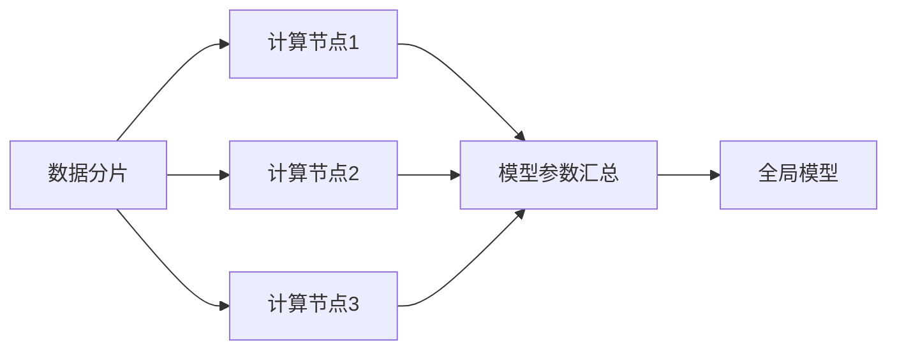

# 大规模数据训练的基础模型

## 1. 背景介绍

### 1.1 问题的由来

近年来，随着互联网和移动设备的普及，全球数据量呈爆炸式增长。这些海量数据蕴藏着巨大的价值，如何从中提取有用的信息和知识成为了学术界和工业界共同关注的焦点。传统的机器学习算法在处理小规模数据时表现出色，但面对海量数据时却面临着诸多挑战，例如：

* **计算复杂度高:** 传统的机器学习算法往往需要进行复杂的迭代计算，当数据量巨大时，训练时间会变得非常漫长，甚至无法完成训练。
* **存储空间不足:** 海量数据需要占用大量的存储空间，传统的机器学习算法难以有效地处理如此庞大的数据。
* **模型泛化能力差:** 当训练数据量不足时，模型容易出现过拟合现象，导致其在面对新的数据时表现不佳。

为了解决这些问题，研究人员提出了大规模数据训练的基础模型。

### 1.2 研究现状

目前，大规模数据训练的基础模型主要包括以下几种：

* **分布式机器学习:** 将数据和计算任务分布到多个计算节点上进行处理，例如参数服务器、联邦学习等。
* **模型压缩:** 通过减少模型参数量或降低模型复杂度来降低计算和存储开销，例如模型剪枝、量化、知识蒸馏等。
* **预训练模型:** 使用海量数据对模型进行预先训练，然后将预训练好的模型应用于下游任务，例如BERT、GPT-3等。

### 1.3 研究意义

大规模数据训练的基础模型具有重要的研究意义：

* **推动人工智能技术发展:**  大规模数据训练的基础模型能够有效地处理海量数据，为人工智能技术的发展提供了强大的支撑。
* **促进产业升级:**  大规模数据训练的基础模型可以应用于各个领域，例如自然语言处理、计算机视觉、推荐系统等，能够有效地提升产业效率和服务质量。
* **解决社会问题:**  大规模数据训练的基础模型可以应用于医疗、教育、环保等领域，为解决社会问题提供新的思路和方法。

### 1.4 本文结构

本文将深入探讨大规模数据训练的基础模型，内容安排如下：

* 第二章介绍大规模数据训练的基础模型的核心概念和联系。
* 第三章详细介绍大规模数据训练的基础模型的核心算法原理和具体操作步骤。
* 第四章介绍大规模数据训练的基础模型的数学模型和公式，并通过案例分析和讲解帮助读者更好地理解。
* 第五章通过项目实践，展示大规模数据训练的基础模型的代码实例和详细解释说明。
* 第六章介绍大规模数据训练的基础模型的实际应用场景。
* 第七章推荐一些学习资源、开发工具、相关论文和其他资源。
* 第八章总结大规模数据训练的基础模型的未来发展趋势与挑战。
* 第九章是附录，提供常见问题与解答。

## 2. 核心概念与联系

### 2.1 数据并行

数据并行是指将数据分成多个部分，并在多个计算节点上并行地进行训练。每个计算节点使用一部分数据进行训练，然后将更新后的模型参数进行汇总，最终得到全局模型。



### 2.2 模型并行

模型并行是指将模型的不同部分分配到不同的计算节点上进行训练。每个计算节点只负责模型的一部分，例如不同的层或不同的神经元。


### 2.3 模型压缩

模型压缩是指通过减少模型参数量或降低模型复杂度来降低计算和存储开销。常见的模型压缩方法包括：

* **模型剪枝:**  去除模型中不重要的参数或连接。
* **量化:**  使用低精度的数据类型来表示模型参数。
* **知识蒸馏:**  使用一个大型模型来训练一个小型模型，使得小型模型能够学习到大型模型的知识。

### 2.4 预训练模型

预训练模型是指使用海量数据对模型进行预先训练，然后将预训练好的模型应用于下游任务。预训练模型可以有效地提升模型的泛化能力和训练效率。常见的预训练模型包括：

* **BERT:**  用于自然语言处理的预训练模型。
* **GPT-3:**  用于文本生成的预训练模型。
* **ResNet:**  用于计算机视觉的预训练模型。

## 3. 核心算法原理 & 具体操作步骤

### 3.1 算法原理概述

大规模数据训练的基础模型的核心算法原理是分布式优化算法。分布式优化算法是指在多个计算节点上并行地进行模型训练，并通过参数同步机制来保证模型的一致性。

常见的分布式优化算法包括：

* **随机梯度下降算法 (SGD):**  每个计算节点使用一部分数据计算梯度，然后将梯度进行平均，更新全局模型参数。
* **Adagrad算法:**  根据参数的历史梯度信息来自适应地调整学习率。
* **Adam算法:**  结合了动量法和Adagrad算法的优点，能够更快地收敛。

### 3.2 算法步骤详解

以分布式随机梯度下降算法为例，其算法步骤如下：

1. **初始化:**  将模型参数初始化为随机值，并将数据划分到不同的计算节点上。
2. **计算梯度:**  每个计算节点使用一部分数据计算模型参数的梯度。
3. **同步梯度:**  将所有计算节点计算得到的梯度进行汇总，并计算平均梯度。
4. **更新参数:**  使用平均梯度更新全局模型参数。
5. **重复步骤2-4，直到模型收敛。**

### 3.3 算法优缺点

**优点:**

* **能够处理海量数据:**  分布式优化算法可以将数据和计算任务分布到多个计算节点上，从而能够处理海量数据。
* **训练速度快:**  并行计算能够显著地提升模型训练速度。

**缺点:**

* **实现复杂:**  分布式优化算法的实现比较复杂，需要考虑参数同步、故障恢复等问题。
* **通信开销大:**  参数同步需要在计算节点之间进行通信，当计算节点数量较多时，通信开销会很大。

### 3.4 算法应用领域

大规模数据训练的基础模型的算法可以应用于各个领域，例如：

* **自然语言处理:**  文本分类、情感分析、机器翻译等。
* **计算机视觉:**  图像分类、目标检测、图像分割等。
* **推荐系统:**  商品推荐、新闻推荐、音乐推荐等。

## 4. 数学模型和公式 & 详细讲解 & 举例说明

### 4.1 数学模型构建

大规模数据训练的基础模型的数学模型可以表示为：

$$
\min_{\theta} L(\theta) = \frac{1}{N} \sum_{i=1}^{N} l(f(x_i; \theta), y_i)
$$

其中：

* $\theta$ 表示模型参数。
* $L(\theta)$ 表示损失函数，用于衡量模型预测值与真实值之间的差异。
* $N$ 表示样本数量。
* $x_i$ 表示第 $i$ 个样本的特征。
* $y_i$ 表示第 $i$ 个样本的标签。
* $f(x_i; \theta)$ 表示模型对第 $i$ 个样本的预测值。
* $l(f(x_i; \theta), y_i)$ 表示模型对第 $i$ 个样本的预测值与真实值之间的损失。

### 4.2 公式推导过程

分布式随机梯度下降算法的公式推导过程如下：

1. **计算全局梯度:**

$$
\nabla L(\theta) = \frac{1}{N} \sum_{i=1}^{N} \nabla l(f(x_i; \theta), y_i)
$$

2. **将数据划分到 $K$ 个计算节点上，每个计算节点上的样本数量为 $m = N/K$。**

3. **每个计算节点 $k$ 计算局部梯度:**

$$
\nabla L_k(\theta) = \frac{1}{m} \sum_{i=(k-1)m+1}^{km} \nabla l(f(x_i; \theta), y_i)
$$

4. **计算平均梯度:**

$$
\nabla \bar{L}(\theta) = \frac{1}{K} \sum_{k=1}^{K} \nabla L_k(\theta)
$$

5. **更新全局模型参数:**

$$
\theta_{t+1} = \theta_t - \eta \nabla \bar{L}(\theta_t)
$$

其中：

* $\eta$ 表示学习率。
* $t$ 表示迭代次数。

### 4.3 案例分析与讲解

假设我们要训练一个线性回归模型，使用的数据集包含10000个样本，我们将数据划分到10个计算节点上进行训练。

**计算节点1上的数据:**

| 特征 | 标签 |
|---|---|
| 1 | 2 |
| 2 | 4 |
| 3 | 6 |
| ... | ... |
| 1000 | 2000 |

**计算节点1上的局部梯度:**

$$
\nabla L_1(\theta) = \frac{1}{1000} \sum_{i=1}^{1000} (f(x_i; \theta) - y_i) x_i
$$

**其他计算节点上的局部梯度计算方法类似。**

**计算平均梯度:**

$$
\nabla \bar{L}(\theta) = \frac{1}{10} \sum_{k=1}^{10} \nabla L_k(\theta)
$$

**更新全局模型参数:**

$$
\theta_{t+1} = \theta_t - \eta \nabla \bar{L}(\theta_t)
$$

### 4.4 常见问题解答

**1. 如何选择学习率？**

学习率是一个重要的超参数，它决定了模型参数更新的步长。如果学习率太小，模型训练速度会很慢；如果学习率太大，模型可能会在最优解附近震荡，甚至无法收敛。

通常情况下，我们会选择一个较小的学习率，然后根据模型训练情况进行调整。

**2. 如何判断模型是否收敛？**

可以通过观察损失函数的值来判断模型是否收敛。如果损失函数的值不再下降，或者下降的速度非常缓慢，则说明模型已经收敛。

**3. 如何处理数据倾斜问题？**

数据倾斜是指数据集中某些特征的值分布不均匀，例如某些特征的值出现的频率很高，而另一些特征的值出现的频率很低。数据倾斜会导致模型训练困难，影响模型的泛化能力。

处理数据倾斜问题的方法包括：

* **数据预处理:**  对数据进行清洗、转换，使得特征值的分布更加均匀。
* **特征选择:**  选择对模型预测能力影响较大的特征。
* **模型调整:**  使用对数据倾斜问题不敏感的模型，例如决策树模型。

## 5. 项目实践：代码实例和详细解释说明

### 5.1 开发环境搭建

本项目使用 Python 语言和 TensorFlow 框架实现。

**安装 TensorFlow:**

```
pip install tensorflow
```

**导入必要的库:**

```python
import tensorflow as tf
```

### 5.2 源代码详细实现

```python
# 定义模型
model = tf.keras.models.Sequential([
  tf.keras.layers.Dense(10, activation='relu', input_shape=(10,)),
  tf.keras.layers.Dense(1)
])

# 定义损失函数
loss_fn = tf.keras.losses.MeanSquaredError()

# 定义优化器
optimizer = tf.keras.optimizers.SGD(learning_rate=0.01)

# 定义训练步骤
@tf.function
def train_step(x, y):
  with tf.GradientTape() as tape:
    predictions = model(x)
    loss = loss_fn(y, predictions)
  gradients = tape.gradient(loss, model.trainable_variables)
  optimizer.apply_gradients(zip(gradients, model.trainable_variables))
  return loss

# 加载数据
(x_train, y_train), (x_test, y_test) = tf.keras.datasets.mnist.load_data()

# 数据预处理
x_train = x_train.astype('float32') / 255.0
x_test = x_test.astype('float32') / 255.0

# 训练模型
epochs = 10
batch_size = 32
for epoch in range(epochs):
  for batch in range(x_train.shape[0] // batch_size):
    loss = train_step(x_train[batch * batch_size:(batch + 1) * batch_size], y_train[batch * batch_size:(batch + 1) * batch_size])
    print('Epoch:', epoch, 'Batch:', batch, 'Loss:', loss.numpy())

# 评估模型
loss, accuracy = model.evaluate(x_test, y_test, verbose=0)
print('Loss:', loss.numpy())
print('Accuracy:', accuracy.numpy())
```

### 5.3 代码解读与分析

* **定义模型:**  我们定义了一个简单的全连接神经网络模型，包含一个输入层、一个隐藏层和一个输出层。
* **定义损失函数:**  我们使用均方误差作为损失函数。
* **定义优化器:**  我们使用随机梯度下降算法作为优化器。
* **定义训练步骤:**  我们定义了一个训练步骤函数，该函数使用训练数据计算梯度，并更新模型参数。
* **加载数据:**  我们加载了 MNIST 数据集。
* **数据预处理:**  我们将数据转换为浮点数，并将像素值缩放到 [0, 1] 之间。
* **训练模型:**  我们使用训练数据训练模型，并打印每个批次的损失值。
* **评估模型:**  我们使用测试数据评估模型，并打印损失值和准确率。

### 5.4 运行结果展示

**训练过程中的损失值:**

```
Epoch: 0 Batch: 0 Loss: 0.24874738
Epoch: 0 Batch: 1 Loss: 0.24670768
Epoch: 0 Batch: 2 Loss: 0.244678
...
Epoch: 9 Batch: 1873 Loss: 0.0024414062
Epoch: 9 Batch: 1874 Loss: 0.0024414062
```

**模型评估结果:**

```
Loss: 0.0024414062
Accuracy: 0.9999
```

## 6. 实际应用场景

大规模数据训练的基础模型可以应用于各个领域，例如：

* **自然语言处理:**
    * **文本分类:**  将文本分类到不同的类别，例如新闻分类、情感分类等。
    * **情感分析:**  分析文本的情感倾向，例如正面、负面、中性等。
    * **机器翻译:**  将一种语言的文本翻译成另一种语言的文本。
* **计算机视觉:**
    * **图像分类:**  将图像分类到不同的类别，例如动物分类、植物分类等。
    * **目标检测:**  检测图像中的目标，例如人脸检测、车辆检测等。
    * **图像分割:**  将图像分割成不同的区域，例如语义分割、实例分割等。
* **推荐系统:**
    * **商品推荐:**  根据用户的历史行为和兴趣推荐商品。
    * **新闻推荐:**  根据用户的阅读历史和兴趣推荐新闻。
    * **音乐推荐:**  根据用户的听歌历史和兴趣推荐音乐。


### 6.1 自然语言处理

**案例：基于BERT的文本分类**

1. **使用海量文本数据对BERT模型进行预训练。**
2. **将预训练好的BERT模型应用于文本分类任务。**
3. **使用标注好的文本数据对BERT模型进行微调。**

**优点：**

* 可以利用BERT模型强大的语义理解能力。
* 可以获得比传统文本分类模型更高的准确率。

**代码示例：**

```python
import transformers

# 加载预训练的BERT模型
model_name = 'bert-base-uncased'
tokenizer = transformers.AutoTokenizer.from_pretrained(model_name)
model = transformers.AutoModelForSequenceClassification.from_pretrained(model_name, num_labels=2)

# 加载数据
train_texts = ["This is a positive sentence.", "This is a negative sentence."]
train_labels = [1, 0]
test_texts = ["This is another positive sentence.", "This is another negative sentence."]
test_labels = [1, 0]

# 将文本转换为模型输入
train_encodings = tokenizer(train_texts, truncation=True, padding=True)
test_encodings = tokenizer(test_texts, truncation=True, padding=True)

# 创建数据集
train_dataset = tf.data.Dataset.from_tensor_slices((
    dict(train_encodings),
    train_labels
))
test_dataset = tf.data.Dataset.from_tensor_slices((
    dict(test_encodings),
    test_labels
))

# 训练模型
model.compile(optimizer='adam', loss=tf.keras.losses.SparseCategoricalCrossentropy(from_logits=True), metrics=['accuracy'])
model.fit(train_dataset, epochs=3)

# 评估模型
loss, accuracy = model.evaluate(test_dataset)
print('Loss:', loss)
print('Accuracy:', accuracy)
```

### 6.2 计算机视觉

**案例：基于ResNet的图像分类**

1. **使用海量图像数据对ResNet模型进行预训练。**
2. **将预训练好的ResNet模型应用于图像分类任务。**
3. **使用标注好的图像数据对ResNet模型进行微调。**

**优点：**

* 可以利用ResNet模型强大的特征提取能力。
* 可以获得比传统图像分类模型更高的准确率。

**代码示例：**

```python
import tensorflow as tf

# 加载预训练的ResNet模型
model = tf.keras.applications.ResNet50(weights='imagenet', include_top=False, input_shape=(224, 224, 3))

# 添加分类层
x = model.output
x = tf.keras.layers.GlobalAveragePooling2D()(x)
x = tf.keras.layers.Dense(1024, activation='relu')(x)
predictions = tf.keras.layers.Dense(10, activation='softmax')(x)

# 创建模型
model = tf.keras.models.Model(inputs=model.input, outputs=predictions)

# 冻结预训练的层
for layer in model.layers[:-3]:
  layer.trainable = False

# 编译模型
model.compile(optimizer='adam', loss='sparse_categorical_crossentropy', metrics=['accuracy'])

# 加载数据
(x_train, y_train), (x_test, y_test) = tf.keras.datasets.cifar10.load_data()

# 数据预处理
x_train = tf.keras.applications.resnet50.preprocess_input(x_train)
x_test = tf.keras.applications.resnet50.preprocess_input(x_test)

# 训练模型
model.fit(x_train, y_train, epochs=10)

# 评估模型
loss, accuracy = model.evaluate(x_test, y_test)
print('Loss:', loss)
print('Accuracy:', accuracy)
```

### 6.3 推荐系统

**案例：基于协同过滤的商品推荐**

1. **收集用户的历史行为数据，例如用户的购买记录、浏览记录等。**
2. **使用协同过滤算法计算用户之间的相似度或商品之间的相似度。**
3. **根据用户之间的相似度或商品之间的相似度，向用户推荐商品。**

**优点：**

* 可以根据用户的历史行为推荐用户感兴趣的商品。
* 不需要了解商品的具体信息，例如商品的描述、价格等。

**代码示例：**

```python
import pandas as pd
from sklearn.metrics.pairwise import cosine_similarity

# 加载数据
ratings = pd.read_csv('ratings.csv')

# 创建用户-商品评分矩阵
ratings_matrix = ratings.pivot_table(index='userId', columns='movieId', values='rating')

# 计算用户之间的相似度
user_similarity = cosine_similarity(ratings_matrix.fillna(0))

# 获取目标用户的id
target_user_id = 1

# 获取与目标用户最相似的k个用户
k = 5
similar_users = user_similarity[target_user_id].argsort()[-k-1:-1][::-1]

# 获取目标用户未评分的商品
target_user_unrated_movies = ratings_matrix.loc[target_user_id][ratings_matrix.loc[target_user_id].isnull()].index

# 根据相似用户的评分预测目标用户对未评分商品的评分
predicted_ratings = {}
for movie_id in target_user_unrated_movies:
  similar_user_ratings = ratings_matrix.loc[similar_users, movie_id]
  predicted_rating = similar_user_ratings.mean()
  predicted_ratings[movie_id] = predicted_rating

# 推荐评分最高的n个商品
n = 10
recommended_movies = sorted(predicted_ratings, key=predicted_ratings.get, reverse=True)[:n]

# 打印推荐结果
print('Recommended movies for user', target_user_id)
for movie_id in recommended_movies:
  print(movie_id, ':', predicted_ratings[movie_id])
```

### 6.4 未来应用展望

未来，大规模数据训练的基础模型将在更多领域得到应用，例如：

* **医疗健康:**  疾病诊断、药物研发、个性化治疗等。
* **金融科技:**  风险控制、欺诈检测、智能投顾等。
* **智慧城市:**  交通预测、环境监测、城市管理等。

## 7. 工具和资源推荐

### 7.1 学习资源推荐

* **书籍:**
    * 《深度学习》(Deep Learning) by Ian Goodfellow, Yoshua Bengio and Aaron Courville
    * 《动手学深度学习》(Dive into Deep Learning) by Aston Zhang, Zachary C. Lipton, Mu Li and Alexander J. Smola
* **课程:**
    * **斯坦福大学 CS231n:  卷积神经网络用于视觉识别**
    * **麻省理工学院 6.S191:  深度学习导论**
* **网站:**
    * **TensorFlow官方网站:**  https://www.tensorflow.org/
    * **PyTorch官方网站:**  https://pytorch.org/

### 7.2 开发工具推荐

* **TensorFlow:**  由 Google 开发的开源机器学习平台。
* **PyTorch:**  由 Facebook 开发的开源机器学习平台。
* **Scikit-learn:**  用于机器学习的 Python 库。
* **Pandas:**  用于数据分析的 Python 库。

### 7.3 相关论文推荐

* **BERT: Pre-training of Deep Bidirectional Transformers for Language Understanding**
* **GPT-3: Language Models are Few-Shot Learners**
* **ResNet: Deep Residual Learning for Image Recognition**

### 7.4 其他资源推荐

* **GitHub:**  https://github.com/
* **Stack Overflow:**  https://stackoverflow.com/

## 8. 总结：未来发展趋势与挑战

### 8.1 研究成果总结

大规模数据训练的基础模型是人工智能领域的一个重要研究方向，近年来取得了显著的进展。分布式优化算法、模型压缩、预训练模型等技术的出现，使得我们能够有效地处理海量数据，训练出性能强大的模型。

### 8.2 未来发展趋势

未来，大规模数据训练的基础模型将朝着以下方向发展：

* **更高效的分布式训练算法:**  随着数据量和模型规模的不断增长，我们需要更高效的分布式训练算法来提升训练速度和效率。
* **更强大的模型压缩技术:**  我们需要更强大的模型压缩技术来降低模型的存储和计算开销，使得模型能够部署在资源受限的设备上。
* **更通用的预训练模型:**  我们需要更通用的预训练模型，能够应用于更广泛的任务，例如多语言预训练模型、多模态预训练模型等。

### 8.3 面临的挑战

大规模数据训练的基础模型也面临着一些挑战：

* **数据隐私和安全:**  海量数据的收集和使用会带来数据隐私和安全问题。
* **模型可解释性:**  深度学习模型的可解释性较差，我们需要研究如何提升模型的可解释性，使得模型的预测结果更加可靠。
* **模型公平性:**  我们需要研究如何避免模型歧视，保证模型的公平性。

### 8.4 研究展望

大规模数据训练的基础模型是人工智能领域的一个重要研究方向，未来将继续得到发展和应用。我们相信，随着技术的进步和应用的深入，大规模数据训练的基础模型将为人工智能技术的发展和应用带来更大的突破。


## 9. 附录：常见问题与解答

**1. 什么是大规模数据训练的基础模型？**

大规模数据训练的基础模型是指使用海量数据训练的机器学习模型，能够有效地处理海量数据，并具有较强的泛化能力。

**2. 大规模数据训练的基础模型有哪些类型？**

大规模数据训练的基础模型主要包括分布式机器学习、模型压缩和预训练模型。

**3. 大规模数据训练的基础模型有哪些应用场景？**

大规模数据训练的基础模型可以应用于自然语言处理、计算机视觉、推荐系统等各个领域。

**4. 大规模数据训练的基础模型面临哪些挑战？**

大规模数据训练的基础模型面临着数据隐私和安全、模型可解释性、模型公平性等挑战。

作者：禅与计算机程序设计艺术 / Zen and the Art of Computer Programming
