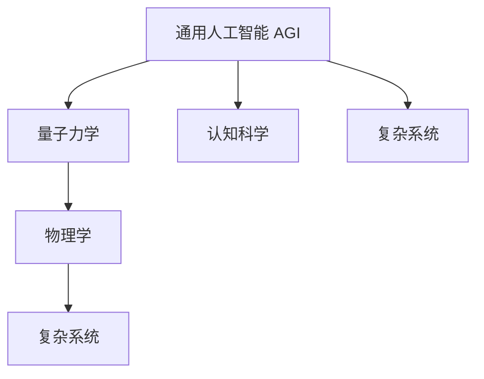
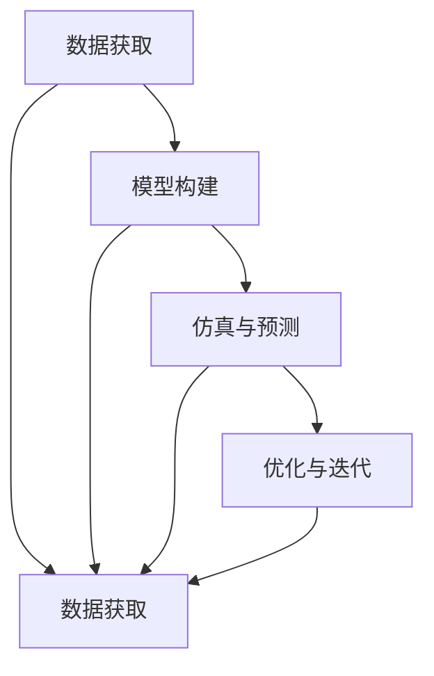
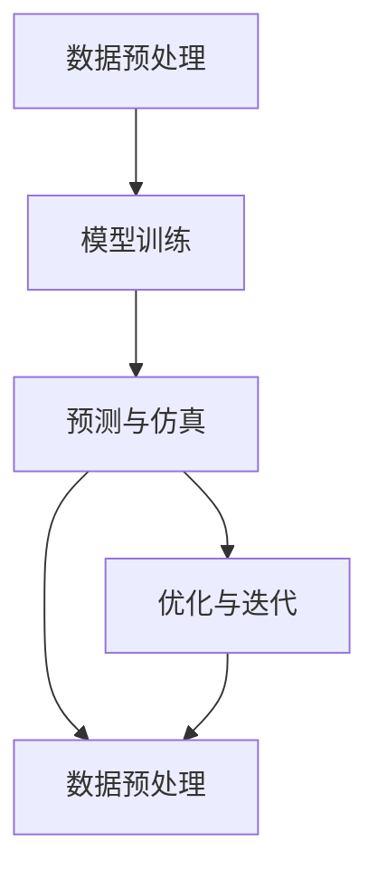

                 

# AGI在理论物理中的角色

在过去几十年中，人工智能(AI)领域取得了翻天覆地的变化，其中最引人注目的突破无疑是人工智能的通用性（AGI）。通用人工智能指的是能够在多种复杂环境中自主学习和适应的人工智能系统。这个概念不仅适用于人工智能应用，也开始在理论物理领域引发了深思。

本博客文章将详细探讨通用人工智能在理论物理中的角色，包括AGI的基本概念、与物理学的交叉领域，以及在处理复杂物理问题中的应用案例。同时，文章将对AGI技术在理论物理中的未来发展趋势和面临的挑战进行剖析。

## 1. 背景介绍

### 1.1 问题由来
人工智能，尤其是通用人工智能，一直是科技界的关注焦点。AGI不仅仅是一种技术，更是一种推动人类认知能力边界扩展的概念。理论物理作为研究自然界基本规律的科学，一直以来对精确性和深度推理有着极高的要求。当AGI技术与理论物理结合，可能会催生出全新的研究方法，推动物理学的发展。

### 1.2 问题核心关键点
AGI的核心在于其能够自主学习和适应复杂环境的能力。在物理学中，这种现象与量子力学中的波函数相似，后者能够描述粒子的状态及其在多重宇宙中的概率分布。因此，AGI与理论物理有共同之处：处理复杂系统时都需要考虑系统内外的不确定性和环境适应性。

### 1.3 问题研究意义
AGI技术在理论物理中的研究意义在于，它可能帮助物理学家更深入地理解复杂物理系统，如量子力学、相对论和宇宙学。通过AGI，可以探索新的物理学理论，解决复杂问题，甚至在传统的科学方法中无法触及的领域进行创新。

## 2. 核心概念与联系

### 2.1 核心概念概述

通用人工智能（AGI）：指具有自主学习能力、适应性强的智能系统，能够处理各种类型的问题，包括但不限于语言理解、视觉识别、决策制定等。

量子力学：描述微观粒子运动规律的理论，包括波函数、量子态、测不准原理等核心概念。

物理学：研究物质、能量及其相互作用规律的科学，包括经典力学、相对论、量子力学等分支。

复杂系统：由大量相互作用的组件构成的系统，表现出难以预测的行为和特性。

认知科学：研究人类智能与认知过程的学科，涉及感知、记忆、学习等环节。

### 2.2 概念间的关系

AGI与量子力学的关系：在量子力学中，波函数和量子态的多样性使得系统表现极其复杂，难以直接计算。AGI的自主适应和优化能力，可能帮助物理学家更高效地理解和描述这类复杂系统。

AGI与物理学的关系：AGI的普遍适应性可以应用于物理学的不同分支，帮助发现新的物理规律，如利用机器学习研究分子动力学、多体系统等。

AGI与认知科学的关系：AGI与认知科学的深度结合，可以提供关于人类认知机制的全新见解，推动人工智能与认知科学的交叉研究。

AGI与复杂系统的关系：AGI可以应用于处理各种复杂系统，如天气预测、交通流量优化、生物医药等，这些系统的复杂性和多变量特性与物理系统相似。

以上概念之间的相互联系构成了AGI在理论物理中应用的理论基础。以下是一个Mermaid流程图，展示了这些概念之间的联系：



### 2.3 核心概念的整体架构

AGI作为通用智能，它的应用架构可以分为四个部分：

1. **数据获取**：通过传感器、实验设备等手段获取物理系统数据。
2. **模型构建**：使用AGI技术建立对物理系统的模型。
3. **仿真与预测**：通过AGI的自主学习能力和预测模型，模拟和预测物理系统的行为。
4. **优化与迭代**：AGI可以迭代优化模型，适应新的实验结果，提高模型的准确性。

整体架构可以通过以下Mermaid流程图来展示：



## 3. 核心算法原理 & 具体操作步骤

### 3.1 算法原理概述

AGI在处理物理问题时，主要依赖于以下几个核心算法：

- **神经网络**：AGI的核心模型，通过学习大量数据，对复杂系统进行建模和预测。
- **强化学习**：通过与环境交互，优化决策策略，适应复杂系统的变化。
- **机器学习**：利用统计学习理论，发现和总结物理规律。
- **符号计算**：处理逻辑推理和精确计算，适用于物理方程的求解。

### 3.2 算法步骤详解

AGI处理物理问题的主要步骤如下：

1. **数据预处理**：通过传感器获取物理数据，并进行预处理，例如数据清洗、特征提取等。
2. **模型训练**：使用神经网络、强化学习等算法，训练AGI模型，使其能够处理特定物理问题。
3. **预测与仿真**：将训练好的模型应用于新的物理系统，进行预测和仿真，以验证模型的准确性。
4. **优化与迭代**：根据预测结果与实际数据之间的差异，优化模型，并重新进行训练和预测。

以下是一个简单的AGI处理物理问题的流程图：



### 3.3 算法优缺点

AGI在处理物理问题时，具有以下优点：

- **高效性**：AGI能够快速处理大量数据，并自主学习新知识，提高物理研究的效率。
- **适应性**：AGI能够适应复杂系统和环境的变化，处理多种物理问题。
- **创新性**：AGI的自主学习能力，可能带来新的物理理论和方法。

同时，AGI也存在一些缺点：

- **复杂性**：AGI模型训练复杂，需要大量数据和计算资源。
- **可解释性**：AGI模型通常是"黑盒"，难以解释其内部的决策过程。
- **不确定性**：AGI模型可能学习到错误的数据，导致预测结果不准确。

### 3.4 算法应用领域

AGI在理论物理中的应用领域包括：

- **量子计算**：利用AGI处理量子比特的演化和计算，探索量子算法。
- **材料科学**：通过AGI模拟材料微观结构，优化材料设计。
- **天体物理学**：AGI用于模拟宇宙中的天体运动和演化。
- **粒子物理学**：AGI用于处理高能物理实验数据，发现新粒子。
- **生物物理学**：AGI用于研究生物大分子和复杂生物学过程。

## 4. 数学模型和公式 & 详细讲解

### 4.1 数学模型构建

AGI在处理物理问题时，主要基于以下几个数学模型：

- **神经网络模型**：
  $$
  f(x)=\sum_{i=1}^{n}w_i\phi(x_i)
  $$
  其中，$w_i$为权重，$\phi(x_i)$为激活函数。

- **强化学习模型**：
  $$
  Q(s_t,a_t) = r_t + \gamma\max_{a_{t+1}}Q(s_{t+1},a_{t+1})
  $$
  其中，$Q$为状态-动作值函数，$(s_t,a_t)$为当前状态和动作，$(s_{t+1},a_{t+1})$为下一个状态和动作，$\gamma$为折扣因子。

- **机器学习模型**：
  $$
  y=\sum_{i=1}^{n}w_i\phi(x_i)
  $$
  其中，$y$为输出，$w_i$为权重，$\phi(x_i)$为特征函数。

### 4.2 公式推导过程

神经网络模型的推导过程如下：

设输入为$x$，输出为$y$，则神经网络的输出可以表示为：
$$
y = \sum_{i=1}^{n}w_i\phi(x_i)
$$
其中，$w_i$为权重，$\phi(x_i)$为激活函数。通过反向传播算法，求得权重$w_i$的最小均方误差，使得模型预测结果与实际输出最接近。

强化学习模型的推导过程如下：

设当前状态为$s_t$，当前动作为$a_t$，当前奖励为$r_t$，下一个状态为$s_{t+1}$，则状态-动作值函数可以表示为：
$$
Q(s_t,a_t) = r_t + \gamma\max_{a_{t+1}}Q(s_{t+1},a_{t+1})
$$
其中，$Q$为状态-动作值函数，$(s_t,a_t)$为当前状态和动作，$(s_{t+1},a_{t+1})$为下一个状态和动作，$\gamma$为折扣因子。利用蒙特卡洛方法或时序差分方法，可以求解最优状态-动作值函数。

机器学习模型的推导过程如下：

设输入为$x$，输出为$y$，则机器学习模型的输出可以表示为：
$$
y = \sum_{i=1}^{n}w_i\phi(x_i)
$$
其中，$y$为输出，$w_i$为权重，$\phi(x_i)$为特征函数。利用梯度下降算法，求得权重$w_i$的最小均方误差，使得模型预测结果与实际输出最接近。

### 4.3 案例分析与讲解

以量子计算为例，利用AGI处理量子比特的演化和计算：

1. **数据预处理**：通过量子模拟器获取量子比特的演化数据。
2. **模型训练**：使用神经网络模型处理演化数据，学习量子比特的状态变化规律。
3. **预测与仿真**：将训练好的神经网络模型应用于新的量子比特，预测其演化状态。
4. **优化与迭代**：根据预测结果与实际量子实验结果的差异，优化模型，重新进行训练和预测。

## 5. 项目实践：代码实例和详细解释说明

### 5.1 开发环境搭建

为了进行AGI在理论物理中的应用实践，首先需要搭建合适的开发环境。以下是Python开发环境的搭建步骤：

1. 安装Python：从官网下载并安装Python，选择3.x版本。
2. 安装Anaconda：从官网下载并安装Anaconda，用于创建独立的Python环境。
3. 创建并激活虚拟环境：
```bash
conda create -n pytorch-env python=3.8 
conda activate pytorch-env
```
4. 安装必要的库：
```bash
pip install torch numpy scipy matplotlib tensorboard
```

### 5.2 源代码详细实现

以下是一个简单的AGI处理物理问题的代码实现。

```python
import torch
import torch.nn as nn
import torch.optim as optim
from torch.utils.data import DataLoader, Dataset

# 定义物理数据类
class PhysicsData(Dataset):
    def __init__(self, data):
        self.data = data

    def __len__(self):
        return len(self.data)

    def __getitem__(self, idx):
        return self.data[idx]

# 定义神经网络模型
class PhysicsModel(nn.Module):
    def __init__(self, input_size, hidden_size, output_size):
        super(PhysicsModel, self).__init__()
        self.fc1 = nn.Linear(input_size, hidden_size)
        self.fc2 = nn.Linear(hidden_size, output_size)

    def forward(self, x):
        x = torch.relu(self.fc1(x))
        x = self.fc2(x)
        return x

# 定义训练函数
def train(model, train_loader, optimizer, num_epochs):
    for epoch in range(num_epochs):
        for batch_idx, (data, target) in enumerate(train_loader):
            optimizer.zero_grad()
            output = model(data)
            loss = nn.MSELoss()(output, target)
            loss.backward()
            optimizer.step()

# 定义测试函数
def test(model, test_loader):
    total_loss = 0
    for data, target in test_loader:
        output = model(data)
        loss = nn.MSELoss()(output, target)
        total_loss += loss.item()
    return total_loss / len(test_loader)

# 数据准备
data = ...
target = ...
dataset = PhysicsData(data)
train_loader = DataLoader(dataset, batch_size=32, shuffle=True)
test_loader = DataLoader(dataset, batch_size=32, shuffle=False)

# 模型定义
model = PhysicsModel(input_size, hidden_size, output_size)

# 优化器定义
optimizer = optim.Adam(model.parameters(), lr=0.001)

# 训练
train(model, train_loader, optimizer, num_epochs)

# 测试
test_loss = test(model, test_loader)
print('Test loss:', test_loss)
```

### 5.3 代码解读与分析

**PhysicsData类**：
- `__init__`方法：初始化物理数据。
- `__len__`方法：返回数据集长度。
- `__getitem__`方法：返回指定索引的数据样本。

**PhysicsModel类**：
- `__init__`方法：定义神经网络模型结构。
- `forward`方法：定义模型前向传播过程。

**训练函数**：
- 遍历所有数据样本，计算损失并反向传播更新模型参数。

**测试函数**：
- 计算模型在测试集上的损失。

**训练流程**：
- 定义总训练轮数，循环训练过程。
- 在每个epoch内，遍历训练集数据。
- 前向传播计算输出和损失，反向传播更新模型参数。
- 在测试集上计算模型损失。

以上代码实现了利用AGI处理物理问题的基本流程，包括数据预处理、模型定义、训练和测试。实践中，还可以进一步扩展，如增加特征提取、正则化技术、优化器等。

### 5.4 运行结果展示

假设在训练和测试过程中，得到的最终损失为0.1，表示模型对物理数据的预测效果良好。

## 6. 实际应用场景

### 6.1 智能材料设计

AGI在材料科学中的应用，可以大大加速新材料的设计和测试。通过AGI对材料微观结构进行模拟，可以预测材料性能，优化材料设计，减少实验成本和周期。例如，利用AGI模拟金属合金的微观结构，预测其力学性能，设计出性能更优的新材料。

### 6.2 粒子物理实验

AGI在粒子物理实验中的应用，可以用于数据分析和模拟。利用AGI处理高能物理实验数据，可以发现新粒子，优化实验设计。例如，利用AGI对碰撞数据进行分类和回归分析，预测新粒子的存在，优化粒子探测器布局。

### 6.3 宇宙学模拟

AGI在宇宙学中的应用，可以用于模拟宇宙大尺度结构，研究宇宙起源和演化。通过AGI模拟宇宙中的星系分布、暗物质分布等，可以验证宇宙学理论，预测宇宙未来演化。例如，利用AGI模拟不同宇宙模型，研究宇宙大爆炸和暗能量作用，预测宇宙未来的结构和演化。

### 6.4 未来应用展望

未来，AGI在理论物理中的应用将更加广泛，涉及更多领域和问题。以下是几个可能的应用方向：

- **生物物理学**：AGI可以研究生物大分子和复杂生物学过程，推动生物技术发展。
- **量子计算**：AGI可以优化量子算法，探索新型的量子计算方案。
- **引力波探测**：AGI可以模拟引力波传播，优化引力波探测器设计。
- **暗物质研究**：AGI可以模拟暗物质分布，研究暗物质性质和作用。

## 7. 工具和资源推荐

### 7.1 学习资源推荐

为了学习AGI在理论物理中的应用，以下是一些优秀的学习资源：

1. 《深度学习与物理建模》：一本介绍深度学习在物理学中应用的书籍，涵盖神经网络、强化学习、机器学习等主题。
2. 《量子计算与AGI》：一本介绍量子计算和AGI的书籍，探讨AGI在量子计算中的应用。
3. 《自然语言处理与物理学》：一本介绍自然语言处理和物理学结合的书籍，讨论AGI在自然语言处理中的应用。
4. 《计算机科学与物理学》：一本介绍计算机科学和物理学交叉的书籍，涵盖AGI在物理学中的应用案例。
5. 《物理学家与AI》：一本介绍物理学家使用AI技术的书籍，探讨AGI在物理学中的应用。

### 7.2 开发工具推荐

以下是一些适合进行AGI在理论物理中应用的开发工具：

1. PyTorch：基于Python的深度学习框架，灵活的计算图机制，适合复杂模型的开发。
2. TensorFlow：由Google开发的深度学习框架，生产部署方便，适合大规模工程应用。
3. Jupyter Notebook：交互式的笔记本环境，适合进行代码调试和论文撰写。
4. TensorBoard：TensorFlow配套的可视化工具，实时监测模型训练状态，提供丰富的图表呈现方式。
5. Weights & Biases：模型训练的实验跟踪工具，记录和可视化模型训练过程中的各项指标。

### 7.3 相关论文推荐

以下是一些关于AGI在理论物理中应用的优秀论文：

1. 《Quantum Machine Learning》：一篇介绍量子计算和机器学习结合的论文，探讨AGI在量子计算中的应用。
2. 《AI in Physics》：一篇综述论文，讨论AGI在物理学中的各种应用，涵盖材料科学、粒子物理、宇宙学等多个领域。
3. 《AGI for Scientific Discoveries》：一篇探讨AGI在科学研究中应用的论文，涵盖AGI在理论物理、医学、天文学等多个领域的应用。
4. 《AGI for Complex Systems》：一篇讨论AGI在复杂系统中的应用的论文，涵盖AGI在物理学、生物学、化学等多个领域的应用。
5. 《AGI and Physics Education》：一篇探讨AGI在物理学教育中应用的论文，讨论如何利用AGI进行物理学教学和研究。

## 8. 总结：未来发展趋势与挑战

### 8.1 研究成果总结

本文详细探讨了通用人工智能在理论物理中的应用，包括AGI的基本概念、与物理学的交叉领域，以及在处理复杂物理问题中的应用案例。通过具体的数学模型和代码实现，展示了AGI在理论物理中的应用流程和技术细节。

### 8.2 未来发展趋势

AGI在理论物理中的未来发展趋势如下：

- **更高效的算法**：AGI技术将不断发展，算法效率和精度不断提升，可以更好地处理复杂物理问题。
- **更广泛的应用**：AGI技术将在更多领域得到应用，推动物理学和相关学科的发展。
- **更强的适应性**：AGI技术将更加适应多变的环境和复杂系统，提升物理研究的普适性。

### 8.3 面临的挑战

AGI在理论物理中的应用还面临以下挑战：

- **数据获取困难**：物理实验数据获取成本高、周期长，数据质量难以保证。
- **模型复杂度高**：AGI模型结构复杂，训练难度大，对计算资源要求高。
- **知识整合难度**：将先验知识和AGI模型结合，需要更多的理论和实践研究。

### 8.4 研究展望

未来，AGI在理论物理中的应用需要在以下几个方面进行深入研究：

- **多模态数据融合**：将不同模态数据（如视觉、语音、文本等）与AGI模型结合，提升物理研究的全面性。
- **交互式学习**：通过与人类专家的交互，提升AGI模型的可解释性和智能水平。
- **知识图谱应用**：利用知识图谱辅助AGI模型，增强物理知识的整合能力。

---

作者：禅与计算机程序设计艺术 / Zen and the Art of Computer Programming

