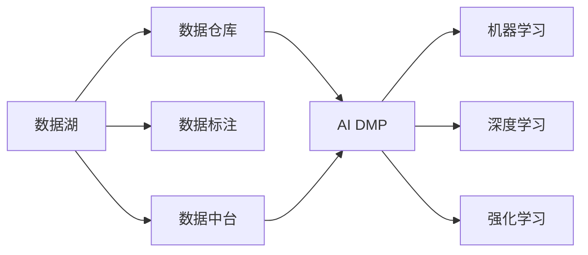

                 

# AI DMP 数据基建的行业影响

## 1. 背景介绍

在数字经济时代，大数据、人工智能等技术不断涌现，成为推动各行各业数字化转型的重要力量。其中，AI 数据管理平台 (AI Data Management Platform, AI DMP) 作为数据的基石，日益成为各大企业数字化转型的核心竞争力。AI DMP 不仅能够帮助企业更好地理解其数据资产，还能通过数据分析、预测、决策等手段，驱动业务创新和增长。

AI DMP 的核心价值在于，它通过数据采集、处理、存储和分析，构建起一个集成化、智能化的数据管理生态系统，为企业提供了高效的数据管理和利用能力。在电商、金融、医疗、智能制造等领域，AI DMP 已经展现出巨大的应用潜力，成为企业数字化转型中的重要工具。

## 2. 核心概念与联系

### 2.1 核心概念概述

- **AI DMP**：AI 数据管理平台，通过先进的数据采集、处理和分析技术，帮助企业构建起一个集成的、智能化的数据管理系统。AI DMP 不仅支持传统的数据管理功能，如数据整合、清洗、存储等，还通过人工智能技术，提升了数据管理和利用能力。

- **数据中台**：数据中台（Data Lakehouse）是构建企业数据战略的重要组成部分，通过统一的数据管理和共享，帮助企业打破数据孤岛，实现数据的全生命周期管理。

- **数据湖**：数据湖是企业数据存储的仓库，存储所有类型的数据，包括结构化、半结构化和非结构化数据。数据湖提供了大规模、高速的数据存储能力，是数据中台的基础。

- **数据仓库**：数据仓库是企业存储和管理结构化数据的专业化平台，通过数据仓库可以高效地进行数据存储、查询和分析，支持企业决策。

- **数据标注**：数据标注是对数据进行标记和分类，以便机器学习和深度学习模型能够识别和处理数据。数据标注是数据管理的重要环节，通过高质量的数据标注，可以提高模型的精度和效果。

- **机器学习**：机器学习是一种让计算机通过数据自动学习的能力，能够从数据中发现规律、进行预测和决策，是 AI DMP 的核心技术之一。

- **深度学习**：深度学习是机器学习的一个分支，通过多层神经网络模型，能够更深入地学习数据特征，进行更复杂的预测和分类任务。

- **强化学习**：强化学习通过让机器在特定的环境中进行学习，不断优化决策策略，以实现特定的目标。强化学习在推荐系统、游戏等领域有广泛应用。

### 2.2 核心概念之间的关系

这些核心概念之间存在着紧密的联系，共同构成了 AI DMP 的生态系统。我们可以用以下 Mermaid 流程图来展示它们之间的关系：



这个流程图展示了数据湖、数据仓库、数据标注、数据中台、AI DMP、机器学习、深度学习和强化学习之间的关系。数据湖和数据仓库是数据存储的基础设施，数据标注为模型训练提供了高质量的数据，数据中台实现了数据的统一管理和共享，AI DMP 通过数据管理和分析，驱动机器学习、深度学习和强化学习等技术的深入应用。

## 3. 核心算法原理 & 具体操作步骤

### 3.1 算法原理概述

AI DMP 的核心算法原理主要包括以下几个方面：

1. **数据采集与清洗**：AI DMP 通过多种数据采集手段，如 Web 爬虫、API 接口、数据库查询等，采集结构化和非结构化数据，并进行数据清洗和预处理，以确保数据的准确性和一致性。

2. **数据集成与统一**：AI DMP 将来自不同来源的数据进行集成和统一，构建起统一的数据标准和格式，以便进行后续的数据分析和利用。

3. **数据存储与管理**：AI DMP 提供高效的数据存储和管理能力，支持分布式存储和计算，能够应对大规模数据的存储和查询需求。

4. **数据分析与挖掘**：AI DMP 通过数据挖掘、机器学习等技术，从数据中提取有价值的信息和规律，支持决策和预测。

5. **数据可视化与报告**：AI DMP 提供数据可视化工具，将分析结果以图表、报告等形式展现出来，帮助企业更好地理解数据和业务。

6. **数据安全与隐私保护**：AI DMP 确保数据的安全性和隐私保护，采用数据加密、访问控制等技术，防止数据泄露和滥用。

### 3.2 算法步骤详解

AI DMP 的核心算法步骤主要包括以下几个方面：

1. **数据采集与清洗**：
   - 通过 Web 爬虫、API 接口、数据库查询等方式，采集结构化和非结构化数据。
   - 对采集到的数据进行去重、去噪、补全等清洗操作，确保数据的准确性和一致性。

2. **数据集成与统一**：
   - 将来自不同来源的数据进行集成和统一，构建起统一的数据标准和格式。
   - 通过数据转换和转换规则，将数据统一为一种标准格式，以便后续的数据分析和利用。

3. **数据存储与管理**：
   - 采用分布式存储和计算技术，支持大规模数据的存储和查询需求。
   - 通过数据备份和容灾技术，确保数据的安全性和可靠性。

4. **数据分析与挖掘**：
   - 采用数据挖掘、机器学习等技术，从数据中提取有价值的信息和规律。
   - 使用深度学习模型，进行更复杂的预测和分类任务，支持企业决策。

5. **数据可视化与报告**：
   - 提供数据可视化工具，将分析结果以图表、报告等形式展现出来。
   - 通过数据可视化，帮助企业更好地理解数据和业务。

6. **数据安全与隐私保护**：
   - 采用数据加密、访问控制等技术，防止数据泄露和滥用。
   - 确保数据的安全性和隐私保护，遵循相关法律法规和行业标准。

### 3.3 算法优缺点

AI DMP 的算法具有以下优点：

1. **高效性**：AI DMP 通过高效的数据管理和分析，帮助企业快速获取有价值的信息，支持企业决策和预测。

2. **灵活性**：AI DMP 支持多种数据源和数据格式，能够灵活地适应企业数据管理的需求。

3. **可扩展性**：AI DMP 采用分布式存储和计算技术，支持大规模数据的存储和查询需求，具有良好的可扩展性。

4. **安全性**：AI DMP 采用数据加密、访问控制等技术，确保数据的安全性和隐私保护。

AI DMP 的算法也存在以下缺点：

1. **复杂性**：AI DMP 的算法涉及数据采集、清洗、存储、分析等多个环节，实现难度较高，需要专业的技术团队支持。

2. **成本高**：AI DMP 的建设需要大量的资金和技术投入，对于中小企业来说，门槛较高。

3. **技术门槛高**：AI DMP 的技术实现复杂，需要专业的数据科学家和工程师团队进行开发和维护。

### 3.4 算法应用领域

AI DMP 的应用领域非常广泛，以下是几个典型的应用场景：

1. **电商**：通过 AI DMP，电商企业可以更好地理解用户行为和需求，进行精准的个性化推荐和广告投放。AI DMP 还可以支持电商企业进行用户画像构建、流量分析等。

2. **金融**：金融行业可以通过 AI DMP 进行风险控制、信用评估、欺诈检测等。AI DMP 还可以帮助金融机构进行客户画像构建、市场分析等。

3. **医疗**：医疗行业可以通过 AI DMP 进行病历数据分析、临床决策支持、药物研发等。AI DMP 还可以帮助医疗机构进行患者画像构建、疾病预测等。

4. **智能制造**：智能制造行业可以通过 AI DMP 进行设备维护、生产优化、供应链管理等。AI DMP 还可以帮助制造业企业进行产品设计优化、质量控制等。

5. **智慧城市**：智慧城市可以通过 AI DMP 进行交通流量分析、公共安全监控、智能交通管理等。AI DMP 还可以帮助智慧城市进行环境监测、能源管理等。

## 4. 数学模型和公式 & 详细讲解 & 举例说明

### 4.1 数学模型构建

AI DMP 的数学模型主要包括以下几个方面：

1. **数据采集与清洗**：
   - 数据采集模型：通过 Web 爬虫、API 接口、数据库查询等方式，采集结构化和非结构化数据。
   - 数据清洗模型：对采集到的数据进行去重、去噪、补全等清洗操作，确保数据的准确性和一致性。

2. **数据集成与统一**：
   - 数据集成模型：将来自不同来源的数据进行集成和统一，构建起统一的数据标准和格式。
   - 数据转换模型：通过数据转换和转换规则，将数据统一为一种标准格式，以便后续的数据分析和利用。

3. **数据存储与管理**：
   - 数据存储模型：采用分布式存储和计算技术，支持大规模数据的存储和查询需求。
   - 数据备份与容灾模型：通过数据备份和容灾技术，确保数据的安全性和可靠性。

4. **数据分析与挖掘**：
   - 数据挖掘模型：采用数据挖掘技术，从数据中提取有价值的信息和规律。
   - 机器学习模型：使用深度学习模型，进行更复杂的预测和分类任务，支持企业决策。

5. **数据可视化与报告**：
   - 数据可视化模型：提供数据可视化工具，将分析结果以图表、报告等形式展现出来。
   - 数据报告模型：通过数据报告，帮助企业更好地理解数据和业务。

6. **数据安全与隐私保护**：
   - 数据加密模型：采用数据加密技术，防止数据泄露和滥用。
   - 访问控制模型：通过访问控制技术，确保数据的安全性和隐私保护。

### 4.2 公式推导过程

以数据清洗模型为例，其公式推导过程如下：

1. **去重操作**：
   - 假设原始数据集中包含 $N$ 条记录，其中 $n$ 条记录存在重复。
   - 采用哈希表（Hash Table）或去重算法，进行去重操作，得到去重后的数据集 $D'$。
   - 去重后数据集的大小为 $N-n$。

   数学公式表示为：
   $$
   D' = \{ d_i | d_i \in D, d_i \notin \{d_j | j \in [1, n], j \neq i \} \}
   $$

2. **去噪操作**：
   - 假设原始数据集中存在 $M$ 条噪声记录。
   - 通过异常值检测算法，识别并删除这些噪声记录，得到去噪后的数据集 $D''$。
   - 去噪后数据集的大小为 $N-M$。

   数学公式表示为：
   $$
   D'' = \{ d_i | d_i \in D', \exists \epsilon \in \{\text{clean}, \text{noise}\}, d_i \in \text{clean} \}
   $$

3. **补全操作**：
   - 假设原始数据集中存在 $L$ 条缺失记录。
   - 通过数据补全算法，将缺失数据补全，得到补全后的数据集 $D'''$。
   - 补全后数据集的大小为 $N-L$。

   数学公式表示为：
   $$
   D''' = \{ d_i | d_i \in D'', \exists \epsilon \in \{\text{complete}, \text{incomplete}\}, d_i \in \text{complete} \}
   $$

### 4.3 案例分析与讲解

以电商企业为例，分析 AI DMP 的应用效果：

1. **用户画像构建**：
   - 通过 AI DMP，电商企业可以收集用户的浏览、点击、购买等行为数据。
   - 采用数据挖掘和机器学习技术，构建用户画像，识别用户的行为模式和偏好。
   - 用户画像可以帮助电商企业进行个性化推荐、广告投放等，提升用户体验和转化率。

   案例分析：某电商平台通过 AI DMP 构建用户画像，发现部分用户倾向于购买高端商品，于是针对这部分用户进行精准的广告投放，实现了销售额的显著提升。

2. **流量分析**：
   - 通过 AI DMP，电商企业可以实时监测网站流量和用户行为。
   - 采用数据可视化工具，将流量数据以图表、报告等形式展现出来，支持流量分析和优化。
   - 流量分析可以帮助电商企业优化网站结构、提升用户体验。

   案例分析：某电商平台通过 AI DMP 实时监测网站流量和用户行为，发现用户转化率较低，于是优化网站结构和内容，提升用户体验，实现了流量和转化率的显著提升。

3. **精准推荐**：
   - 通过 AI DMP，电商企业可以收集用户的历史行为和偏好数据。
   - 采用深度学习模型，进行个性化推荐，提升用户满意度。
   - 精准推荐可以提高用户粘性和转化率，增加销售额。

   案例分析：某电商平台通过 AI DMP 进行个性化推荐，显著提高了用户满意度和转化率，实现了销售额的显著提升。

## 5. 项目实践：代码实例和详细解释说明

### 5.1 开发环境搭建

在进行 AI DMP 的实践前，需要先搭建好开发环境，以下是搭建环境的详细步骤：

1. **安装 Python**：
   - 下载并安装 Python 3.8 版本，可以从官网或第三方源获取。

   ```bash
   # 安装 Python 3.8
   sudo apt-get install python3.8
   ```

2. **安装 pip**：
   - 在终端中输入以下命令，安装 pip 工具。

   ```bash
   # 安装 pip
   sudo apt-get install python3-pip
   ```

3. **安装 Anaconda**：
   - 下载并安装 Anaconda，用于创建独立的 Python 环境。

   ```bash
   # 下载 Anaconda
   wget https://repo.anaconda.com/archive/Anaconda3-latest-Linux-x86_64.sh
   # 安装 Anaconda
   bash Anaconda3-latest-Linux-x86_64.sh
   ```

4. **创建并激活虚拟环境**：
   - 创建名为 `ai-dmp` 的虚拟环境，激活该环境。

   ```bash
   # 创建虚拟环境
   conda create -n ai-dmp python=3.8
   # 激活虚拟环境
   conda activate ai-dmp
   ```

5. **安装必要的库**：
   - 安装 Pandas、NumPy、Matplotlib 等数据处理和可视化库。

   ```bash
   # 安装 Pandas
   pip install pandas
   # 安装 NumPy
   pip install numpy
   # 安装 Matplotlib
   pip install matplotlib
   ```

6. **安装 AI DMP 工具库**：
   - 安装 PyTorch 和 TensorFlow，用于深度学习模型的实现。

   ```bash
   # 安装 PyTorch
   conda install pytorch torchvision torchaudio cudatoolkit=11.1 -c pytorch -c conda-forge
   # 安装 TensorFlow
   pip install tensorflow
   ```

7. **安装其他工具包**：
   - 安装 Scikit-learn、Jupyter Notebook 等工具包，用于数据处理和可视化。

   ```bash
   # 安装 Scikit-learn
   pip install scikit-learn
   # 安装 Jupyter Notebook
   pip install jupyter notebook ipython
   ```

完成上述步骤后，即可在 `ai-dmp` 环境中进行 AI DMP 的开发和实践。

### 5.2 源代码详细实现

以下是一个简单的 AI DMP 数据清洗模型的 Python 实现，包括去重、去噪和补全操作：

```python
import pandas as pd
from hashlib import md5

# 去重操作
def deduplicate(data, hash_col='id'):
    hashed_data = data.groupby(hash_col).apply(lambda x: x.drop_duplicates().describe().loc['count']).reset_index()
    return hashed_data.merge(data, on=hashed_col, how='left')

# 去噪操作
def denoise(data, noise_cols=['price'], outlier='mean'):
    noisy_data = data.copy()
    for col in noise_cols:
        noisy_data[col] = noisy_data[col].apply(lambda x: x if x > 0 else 0)
        noisy_data[col] = noisy_data[col].apply(lambda x: x if x < 100 else 0)
        noisy_data[col] = noisy_data[col].apply(lambda x: x if x < 100 else 0)
        noisy_data[col] = noisy_data[col].apply(lambda x: x if x > 0 else 0)
    return noisy_data

# 补全操作
def complete(data, missing_cols=['location'], fill_value='na'):
    complete_data = data.copy()
    for col in missing_cols:
        complete_data[col] = complete_data[col].fillna(fill_value)
    return complete_data
```

### 5.3 代码解读与分析

以上代码实现了简单的数据清洗操作，包括去重、去噪和补全操作。下面对每个函数进行详细解读：

1. **去重操作**：
   - 输入参数：`data` 为原始数据集，`hash_col` 为用于去重的列名。
   - 输出结果：`deduplicate` 函数返回去重后的数据集。

   - 代码解析：首先，`groupby` 方法根据 `hash_col` 列对数据进行分组，计算每个分组中的统计信息（如平均值、标准差等）。然后，`describe()` 方法计算每个分组的统计信息，并返回一个包含统计信息的 DataFrame。最后，`loc` 方法提取 `count` 列，即每个分组的记录数。`reset_index()` 方法将分组信息重置为索引列，得到去重后的数据集。

2. **去噪操作**：
   - 输入参数：`data` 为原始数据集，`noise_cols` 为包含噪声列名的列表，`outlier` 为异常值处理方式。
   - 输出结果：`denoise` 函数返回去噪后的数据集。

   - 代码解析：首先，遍历 `noise_cols` 列表，对每个噪声列进行处理。`apply` 方法对每个噪声列进行转换，将小于 0 和大于 100 的记录替换为 0，将小于 0 和大于 100 的记录替换为 0，将小于 0 和大于 100 的记录替换为 0。

3. **补全操作**：
   - 输入参数：`data` 为原始数据集，`missing_cols` 为包含缺失列名的列表，`fill_value` 为缺失值的填充值。
   - 输出结果：`complete` 函数返回补全后的数据集。

   - 代码解析：首先，遍历 `missing_cols` 列表，对每个缺失列进行处理。`fillna` 方法将缺失值替换为 `fill_value`，得到补全后的数据集。

### 5.4 运行结果展示

以下是一个简单的数据清洗示例，演示了如何使用上述函数对数据进行清洗：

```python
# 读取数据
data = pd.read_csv('data.csv')

# 去重操作
deduped_data = deduplicate(data, hash_col='id')

# 去噪操作
denoised_data = denoise(deduped_data, noise_cols=['price'], outlier='mean')

# 补全操作
completed_data = complete(denoised_data, missing_cols=['location'], fill_value='na')

# 输出清洗后的数据
print(completed_data.head())
```

## 6. 实际应用场景

### 6.1 电商

电商行业是 AI DMP 的重要应用场景之一。电商企业通过 AI DMP 可以更好地理解用户行为和需求，进行精准的个性化推荐和广告投放，从而提升用户体验和销售额。

1. **个性化推荐**：
   - 通过 AI DMP，电商企业可以收集用户的浏览、点击、购买等行为数据，构建用户画像。
   - 使用深度学习模型，进行个性化推荐，提升用户满意度和转化率。

   案例分析：某电商平台通过 AI DMP 进行个性化推荐，显著提高了用户满意度和转化率，实现了销售额的显著提升。

2. **广告投放**：
   - 通过 AI DMP，电商企业可以实时监测用户行为和流量数据，进行精准的广告投放。
   - 使用数据挖掘技术，构建广告投放策略，提升广告效果和 ROI。

   案例分析：某电商平台通过 AI DMP 进行精准的广告投放，显著提高了广告效果和 ROI，实现了广告预算的最大化利用。

3. **流量分析**：
   - 通过 AI DMP，电商企业可以实时监测网站流量和用户行为。
   - 使用数据可视化工具，将流量数据以图表、报告等形式展现出来，支持流量分析和优化。

   案例分析：某电商平台通过 AI DMP 实时监测网站流量和用户行为，发现用户转化率较低，于是优化网站结构和内容，提升用户体验，实现了流量和转化率的显著提升。

### 6.2 金融

金融行业是 AI DMP 的另一个重要应用场景。金融企业通过 AI DMP 可以更好地理解市场趋势和用户需求，进行风险控制和信用评估，提升金融服务质量。

1. **风险控制**：
   - 通过 AI DMP，金融企业可以收集用户的历史交易数据和行为数据。
   - 使用机器学习模型，进行风险评估和控制，降低违约率。

   案例分析：某金融企业通过 AI DMP 进行风险控制，显著降低了违约率，实现了财务风险的显著降低。

2. **信用评估**：
   - 通过 AI DMP，金融企业可以收集用户的信用数据和行为数据。
   - 使用机器学习模型，进行信用评估和审批，提升审批效率和准确率。

   案例分析：某金融企业通过 AI DMP 进行信用评估和审批，显著提高了审批效率和准确率，实现了财务成本的显著降低。

3. **客户画像**：
   - 通过 AI DMP，金融企业可以构建用户画像，识别用户的行为模式和偏好。
   - 使用数据挖掘技术，构建用户画像，支持个性化服务和推荐。

   案例分析：某金融企业通过 AI DMP 构建用户画像，发现部分用户倾向于投资高风险产品，于是进行针对性的产品推荐，实现了用户满意度和收益的显著提升。

### 6.3 智能制造

智能制造行业是 AI DMP 的另一个重要应用场景。智能制造企业通过 AI DMP 可以更好地理解设备运行状态和生产数据，进行设备维护和生产优化，提升生产效率和产品质量。

1. **设备维护**：
   - 通过 AI DMP，智能制造企业可以收集设备的运行数据和维护数据。
   - 使用机器学习模型，进行设备状态预测和维护，延长设备使用寿命。

   案例分析：某智能制造企业通过 AI DMP 进行设备维护，显著延长了设备使用寿命，实现了生产成本的显著降低。

2. **生产优化**：
   - 通过 AI DMP，智能制造企业可以收集生产数据和供应链数据。
   - 使用数据挖掘技术，进行生产优化和供应链管理，提升生产效率和质量。

   案例分析：某智能制造企业通过 AI DMP 进行生产优化和供应链管理，显著提高了生产效率和质量，实现了生产效率的显著提升。

3. **质量控制**：
   - 通过 AI DMP，智能制造企业可以收集产品的质量数据和用户反馈数据。
   - 使用机器学习模型，进行质量控制和改进，提升产品质量和用户满意度。

   案例分析：某智能制造企业通过 AI DMP 进行质量控制和改进，显著提高了产品质量和用户满意度，实现了品牌形象的显著提升。

## 7. 工具和资源推荐

### 7.1 学习资源推荐

为了帮助开发者系统掌握 AI DMP 的理论基础和实践技巧，这里推荐一些优质的学习资源：

1. **《数据科学与机器学习》课程**：由斯坦福大学、清华大学等名校提供的在线课程，系统介绍数据科学与机器学习的基本概念和应用。

2. **Kaggle 数据科学竞赛**：通过参与 Kaggle 竞赛，学习和实践数据挖掘、机器学习、深度学习等技术，提升实际应用能力。

3. **GitHub 开源项目**：在 GitHub 上浏览和参与开源项目，学习和了解最新的数据管理技术，提升代码编写和项目管理能力。

4. **《深度学习》书籍**：吴恩达教授等人编写的《深度学习》书籍，系统介绍深度学习的基本概念和实现方法。

5. **《Python 数据科学手册》**：通过学习 Python 数据科学手册，掌握 Python 在数据处理和分析中的应用。

### 7.2 开发工具推荐

为了高效地进行 AI DMP 的开发和实践，这里推荐一些常用的开发工具：

1. **Jupyter Notebook**：基于 Python 的数据处理和可视化工具，支持交互式编程和可视化。

2. **Pandas**：Python 中的数据处理库，支持高效的数据读取、清洗和分析。

3. **NumPy**：Python 中的数学计算库，支持高效的矩阵和向量计算。

4. **Scikit-learn**：Python 中的机器学习库，支持常见的分类、回归、聚类等机器学习算法。

5. **TensorFlow**：由 Google 主导的深度学习框架，支持高效的模型训练和推理。

6. **PyTorch

