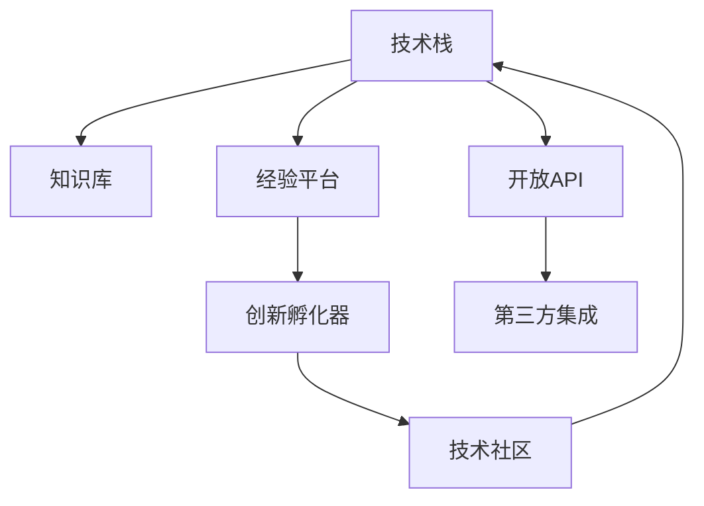
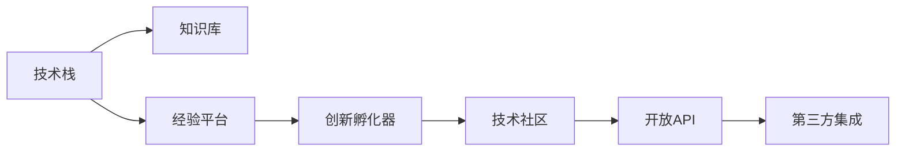

                 

# AI 基础设施的文化传承：数字化保护与创新

## 1. 背景介绍

### 1.1 问题由来

在当前数字化转型加速的背景下，AI基础设施在各行各业的应用变得越来越广泛。然而，伴随技术进步，我们也面临着如何在技术传承和创新之间找到平衡的挑战。AI基础设施的文化传承，即如何将技术知识、经验智慧和创新能力有效地代代相传，成为了一个关键问题。

### 1.2 问题核心关键点

要回答这一问题，首先需要理解“文化传承”在AI基础设施中的具体体现：

- **知识传递**：将历史积累的算法、模型和架构知识传递给新一代开发者。
- **经验分享**：分享实际项目中的成功经验和失败教训，避免重复犯错。
- **创新启发**：激发年轻开发者的创新精神，推动技术前沿探索。

这三个方面构成了AI基础设施文化传承的核心内容。

### 1.3 问题研究意义

探讨AI基础设施文化传承，对于保持技术生态的持续发展和稳定演进，具有重要意义：

1. **稳定发展**：确保技术的迭代和进步能够平稳进行，避免技术断层。
2. **资源高效**：通过知识的共享和经验的积累，提升资源使用效率，减少开发成本。
3. **创新驱动**：激发新一代开发者的创造力，推动技术前沿的发展。
4. **产业升级**：助力行业数字化转型，提升产业整体竞争力。

## 2. 核心概念与联系

### 2.1 核心概念概述

为深入理解AI基础设施的文化传承，我们需先了解一些关键概念：

- **技术栈**：指在特定项目或技术领域内常用的工具、框架、语言等技术组件。
- **知识库**：存储技术知识、算法原理、模型架构等的知识管理平台。
- **经验平台**：提供实际项目案例、代码示例和问题解决策略的平台。
- **创新孵化器**：支持新技术研究和实验的实验室或项目平台。
- **技术社区**：开发者交流、分享、协作的社区，包括在线论坛、开源项目和线下活动等。

### 2.2 概念间的关系

这些概念之间的关系可以通过以下Mermaid流程图来展示：



该图展示了技术栈在文化传承中的角色，以及各组成部分之间的互动关系：

1. **技术栈和知识库**：技术栈是知识库的基础，知识库则提供了技术栈使用的知识和原理。
2. **经验平台和创新孵化器**：经验平台通过实际案例分享积累的经验，创新孵化器通过实验和创新推动技术进步。
3. **技术社区和开放API**：技术社区促进了知识的交流和分享，开放API和第三方集成则扩大了技术的应用范围。

### 2.3 核心概念的整体架构

最后，我们用一个综合的流程图来展示这些核心概念在AI基础设施文化传承中的整体架构：



这个综合流程图展示了从技术栈到知识库，再到经验平台和创新孵化器，最终通过技术社区和第三方集成的文化传承路径。通过这些组件的协同作用，AI基础设施的知识和技术得以有效传承和创新。

## 3. 核心算法原理 & 具体操作步骤

### 3.1 算法原理概述

AI基础设施的文化传承，本质上是知识的传递和创新。其核心算法原理包括知识表示、经验积累和创新激发。

**知识表示**：将技术知识、算法原理和模型架构等以结构化的方式表示出来，便于存储、检索和应用。

**经验积累**：通过经验平台，收集和整理实际项目中的成功经验和失败教训，形成可复用的模板和策略。

**创新激发**：通过创新孵化器，支持新技术的研究和实验，推动技术前沿的发展。

### 3.2 算法步骤详解

AI基础设施的文化传承算法步骤如下：

1. **知识采集**：从技术文档、论文、代码库等渠道，采集技术知识。
2. **知识表示**：将采集到的知识以结构化的方式表示，如自然语言处理、知识图谱等。
3. **经验分享**：在经验平台上，将成功经验和失败教训进行分享和讨论，形成文档和案例库。
4. **创新推动**：在创新孵化器中，支持新技术的研究和实验，促进技术突破。
5. **技术社区**：在技术社区中，开发者交流和分享知识，协作解决问题。

### 3.3 算法优缺点

AI基础设施文化传承算法的优点包括：

- **知识传承**：系统地保存和传承技术知识，避免重复发明轮子。
- **经验借鉴**：通过案例学习和失败教训，提高技术应用成功率。
- **创新加速**：提供技术实验和创新的环境，推动前沿探索。

其缺点包括：

- **学习曲线**：新手需要时间学习和适应新系统。
- **资源消耗**：知识库和经验平台的维护和更新需要大量资源。
- **技术迭代**：若知识更新不及时，可能导致技术落伍。

### 3.4 算法应用领域

AI基础设施文化传承算法在以下几个领域有广泛应用：

- **软件开发**：通过版本控制和文档库，传承代码和技术栈知识。
- **机器学习**：通过模型库和算法文档，传承模型和架构知识。
- **云计算**：通过服务文档和最佳实践，传承云基础设施的使用经验。
- **智能制造**：通过工艺文档和案例库，传承智能制造技术。
- **医疗健康**：通过病历系统和经验库，传承医疗技术和知识。

## 4. 数学模型和公式 & 详细讲解  
### 4.1 数学模型构建

为更好地描述AI基础设施的文化传承过程，我们引入以下几个数学模型：

- **知识库模型**：表示技术知识和算法原理的结构化数据库。
- **经验平台模型**：记录项目成功和失败案例的文档库。
- **创新孵化器模型**：描述新技术实验和研究的过程模型。
- **技术社区模型**：模拟开发者交流和协作的社会网络模型。

### 4.2 公式推导过程

**知识库模型**：

$$
K = \{(k_i, v_i)\}_{i=1}^n
$$

其中，$k_i$ 表示知识点的符号表示，$v_i$ 表示对应的描述。

**经验平台模型**：

$$
E = \{(e_j, s_j)\}_{j=1}^m
$$

其中，$e_j$ 表示项目案例，$s_j$ 表示案例的具体描述和策略。

**创新孵化器模型**：

$$
I = \{(i_k, o_k, t_k)\}_{k=1}^p
$$

其中，$i_k$ 表示实验编号，$o_k$ 表示实验结果，$t_k$ 表示实验时间。

**技术社区模型**：

$$
C = \{(c_l, d_l, n_l)\}_{l=1}^q
$$

其中，$c_l$ 表示交流内容，$d_l$ 表示交流时间，$n_l$ 表示参与者数量。

### 4.3 案例分析与讲解

以下以机器学习领域为例，说明如何应用上述数学模型：

**知识库案例**：收集并结构化存储机器学习算法和模型文档。例如，可以将算法原理、模型架构、代码示例等组织成文档，存入知识库。

**经验平台案例**：整理并分享机器学习项目的经验案例。例如，可以将成功项目和失败案例的总结和改进策略整理成文档，存入经验平台。

**创新孵化器案例**：推动新技术的研究和实验。例如，可以创建实验项目，探索新算法和新模型，形成创新成果，存入创新孵化器。

**技术社区案例**：促进开发者之间的交流和协作。例如，可以创建在线论坛和开源项目，开发者在论坛上讨论问题，在项目上协作开发和贡献代码。

## 5. 项目实践：代码实例和详细解释说明

### 5.1 开发环境搭建

要进行AI基础设施文化传承的实践，首先需要搭建开发环境。以下是Python和Jupyter Notebook的搭建步骤：

1. **安装Anaconda**：从官网下载并安装Anaconda，用于创建独立的Python环境。

2. **创建并激活虚拟环境**：
```bash
conda create -n my_env python=3.9
conda activate my_env
```

3. **安装依赖库**：
```bash
conda install jupyterlab notebook matplotlib pandas numpy transformers
```

4. **启动Jupyter Notebook**：
```bash
jupyter lab
```

完成上述步骤后，即可在Jupyter Notebook中开始文化传承的实践工作。

### 5.2 源代码详细实现

下面以GitHub上的开源项目为例，展示如何使用Python实现AI基础设施文化传承的代码：

```python
import pandas as pd
import matplotlib.pyplot as plt

# 定义知识库、经验平台、创新孵化器和社区的DataFrame
knowledge_df = pd.DataFrame(columns=['id', 'name', 'description'])
experience_df = pd.DataFrame(columns=['id', 'project', 'strategy'])
innovation_df = pd.DataFrame(columns=['id', 'experiment', 'result', 'time'])
community_df = pd.DataFrame(columns=['id', 'topic', 'time', 'participants'])

# 数据填充示例
knowledge_df.loc[0] = {'id': 1, 'name': '机器学习算法', 'description': '机器学习常用算法介绍'}
experience_df.loc[0] = {'id': 1, 'project': '项目A', 'strategy': '使用XGBoost解决数据不平衡问题'}
innovation_df.loc[0] = {'id': 1, 'experiment': '实验1', 'result': '提高模型准确度10%'}
community_df.loc[0] = {'id': 1, 'topic': '机器学习', 'time': '2023-01-01', 'participants': '50人'}

# 展示数据
knowledge_df.head()
```

### 5.3 代码解读与分析

**代码解析**：

- **DataFrame定义**：定义了知识库、经验平台、创新孵化器和社区的DataFrame，并为每个DataFrame定义了列名。
- **数据填充**：使用`.loc[]`方法向DataFrame中添加示例数据。
- **数据展示**：使用`.head()`方法展示部分数据。

**分析要点**：

- **数据结构**：通过定义DataFrame，明确了知识库、经验平台、创新孵化器和社区的数据结构。
- **数据更新**：使用`.loc[]`方法，方便对DataFrame进行增删改操作。
- **数据分析**：通过简单的数据展示，验证了数据结构和数据填充的效果。

### 5.4 运行结果展示

假设我们在上述DataFrame中添加更多数据，并使用Matplotlib展示知识库的简单统计信息：

```python
# 添加更多数据
knowledge_df.loc[1] = {'id': 2, 'name': '深度学习模型', 'description': '深度学习常用模型介绍'}
knowledge_df.loc[2] = {'id': 3, 'name': '自然语言处理', 'description': '自然语言处理常用方法介绍'}

# 展示统计信息
knowledge_df.describe()

# 可视化展示
knowledge_df['name'].value_counts().plot(kind='bar', figsize=(8, 6))
plt.title('知识库中各类知识点的数量')
plt.xlabel('知识点')
plt.ylabel('数量')
plt.show()
```

结果展示了知识库中各类知识点的数量，并通过柱状图直观展示了知识库中各类知识点的分布情况。

## 6. 实际应用场景

### 6.1 软件开发

在软件开发领域，文化传承可以通过以下方式实现：

- **知识库**：通过GitHub、GitLab等代码托管平台，保存项目文档和技术栈信息。
- **经验平台**：通过在线开发平台，如Gitee、Bitbucket，分享项目经验、代码示例和最佳实践。
- **创新孵化器**：通过开源社区，如Apache、Linux Foundation，推动新技术和框架的研究和实验。
- **技术社区**：通过开发者社区，如Stack Overflow、GitHub Issues，促进开发者之间的交流和协作。

### 6.2 机器学习

在机器学习领域，文化传承可以通过以下方式实现：

- **知识库**：通过Scikit-learn、TensorFlow等官方文档，保存模型和算法文档。
- **经验平台**：通过Kaggle、PaperWithCode，分享项目经验、模型比较和案例分析。
- **创新孵化器**：通过Google Research、Facebook AI Research，推动新算法和模型的研究和实验。
- **技术社区**：通过AI Stack Exchange、Twitter，促进开发者之间的交流和协作。

### 6.3 云计算

在云计算领域，文化传承可以通过以下方式实现：

- **知识库**：通过AWS、Google Cloud等官方文档，保存云服务文档和最佳实践。
- **经验平台**：通过CloudFormation、Terraform等工具，分享云架构和部署经验。
- **创新孵化器**：通过Amazon AWS Labs、Google Cloud Labs，推动云基础设施的研究和实验。
- **技术社区**：通过AWS Developer Day、Google Cloud Next，促进开发者之间的交流和协作。

## 7. 工具和资源推荐

### 7.1 学习资源推荐

要深入学习AI基础设施文化传承，需要掌握以下关键资源：

- **官方文档**：如GitHub、GitLab、AWS、Google Cloud等平台的官方文档，提供了全面的技术知识和最佳实践。
- **开源项目**：如Scikit-learn、TensorFlow、PyTorch等，通过开源项目学习最新的技术趋势和创新应用。
- **在线课程**：如Coursera、edX、Udacity等平台上的NLP、机器学习、软件开发等课程，提供系统的理论学习和实践经验。
- **博客和论坛**：如Medium、Stack Overflow、GitHub Issues等，通过开发者分享的技术文章和问题，了解最新技术动态。

### 7.2 开发工具推荐

以下是一些常用的开发工具，用于AI基础设施文化传承的实践：

- **GitHub/GitLab**：代码托管和版本控制平台，支持知识库和经验平台的构建。
- **Jupyter Notebook**：交互式编程环境，方便数据处理和代码演示。
- **Matplotlib/Seaborn**：数据可视化工具，方便统计分析和结果展示。
- **Docker/Kubernetes**：容器化管理平台，支持分布式实验和应用的部署。
- **HuggingFace**：自然语言处理框架，提供了丰富的预训练模型和微调工具。

### 7.3 相关论文推荐

要深入研究AI基础设施文化传承，需要参考以下关键论文：

- **软件知识管理**：如《Knowledge Mining: Exploiting Software Repositories for Code Evolution Analysis》，研究软件知识管理的框架和方法。
- **社区研究**：如《A Survey on Mining Developer Communities》，探索开发者社区的知识交流和协作模式。
- **知识图谱**：如《Knowledge Graphs for Software Evolution》，探讨知识图谱在软件知识管理中的应用。
- **开源文化**：如《The Economics of Open Source Innovation》，研究开源社区的创新机制和经济模型。

## 8. 总结：未来发展趋势与挑战

### 8.1 总结

本文详细探讨了AI基础设施文化传承的原理、操作步骤和实际应用，通过数学模型和代码实例，深入分析了知识库、经验平台、创新孵化器和技术社区的构建方法和实践技巧。通过案例分析和应用场景展示，本文展示了AI基础设施文化传承在软件开发、机器学习和云计算等多个领域的成功应用。

通过本文的系统梳理，可以看出，AI基础设施的文化传承是一个多学科交叉、多技术融合的过程，涉及到知识管理、社区建设、技术实验等多个方面。只有系统地思考和实践，才能真正实现技术知识的传承和创新。

### 8.2 未来发展趋势

展望未来，AI基础设施文化传承将呈现以下几个发展趋势：

1. **知识自动化**：通过自然语言处理技术，自动从文档和代码中提取知识，构建知识库。
2. **经验机器化**：利用机器学习模型，自动分析项目经验，生成经验案例库。
3. **创新协作化**：通过分布式协作工具，促进跨团队、跨组织的创新协作。
4. **社区虚拟化**：利用虚拟现实和增强现实技术，构建虚拟社区，提升交流体验。
5. **技术标准ization**：推动技术标准和规范的制定，提高技术生态的统一性和互操作性。

### 8.3 面临的挑战

尽管AI基础设施文化传承已取得初步进展，但在其发展过程中仍面临诸多挑战：

1. **知识碎片化**：不同技术栈和平台之间的知识难以整合，形成知识碎片。
2. **经验泛化差**：经验往往局限于特定项目，难以通用化。
3. **创新难度大**：新技术的实验和验证需要大量时间和资源。
4. **社区活跃度低**：开发者社区的活跃度不高，交流和协作不足。
5. **技术更新快**：技术更新迭代迅速，知识库和经验平台的维护难度大。

### 8.4 研究展望

为了应对上述挑战，未来的研究需要在以下几个方面寻求新的突破：

1. **知识集成**：开发知识集成平台，整合不同技术栈和平台的知识。
2. **经验泛化**：研究经验泛化技术，提升经验的通用性。
3. **创新加速**：开发创新加速工具，减少新技术的实验和验证时间。
4. **社区激励**：设计社区激励机制，提升开发者社区的活跃度和参与度。
5. **技术更新**：建立技术更新机制，确保知识库和经验平台的及时更新。

只有不断探索和创新，才能在AI基础设施文化传承中实现技术的持续发展和应用提升。

## 9. 附录：常见问题与解答

**Q1：如何构建知识库？**

A: 构建知识库需要以下步骤：

1. 定义知识库的结构，包括知识点、描述、来源等。
2. 从官方文档、学术论文、博客等渠道采集知识。
3. 将采集到的知识以结构化方式存储，如使用数据库或文档管理系统。
4. 定期更新和维护知识库，确保知识的时效性和准确性。

**Q2：如何分享项目经验？**

A: 分享项目经验需要以下步骤：

1. 将项目的目标、方法、结果和教训总结成文档或案例。
2. 将文档或案例上传到开源平台或社区，如GitHub、Kaggle等。
3. 在社区中发布经验分享，参与者可以通过评论、点赞等方式进行互动。
4. 定期回顾和更新经验分享，保持其时效性和相关性。

**Q3：如何激发创新？**

A: 激发创新需要以下步骤：

1. 设立创新孵化器，提供实验环境和资源支持。
2. 在孵化器中设立明确的创新目标，鼓励探索新技术和新方法。
3. 组织定期的创新分享会和评审会，展示创新成果，评估其价值。
4. 将创新成果整合到知识库和经验平台，提升其应用价值。

**Q4：如何维护社区活跃度？**

A: 维护社区活跃度需要以下步骤：

1. 建立社区规则，明确交流和协作的方式。
2. 定期组织在线或线下的交流活动，如技术研讨会、代码审查等。
3. 鼓励开发者贡献代码、分享经验，并提供相应的激励。
4. 及时解决社区中的问题和争议，保持社区的和谐氛围。

这些回答旨在帮助开发者更好地理解和实践AI基础设施的文化传承，通过不断探索和创新，推动技术的进步和应用的发展。

---

作者：禅与计算机程序设计艺术 / Zen and the Art of Computer Programming

