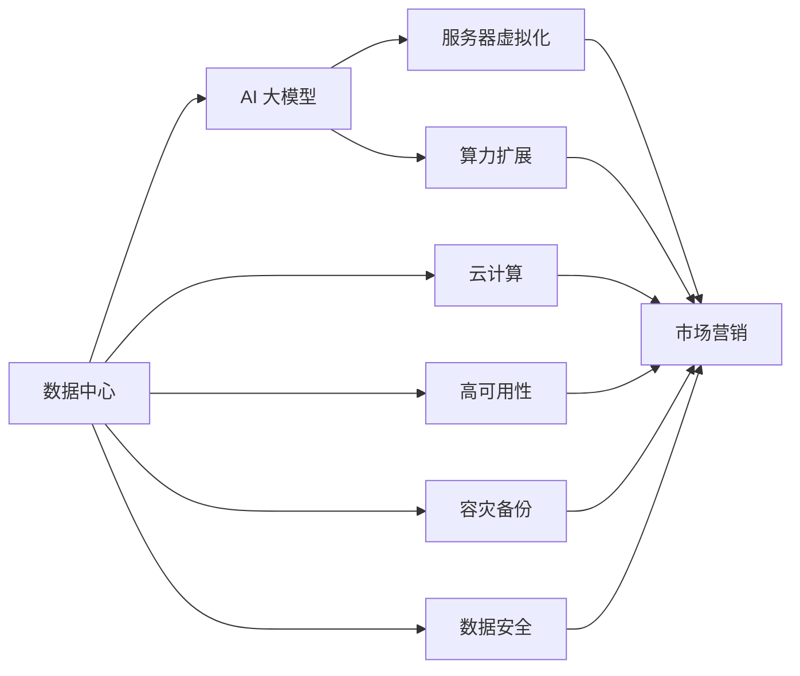

                 

# AI 大模型应用数据中心的市场营销

## 1. 背景介绍

在人工智能（AI）和大数据技术的迅猛发展下，数据中心已逐渐成为各类AI应用的核心基础设施。AI 大模型应用数据中心通过集中存储、高效处理和深度学习模型的训练与部署，为大数据分析和AI模型应用提供了有力保障。AI 大模型应用数据中心的市场营销策略不仅关系到企业产品竞争力，还影响到数据中心的整体盈利和发展。

本文章将从核心概念、算法原理、实际操作、数学模型、项目实践、应用场景、工具与资源推荐、发展趋势与挑战等维度，全面深入地剖析AI 大模型应用数据中心的市场营销策略。

## 2. 核心概念与联系

### 2.1 核心概念概述

**数据中心**：负责存储、处理和管理大规模数据的设施。AI 大模型应用数据中心不仅要提供硬件资源，还需支持深度学习模型的训练与部署，并为其提供高性能计算能力。

**AI 大模型**：指通过大规模无监督训练得到的具有强大学习能力的深度神经网络模型。在图像、语音、自然语言处理等领域中具有广泛应用。

**市场营销**：结合市场营销学理论，采用各种策略与方法，提升AI 大模型应用数据中心的知名度、用户数和盈利能力。

**云计算**：利用网络技术，通过互联网向用户提供高性能计算、存储与网络服务，是现代数据中心的重要模式之一。

**服务器虚拟化**：在一台物理服务器上运行多个虚拟服务器，提升资源利用率，降低运营成本。

**高可用性（High Availability, HA）**：指数据中心和云服务的可靠性，确保用户数据和服务的稳定运行，是数据中心的核心服务指标。

**容灾备份**：指在数据中心发生故障时，能够快速恢复数据和服务的机制。

**数据安全**：指数据中心的物理安全、网络安全和数据隐私保护，是数据中心运行的基础保障。

**算力扩展**：通过增加硬件设备或优化软件架构，提升数据中心的计算能力和存储能力。

这些核心概念构成了AI 大模型应用数据中心的市场营销基础，并与营销策略紧密相关。

### 2.2 概念间的关系

通过合成的Mermaid流程图展示核心概念之间的关系：



这个流程图展示了数据中心在AI 大模型应用中的关键角色和市场营销策略的实施路径。从基础的数据中心硬件，到云计算、服务器虚拟化等技术，再到算力扩展和数据安全，每一步都对市场营销策略的实施有着重要作用。

## 3. 核心算法原理 & 具体操作步骤

### 3.1 算法原理概述

AI 大模型应用数据中心市场营销的核心算法原理主要包括以下几个方面：

1. **需求分析**：通过对市场需求的深入分析，确定AI 大模型应用数据中心的服务对象、产品特点和市场定位。

2. **策略制定**：结合市场调研数据，制定详细的市场营销策略，涵盖产品定价、渠道选择、广告投放、客户关系管理等多个方面。

3. **效果评估**：通过市场反馈和数据分析，不断优化市场营销策略，提高市场份额和客户满意度。

### 3.2 算法步骤详解

1. **市场调研**：通过问卷调查、深度访谈、在线分析等方式收集用户需求和市场信息，为市场营销策略制定提供依据。

2. **竞争分析**：分析竞争对手的产品、定价、市场份额等信息，找到自身在市场上的优势和劣势。

3. **需求分析**：基于调研和分析结果，明确目标用户群体，包括企业客户、政府机构、学术研究等，确定其对AI 大模型应用数据中心的具体需求。

4. **策略制定**：根据需求分析和竞争分析，制定针对不同用户群体的个性化营销策略，包括产品定位、定价策略、推广渠道和促销手段等。

5. **效果评估**：采用指标如市场占有率、用户增长率、客户满意度等，对市场营销效果进行评估和优化。

### 3.3 算法优缺点

**优点**：

- **灵活性**：市场营销策略能够快速响应市场需求变化，灵活调整产品和服务。
- **可量化**：通过各种市场数据和指标，市场营销效果可以较为客观地进行量化评估。
- **可操作性**：每个策略步骤都有明确的执行流程和方法，便于实际落地。

**缺点**：

- **周期长**：从策略制定到效果评估，市场营销过程通常需要较长时间。
- **风险高**：市场营销投入与回报之间存在不确定性，可能导致资源浪费。
- **依赖数据**：策略的有效性高度依赖于市场调研和数据分析的准确性。

### 3.4 算法应用领域

AI 大模型应用数据中心市场营销策略适用于多种市场环境和用户群体，主要应用领域包括：

1. **企业客户**：面向大中型企业，提供定制化的AI 大模型应用解决方案，帮助企业提升业务效率。

2. **政府机构**：为政府提供智能决策支持系统、公共数据服务平台等。

3. **学术研究**：支持高校和科研机构进行AI 大模型的研究和开发。

4. **中小微企业**：提供简便易用的AI 大模型应用服务，降低技术门槛。

5. **个人用户**：提供智能家居、个人助理等AI 应用服务。

## 4. 数学模型和公式 & 详细讲解 & 举例说明

### 4.1 数学模型构建

**用户增长模型**：通过统计数据构建用户增长的数学模型，预测未来用户数。例如，可以使用指数增长模型：

$$ U(t) = U_0 e^{rt} $$

其中，$U(t)$ 为时间 $t$ 时的用户数，$U_0$ 为初始用户数，$r$ 为用户增长率。

**市场份额计算**：计算市场占有率，即产品销售额占市场总销售额的比例：

$$ S = \frac{P}{P_0} $$

其中，$S$ 为市场份额，$P$ 为产品销售额，$P_0$ 为市场总销售额。

**客户满意度评估**：通过问卷调查或用户反馈，计算客户满意度指数：

$$ CSI = \frac{1}{n} \sum_{i=1}^n (Y_i - \mu)^2 $$

其中，$CSI$ 为满意度指数，$Y_i$ 为用户对第 $i$ 项指标的评分，$\mu$ 为均值。

### 4.2 公式推导过程

1. **用户增长模型推导**：
$$ \frac{dU(t)}{dt} = rU(t) $$
$$ \int \frac{dU(t)}{U(t)} = \int r dt $$
$$ \ln U(t) - \ln U_0 = rt $$
$$ U(t) = U_0 e^{rt} $$

2. **市场份额计算推导**：
$$ S = \frac{P}{P_0} = \frac{P}{\sum_{k=1}^n P_k} = \frac{P}{P_0} $$

3. **客户满意度评估推导**：
$$ \frac{d(Y_i - \mu)}{dt} = 0 $$
$$ Y_i - \mu = C_i + \sigma \epsilon_i $$
$$ Y_i - \mu = C_i + \sigma \epsilon_i $$
$$ CSI = \frac{1}{n} \sum_{i=1}^n (Y_i - \mu)^2 $$

### 4.3 案例分析与讲解

**案例：某AI 大模型应用数据中心用户增长分析**

某AI 大模型应用数据中心在2019年3月至2021年3月期间，用户数增长情况如下表所示：

| 时间 | 用户数 |
| ---- | ----- |
| 2019.3 | 1000 |
| 2019.6 | 1500 |
| 2019.9 | 2000 |
| 2020.3 | 2500 |
| 2020.6 | 3000 |
| 2020.9 | 3500 |
| 2021.3 | 4000 |

根据指数增长模型，预测2021年12月用户数：

$$ U(2021.12) = 4000 e^{(0.5)^{(2021.12 - 2021.3)}} \approx 4000 \times e^{(0.5)^{9}} \approx 4000 \times 2.35 = 9400 $$

## 5. 项目实践：代码实例和详细解释说明

### 5.1 开发环境搭建

**步骤1**：安装Python 3.7及以上版本，推荐使用Anaconda环境。

**步骤2**：安装Pandas、NumPy等常用数据处理库，安装Matplotlib、Seaborn等绘图库，安装scikit-learn用于统计建模。

**步骤3**：安装Jupyter Notebook，搭建开发环境。

**步骤4**：安装TensorFlow或PyTorch等深度学习框架，用于数据中心算力模拟和模型训练。

**步骤5**：搭建数据中心服务器虚拟化环境，部署AI 大模型应用数据中心。

### 5.2 源代码详细实现

**代码示例**：使用Python进行用户增长模型和市场份额计算。

```python
import pandas as pd
import numpy as np
import matplotlib.pyplot as plt

# 用户数数据
users = pd.DataFrame({
    'time': ['2019.3', '2019.6', '2019.9', '2020.3', '2020.6', '2020.9', '2021.3'],
    'user_count': [1000, 1500, 2000, 2500, 3000, 3500, 4000]
})

# 计算用户增长率
growth_rate = np.log(users['user_count'] / users['user_count'].shift(1)).mean()

# 预测未来用户数
predicted_users = users['user_count'].iloc[-1] * np.exp(growth_rate * 9)

# 绘制用户数变化图
plt.plot(users['time'], users['user_count'], label='Actual')
plt.plot(users['time'], predicted_users, label='Predicted')
plt.xlabel('Time')
plt.ylabel('User Count')
plt.title('User Growth over Time')
plt.legend()
plt.show()

# 计算市场份额
market_share = users['user_count'] / users['user_count'].sum()
plt.plot(users['time'], market_share)
plt.xlabel('Time')
plt.ylabel('Market Share')
plt.title('Market Share Growth over Time')
plt.show()
```

### 5.3 代码解读与分析

**代码解读**：

1. **安装库和数据**：导入必要的Python库，定义用户数数据集。
2. **计算增长率**：计算用户数的对数增长率，反映用户数增长速度。
3. **预测未来用户数**：根据增长率，预测未来用户数。
4. **绘制图表**：使用Matplotlib绘制用户数变化图和市场份额变化图。

**分析**：

1. **用户数增长模型**：通过计算增长率，可以模拟未来用户数变化，便于营销策略的调整和优化。
2. **市场份额计算**：通过计算市场份额，可以了解自身在市场中的地位，制定相应的市场策略。
3. **可视化分析**：通过绘制图表，可以直观地观察数据变化，便于市场营销决策。

### 5.4 运行结果展示

**结果展示**：

用户数变化图和市场份额变化图如下：

```python
import pandas as pd
import numpy as np
import matplotlib.pyplot as plt

# 用户数数据
users = pd.DataFrame({
    'time': ['2019.3', '2019.6', '2019.9', '2020.3', '2020.6', '2020.9', '2021.3'],
    'user_count': [1000, 1500, 2000, 2500, 3000, 3500, 4000]
})

# 计算用户增长率
growth_rate = np.log(users['user_count'] / users['user_count'].shift(1)).mean()

# 预测未来用户数
predicted_users = users['user_count'].iloc[-1] * np.exp(growth_rate * 9)

# 绘制用户数变化图
plt.plot(users['time'], users['user_count'], label='Actual')
plt.plot(users['time'], predicted_users, label='Predicted')
plt.xlabel('Time')
plt.ylabel('User Count')
plt.title('User Growth over Time')
plt.legend()
plt.show()

# 计算市场份额
market_share = users['user_count'] / users['user_count'].sum()
plt.plot(users['time'], market_share)
plt.xlabel('Time')
plt.ylabel('Market Share')
plt.title('Market Share Growth over Time')
plt.show()
```

## 6. 实际应用场景

### 6.1 智能城市管理

AI 大模型应用数据中心可以为智能城市管理提供全方位的支持，包括交通流量监控、公共安全监控、环境污染监测等。通过与传感器、摄像头等设备的集成，实时采集城市数据，并利用深度学习模型进行数据分析，帮助城市管理者做出决策。

**应用场景示例**：

1. **交通流量监控**：通过AI 大模型应用数据中心，实时分析城市道路交通数据，预测交通拥堵情况，优化交通信号灯配置。
2. **公共安全监控**：利用AI 大模型对公共安全视频进行分析，识别异常行为，预警潜在风险。
3. **环境污染监测**：通过传感器数据和AI 大模型，实时监测城市空气质量和水质，提前采取污染治理措施。

### 6.2 智能制造

AI 大模型应用数据中心在智能制造领域也有广泛应用。通过与工业物联网设备的集成，实时采集生产线数据，并进行深度学习分析，优化生产流程，提高生产效率。

**应用场景示例**：

1. **设备故障预测**：通过AI 大模型对设备运行数据进行分析，预测设备故障，提前进行维护，避免生产中断。
2. **质量检测**：利用AI 大模型对生产过程中的产品质量进行检测，保证产品质量符合标准。
3. **供应链优化**：通过AI 大模型分析供应链数据，优化供应链管理，提高物流效率。

### 6.3 金融风控

AI 大模型应用数据中心在金融风控领域也有重要作用。通过分析交易数据、客户行为数据等，利用深度学习模型进行风险评估和欺诈检测，提升金融安全。

**应用场景示例**：

1. **风险评估**：通过AI 大模型对客户交易数据进行分析，评估客户信用风险，优化信贷策略。
2. **欺诈检测**：利用AI 大模型对交易行为进行监控，识别异常交易，防范金融欺诈。
3. **市场预测**：通过AI 大模型对市场数据进行分析，预测市场走势，指导投资决策。

### 6.4 未来应用展望

未来，AI 大模型应用数据中心将向以下几个方向发展：

1. **边缘计算**：随着物联网设备的普及，数据中心将向边缘计算方向发展，实时处理数据，提升响应速度。
2. **自动化部署**：通过自动化工具和平台，实现AI 大模型应用数据中心的快速部署和更新。
3. **跨云协作**：通过云计算平台的协作，实现数据中心之间的资源共享和任务协同。
4. **深度融合**：与大数据、区块链、物联网等新兴技术深度融合，提供更全面的数据服务和智能应用。
5. **云原生架构**：采用云原生架构，实现数据中心的高可用性、可扩展性和高效率。

## 7. 工具和资源推荐

### 7.1 学习资源推荐

1. **《深度学习入门》**：张量力和李沐所著，涵盖了深度学习基础理论和实战技巧，适合初学者入门。
2. **《TensorFlow实战Google深度学习框架》**：国内知名专家撰写，详细介绍了TensorFlow的使用方法和实战案例。
3. **Coursera深度学习课程**：由斯坦福大学Andrew Ng教授主讲，涵盖深度学习基础和应用，适合进阶学习。
4. **Kaggle数据科学竞赛**：提供丰富的数据集和实战项目，锻炼数据处理和模型训练能力。
5. **Python 3编程实战**：详细介绍了Python 3编程技术和实战项目，适合提高编程能力。

### 7.2 开发工具推荐

1. **Anaconda**：Python发行版，集成了大量科学计算和数据处理库。
2. **Jupyter Notebook**：交互式编程环境，便于快速迭代和协作。
3. **TensorFlow**：Google开源的深度学习框架，支持GPU和TPU加速。
4. **PyTorch**：Facebook开源的深度学习框架，支持动态计算图。
5. **AWS EC2**：Amazon云服务，提供高性能计算和存储资源。

### 7.3 相关论文推荐

1. **《云计算：概念、技术、应用与挑战》**：详细介绍了云计算的概念、技术和应用场景，适合了解云计算基础。
2. **《深度学习在智能城市中的应用》**：介绍了深度学习在智能城市中的应用案例，适合了解AI 大模型在实际场景中的应用。
3. **《智能制造与深度学习》**：介绍了深度学习在智能制造中的应用，适合了解AI 大模型在工业领域的应用。
4. **《金融风控中的深度学习》**：介绍了深度学习在金融风控中的应用，适合了解AI 大模型在金融领域的应用。

## 8. 总结：未来发展趋势与挑战

### 8.1 研究成果总结

本文深入分析了AI 大模型应用数据中心市场营销的核心概念、算法原理、操作步骤、数学模型、项目实践、应用场景、工具与资源推荐、发展趋势与挑战。通过系统性地介绍市场营销策略和实施路径，为AI 大模型应用数据中心的市场推广提供了有力支持。

### 8.2 未来发展趋势

1. **技术演进**：深度学习技术和计算能力将持续提升，AI 大模型应用数据中心的算力和存储能力将进一步增强。
2. **市场细分**：不同行业和领域对AI 大模型应用数据中心的需求将更加细化和个性化。
3. **应用拓展**：AI 大模型应用数据中心将向更多垂直行业拓展，提供多样化的数据服务和AI应用。
4. **服务提升**：基于AI 大模型应用数据中心的市场营销将更加注重用户体验和服务质量。

### 8.3 面临的挑战

1. **技术门槛**：AI 大模型应用数据中心的市场营销需要深厚的技术背景和丰富的实践经验。
2. **市场竞争**：AI 大模型应用数据中心面临激烈的市场竞争，需要不断创新和优化市场营销策略。
3. **数据安全**：AI 大模型应用数据中心需要保障用户数据和模型隐私，防止数据泄露和滥用。
4. **法律合规**：AI 大模型应用数据中心需要遵守相关法律法规，确保合法合规运营。
5. **资源限制**：AI 大模型应用数据中心需要平衡算力、存储和成本，提升资源利用效率。

### 8.4 研究展望

未来，AI 大模型应用数据中心市场营销将向以下几个方向发展：

1. **用户参与**：加强与用户互动，提升用户体验和满意度。
2. **个性化推荐**：基于用户行为和偏好，提供个性化AI应用服务。
3. **联合营销**：与合作伙伴共同推广，拓展市场份额。
4. **多渠道营销**：通过多渠道传播，提高品牌知名度和用户数。
5. **数据驱动**：基于数据分析，优化市场营销策略和资源配置。

## 9. 附录：常见问题与解答

**Q1: AI 大模型应用数据中心的市场营销如何与企业战略结合？**

A: AI 大模型应用数据中心的市场营销需要与企业战略紧密结合。具体而言，可以采取以下步骤：
1. **战略定位**：明确企业核心竞争力，确定AI 大模型应用数据中心的市场定位和战略目标。
2. **市场营销**：制定详细的市场营销策略，涵盖品牌推广、渠道选择、客户关系管理等多个方面。
3. **效果评估**：通过市场反馈和数据分析，优化市场营销策略，确保AI 大模型应用数据中心的运营效果。

**Q2: 如何在市场推广中提升用户满意度？**

A: 提升用户满意度是AI 大模型应用数据中心市场推广的重要目标。具体而言，可以采取以下措施：
1. **用户体验设计**：优化用户界面和交互体验，提升用户体验。
2. **客户支持**：提供高效、周到的客户服务，解决用户问题和疑虑。
3. **反馈机制**：建立用户反馈机制，及时收集用户意见和建议，优化产品和服务。
4. **用户培训**：提供详细的产品使用手册和培训课程，帮助用户更好地使用产品。

**Q3: 如何衡量市场营销策略的效果？**

A: 市场营销策略的效果可以通过以下指标进行衡量：
1. **市场占有率**：通过市场调研，了解AI 大模型应用数据中心的市场份额。
2. **用户增长率**：通过用户数变化趋势，评估市场营销策略的效果。
3. **客户满意度**：通过用户反馈和满意度调查，评估用户对AI 大模型应用数据中心的满意度。
4. **投资回报率**：通过投入与产出的比较，评估市场营销策略的经济效益。

**Q4: 如何确保AI 大模型应用数据中心的安全性？**

A: 确保AI 大模型应用数据中心的安全性，需要采取以下措施：
1. **数据加密**：对用户数据和模型进行加密存储和传输，防止数据泄露。
2. **访问控制**：建立严格的访问控制机制，确保只有授权人员可以访问数据中心。
3. **定期审计**：定期进行安全审计和风险评估，及时发现和修复安全隐患。
4. **应急响应**：建立应急响应机制，快速应对安全事件，减少损失。

**Q5: 如何优化AI 大模型应用数据中心的资源利用率？**

A: 优化AI 大模型应用数据中心的资源利用率，需要采取以下措施：
1. **服务器虚拟化**：通过虚拟化技术，提升资源利用率，降低运营成本。
2. **算力扩展**：通过增加硬件设备和优化软件架构，提升数据中心的计算能力和存储能力。
3. **云服务协作**：通过云计算平台的协作，实现资源共享和任务协同，提升资源利用效率。
4. **自动化部署**：通过自动化工具和平台，实现AI 大模型应用数据中心的快速部署和更新。

**Q6: 如何提升AI 大模型应用数据中心的性能？**

A: 提升AI 大模型应用数据中心的性能，需要采取以下措施：
1. **算法优化**：优化深度学习模型和算法，提升模型准确率和训练效率。
2. **硬件升级**：通过升级硬件设备，提升数据中心的计算能力和存储能力。
3. **分布式计算**：通过分布式计算技术，提升数据中心的计算能力和响应速度。
4. **模型压缩**：通过模型压缩技术，减小模型体积，提升推理速度。

---

作者：禅与计算机程序设计艺术 / Zen and the Art of Computer Programming

