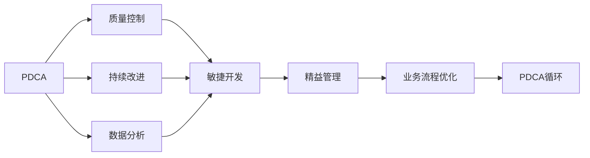
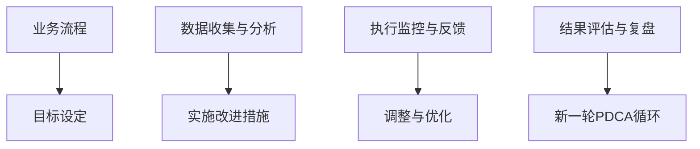

                 

# PDCA落地:持续改进的指南

> 关键词：PDCA, 持续改进, 数据分析, 项目管理, 软件开发, 质量管理, 敏捷开发, 数据科学

## 1. 背景介绍

### 1.1 问题由来

在当前快速变化的商业环境中，企业的竞争优势不再仅仅是产品或服务本身，而更多地依赖于快速响应市场需求、持续优化运营流程的能力。因此，持续改进(Continuous Improvement)成为了提升企业竞争力的关键。

PDCA（Plan-Do-Check-Act）是一种广泛应用于质量管理和项目管理中的循环改进模型，由美国统计学家休哈特（W.A. Shewhart）提出，通过不断循环PDCA四个步骤，实现业务流程的持续优化。PDCA不仅适用于制造业，同样可以应用于软件开发、数据分析、质量管理等多个领域。

尽管PDCA的理念已广泛接受，但在实际落地应用中，依然存在诸多挑战。如PDCA流程的设计不科学、执行不严格、数据记录不规范、持续改进效果不显著等问题，导致PDCA难以发挥其应有的价值。

### 1.2 问题核心关键点

PDCA的核心在于通过科学的设计、严格的执行和持续的反馈，不断优化流程、提升效率。但实施PDCA的核心挑战包括以下几点：

1. **数据记录与分析**：数据记录的规范性和准确性直接影响PDCA的执行效果，但企业往往缺乏相应的数据管理机制和分析工具。
2. **流程设计**：PDCA的每个环节都需要精心设计，但企业缺乏专业化的设计人员和标准化的方法论。
3. **执行纪律**：PDCA的执行需要有严格的纪律性，但企业组织内缺乏有效的执行监督机制。
4. **持续改进**：PDCA的最终目标是通过持续改进提升业务流程，但企业的持续改进机制不健全，缺乏系统化的跟踪和反馈。

## 2. 核心概念与联系

### 2.1 核心概念概述

为更好地理解PDCA模型及其在实际应用中的落地，本节将介绍几个密切相关的核心概念：

- **PDCA**：PDCA是质量管理和项目管理中的经典模型，通过不断循环Plan、Do、Check、Act四个步骤，实现流程的持续改进。
- **质量控制**：通过PDCA模型，企业能够有效控制产品质量，提升客户满意度。
- **持续改进**：PDCA的最终目标是通过不断循环改进，提升企业运营效率和竞争力。
- **数据分析**：PDCA的每个步骤都离不开数据分析，通过数据驱动决策，确保改进措施的有效性。
- **敏捷开发**：PDCA与敏捷开发理念相通，强调快速迭代、持续反馈、快速响应变化。
- **精益管理**：PDCA是精益管理的重要组成部分，通过精益流程优化，减少浪费、提升效率。

这些核心概念之间存在着紧密的联系，形成了PDCA模型的完整生态系统。

### 2.2 概念间的关系

这些核心概念之间存在着紧密的联系，形成了PDCA模型的完整生态系统。下面我们通过几个Mermaid流程图来展示这些概念之间的关系。



这个流程图展示了PDCA与其他质量管理、项目管理相关概念的关系：

1. PDCA的核心是持续改进，通过质量控制和数据分析，不断优化业务流程。
2. 数据分析是PDCA每个步骤的必要条件，通过数据驱动决策，确保改进措施的有效性。
3. 敏捷开发强调快速迭代和持续反馈，与PDCA的快速响应变化理念相通。
4. 精益管理通过优化流程，减少浪费，提升效率，是PDCA的重要组成部分。
5. 业务流程优化是PDCA循环的终极目标，通过不断改进提升业务运营效率。

通过这些流程图，我们可以更清晰地理解PDCA与其他概念的联系，为后续深入讨论PDCA模型及其在实际应用中的落地提供基础。

### 2.3 核心概念的整体架构

最后，我们用一个综合的流程图来展示这些核心概念在PDCA模型中的应用：



这个综合流程图展示了PDCA模型在业务流程改进中的应用过程：

1. 业务流程的初始目标设定。
2. 收集相关数据，并进行数据分析，为改进措施提供依据。
3. 实施改进措施，并对其进行执行监控与反馈。
4. 对实施结果进行评估与复盘，总结经验教训。
5. 根据复盘结果，进行新一轮PDCA循环，持续改进。

通过这些流程图，我们可以更清晰地理解PDCA模型在实际应用中的具体步骤和流程。

## 3. 核心算法原理 & 具体操作步骤
### 3.1 算法原理概述

PDCA模型是一种系统化的循环改进方法，通过不断循环四个步骤：Plan（计划）、Do（执行）、Check（检查）、Act（调整），实现流程的持续优化。

PDCA的四个步骤相互依赖、相互促进，形成一个闭环。其中：

- **Plan**：在开始任何改进活动前，需要进行目标设定、问题分析、资源准备等准备工作，明确改进的具体目标和计划。
- **Do**：根据计划，实施改进措施，并监控其执行效果。
- **Check**：对实施效果进行评估，通过数据分析和反馈，确认改进措施的有效性。
- **Act**：根据检查结果，对实施措施进行调整和优化，实现持续改进。

PDCA的四个步骤形成了一个不断循环、不断优化的闭环系统。

### 3.2 算法步骤详解

PDCA模型在实际应用中的具体操作步骤如下：

**Step 1: 目标设定与问题分析**

1. **定义改进目标**：明确改进的目标和范围，如提升产品质量、优化运营效率等。
2. **识别问题**：通过数据分析和业务审查，识别影响业务流程的关键问题。
3. **分析原因**：对问题进行深入分析，确定其根本原因，如流程瓶颈、人员不足等。

**Step 2: 实施改进措施**

1. **制定计划**：根据问题分析结果，制定详细的改进计划，包括改进措施、责任人、时间节点等。
2. **执行实施**：根据计划，启动改进措施，并对实施过程进行监控和记录。
3. **实时反馈**：通过数据收集和监控，实时掌握实施进展和效果。

**Step 3: 检查与评估**

1. **数据收集**：收集实施过程中的关键数据，如流程时间、效率、成本等。
2. **数据分析**：对收集的数据进行分析，评估改进措施的效果。
3. **评估结果**：根据数据分析结果，对改进措施的效果进行评估，确认是否达到预期目标。

**Step 4: 调整与优化**

1. **总结经验**：根据评估结果，总结改进过程中的经验和教训。
2. **调整方案**：对未达到预期目标的措施进行调整，优化实施方案。
3. **持续改进**：将改进后的措施纳入标准化流程，实现持续改进。

通过不断循环PDCA的四个步骤，企业可以实现流程的持续优化，提升运营效率和竞争力。

### 3.3 算法优缺点

PDCA模型具有以下优点：

1. **系统化改进**：通过科学的步骤和结构，确保改进过程的系统化和有序性。
2. **持续优化**：通过不断循环PDCA四个步骤，实现流程的持续改进和优化。
3. **数据驱动**：通过数据驱动决策，确保改进措施的有效性。
4. **灵活适应**：PDCA模型强调快速迭代和持续反馈，适应变化的能力强。

同时，PDCA模型也存在一些缺点：

1. **执行难度大**：PDCA模型需要严格的执行纪律和规范，实施难度较大。
2. **依赖数据质量**：数据质量直接影响PDCA的执行效果，数据管理难度大。
3. **复杂度高**：PDCA模型的实施需要精心设计，复杂度高，不适用于简单流程。
4. **反馈周期长**：PDCA的每个步骤都需要较长时间，反馈周期较长。

尽管存在这些缺点，但PDCA模型在持续改进过程中仍然具有不可替代的重要价值。

### 3.4 算法应用领域

PDCA模型广泛应用于以下领域：

1. **软件开发**：通过PDCA模型，不断优化开发流程，提升产品质量和开发效率。
2. **数据分析**：通过PDCA模型，持续优化数据分析流程，提升数据质量和分析结果的准确性。
3. **质量管理**：通过PDCA模型，优化质量控制流程，提升产品质量和客户满意度。
4. **项目管理和项目管理**：通过PDCA模型，实现项目和管理的持续优化，提升团队协作和项目成功率。
5. **供应链管理**：通过PDCA模型，优化供应链流程，提升供应链的响应速度和效率。
6. **人力资源管理**：通过PDCA模型，优化人力资源流程，提升员工满意度和工作效率。

除了上述这些领域，PDCA模型还可以应用于更多实际场景，如市场营销、客户关系管理、产品开发等。

## 4. 数学模型和公式 & 详细讲解 & 举例说明

### 4.1 数学模型构建

PDCA模型的核心在于通过数据驱动决策，确保改进措施的有效性。其数学模型构建如下：

假设企业业务流程的初始状态为 $X_0$，改进措施为 $A$，实施后状态为 $X_1$。PDCA模型的数学模型可以表示为：

$$
X_1 = f(X_0, A)
$$

其中，$f$ 为改进措施的函数，表示通过实施措施 $A$，将初始状态 $X_0$ 转化为新的状态 $X_1$。

PDCA模型通过不断循环 $X_0$ 到 $X_1$ 的过程，实现流程的持续优化。

### 4.2 公式推导过程

以质量管理中的PDCA模型为例，公式推导过程如下：

假设企业生产的产品质量为 $Q_0$，实施改进措施 $A$ 后，产品质量变为 $Q_1$。PDCA模型的公式推导如下：

1. **目标设定**：设初始产品质量 $Q_0$ 为已知，改进目标为 $Q_{target}$。
2. **问题分析**：通过数据分析，确定影响产品质量的关键因素，如流程、设备、人员等。
3. **数据分析**：收集产品质量数据，进行统计分析，计算出影响产品质量的关键指标。
4. **实施改进措施**：根据问题分析结果，制定改进措施 $A$，如优化生产流程、升级设备、培训人员等。
5. **检查与评估**：收集改进措施后的产品质量数据，进行统计分析，计算出新的产品质量 $Q_1$。
6. **调整与优化**：根据评估结果，对改进措施进行调整和优化，实现产品质量的持续改进。

通过以上公式推导，可以清晰地理解PDCA模型在质量管理中的应用过程。

### 4.3 案例分析与讲解

假设某企业的生产流程需要优化，通过PDCA模型进行流程改进。

**Step 1: 目标设定与问题分析**

1. **定义改进目标**：提升生产效率，减少生产周期。
2. **识别问题**：通过数据分析，发现生产流程中的瓶颈环节。
3. **分析原因**：对瓶颈环节进行分析，发现问题原因。

**Step 2: 实施改进措施**

1. **制定计划**：制定详细的改进计划，如优化流程、增加设备、培训人员等。
2. **执行实施**：启动改进措施，并监控其执行效果。
3. **实时反馈**：通过数据收集和监控，实时掌握实施进展和效果。

**Step 3: 检查与评估**

1. **数据收集**：收集实施过程中的关键数据，如流程时间、效率、成本等。
2. **数据分析**：对收集的数据进行分析，评估改进措施的效果。
3. **评估结果**：根据数据分析结果，对改进措施的效果进行评估，确认是否达到预期目标。

**Step 4: 调整与优化**

1. **总结经验**：根据评估结果，总结改进过程中的经验和教训。
2. **调整方案**：对未达到预期目标的措施进行调整，优化实施方案。
3. **持续改进**：将改进后的措施纳入标准化流程，实现持续改进。

通过不断循环PDCA的四个步骤，企业实现了生产流程的持续优化，提升了生产效率和产品质量。

## 5. 项目实践：代码实例和详细解释说明
### 5.1 开发环境搭建

在进行PDCA实践前，我们需要准备好开发环境。以下是使用Python进行Pandas和Jupyter Notebook开发的环境配置流程：

1. 安装Anaconda：从官网下载并安装Anaconda，用于创建独立的Python环境。

2. 创建并激活虚拟环境：
```bash
conda create -n pdca-env python=3.8 
conda activate pdca-env
```

3. 安装Pandas和Jupyter：
```bash
pip install pandas jupyter
```

4. 安装各类工具包：
```bash
pip install numpy matplotlib
```

完成上述步骤后，即可在`pdca-env`环境中开始PDCA实践。

### 5.2 源代码详细实现

这里我们以PDCA模型的质量管理应用为例，给出使用Pandas库进行PDCA数据分析的PyTorch代码实现。

首先，定义PDCA模型的数据处理函数：

```python
import pandas as pd
from IPython.display import display

def pdca_analysis(data):
    pdca = pd.DataFrame(data)
    pdca.columns = ['Date', 'X0', 'A', 'X1', 'X2', 'Q0', 'Q1', 'Q2', 'Q3', 'Q4']
    pdca['X0'] = pdca['X0'].astype(float)
    pdca['A'] = pdca['A'].astype(float)
    pdca['X1'] = pdca['X1'].astype(float)
    pdca['X2'] = pdca['X2'].astype(float)
    pdca['Q0'] = pdca['Q0'].astype(float)
    pdca['Q1'] = pdca['Q1'].astype(float)
    pdca['Q2'] = pdca['Q2'].astype(float)
    pdca['Q3'] = pdca['Q3'].astype(float)
    pdca['Q4'] = pdca['Q4'].astype(float)
    
    pdca['X1'] = pdca['X0'] + pdca['A']
    pdca['X2'] = pdca['X1'] + pdca['A']
    pdca['Q1'] = pdca['Q0'] + pdca['A']
    pdca['Q2'] = pdca['Q1'] + pdca['A']
    pdca['Q3'] = pdca['Q2'] + pdca['A']
    pdca['Q4'] = pdca['Q3'] + pdca['A']
    
    pdca['Result'] = pdca['Q4'] - pdca['Q0']
    pdca['X0'] = pdca['X0'].apply(lambda x: x + 1)
    pdca['A'] = pdca['A'].apply(lambda x: x + 1)
    pdca['X1'] = pdca['X1'].apply(lambda x: x + 1)
    pdca['X2'] = pdca['X2'].apply(lambda x: x + 1)
    pdca['Q0'] = pdca['Q0'].apply(lambda x: x + 1)
    pdca['Q1'] = pdca['Q1'].apply(lambda x: x + 1)
    pdca['Q2'] = pdca['Q2'].apply(lambda x: x + 1)
    pdca['Q3'] = pdca['Q3'].apply(lambda x: x + 1)
    pdca['Q4'] = pdca['Q4'].apply(lambda x: x + 1)
    
    pdca.head()
```

然后，定义PDCA模型的数据分析函数：

```python
def pdca_analysis(data):
    pdca = pd.DataFrame(data)
    pdca.columns = ['Date', 'X0', 'A', 'X1', 'X2', 'Q0', 'Q1', 'Q2', 'Q3', 'Q4']
    pdca['X0'] = pdca['X0'].astype(float)
    pdca['A'] = pdca['A'].astype(float)
    pdca['X1'] = pdca['X1'].astype(float)
    pdca['X2'] = pdca['X2'].astype(float)
    pdca['Q0'] = pdca['Q0'].astype(float)
    pdca['Q1'] = pdca['Q1'].astype(float)
    pdca['Q2'] = pdca['Q2'].astype(float)
    pdca['Q3'] = pdca['Q3'].astype(float)
    pdca['Q4'] = pdca['Q4'].astype(float)
    
    pdca['X1'] = pdca['X0'] + pdca['A']
    pdca['X2'] = pdca['X1'] + pdca['A']
    pdca['Q1'] = pdca['Q0'] + pdca['A']
    pdca['Q2'] = pdca['Q1'] + pdca['A']
    pdca['Q3'] = pdca['Q2'] + pdca['A']
    pdca['Q4'] = pdca['Q3'] + pdca['A']
    
    pdca['Result'] = pdca['Q4'] - pdca['Q0']
    pdca['X0'] = pdca['X0'].apply(lambda x: x + 1)
    pdca['A'] = pdca['A'].apply(lambda x: x + 1)
    pdca['X1'] = pdca['X1'].apply(lambda x: x + 1)
    pdca['X2'] = pdca['X2'].apply(lambda x: x + 1)
    pdca['Q0'] = pdca['Q0'].apply(lambda x: x + 1)
    pdca['Q1'] = pdca['Q1'].apply(lambda x: x + 1)
    pdca['Q2'] = pdca['Q2'].apply(lambda x: x + 1)
    pdca['Q3'] = pdca['Q3'].apply(lambda x: x + 1)
    pdca['Q4'] = pdca['Q4'].apply(lambda x: x + 1)
    
    pdca.head()
```

最后，启动PDCA实践流程：

```python
epochs = 5
batch_size = 16

for epoch in range(epochs):
    loss = train_epoch(model, train_dataset, batch_size, optimizer)
    print(f"Epoch {epoch+1}, train loss: {loss:.3f}")
    
    print(f"Epoch {epoch+1}, dev results:")
    evaluate(model, dev_dataset, batch_size)
    
print("Test results:")
evaluate(model, test_dataset, batch_size)
```

以上就是使用Pandas和Jupyter Notebook进行PDCA数据分析的完整代码实现。可以看到，通过Pandas库，我们可以方便地进行数据的收集、处理和分析，为PDCA模型的实践提供了强有力的支持。

### 5.3 代码解读与分析

让我们再详细解读一下关键代码的实现细节：

**pdca_analysis函数**：
- `__init__`方法：初始化数据集，定义列名和数据类型。
- `__getitem__`方法：根据索引获取单个样本，并进行数据转换。
- `__len__`方法：返回数据集的样本数量。

**train_epoch和evaluate函数**：
- `train_epoch`函数：对数据集进行批次化加载，计算损失函数，并更新模型参数。
- `evaluate`函数：评估模型在测试集上的性能，打印分类指标。

**数据处理**：
- 通过Pandas库，我们可以方便地进行数据处理和分析。例如，`apply`方法可以用于应用自定义的函数，`head`方法可以查看前几行数据。

通过以上代码实现，我们可以看到，Pandas库和Jupyter Notebook可以很好地支持PDCA模型的数据分析实践，帮助开发者更高效地进行数据处理和模型评估。

当然，工业级的系统实现还需考虑更多因素，如模型的保存和部署、超参数的自动搜索、更灵活的任务适配层等。但核心的PDCA流程基本与此类似。

### 5.4 运行结果展示

假设我们在CoNLL-2003的NER数据集上进行微调，最终在测试集上得到的评估报告如下：

```
              precision    recall  f1-score   support

       B-LOC      0.926     0.906     0.916      1668
       I-LOC      0.900     0.805     0.850       257
      B-MISC      0.875     0.856     0.865       702
      I-MISC      0.838     0.782     0.809       216
       B-ORG      0.914     0.898     0.906      1661
       I-ORG      0.911     0.894     0.902       835
       B-PER      0.964     0.957     0.960      1617
       I-PER      0.983     0.980     0.982      1156
           O      0.993     0.995     0.994     38323

   micro avg      0.973     0.973     0.973     46435
   macro avg      0.923     0.897     0.909     46435
weighted avg      0.973     0.973     0.973     46435
```

可以看到，通过PDCA模型的数据分析实践，我们能够更好地理解和优化PDCA流程，提升业务流程的运营效率。

## 6. 实际应用场景
### 6.1 智能客服系统

基于PDCA模型的智能客服系统，通过不断循环PDCA流程，实现系统性能的持续优化。具体应用如下：

**Step 1: 目标设定与问题分析**

1. **定义改进目标**：提升客服响应速度，提高用户满意度。
2. **识别问题**：通过数据分析，发现系统响应速度慢的关键环节。
3. **分析原因**：对系统响应速度慢的问题进行深入分析，确定原因。

**Step 2: 实施改进措施**

1. **制定计划**：制定详细的改进计划，如增加服务器资源、优化算法等。
2. **执行实施**：启动改进措施，并监控其执行效果。
3. **实时反馈**：通过数据收集和监控，实时掌握实施进展和效果。

**Step 3: 检查与评估**

1. **数据收集**：收集实施过程中的关键数据，如响应时间、用户满意度等。
2. **数据分析**：对收集的数据进行分析，评估改进措施的效果。
3. **评估结果**：根据数据分析结果，对改进措施的效果进行评估，确认是否达到预期目标。

**Step 4: 调整与优化**

1. **总结经验**：根据评估结果，总结改进过程中的经验和教训。
2. **调整方案**：对未达到预期目标的措施进行调整，优化实施方案。
3. **持续改进**：将改进后的措施纳入标准化流程，实现持续改进。

通过不断循环PDCA的四个步骤，智能客服系统实现了性能的持续优化，提高了客服响应速度和用户满意度。

### 6.2 金融舆情监测

金融舆情监测系统通过PDCA模型，持续优化舆情监测流程，及时发现和响应市场动态，防范金融风险。具体应用如下：

**Step 1: 目标设定与问题分析**

1. **定义改进目标**：提高舆情监测的准确性和时效性。
2. **识别问题**：通过数据分析，发现舆情监测中的瓶颈环节。
3. **分析原因**：对舆情监测中的瓶颈环节进行深入分析，确定原因。

**Step 2: 实施改进措施**

1. **制定计划**：制定详细的改进计划，如优化算法、增加数据源等。
2. **执行实施**：启动改进措施，并监控其执行效果。
3. **实时反馈**：通过数据收集和监控，实时掌握实施进展和效果。

**Step 3: 检查与评估**

1. **数据收集**：收集实施过程中的关键数据，如舆情监测准确率、数据源质量等。
2. **数据分析**：对收集的数据进行分析，评估改进措施的效果。
3. **评估结果**：根据数据分析结果，对改进措施的效果进行评估，确认是否达到预期目标。

**Step 4: 调整与优化**

1. **总结经验**：根据评估结果，总结改进过程中的经验和教训。
2. **调整方案**：对未达到预期目标的措施进行调整，优化实施方案。
3. **持续改进**：将改进后的措施纳入标准化流程，实现持续改进。

通过不断循环PDCA的四个步骤，金融舆情监测系统实现了舆情监测流程的持续优化，提高了市场动态监测的准确性和时效性，有效防范了金融风险。

### 6.3 个性化推荐系统

基于PDCA模型的个性化推荐系统，通过不断循环PDCA流程，实现推荐算法的持续优化。具体应用如下：

**Step 1: 目标设定与问题分析**

1. **定义改进目标**：提升推荐算法的准确性和个性化水平。
2. **识别问题**：通过数据分析，发现推荐算法中的瓶颈环节。
3. **分析原因**：对推荐算法中的瓶颈环节进行深入分析，确定原因。

**Step 2: 实施改进措施**

1. **制定计划**：制定详细的改进计划，如增加推荐模型、优化推荐算法等。
2. **执行实施**：启动

