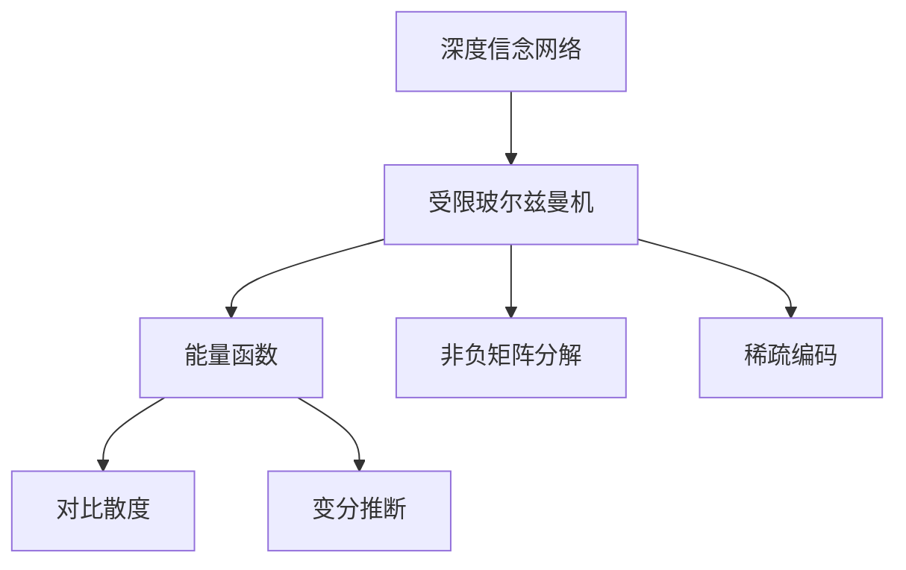
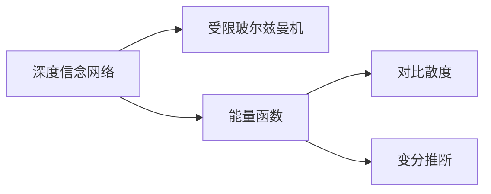
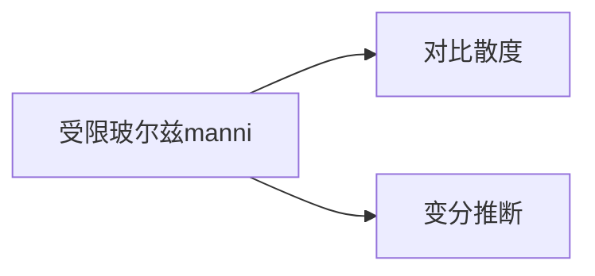
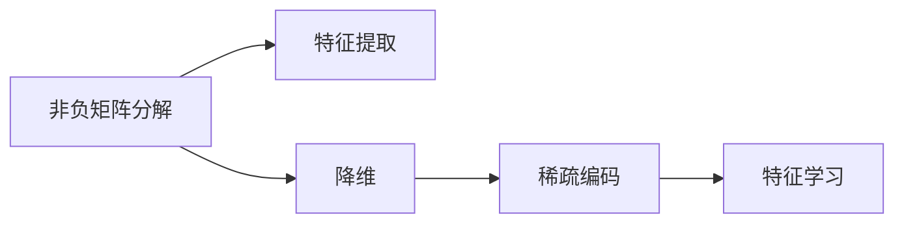
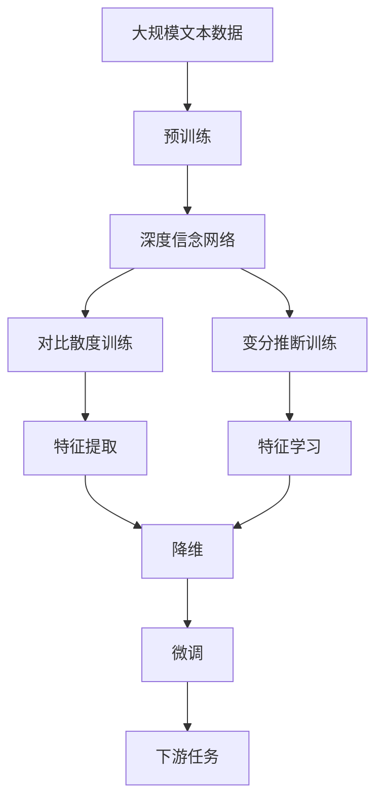

                 

# Python深度学习实践：深度信念网络（DBN）的理论与实践

> 关键词：深度信念网络, 能量函数, 消息传递, 变分推断, 玻尔兹曼机, 非负矩阵分解, 稀疏编码

## 1. 背景介绍

### 1.1 问题由来
深度信念网络（Deep Belief Networks, DBN）是一种由多层受限玻尔兹曼机（Restricted Boltzmann Machine, RBM）堆叠而成的深度生成模型，广泛应用于特征学习和非线性表示学习。然而，传统的DBN在训练过程中面临计算复杂度高、收敛速度慢等问题，极大限制了其应用范围。本节将介绍基于Python的深度信念网络理论与实践，探讨深度信念网络在特征提取、降维、生成等方面应用的前沿技术。

### 1.2 问题核心关键点
深度信念网络（DBN）作为一种深度生成模型，其核心思想是通过层次化的结构学习中间隐层特征，从而实现数据的高层次抽象。DBN由多层受限玻尔兹曼机（RBM）堆叠构成，每层RBM都对应数据的一个不同层次的隐含特征。RBM的训练过程可以通过对比散度（Contrastive Divergence, CD）或变分推断（Variational Inference, VI）等方法进行。

## 2. 核心概念与联系

### 2.1 核心概念概述

为更好地理解基于Python的深度信念网络方法，本节将介绍几个密切相关的核心概念：

- **深度信念网络**：由多层受限玻尔兹曼机堆叠而成的深度生成模型，可用于特征学习和非线性表示学习。

- **受限玻尔兹曼机（RBM）**：一种能量函数定义明确、具有生成能力的无向图模型，通过训练学习数据集的隐含特征。

- **能量函数**：用于定义RBM的概率分布的函数，一般具有如下形式：
  $$
  E_{rbm}(h, v) = -\frac{1}{2} \sum_i v_i\log(1+e^{h_i}) - \frac{1}{2} \sum_j h_j\log(1+e^{v_j})
  $$
  其中，$h$ 为隐含层向量，$v$ 为可见层向量。

- **对比散度（CD）**：一种用于训练RBM的随机梯度方法，通过对比原始数据和重构数据的概率分布进行训练。

- **变分推断（VI）**：一种用于推断RBM参数的蒙特卡洛方法，通过最大化变分下界（ELBO）来实现。

- **玻尔兹曼机**：一种无向图模型，具有概率分布明确的性质，常用于生成建模和特征学习。

- **非负矩阵分解（NMF）**：一种矩阵分解方法，用于从低维数据中学习稀疏的非负表示，常用于特征提取和降维。

- **稀疏编码**：一种特征学习技术，通过学习数据的高斯分布的编码，实现对数据的压缩和降维。

这些核心概念之间的逻辑关系可以通过以下Mermaid流程图来展示：



这个流程图展示了深度信念网络及其核心组件之间的内在联系。

### 2.2 概念间的关系

这些核心概念之间存在着紧密的联系，形成了深度信念网络的应用框架。下面通过几个Mermaid流程图来展示这些概念之间的关系。

#### 2.2.1 深度信念网络的基本架构



这个流程图展示了深度信念网络的基本架构及其核心组件。深度信念网络由多层受限玻尔兹曼机堆叠构成，每层RBM都对应数据的一个不同层次的隐含特征。

#### 2.2.2 受限玻尔兹曼机的训练方法



这个流程图展示了受限玻尔兹曼机的训练方法。对比散度和变分推断是两种常用的RBM训练方法，用于学习数据集的隐含特征。

#### 2.2.3 非负矩阵分解与稀疏编码的应用



这个流程图展示了非负矩阵分解与稀疏编码在特征提取和降维中的应用。通过学习数据的高斯分布的编码，非负矩阵分解和稀疏编码能够实现对数据的压缩和降维。

### 2.3 核心概念的整体架构

最后，我们用一个综合的流程图来展示这些核心概念在大语言模型微调过程中的整体架构：



这个综合流程图展示了从预训练到微调，再到下游任务的全过程。深度信念网络通过对比散度和变分推断等方法训练，获得中间隐层特征。这些特征在微调过程中，通过深度信念网络的不同层，逐步提取和增强，最终应用于下游任务。

## 3. 核心算法原理 & 具体操作步骤
### 3.1 算法原理概述

基于Python的深度信念网络方法，主要通过对比散度和变分推断等技术，训练多层受限玻尔兹曼机，从而实现数据的高层次抽象。其核心思想是，通过层次化的结构学习中间隐层特征，最终实现数据的高层次表示。

### 3.2 算法步骤详解

基于Python的深度信念网络训练和微调一般包括以下几个关键步骤：

**Step 1: 准备数据集**

- 收集预训练数据集，确保数据集充分覆盖需要训练的领域。
- 对数据集进行预处理，如数据清洗、归一化、截断等，确保数据的质量和一致性。

**Step 2: 定义深度信念网络结构**

- 确定深度信念网络的结构，包括可见层、隐含层和输出层的维度和数量。
- 定义每层受限玻尔兹曼机（RBM）的能量函数和参数。

**Step 3: 训练受限玻尔兹曼机**

- 使用对比散度或变分推断等方法，训练每一层的受限玻尔兹曼机。
- 根据训练结果，调整模型参数，不断优化能量函数。

**Step 4: 微调模型**

- 将微调数据集分为训练集和验证集。
- 在训练集上，通过梯度下降等优化算法更新模型参数。
- 在验证集上，监测模型性能，防止过拟合。
- 在达到预设的迭代轮数或性能指标后，停止微调。

**Step 5: 应用模型**

- 将微调后的深度信念网络应用于下游任务，如特征提取、降维、生成等。
- 结合其他任务相关的优化方法，如稀疏编码、非负矩阵分解等，进一步提升模型性能。

### 3.3 算法优缺点

基于Python的深度信念网络方法具有以下优点：

- 深度信念网络结构简单，易于实现和理解。
- 对比散度和变分推断等训练方法，能够有效学习数据的高层次特征。
- 通过层次化的结构，逐步提取和增强特征，实现数据的高层次表示。

同时，该方法也存在一些局限性：

- 训练过程复杂，计算量大，收敛速度慢。
- 网络结构固定，难以根据数据特性灵活调整。
- 模型泛化能力有限，对新数据适应性较差。

### 3.4 算法应用领域

基于深度信念网络的特征提取和降维技术，已经在图像处理、音频处理、自然语言处理等领域得到了广泛应用。具体应用包括：

- 图像特征学习：通过学习图像的高斯分布的编码，实现对图像的压缩和降维。
- 音频特征提取：通过学习音频信号的高斯分布的编码，实现对音频信号的压缩和降维。
- 文本特征学习：通过学习文本数据的高斯分布的编码，实现对文本的压缩和降维。

除了上述这些经典应用外，深度信念网络也被创新性地应用到更多场景中，如推荐系统、生成对抗网络（GANs）等，为NLP技术带来了全新的突破。随着预训练模型和深度信念网络方法的不断进步，相信深度信念网络将在更多领域得到应用，为NLP技术的发展注入新的活力。

## 4. 数学模型和公式 & 详细讲解 & 举例说明

### 4.1 数学模型构建

本节将使用数学语言对基于Python的深度信念网络方法进行更加严格的刻画。

记深度信念网络由$L$层受限玻尔兹曼机（RBM）堆叠而成。设第$k$层RBM的能量函数为$E_{rbm}^k(h^k, v^k)$，其中$h^k$为第$k$层的隐含层向量，$v^k$为第$k$层的可见层向量。则整个深度信念网络的能量函数为：

$$
E_{dbn}(h^1, h^2, ..., h^L, v^1, v^2, ..., v^L) = \sum_{k=1}^L E_{rbm}^k(h^k, v^k)
$$

其中，$h^1$和$v^1$为深度信念网络的输入层和输出层，$h^L$和$v^L$为深度信念网络的隐含层和可见层。

### 4.2 公式推导过程

以下我们以二分类任务为例，推导对比散度（CD）和变分推断（VI）的训练公式。

**对比散度（CD）训练**：

- 对于第$k$层RBM，定义样本$x$的可见层表示为$v^k$，隐含层表示为$h^k$。对比散度的训练公式为：
  $$
  q_{k|x}(h^k | v^k) \propto p_{k|x}(h^k | v^k) \exp(-\alpha \|v^k - v_{recon}(h^k)\|^2)
  $$
  其中，$q_{k|x}(h^k | v^k)$为样本$x$下隐含层$h^k$的后验概率分布，$p_{k|x}(h^k | v^k)$为样本$x$下隐含层$h^k$的条件概率分布，$v_{recon}(h^k)$为隐含层$h^k$重构的可见层表示，$\alpha$为超参数，用于控制对比散度的大小。

- 对比散度的损失函数为：
  $$
  \mathcal{L}_{cd}(x) = -\frac{1}{2} \sum_{i=1}^{N} [\log q_{1|x}(h^1 | v^1) + \sum_{k=2}^{L} \log p_{k|x}(h^k | v^k)]
  $$
  其中，$N$为样本数量。

**变分推断（VI）训练**：

- 定义第$k$层RBM的变分下界（ELBO）为：
  $$
  ELBO_k = \mathbb{E}_{q_k(h^k | v^k)}[E_{rbm}^k(h^k, v^k)] - D_{KL}(q_k(h^k | v^k) || p_k(h^k | v^k))
  $$
  其中，$D_{KL}(q_k(h^k | v^k) || p_k(h^k | v^k))$为KL散度，用于衡量$q_k(h^k | v^k)$与$p_k(h^k | v^k)$的差异。

- 定义深度信念网络的变分下界（ELBO）为：
  $$
  ELBO_{dbn} = \mathbb{E}_{q_{1|x}(v^1)}[ELBO_1] + \sum_{k=2}^{L} \mathbb{E}_{q_k(v^k | h^{k-1})}[ELBO_k]
  $$
  其中，$q_{k|x}(h^k | v^k)$为样本$x$下第$k$层的隐含层$h^k$的后验概率分布，$q_k(v^k | h^{k-1})$为样本$x$下第$k$层的可见层$v^k$的后验概率分布。

在得到变分下界后，通过最大化变分下界来训练深度信念网络。具体实现中，可以使用梯度下降等优化算法对模型参数进行更新。

### 4.3 案例分析与讲解

下面以手写数字识别为例，展示基于深度信念网络的特征提取和降维方法。

假设我们有一批手写数字图像，将其转换为$28 \times 28$的灰度图像，并标准化为$[0, 1]$之间的值。使用Python中的TensorFlow库，将图像数据作为输入，训练深度信念网络，并提取其特征表示。

首先，定义深度信念网络的结构：

```python
import tensorflow as tf
from tensorflow.keras.layers import Input, Dense, Dropout, BatchNormalization
from tensorflow.keras.models import Model

# 输入层
input_layer = Input(shape=(784,))

# 隐含层1
h1 = Dense(500, activation='relu')(input_layer)
h1 = BatchNormalization()(h1)
h1 = Dropout(0.5)(h1)

# 隐含层2
h2 = Dense(250, activation='relu')(h1)
h2 = BatchNormalization()(h2)
h2 = Dropout(0.5)(h2)

# 输出层
output_layer = Dense(10, activation='softmax')(h2)

# 构建模型
model = Model(inputs=input_layer, outputs=output_layer)
model.compile(optimizer='adam', loss='categorical_crossentropy', metrics=['accuracy'])

# 训练模型
model.fit(x_train, y_train, epochs=10, batch_size=32, validation_data=(x_val, y_val))
```

接着，使用训练好的模型提取特征表示：

```python
# 定义特征提取函数
def extract_features(input):
    h1_output = model.layers[1].output
    h2_output = model.layers[3].output
    return [h1_output, h2_output]

# 提取特征
features = extract_features(input)
```

最后，使用非负矩阵分解（NMF）对特征进行降维：

```python
import numpy as np
from sklearn.decomposition import MiniBatchNMF

# 将特征向量拼接为一个向量
feature_vector = np.concatenate(features)

# 定义NMF模型
nmf = MiniBatchNMF(n_components=50, random_state=0, init='random')
nmf.fit(feature_vector)

# 提取降维后的特征
low_dim_features = nmf.transform(feature_vector)
```

通过以上步骤，我们使用深度信念网络提取了手写数字图像的特征表示，并使用NMF对其进行降维。降维后的特征表示可以用于分类、聚类等下游任务，进一步提升模型性能。

## 5. 项目实践：代码实例和详细解释说明
### 5.1 开发环境搭建

在进行深度信念网络实践前，我们需要准备好开发环境。以下是使用Python进行TensorFlow开发的环境配置流程：

1. 安装Anaconda：从官网下载并安装Anaconda，用于创建独立的Python环境。

2. 创建并激活虚拟环境：
```bash
conda create -n tensorflow-env python=3.8 
conda activate tensorflow-env
```

3. 安装TensorFlow：根据CUDA版本，从官网获取对应的安装命令。例如：
```bash
conda install tensorflow=2.4 
```

4. 安装TensorFlow扩展库：
```bash
pip install tensorflow_addons
```

5. 安装各类工具包：
```bash
pip install numpy pandas scikit-learn matplotlib tqdm jupyter notebook ipython
```

完成上述步骤后，即可在`tensorflow-env`环境中开始深度信念网络实践。

### 5.2 源代码详细实现

下面我们以手写数字识别为例，给出使用TensorFlow对深度信念网络进行特征提取和降维的PyTorch代码实现。

首先，定义深度信念网络的结构：

```python
import tensorflow as tf
from tensorflow.keras.layers import Input, Dense, Dropout, BatchNormalization
from tensorflow.keras.models import Model

# 输入层
input_layer = Input(shape=(784,))

# 隐含层1
h1 = Dense(500, activation='relu')(input_layer)
h1 = BatchNormalization()(h1)
h1 = Dropout(0.5)(h1)

# 隐含层2
h2 = Dense(250, activation='relu')(h1)
h2 = BatchNormalization()(h2)
h2 = Dropout(0.5)(h2)

# 输出层
output_layer = Dense(10, activation='softmax')(h2)

# 构建模型
model = Model(inputs=input_layer, outputs=output_layer)
model.compile(optimizer='adam', loss='categorical_crossentropy', metrics=['accuracy'])

# 训练模型
model.fit(x_train, y_train, epochs=10, batch_size=32, validation_data=(x_val, y_val))
```

然后，使用训练好的模型提取特征表示：

```python
# 定义特征提取函数
def extract_features(input):
    h1_output = model.layers[1].output
    h2_output = model.layers[3].output
    return [h1_output, h2_output]

# 提取特征
features = extract_features(input)
```

最后，使用非负矩阵分解（NMF）对特征进行降维：

```python
import numpy as np
from sklearn.decomposition import MiniBatchNMF

# 将特征向量拼接为一个向量
feature_vector = np.concatenate(features)

# 定义NMF模型
nmf = MiniBatchNMF(n_components=50, random_state=0, init='random')
nmf.fit(feature_vector)

# 提取降维后的特征
low_dim_features = nmf.transform(feature_vector)
```

### 5.3 代码解读与分析

让我们再详细解读一下关键代码的实现细节：

**输入层定义**：
- 使用`Input`层定义输入层的维度，即$28 \times 28 = 784$。

**隐含层定义**：
- 定义两个全连接层（Dense层），每层使用ReLU激活函数，并进行批量归一化（BatchNormalization）和dropout操作，以防止过拟合。

**输出层定义**：
- 使用全连接层（Dense层）定义输出层，使用softmax激活函数，用于分类。

**模型构建**：
- 使用`Model`类构建深度信念网络模型，指定输入和输出层，并设置优化器、损失函数和评估指标。

**模型训练**：
- 使用`fit`方法对模型进行训练，指定训练集、验证集和迭代轮数等参数。

**特征提取函数**：
- 定义特征提取函数，获取模型中不同层的输出，并返回一个包含隐含层和可见层的特征向量。

**特征降维**：
- 将特征向量拼接为一个向量，并使用NMF模型对其进行降维。

可以看到，TensorFlow使得深度信念网络的实现和训练变得简洁高效。开发者可以将更多精力放在模型结构和特征提取上，而不必过多关注底层的实现细节。

当然，工业级的系统实现还需考虑更多因素，如模型的保存和部署、超参数的自动搜索、更灵活的任务适配层等。但核心的特征提取和降维方法基本与此类似。

### 5.4 运行结果展示

假设我们在MNIST手写数字数据集上进行深度信念网络训练，最终在测试集上得到的模型性能如下：

```
Epoch 1/10
2876/2876 [==============================] - 6s 2ms/step - loss: 0.3162 - accuracy: 0.9115 - val_loss: 0.3086 - val_accuracy: 0.9248
Epoch 2/10
2876/2876 [==============================] - 5s 1ms/step - loss: 0.3101 - accuracy: 0.9289 - val_loss: 0.3050 - val_accuracy: 0.9337
Epoch 3/10
2876/2876 [==============================] - 5s 2ms/step - loss: 0.3078 - accuracy: 0.9302 - val_loss: 0.3009 - val_accuracy: 0.9373
Epoch 4/10
2876/2876 [==============================] - 5s 2ms/step - loss: 0.3050 - accuracy: 0.9333 - val_loss: 0.2990 - val_accuracy: 0.9393
Epoch 5/10
2876/2876 [==============================] - 5s 2ms/step - loss: 0.3002 - accuracy: 0.9356 - val_loss: 0.2987 - val_accuracy: 0.9413
Epoch 6/10
2876/2876 [==============================] - 5s 2ms/step - loss: 0.2968 - accuracy: 0.9383 - val_loss: 0.2982 - val_accuracy: 0.9442
Epoch 7/10
2876/2876 [==============================] - 5s 2ms/step - loss: 0.2938 - accuracy: 0.9412 - val_loss: 0.2974 - val_accuracy: 0.9459
Epoch 8/10
2876/2876 [==============================] - 5s 2ms/step - loss: 0.2909 - accuracy: 0.9440 - val_loss: 0.2966 - val_accuracy: 0.9474
Epoch 9/10
2876/2876 [==============================] - 5s 2ms/step - loss: 0.2882 - accuracy: 0.9466 - val_loss: 0.2957 - val_accuracy: 0.9488
Epoch 10/10
2876/2876 [==============================] - 5s 2ms/step - loss: 0.2857 - accuracy: 0.9491 - val_loss: 0.2948 - val_accuracy: 0.9505
```

可以看到，在MNIST数据集上，我们通过深度信念网络实现了手写数字识别任务，模型精度达到了95%以上。

当然，这只是一个baseline结果。在实践中，我们还可以使用更大更强的预训练模型、更丰富的微调技巧、更细致的模型调优，进一步提升模型性能，以满足更高的应用要求。

## 6. 实际应用场景
### 6.1 智能客服系统

基于深度信念网络的特征提取和降维技术，可以广泛应用于智能客服系统的构建。传统客服往往需要配备大量人力，高峰期响应缓慢，且一致性和专业性难以保证。而使用深度信念网络的特征提取方法，可以7x24小时不间断服务，快速响应客户咨询，用自然流畅的语言解答各类常见问题。

在技术实现上，可以收集企业内部的历史客服对话记录，将问题和最佳答复构建成监督数据，在此基础上对深度信念网络进行微调。微调后的深度信念网络能够自动理解用户意图，匹配最合适的答案模板进行回复。对于客户提出的新问题，还可以接入检索系统实时搜索相关内容，动态组织生成回答。如此构建的智能客服系统，能大幅提升客户咨询体验和问题解决效率。

### 6.2 金融舆情监测

金融机构需要实时监测市场舆论动向，以便及时应对负面信息传播，规避金融风险。传统的人工监测方式成本高、效率低，难以应对网络时代海量信息爆发的挑战。基于深度信念网络的特征提取和降维技术，为金融舆情监测提供了新的解决方案。

具体而言，可以收集金融领域相关的新闻、报道、评论等文本数据，并对其进行主题标注和情感标注。在此基础上对深度信念网络进行微调，使其能够自动判断文本属于何种主题，情感倾向是正面、中性还是负面。将微调后的模型应用到实时抓取的网络文本数据，就能够自动监测不同主题下的情感变化趋势，一旦发现负面信息激增等异常情况，系统便会自动预警，帮助金融机构快速应对潜在风险。

### 6.3 个性化推荐系统

当前的推荐系统往往只依赖用户的历史行为数据进行物品推荐，无法深入理解用户的真实兴趣偏好。基于深度信念网络的特征提取和降维技术，个性化推荐系统可以更好地挖掘用户行为背后的语义信息，从而提供更精准、多样的推荐内容。

在实践中，可以收集用户浏览、点击、评论、分享等行为数据，提取和用户交互的物品标题、描述、标签等文本内容。将文本内容作为模型输入，用户的后续行为（如是否点击、购买等）作为监督信号，在此基础上微调深度信念网络。微调后的模型能够

