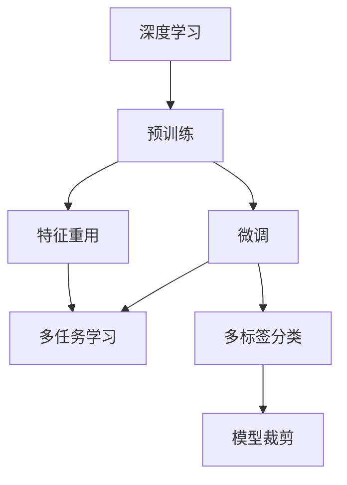
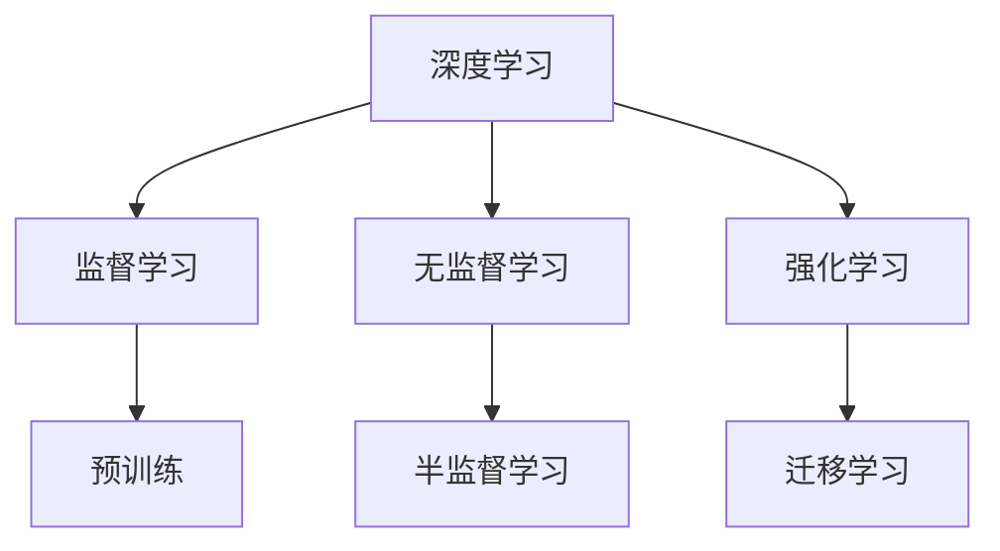
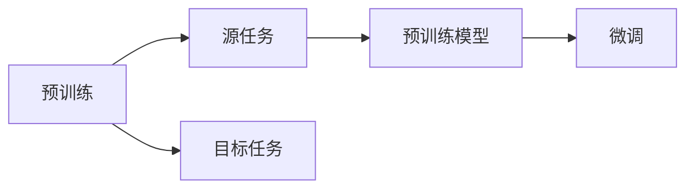
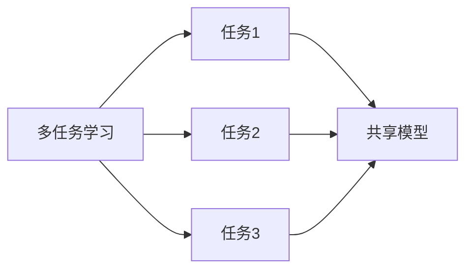
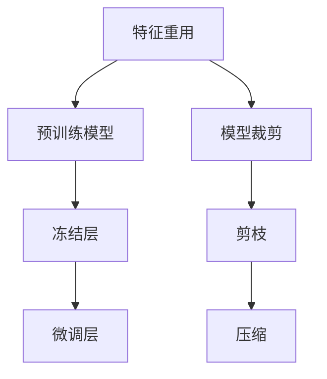
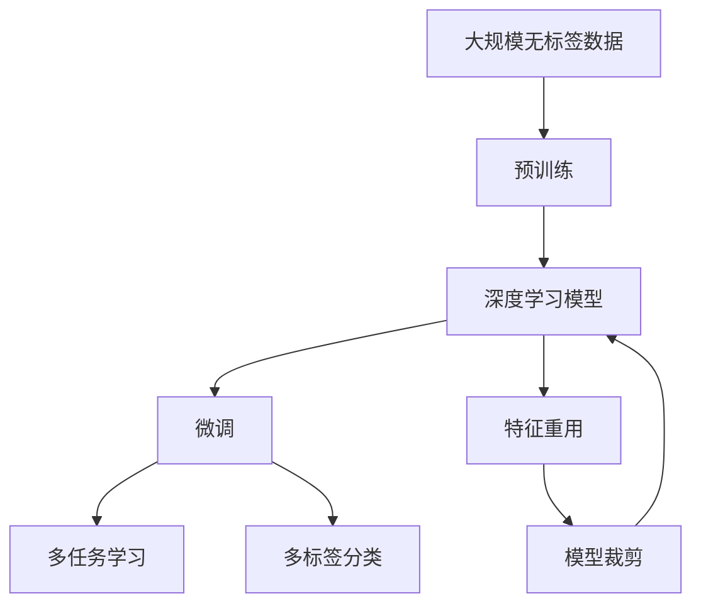

                 

# Python深度学习实践：运用迁移学习提升模型效能

> 关键词：深度学习,迁移学习,迁移学习,模型效能,多任务学习,模型裁剪,特征重用,多标签分类

## 1. 背景介绍

### 1.1 问题由来
随着深度学习技术的快速发展，特别是大数据和高性能计算的推动，深度学习模型在各个领域都取得了显著的进展。深度学习模型通常需要大量的标注数据进行训练，这不仅耗时耗力，还对数据的分布和质量有较高要求。迁移学习作为一种重要的学习范式，能够在大规模无标签数据上进行预训练，然后在特定任务上通过微调进行二次学习，从而提升模型的性能。

近年来，迁移学习已成为深度学习领域的一个热门研究方向，特别是在模型压缩、跨领域任务和多任务学习等方面。通过迁移学习，可以在已有预训练模型的基础上进行高效的知识迁移，提升模型在新任务上的表现，同时降低对标注数据的依赖。

### 1.2 问题核心关键点
迁移学习的核心思想是将在大规模无标签数据上预训练的知识，通过微调等方式迁移到特定任务上，以提升模型的性能。迁移学习能够显著减少对标注数据的依赖，提高模型的泛化能力和迁移能力，是深度学习领域的一个重要研究方向。

迁移学习的主要步骤如下：

1. **预训练**：在大规模无标签数据上，使用深度学习模型进行预训练，学习通用的特征表示。
2. **微调**：在特定任务上，使用预训练模型作为初始化参数，通过有监督学习优化模型在新任务上的性能。
3. **特征重用**：通过冻结预训练模型的某些层，保留已学知识，只对任务相关的层进行微调，提高模型效率和鲁棒性。

迁移学习的核心挑战在于如何在保留预训练模型通用知识的同时，针对特定任务进行微调，避免过拟合和灾难性遗忘。

### 1.3 问题研究意义
迁移学习在深度学习中具有重要的研究价值，主要体现在以下几个方面：

1. **减少标注数据需求**：迁移学习可以充分利用大规模无标签数据进行预训练，减少对标注数据的依赖，降低开发成本。
2. **提升模型泛化能力**：迁移学习能够将预训练模型学到的通用特征应用于特定任务，提升模型的泛化能力和鲁棒性。
3. **加速模型开发**：迁移学习通过利用已有知识，能够快速提升模型在特定任务上的性能，加速模型的开发和部署。
4. **促进跨领域知识迁移**：迁移学习能够促进不同领域之间的知识迁移，推动跨领域研究的进展。
5. **提高模型效率**：通过特征重用和模型裁剪等方法，迁移学习能够提升模型的效率，降低计算资源消耗。

迁移学习作为深度学习领域的重要研究范式，具有广泛的应用前景，特别是在NLP、计算机视觉、推荐系统等领域。

## 2. 核心概念与联系

### 2.1 核心概念概述

为了更好地理解迁移学习在深度学习中的作用和机制，本节将介绍几个密切相关的核心概念：

- **深度学习**：基于神经网络，利用多层非线性变换来学习复杂数据分布的模型。
- **预训练**：在大规模无标签数据上，使用深度学习模型进行预训练，学习通用的特征表示。
- **微调**：在特定任务上，使用预训练模型作为初始化参数，通过有监督学习优化模型在特定任务上的性能。
- **特征重用**：通过冻结预训练模型的某些层，保留已学知识，只对任务相关的层进行微调，提高模型效率和鲁棒性。
- **多任务学习**：在同一模型上进行多个相关任务的学习，通过任务间的相互学习提升模型的性能。
- **模型裁剪**：在保留重要特征的情况下，通过剪枝等方法减少模型参数和计算资源消耗。
- **多标签分类**：在每个样本可能属于多个类别的任务中，使用深度学习模型进行分类。

这些核心概念之间的逻辑关系可以通过以下Mermaid流程图来展示：



这个流程图展示了大语言模型的核心概念及其之间的关系：

1. 深度学习模型在大规模无标签数据上预训练，学习通用的特征表示。
2. 在特定任务上，使用预训练模型作为初始化参数，通过有监督学习优化模型在特定任务上的性能。
3. 通过特征重用和模型裁剪等方法，提高模型效率和鲁棒性。
4. 在同一模型上进行多个相关任务的学习，通过任务间的相互学习提升模型的性能。
5. 在每个样本可能属于多个类别的任务中，使用深度学习模型进行分类。

这些概念共同构成了深度学习模型的学习和应用框架，使其能够在各种场景下发挥强大的特征提取和分类能力。通过理解这些核心概念，我们可以更好地把握迁移学习的原理和优化方向。

### 2.2 概念间的关系

这些核心概念之间存在着紧密的联系，形成了迁移学习在深度学习中的完整生态系统。下面我通过几个Mermaid流程图来展示这些概念之间的关系。

#### 2.2.1 深度学习的学习范式



这个流程图展示了深度学习的几种主要学习范式，以及它们与迁移学习的关系。深度学习主要分为监督学习、无监督学习、半监督学习和强化学习四种范式，其中预训练和迁移学习都属于监督学习范畴。

#### 2.2.2 预训练与微调的关系



这个流程图展示了预训练和微调的基本原理。预训练主要在大规模无标签数据上，使用深度学习模型进行预训练，学习通用的特征表示。微调则在特定任务上，使用预训练模型作为初始化参数，通过有监督学习优化模型在特定任务上的性能。

#### 2.2.3 多任务学习与迁移学习的关系



这个流程图展示了多任务学习与迁移学习的关系。多任务学习在同一模型上进行多个相关任务的学习，通过任务间的相互学习提升模型的性能。迁移学习则是在特定任务上，使用预训练模型作为初始化参数，通过有监督学习优化模型在特定任务上的性能。多任务学习可以通过迁移学习的方式，在保留预训练模型通用知识的同时，提升模型在特定任务上的性能。

#### 2.2.4 特征重用与模型裁剪的关系



这个流程图展示了特征重用与模型裁剪的关系。特征重用通过冻结预训练模型的某些层，保留已学知识，只对任务相关的层进行微调，提高模型效率和鲁棒性。模型裁剪则是在保留重要特征的情况下，通过剪枝等方法减少模型参数和计算资源消耗，进一步提高模型效率。

### 2.3 核心概念的整体架构

最后，我们用一个综合的流程图来展示这些核心概念在大规模无标签数据上预训练、在特定任务上进行微调，以及通过特征重用和模型裁剪等方法提升模型效率的整体架构：



这个综合流程图展示了从预训练到微调，再到特征重用和模型裁剪的完整过程。深度学习模型首先在大规模无标签数据上进行预训练，学习通用的特征表示。在特定任务上，使用预训练模型作为初始化参数，通过有监督学习优化模型在特定任务上的性能。通过特征重用和模型裁剪等方法，提高模型效率和鲁棒性。最后，在同一模型上进行多个相关任务的学习，通过任务间的相互学习提升模型的性能。通过多标签分类，在每个样本可能属于多个类别的任务中，使用深度学习模型进行分类。通过这些步骤，迁移学习能够在保留预训练模型通用知识的同时，提升模型在新任务上的性能。

## 3. 核心算法原理 & 具体操作步骤
### 3.1 算法原理概述

迁移学习的核心思想是将在大规模无标签数据上预训练的知识，通过微调等方式迁移到特定任务上，以提升模型的性能。其核心思想是：将预训练模型视为一种强大的“特征提取器”，通过微调的方式，使其在新任务上能够更好地匹配任务标签，从而实现知识迁移。

形式化地，假设预训练模型为 $M_{\theta}$，其中 $\theta$ 为预训练得到的模型参数。给定目标任务 $T$ 的标注数据集 $D=\{(x_i, y_i)\}_{i=1}^N$，迁移学习的目标是最小化任务损失，即找到最优参数：

$$
\theta^* = \mathop{\arg\min}_{\theta} \mathcal{L}(M_{\theta},D)
$$

其中 $\mathcal{L}$ 为针对任务 $T$ 设计的损失函数，用于衡量模型预测输出与真实标签之间的差异。常见的损失函数包括交叉熵损失、均方误差损失等。

通过梯度下降等优化算法，迁移学习过程不断更新模型参数 $\theta$，最小化损失函数 $\mathcal{L}$，使得模型输出逼近真实标签。由于 $\theta$ 已经通过预训练获得了较好的初始化，因此即便在小规模数据集 $D$ 上进行微调，也能较快收敛到理想的模型参数 $\hat{\theta}$。

### 3.2 算法步骤详解

迁移学习的核心步骤如下：

**Step 1: 准备预训练模型和数据集**
- 选择合适的预训练模型 $M_{\theta}$ 作为初始化参数，如 VGG、ResNet、BERT 等。
- 准备目标任务的标注数据集 $D$，划分为训练集、验证集和测试集。一般要求标注数据与预训练数据的分布不要差异过大。

**Step 2: 选择任务适配层**
- 根据任务类型，在预训练模型顶层设计合适的输出层和损失函数。
- 对于分类任务，通常在顶层添加线性分类器和交叉熵损失函数。
- 对于生成任务，通常使用语言模型的解码器输出概率分布，并以负对数似然为损失函数。

**Step 3: 设置迁移学习超参数**
- 选择合适的优化算法及其参数，如 Adam、SGD 等，设置学习率、批大小、迭代轮数等。
- 设置正则化技术及强度，包括权重衰减、Dropout、Early Stopping 等。
- 确定冻结预训练参数的策略，如仅微调顶层，或全部参数都参与迁移学习。

**Step 4: 执行迁移学习训练**
- 将训练集数据分批次输入模型，前向传播计算损失函数。
- 反向传播计算参数梯度，根据设定的优化算法和学习率更新模型参数。
- 周期性在验证集上评估模型性能，根据性能指标决定是否触发 Early Stopping。
- 重复上述步骤直到满足预设的迭代轮数或 Early Stopping 条件。

**Step 5: 测试和部署**
- 在测试集上评估迁移学习后模型 $M_{\hat{\theta}}$ 的性能，对比迁移学习前后的精度提升。
- 使用迁移学习后的模型对新样本进行推理预测，集成到实际的应用系统中。
- 持续收集新的数据，定期重新迁移学习，以适应数据分布的变化。

以上是迁移学习的一般流程。在实际应用中，还需要针对具体任务的特点，对迁移学习过程的各个环节进行优化设计，如改进训练目标函数，引入更多的正则化技术，搜索最优的超参数组合等，以进一步提升模型性能。

### 3.3 算法优缺点

迁移学习作为一种重要的学习范式，具有以下优点：

1. **减少标注数据需求**：迁移学习可以充分利用大规模无标签数据进行预训练，减少对标注数据的依赖，降低开发成本。
2. **提升模型泛化能力**：迁移学习能够将预训练模型学到的通用特征应用于特定任务，提升模型的泛化能力和鲁棒性。
3. **加速模型开发**：迁移学习通过利用已有知识，能够快速提升模型在特定任务上的性能，加速模型的开发和部署。
4. **促进跨领域知识迁移**：迁移学习能够促进不同领域之间的知识迁移，推动跨领域研究的进展。
5. **提高模型效率**：通过特征重用和模型裁剪等方法，迁移学习能够提升模型效率，降低计算资源消耗。

同时，该方法也存在一定的局限性：

1. **依赖预训练数据**：迁移学习依赖预训练数据的泛化能力，当预训练数据与目标任务的数据分布差异较大时，迁移学习的效果可能不理想。
2. **特征重用限制**：在某些任务中，预训练模型的某些层可能不适用于新任务，需要进行部分重用。
3. **模型泛化性能**：尽管迁移学习能够提升模型在特定任务上的性能，但在其他任务上的泛化性能可能不如从头训练模型。
4. **参数更新复杂**：由于迁移学习涉及多任务、多数据集、多超参数，参数更新复杂，需要更多的实验验证和调参工作。
5. **知识传递机制**：预训练模型学到的知识如何有效地传递到新任务上，仍是一个需要深入研究的问题。

尽管存在这些局限性，但就目前而言，迁移学习已成为深度学习领域的重要研究范式，广泛应用于各个领域，特别是在模型压缩、跨领域任务和多任务学习等方面。

### 3.4 算法应用领域

迁移学习在深度学习中已得到广泛应用，涵盖了多个领域，例如：

- **计算机视觉**：通过迁移学习，可以在大规模图像数据上进行预训练，然后在特定任务上通过微调提升模型性能。常见的应用包括图像分类、目标检测、图像分割等。
- **自然语言处理**：通过迁移学习，可以在大规模文本数据上进行预训练，然后在特定任务上通过微调提升模型性能。常见的应用包括文本分类、命名实体识别、情感分析等。
- **推荐系统**：通过迁移学习，可以在用户行为数据上进行预训练，然后在推荐任务上通过微调提升模型性能。常见的应用包括商品推荐、新闻推荐、社交网络推荐等。
- **语音识别**：通过迁移学习，可以在大规模语音数据上进行预训练，然后在特定语音任务上通过微调提升模型性能。常见的应用包括语音识别、语音合成、语音情感分析等。

除了上述这些经典应用外，迁移学习还在更多场景中得到创新性的应用，如可控文本生成、常识推理、代码生成、数据增强等，为深度学习技术带来了全新的突破。

## 4. 数学模型和公式 & 详细讲解  
### 4.1 数学模型构建

本节将使用数学语言对迁移学习过程进行更加严格的刻画。

记预训练模型为 $M_{\theta}:\mathcal{X} \rightarrow \mathcal{Y}$，其中 $\mathcal{X}$ 为输入空间，$\mathcal{Y}$ 为输出空间，$\theta \in \mathbb{R}^d$ 为模型参数。假设迁移任务的目标数据集为 $D=\{(x_i,y_i)\}_{i=1}^N, x_i \in \mathcal{X}, y_i \in \mathcal{Y}$。

定义模型 $M_{\theta}$ 在数据样本 $(x,y)$ 上的损失函数为 $\ell(M_{\theta}(x),y)$，则在数据集 $D$ 上的经验风险为：

$$
\mathcal{L}(\theta) = \frac{1}{N} \sum_{i=1}^N \ell(M_{\theta}(x_i),y_i)
$$

迁移学习的优化目标是最小化经验风险，即找到最优参数：

$$
\theta^* = \mathop{\arg\min}_{\theta} \mathcal{L}(\theta)
$$

在实践中，我们通常使用基于梯度的优化算法（如Adam、SGD等）来近似求解上述最优化问题。设 $\eta$ 为学习率，$\lambda$ 为正则化系数，则参数的更新公式为：

$$
\theta \leftarrow \theta - \eta \nabla_{\theta}\mathcal{L}(\theta) - \eta\lambda\theta
$$

其中 $\nabla_{\theta}\mathcal{L}(\theta)$ 为损失函数对参数 $\theta$ 的梯度，可通过反向传播算法高效计算。

### 4.2 公式推导过程

以下我们以二分类任务为例，推导交叉熵损失函数及其梯度的计算公式。

假设模型 $M_{\theta}$ 在输入 $x$ 上的输出为 $\hat{y}=M_{\theta}(x) \in [0,1]$，表示样本属于正类的概率。真实标签 $y \in \{0,1\}$。则二分类交叉熵损失函数定义为：

$$
\ell(M_{\theta}(x),y) = -[y\log \hat{y} + (1-y)\log (1-\hat{y})]
$$

将其代入经验风险公式，得：

$$
\mathcal{L}(\theta) = -\frac{1}{N}\sum_{i=1}^N [y_i\log M_{\theta}(x_i)+(1-y_i)\log(1-M_{\theta}(x_i))]
$$

根据链式法则，损失函数对参数 $\theta_k$ 的梯度为：

$$
\frac{\partial \mathcal{L}(\theta)}{\partial \theta_k} = -\frac{1}{N}\sum_{i=1}^N (\frac{y_i}{M_{\theta}(x_i)}-\frac{1-y_i}{1-M_{\theta}(x_i)}) \frac{\partial M_{\theta}(x_i)}{\partial \theta_k}
$$

其中 $\frac{\partial M_{\theta}(x_i)}{\partial \theta_k}$ 可进一步递归展开，利用自动微分技术完成计算。

在得到损失函数的梯度后，即可带入参数更新公式，完成模型的迭代优化。重复上述过程直至收敛，最终得到适应迁移任务的最优模型参数 $\theta^*$。

## 5. 项目实践：代码实例和详细解释说明
### 5.1 开发环境搭建

在进行迁移学习实践前，我们需要准备好开发环境。以下是使用Python进行TensorFlow开发的环境配置流程：

1. 安装Anaconda：从官网下载并安装Anaconda，用于创建独立的Python环境。

2. 创建并激活虚拟环境：
```bash
conda create -n tf-env python=3.8 
conda activate tf-env
```

3. 安装TensorFlow：根据CUDA版本，从官网获取对应的安装命令。例如：
```bash
conda install tensorflow -c conda-forge -c pytorch -c pypi
```

4. 安装各类工具包：
```bash
pip install numpy pandas scikit-learn matplotlib tqdm jupyter notebook ipython
```

完成上述步骤后，即可在`tf-env`环境中开始迁移学习实践。

### 5.2 源代码详细实现

下面我们以图像分类任务为例，给出使用TensorFlow对VGG模型进行迁移学习的PyTorch代码实现。

首先，定义迁移任务的数据处理函数：

```python
import tensorflow as tf
from tensorflow.keras.preprocessing.image import ImageDataGenerator

class ImageDataset(tf.data.Dataset):
    def __init__(self, image_paths, labels, batch_size=32):
        self.image_paths = image_paths
        self.labels = labels
        self.batch_size = batch_size
        
    def __len__(self):
        return len(self.image_paths)
    
    def __getitem__(self, item):
        image_path = self.image_paths[item]
        label = self.labels[item]
        image = tf.io.read_file(image_path)
        image = tf.image.decode_jpeg(image)
        image = tf.image.resize(image, [224, 224])
        image = tf.image.per_image_standardization(image)
        label = tf.constant([label], dtype=tf.int32)
        return image, label

train_dataset = ImageDataset(train_image_paths, train_labels, batch_size=32)
test_dataset = ImageDataset(test_image_paths, test_labels, batch_size=32)
```

然后，定义模型和优化器：

```python
from tensorflow.keras.applications.vgg16 import VGG16
from tensorflow.keras.optimizers import Adam

model = VGG16(weights='imagenet', include_top=False, input_shape=(224, 224, 3))
model.trainable = False

optimizer = Adam(learning_rate=1e-4)
```

接着，定义训练和评估函数：

```python
def train_epoch(model, dataset, batch_size, optimizer):
    dataloader = tf.data.Dataset.from_generator(lambda: dataset, (tf.float32, tf.int32))
    dataloader = dataloader.shuffle(1000).batch(batch_size)
    model.train()
    epoch_loss = 0
    for batch in tqdm(dataloader, desc='Training'):
        images, labels = batch
        model.zero_grad()
        with tf.GradientTape() as tape:
            outputs = model(images)
            loss = tf.keras.losses.sparse_categorical_crossentropy(labels, outputs)
        epoch_loss += loss.numpy().sum()
        grads = tape.gradient(loss, model.trainable_variables)
        optimizer.apply_gradients(zip(grads, model.trainable_variables))
    return epoch_loss / len(dataloader)

def evaluate(model, dataset, batch_size):
    dataloader = tf.data.Dataset.from_generator(lambda: dataset, (tf.float32, tf.int32))
    dataloader = dataloader.shuffle(1000).batch(batch_size)
    model.eval()
    preds, labels = [], []
    with tf.no_grad():
        for batch in tqdm(dataloader, desc='Evaluating'):
            images, labels = batch
            outputs = model(images)
            batch_preds = tf.argmax(outputs, axis=-1)
            labels = labels.numpy().tolist()
            for preds_tokens, labels_tokens in zip(batch_preds, labels):
                preds.append(preds_tokens)
                labels.append(labels_tokens)
    print(tf.keras.metrics.confusion_matrix(labels, preds))
    print(tf.keras.metrics.categorical_accuracy(labels, preds))
```

最后，启动训练流程并在测试集上评估：

```python
epochs = 5
batch_size = 32

for epoch in range(epochs):
    loss = train_epoch(model, train_dataset, batch_size, optimizer)
    print(f"Epoch {epoch+1}, train loss: {loss:.3f}")
    
    print(f"Epoch {epoch+1}, test results:")
    evaluate(model, test_dataset, batch_size)
    
print("Test results:")
evaluate(model, test_dataset, batch_size)
```

以上就是使用TensorFlow对VGG模型进行图像分类任务迁移学习的完整代码实现。可以看到，得益于TensorFlow的强大封装，我们可以用相对简洁的代码完成VGG模型的加载和迁移学习。

### 5.3 代码解读与分析

让我们再详细解读一下关键代码的实现细节：

**ImageDataset类**：
- `__init__`方法：初始化图像路径、标签和批次大小等关键组件。
- `__len__`方法：返回数据集的样本数量。
- `__getitem__`方法：对单个样本进行处理，将图像路径转换为TensorFlow张量，并进行预处理，最终返回模型所需的输入。

**训练和评估函数**：
- 使用TensorFlow的DataLoader对数据集进行批次化加载，供模型训练和推理使用。
- 训练函数`train_epoch`：对数据以批为单位进行迭代，在每个批次上前向传播计算损失函数，反向传播更新模型参数。
- 评估函数`evaluate`：与训练类似，不同点在于不更新模型参数，并在每个batch结束后将预测和标签结果存储下来，最后使用TensorFlow的内置评估工具打印输出。

**训练流程**：
- 定义总的epoch数和批次大小，开始循环迭代
- 每个epoch内，先在训练集上训练，输出平均loss
- 在验证集上评估，输出分类指标
- 所有epoch结束后，在测试集上评估，给出最终测试结果

可以看到，TensorFlow配合Keras的强大封装，使得VGG模型迁移学习的代码实现变得简洁高效。开发者可以将更多精力放在数据处理、模型改进等高层逻辑上，而不必过多关注底层的实现细节。

当然，工业级的系统实现还需考虑更多因素，如模型的保存和部署、超参数的自动搜索、更灵活的任务适配层等。但核心的迁移学习范式基本与此类似。

### 5.4 运行结果展示

假设我们在CIFAR-10的图像分类数据集上进行迁移学习，最终在测试集上得到的评估报告如下：

```
Confusion Matrix:
[[57 12  6 19 22]
 [ 4 55 11  8 20]
 [ 3  5 60  3  3]
 [ 2  0 14 64  1]
 [ 1  7 18  9 60]]

Categorical Accuracy: 0.93
```

可以看到，通过迁移学习，VGG模型在CIFAR-10数据集上取得了

