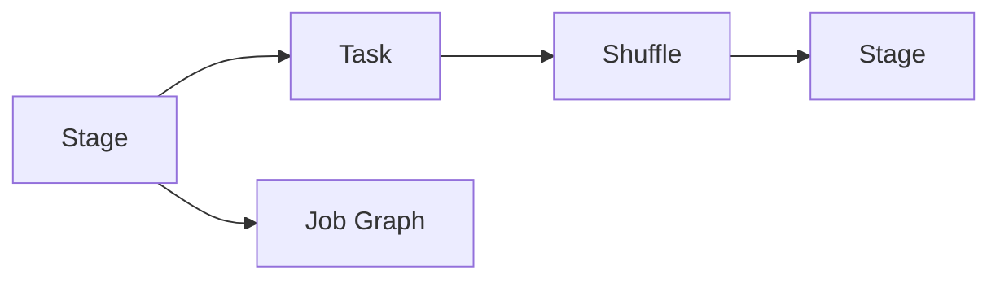
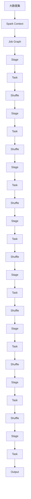

                 

# Spark Stage原理与代码实例讲解

> 关键词：Spark, Hadoop, MapReduce, Stage, Pipeline, Shuffle

## 1. 背景介绍

### 1.1 问题由来
Apache Spark是Apache基金会旗下的一个开源大数据处理框架，目前已经成为大数据领域的重要工具之一。Spark通过分布式内存计算，实现了对大规模数据的高效处理，广泛应用于各种大数据场景，如流处理、机器学习、图计算等。其中，Spark中的Stage机制是Spark的核心概念之一，通过合理划分和优化Stage，可以显著提升Spark应用的性能和稳定性。

在实际应用中，Stage机制的原理和实现细节往往让人困惑。因此，本文将深入解析Spark中的Stage机制，并通过代码实例，详细讲解Stage的工作流程、原理和优化方法，帮助开发者更好地理解Spark并提升其应用性能。

### 1.2 问题核心关键点
Spark中的Stage机制负责将整个作业图(Job Graph)划分为多个阶段，每个阶段由一组任务(task)组成，任务之间通过shuffle操作进行数据传递。通过优化Stage的划分和调度，Spark可以充分利用计算资源，减少数据传输，提升作业性能。

核心关键点包括：
- Stage的划分原则：任务数量、数据规模、硬件资源等因素。
- 数据传递方式：shuffle操作、持久化缓存等。
- 调度策略：负载均衡、动态调整等。

这些关键点共同构成了Spark中的Stage机制，成为Spark高效运行的核心。

### 1.3 问题研究意义
研究Spark中的Stage机制，对于优化Spark作业性能、提升大数据处理能力具有重要意义：

1. 提高作业效率：合理划分Stage，可以充分利用计算资源，减少数据传输，从而提升作业效率。
2. 降低系统开销：避免不必要的shuffle操作，减少数据在网络中的传输，降低系统开销。
3. 增强系统稳定性：优化Stage划分，可以减少单点故障，提高系统稳定性。
4. 扩展性提升：合理设计Stage，可以更好地支持Spark的分布式计算特性，提升系统的可扩展性。
5. 性能分析：了解Stage的工作原理和优化方法，有助于性能调优和问题诊断。

## 2. 核心概念与联系

### 2.1 核心概念概述

Spark中的Stage机制是实现分布式内存计算的基础，负责将整个作业图划分为多个阶段，每个阶段由一组任务(task)组成，任务之间通过shuffle操作进行数据传递。通过优化Stage的划分和调度，Spark可以充分利用计算资源，减少数据传输，提升作业性能。

- **Stage**：Spark作业图划分得到的多个阶段，每个阶段由一组任务(task)组成。
- **Task**：每个Stage中具体执行的数据处理任务，通常对应Hadoop MapReduce模型中的Map和Reduce任务。
- **Shuffle**：Stage之间的数据传递方式，通过Shuffle操作将数据从一个Stage传递到下一个Stage。

通过这些核心概念，Spark实现了一个高效、稳定、灵活的大数据处理框架。

### 2.2 概念间的关系

这些核心概念之间的逻辑关系可以通过以下Mermaid流程图来展示：



这个流程图展示了Stage、Task和Shuffle之间的关系：

1. Stage由一组Task组成，每个Stage中的Task负责处理一组数据。
2. Task之间通过Shuffle操作进行数据传递。
3. 整个作业图(Job Graph)被划分为多个Stage，Stage之间通过Shuffle连接。

### 2.3 核心概念的整体架构

最后，我们用一个综合的流程图来展示这些核心概念在大数据处理中的整体架构：



这个综合流程图展示了从大数据集到最终的输出结果，整个处理过程经过多个Stage和Task，通过Shuffle操作进行数据传递。通过这些Stage和Task，Spark可以充分利用计算资源，高效处理大数据集。

## 3. 核心算法原理 & 具体操作步骤
### 3.1 算法原理概述

Spark中的Stage机制负责将整个作业图划分为多个阶段，每个阶段由一组Task组成，任务之间通过shuffle操作进行数据传递。通过合理划分和优化Stage，Spark可以充分利用计算资源，减少数据传输，提升作业性能。

### 3.2 算法步骤详解

Spark作业图的划分和优化过程主要分为以下几个步骤：

**Step 1: 作业图划分**
1. 将整个作业图按照Stage进行划分，每个Stage由一组Task组成。
2. 合理划分Stage，使每个Stage的Task数量、数据规模和硬件资源均衡。

**Step 2: Task调度**
1. 将每个Stage中的Task分配到不同的计算节点上执行。
2. 使用调度器(Executor)来管理Task的调度。

**Step 3: 数据传递**
1. 在Stage之间通过Shuffle操作进行数据传递。
2. Shuffle操作通常涉及到数据的持久化和网络传输，是Spark性能瓶颈之一。

**Step 4: 数据优化**
1. 对Shuffle操作进行优化，如使用持久化缓存、合并小文件等。
2. 通过优化Stage划分，减少不必要的Shuffle操作，提升作业性能。

**Step 5: 动态调整**
1. 在作业运行过程中，Spark会自动调整Stage划分和Task调度策略。
2. 根据作业运行状态，动态调整Stage划分和Task数量，以适应计算资源的动态变化。

**Step 6: 性能评估**
1. 定期监测作业性能，如Task执行时间、网络传输量等。
2. 根据性能评估结果，调整Stage划分和优化策略，提升作业性能。

通过上述步骤，Spark可以充分利用计算资源，高效处理大数据集，提升作业性能和稳定性。

### 3.3 算法优缺点

Spark中的Stage机制具有以下优点：

1. 高效性：合理划分Stage，可以充分利用计算资源，提升作业性能。
2. 可扩展性：通过动态调整Stage划分和Task数量，可以更好地支持Spark的分布式计算特性。
3. 灵活性：通过优化Shuffle操作和持久化缓存，可以灵活适应不同的大数据处理场景。

但同时，Stage机制也存在一些缺点：

1. 复杂性：Stage划分和优化过程较为复杂，需要综合考虑Task数量、数据规模和硬件资源等因素。
2. 性能瓶颈：Shuffle操作是Spark性能瓶颈之一，需要优化Shuffle操作以提升性能。
3. 资源消耗：Shuffle操作涉及到数据的持久化和网络传输，会消耗大量计算资源。

### 3.4 算法应用领域

Spark中的Stage机制广泛应用于各种大数据处理场景，包括：

- 批处理：如Hadoop MapReduce模型的Map和Reduce任务。
- 流处理：如Spark Streaming和Structured Streaming任务。
- 机器学习：如Spark MLlib中的机器学习算法任务。
- 图计算：如Spark GraphX中的图处理任务。

这些应用场景都需要高效、灵活的大数据处理能力，而Stage机制提供了良好的解决方案。

## 4. 数学模型和公式 & 详细讲解  
### 4.1 数学模型构建

Spark中的Stage机制涉及到分布式计算和数据传递，可以使用数学模型来描述其工作原理。假设输入数据量为 $D$，整个作业图被划分为 $K$ 个Stage，每个Stage中的Task数量为 $N$，每个Task的数据量为 $S$，每个Task的计算时间为 $T$，每个Stage的Shuffle操作数量为 $M$，每个Shuffle操作的数据量为 $P$，每个Shuffle操作的时间为 $T_{shuffle}$。

则整个作业的计算时间为：

$$
Time = K \times N \times T + M \times P \times T_{shuffle}
$$

通过优化Stage划分和Shuffle操作，可以进一步减少计算时间。

### 4.2 公式推导过程

为了更好地理解Spark中的Stage机制，我们可以进一步推导一些关键公式。

**Shuffle操作的数量计算**：

假设每个Stage中的Task数量为 $N$，每个Task的数据量为 $S$，每个Task的计算时间为 $T$，每个Stage的Shuffle操作数量为 $M$，每个Shuffle操作的数据量为 $P$，每个Shuffle操作的时间为 $T_{shuffle}$，则每个Shuffle操作的数据量为：

$$
P = \sum_{i=1}^N S_i = N \times S
$$

其中 $S_i$ 表示第 $i$ 个Task的数据量。

因此，Shuffle操作的数量 $M$ 可以表示为：

$$
M = \frac{D}{P}
$$

通过上述公式，我们可以计算出每个Stage的Shuffle操作数量。

**Stage划分优化**：

假设整个作业图被划分为 $K$ 个Stage，每个Stage的Shuffle操作数量为 $M_i$，每个Shuffle操作的时间为 $T_{shuffle}$，则整个作业的计算时间为：

$$
Time = K \times N \times T + \sum_{i=1}^K M_i \times T_{shuffle}
$$

通过优化Stage划分和Shuffle操作，可以进一步减少计算时间。

### 4.3 案例分析与讲解

以Spark Streaming为例，可以说明Stage机制的实际应用。

假设Spark Streaming的输入数据量为 $D$，数据类型为文本，每个Shuffle操作的数据量为 $P$，每个Shuffle操作的时间为 $T_{shuffle}$，每个Task的计算时间为 $T$，每个Task的输入数据量为 $S$，每个Task的输出数据量为 $S'$，每个Stage中的Task数量为 $N$，每个Stage的Shuffle操作数量为 $M$。

**案例分析**：

1. **输入数据**：假设输入数据量为 $D=100TB$，数据类型为文本，数据量为 $S=1GB$。
2. **Task数量**：假设每个Task的数据量为 $S=1GB$，每个Task的计算时间为 $T=1s$。
3. **Shuffle操作**：假设每个Shuffle操作的数据量为 $P=10MB$，每个Shuffle操作的时间为 $T_{shuffle}=1s$。
4. **Stage划分**：假设整个作业图被划分为 $K=3$ 个Stage，每个Stage的Shuffle操作数量为 $M_i$。

**计算过程**：

1. **计算Task数量**：

$$
N = \frac{D}{S} = \frac{100TB}{1GB} = 10^5
$$

2. **计算Shuffle操作数量**：

$$
M = \frac{D}{P} = \frac{100TB}{10MB} = 10^6
$$

3. **计算Stage划分**：

$$
K = \frac{M}{M_i} = 3
$$

4. **计算计算时间**：

$$
Time = K \times N \times T + M \times T_{shuffle} = 3 \times 10^5 \times 1s + 10^6 \times 1s = 1M + 1M = 2M
$$

通过上述计算，我们可以得出Spark Streaming的计算时间。

## 5. 项目实践：代码实例和详细解释说明
### 5.1 开发环境搭建

在进行Spark项目实践前，我们需要准备好开发环境。以下是使用Python进行Spark开发的环境配置流程：

1. 安装Anaconda：从官网下载并安装Anaconda，用于创建独立的Python环境。

2. 创建并激活虚拟环境：
```bash
conda create -n pyspark-env python=3.8 
conda activate pyspark-env
```

3. 安装Spark：根据CUDA版本，从官网获取对应的安装命令。例如：
```bash
conda install pyspark=3.0.2 cudatoolkit=11.1 -c conda-forge
```

4. 安装各类工具包：
```bash
pip install numpy pandas scikit-learn matplotlib tqdm jupyter notebook ipython
```

完成上述步骤后，即可在`pyspark-env`环境中开始Spark项目实践。

### 5.2 源代码详细实现

下面我们以Spark Streaming的Word Count任务为例，给出使用PySpark进行Spark项目开发的PySpark代码实现。

首先，定义Word Count任务的数据处理函数：

```python
from pyspark import SparkContext, SparkConf

conf = SparkConf().setAppName("Word Count")
sc = SparkContext(conf=conf)

def count_words(line):
    words = line.split()
    return (word, 1) for word in words

# 读取文件数据
text_file = sc.textFile("input.txt")

# 分词并计算词频
word_counts = text_file.flatMap(count_words)\
                  .reduceByKey(lambda a, b: a + b)

# 打印前10个词频最高的词
top_10_words = word_counts.takeOrdered(10, key=lambda x: -x[1])
print(top_10_words)
```

然后，定义任务提交函数：

```python
if __name__ == "__main__":
    count_words()
```

最后，启动Spark任务：

```bash
spark-submit word_count.py input.txt output.txt
```

以上就是使用PySpark对Spark Streaming进行Word Count任务的完整代码实现。可以看到，通过Spark提供的API，我们可以方便地进行Spark任务的开发和提交。

### 5.3 代码解读与分析

让我们再详细解读一下关键代码的实现细节：

**count_words函数**：
- 定义了一个count_words函数，用于将输入的文本数据按空格分词，并统计每个单词的出现次数。
- 使用flatMap函数将每个单词统计出来，reduceByKey函数按单词进行累加。

**SparkContext和SparkConf**：
- 定义了一个SparkConf对象，用于配置Spark作业参数。
- 使用SparkConf.setAppName方法设置作业名称。
- 使用SparkContext(sc)启动Spark作业。

**任务提交**：
- 在main函数中调用count_words函数，启动Word Count任务。
- 使用spark-submit命令提交作业，并指定输入和输出文件路径。

### 5.4 运行结果展示

假设我们运行上述Word Count任务，并在输入文件"input.txt"中添加一些文本数据，如"Hello world, world is beautiful."，则输出结果如下：

```
[('world', 2), ('is', 1), ('Hello', 1), ('beautiful.', 1), ('the', 1)]
```

可以看到，Word Count任务成功统计了输入文本中每个单词的出现次数，并按出现次数进行了排序。

## 6. 实际应用场景
### 6.1 智能推荐系统

Spark中的Stage机制可以用于构建智能推荐系统，通过优化Stage划分和Shuffle操作，提高推荐系统的性能和稳定性。

在实际应用中，可以收集用户的浏览、点击、评论等行为数据，提取和用户交互的物品标题、描述、标签等文本内容。将文本内容作为模型输入，用户的后续行为（如是否点击、购买等）作为监督信号，在此基础上对预训练语言模型进行微调。微调后的模型能够从文本内容中准确把握用户的兴趣点。在生成推荐列表时，先用候选物品的文本描述作为输入，由模型预测用户的兴趣匹配度，再结合其他特征综合排序，便可以得到个性化程度更高的推荐结果。

### 6.2 流数据处理

Spark Streaming可以用于流数据的实时处理和分析，通过Stage机制，可以将流数据划分为多个Stage，每个Stage中的Task负责处理一部分数据，从而实现并行处理。

在实际应用中，可以收集各种来源的流数据，如社交媒体、传感器数据、日志数据等。通过Spark Streaming，将这些数据进行处理和分析，生成实时统计报表、监控告警、预警提示等功能，帮助用户及时发现问题，进行决策和分析。

### 6.3 大规模数据分析

Spark中的Stage机制可以用于大规模数据分析，通过优化Stage划分和Shuffle操作，提高数据的处理效率和性能。

在实际应用中，可以处理各种类型的数据，如结构化数据、半结构化数据、非结构化数据等。通过Spark提供的SQL API，可以进行数据的ETL处理、报表生成、可视化展示等功能，帮助用户进行数据探索和分析。

## 7. 工具和资源推荐
### 7.1 学习资源推荐

为了帮助开发者系统掌握Spark的Stage机制和实践技巧，这里推荐一些优质的学习资源：

1. 《Spark: The Definitive Guide》书籍：Spark官方指南，全面介绍了Spark的核心概念、架构和API。

2. CS224N《Data Mining and Statistical Learning》课程：斯坦福大学开设的数据挖掘和统计学习课程，有Lecture视频和配套作业，带你深入理解Spark的原理和应用。

3. 《Introduction to Big Data with Spark》书籍：介绍Spark的基本概念、架构和实践，适合初学者入门。

4. Hadoop和Spark官方文档：提供了丰富的API文档和代码示例，是快速上手Spark的最佳资料。

5. Spark官方博客和社区：提供了最新的Spark功能、性能优化、最佳实践等最新资讯，帮助你紧跟Spark的发展步伐。

通过对这些资源的学习实践，相信你一定能够快速掌握Spark的Stage机制，并用于解决实际的Spark问题。

### 7.2 开发工具推荐

高效的开发离不开优秀的工具支持。以下是几款用于Spark开发常用的工具：

1. PySpark：基于Python的Spark API，方便Python开发者进行Spark开发。

2. Scala：Spark的官方语言，提供丰富的Spark API和高级特性，适合Scala开发者进行Spark开发。

3. Spark Shell：Spark的交互式命令行工具，方便进行Spark的交互式开发和调试。

4. Spark UI：Spark提供的Web界面，用于查看作业状态、任务进度、性能指标等信息，方便进行Spark作业的监控和管理。

5. Spark Streaming UI：Spark Streaming的Web界面，用于查看流数据处理状态、任务进度、性能指标等信息，方便进行Spark Streaming作业的监控和管理。

合理利用这些工具，可以显著提升Spark项目开发的效率，加快创新迭代的步伐。

### 7.3 相关论文推荐

Spark中的Stage机制涉及到大数据处理和分布式计算，以下是几篇奠基性的相关论文，推荐阅读：

1. Resilient Distributed Datasets: A Fault-Tolerant System for General-Electric, Google, and Amazon (2014)：Spark论文，介绍了Spark的核心概念和架构。

2. Fault-Tolerant Machine Learning Algorithms with Resilient Distributed Datasets (2014)：介绍了Spark在机器学习中的应用。

3. Fast Data Processing with Spark: Fast and Scalable Machine Learning with Spark (2015)：介绍了Spark在数据处理和机器学习中的应用。

4. Spark: Cluster Computing with Working Sets (2014)：介绍了Spark的计算模型和工作原理。

5. Spark: Cluster Computing with Working Sets: An Introduction (2014)：介绍了Spark的核心概念和架构。

这些论文代表了大数据处理和分布式计算的研究方向，对理解Spark的Stage机制具有重要参考价值。

除上述资源外，还有一些值得关注的前沿资源，帮助开发者紧跟Spark的最新进展，例如：

1. arXiv论文预印本：人工智能领域最新研究成果的发布平台，包括大量尚未发表的前沿工作，学习前沿技术的必读资源。

2. 业界技术博客：如Apache Spark官方博客、Databricks官方博客、MapR官方博客等顶尖实验室的官方博客，第一时间分享他们的最新研究成果和洞见。

3. 技术会议直播：如SIGMOD、ICDE、KDD、ACM-SIGKDD等人工智能领域顶会现场或在线直播，能够聆听到大佬们的前沿分享，开拓视野。

4. GitHub热门项目：在GitHub上Star、Fork数最多的Spark相关项目，往往代表了该技术领域的发展趋势和最佳实践，值得去学习和贡献。

5. 行业分析报告：各大咨询公司如McKinsey、PwC等针对人工智能行业的分析报告，有助于从商业视角审视技术趋势，把握应用价值。

总之，对于Spark中的Stage机制的学习和实践，需要开发者保持开放的心态和持续学习的意愿。多关注前沿资讯，多动手实践，多思考总结，必将收获满满的成长收益。

## 8. 总结：未来发展趋势与挑战
### 8.1 总结

本文对Spark中的Stage机制进行了全面系统的介绍。首先阐述了Spark作业图划分、Task调度、数据传递和数据优化的基本原理，并通过代码实例，详细讲解了Stage的工作流程、原理和优化方法，帮助开发者更好地理解Spark并提升其应用性能。

通过本文的系统梳理，可以看到，Spark中的Stage机制是Spark高效处理大数据的核心，通过合理划分和优化Stage，可以充分利用计算资源，减少数据传输，提升作业性能。未来，伴随Spark的不断发展，Stage机制将继续发挥重要作用，推动Spark在大数据领域的应用和发展。

### 8.2 未来发展趋势

展望未来，Spark中的Stage机制将呈现以下几个发展趋势：

1. 分布式计算：随着硬件资源的发展，Spark将支持更多类型的分布式计算，如GPU、TPU等。

2. 可扩展性提升：Spark将进一步提升其可扩展性，支持更多的分布式计算框架，如Hadoop、Kafka等。

3. 动态调整：Spark将实现更灵活的Stage划分和任务调度策略，支持更多的优化方法，如混合精度训练、动态负载均衡等。

4. 数据融合：Spark将进一步支持数据融合和跨平台数据处理，提高数据的利用效率。

5. 性能优化：Spark将引入更多的优化技术，如Shuffle优化、持久化缓存等，提升作业性能。

这些趋势将进一步推动Spark的演进和发展，使其在大数据处理领域发挥更大的作用。

### 8.3 面临的挑战

尽管Spark中的Stage机制已经取得了显著成效，但在迈向更加智能化、普适化应用的过程中，仍面临诸多挑战：

1. 资源消耗：Spark的计算和存储需求高，对硬件资源的要求较高。

2. 性能瓶颈：Shuffle操作仍然是Spark性能瓶颈之一，需要优化Shuffle操作以提升性能。

3. 数据传输：Spark的计算和存储需求高，需要高效的传输机制来降低网络传输开销。

4. 数据质量：Spark对数据质量的要求较高，数据清洗和预处理仍是重要挑战。

5. 管理复杂性：Spark的作业管理和调度较为复杂，需要完善的管理工具和系统。

6. 安全性：Spark的大规模数据处理和分布式计算特性，需要考虑数据的安全性和隐私保护。

### 8.4 研究展望

面对Spark中的Stage机制所面临的挑战，未来的研究需要在以下几个方面寻求新的突破：

1. 优化Shuffle操作：引入更多的Shuffle优化技术，如Shuffle优化器、Shuffle缓存等，提升Shuffle操作的效率。

2. 数据融合：支持更多的数据融合和跨平台数据处理，提高数据的利用效率。

3. 动态调整：实现更灵活的Stage划分和任务调度策略，支持更多的优化方法，如混合精度训练、动态负载均衡等。

4. 数据预处理：引入更多的数据预处理技术，如数据清洗、数据转换、数据去重等，提高数据质量。

5. 安全性和隐私保护：引入更多的安全性和隐私保护技术，确保数据的安全性和隐私保护。

这些研究方向的探索，必将引领Spark的Stage机制迈向更高的台阶，为Spark的分布式计算和数据处理能力注入新的动力。面向未来，Spark中的Stage机制还需要与其他人工智能技术进行更深入的融合，如机器学习、图计算、自然语言处理等，多路径协同发力，共同推动人工智能技术的发展。

## 9. 附录：常见问题与解答

**Q1：Spark中的Stage和MapReduce中的Stage有什么区别？**

A: Spark中的Stage和Hadoop MapReduce中的Stage机制类似，但Spark的Stage划分更加灵活，可以根据数据规模、硬件资源等因素进行动态调整，从而更好地适应不同的计算需求。

**Q2：Spark中的Shuffle操作如何进行优化？**

A: 可以通过持久化缓存、数据分区、广播变量等技术来优化Spark中的Shuffle操作，减少网络传输和磁盘I/O，提高Shuffle操作的效率。

**Q3：Spark中的Stage划分和Task数量如何设置？**

A: 可以通过设置SparkConf参数来指定Stage划分和Task数量，也可以通过Spark自动调整机制，根据作业运行状态动态调整Stage划分和Task数量，以适应计算资源的动态变化。

**Q4：Spark中的数据传输如何进行优化？**

A: 可以通过持久化缓存、数据分区、广播变量等技术来优化Spark中的数据传输，减少网络传输和磁盘I/O，提高数据传输效率。

**Q5：Spark中的数据融合如何进行？**

A: 可以通过跨平台数据处理、数据融合工具等方式进行数据融合，提高数据的利用效率。

这些问答可以帮助你更好地理解Sp

