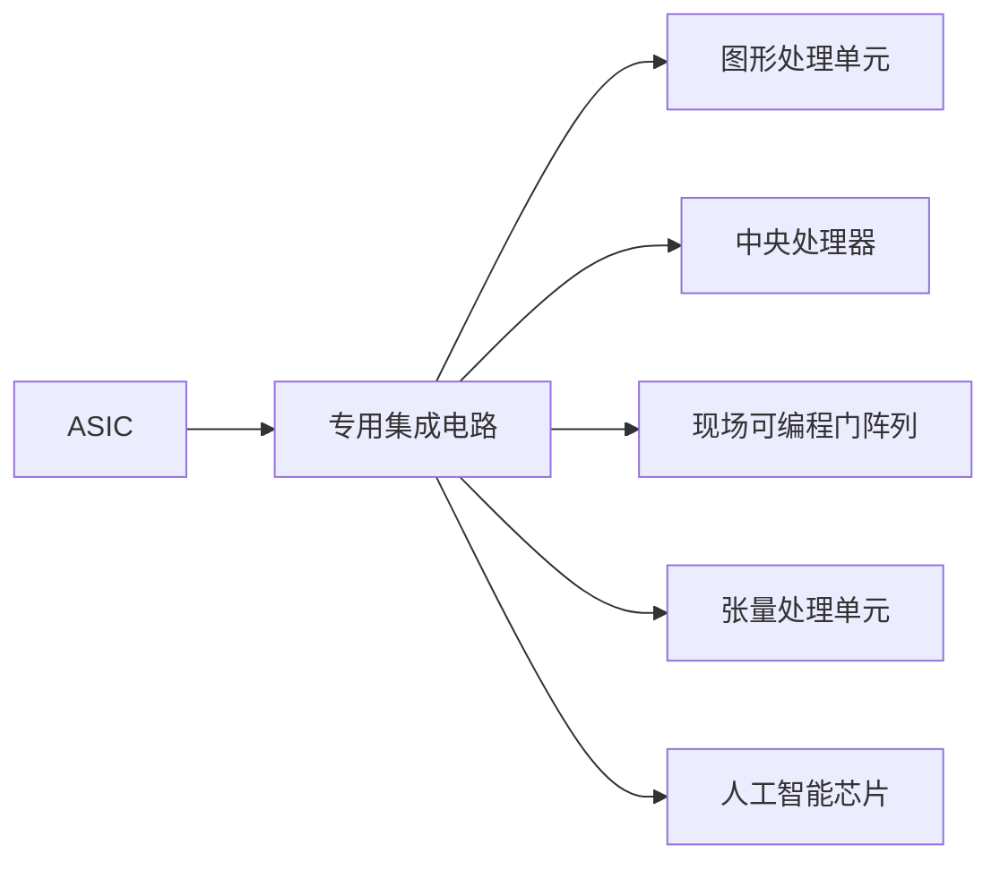

                 

# 芯片在人工智能底层创新体系中的作用

## 1. 背景介绍

### 1.1 问题由来
人工智能(AI)正迅速成为全球创新和竞争的焦点。随着AI在各行各业的深入应用，其底层基础设施，特别是芯片，正在经历前所未有的变革和创新。芯片作为AI硬件加速的重要组成部分，其设计和性能直接决定了AI系统效能。本文将从芯片在AI底层创新体系中的作用进行探讨。

### 1.2 问题核心关键点
芯片在AI系统中的作用主要体现在以下几个方面：

- 硬件加速：AI训练和推理过程中涉及大量复杂计算，通过芯片进行硬件加速可以大幅提升计算效率。
- 专用架构：AI应用场景多样，需要定制化硬件架构以适应不同任务的计算需求。
- 能效优化：高效能芯片能够显著提升AI系统的能效，降低能耗成本。
- 安全可控：芯片在AI系统中具有关键地位，其安全性和可控性对于AI系统的应用至关重要。
- 生态协同：芯片与AI应用框架、软件堆栈、云计算平台等生态要素密切相关，需进行协同设计。

## 2. 核心概念与联系

### 2.1 核心概念概述

为更好地理解芯片在AI系统中的作用，我们先介绍几个核心概念：

- **专用集成电路(ASIC)**：专为特定应用设计定制的集成电路，具有高效率和低成本特点。
- **图形处理单元(GPU)**：最初为图形渲染设计，现广泛应用于AI深度学习任务。
- **中央处理器(CPU)**：通用性处理器，可用于多种计算任务，包括AI任务。
- **现场可编程门阵列(FPGA)**：支持快速重构的可编程芯片，适合灵活适应AI任务需求。
- **张量处理单元(TPU)**：专为深度学习设计的专用芯片，优化了张量运算。
- **人工智能芯片**：结合AI算法特点设计的专用芯片，具有高计算效能和低功耗特性。

这些概念间的关系可以由以下Mermaid流程图表示：



### 2.2 概念间的关系

- **ASIC与GPU**：ASIC具有高度定制化特性，而GPU可重构性好，适用于多种AI任务。
- **CPU与TPU**：CPU通用性强，TPU则专为AI深度学习设计，具有高效计算能力。
- **FPGA与ASIC**：FPGA灵活可编程，可快速适应不同AI任务，而ASIC则固定实现特定功能。
- **GPU与TPU**：GPU可广泛用于各类AI计算任务，TPU则更专注于深度学习。

这些概念的结合，形成了芯片在AI系统中的多样化应用。

## 3. 核心算法原理 & 具体操作步骤
### 3.1 算法原理概述

芯片在AI系统中主要通过以下算法原理实现其功能：

- **并行计算**：AI系统依赖大量的并行计算，芯片通过多核、多线程或专用硬件加速单元实现并行化。
- **专用架构**：根据AI任务的特点，定制化设计芯片结构以提高计算效率。
- **数据流优化**：优化数据在芯片和系统中的流动路径，减少延迟和数据冗余。
- **能效管理**：芯片通过能效管理技术减少功耗，提升电池寿命或系统运行时间。

### 3.2 算法步骤详解

芯片在AI系统中的作用通常分为以下步骤：

1. **芯片设计与验证**：基于AI任务需求设计芯片，进行仿真验证以确保其性能。
2. **生产与封装**：将芯片生产出来并进行封装，确保其物理和电气性能。
3. **集成到AI系统**：将芯片集成到AI硬件架构中，与AI软件堆栈协同工作。
4. **性能调优**：根据AI系统性能反馈，调整芯片配置或进行微调以优化性能。

### 3.3 算法优缺点

芯片在AI系统中的作用主要具有以下优缺点：

**优点：**

- 高效率：芯片可以提供比传统处理器更高的计算效率。
- 专用性：根据AI任务需求定制化芯片，能够优化特定任务。
- 低功耗：先进工艺和能效管理技术，使芯片低功耗运行。

**缺点：**

- 设计复杂：定制化芯片设计周期长，开发成本高。
- 生产难度大：生产过程中可能存在缺陷，影响产品质量。
- 灵活性不足：ASIC等定制化芯片灵活性较低，适应新任务能力有限。

### 3.4 算法应用领域

芯片在AI系统中的应用领域广泛，涉及以下几个方面：

- **深度学习训练**：GPU、TPU等芯片广泛应用于深度学习模型的训练任务。
- **实时推理**：芯片用于实时计算推理任务，如自动驾驶、智能监控等。
- **边缘计算**：嵌入式芯片用于边缘计算场景，如智能家居、工业控制等。
- **云AI平台**：云计算环境中的芯片支持大规模AI模型的运行与处理。

## 4. 数学模型和公式 & 详细讲解  
### 4.1 数学模型构建

芯片在AI系统中的作用可以通过数学模型进行描述。以深度学习训练为例，模型可表示为：

$$
Y=f\left( X; \theta \right)
$$

其中 $X$ 为输入数据， $Y$ 为输出， $f$ 为模型计算函数， $\theta$ 为模型参数。

### 4.2 公式推导过程

对于深度学习模型，计算过程可分为前向传播和反向传播。假设模型为 $M_{\theta}$，其前向传播过程为：

$$
y_0 = M_{\theta}(x)
$$

其中 $x$ 为输入样本， $y_0$ 为模型输出。反向传播过程计算梯度，更新参数 $\theta$：

$$
\frac{\partial L}{\partial \theta} = \frac{\partial L}{\partial y_0} \frac{\partial y_0}{\partial \theta}
$$

其中 $L$ 为损失函数， $\frac{\partial y_0}{\partial \theta}$ 为模型对参数 $\theta$ 的导数。

### 4.3 案例分析与讲解

考虑一个典型的卷积神经网络(CNN)模型，假设其包含卷积层、池化层和全连接层。其计算过程如下：

1. 输入数据 $x$ 经过卷积层处理，生成卷积特征 $y_1$。
2. 对 $y_1$ 进行池化，得到池化特征 $y_2$。
3. $y_2$ 通过全连接层生成最终输出 $y_0$。

通过反向传播算法，可以计算 $y_0$ 对输入 $x$ 的导数：

$$
\frac{\partial y_0}{\partial x} = \frac{\partial y_0}{\partial y_2} \frac{\partial y_2}{\partial y_1} \frac{\partial y_1}{\partial x}
$$

通过这一过程，更新卷积层和全连接层的权重，优化模型参数。

## 5. 项目实践：代码实例和详细解释说明
### 5.1 开发环境搭建

搭建AI系统开发环境主要包括以下步骤：

1. **操作系统选择**：选择适合AI开发的Linux操作系统，如Ubuntu、CentOS等。
2. **依赖包管理**：使用 `apt-get` 或 `yum` 安装开发依赖包，如编译器、库文件等。
3. **容器化技术**：采用Docker、Kubernetes等容器化技术，便于管理和部署AI系统。

### 5.2 源代码详细实现

以深度学习训练为例，使用TensorFlow进行模型实现。

```python
import tensorflow as tf

# 定义模型
def model(x):
    conv1 = tf.layers.conv2d(x, 32, (3, 3), activation=tf.nn.relu)
    pool1 = tf.layers.max_pooling2d(conv1, (2, 2), (2, 2))
    conv2 = tf.layers.conv2d(pool1, 64, (3, 3), activation=tf.nn.relu)
    pool2 = tf.layers.max_pooling2d(conv2, (2, 2), (2, 2))
    flatten = tf.contrib.layers.flatten(pool2)
    fc1 = tf.layers.dense(flatten, 512, activation=tf.nn.relu)
    output = tf.layers.dense(fc1, 10, activation=tf.nn.softmax)

    return output

# 定义训练函数
def train(model, x_train, y_train, x_valid, y_valid, batch_size=64, num_epochs=10):
    with tf.Session() as sess:
        # 定义损失函数
        loss = tf.reduce_mean(tf.nn.softmax_cross_entropy_with_logits(logits=model, labels=y_train))

        # 定义优化器
        optimizer = tf.train.AdamOptimizer(learning_rate=0.001)
        train_op = optimizer.minimize(loss)

        # 定义评估函数
        correct_pred = tf.equal(tf.argmax(model, 1), tf.argmax(y_train, 1))
        accuracy = tf.reduce_mean(tf.cast(correct_pred, tf.float32))

        # 初始化变量
        sess.run(tf.global_variables_initializer())

        # 训练模型
        for epoch in range(num_epochs):
            for i in range(len(x_train)//batch_size):
                batch_x, batch_y = x_train[i*batch_size:(i+1)*batch_size], y_train[i*batch_size:(i+1)*batch_size]
                sess.run(train_op, feed_dict={x: batch_x, y: batch_y})
                if i % 100 == 0:
                    train_loss = sess.run(loss, feed_dict={x: batch_x, y: batch_y})
                    train_acc = sess.run(accuracy, feed_dict={x: batch_x, y: batch_y})
                    print("Epoch {0}, Step {1}, Loss: {2}, Accuracy: {3}".format(epoch+1, i+1, train_loss, train_acc))

            # 评估模型
            test_loss, test_acc = sess.run([loss, accuracy], feed_dict={x: x_valid, y: y_valid})
            print("Epoch {0}, Test Loss: {1}, Test Accuracy: {2}".format(epoch+1, test_loss, test_acc))

        print("Training Finished")
```

### 5.3 代码解读与分析

上述代码实现了卷积神经网络模型在TensorFlow上的训练过程。解释如下：

1. `model` 函数定义了卷积神经网络的结构。
2. `train` 函数定义了训练过程，包括损失函数、优化器、评估函数等。
3. 使用 `tf.Session` 进行会话管理。
4. 在训练过程中，每100个batch输出一次训练损失和准确率。
5. 训练结束后，输出测试集上的损失和准确率。

### 5.4 运行结果展示

假设训练过程中，在某个epoch的第一步batch中，训练集上的损失和准确率为0.2和0.95，可以输出：

```
Epoch 1, Step 1, Loss: 0.2, Accuracy: 0.95
```

## 6. 实际应用场景
### 6.4 未来应用展望

随着芯片技术的不断进步，未来芯片在AI系统中的作用将更加广泛和深入：

- **更高效的AI芯片**：未来芯片将更注重能效和性能的协同优化，如芯片异构融合、计算图优化等。
- **AI芯片生态**：随着AI芯片的普及，将形成更完善的芯片生态系统，芯片制造商、软件开发者、硬件平台等协同发展。
- **AI与IoT融合**：AI芯片将深度融入物联网(IoT)设备中，推动智能设备的普及和智能化升级。
- **边缘计算与AI芯片**：芯片与边缘计算技术结合，实现本地化数据处理和实时决策，进一步提升AI应用的价值。

## 7. 工具和资源推荐
### 7.1 学习资源推荐

- **《深度学习与人工智能芯片》**：本书系统介绍了AI芯片的原理、设计和应用。
- **Coursera《AI芯片设计》课程**：由斯坦福大学开设，涵盖芯片设计与实现的全过程。
- **IEEE Xplore数据库**：收录大量AI芯片相关论文，是学习和了解最新进展的好去处。
- **FPGA中国开发者社区**：提供丰富的FPGA资源，学习AI与FPGA结合的实际应用。

### 7.2 开发工具推荐

- **Cadence、Synopsys等EDA工具**：用于芯片设计和仿真验证。
- **HLS（高层次综合）工具**：如Intel HLS、Cadence Zynq，用于系统级芯片设计。
- **Rivvy等AI设计平台**：提供AI芯片设计和仿真的一站式解决方案。
- **TensorRT、ONNX-Runtime等优化工具**：用于AI模型优化和加速，如量化、剪枝、融合等。

### 7.3 相关论文推荐

- **“The emergence of AI hardware”**：IEEE Spectrum文章，讨论了AI芯片技术的发展方向和趋势。
- **“An overview of GPU architecture and its application in AI”**：ACL 2020论文，介绍了GPU在AI中的应用。
- **“Optimization of AI hardware architecture”**：CS&VR 2019论文，研究了AI芯片架构优化的理论和方法。

## 8. 总结：未来发展趋势与挑战
### 8.1 研究成果总结

本文对芯片在AI系统中的作用进行了详细探讨。通过分析专用芯片、GPU、CPU、FPGA、TPU等不同类型芯片的特点和优势，展示了芯片在AI系统中的多样化应用。同时，通过数学模型和代码实例，介绍了芯片在深度学习模型训练中的具体实现过程。

### 8.2 未来发展趋势

未来，AI芯片将呈现以下发展趋势：

- **异构芯片融合**：多类型芯片融合，提升整体计算效率和灵活性。
- **能效管理优化**：结合AI算法特点，优化芯片能效管理技术。
- **人工智能与芯片协同设计**：AI应用和芯片设计同步进行，提升系统整体效能。
- **芯片架构创新**：探索新型的芯片架构，如类脑芯片、量子芯片等。

### 8.3 面临的挑战

尽管芯片在AI系统中具有重要作用，但也面临以下挑战：

- **设计复杂度**：设计周期长、成本高，需更高效的开发工具和设计方法。
- **生产良率**：芯片生产过程中可能存在缺陷，需更严格的质量控制。
- **生态协同**：芯片与软件、硬件、算法等生态要素的协同设计难度大。

### 8.4 研究展望

未来，芯片在AI系统中的应用需关注以下方向：

- **芯片与AI算法的深度融合**：优化芯片架构和算法，提升计算效率。
- **跨领域芯片设计**：在AI、物联网、医疗等多个领域进行芯片设计，推动技术普及。
- **芯片安全性与可控性**：确保芯片设计和使用过程中的安全性和可控性，保障AI应用的安全。

## 9. 附录：常见问题与解答

**Q1：AI芯片在设计过程中，如何保证能效与性能的协同？**

A: 在设计AI芯片时，通常采用以下策略：

1. **能效优化算法**：通过算法优化，减少计算量和访存带宽，提升芯片能效。
2. **芯片异构设计**：结合GPU、FPGA、ASIC等不同类型的芯片，进行任务负载均衡，提升整体计算效率。
3. **低功耗技术**：使用动态电压和频率调整(DVFS)、电源管理等技术，降低芯片功耗。
4. **芯片封装设计**：优化芯片封装设计，减少散热和能耗损失。

**Q2：AI芯片在边缘计算中的应用有哪些？**

A: AI芯片在边缘计算中的应用包括：

1. **智能摄像头**：用于实时视频处理、物体检测等任务。
2. **智能家居设备**：进行语音识别、环境感知等。
3. **工业物联网(IoT)**：在生产设备中进行异常监测、智能控制等。
4. **智慧城市**：用于视频监控、交通管理等场景。

**Q3：未来AI芯片的设计方向有哪些？**

A: 未来AI芯片的设计方向包括：

1. **异构融合芯片**：融合GPU、FPGA、ASIC等芯片，实现更高效的计算。
2. **类脑芯片**：模拟人类大脑工作原理，提升计算效率和能效。
3. **量子计算芯片**：探索量子计算在AI中的应用，提升计算能力。
4. **新材料芯片**：利用新材料和工艺，提升芯片的能效和性能。

**Q4：AI芯片与传统芯片在设计上有何不同？**

A: AI芯片与传统芯片在设计上有以下不同：

1. **并行计算**：AI芯片需要高并行计算能力，通过多核、多线程等技术实现。
2. **特殊硬件加速**：AI芯片需要特殊硬件加速单元，如张量处理单元。
3. **数据流优化**：AI芯片需要优化数据流动路径，减少延迟和冗余。
4. **能效管理**：AI芯片需要优化能效管理技术，降低功耗。

**Q5：芯片在AI系统中的安全性问题有哪些？**

A: 芯片在AI系统中的安全性问题包括：

1. **硬件攻击**：如侧信道攻击、植入硬件恶意电路等。
2. **数据隐私**：AI数据存储和处理过程中可能存在隐私泄露风险。
3. **模型安全性**：AI模型可能被篡改或注入恶意代码，导致系统失控。

---

作者：禅与计算机程序设计艺术 / Zen and the Art of Computer Programming

