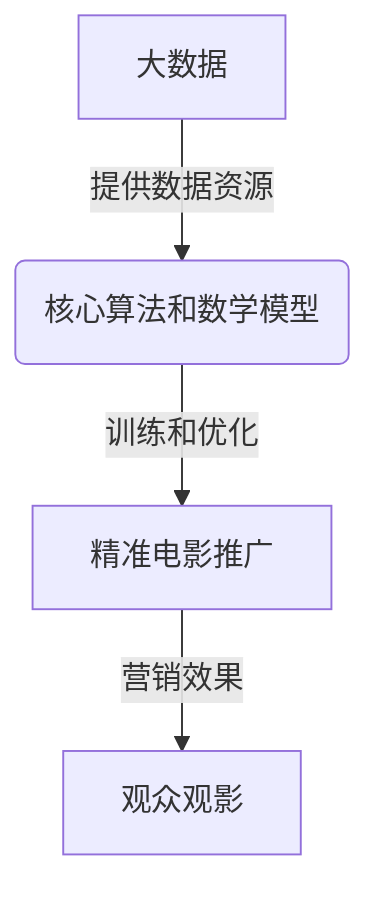

# 大数据背景下的国产电影推广策略研究

## 1. 背景介绍

### 1.1 问题的由来

在当今大数据时代,信息传播渠道日益多元化,观众对电影内容的需求也变得更加个性化和多样化。国产电影作为中国文化产业的重要组成部分,如何在激烈的市场竞争中脱颖而出,吸引更多观众关注,成为了一个亟待解决的问题。传统的营销推广方式已经难以满足当前市场的需求,因此,如何利用大数据技术来优化国产电影的推广策略,成为了一个值得探讨的重要课题。

### 1.2 研究现状

近年来,大数据技术在电影营销领域的应用越来越广泛。一些学者和企业已经开始尝试利用大数据分析观众的兴趣爱好、观影习惯等,从而制定更加精准的营销策略。然而,由于国产电影的特殊性,单纯借鉴国外的营销模式并不能完全适用于国内市场。因此,需要结合国产电影自身的特点,探索更加符合国情的推广策略。

### 1.3 研究意义

本研究旨在探讨如何利用大数据技术,优化国产电影的推广策略,从而提高国产电影在国内外市场的影响力和竞争力。具体来说,本研究将从以下几个方面入手:

1. 分析国产电影观众的特征和需求,为精准营销奠定基础。
2. 探索利用大数据技术进行内容个性化推荐的方法。
3. 研究基于大数据的新型营销模式,如社交媒体营销、内容营销等。
4. 探讨如何利用大数据技术进行电影质量评估和口碑监测。
5. 提出一套完整的大数据驱动的国产电影推广策略框架。

### 1.4 本文结构

本文共分为九个部分:

1. 背景介绍
2. 核心概念与联系
3. 核心算法原理与具体操作步骤
4. 数学模型和公式详细讲解与举例说明
5. 项目实践:代码实例和详细解释说明
6. 实际应用场景
7. 工具和资源推荐
8. 总结:未来发展趋势与挑战
9. 附录:常见问题与解答

## 2. 核心概念与联系

在探讨大数据背景下的国产电影推广策略之前,我们需要先了解一些核心概念及它们之间的联系。

### 2.1 大数据

大数据(Big Data)是指无法使用传统数据库软件工具在合理时间内获取、管理和处理的海量、高增长率和多样化的信息资产。大数据具有4V特征:

- 海量(Volume)
- 多样(Variety)
- 高速(Velocity)
- 价值(Value)

### 2.2 电影推广

电影推广是指通过各种营销手段和渠道,让目标受众了解并产生观影欲望的一系列活动。传统的电影推广方式包括电视广告、户外广告、新闻发布会等。而在大数据时代,电影推广需要借助大数据技术,实现更加精准、个性化和高效的营销。

### 2.3 核心算法

为了实现基于大数据的精准电影推广,需要应用多种算法和模型,包括:

- **协同过滤算法**:基于用户之间的相似性或者物品之间的相似性进行推荐。
- **内容过滤算法**:根据物品的内容特征(如电影的类型、演员等)与用户的兴趣爱好进行匹配。
- **混合算法**:综合协同过滤和内容过滤的优点,提高推荐的准确性和多样性。
- **深度学习模型**:利用神经网络等深度学习模型自动提取用户和物品的特征,进行个性化推荐。

### 2.4 数学模型

在大数据背景下的电影推广策略中,需要构建多种数学模型来描述和解决实际问题,例如:

- **矩阵分解模型**:将用户-物品评分矩阵分解为用户特征矩阵和物品特征矩阵,用于协同过滤推荐。
- **主题模型**:通过主题模型(如LDA)从电影文本数据中自动提取主题,用于内容推荐。
- **图模型**:将用户、物品及其关系表示为异构图,用于社交影响建模和推荐。
- **深度学习模型**:包括自编码器、卷积神经网络等,用于自动特征提取和个性化推荐。

### 2.5 关系总结

上述核心概念相互关联、环环相扣:

1. 大数据技术为电影推广提供了海量多样的数据资源。
2. 核心算法和数学模型是实现基于大数据的精准电影推广的关键。
3. 算法和模型需要利用大数据进行训练,从而发挥最大效能。
4. 电影推广的目标是让更多观众了解并产生观影欲望,实现最大化营销效果。

上图展示了这些核心概念之间的关系。接下来,我们将详细介绍核心算法原理、数学模型以及实际应用。

## 3. 核心算法原理与具体操作步骤

### 3.1 算法原理概述

在大数据背景下进行电影推广,核心算法主要包括协同过滤算法、内容过滤算法和混合算法等。

#### 协同过滤算法

协同过滤算法是基于"物以类聚,人以群分"的思想,利用用户之间或物品之间的相似性进行推荐。主要分为两大类:

1. **基于用户的协同过滤**(User-based CF)

   - 基本思路:给定一个目标用户,找到与其兴趣相似的其他用户,并推荐这些相似用户喜欢的物品。
   - 算法步骤:
     1) 计算任意两个用户之间的相似度
     2) 选取与目标用户相似度最高的 K 个用户作为近邻
     3) 根据这 K 个近邻用户对物品的评分,预测目标用户对其他物品的评分
     4) 推荐给目标用户预测评分较高的物品

2. **基于物品的协同过滤**(Item-based CF)

   - 基本思路:给定一个目标物品,找到与其相似的其他物品,并推荐给喜欢目标物品的用户。
   - 算法步骤:
     1) 计算任意两个物品之间的相似度
     2) 选取与目标物品相似度最高的 K 个物品作为近邻
     3) 根据目标用户对这 K 个近邻物品的评分,预测其对目标物品的评分
     4) 推荐给用户预测评分较高的物品

上述算法的关键在于相似度的计算方法,常用的有余弦相似度、皮尔逊相关系数等。

#### 内容过滤算法

内容过滤算法是根据物品内容特征与用户兴趣爱好的相似度进行推荐。对于电影推荐,常用的内容特征包括:

- 电影类型(剧情、动作、喜剧等)
- 演员
- 导演
- 关键词(剧情简介中提取的关键词)
- 上映时间
- 制作国家/地区
- 等等

算法步骤:

1. 提取用户兴趣特征和物品内容特征
2. 计算用户兴趣特征与物品内容特征之间的相似度
3. 根据相似度大小,推荐相似度较高的物品给用户

特征提取和相似度计算是内容过滤算法的关键,常用的方法包括 TF-IDF、Word2Vec、主题模型(LDA)等。

#### 混合算法

协同过滤算法和内容过滤算法各有优缺点,混合算法试图结合两者的优点,提高推荐的准确性和多样性。

常见的混合策略包括:

- 线性组合:将协同过滤和内容过滤的推荐结果进行加权求和
- 串行组合:先利用内容过滤进行初步筛选,再在筛选结果上应用协同过滤
- 并行组合:分别应用协同过滤和内容过滤,再将结果合并
- 层次混合:利用协同过滤的结果作为内容过滤的输入,或反之
- 基于模型的混合:构建统一的模型,同时考虑协同过滤和内容过滤的因素

混合算法的关键在于合理设计混合策略,充分发挥各个算法的优势。

### 3.2 算法步骤详解

接下来,我们以基于用户的协同过滤算法为例,详细讲解算法的具体步骤。

#### 步骤1: 构建用户-物品评分矩阵

假设有 m 个用户,n 个物品(电影),我们可以构建一个 m×n 的用户-物品评分矩阵 R:

$$
R=\begin{bmatrix}
    r_{11} & r_{12} & \cdots & r_{1n} \
    r_{21} & r_{22} & \cdots & r_{2n} \
    \vdots & \vdots & \ddots & \vdots \
    r_{m1} & r_{m2} & \cdots & r_{mn}
\end{bmatrix}
$$

其中 $r_{ij}$ 表示用户 i 对物品 j 的评分,通常取值为 1-5 分或者 0-1(0 表示未评分)。

#### 步骤2: 计算用户相似度

对于任意两个用户 i 和 j,我们可以计算它们的相似度 $sim(i,j)$。常用的相似度计算方法有:

1. **余弦相似度**

   $$sim(i,j)=\frac{\vec{r_i}\cdot\vec{r_j}}{||\vec{r_i}||\times||\vec{r_j}||}=\frac{\sum\limits_{k}r_{ik}r_{jk}}{\sqrt{\sum\limits_{k}r_{ik}^2}\sqrt{\sum\limits_{k}r_{jk}^2}}$$

   其中 $\vec{r_i}$ 和 $\vec{r_j}$ 分别表示用户 i 和用户 j 的评分向量。

2. **皮尔逊相关系数**

   $$sim(i,j)=\frac{\sum\limits_{k}(r_{ik}-\overline{r_i})(r_{jk}-\overline{r_j})}{\sqrt{\sum\limits_{k}(r_{ik}-\overline{r_i})^2}\sqrt{\sum\limits_{k}(r_{jk}-\overline{r_j})^2}}$$

   其中 $\overline{r_i}$ 和 $\overline{r_j}$ 分别表示用户 i 和用户 j 的平均评分。

上述公式都是基于用户 i 和用户 j 共同评分过的物品进行计算的。如果两个用户没有共同评分过的物品,则它们的相似度被设置为 0。

#### 步骤3: 找到最近邻

对于目标用户 u,我们可以根据与其他用户的相似度,选取相似度最高的 K 个用户作为 u 的最近邻集合 $N_u$。

#### 步骤4: 预测目标用户的评分并进行推荐

对于目标用户 u 未评分的物品 i,我们可以利用最近邻集合 $N_u$ 预测 u 对 i 的评分:

$$\hat{r}_{ui}=\overline{r_u}+\frac{\sum\limits_{v\in N_u}sim(u,v)(r_{vi}-\overline{r_v})}{\sum\limits_{v\in N_u}|sim(u,v)|}$$

其中 $\overline{r_u}$ 表示用户 u 的平均评分。

根据预测评分从高到低排序,我们可以推荐给用户 u 预测评分较高的物品。

上述就是基于用户的协同过滤算法的核心步骤,其他算法(如基于物品的协同过滤、内容过滤等)的具体步骤也是类似的,只是细节上有所不同。

### 3.3 算法优缺点

不同的推荐算法各有优缺点,我们需要根据具体场景选择合适的算法。

#### 协同过滤算法

**优点**:

- 无需了解物品内容,只需要用户的历史行为数据
-