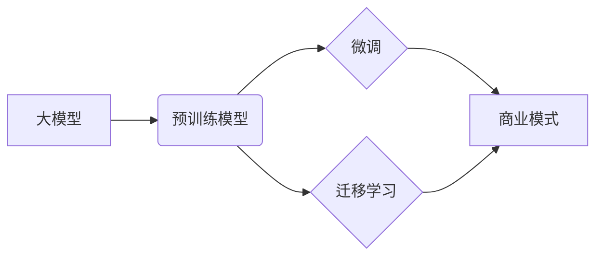

# 大模型：智能时代的商业新模式

## 1. 背景介绍

### 1.1 问题的由来

近年来，随着人工智能（AI）技术的飞速发展，各行各业都在积极探索如何利用AI技术实现产业升级和转型。其中，大模型作为AI领域的一项重要突破，凭借其强大的学习能力和泛化能力，正在深刻地改变着商业模式和人们的生活方式。

传统的商业模式往往依赖于人工经验和规则，难以应对海量数据、复杂场景和个性化需求。而大模型的出现，为解决这些问题提供了新的思路和方法。通过对海量数据的学习，大模型能够自动提取数据特征，挖掘潜在规律，并进行预测和决策，从而实现更高效、更精准、更智能的商业运营。

### 1.2 研究现状

目前，大模型已经在多个领域取得了令人瞩目的成果，例如：

* **自然语言处理（NLP）**:  GPT-3、BERT等大模型在文本生成、机器翻译、问答系统等方面表现出色，极大地提升了人机交互的效率和体验。
* **计算机视觉（CV）**:  ResNet、EfficientNet等大模型在图像识别、目标检测、图像分割等方面取得了突破性进展，为自动驾驶、智能安防等领域的发展奠定了基础。
* **数据挖掘**:  大模型能够从海量数据中挖掘出隐藏的模式和规律，为精准营销、风险控制、个性化推荐等提供数据支持。

### 1.3 研究意义

大模型的出现，不仅推动了AI技术的进步，也为商业模式的创新带来了新的机遇。通过将大模型应用于各个业务环节，企业可以实现：

* **降本增效**:  自动化处理重复性、低价值的任务，降低人力成本，提高运营效率。
* **提升用户体验**:  提供更加个性化、智能化的产品和服务，增强用户粘性。
* **开拓新市场**:  基于大模型的能力，开发新的产品和服务，拓展新的市场空间。

### 1.4 本文结构

本文将从以下几个方面对大模型驱动的商业新模式进行深入探讨：

* 核心概念与联系
* 核心算法原理 & 具体操作步骤
* 数学模型和公式 & 详细讲解 & 举例说明
* 项目实践：代码实例和详细解释说明
* 实际应用场景
* 工具和资源推荐
* 总结：未来发展趋势与挑战
* 附录：常见问题与解答

## 2. 核心概念与联系

### 2.1 大模型

大模型是指参数量巨大、训练数据量庞大的深度学习模型，通常包含数亿甚至数万亿个参数。这些模型具有强大的学习能力和泛化能力，能够处理复杂的任务，并取得令人印象深刻的结果。

### 2.2 预训练模型

预训练模型是指在大规模数据集上进行预先训练的模型。这些模型已经学习到了丰富的知识和特征，可以作为其他任务的基础模型，进行微调或迁移学习。

### 2.3 微调

微调是指在预训练模型的基础上，使用特定任务的数据集进行进一步训练，以适应特定任务的需求。

### 2.4 迁移学习

迁移学习是指将预训练模型的知识迁移到新的任务中，以提高新任务的学习效率和性能。

### 2.5 商业模式

商业模式是指企业创造、传递和获取价值的方式。

### 2.6 核心概念联系



## 3. 核心算法原理 & 具体操作步骤

### 3.1 算法原理概述

大模型的核心算法是深度学习，特别是Transformer架构。Transformer是一种基于自注意力机制的神经网络架构，能够有效地处理序列数据，例如文本、语音、时间序列等。

### 3.2 算法步骤详解

大模型的训练过程通常包括以下步骤：

1. **数据准备**: 收集和清洗大规模数据集，并进行预处理，例如分词、词嵌入等。
2. **模型构建**: 选择合适的深度学习模型架构，例如Transformer、BERT、GPT等。
3. **模型训练**: 使用大规模数据集对模型进行训练，并使用反向传播算法更新模型参数。
4. **模型评估**: 使用测试数据集评估模型的性能，例如准确率、召回率、F1值等。
5. **模型部署**: 将训练好的模型部署到实际应用环境中，例如云端、边缘设备等。

### 3.3 算法优缺点

**优点**:

* **强大的学习能力**:  能够从海量数据中学习复杂的模式和规律。
* **良好的泛化能力**:  在未见过的样本上也能够取得较好的性能。
* **可扩展性**:  能够处理不同类型、不同规模的数据。

**缺点**:

* **训练成本高**:  需要大量的计算资源和时间进行训练。
* **可解释性差**:  模型的决策过程难以解释。
* **数据依赖性**:  模型的性能依赖于训练数据的质量和规模。

### 3.4 算法应用领域

大模型的应用领域非常广泛，例如：

* **自然语言处理**:  文本生成、机器翻译、问答系统、情感分析等。
* **计算机视觉**:  图像识别、目标检测、图像分割、视频分析等。
* **数据挖掘**:  推荐系统、风险控制、精准营销等。
* **其他领域**:  生物医药、金融科技、智能制造等。

## 4. 数学模型和公式 & 详细讲解 & 举例说明

### 4.1 数学模型构建

以Transformer模型为例，其核心数学模型是自注意力机制。自注意力机制的计算过程可以表示为：

$$
\text{Attention}(Q, K, V) = \text{softmax}(\frac{QK^T}{\sqrt{d_k}})V
$$

其中：

* $Q$：查询矩阵
* $K$：键矩阵
* $V$：值矩阵
* $d_k$：键的维度
* $\text{softmax}$：归一化函数

### 4.2 公式推导过程

自注意力机制的计算过程可以分为以下几步：

1. **计算查询矩阵和键矩阵的点积**: $QK^T$
2. **对点积结果进行缩放**: $\frac{QK^T}{\sqrt{d_k}}$
3. **对缩放后的结果进行归一化**: $\text{softmax}(\frac{QK^T}{\sqrt{d_k}})$
4. **将归一化后的结果与值矩阵相乘**: $\text{softmax}(\frac{QK^T}{\sqrt{d_k}})V$

### 4.3 案例分析与讲解

以机器翻译为例，假设我们要将英文句子 "I love you" 翻译成中文 "我爱你"。

1. 首先，将英文句子输入到Transformer模型中。
2. 模型会将英文句子编码成一个向量表示。
3. 然后，模型会使用自注意力机制计算每个词与其他词之间的关系。
4. 最后，模型会根据这些关系生成对应的中文翻译。

### 4.4 常见问题解答

**Q: 什么是自注意力机制？**

A: 自注意力机制是一种能够计算序列数据中不同位置之间关系的机制。它可以帮助模型更好地理解上下文信息，从而提高模型的性能。

**Q: Transformer模型有哪些优点？**

A: Transformer模型的优点包括：能够并行计算、能够处理长距离依赖关系、具有良好的泛化能力等。

## 5. 项目实践：代码实例和详细解释说明

### 5.1 开发环境搭建

* Python 3.7+
* TensorFlow 2.0+
* Transformers库

### 5.2 源代码详细实现

```python
from transformers import pipeline

# 加载预训练模型
model_name = "bert-base-uncased"
classifier = pipeline("sentiment-analysis", model=model_name)

# 输入文本
text = "I love this movie!"

# 进行情感分析
result = classifier(text)

# 打印结果
print(result)
```

### 5.3 代码解读与分析

* 首先，我们使用`pipeline`函数加载预训练的BERT模型，用于情感分析任务。
* 然后，我们定义要分析的文本。
* 接着，我们调用`classifier`函数对文本进行情感分析。
* 最后，我们打印分析结果。

### 5.4 运行结果展示

```
[{'label': 'POSITIVE', 'score': 0.9998957514762878}]
```

运行结果显示，该文本的情感极性为正向，置信度为0.9999。

## 6. 实际应用场景

### 6.1  自然语言处理

* **智能客服**:  构建能够理解自然语言、自动回答用户问题的智能客服系统，提升客服效率和用户体验。
* **机器翻译**:  开发更加准确、流畅的机器翻译系统，打破语言障碍，促进跨文化交流。
* **文本生成**:  自动生成高质量的文本内容，例如新闻报道、广告文案、小说等。

### 6.2 计算机视觉

* **自动驾驶**:  开发更加安全、可靠的自动驾驶系统，提高交通效率，减少交通事故。
* **智能安防**:  构建能够识别异常行为、自动报警的智能安防系统，保障公共安全。
* **医疗影像分析**:  辅助医生进行医学影像诊断，提高诊断效率和准确率。

### 6.3 数据挖掘

* **个性化推荐**:  根据用户的历史行为和偏好，推荐用户感兴趣的商品或服务，提升用户体验和销售转化率。
* **风险控制**:  识别潜在的风险因素，预测风险发生的概率，帮助企业规避风险，减少损失。
* **精准营销**:  根据用户的特征和需求，进行精准的广告投放，提高广告转化率。

### 6.4 未来应用展望

随着大模型技术的不断发展，未来将会涌现出更多 innovative 的应用场景，例如：

* **元宇宙**:  构建更加真实、沉浸式的虚拟世界，为用户提供全新的娱乐、社交、购物等体验。
* **Web 3.0**:  构建更加开放、安全、去中心化的互联网，促进数据共享和价值流通。
* **通用人工智能**:  开发能够像人类一样思考、学习和创造的通用人工智能，解决更加复杂的问题。

## 7. 工具和资源推荐

### 7.1 学习资源推荐

* **书籍**:  《深度学习》、《统计学习方法》、《机器学习实战》
* **课程**:  吴恩达机器学习课程、斯坦福大学自然语言处理课程
* **网站**:  机器之心、雷锋网、PaperWeekly

### 7.2 开发工具推荐

* **TensorFlow**:  Google开源的深度学习框架
* **PyTorch**:  Facebook开源的深度学习框架
* **Hugging Face Transformers**:  提供了预训练的大模型和相关工具

### 7.3 相关论文推荐

* **Attention Is All You Need**:  Transformer模型的开山之作
* **BERT: Pre-training of Deep Bidirectional Transformers for Language Understanding**:  BERT模型的论文
* **GPT-3: Language Models are Few-Shot Learners**:  GPT-3模型的论文

### 7.4 其他资源推荐

* **GitHub**:  开源代码托管平台，可以找到很多大模型相关的开源项目
* **Kaggle**:  数据科学竞赛平台，可以参与大模型相关的竞赛，提升自己的技能

## 8. 总结：未来发展趋势与挑战

### 8.1 研究成果总结

大模型是人工智能领域的一项重大突破，正在深刻地改变着商业模式和人们的生活方式。大模型已经在多个领域取得了令人瞩目的成果，例如自然语言处理、计算机视觉、数据挖掘等。

### 8.2 未来发展趋势

* **模型规模将越来越大**:  更大规模的模型将拥有更强的学习能力和泛化能力，能够处理更加复杂的任务。
* **模型效率将不断提高**:  研究人员将不断探索更高效的模型架构和训练算法，降低大模型的训练成本和部署成本。
* **应用场景将更加广泛**:  大模型将被应用于更多领域，例如元宇宙、Web 3.0、通用人工智能等。

### 8.3 面临的挑战

* **数据安全和隐私保护**:  大模型的训练需要海量数据，如何保护数据的安全和隐私是一个重要挑战。
* **模型可解释性**:  大模型的决策过程难以解释，如何提高模型的可解释性是一个重要研究方向。
* **模型公平性**:  如何避免大模型的偏见和歧视，确保模型的公平性是一个重要问题。

### 8.4 研究展望

大模型的研究还处于早期阶段，未来还有很多值得探索的方向，例如：

* **开发更加高效的模型架构和训练算法**:  降低大模型的训练成本和部署成本。
* **提高模型的可解释性和公平性**:  让大模型更加透明、可信。
* **探索大模型在更多领域的应用**:  将大模型的优势应用于解决更多实际问题。

## 9. 附录：常见问题与解答

**Q: 什么是大模型？**

A: 大模型是指参数量巨大、训练数据量庞大的深度学习模型，通常包含数亿甚至数万亿个参数。

**Q: 大模型有哪些应用场景？**

A: 大模型的应用场景非常广泛，例如自然语言处理、计算机视觉、数据挖掘等。

**Q: 大模型面临哪些挑战？**

A: 大模型面临的挑战包括数据安全和隐私保护、模型可解释性、模型公平性等。

**Q: 未来大模型的发展趋势是什么？**

A: 未来大模型的发展趋势包括模型规模将越来越大、模型效率将不断提高、应用场景将更加广泛等。

作者：禅与计算机程序设计艺术 / Zen and the Art of Computer Programming
