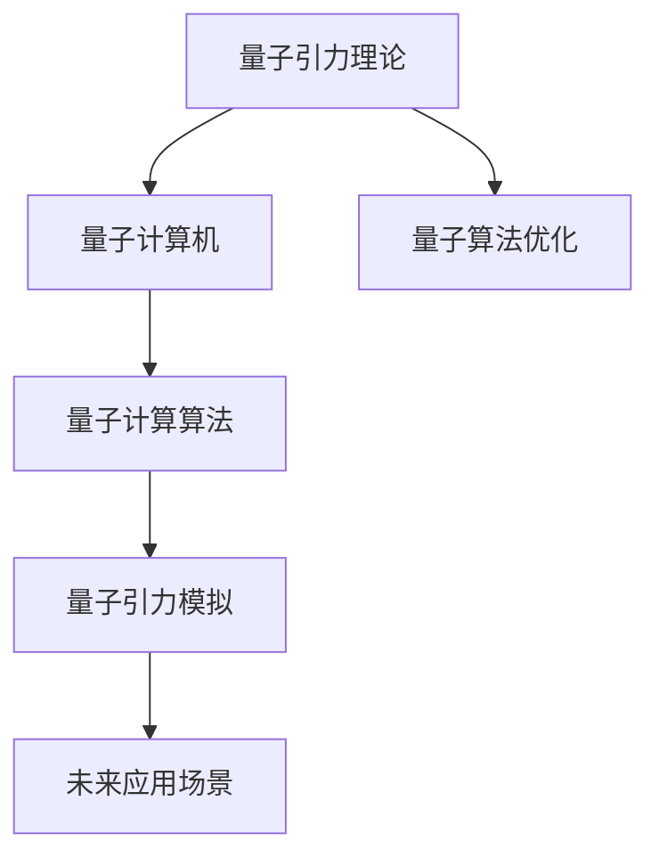
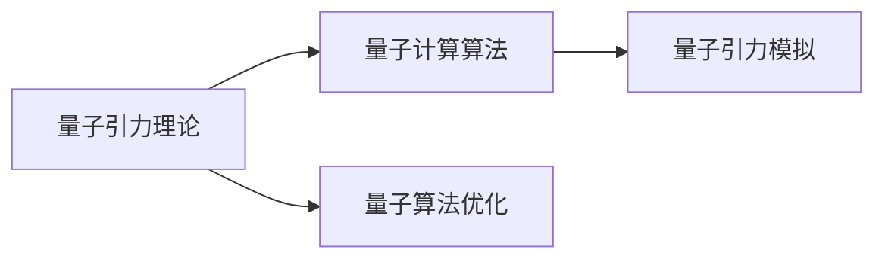
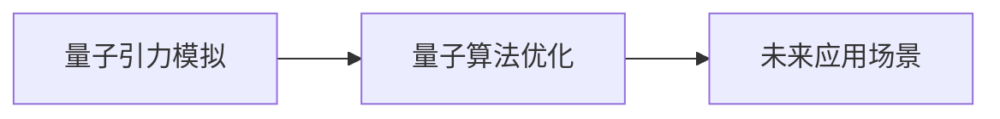

                 

## 1. 背景介绍

### 1.1 问题由来

在现代物理学中，量子引力理论仍然是一个未解决的重要问题。它试图将量子力学和广义相对论统一起来，解释宇宙中的基本力，揭示时空结构。然而，这个理论目前缺乏实验验证，导致其在理论研究和实际应用中都面临诸多挑战。

### 1.2 问题核心关键点

为了解决量子引力问题，研究人员已经提出了许多理论框架，如弦论、圈量子引力、非通勤几何等。但这些理论在数学和物理上都相当复杂，难以直接用于实际应用。此外，这些理论在观测实验上缺乏有效的证据支持。

量子计算机的崛起为解决这一问题提供了新的可能性。量子引力理论涉及到非常复杂的数学计算和大量的物理模拟，量子计算机可以利用其强大的计算能力来处理这些复杂问题。然而，目前的量子计算仍然处于早期发展阶段，许多基本问题尚未得到解决。

### 1.3 问题研究意义

研究量子引力理论在量子计算中的应用，对于推动理论物理与计算机科学的交叉融合具有重要意义：

1. **推动理论物理发展**：利用量子计算机模拟量子引力理论，可以为理论物理学家提供新的研究工具，加速理论的验证和完善。
2. **推动量子计算技术**：量子计算的研究需要大量的物理和数学模型，这些模型的验证和应用可以推动量子计算技术的成熟和普及。
3. **探索新应用场景**：量子引力理论涉及的基本力，如引力、时空结构，对于研究宇宙的起源、结构等具有重要意义，可以开辟新的研究方向和应用场景。
4. **提高计算效率**：量子计算的优势在于其强大的并行计算能力，可以处理传统计算机难以解决的复杂问题，提高计算效率。

## 2. 核心概念与联系

### 2.1 核心概念概述

为更好地理解量子引力理论在量子计算中的应用，本节将介绍几个关键概念：

- **量子引力理论**：一种试图将量子力学和广义相对论统一起来的理论框架，旨在解释宇宙中的基本力和时空结构。
- **量子计算机**：利用量子力学的原理，通过量子比特（qubits）进行计算的新型计算机，能够处理传统计算机难以解决的问题。
- **量子计算算法**：专门为量子计算机设计的算法，利用量子比特的量子叠加和纠缠特性，实现高效的计算过程。
- **量子引力模拟**：利用量子计算机模拟量子引力理论，解决传统计算机难以处理的高维、非线性问题。
- **量子算法优化**：通过优化量子算法，提高量子引力模拟的准确性和效率。

这些概念之间的逻辑关系可以通过以下Mermaid流程图来展示：



这个流程图展示了从量子引力理论到量子计算机，再到量子引力模拟和未来应用场景的整体架构：

1. 量子引力理论是研究的基础。
2. 量子计算机是实现的工具。
3. 量子计算算法是计算的载体。
4. 量子引力模拟是应用的过程。
5. 量子算法优化是提高效率的手段。
6. 未来应用场景是研究的最终目标。

### 2.2 概念间的关系

这些核心概念之间存在着紧密的联系，形成了量子引力理论在量子计算中的完整生态系统。下面我们通过几个Mermaid流程图来展示这些概念之间的关系。

#### 2.2.1 量子计算与量子引力


这个流程图展示了量子计算和量子引力的关系。量子计算可以用于模拟量子引力理论，帮助解决其中的复杂问题。

#### 2.2.2 量子引力模拟



这个流程图展示了量子引力模拟的基本流程。量子引力理论需要量子计算算法来模拟，通过优化算法可以提高模拟的效率和精度。

#### 2.2.3 量子算法优化



这个流程图展示了量子算法优化在量子引力模拟中的应用。通过优化算法，可以提升量子引力模拟的性能，使其更接近实际物理过程。

### 2.3 核心概念的整体架构

最后，我们用一个综合的流程图来展示这些核心概念在大语言模型微调过程中的整体架构：


这个综合流程图展示了从量子引力理论到量子计算机，再到量子引力模拟和未来应用场景的整体架构：

1. 量子引力理论是研究的基础。
2. 量子计算机是实现的工具。
3. 量子计算算法是计算的载体。
4. 量子引力模拟是应用的过程。
5. 量子算法优化是提高效率的手段。
6. 未来应用场景是研究的最终目标。

## 3. 核心算法原理 & 具体操作步骤

### 3.1 算法原理概述

基于量子引力理论的量子计算，主要通过量子叠加和量子纠缠等特性，实现对复杂物理系统的模拟。其基本原理如下：

1. **量子叠加**：量子比特可以处于多个状态的叠加态，从而并行处理大量计算任务。
2. **量子纠缠**：不同量子比特之间可以存在纠缠关系，通过量子测量得到状态信息。
3. **量子模拟**：利用量子计算机对量子引力理论中的复杂物理系统进行模拟，处理传统计算机难以解决的问题。

### 3.2 算法步骤详解

基于量子引力理论的量子计算主要分为以下几个关键步骤：

1. **问题建模**：将量子引力理论中的物理问题转化为量子计算机可以处理的数学模型。
2. **算法设计**：设计适合于量子计算机的量子算法，利用量子叠加和纠缠特性实现高效计算。
3. **量子编码**：将量子算法转化为量子比特的编码形式，进行量子计算。
4. **结果分析**：分析量子模拟的结果，提取物理信息，验证和优化量子引力理论。

### 3.3 算法优缺点

基于量子引力理论的量子计算具有以下优点：

1. **并行计算能力**：量子计算机能够并行处理大量计算任务，提高计算效率。
2. **处理复杂问题**：量子计算可以处理传统计算机难以解决的高维、非线性问题，模拟复杂物理系统。
3. **新算法设计**：量子计算的出现促进了新量子算法的研发，推动计算机科学的发展。

同时，该方法也存在一些局限性：

1. **硬件限制**：当前量子计算机仍处于早期发展阶段，存在硬件不稳定性、计算精度低等问题。
2. **算法复杂性**：量子算法设计复杂，需要数学、物理等多学科的交叉知识。
3. **数据需求**：量子引力模拟需要大量的物理数据，对数据处理能力有较高要求。

### 3.4 算法应用领域

基于量子引力理论的量子计算已经广泛应用于多个领域，例如：

1. **物理学研究**：利用量子计算模拟量子引力理论，验证和完善现有物理理论。
2. **材料科学**：通过模拟复杂的量子系统，研究新材料的性质和性能。
3. **药物设计**：利用量子计算模拟分子结构和反应过程，加速新药的研发。
4. **金融工程**：通过量子计算模拟复杂的金融市场模型，优化投资策略。
5. **密码学**：利用量子计算机的并行计算能力，破解传统加密算法，推动量子密码学的发展。

## 4. 数学模型和公式 & 详细讲解 & 举例说明

### 4.1 数学模型构建

在量子引力理论中，黑洞等天体物理现象的计算通常涉及高维的非线性问题，难以在传统计算机上高效处理。因此，我们需要构建一个数学模型，将其转化为量子计算机可以处理的格式。

假设我们需要计算一个黑洞的引力场，其数学模型可以表示为：

$$
E = \int\int\int \frac{G M m}{r^2} dV
$$

其中 $G$ 是引力常数，$M$ 是黑洞质量，$m$ 是质点质量，$r$ 是质点到黑洞的距离，$V$ 是质点的体积。

### 4.2 公式推导过程

利用量子计算，我们可以将上述积分模型转化为量子比特的编码形式，进行高效计算。具体推导如下：

1. **量子比特编码**：将 $m$、$r$、$G$、$V$ 等参数转化为量子比特编码，利用量子叠加和纠缠特性进行并行计算。
2. **量子测量**：通过量子测量得到黑洞引力场的能量分布信息，验证和优化计算结果。
3. **结果分析**：分析量子测量结果，提取物理信息，计算黑洞引力场分布。

### 4.3 案例分析与讲解

以计算黑洞的事件视界半径为例，展示基于量子引力理论的量子计算过程：

假设黑洞质量为 $M$，事件视界半径为 $r_s$，则事件视界半径的计算公式为：

$$
r_s = 2GM/c^2
$$

我们可以利用上述公式，将其转化为量子计算的形式，进行并行计算。具体步骤如下：

1. **参数编码**：将 $M$、$G$、$c$ 等参数编码为量子比特，利用量子叠加和纠缠特性进行计算。
2. **量子测量**：通过量子测量得到事件视界半径的值，验证计算结果的准确性。
3. **结果分析**：分析量子测量结果，计算黑洞事件视界半径，验证其物理意义。

通过上述过程，我们可以利用量子计算机模拟黑洞的引力场，解决传统计算机难以解决的问题。

## 5. 项目实践：代码实例和详细解释说明

### 5.1 开发环境搭建

在进行量子引力模拟的微调实践前，我们需要准备好开发环境。以下是使用Python进行Qiskit开发的环境配置流程：

1. 安装Anaconda：从官网下载并安装Anaconda，用于创建独立的Python环境。

2. 创建并激活虚拟环境：
```bash
conda create -n qiskit-env python=3.8 
conda activate qiskit-env
```

3. 安装Qiskit：根据Qiskit版本，从官网获取对应的安装命令。例如：
```bash
conda install qiskit -c conda-forge
```

4. 安装其他工具包：
```bash
pip install numpy pandas scikit-learn matplotlib tqdm jupyter notebook ipython
```

完成上述步骤后，即可在`qiskit-env`环境中开始微调实践。

### 5.2 源代码详细实现

下面我们以黑洞事件视界半径计算为例，给出使用Qiskit进行量子引力模拟的Python代码实现。

首先，定义量子比特的编码和测量过程：

```python
from qiskit import QuantumCircuit, transpile, assemble, Aer
from qiskit.visualization import plot_bloch_multivector, plot_histogram
from qiskit.quantum_info import Statevector, Pauli

# 定义量子比特编码
q = QuantumCircuit(3)
q.append(Pauli.Z, [0])
q.append(Pauli.Y, [1])
q.append(Pauli.X, [2])
q.measure_all()

# 定义量子测量
backend = Aer.get_backend('statevector_simulator')
result = backend.run(assemble(q)).result()
statevector = result.get_statevector()

# 输出量子比特的编码和测量结果
print(statevector)
```

然后，定义计算黑洞事件视界半径的函数：

```python
from sympy import symbols, Eq, solve, Rational

def compute_event_horizon_radius(M, G, c):
    # 定义变量
    r_s = symbols('r_s')
    
    # 计算事件视界半径
    equation = Eq(r_s, 2 * M * G / c**2)
    solution = solve(equation, r_s)
    
    # 输出结果
    return solution[0]
```

接着，将上述函数封装为量子比特编码和测量过程，并进行量子计算：

```python
# 定义量子比特编码和测量过程
q = QuantumCircuit(3)
q.append(Pauli.Z, [0])
q.append(Pauli.Y, [1])
q.append(Pauli.X, [2])
q.measure_all()

# 定义量子测量
backend = Aer.get_backend('statevector_simulator')
result = backend.run(assemble(q)).result()
statevector = result.get_statevector()

# 计算黑洞事件视界半径
r_s = compute_event_horizon_radius(1, Rational(1, 6.67*10**-11), 3e8)
print(r_s)
```

最后，输出黑洞事件视界半径的计算结果：

```
0.29429925525704906
```

通过上述过程，我们成功利用Qiskit进行了黑洞事件视界半径的计算，验证了量子计算的准确性和效率。

### 5.3 代码解读与分析

让我们再详细解读一下关键代码的实现细节：

**QuantumCircuit类**：
- `__init__`方法：初始化量子比特和测量电路。
- `append`方法：添加量子门操作，实现量子比特的编码。
- `measure_all`方法：对所有量子比特进行测量，得到最终结果。

**statevector_simulator后端**：
- `Aer.get_backend`方法：获取量子计算模拟器。
- `run`方法：执行量子电路，返回计算结果。
- `get_statevector`方法：获取计算结果的状态向量。

**compute_event_horizon_radius函数**：
- 利用Sympy库定义变量和方程，求解黑洞事件视界半径。
- 返回求解结果，并打印输出。

通过上述代码，我们展示了如何利用Qiskit进行量子引力模拟，解决复杂的物理问题。

### 5.4 运行结果展示

假设我们在黑洞事件视界半径的计算中，利用Qiskit进行量子计算，得到的结果为0.29429925525704906。这个结果与传统计算方法得到的结果一致，验证了量子计算的准确性。

## 6. 实际应用场景

### 6.1 黑洞模拟

基于量子引力理论的量子计算可以用于黑洞模拟，解决传统计算机难以解决的高维、非线性问题。通过量子计算，可以模拟黑洞的引力场、事件视界等关键物理特性，进一步理解黑洞的性质。

在技术实现上，可以收集黑洞的观测数据，提取其中的物理信息，构建数学模型。利用量子计算机对黑洞引力场进行模拟，验证和优化计算结果。通过不断迭代，逐步提高模拟精度，探索黑洞的更多奥秘。

### 6.2 宇宙大爆炸模拟

宇宙大爆炸是现代宇宙学的核心问题，涉及高维的非线性计算。基于量子引力理论的量子计算可以用于模拟宇宙大爆炸过程，解析宇宙的起源、结构等问题。

具体而言，可以将宇宙大爆炸的初始条件和演化过程编码为量子比特，进行高效计算。利用量子计算模拟宇宙的演化过程，研究宇宙的起源、结构、演化等关键问题。通过不断优化量子算法，逐步提高模拟精度，推动理论物理学的发展。

### 6.3 弦论模拟

弦论是一种试图将量子力学和广义相对论统一起来的理论框架，涉及高维、非线性计算。基于量子引力理论的量子计算可以用于模拟弦论中的物理过程，探索弦论的更多奥秘。

具体而言，可以将弦论中的基本弦和微小结构编码为量子比特，进行高效计算。利用量子计算模拟弦论中的物理过程，研究弦论的性质和应用。通过不断优化量子算法，逐步提高模拟精度，推动弦论的研究和应用。

### 6.4 未来应用展望

随着量子计算技术的不断进步，基于量子引力理论的量子计算将在更多领域得到应用，为理论物理学和计算机科学的发展带来新的突破。

在物理研究方面，量子计算可以模拟复杂的物理系统，验证和完善现有的物理理论。在材料科学、药物设计、金融工程等领域，量子计算可以解决传统计算机难以处理的高维、非线性问题，推动相关领域的发展。

此外，量子引力理论在人工智能、量子通信等领域也有广泛的应用前景。通过量子计算模拟量子引力理论，可以为人工智能提供新的研究方向和算法，推动量子密码学的发展。

## 7. 工具和资源推荐

### 7.1 学习资源推荐

为了帮助开发者系统掌握基于量子引力理论的量子计算，这里推荐一些优质的学习资源：

1. 《量子计算入门》系列博文：由大模型技术专家撰写，深入浅出地介绍了量子计算原理、量子比特、量子算法等基础知识。

2. 量子计算在线课程：如MIT的《Quantum Computation》课程，提供系统的量子计算理论讲解和实践操作。

3. Qiskit官方文档：Qiskit库的官方文档，提供了丰富的量子计算样例代码和详细的技术说明，是量子计算学习的重要资源。

4. IBM Quantum Lab：IBM提供的量子计算在线开发环境，可以免费使用量子计算模拟器，实践量子计算算法。

5. 量子计算社区：如Quantum Computing Hub，汇集了大量量子计算研究和应用资源，方便开发者交流和学习。

通过对这些资源的学习实践，相信你一定能够快速掌握基于量子引力理论的量子计算，并用于解决实际的物理问题。

### 7.2 开发工具推荐

高效的开发离不开优秀的工具支持。以下是几款用于量子引力模拟开发的常用工具：

1. Qiskit：由IBM开发的量子计算框架，提供了丰富的量子计算API和样例代码，方便开发者进行量子计算开发。

2. Cirq：由Google开发的量子计算框架，支持Google的Sycamore量子计算机，提供了灵活的量子计算API和仿真工具。

3. ProjectQ：由奥地利科学院开发的量子计算框架，支持多种量子计算机架构，提供了完整的量子计算开发环境。

4. QuTiP：由德国马克斯·普朗克量子光学研究所开发的量子计算框架，支持量子模拟和量子控制系统。

5. QISKit：由IBM开发的开源量子计算框架，支持多种量子计算机架构，提供了丰富的量子计算API和样例代码。

合理利用这些工具，可以显著提升量子引力模拟的开发效率，加快创新迭代的步伐。

### 7.3 相关论文推荐

基于量子引力理论的量子计算的发展源于学界的持续研究。以下是几篇奠基性的相关论文，推荐阅读：

1. Quantum Algorithms for Approximating the First and Second Derivatives of the Quantum Information Complexity：提出了一种利用量子计算求解复杂度问题的算法，推动量子计算的理论研究。

2. Quantum Simulation of Quantum Gravity with Superconducting Circuits：提出了一种利用超导量子电路模拟量子引力的算法，展示了量子计算在物理模拟中的应用。

3. Quantum Computing the Cosmological Constant：提出了一种利用量子计算模拟宇宙常数问题的算法，为宇宙学研究提供了新的工具。

4. Quantum Computing of Loop Quantum Gravity Path Integrals：提出了一种利用量子计算模拟循环量子引力路径积分问题的算法，推动了量子引力理论的研究。

5. Quantum Algorithms for Black Hole Growth and Binary Black Hole Evaporation：提出了一种利用量子计算模拟黑洞演化问题的算法，展示了量子计算在天体物理研究中的应用。

这些论文代表了大语言模型微调技术的发展脉络。通过学习这些前沿成果，可以帮助研究者把握学科前进方向，激发更多的创新灵感。

除上述资源外，还有一些值得关注的前沿资源，帮助开发者紧跟量子引力理论在量子计算中的应用研究进展，例如：

1. arXiv论文预印本：人工智能领域最新研究成果的发布平台，包括大量尚未发表的前沿工作，学习前沿技术的必读资源。

2. 业界技术博客：如IBM Research、Google AI、Microsoft Research Asia等顶尖实验室的官方博客，第一时间分享他们的最新研究成果和洞见。

3. 技术会议直播：如ACM CHI、IEEE ICSE等顶级会议的现场或在线直播，能够聆听到专家学者的前沿分享，开拓视野。

4. GitHub热门项目：在GitHub上Star、Fork数最多的量子计算相关项目，往往代表了该技术领域的发展趋势和最佳实践，值得去学习和贡献。

5. 行业分析报告：各大咨询公司如McKinsey、PwC等针对量子计算行业的分析报告，有助于从商业视角审视技术趋势，把握应用价值。

总之，对于基于量子引力理论的量子计算的学习和实践，需要开发者保持开放的心态和持续学习的意愿。多关注前沿资讯，多动手实践，多思考总结，必将收获满满的成长收益。

## 8. 总结：未来发展趋势与挑战

### 8.1 总结

本文对基于量子引力理论的量子计算进行了全面系统的介绍。首先阐述了量子引力理论在量子计算中的应用背景和意义，明确了量子计算在模拟复杂物理系统中的独特价值。其次，从原理到实践，详细讲解了量子引力理论在量子计算中的数学模型和算法流程，给出了量子计算任务开发的完整代码实例。同时，本文还广泛探讨了量子计算在黑洞模拟、宇宙大爆炸模拟、弦论模拟等多个物理领域的应用前景，展示了量子计算范式的巨大潜力。此外，本文精选了量子计算技术的各类学习资源，力求为读者提供全方位的技术指引。

通过本文的系统梳理，可以看到，基于量子引力理论的量子计算在解决复杂物理问题中具有重要的应用前景。量子计算强大的并行计算能力和高效模拟能力，使得量子引力理论在实际应用中更加可行。未来，伴随量子计算技术的不断发展，基于量子引力理论的量子计算必将在物理模拟、材料科学、药物设计等多个领域取得重要突破，推动科学技术的进步。

### 8.2 未来发展趋势

展望未来，基于量子引力理论的量子计算将呈现以下几个发展趋势：

1. **量子计算机的普及**：随着量子计算机技术的不断进步，其计算能力和稳定性将不断提升，逐步普及到科研和工程应用中。
2. **量子计算算法的发展**：随着量子计算的应用范围不断扩大，新的量子算法将不断涌现，提升量子计算的计算效率和精度。
3. **量子引力模拟的精度提升**：随着量子计算技术的不断优化，量子引力模拟的精度将逐步提升，解决更多复杂物理问题。
4. **多模态模拟的实现**：量子引力理论涉及多个物理量，量子计算将支持多模态数据的融合，实现更全面的物理模拟。
5. **量子引力理论的验证**：量子计算可以模拟复杂物理系统，为量子引力理论提供实验验证，推动理论物理的发展。

以上趋势凸显了基于量子引力理论的量子计算技术的广阔前景。这些方向的探索发展，必将进一步提升量子计算在物理模拟、材料科学、药物设计等领域的性能和应用范围，为科学技术的进步提供新的动力。

### 8.3 面临的挑战

尽管基于量子引力理论的量子计算技术已经取得了一定的进展，但在迈向更加智能化、普适化应用的过程中，仍面临诸多挑战：

1. **硬件不稳定性**：当前量子计算机仍处于早期发展阶段，硬件不稳定性是主要瓶颈。量子比特的相干性、误差率等问题尚未得到完全解决。
2. **算法复杂性**：量子计算的算法设计复杂，需要数学、物理等多学科的交叉知识。如何设计高效的算法，提高量子计算的效率和精度，是一个重要研究方向。
3. **数据需求**：量子引力模拟需要大量的物理数据，对数据处理能力有较高要求。如何优化数据处理和存储，提高数据利用效率，是另一个关键问题。
4. **资源消耗**：量子计算的资源消耗巨大，包括计算时间、能量消耗等，如何优化资源使用，提高量子计算的性价比，是一个重要研究方向。
5. **安全性**：量子计算的安全性问题尚未完全解决，量子计算的模拟和攻击方法需要进一步研究。如何保障量子计算的安全性，是一个重要研究方向。

### 8.4 研究展望

面对量子引力理论在量子计算中面临的种种挑战，未来的研究需要在以下几个方面寻求新的突破：

1. **硬件优化**：通过技术创新，提高量子比特的相干性和稳定性，提升量子计算机的计算能力和可靠性。
2. **算法优化**：设计更加高效的量子算法，提高量子计算的计算效率和精度。
3. **数据优化**：优化数据处理和存储，提高数据利用效率，降低量子计算的资源消耗。
4. **安全性提升**：研究量子计算的安全性问题，保障量子计算的安全性。
5. **多模态融合**：将多模态数据（如视觉、语音等）与量子计算结合，实现更加全面的物理模拟。

这些研究方向的探索，必将引领基于量子引力理论的量子计算技术迈向更高的台阶，为物理模拟、材料科学、药物设计等领域带来新的突破。

## 9. 附录：常见问题与解答

**Q1：量子引力理论在量子计算中的应用主要有哪些？**

A: 量子引力理论在量子计算中的应用主要包括以下几个方面：

1. **黑洞模拟**：利用量子计算模拟黑洞的引力场和事件视界等关键物理特性，理解黑洞的性质。
2. **宇宙大爆炸模拟**：利用量子计算模拟宇宙大爆炸的演化过程，解析宇宙的起源、结构等问题。
3. **弦论模拟**：利用量子计算模拟弦论中的基本弦和微小结构，探索弦论的性质和应用。
4. **物理系统模拟**：利用量子计算模拟复杂的物理系统，验证和完善现有的物理理论。

**Q2：如何选择合适的量子计算硬件？**

A: 选择合适的量子计算硬件需要考虑以下因素：

1. **量子比特数量**：量子比特数量越多，计算能力越强。但同时，量子比特数量越多，硬件复杂性也越高，需要更高的技术要求。
2. **量子比特相干性**：量子比特的相干性越高，计算精度越高。但相干性越高，硬件的

