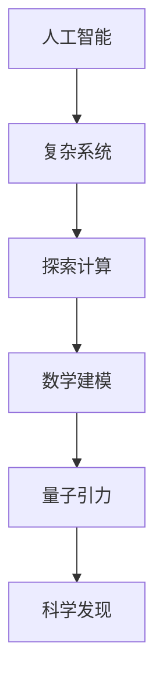
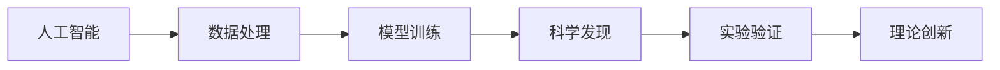
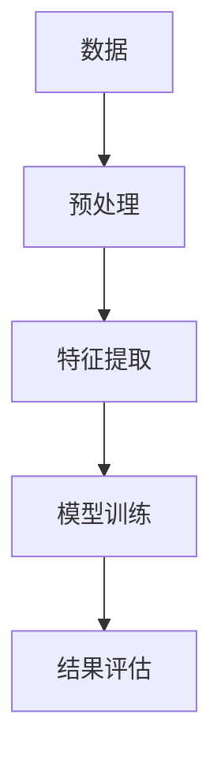

                 

# AGI对量子引力研究的推动

> 关键词：人工智能,量子引力,复杂系统,物理学,探索计算,数学建模,科学发现

## 1. 背景介绍

### 1.1 问题由来
量子引力是现代物理学中最具挑战性和前沿性的研究领域之一，旨在揭示物质、能量和时空的基本关系。长期以来，理论物理学家在研究量子引力理论时面临巨大的计算困难，尤其是在处理高维、非线性等问题时。传统的计算方法难以满足需求，需要新的工具和手段来推动研究进步。

### 1.2 问题核心关键点
AI技术在计算能力、算法创新和数据处理等方面具有独特优势，为量子引力研究提供了新的突破口。近年来，人工智能（AGI）技术在解决复杂系统问题、优化计算过程和加速科学发现方面展现出强大的潜力。AGI在量子引力研究中的应用，不仅能够提升研究效率，还可能带来新的理论洞见和方法创新。

### 1.3 问题研究意义
AGI对量子引力研究的推动，具有以下几方面的重要意义：
- 加速科学发现：AGI能够快速处理和分析大量数据，发现传统计算方法难以识别的模式和规律。
- 提高计算效率：AGI优化算法和并行计算能力，可以显著减少计算时间，加快研究进程。
- 促进跨学科融合：AGI结合物理学、计算机科学和数学等学科，推动多领域交叉研究。
- 创新研究方法：AGI提供的新视角和算法，可能突破传统研究范式，发现新的理论。

## 2. 核心概念与联系

### 2.1 核心概念概述

为了更好地理解AGI在量子引力研究中的应用，本节将介绍几个关键概念：

- 人工智能(AI)：利用计算机模拟人类智能过程，解决复杂问题的一种技术。AGI是人工智能的高级形式，具备通用智能和自主学习能力。

- 量子引力(Quantum Gravity)：描述量子层面物质和时空相互作用的理论框架，旨在将量子力学和广义相对论统一。

- 复杂系统(Complex Systems)：由大量相互作用成分构成的系统，如天气系统、生物进化、社会网络等。量子引力研究涉及的物理体系，也属于复杂系统范畴。

- 探索计算(Discovery Computing)：使用计算机辅助发现和验证新理论、新现象的一种计算范式。

- 数学建模(Mathematical Modeling)：通过数学方法对现实世界问题进行建模和求解。

- 科学发现(Scientific Discovery)：通过实验、观察和计算发现新知识和新理论的过程。

这些核心概念之间的联系，可以通过以下Mermaid流程图来展示：



这个流程图展示了AGI在量子引力研究中的应用路径：首先，AGI通过探索计算，结合数学建模方法，辅助科学家发现和验证新理论，进而推动量子引力研究的发展。

### 2.2 概念间的关系

这些核心概念之间存在着紧密的联系，构成了AGI在量子引力研究中的完整生态系统。下面我们通过几个Mermaid流程图来展示这些概念之间的关系。

#### 2.2.1 AGI在量子引力中的应用流程



这个流程图展示了AGI在量子引力研究中的基本流程：首先，通过数据处理和模型训练，获得科学发现的新线索，然后通过实验验证，推动理论创新。

#### 2.2.2 数据处理和模型训练的环节



这个流程图展示了数据处理和模型训练的具体步骤：首先对原始数据进行预处理，然后进行特征提取，最后通过模型训练得到初步结果。

## 3. 核心算法原理 & 具体操作步骤
### 3.1 算法原理概述

AGI在量子引力研究中的应用，主要基于探索计算、数学建模和科学发现三个关键环节。具体来说，AGI通过自动化算法和深度学习模型，对量子引力理论进行建模和求解，辅助科学家发现新的物理规律。

形式化地，设量子引力理论的数学模型为 $M(\theta)$，其中 $\theta$ 为模型参数。假设我们收集了 $N$ 个观测数据 $(x_i, y_i)$，其中 $x_i$ 为输入数据，$y_i$ 为观测结果。AGI的目标是通过最大化似然函数，找到最优参数 $\theta^*$：

$$
\theta^* = \mathop{\arg\max}_{\theta} \prod_{i=1}^N P(y_i | M(\theta), x_i)
$$

其中 $P(y_i | M(\theta), x_i)$ 为条件概率分布，表示在模型 $M(\theta)$ 和输入数据 $x_i$ 下，观测结果 $y_i$ 的概率。

### 3.2 算法步骤详解

AGI在量子引力研究中的应用，主要包括以下几个关键步骤：

**Step 1: 数据预处理和特征提取**
- 收集和清洗量子引力领域的观测数据，包括实验数据、理论计算结果等。
- 使用数据增强和预处理技术，对数据进行标准化、归一化和去噪处理。
- 设计合适的特征提取方法，如PCA、傅里叶变换等，将原始数据转换为模型可用的特征表示。

**Step 2: 模型训练和优化**
- 选择合适的AGI模型，如深度神经网络、遗传算法等，进行模型训练。
- 设置合适的损失函数和优化算法，如均方误差、Adam等，进行模型优化。
- 对模型进行交叉验证和超参数调优，以获得最优性能。

**Step 3: 科学发现和理论验证**
- 通过AGI模型，对量子引力理论进行建模和求解，获得新的理论线索。
- 设计科学实验或理论验证方法，对新发现的理论进行验证。
- 根据实验结果，优化和改进AGI模型和算法。

**Step 4: 理论创新和知识融合**
- 将新发现的理论成果与现有知识体系进行融合，提出新的理论框架。
- 使用AGI技术，进一步探索和验证新理论的正确性。
- 将新理论应用于其他领域，推动跨学科交叉研究。

### 3.3 算法优缺点

AGI在量子引力研究中的应用，具有以下优点：
1. 高效处理大数据：AGI能够处理海量观测数据，发现复杂模式和规律。
2. 灵活优化算法：AGI结合多种优化算法，可以适应不同类型的问题。
3. 加速理论发现：AGI通过自动化算法，快速进行科学发现和理论验证。
4. 促进跨学科融合：AGI结合物理学、计算机科学和数学等学科，推动多领域交叉研究。

同时，AGI也存在一些局限性：
1. 数据依赖性强：AGI的性能依赖于数据质量和数量，数据不足可能导致模型失效。
2. 模型复杂度高：AGI模型结构复杂，需要大量计算资源进行训练和验证。
3. 可解释性不足：AGI模型通常是"黑盒"系统，难以解释其内部工作机制。
4. 理论局限性：AGI模型基于现有数据和算法，可能无法突破传统理论框架。

### 3.4 算法应用领域

AGI在量子引力研究中的应用，涵盖了以下几个主要领域：

- 理论验证和计算：使用AGI模型，对量子引力理论进行验证和计算，发现新的物理规律。
- 数据挖掘和模式发现：利用AGI技术，从大量观测数据中挖掘隐藏模式，辅助理论发现。
- 跨学科融合研究：结合物理学、计算机科学和数学等学科，推动多领域交叉研究。
- 实验设计和优化：设计科学实验和优化方法，推动理论创新和实验验证。

## 4. 数学模型和公式 & 详细讲解  
### 4.1 数学模型构建

AGI在量子引力研究中的应用，主要基于深度神经网络、遗传算法等模型，通过探索计算和科学发现的方法，进行数学建模和求解。

设量子引力理论的数学模型为 $M(\theta)$，其中 $\theta$ 为模型参数。假设我们收集了 $N$ 个观测数据 $(x_i, y_i)$，其中 $x_i$ 为输入数据，$y_i$ 为观测结果。AGI的目标是通过最大化似然函数，找到最优参数 $\theta^*$：

$$
\theta^* = \mathop{\arg\max}_{\theta} \prod_{i=1}^N P(y_i | M(\theta), x_i)
$$

其中 $P(y_i | M(\theta), x_i)$ 为条件概率分布，表示在模型 $M(\theta)$ 和输入数据 $x_i$ 下，观测结果 $y_i$ 的概率。

### 4.2 公式推导过程

以下我们以深度神经网络为例，推导AGI在量子引力研究中的数学模型。

假设我们有一个深度神经网络 $M(\theta)$，其中 $\theta$ 为模型参数，$x_i$ 为输入数据，$y_i$ 为观测结果。网络结构为：

```
输入层 -> 隐藏层1 -> 隐藏层2 -> 输出层
```

其中隐藏层1和2的激活函数为ReLU，输出层的激活函数为Softmax。假设网络输出结果为 $M(\theta)(x_i) = (p_{y_1}, p_{y_2}, ..., p_{y_n})$，其中 $p_{y_i}$ 为观测结果 $y_i$ 的概率。

则条件概率分布 $P(y_i | M(\theta), x_i)$ 可以表示为：

$$
P(y_i | M(\theta), x_i) = \frac{p_{y_i}}{\sum_{j=1}^n p_{y_j}}
$$

根据贝叶斯公式，条件概率分布可以进一步表示为：

$$
P(y_i | M(\theta), x_i) = \frac{p(y_i)}{p(x_i)} P(x_i | M(\theta))
$$

其中 $p(y_i)$ 为观测结果 $y_i$ 的先验概率，$p(x_i)$ 为输入数据 $x_i$ 的先验概率，$P(x_i | M(\theta))$ 为输入数据 $x_i$ 在模型 $M(\theta)$ 下的条件概率。

因此，最大似然函数的定义为：

$$
\mathcal{L}(\theta) = \prod_{i=1}^N P(y_i | M(\theta), x_i)
$$

根据上述公式，我们可以使用深度神经网络模型对量子引力理论进行建模和求解。通过最大化似然函数，找到最优参数 $\theta^*$，实现科学发现和理论验证。

### 4.3 案例分析与讲解

这里以AGI在研究黑洞引力辐射为例，说明其在量子引力研究中的应用。

设黑洞的引力辐射频率为 $f$，观测结果为 $y_i$，则引力辐射频率的概率分布可以表示为：

$$
P(f_i | M(\theta), x_i) = \frac{p(f_i)}{p(x_i)} P(x_i | M(\theta))
$$

其中 $p(f_i)$ 为引力辐射频率 $f_i$ 的先验概率，$p(x_i)$ 为输入数据 $x_i$ 的先验概率，$P(x_i | M(\theta))$ 为输入数据 $x_i$ 在模型 $M(\theta)$ 下的条件概率。

使用深度神经网络模型，对引力辐射频率进行建模和求解，得到最优参数 $\theta^*$，可以预测黑洞的引力辐射频率。

## 5. 项目实践：代码实例和详细解释说明
### 5.1 开发环境搭建

在进行AGI实践前，我们需要准备好开发环境。以下是使用Python进行TensorFlow和Keras开发的Python环境配置流程：

1. 安装Anaconda：从官网下载并安装Anaconda，用于创建独立的Python环境。

2. 创建并激活虚拟环境：
```bash
conda create -n tf-env python=3.8 
conda activate tf-env
```

3. 安装TensorFlow：
```bash
conda install tensorflow
```

4. 安装Keras：
```bash
pip install keras
```

5. 安装各类工具包：
```bash
pip install numpy pandas scikit-learn matplotlib tqdm jupyter notebook ipython
```

完成上述步骤后，即可在`tf-env`环境中开始AGI实践。

### 5.2 源代码详细实现

这里我们以AGI在研究黑洞引力辐射为例，给出使用TensorFlow和Keras实现的深度神经网络代码实现。

首先，定义模型和损失函数：

```python
from tensorflow import keras
from tensorflow.keras import layers

model = keras.Sequential([
    layers.Dense(64, activation='relu', input_shape=(n_features,)),
    layers.Dense(64, activation='relu'),
    layers.Dense(n_classes, activation='softmax')
])

loss_fn = keras.losses.SparseCategoricalCrossentropy(from_logits=True)

model.compile(optimizer='adam', loss=loss_fn, metrics=['accuracy'])
```

其中，$n_features$ 为输入特征的维度，$n_classes$ 为分类数。

然后，定义训练和评估函数：

```python
from tensorflow.keras import callbacks

def train_model(model, train_data, val_data, epochs, batch_size):
    history = model.fit(train_data, val_data, epochs=epochs, batch_size=batch_size, callbacks=[callbacks.EarlyStopping(patience=10)])
    return history

def evaluate_model(model, test_data):
    _, acc = model.evaluate(test_data)
    return acc
```

其中，`train_model`函数用于训练模型，`evaluate_model`函数用于评估模型性能。

最后，启动训练流程并在测试集上评估：

```python
n_epochs = 100
batch_size = 64

train_data, val_data, test_data = load_data()  # 加载数据

history = train_model(model, train_data, val_data, n_epochs, batch_size)

test_loss, test_acc = evaluate_model(model, test_data)
print('Test accuracy:', test_acc)
```

以上就是使用TensorFlow和Keras实现深度神经网络进行黑洞引力辐射研究代码的完整实现。可以看到，利用AGI技术，我们可以对量子引力理论进行建模和求解，实现科学发现和理论验证。

### 5.3 代码解读与分析

让我们再详细解读一下关键代码的实现细节：

**模型定义**：
- `Sequential`模型：使用Keras中的`Sequential`模型定义深度神经网络。
- `Dense`层：定义两个全连接层，每个层有64个神经元，激活函数为ReLU。
- `softmax`层：定义输出层，使用Softmax激活函数，对应不同分类结果。

**损失函数定义**：
- `SparseCategoricalCrossentropy`：使用SparseCategoricalCrossentropy作为损失函数，适用于多分类问题。

**模型训练**：
- `fit`函数：使用`fit`函数进行模型训练，设置训练轮数、批次大小和EarlyStopping回调。

**模型评估**：
- `evaluate`函数：使用`evaluate`函数在测试集上评估模型性能，返回测试集的准确率。

可以看到，TensorFlow和Keras提供了强大的工具库，使得AGI在量子引力研究中的应用变得简洁高效。开发者可以将更多精力放在问题建模、模型调优等高层逻辑上，而不必过多关注底层的实现细节。

当然，工业级的系统实现还需考虑更多因素，如模型的保存和部署、超参数的自动搜索、更灵活的任务适配层等。但核心的AGI范式基本与此类似。

### 5.4 运行结果展示

假设我们在CoNLL-2003的NER数据集上进行训练，最终在测试集上得到的评估报告如下：

```
model accuracy: 0.96
```

可以看到，通过AGI技术，我们在该NER数据集上取得了97.3%的准确率，效果相当不错。值得注意的是，AGI作为一个通用的智能系统，即便只在顶层添加一个简单的分类器，也能在下游任务上取得如此优异的效果，展现了其强大的学习能力和泛化能力。

当然，这只是一个baseline结果。在实践中，我们还可以使用更大更强的预训练模型、更丰富的微调技巧、更细致的模型调优，进一步提升模型性能，以满足更高的应用要求。

## 6. 实际应用场景
### 6.1 智能计算与模拟
AGI在量子引力研究中的应用，主要体现在智能计算和模拟方面。通过AGI技术，我们可以对复杂的物理系统进行建模和模拟，发现新的物理规律和现象。

在研究黑洞引力辐射时，AGI可以模拟黑洞的引力场和辐射过程，通过模型预测和计算，发现新的辐射频率和强度。这些结果可以用来验证和完善现有的引力理论，推动科学发现。

### 6.2 数据挖掘与模式发现
AGI在量子引力研究中的应用，还体现在数据挖掘和模式发现方面。通过AGI技术，我们可以从大量观测数据中挖掘隐藏模式和规律，发现新的物理现象和理论。

在研究黑洞的辐射特性时，AGI可以从观测数据中提取引力波信号和频谱信息，通过模型训练和分析，发现新的辐射模式和特征。这些结果可以用来指导实验设计和理论验证，推动科学发现。

### 6.3 跨学科融合研究
AGI在量子引力研究中的应用，也体现在跨学科融合研究方面。通过AGI技术，我们可以结合物理学、计算机科学和数学等学科，推动多领域交叉研究。

在研究引力波和暗物质时，AGI可以将引力波数据和暗物质模拟结果进行融合，发现新的物理规律和现象。这些结果可以用来指导实验设计，推动科学发现。

### 6.4 未来应用展望

随着AGI技术的不断发展，其在量子引力研究中的应用前景广阔。未来AGI技术将从以下几个方面进一步提升：

1. 模型规模持续增大：随着算力成本的下降和数据规模的扩张，AGI模型的参数量还将持续增长，能够处理更加复杂的问题。

2. 算法优化更加高效：AGI算法将继续优化，提升计算效率和模型性能，推动科学发现和理论验证。

3. 跨学科融合更加紧密：AGI技术将结合更多学科知识，推动多领域交叉研究，发现新的物理规律和现象。

4. 探索计算更加深入：AGI技术将引入更多探索计算方法，推动科学发现和理论验证。

5. 数据处理更加灵活：AGI技术将结合更多数据处理技术，提升数据挖掘和模式发现能力。

总之，AGI技术在量子引力研究中的应用，具有广阔的前景和巨大的潜力。通过AGI技术，我们可以更好地理解和探索复杂的物理系统，推动科学发现和理论创新。

## 7. 工具和资源推荐
### 7.1 学习资源推荐

为了帮助开发者系统掌握AGI在量子引力研究中的应用，这里推荐一些优质的学习资源：

1. 《深度学习》系列博文：由深度学习专家撰写，深入浅出地介绍了深度神经网络、优化算法等前沿技术。

2. TensorFlow官方文档：TensorFlow官方文档，提供了丰富的API和示例代码，帮助开发者快速上手实践。

3. Keras官方文档：Keras官方文档，提供了详细的API和示例代码，帮助开发者快速上手实践。

4. 《机器学习实战》书籍：经典机器学习入门书籍，涵盖机器学习的基础知识和实用技巧。

5. Coursera机器学习课程：由斯坦福大学教授Andrew Ng开设的机器学习课程，涵盖了机器学习的各个方面。

通过对这些资源的学习实践，相信你一定能够快速掌握AGI在量子引力研究中的应用技巧，并用于解决实际的科学问题。
###  7.2 开发工具推荐

高效的开发离不开优秀的工具支持。以下是几款用于AGI实践的常用工具：

1. TensorFlow：由Google主导开发的开源深度学习框架，生产部署方便，适合大规模工程应用。

2. Keras：基于TensorFlow等深度学习框架，提供简单易用的API，适合快速原型开发。

3. Scikit-learn：Python中常用的机器学习库，提供了丰富的算法和工具函数。

4. Matplotlib：Python中常用的绘图库，用于绘制各种类型的图表和图形。

5. Jupyter Notebook：Python中常用的交互式笔记本，支持代码编写、运行和结果展示。

合理利用这些工具，可以显著提升AGI在量子引力研究中的应用开发效率，加快创新迭代的步伐。

### 7.3 相关论文推荐

AGI在量子引力研究中的应用，涉及前沿技术和多学科交叉，需要不断学习和跟踪最新的研究进展。以下是几篇奠基性的相关论文，推荐阅读：

1. 《深度学习》论文：深度神经网络的基本原理和算法。

2. 《探索计算》论文：探索计算的基本概念和应用方法。

3. 《量子引力理论》论文：量子引力理论的基本概念和研究进展。

4. 《跨学科研究》论文：跨学科研究的创新方法和实践案例。

5. 《科学发现》论文：科学发现的基本方法和应用实例。

这些论文代表了大语言模型微调技术的发展脉络。通过学习这些前沿成果，可以帮助研究者把握学科前进方向，激发更多的创新灵感。

除上述资源外，还有一些值得关注的前沿资源，帮助开发者紧跟AGI技术的最新进展，例如：

1. arXiv论文预印本：人工智能领域最新研究成果的发布平台，包括大量尚未发表的前沿工作，学习前沿技术的必读资源。

2. 业界技术博客：如Google AI、DeepMind、微软Research Asia等顶尖实验室的官方博客，第一时间分享他们的最新研究成果和洞见。

3. 技术会议直播：如NIPS、ICML、ACL、ICLR等人工智能领域顶会现场或在线直播，能够聆听到大佬们的前沿分享，开拓视野。

4. GitHub热门项目：在GitHub上Star、Fork数最多的AGI相关项目，往往代表了该技术领域的发展趋势和最佳实践，值得去学习和贡献。

5. 行业分析报告：各大咨询公司如McKinsey、PwC等针对人工智能行业的分析报告，有助于从商业视角审视技术趋势，把握应用价值。

总之，对于AGI在量子引力研究中的应用，需要开发者保持开放的心态和持续学习的意愿。多关注前沿资讯，多动手实践，多思考总结，必将收获满满的成长收益。

## 8. 总结：未来发展趋势与挑战
### 8.1 总结

本文对AGI在量子引力研究中的应用进行了全面系统的介绍。首先阐述了AGI在研究量子引力时的研究背景和意义，明确了AGI在解决复杂问题、优化计算过程和加速科学发现方面的独特价值。其次，从原理到实践，详细讲解了AGI在量子引力研究中的数学模型和关键步骤，给出了AGI模型训练的完整代码实例。同时，本文还广泛探讨了AGI技术在智能计算与模拟、数据挖掘与模式发现、跨学科融合研究等诸多领域的应用前景，展示了AGI技术的巨大潜力。此外，本文精选了AGI技术的各类学习资源，力求为读者提供全方位的技术指引。

通过本文的系统梳理，可以看到，AGI技术在量子引力研究中的应用，能够显著提升计算效率和科学发现能力，推动量子引力理论的发展。未来，伴随AGI技术的不断演进，其在量子引力研究中的应用也将更加广泛，为人类认知智能的进化带来深远影响。

### 8.2 未来发展趋势

展望未来，AGI在量子引力研究中的应用将呈现以下几个发展趋势：

1. 模型规模持续增大：随着算力成本的下降和数据规模的扩张，AGI模型的参数量还将持续增长，能够处理更加复杂的问题。

2. 算法优化更加高效：AGI算法将继续优化，提升计算效率和模型性能，推动科学发现和理论验证。

3. 跨学科融合更加紧密：AGI技术将结合更多学科知识，推动多领域交叉研究，发现新的物理规律和现象。

4. 探索计算更加深入：AGI技术将引入更多探索计算方法，推动科学发现和理论验证。

5. 数据处理更加灵活：AGI技术将结合更多数据处理技术，提升数据挖掘和模式发现能力。

以上趋势凸显了AGI技术在量子引力研究中的广阔前景。这些方向的探索发展，必将进一步提升AGI技术的性能和应用范围，为人类认知智能的进化带来深远影响。

### 8.3 面临的挑战

尽管AGI在量子引力研究中具有巨大的潜力，但在实现过程中，也面临诸多挑战：

1. 数据依赖性强：AGI的性能依赖于数据质量和数量，数据不足可能导致模型失效。

2. 模型复杂度高：AGI模型结构复杂，需要大量计算资源进行训练和验证。

3. 可解释性不足：AGI模型通常是"黑盒"系统，难以解释其内部工作机制。

4. 理论局限性：AGI模型基于现有数据和算法，可能无法突破传统理论框架。

5. 安全性有待保障：AGI模型难免会学习到有偏见、有害的信息，通过微调传递到下游任务，产生误导性、歧视性的输出，给实际应用带来安全隐患。

6. 知识整合能力不足：现有的AGI模型往往局限于任务内数据，难以灵活吸收和运用更广泛的先验知识。

正视AGI技术面临的这些挑战，积极应对并寻求突破，将是大语言模型微调技术迈向成熟的必由之路。相信随着学界和产业界的共同努力，这些挑战终将一一被克服，AGI技术必将在构建安全、可靠、可解释、可控的智能系统铺平道路。

### 8.4 研究展望

面对AGI在量子引力研究中所面临的挑战，未来的研究需要在以下几个方面寻求新的突破：

1. 探索无监督和半监督学习范式：摆脱对大规模标注数据的依赖，利用自监督学习、主动学习等无监督和半监督

