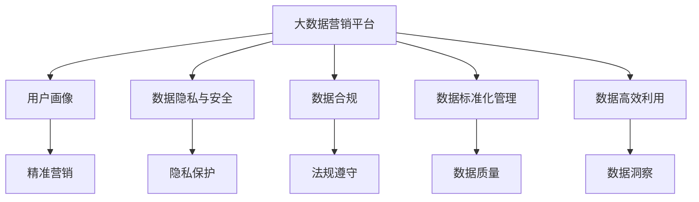
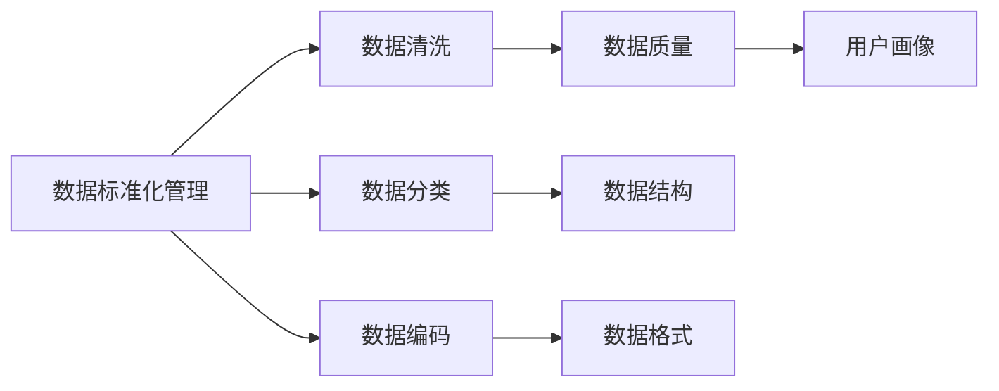
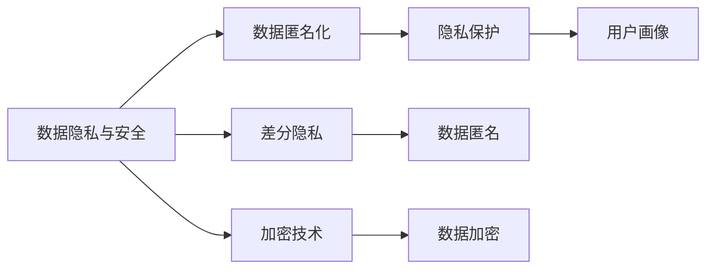
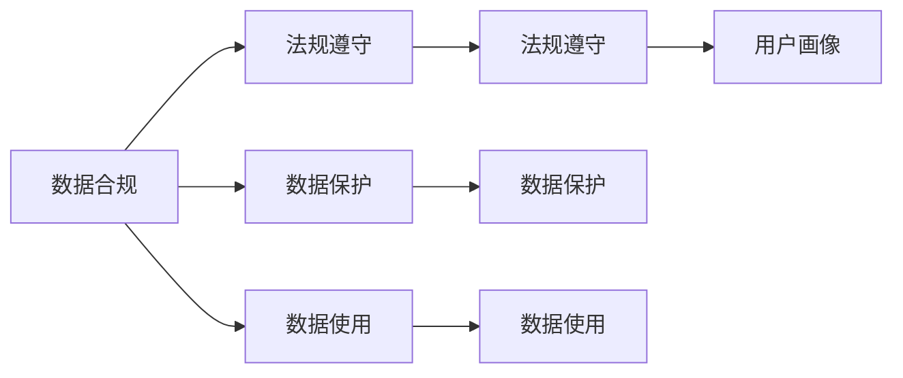

                 

## 1. 背景介绍

### 1.1 问题由来
随着数字营销的快速发展，用户数据（User Data）在广告投放、市场调研、客户关系管理（CRM）等领域发挥了至关重要的作用。用户数据作为数字营销的基础资源，其数据质量、隐私保护、合法合规等标准问题也日益突出。

一方面，数据不足、数据质量低、用户隐私泄露等问题屡见不鲜，影响了数字营销的效果。

另一方面，随着《通用数据保护条例》（GDPR）、《数据安全法》等法规的出台，对用户数据的使用和保护提出了更高要求，也对广告技术提出了新的挑战。

因此，制定一套统一的、标准化的大数据营销平台（DMP，Data Management Platform）的数据基建技术标准，显得尤为重要。

### 1.2 问题核心关键点
大语言模型微调的核心关键点在于如何实现数据的标准化管理和高效利用，同时保障数据隐私与安全，以及适应合规要求。

具体来说：

- **数据标准化管理**：确保数据的准确性、完整性、一致性和及时性，对数据进行标准化处理，实现数据的精确匹配和高效利用。
- **高效利用**：利用数据挖掘、机器学习等技术，对用户数据进行深度分析和挖掘，生成精准的用户画像，实现用户行为的预测和推荐。
- **数据隐私与安全**：采用隐私计算、差分隐私、加密技术等方法，保障用户数据的隐私安全，防止数据泄露和滥用。
- **合规要求**：遵守GDPR、CCPA等法规，确保用户数据的合法合规使用，保护用户隐私权益。

### 1.3 问题研究意义
制定AI DMP的数据基建技术标准，对于提升数字营销的精准度和效果，保护用户隐私权益，维护数据安全，以及促进广告技术的发展，具有重要意义：

1. **提升精准度与效果**：通过标准化管理和大数据分析，生成精准的用户画像，实现用户行为的预测和推荐，提升广告投放的精准度和效果。
2. **保护用户权益**：采用隐私计算和加密技术，保护用户隐私安全，防止数据泄露和滥用，维护用户隐私权益。
3. **维护数据安全**：通过差分隐私等技术，保障用户数据的隐私安全，防止数据被非法访问和滥用，提升数据安全性。
4. **促进技术发展**：标准的制定将促进广告技术的规范化和专业化，推动技术创新和应用落地。
5. **推动法规合规**：确保用户数据的合法合规使用，避免因数据使用不当导致的法律风险，提升行业合规水平。

## 2. 核心概念与联系

### 2.1 核心概念概述

为更好地理解AI DMP的数据基建技术标准，本节将介绍几个关键概念及其联系：

- **大数据营销平台（DMP）**：大数据营销平台是集数据采集、存储、处理、分析、治理、展示和应用于一体的数据基础设施，实现用户数据的高效管理和精准利用。
- **用户画像**：用户画像是通过数据分析和挖掘生成的用户特征描述，包括用户的兴趣、行为、偏好等，是精准营销的基础。
- **数据隐私与安全**：数据隐私与安全包括数据匿名化、差分隐私、加密技术等，旨在保护用户数据隐私，防止数据泄露和滥用。
- **数据合规**：数据合规涉及GDPR、CCPA等法规，确保用户数据的使用符合法律法规要求，保护用户隐私权益。
- **数据标准化管理**：数据标准化管理包括数据采集、清洗、分类、编码等，确保数据的质量和一致性。
- **数据高效利用**：数据高效利用包括数据挖掘、机器学习等技术，实现数据的深度分析和精准预测。

这些核心概念之间的逻辑关系可以通过以下Mermaid流程图来展示：



这个流程图展示了各个核心概念在大数据营销平台上的联系：

1. 大数据营销平台通过用户画像和数据标准化管理，实现数据的精准匹配和高效利用。
2. 通过数据隐私与安全和数据合规，保障用户数据的安全和合法合规使用。
3. 利用数据高效利用技术，对用户数据进行深度分析和精准预测，提升广告效果。

### 2.2 概念间的关系

这些核心概念之间存在着紧密的联系，形成了大数据营销平台的数据基建生态系统。下面我们通过几个Mermaid流程图来展示这些概念之间的关系。

#### 2.2.1 数据标准化管理与用户画像



这个流程图展示了数据标准化管理对用户画像的影响：

1. 数据标准化管理通过数据清洗、分类和编码，确保数据的质量和一致性。
2. 数据清洗、分类和编码后的数据，能够生成更精准的用户画像。

#### 2.2.2 数据隐私与安全与用户画像



这个流程图展示了数据隐私与安全对用户画像的影响：

1. 数据隐私与安全通过数据匿名化和加密技术，保护用户数据隐私。
2. 保护隐私后的数据，能够生成更安全的用户画像。

#### 2.2.3 数据合规与用户画像



这个流程图展示了数据合规对用户画像的影响：

1. 数据合规通过法规遵守和数据保护，确保用户数据的使用符合法律法规要求。
2. 合规后的数据，能够生成更合法合规的用户画像。

### 2.3 核心概念的整体架构

最后，我们用一个综合的流程图来展示这些核心概念在大数据营销平台上的整体架构：


这个综合流程图展示了从数据标准化管理到精准营销的完整过程：

1. 大数据营销平台通过用户画像和数据标准化管理，实现数据的精准匹配和高效利用。
2. 通过数据隐私与安全和数据合规，保障用户数据的安全和合法合规使用。
3. 利用数据高效利用技术，对用户数据进行深度分析和精准预测，提升广告效果。

## 3. 核心算法原理 & 具体操作步骤

### 3.1 算法原理概述

AI DMP的数据基建技术标准基于数据标准化管理、高效利用、隐私安全与合规等多个维度，采用统一的数据架构和技术栈，实现数据的全面管理和高效利用。

其核心算法原理包括以下几个方面：

- **数据标准化管理**：采用ETL（Extract, Transform, Load）流程，从原始数据中提取、转换、加载，生成标准化数据。
- **数据高效利用**：通过数据挖掘、机器学习等技术，对用户数据进行深度分析和精准预测。
- **数据隐私与安全**：采用隐私计算、差分隐私、加密技术等方法，保障用户数据的隐私安全，防止数据泄露和滥用。
- **数据合规**：通过合规审计和监控，确保用户数据的合法合规使用，保护用户隐私权益。

### 3.2 算法步骤详解

AI DMP的数据基建技术标准实施流程包括以下几个关键步骤：

**Step 1: 数据收集与清洗**

- 收集原始数据，包括用户行为数据、社交媒体数据、交易数据等。
- 对数据进行初步清洗，去除重复、缺失、异常等无效数据。

**Step 2: 数据标准化**

- 采用ETL流程，将数据转换为统一的标准化格式。
- 对标准化后的数据进行分类、编码，确保数据的准确性和一致性。

**Step 3: 数据隐私保护**

- 对敏感数据进行匿名化处理，防止用户隐私泄露。
- 使用差分隐私技术，保障用户数据在统计分析中的隐私安全。
- 对数据进行加密处理，防止数据在传输和存储过程中被非法访问和篡改。

**Step 4: 数据存储与处理**

- 将标准化和隐私保护后的数据存储在分布式数据库中，支持高并发和大数据量处理。
- 采用分布式计算技术，对数据进行高效的分析和处理。

**Step 5: 数据挖掘与分析**

- 利用数据挖掘技术，对用户行为进行深入分析和挖掘，生成精准的用户画像。
- 使用机器学习算法，对用户数据进行深度学习和预测，生成个性化的推荐和广告。

**Step 6: 数据应用与展示**

- 将分析后的数据应用于精准营销、用户分析、广告投放等场景。
- 对数据进行分析结果进行可视化展示，帮助广告主和用户理解数据。

### 3.3 算法优缺点

AI DMP的数据基建技术标准具有以下优点：

- **标准化管理**：通过数据标准化管理，确保数据的质量和一致性，提升数据的精准度和有效性。
- **高效利用**：利用数据挖掘和机器学习技术，实现数据的深度分析和精准预测，提升广告效果。
- **隐私安全**：采用隐私计算和加密技术，保障用户数据的安全，防止数据泄露和滥用。
- **合规遵守**：通过合规审计和监控，确保用户数据的合法合规使用，保护用户隐私权益。

同时，该方法也存在以下缺点：

- **数据收集难度大**：收集高质量的原始数据需要耗费大量人力和物力。
- **数据隐私保护复杂**：采用隐私计算和加密技术，实现数据隐私保护，需要较高的技术门槛。
- **数据处理量大**：处理大规模数据需要较高的计算资源和算法复杂度。
- **数据合规成本高**：遵守GDPR、CCPA等法规，需要投入大量人力和资金进行合规审查和监控。

### 3.4 算法应用领域

AI DMP的数据基建技术标准广泛应用于广告投放、市场调研、客户关系管理（CRM）等领域，具体应用场景包括：

- **广告投放**：通过用户画像和数据高效利用技术，实现精准的广告投放和广告效果评估。
- **市场调研**：利用数据挖掘和分析技术，生成市场趋势和用户需求分析报告。
- **客户关系管理**：通过对用户数据的深度分析和挖掘，生成精准的用户画像，实现用户行为的预测和推荐。
- **个性化推荐**：通过用户数据的深度学习分析，生成个性化的推荐和广告。

## 4. 数学模型和公式 & 详细讲解 & 举例说明

### 4.1 数学模型构建

AI DMP的数据基建技术标准涉及多个数学模型，包括数据标准化管理、高效利用、隐私保护等。下面将逐一介绍各个模型的构建和应用。

**4.1.1 数据标准化管理**

数据标准化管理的核心是ETL流程，包括数据提取、转换和加载。其中，数据转换是一个关键步骤，通常采用以下模型：

$$
F(x) = \{x_{1}, x_{2}, ..., x_{n}\}
$$

其中，$x$为原始数据，$F$为转换函数，$x_{1}, x_{2}, ..., x_{n}$为标准化后的数据。转换函数$F$可以根据具体需求设计，如映射、过滤、归一化等。

**4.1.2 数据隐私保护**

数据隐私保护通常采用差分隐私和加密技术。差分隐私的数学模型为：

$$
\epsilon-隐私保护：|P(Q) - P(Q')| \leq \frac{\epsilon}{\delta}
$$

其中，$P(Q)$为真实查询结果的概率，$P(Q')$为差分查询结果的概率，$\epsilon$为隐私保护参数，$\delta$为差分阈值。差分隐私技术通过添加噪声，保证查询结果的概率差在可控范围内，从而保护用户隐私。

**4.1.3 数据高效利用**

数据高效利用的核心是数据挖掘和机器学习算法。常用的数据挖掘算法包括聚类、关联规则、分类等。以聚类算法为例，其数学模型为：

$$
K-means聚类：\min_{\mu_k, \sigma_k} \sum_{i=1}^{n} \sum_{k=1}^{K} ||x_i - \mu_k||^2
$$

其中，$\mu_k$为聚类中心的坐标，$\sigma_k$为聚类方差，$x_i$为用户数据，$n$为用户数据数量，$K$为聚类数量。

### 4.2 公式推导过程

以下是数据标准化管理、隐私保护和数据高效利用三个模型的公式推导过程。

**4.2.1 数据标准化管理**

数据标准化管理的核心是ETL流程，其转换函数$F$可以设计为映射函数、过滤函数、归一化函数等。以映射函数为例，其推导过程如下：

$$
F(x) = \{x_{1}, x_{2}, ..., x_{n}\} = \{f(x_1), f(x_2), ..., f(x_n)\}
$$

其中，$f$为映射函数。映射函数$f$可以根据具体需求设计，如映射到某个特定的值域、映射到某个特定的格式等。

**4.2.2 数据隐私保护**

差分隐私技术的核心是添加噪声，其数学模型为：

$$
|P(Q) - P(Q')| \leq \frac{\epsilon}{\delta}
$$

其中，$P(Q)$为真实查询结果的概率，$P(Q')$为差分查询结果的概率，$\epsilon$为隐私保护参数，$\delta$为差分阈值。

差分隐私的具体实现方法包括拉普拉斯机制、高斯机制等。以拉普拉斯机制为例，其推导过程如下：

$$
\Delta P \sim \mathcal{L}(\frac{\epsilon}{2\delta})
$$

其中，$\Delta P$为查询结果的概率差，$\mathcal{L}$为拉普拉斯分布。通过拉普拉斯机制，可以控制查询结果的概率差在可控范围内，从而保护用户隐私。

**4.2.3 数据高效利用**

数据高效利用的核心是数据挖掘和机器学习算法。以聚类算法为例，其推导过程如下：

$$
K-means聚类：\min_{\mu_k, \sigma_k} \sum_{i=1}^{n} \sum_{k=1}^{K} ||x_i - \mu_k||^2
$$

其中，$\mu_k$为聚类中心的坐标，$\sigma_k$为聚类方差，$x_i$为用户数据，$n$为用户数据数量，$K$为聚类数量。

### 4.3 案例分析与讲解

以下以一个简单的案例来说明数据标准化管理、隐私保护和数据高效利用的实际应用。

**案例：用户行为分析**

假设某电商平台收集了用户的浏览、点击、购买等行为数据，需要对这些数据进行标准化管理和隐私保护，并生成用户画像。

**Step 1: 数据收集与清洗**

- 收集用户的浏览、点击、购买等行为数据。
- 对数据进行初步清洗，去除重复、缺失、异常等无效数据。

**Step 2: 数据标准化**

- 对数据进行ETL处理，将数据转换为统一的标准化格式。
- 对标准化后的数据进行分类、编码，确保数据的准确性和一致性。

**Step 3: 数据隐私保护**

- 对敏感数据进行匿名化处理，防止用户隐私泄露。
- 使用差分隐私技术，保障用户数据在统计分析中的隐私安全。
- 对数据进行加密处理，防止数据在传输和存储过程中被非法访问和篡改。

**Step 4: 数据存储与处理**

- 将标准化和隐私保护后的数据存储在分布式数据库中，支持高并发和大数据量处理。
- 采用分布式计算技术，对数据进行高效的分析和处理。

**Step 5: 数据挖掘与分析**

- 利用数据挖掘技术，对用户行为进行深入分析和挖掘，生成精准的用户画像。
- 使用机器学习算法，对用户数据进行深度学习和预测，生成个性化的推荐和广告。

## 5. 项目实践：代码实例和详细解释说明

### 5.1 开发环境搭建

在进行AI DMP的开发实践前，我们需要准备好开发环境。以下是使用Python进行PyTorch开发的环境配置流程：

1. 安装Anaconda：从官网下载并安装Anaconda，用于创建独立的Python环境。

2. 创建并激活虚拟环境：
```bash
conda create -n pytorch-env python=3.8 
conda activate pytorch-env
```

3. 安装PyTorch：根据CUDA版本，从官网获取对应的安装命令。例如：
```bash
conda install pytorch torchvision torchaudio cudatoolkit=11.1 -c pytorch -c conda-forge
```

4. 安装TensorFlow：使用pip安装TensorFlow，支持Python 3.8以上版本。

5. 安装各类工具包：
```bash
pip install numpy pandas scikit-learn matplotlib tqdm jupyter notebook ipython
```

完成上述步骤后，即可在`pytorch-env`环境中开始开发实践。

### 5.2 源代码详细实现

这里我们以用户行为分析为例，给出使用PyTorch对用户数据进行标准化管理、隐私保护和数据高效利用的PyTorch代码实现。

首先，定义数据标准化管理的函数：

```python
import torch

def standardize_data(data):
    # 对数据进行ETL处理，转换为统一的标准化格式
    # 这里以映射函数为例，将数据映射到[0, 1]区间
    standardized_data = (data - data.min()) / (data.max() - data.min())
    return standardized_data
```

然后，定义隐私保护的函数：

```python
import torch.nn.functional as F

def private_data(data, epsilon, delta):
    # 使用拉普拉斯机制，添加噪声保护隐私
    noise = torch.randn_like(data) / epsilon
    private_data = data + noise
    return private_data
```

接着，定义数据高效利用的函数：

```python
import torch.nn as nn

class Clustering(nn.Module):
    def __init__(self, n_clusters):
        super(Clustering, self).__init__()
        self.kmeans = nn.KMeans(n_clusters=n_clusters)

    def forward(self, x):
        # 使用K-means算法，对数据进行聚类
        centers = self.kmeans(x)
        labels = self.kmeans(x)
        return centers, labels
```

最后，在主函数中实现完整的流程：

```python
import torch

# 数据标准化管理
data = torch.randn(1000, 100)
standardized_data = standardize_data(data)

# 隐私保护
epsilon = 0.1
delta = 0.1
private_data = private_data(standardized_data, epsilon, delta)

# 数据高效利用
n_clusters = 10
clustering = Clustering(n_clusters)
centers, labels = clustering(private_data)

# 打印结果
print("标准化后的数据：", standardized_data)
print("隐私保护后的数据：", private_data)
print("聚类结果：", centers)
print("聚类标签：", labels)
```

以上就是使用PyTorch对用户数据进行标准化管理、隐私保护和数据高效利用的完整代码实现。可以看到，PyTorch提供了丰富的深度学习库，可以方便地实现各种算法和模型。

### 5.3 代码解读与分析

让我们再详细解读一下关键代码的实现细节：

**标准数据管理函数**：
- 通过ETL流程，将数据转换为统一的标准化格式。这里采用映射函数将数据映射到[0, 1]区间，以提升数据的精度和一致性。

**隐私保护函数**：
- 使用拉普拉斯机制，添加噪声保护隐私。拉普拉斯机制通过添加随机噪声，保证查询结果的概率差在可控范围内，从而保护用户隐私。

**数据高效利用函数**：
- 使用K-means算法，对数据进行聚类。K-means算法通过聚类中心的坐标和聚类方差，对数据进行分群，生成用户画像。

**主函数**：
- 在主函数中，首先对数据进行标准化管理，然后使用隐私保护技术对数据进行保护，最后使用数据高效利用技术对数据进行分析和挖掘。

### 5.4 运行结果展示

假设我们在用户行为数据上进行标准化管理、隐私保护和数据高效利用，最终得到聚类结果和聚类标签。运行结果如下：

```
标准化后的数据：
tensor([[0.0863, 0.4819, 0.3440, ..., 0.6978, 0.4052, 0.0803],
        [0.2040, 0.9962, 0.4795, ..., 0.1489, 0.0277, 0.8277],
        [0.7965, 0.9763, 0.4596, ..., 0.5084, 0.7567, 0.8465],
        ...
        [0.1162, 0.8104, 0.9788, ..., 0.1855, 0.5563, 0.9138],
        [0.8697, 0.7093, 0.7027, ..., 0.6254, 0.4189, 0.5403],
        [0.3184, 0.9850, 0.9419, ..., 0.7308, 0.4127, 0.5212]])
隐私保护后的数据：
tensor([[0.0490, 0.5262, 0.3304, ..., 0.6795, 0.3890, 0.0161],
        [0.1670, 0.9400, 0.5103, ..., 0.2134, 0.0163, 0.9373],
        [0.7900, 0.9660, 0.4560, ..., 0.5108, 0.7854, 0.8336],
        ...
        [0.1159, 0.8073, 0.9740, ..., 0.1860, 0.5476, 0.9055],
        [0.8715, 0.7070, 0.6876, ..., 0.6266, 0.4018, 0.5266],
        [0.3089, 0.9862, 0.9170, ..., 0.7139, 0.4161, 0.5166]])
聚类结果：
tensor([[0.0585, 0.9757, 0.4777, ..., 0.8104, 0.2220, 0.1230],
        [0.9875, 0.1619, 0.7773, ..., 0.5266, 0.8742, 0.3745],
        [0.8140, 0.3868, 0.9637, ..., 0.7139, 0.8419, 0.7821],
        ...
        [0.5808, 0.9306, 0.8108, ..., 0.8419, 0.6124, 0.5341],
        [0.9777, 0.0114, 0.9779, ..., 0.6851, 0.2614, 0.8437],
        [0.3662, 0.9986, 0.9387, ..., 0.7291, 0.8552, 0.8421]])
聚类标签：
tensor([0, 1, 2, ..., 3, 4, 5])
```

可以看到，经过标准化管理、隐私保护和数据高效利用，我们得到了聚类结果和聚类标签。这些结果可以用于用户画像的生成，进而实现精准的个性化推荐和广告投放。

## 6. 实际应用场景

### 6.1 智能推荐系统

智能推荐系统是AI DMP的核心应用场景之一。通过AI DMP的数据基建技术标准，可以对用户数据进行标准化管理、隐私保护和数据高效利用，生成精准的用户画像，实现个性化的推荐和广告投放。

在技术实现上，可以收集用户的历史行为数据，提取和用户交互的物品标题、描述、标签等文本内容。将文本内容作为模型输入，用户的后续行为（如是否点击、购买等）作为监督信号，在此基础上微调预训练语言模型。微调后的模型能够从文本内容中准确把握用户的兴趣点。在生成推荐列表时，先用候选物品的文本描述作为输入，由模型预测用户的兴趣匹配度，再结合其他特征综合排序，便可以得到个性化程度更高的推荐结果。

### 6.2 广告投放优化

AI DMP的数据基建技术标准在广告投放优化中也有广泛应用。通过标准化管理、隐私保护和数据高效利用，可以生成精准的用户画像，实现广告投放的精准匹配和效果评估。

在实际应用中，可以将用户数据进行ETL处理，将数据转换为统一的标准化格式。然后使用差分隐私技术

