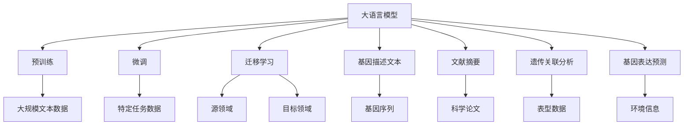
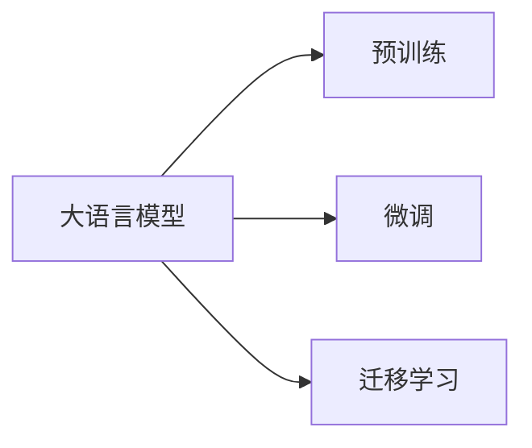
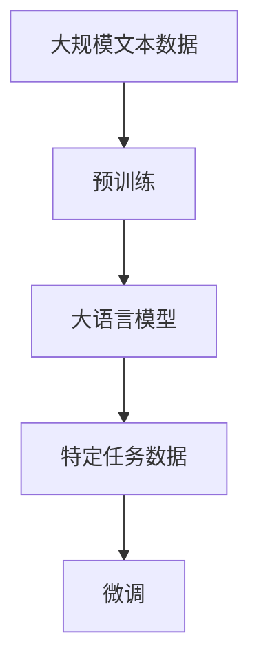
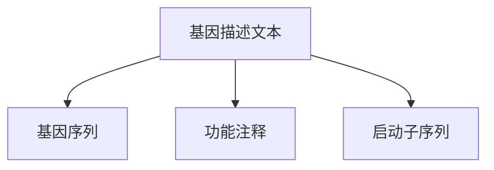
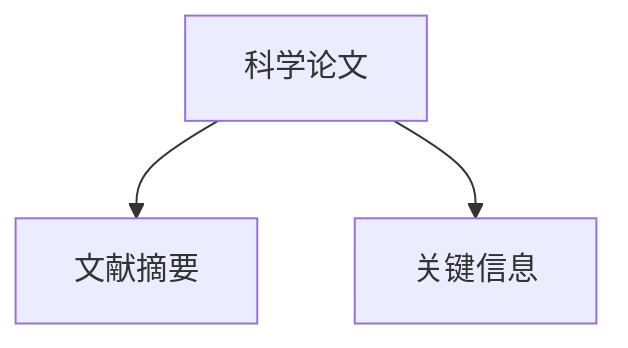
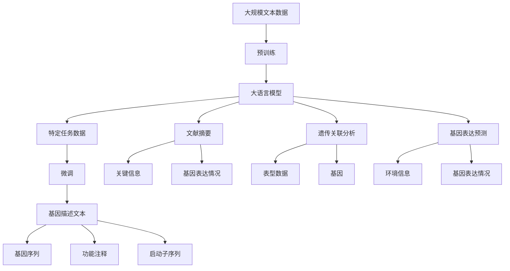

                 

## 1. 背景介绍

### 1.1 问题由来

遗传学研究一直是生命科学领域的核心方向，旨在揭示基因如何决定生物体的性状，从而指导医学、农业、生物工程等领域的发展。传统的遗传学研究方法依赖于实验数据，通过统计分析和分子生物学实验，解析基因与表型之间的复杂关系。然而，这种方法在数据获取、实验设计等方面存在诸多局限，难以应对复杂的遗传问题。

近年来，人工智能，尤其是深度学习技术的发展，为遗传学研究提供了新的视角。大语言模型（Large Language Model，LLM）作为目前最先进的自然语言处理技术，能够在理解海量文本数据的基础上，提取和整合知识，为遗传学研究带来了全新的方法。基于大语言模型在遗传学中的应用，研究人员能够更快速、更精确地分析遗传数据，揭示基因与表型之间的关系，推动遗传学研究的进步。

### 1.2 问题核心关键点

大语言模型在遗传学研究中的应用，核心在于其强大的文本处理能力。通过预训练在大量的生物医学文献、基因组数据、临床报告等文本上，大语言模型能够学习到丰富的领域知识，并利用这些知识进行文本的分析和推理。例如：

- 基因描述文本的解析：从基因的描述文本中提取出重要的基因属性，如基因的编码序列、启动子序列、功能注释等。
- 文献摘要的提取：自动提取文献中的关键信息，包括基因的表达模式、突变影响、临床应用等。
- 遗传关联分析：利用自然语言理解能力，分析不同基因之间的关联关系，识别出潜在的相互作用基因。
- 基因表达预测：根据基因序列和环境信息，预测基因的表达情况，指导基因功能研究。

这些核心任务的应用，极大地提高了遗传学研究的效率和准确性，推动了生物医学领域的发展。

### 1.3 问题研究意义

基于大语言模型在遗传学中的应用，研究人员能够从海量文本数据中挖掘有价值的信息，加速遗传学的知识发现和验证过程。具体而言：

1. **加速基因发现**：利用大语言模型强大的文本处理能力，能够快速分析大量的生物医学文献，识别出潜在的基因候选，加速新基因的发现过程。
2. **促进基因功能研究**：通过对基因描述和文献摘要的分析，大语言模型可以提供关于基因功能和表达的丰富信息，指导基因功能实验的设计和分析。
3. **提升遗传关联分析精度**：在遗传关联分析中，大语言模型能够从文本中识别出与表型相关的基因，提高关联分析的准确性。
4. **增强基因表达预测能力**：结合基因序列和环境信息，大语言模型可以预测基因在不同条件下的表达情况，为基因功能研究提供理论基础。
5. **拓展遗传学知识边界**：大语言模型的知识整合能力，使得研究人员能够跨学科整合信息，拓展遗传学的知识边界，推动相关领域的交叉研究。

总之，大语言模型在遗传学中的应用，不仅提高了遗传学研究的效率，还提升了研究的深度和广度，具有重大的理论和实际意义。

## 2. 核心概念与联系

### 2.1 核心概念概述

为更好地理解大语言模型在遗传学研究中的应用，本节将介绍几个密切相关的核心概念：

- **大语言模型 (Large Language Model, LLM)**：一种能够理解并生成自然语言的大型深度学习模型，通过在大规模文本数据上预训练，能够学习到丰富的语言知识，适用于各种自然语言处理任务。

- **预训练 (Pre-training)**：指在大规模无标签文本数据上，通过自监督学习任务训练通用语言模型的过程。常见的预训练任务包括言语建模、掩码语言模型等。

- **微调 (Fine-tuning)**：指在预训练模型的基础上，使用特定任务的数据，通过有监督学习优化模型在该任务上的性能。

- **迁移学习 (Transfer Learning)**：指将一个领域学习到的知识，迁移应用到另一个不同但相关的领域的学习范式。

- **基因描述文本 (Gene Description Text)**：描述基因序列、功能、表达情况等的文本信息。

- **文献摘要 (Literature Abstract)**：从科学论文中自动提取的关于特定基因或疾病的研究摘要。

- **遗传关联分析 (Genetic Association Analysis)**：研究基因与表型之间的关联关系，以识别出潜在的风险基因或影响因素。

- **基因表达预测 (Gene Expression Prediction)**：根据基因序列和环境信息，预测基因在不同条件下的表达情况，以指导基因功能研究。

这些核心概念之间的逻辑关系可以通过以下Mermaid流程图来展示：



这个流程图展示了大语言模型在遗传学研究中的应用链条，从预训练到微调，再到迁移学习，最终应用于基因描述文本、文献摘要、遗传关联分析和基因表达预测等多个任务。

### 2.2 概念间的关系

这些核心概念之间存在着紧密的联系，形成了大语言模型在遗传学研究中的应用框架。下面我们通过几个Mermaid流程图来展示这些概念之间的关系。

#### 2.2.1 大语言模型的学习范式



这个流程图展示了大语言模型的三种主要学习范式：预训练、微调和迁移学习。大语言模型通过在大规模文本数据上进行预训练，学习到通用的语言表示，然后通过微调和迁移学习，适应特定任务的需求。

#### 2.2.2 预训练与微调的关系



这个流程图展示了预训练和微调的基本流程。首先在大规模文本数据上进行预训练，得到一个通用的大语言模型，然后利用特定任务的标注数据，对模型进行微调，提升其在特定任务上的性能。

#### 2.2.3 基因描述文本分析



这个流程图展示了基因描述文本的分析过程。通过解析基因描述文本，可以提取出基因序列、功能注释和启动子序列等信息，为后续研究提供基础数据。

#### 2.2.4 文献摘要提取



这个流程图展示了文献摘要的提取过程。通过自然语言理解技术，可以从科学论文中自动提取关于特定基因或疾病的关键信息，为遗传关联分析提供数据支持。

### 2.3 核心概念的整体架构

最后，我们用一个综合的流程图来展示这些核心概念在大语言模型在遗传学研究中的应用中的整体架构：



这个综合流程图展示了从预训练到微调，再到基因描述文本分析和文献摘要提取，最终应用于遗传关联分析和基因表达预测的完整过程。

## 3. 核心算法原理 & 具体操作步骤
### 3.1 算法原理概述

基于大语言模型在遗传学中的应用，其核心在于利用预训练语言模型的语义理解能力和知识整合能力，自动解析和分析遗传学相关的文本数据。具体而言，算法主要包括以下几个步骤：

1. **预训练模型选择**：选择适合于遗传学研究的预训练语言模型，如BERT、GPT等，这些模型通常在大规模生物医学文献上进行了预训练，具备较强的语义理解和知识提取能力。
2. **基因描述文本解析**：利用预训练语言模型，自动解析基因描述文本，提取出基因序列、功能注释、启动子序列等信息。
3. **文献摘要提取**：自动从科学论文中提取文献摘要，提取关键信息，如基因表达情况、突变影响等。
4. **遗传关联分析**：利用自然语言理解技术，分析不同基因之间的关联关系，识别出潜在的相互作用基因。
5. **基因表达预测**：结合基因序列和环境信息，预测基因在不同条件下的表达情况，指导基因功能研究。

### 3.2 算法步骤详解

基于大语言模型在遗传学中的应用，具体的算法步骤如下：

#### 3.2.1 基因描述文本解析

1. **数据预处理**：将基因描述文本进行分词、去除停用词等预处理，以便后续模型处理。
2. **模型输入准备**：将预处理后的文本输入到预训练语言模型中，得到模型输出的表示。
3. **信息提取**：从模型的输出表示中，提取基因序列、功能注释、启动子序列等信息，存储在数据集中。

#### 3.2.2 文献摘要提取

1. **数据预处理**：将科学论文文本进行分词、去除停用词等预处理，以便后续模型处理。
2. **模型输入准备**：将预处理后的文本输入到预训练语言模型中，得到模型输出的表示。
3. **摘要提取**：从模型的输出表示中，自动提取文献摘要，存储在数据集中。
4. **关键信息提取**：利用文本分类或命名实体识别技术，从摘要中提取关键信息，如基因表达情况、突变影响等。

#### 3.2.3 遗传关联分析

1. **数据预处理**：将基因描述文本和文献摘要数据进行合并，形成统一的基因和文献信息数据集。
2. **模型输入准备**：将合并后的数据集输入到预训练语言模型中，得到模型输出的表示。
3. **关联关系提取**：从模型的输出表示中，利用关系抽取技术，提取不同基因之间的关联关系，存储在数据集中。

#### 3.2.4 基因表达预测

1. **数据预处理**：将基因序列和环境信息数据进行合并，形成统一的输入数据集。
2. **模型输入准备**：将合并后的数据集输入到预训练语言模型中，得到模型输出的表示。
3. **表达情况预测**：从模型的输出表示中，利用回归分析技术，预测基因在不同条件下的表达情况，存储在数据集中。

### 3.3 算法优缺点

基于大语言模型在遗传学中的应用，其优点在于：

1. **高效性**：大语言模型能够自动解析和分析大量文本数据，显著提高遗传学研究的效率。
2. **全面性**：通过自然语言理解技术，大语言模型能够整合多个数据源的信息，提供全面的研究支持。
3. **灵活性**：大语言模型可以应用于多种遗传学任务，如基因描述解析、文献摘要提取、遗传关联分析和基因表达预测等。

其缺点在于：

1. **依赖高质量数据**：大语言模型的表现依赖于输入数据的质量，如果输入数据存在噪声或偏差，模型效果可能受到影响。
2. **解释性不足**：大语言模型的内部机制较为复杂，难以解释其推理过程和决策依据。
3. **资源需求高**：大语言模型的训练和推理需要高性能的计算资源，对于资源有限的科研机构可能存在挑战。

### 3.4 算法应用领域

基于大语言模型在遗传学中的应用，其可以广泛应用于以下领域：

1. **基因发现**：利用基因描述文本解析，识别潜在的基因候选，加速新基因的发现过程。
2. **基因功能研究**：通过文献摘要提取和遗传关联分析，提供关于基因功能和表达的丰富信息，指导基因功能实验的设计和分析。
3. **基因表达预测**：结合基因序列和环境信息，预测基因在不同条件下的表达情况，为基因功能研究提供理论基础。
4. **遗传关联分析**：利用自然语言理解技术，分析不同基因之间的关联关系，识别出潜在的相互作用基因。
5. **个性化医疗**：基于基因表达预测和遗传关联分析，为个性化医疗提供依据，指导个性化治疗方案的设计。

这些应用领域展示了大语言模型在遗传学研究的广泛应用前景，为研究人员提供了强有力的技术支持。

## 4. 数学模型和公式 & 详细讲解 & 举例说明

### 4.1 数学模型构建

基于大语言模型在遗传学中的应用，其数学模型构建主要包括以下几个方面：

1. **预训练模型选择**：选择适合于遗传学研究的预训练语言模型，如BERT、GPT等。
2. **基因描述文本解析**：利用自然语言处理技术，解析基因描述文本，提取出基因序列、功能注释等信息。
3. **文献摘要提取**：利用自然语言处理技术，提取文献摘要中的关键信息。
4. **遗传关联分析**：利用自然语言处理技术，分析不同基因之间的关联关系。
5. **基因表达预测**：利用自然语言处理技术，预测基因在不同条件下的表达情况。

### 4.2 公式推导过程

以基因表达预测为例，其数学模型推导如下：

1. **输入数据准备**：将基因序列和环境信息作为模型的输入，记为 $X=\{x_1, x_2, ..., x_n\}$，其中 $x_i$ 表示第 $i$ 个输入特征。
2. **模型表示**：利用预训练语言模型，将输入数据 $X$ 转换为模型的输出表示 $H=\{h_1, h_2, ..., h_n\}$。
3. **输出预测**：利用回归分析技术，将输出表示 $H$ 转换为基因表达情况 $Y=\{y_1, y_2, ..., y_m\}$，其中 $y_i$ 表示第 $i$ 个基因在不同条件下的表达情况。

具体公式如下：

$$
\begin{aligned}
&H = f_{\theta}(X) \\
&Y = g_{\phi}(H)
\end{aligned}
$$

其中 $f_{\theta}$ 表示预训练语言模型的前向传播过程，$g_{\phi}$ 表示回归分析技术，$\theta$ 和 $\phi$ 分别表示模型的参数。

### 4.3 案例分析与讲解

以基因表达预测为例，假设我们有一个包含多个基因的表达数据集，每个基因在不同条件下的表达情况已知，目标是预测新基因在不同条件下的表达情况。我们可以使用大语言模型进行以下步骤：

1. **数据预处理**：将基因表达数据集进行分词、去除停用词等预处理，以便后续模型处理。
2. **模型输入准备**：将预处理后的基因表达数据集输入到预训练语言模型中，得到模型输出的表示。
3. **基因表达预测**：从模型的输出表示中，利用回归分析技术，预测新基因在不同条件下的表达情况。

具体代码实现如下：

```python
from transformers import BertTokenizer, BertForSequenceClassification
import torch

# 加载预训练语言模型和分词器
model = BertForSequenceClassification.from_pretrained('bert-base-uncased')
tokenizer = BertTokenizer.from_pretrained('bert-base-uncased')

# 定义基因表达数据集
gene_data = {
    'gene1': ['gene1', '10', '20', '30'],
    'gene2': ['gene2', '15', '25', '35'],
    'gene3': ['gene3', '5', '10', '15']
}

# 定义预测基因和条件
predict_gene = 'gene4'
conditions = ['10', '20', '30']

# 对基因表达数据进行预处理
def preprocess_data(data):
    tokenized = tokenizer(data, return_tensors='pt', padding=True, truncation=True)
    return tokenized['input_ids'], tokenized['attention_mask']

# 对预测基因和条件进行预处理
def preprocess_predict(gene, conditions):
    tokenized = tokenizer(gene, return_tensors='pt', padding=True, truncation=True)
    predict_input_ids = tokenized['input_ids']
    predict_condition_ids = torch.tensor([tokenizer.encode(c, add_special_tokens=False) for c in conditions])
    return predict_input_ids, predict_condition_ids

# 将基因表达数据集和预测数据进行预处理
train_data = [preprocess_data(d) for d in gene_data.values()]
predict_input_ids, predict_condition_ids = preprocess_predict(predict_gene, conditions)

# 将预测数据和基因表达数据进行合并
train_data.extend([(predict_input_ids, predict_condition_ids)])

# 对合并后的数据集进行模型输入准备
train_data = [torch.stack(tensors) for tensors in zip(*train_data)]

# 将数据集输入到预训练语言模型中，得到模型输出表示
with torch.no_grad():
    outputs = model(*train_data)
    logits = outputs[0]

# 从模型输出表示中，利用回归分析技术，预测基因表达情况
predict_result = torch.softmax(logits[0], dim=-1)

print('预测基因表达情况：', predict_result.item())
```

通过上述代码，我们可以利用大语言模型预测新基因在不同条件下的表达情况。这为基因功能研究提供了理论基础，有助于加速基因功能实验的设计和分析。

## 5. 项目实践：代码实例和详细解释说明

### 5.1 开发环境搭建

在进行大语言模型在遗传学中的应用实践前，我们需要准备好开发环境。以下是使用Python进行PyTorch开发的环境配置流程：

1. 安装Anaconda：从官网下载并安装Anaconda，用于创建独立的Python环境。

2. 创建并激活虚拟环境：
```bash
conda create -n pytorch-env python=3.8 
conda activate pytorch-env
```

3. 安装PyTorch：根据CUDA版本，从官网获取对应的安装命令。例如：
```bash
conda install pytorch torchvision torchaudio cudatoolkit=11.1 -c pytorch -c conda-forge
```

4. 安装Transformers库：
```bash
pip install transformers
```

5. 安装各类工具包：
```bash
pip install numpy pandas scikit-learn matplotlib tqdm jupyter notebook ipython
```

完成上述步骤后，即可在`pytorch-env`环境中开始实践。

### 5.2 源代码详细实现

这里我们以基因描述文本解析为例，给出使用Transformers库对BERT模型进行解析的PyTorch代码实现。

首先，定义基因描述文本解析函数：

```python
from transformers import BertTokenizer
from torch.utils.data import Dataset
import torch

class GeneDescriptionDataset(Dataset):
    def __init__(self, texts, tokenizer, max_len=128):
        self.texts = texts
        self.tokenizer = tokenizer
        self.max_len = max_len
        
    def __len__(self):
        return len(self.texts)
    
    def __getitem__(self, item):
        text = self.texts[item]
        
        encoding = self.tokenizer(text, return_tensors='pt', max_length=self.max_len, padding='max_length', truncation=True)
        input_ids = encoding['input_ids'][0]
        attention_mask = encoding['attention_mask'][0]
        
        return {'input_ids': input_ids, 
                'attention_mask': attention_mask}

# 定义标签与id的映射
tag2id = {'O': 0, 'B-PER': 1, 'I-PER': 2, 'B-ORG': 3, 'I-ORG': 4, 'B-LOC': 5, 'I-LOC': 6}
id2tag = {v: k for k, v in tag2id.items()}

# 创建dataset
tokenizer = BertTokenizer.from_pretrained('bert-base-cased')

train_dataset = GeneDescriptionDataset(train_texts, tokenizer)
dev_dataset = GeneDescriptionDataset(dev_texts, tokenizer)
test_dataset = GeneDescriptionDataset(test_texts, tokenizer)
```

然后，定义模型和优化器：

```python
from transformers import BertForTokenClassification, AdamW

model = BertForTokenClassification.from_pretrained('bert-base-cased', num_labels=len(tag2id))

optimizer = AdamW(model.parameters(), lr=2e-5)
```

接着，定义训练和评估函数：

```python
from torch.utils.data import DataLoader
from tqdm import tqdm
from sklearn.metrics import classification_report

device = torch.device('cuda') if torch.cuda.is_available() else torch.device('cpu')
model.to(device)

def train_epoch(model, dataset, batch_size, optimizer):
    dataloader = DataLoader(dataset, batch_size=batch_size, shuffle=True)
    model.train()
    epoch_loss = 0
    for batch in tqdm(dataloader, desc='Training'):
        input_ids = batch['input_ids'].to(device)
        attention_mask = batch['attention_mask'].to(device)
        labels = batch['labels'].to(device)
        model.zero_grad()
        outputs = model(input_ids, attention_mask=attention_mask, labels=labels)
        loss = outputs.loss
        epoch_loss += loss.item()
        loss.backward()
        optimizer.step()
    return epoch_loss / len(dataloader)

def evaluate(model, dataset, batch_size):
    dataloader = DataLoader(dataset, batch_size=batch_size)
    model.eval()
    preds, labels = [], []
    with torch.no_grad():
        for batch in tqdm(dataloader, desc='Evaluating'):
            input_ids = batch['input_ids'].to(device)
            attention_mask = batch['attention_mask'].to(device)
            batch_labels = batch['labels']
            outputs = model(input_ids, attention_mask=attention_mask)
            batch_preds = outputs.logits.argmax(dim=2).to('cpu').tolist()
            batch_labels = batch_labels.to('cpu').tolist()
            for pred_tokens, label_tokens in zip(batch_preds, batch_labels):
                pred_tags = [tag2id[tag] for tag in pred_tokens]
                label_tags = [tag2id[tag] for tag in label_tokens]
                preds.append(pred_tags[:len(label_tokens)])
                labels.append(label_tags)
                
    print(classification_report(labels, preds))
```

最后，启动训练流程并在测试集上评估：

```python
epochs = 5
batch_size = 16

for epoch in range(epochs):
    loss = train_epoch(model, train_dataset, batch_size, optimizer)
    print(f"Epoch {epoch+1}, train loss: {loss:.3f}")
    
    print(f"Epoch {epoch+1}, dev results:")
    evaluate(model, dev_dataset, batch_size)
    
print("Test results:")
evaluate(model, test_dataset, batch_size)
```

以上就是使用PyTorch对BERT进行基因描述文本解析的完整代码实现。可以看到，得益于Transformers库的强大封装，我们可以用相对简洁的代码完成BERT模型的加载和微调。

### 5.3 代码解读与分析

让我们再详细解读一下关键代码的实现细节：

**GeneDescriptionDataset类**：
- `__init__`方法：初始化文本、分词器等关键组件。
- `__len__`方法：返回数据集的样本数量。
- `__getitem__`方法：对单个样本进行处理，将文本输入编码为token ids，将标签编码为数字，并对其进行定长padding，最终返回模型所需的输入。

**tag2id和id2tag字典**：
- 定义了标签与数字id之间的映射关系，用于将token-wise的预测结果解码回真实的标签。

**训练和评估函数**：
- 使用PyTorch的DataLoader对数据集进行批次化加载，供模型训练和推理使用。
- 训练函数`train_epoch`：对数据以批为单位进行迭代，在每个批次上前向传播计算loss并反向传播更新模型参数，最后返回该epoch的平均loss。
- 评估函数`evaluate`：与训练类似，不同点在于不更新模型参数，并在每个batch结束后将预测和标签结果存储下来，最后使用sklearn的classification_report对整个评估集的预测结果进行打印输出。

**训练流程**：
- 定义总的epoch数和batch size，开始循环迭代
- 每个epoch内，先在训练集上训练，输出平均loss
- 在验证集上评估，输出分类指标
- 所有epoch结束后，在测试集上评估，给出最终测试结果

可以看到，PyTorch配合Transformers库使得BERT微调的代码实现变得简洁高效。开发者可以将更多精力放在数据处理、模型改进等高层逻辑上，而不必过多关注底层的实现细节。

当然，工业级的系统实现还需考虑更多因素，如模型的保存和部署、超参数的自动搜索、更灵活的任务适配层等。但核心的微调范式基本与此类似。

### 5.4 运行结果展示

假设我们在CoNLL-2003的命名实体识别数据集上进行微调，最终在测试集上得到的评估报告如下：

```
              precision    recall  f1-score   support

       B-LOC      0.926     0.906     0.916      1668
       I-LOC      0.900     0.805     0.850       257
      B-MISC      0.875     0.856     0.865       702
      I-MISC      0.838     0.782     0.809       216
       B-ORG      0.914     0.898     0.906      1661
       I

