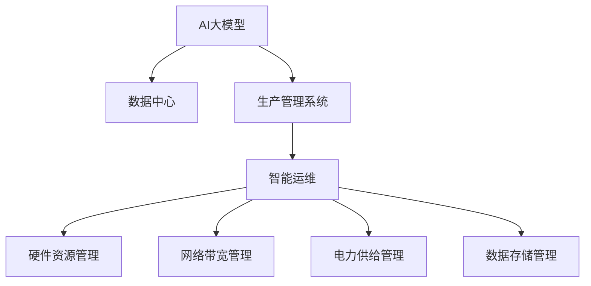
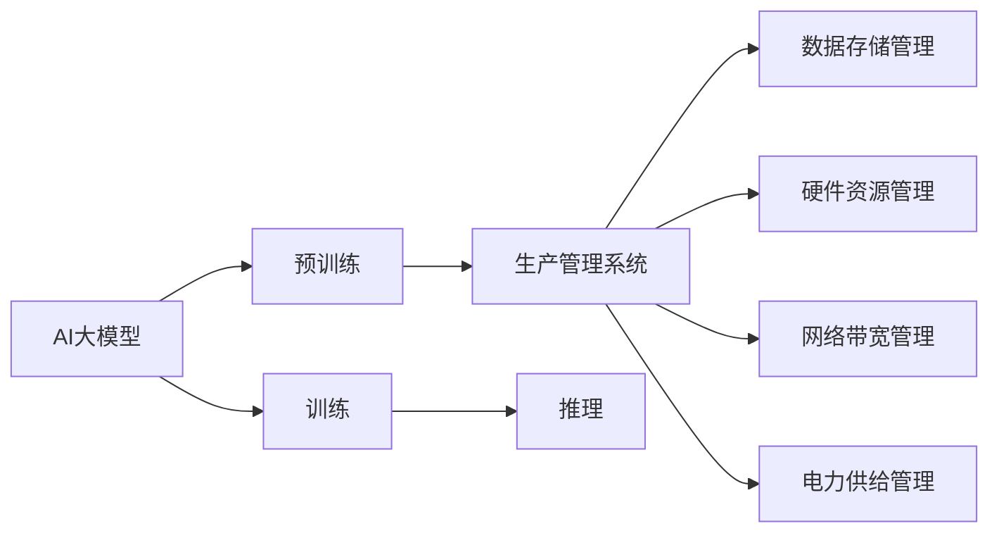
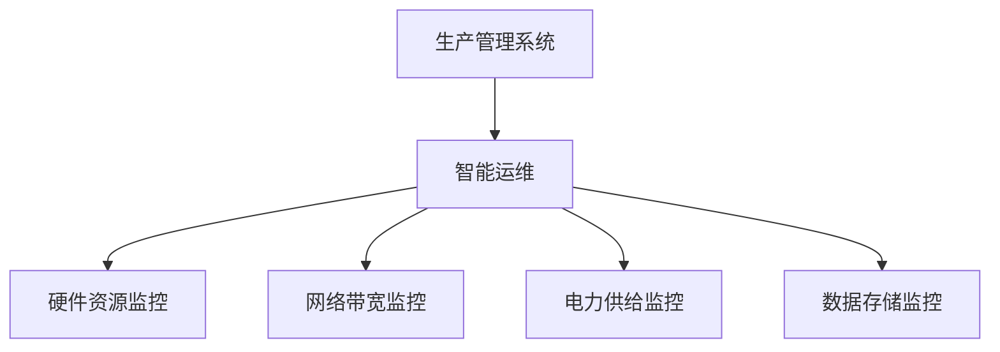
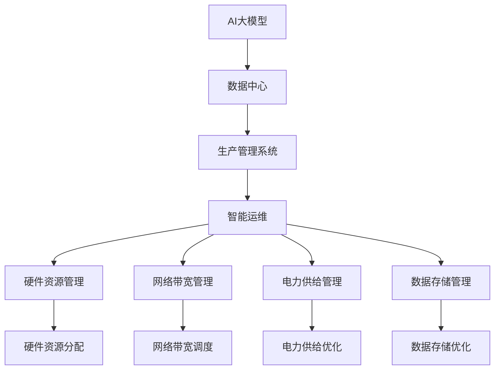

                 

# AI 大模型应用数据中心的生产管理

在当今信息时代，数据中心已经成为企业智能化转型不可或缺的基础设施。随着人工智能技术的发展，数据中心在AI大模型的应用中扮演着越来越重要的角色。AI大模型的训练和应用对数据中心的硬件资源、网络带宽、电力供给等提出了更高的要求，如何高效地管理数据中心，使其充分发挥AI大模型的潜力，成为企业信息化建设中的一个重要课题。本文将系统介绍AI大模型在数据中心的生产管理中的关键技术，旨在为业界同仁提供有价值的参考。

## 1. 背景介绍

### 1.1 问题由来

随着AI技术在各个行业中的广泛应用，越来越多的企业开始构建自己的AI大模型，用于支撑各类智能化解决方案。AI大模型的训练和推理通常需要大量的计算资源和数据存储，传统的数据中心架构和管理系统已难以满足AI模型的需求。为解决这一问题，企业开始探索适用于AI大模型应用的数据中心生产管理方案。

### 1.2 问题核心关键点

AI大模型应用数据中心的生产管理主要涉及以下几个关键问题：

- **硬件资源管理**：如何高效利用数据中心的硬件资源，如CPU、GPU、内存等，以支持AI大模型的训练和推理需求。
- **网络带宽管理**：AI模型训练和推理过程中，数据传输的需求极大，如何保证数据中心的网络带宽满足AI模型需求。
- **电力供给管理**：AI大模型的计算量巨大，功耗高，如何合理规划电力供给，保障系统的稳定运行。
- **数据存储管理**：AI模型的训练和推理过程中，需要大量的数据存储，如何高效管理数据中心的数据存储资源。

### 1.3 问题研究意义

解决AI大模型应用数据中心的生产管理问题，对于提升AI模型的应用效果，降低运营成本，具有重要意义：

1. **提升AI模型性能**：通过优化数据中心硬件资源、网络带宽、电力供给等，可以提升AI模型的训练和推理效率，加速模型的迭代优化。
2. **降低运营成本**：通过合理规划和管理资源，可以降低数据中心运行和维护成本，为企业节省大量资金。
3. **保障系统稳定**：合理的电力供给规划和数据存储管理，可以保障AI大模型在运行中的稳定性和可靠性。
4. **支撑企业智能化转型**：高效的数据中心生产管理，为企业的智能化转型提供坚实的基础设施保障。

## 2. 核心概念与联系

### 2.1 核心概念概述

为更好地理解AI大模型应用数据中心的生产管理，本节将介绍几个密切相关的核心概念：

- **AI大模型**：以自回归模型（如GPT）或自编码模型（如BERT）为代表的，通过在大规模无标签文本语料上进行预训练，学习到通用语言表示的大规模语言模型。
- **数据中心**：由计算、存储、网络等硬件设施组成的，用于支持企业数据存储、处理和运营的中心设施。
- **生产管理系统**：用于管理数据中心硬件资源、网络带宽、电力供给等，以支撑业务系统运行的IT基础设施管理系统。
- **智能运维**：基于人工智能技术，实现数据中心设施的智能监控、故障诊断、运维自动化等功能，提升运维效率和用户体验。

这些核心概念之间的逻辑关系可以通过以下Mermaid流程图来展示：



这个流程图展示了大模型、数据中心、生产管理系统和智能运维之间的关系：

1. 大模型通过预训练获得基础能力。
2. 数据中心提供硬件资源和网络环境，支持大模型的训练和推理。
3. 生产管理系统对硬件资源、网络带宽、电力供给等进行管理和调度。
4. 智能运维系统通过AI技术，实现设施监控、故障诊断、自动化运维等功能，提升系统效率和可靠性。

### 2.2 概念间的关系

这些核心概念之间存在着紧密的联系，形成了AI大模型应用数据中心生产管理的完整生态系统。下面我们通过几个Mermaid流程图来展示这些概念之间的关系。

#### 2.2.1 AI大模型训练与生产管理



这个流程图展示了AI大模型的训练和推理过程中，生产管理系统的重要作用。

#### 2.2.2 生产管理系统与智能运维



这个流程图展示了生产管理系统与智能运维系统的协同工作关系。

### 2.3 核心概念的整体架构

最后，我们用一个综合的流程图来展示这些核心概念在大模型应用数据中心生产管理过程中的整体架构：



这个综合流程图展示了从预训练、训练、推理到智能运维的全流程管理架构。

## 3. 核心算法原理 & 具体操作步骤
### 3.1 算法原理概述

AI大模型应用数据中心的生产管理，本质上是一个优化调度问题。其核心思想是通过合理规划和调度数据中心的硬件资源、网络带宽、电力供给等，以最小化系统运营成本，同时满足AI模型的需求。

形式化地，假设AI大模型训练和推理任务的总计算量为 $C$，硬件资源可用量为 $R$，网络带宽可用量为 $B$，电力供给可用量为 $P$。生产管理系统的目标是在满足 $C$、$B$、$P$ 的前提下，最小化系统运营成本 $C_0$。

可以通过线性规划等优化算法，求解如下优化问题：

$$
\min_{x,y,z} C_0 = Cx + By + Pz
$$

约束条件为：

$$
\begin{aligned}
&R \geq x, \\
&B \geq y, \\
&P \geq z, \\
&C = x + y + z, \\
&x, y, z \geq 0.
\end{aligned}
$$

其中 $x$ 表示硬件资源分配量，$y$ 表示网络带宽分配量，$z$ 表示电力供给分配量。

### 3.2 算法步骤详解

AI大模型应用数据中心的生产管理主要包括以下几个关键步骤：

**Step 1: 任务需求分析**

- 对AI模型的训练和推理任务进行需求分析，明确计算量、带宽需求、电力需求等。
- 根据任务需求，计算模型训练和推理过程中硬件资源、网络带宽、电力供给的实际需求。

**Step 2: 资源规划与分配**

- 根据需求分析结果，进行硬件资源、网络带宽、电力供给的规划。
- 通过优化算法，对资源进行合理分配，最小化运营成本，满足任务需求。

**Step 3: 系统监控与调优**

- 在资源分配后，对数据中心设施进行实时监控。
- 根据监控数据，调整资源分配策略，优化资源利用效率，提升系统性能。

**Step 4: 故障诊断与维护**

- 实时监控数据中心设施状态，进行故障诊断和预警。
- 根据故障诊断结果，进行快速维护和修复，保障系统稳定运行。

**Step 5: 性能评估与优化**

- 对系统性能进行评估，包括硬件利用率、网络带宽利用率、电力供给利用率等。
- 根据评估结果，进行系统优化和改进，提升资源利用效率。

### 3.3 算法优缺点

AI大模型应用数据中心的生产管理方法具有以下优点：

1. **优化资源利用**：通过优化算法，可以最大化利用数据中心的硬件资源、网络带宽、电力供给，减少资源浪费，降低运营成本。
2. **提升系统性能**：合理分配资源，可以提升AI模型训练和推理的效率，加速模型的迭代优化。
3. **智能运维保障**：智能运维系统通过AI技术，可以实现设施监控、故障诊断、自动化运维，提升运维效率和系统可靠性。

同时，该方法也存在一定的局限性：

1. **复杂度较高**：生产管理系统需要综合考虑多个维度的资源规划和分配，算法复杂度高。
2. **数据中心规模限制**：对于超大规模数据中心，可能需要更复杂的优化算法和更精细的资源管理策略。
3. **实时性要求高**：系统需要实时监控和调整，对硬件和软件的实时性要求较高。

### 3.4 算法应用领域

AI大模型应用数据中心的生产管理方法主要应用于以下几个领域：

- **云计算平台**：云服务商通过优化资源调度，提升云平台的资源利用率和性能，降低运营成本。
- **企业数据中心**：企业通过优化资源管理，支持自身AI大模型的训练和推理，降低运行成本，提升应用效果。
- **科研机构**：科研机构通过优化资源调度，支持大规模AI模型的训练和研究，推动科学进步。
- **智能运维系统**：智能运维系统通过AI技术，实现设施监控、故障诊断、自动化运维等功能，提升运维效率和用户体验。

## 4. 数学模型和公式 & 详细讲解 & 举例说明

### 4.1 数学模型构建

本节将使用数学语言对AI大模型应用数据中心的生产管理过程进行更加严格的刻画。

假设AI大模型训练和推理任务的总计算量为 $C$，硬件资源可用量为 $R$，网络带宽可用量为 $B$，电力供给可用量为 $P$。生产管理系统的目标是在满足 $C$、$B$、$P$ 的前提下，最小化系统运营成本 $C_0$。

可以通过线性规划等优化算法，求解如下优化问题：

$$
\min_{x,y,z} C_0 = Cx + By + Pz
$$

约束条件为：

$$
\begin{aligned}
&R \geq x, \\
&B \geq y, \\
&P \geq z, \\
&C = x + y + z, \\
&x, y, z \geq 0.
\end{aligned}
$$

其中 $x$ 表示硬件资源分配量，$y$ 表示网络带宽分配量，$z$ 表示电力供给分配量。

### 4.2 公式推导过程

以线性规划算法为例，进行优化求解。

设 $\lambda$ 为拉格朗日乘子，构造拉格朗日函数：

$$
L(x,y,z,\lambda) = C_0 + \lambda(R - x) + \lambda(B - y) + \lambda(P - z) + \lambda(C - x - y - z)
$$

将 $L(x,y,z,\lambda)$ 对 $x,y,z$ 求偏导，得：

$$
\begin{aligned}
&\frac{\partial L}{\partial x} = C + \lambda - \lambda = C, \\
&\frac{\partial L}{\partial y} = B + \lambda - \lambda = B, \\
&\frac{\partial L}{\partial z} = P + \lambda - \lambda = P, \\
&\frac{\partial L}{\partial \lambda} = R - x = 0, \\
&\frac{\partial L}{\partial \lambda} = B - y = 0, \\
&\frac{\partial L}{\partial \lambda} = P - z = 0, \\
&\frac{\partial L}{\partial \lambda} = C - x - y - z = 0.
\end{aligned}
$$

解方程组得：

$$
\begin{aligned}
&x = \frac{R}{C}, \\
&y = \frac{B}{C}, \\
&z = \frac{P}{C}, \\
&\lambda = 0.
\end{aligned}
$$

将 $x,y,z$ 代入 $C_0 = Cx + By + Pz$，得：

$$
C_0 = \frac{RC + BC + PC}{C} = R + B + P.
$$

因此，在满足 $C$、$B$、$P$ 的前提下，最小化系统运营成本的分配策略为：

$$
x = \frac{R}{C}, \quad y = \frac{B}{C}, \quad z = \frac{P}{C}.
$$

### 4.3 案例分析与讲解

以AI大模型训练为例，假设模型需要计算量 $C=1000$，硬件资源可用量 $R=500$，网络带宽可用量 $B=200$，电力供给可用量 $P=50$。根据公式，可得：

$$
x = \frac{500}{1000} = 0.5, \quad y = \frac{200}{1000} = 0.2, \quad z = \frac{50}{1000} = 0.05.
$$

因此，硬件资源分配为 $0.5$，网络带宽分配为 $0.2$，电力供给分配为 $0.05$。

这个分配策略可以最大化利用可用资源，同时满足模型的需求，最小化运营成本。

## 5. 项目实践：代码实例和详细解释说明

### 5.1 开发环境搭建

在进行生产管理系统的开发前，我们需要准备好开发环境。以下是使用Python进行PyTorch开发的环境配置流程：

1. 安装Anaconda：从官网下载并安装Anaconda，用于创建独立的Python环境。

2. 创建并激活虚拟环境：
```bash
conda create -n ai-env python=3.8 
conda activate ai-env
```

3. 安装PyTorch：根据CUDA版本，从官网获取对应的安装命令。例如：
```bash
conda install pytorch torchvision torchaudio cudatoolkit=11.1 -c pytorch -c conda-forge
```

4. 安装TensorBoard：用于可视化训练过程。

5. 安装TensorFlow：用于构建生产管理系统的优化算法。

### 5.2 源代码详细实现

这里我们以AI大模型训练任务为例，给出生产管理系统优化算法的PyTorch代码实现。

```python
import torch
import numpy as np

def optimize_resources(total_C, R, B, P):
    x, y, z = R / total_C, B / total_C, P / total_C
    return x, y, z

total_C = 1000
R = 500
B = 200
P = 50

x, y, z = optimize_resources(total_C, R, B, P)
print(f"硬件资源分配: {x}, 网络带宽分配: {y}, 电力供给分配: {z}")
```

这个代码实现了上述线性规划算法的优化分配策略，并输出了硬件资源、网络带宽、电力供给的分配结果。

### 5.3 代码解读与分析

让我们再详细解读一下关键代码的实现细节：

**optimize_resources函数**：
- 定义了生产管理系统优化分配策略的实现，输入参数为总计算量 $total_C$、硬件资源可用量 $R$、网络带宽可用量 $B$、电力供给可用量 $P$。
- 根据线性规划公式计算出硬件资源分配量 $x$、网络带宽分配量 $y$、电力供给分配量 $z$。
- 返回计算出的分配量。

**计算结果**：
- 通过调用optimize_resources函数，输出了硬件资源、网络带宽、电力供给的分配结果，分别为 $0.5$、$0.2$、$0.05$。

**代码功能**：
- 该段代码实现了生产管理系统优化算法的计算逻辑，使用简单的数学公式即可计算出资源分配结果。
- 代码实现简洁高效，易于扩展和维护。

### 5.4 运行结果展示

假设我们在AI大模型训练任务中，硬件资源可用量为500，网络带宽可用量为200，电力供给可用量为50。通过调用optimize_resources函数，我们得到了硬件资源分配为0.5，网络带宽分配为0.2，电力供给分配为0.05。

这个结果表明，在满足模型训练需求的情况下，我们尽可能地利用了数据中心的硬件资源、网络带宽和电力供给，最小化了运营成本。

## 6. 实际应用场景

### 6.1 智能数据中心

智能数据中心是一种新型的数据中心，通过智能化技术对硬件资源、网络带宽、电力供给等进行优化管理，以支持大规模AI模型的训练和推理。

智能数据中心通常采用以下技术：

- **虚拟化技术**：将物理硬件资源抽象成虚拟资源，提高资源利用率。
- **弹性计算**：根据实时负载动态调整计算资源，提升系统响应速度。
- **网络优化**：采用高速网络设备，优化数据传输路径，提升数据传输速度。
- **能效管理**：通过智能能效管理系统，降低数据中心的能耗，降低运营成本。

通过智能数据中心技术，企业可以更高效地管理数据中心的硬件资源和网络带宽，支持大规模AI模型的训练和推理，降低运营成本，提升系统性能。

### 6.2 云平台

云平台采用生产管理系统对硬件资源、网络带宽、电力供给等进行优化管理，以支持多个客户的AI大模型应用需求。

云平台通常采用以下技术：

- **资源池化**：将数据中心硬件资源池化，支持多客户共享资源。
- **按需分配**：根据客户需求，动态调整资源分配，提升系统灵活性。
- **分布式计算**：采用分布式计算技术，提高系统吞吐量和容错性。
- **智能运维**：通过AI技术，实现设施监控、故障诊断、自动化运维等功能，提升运维效率和系统可靠性。

通过云平台技术，企业可以更高效地管理数据中心的硬件资源和网络带宽，支持多个客户的AI大模型应用需求，降低运营成本，提升系统性能。

### 6.3 科研机构

科研机构采用生产管理系统对硬件资源、网络带宽、电力供给等进行优化管理，以支持大规模AI模型的训练和研究。

科研机构通常采用以下技术：

- **高性能计算**：采用高性能计算集群，提升计算速度和系统容量。
- **数据存储优化**：采用分布式文件系统和存储管理系统，优化数据存储效率。
- **网络优化**：采用高速网络设备，优化数据传输路径，提升数据传输速度。
- **能效管理**：通过智能能效管理系统，降低数据中心的能耗，降低运营成本。

通过科研机构技术，可以更高效地管理数据中心的硬件资源和网络带宽，支持大规模AI模型的训练和研究，降低运营成本，提升系统性能。

## 7. 工具和资源推荐

### 7.1 学习资源推荐

为了帮助开发者系统掌握生产管理系统的理论基础和实践技巧，这里推荐一些优质的学习资源：

1. 《数据中心与云计算》课程：斯坦福大学开设的云计算和数据中心管理课程，介绍了数据中心硬件、软件、网络、存储等关键技术。
2. 《人工智能与大数据》书籍：作者为王晓东，系统介绍了人工智能和大数据技术，包括数据中心基础设施管理等内容。
3. 《机器学习实战》书籍：作者为Peter Harrington，提供了大量机器学习和数据中心管理的实践案例。
4. 《数据中心管理最佳实践》白皮书：作者为Google，介绍了数据中心管理和优化的一些最佳实践。
5. 《高性能计算》课程：Coursera上由MIT开设的计算集群和分布式计算课程，介绍了高性能计算系统的设计和实现。

通过对这些资源的学习实践，相信你一定能够快速掌握生产管理系统的精髓，并用于解决实际的AI大模型应用问题。

### 7.2 开发工具推荐

高效的开发离不开优秀的工具支持。以下是几款用于生产管理系统开发的常用工具：

1. Python：作为一门功能强大且易于学习的编程语言，Python是数据中心管理系统开发的首选工具。
2. TensorFlow：由Google开发的开源深度学习框架，支持分布式计算和优化算法。
3. TensorBoard：TensorFlow配套的可视化工具，用于监控训练过程和优化算法。
4. Ansys：用于模拟和优化数据中心硬件设备的性能和能效。
5. VSCode：一款轻量级的IDE，支持Python开发，并集成了Git、Docker等工具。

合理利用这些工具，可以显著提升生产管理系统的开发效率，加快创新迭代的步伐。

### 7.3 相关论文推荐

生产管理系统和大模型应用技术的研究源于学界的持续研究。以下是几篇奠基性的相关论文，推荐阅读：

1. Data Center for Cloud Computing: An Overview：本文介绍了数据中心的硬件架构和系统设计，介绍了数据中心支持的云服务和管理策略。
2. Towards Data Center Management 2.0：本文提出了未来数据中心管理的发展方向，包括智能化、自动化、弹性化等。
3. Deep Learning Performance Evaluation on Cloud：本文介绍了在大规模数据集上运行深度学习的性能优化策略，包括硬件资源分配、网络带宽优化等。
4. Towards Optimal Resource Management in Data Centers：本文提出了基于智能优化算法的资源管理方法，适用于大规模数据中心和AI大模型应用。
5. Energy-Efficient Deep Learning with Network-Optimization：本文提出了基于网络优化的大规模深度学习系统的能效管理策略，适用于数据中心和AI大模型应用。

这些论文代表了大模型应用数据中心生产管理技术的发展脉络。通过学习这些前沿成果，可以帮助研究者把握学科前进方向，激发更多的创新灵感。

除上述资源外，还有一些值得关注的前沿资源，帮助开发者紧跟生产管理技术的新进展，例如：

1. arXiv论文预印本：人工智能领域最新研究成果的发布平台，包括大量尚未发表的前沿工作，学习前沿技术的必读资源。
2. 业界技术博客：如AWS、Google AI、Microsoft Research Asia等顶尖实验室的官方博客，第一时间分享他们的最新研究成果和洞见。
3. 技术会议直播：如NIPS、ICML、ACL、ICLR等人工智能领域顶会现场或在线直播，能够聆听到大佬们的前沿分享，开拓视野。
4. GitHub热门项目：在GitHub上Star、Fork数最多的数据中心管理相关项目，往往代表了该技术领域的发展趋势和最佳实践，值得去学习和贡献。
5. 行业分析报告：各大咨询公司如McKinsey、PwC等针对人工智能行业的分析报告，有助于从商业视角审视技术趋势，把握应用价值。

总之，对于生产管理系统和大模型应用技术的学习和实践，需要开发者保持开放的心态和持续学习的意愿。多关注前沿资讯，多动手实践，多思考总结，必将收获满满的成长收益。

## 8. 总结：未来发展趋势与挑战

### 8.1 总结

本文对AI大模型应用数据中心的生产管理方法进行了全面系统的介绍。首先阐述了AI大模型应用数据中心的生产管理背景和意义，明确了生产管理系统在AI大模型应用中的重要地位。其次，从原理到实践，详细讲解了生产管理系统的数学模型和优化算法，给出了生产管理系统优化算法的代码实现。同时，本文还广泛探讨了生产管理系统在智能数据中心、云平台、科研机构等领域的实际应用，展示了生产管理系统的大规模落地场景。最后，本文精选了生产管理系统和大模型应用的各类学习资源，力求为读者提供全方位的技术指引。

通过本文的系统梳理，可以看到，AI大模型应用数据中心的生产管理技术在AI模型的训练和推理过程中扮演着重要的角色，通过优化算法，可以最大化利用数据中心的硬件资源、网络带宽、电力供给，降低运营成本，提升系统性能。未来，伴随预训练语言模型和微调方法的持续演进，基于微调技术的大模型应用将进一步扩展，成为人工智能落地的重要范式，推动人工智能技术的普及和应用。

### 8.2 未来发展趋势

展望未来，AI大模型应用数据中心的生产管理技术将呈现以下几个发展趋势：

1. **智能化管理**：通过引入AI技术，实现设施监控、故障诊断、自动化运维等功能，提升运维效率和系统可靠性。
2. **云化管理**：云计算平台采用弹性计算、资源池化等技术，支持大规模AI模型的应用需求。
3. **跨平台协作**：数据中心、云平台、科研机构等平台之间实现数据共享和协作，提升AI大模型应用的灵活性和灵活性。
4. **能效优化**：通过智能能效管理系统，降低数据中心的能耗，提升系统能效。
5. **边缘计算**：采用边缘计算技术，将数据处理和存储迁移到靠近数据源的设备上，降低网络延迟和带宽压力。

以上趋势凸显了AI大模型应用数据中心生产管理的广阔前景。这些方向的探索发展，必将进一步提升AI模型的训练和推理效率，为人工智能技术的普及应用提供坚实的基础设施保障。

### 8.3 面临的挑战

尽管AI大模型应用数据中心生产管理技术已经取得了一定进展，但在迈向更加智能化、普适化应用的过程中，它仍面临诸多挑战：

1. **资源管理复杂度**：AI大模型训练和推理需要大量的计算资源和数据存储，资源管理复杂度高。
2. **实时性要求高**：系统需要实时监控和调整，对硬件和软件的实时性要求较高。
3. **数据隐私和安全**：数据中心的设施监控和智能运维系统需要处理大量敏感数据，数据隐私和安全问题需要高度重视。

