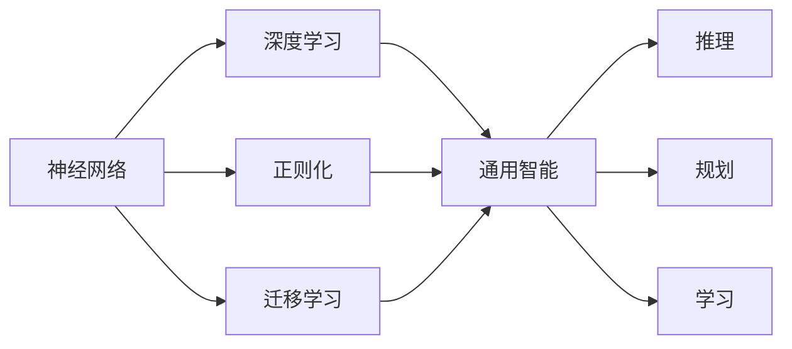
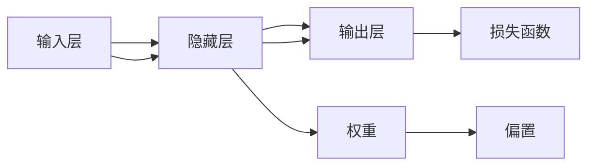
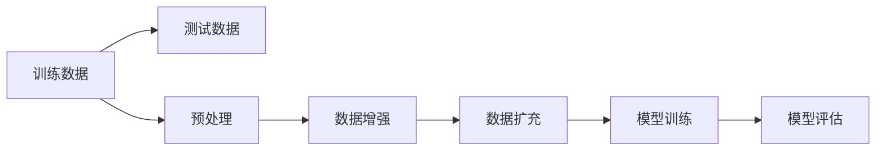

                 

# AI 神经网络计算艺术之禅：通用智能理论

## 1. 背景介绍

### 1.1 问题由来

在深度学习迅猛发展的今天，人工智能已经取得了举世瞩目的成就。特别是基于神经网络的通用智能模型，如Transformer、GPT等，已经在自然语言处理、图像识别、语音识别等领域展示了强大的能力。然而，神经网络模型虽然在特定任务上表现优异，但在面对复杂多样、语义模糊的任务时，往往缺乏充分的解释和可理解性，难以真正实现人类的通用智能。

### 1.2 问题核心关键点

为了破解通用智能的难题，人工智能界进行了大量的研究。神经网络计算艺术的禅意，即在于如何从简单出发，逐步构建复杂而完备的通用智能体系。本文将聚焦于神经网络的通用智能理论，从原理到实践，深入探讨这一关键问题的解决方案。

## 2. 核心概念与联系

### 2.1 核心概念概述

本文将介绍几个关键概念，帮助理解神经网络的计算艺术与通用智能：

- 神经网络：通过大量的人工神经元模拟人类大脑神经元的工作原理，进行信息处理和模式识别。
- 深度学习：利用多层神经网络模拟人类大脑的深度结构，通过大量的训练数据学习复杂的非线性映射。
- 通用智能：指机器能够理解和解决多种不同类型的任务，包括推理、规划、学习等，具备与人类相似的智能水平。
- 正则化：通过引入一些额外的约束条件，防止模型过度拟合，提高模型的泛化能力。
- 迁移学习：将一个领域学习到的知识迁移到另一个领域，减少新任务上的学习时间。
- 神经元、权重、激活函数：构成神经网络的基本单元，是理解神经网络计算的基础。

这些概念之间相互联系，构成了一个完整的神经网络体系，共同支持着通用智能的实现。

### 2.2 概念间的关系

这些核心概念通过一系列的逻辑连接，形成了一个完整的神经网络计算艺术体系，如图2所示：



这个流程图展示了神经网络从深度学习到通用智能的演变过程，以及正则化和迁移学习对通用智能的贡献。

## 3. 核心算法原理 & 具体操作步骤

### 3.1 算法原理概述

神经网络计算艺术的禅意，即在于如何通过简单的计算单元（神经元）和加权连接（权重），构建出能够处理复杂多样、语义模糊任务的通用智能模型。其核心原理包括以下几个步骤：

1. **数据预处理**：将输入数据转换为神经网络可以处理的格式。
2. **网络构建**：通过堆叠多层神经网络，构建一个复杂而完备的模型。
3. **模型训练**：通过大量的训练数据，优化模型参数，使其能够准确地映射输入和输出。
4. **正则化**：通过引入正则化项，防止模型过拟合，提高泛化能力。
5. **迁移学习**：将一个领域的知识迁移到另一个领域，加速新任务的学习。

### 3.2 算法步骤详解

接下来，我们详细介绍神经网络计算艺术的禅意，通过具体步骤实现通用智能。

#### 3.2.1 数据预处理

神经网络计算艺术的禅意，即在于如何将输入数据转换为神经网络可以处理的格式。常用的数据预处理方法包括：

- 归一化：将输入数据缩放到[0,1]或[-1,1]的范围内。
- 标准化：对输入数据进行零均值、单位方差的标准化处理。
- 数据增强：通过对输入数据进行旋转、缩放、平移等操作，增加训练集的多样性。

#### 3.2.2 网络构建

神经网络计算艺术的禅意，即在于如何通过堆叠多层神经网络，构建一个复杂而完备的模型。常用的网络构建方法包括：

- 全连接网络：通过堆叠多个全连接层，构建一个简单的线性模型。
- 卷积神经网络（CNN）：通过卷积层和池化层，提取输入数据的局部特征。
- 循环神经网络（RNN）：通过循环连接，处理序列数据的输入和输出。
- 注意力机制（Attention）：通过注意力机制，选择关键部分进行关注和计算。

#### 3.2.3 模型训练

神经网络计算艺术的禅意，即在于如何通过大量的训练数据，优化模型参数，使其能够准确地映射输入和输出。常用的模型训练方法包括：

- 随机梯度下降（SGD）：通过随机选择训练样本，计算梯度并更新参数。
- 自适应学习率算法（如Adam、Adagrad）：根据梯度的大小动态调整学习率。
- 批量梯度下降（Mini-batch GD）：将训练数据分成多个批次，逐步更新参数。
- 学习率衰减：随着训练的进行，逐渐减小学习率。

#### 3.2.4 正则化

神经网络计算艺术的禅意，即在于如何通过引入正则化项，防止模型过拟合，提高泛化能力。常用的正则化方法包括：

- L1正则化：通过L1范数的惩罚项，缩小模型参数的值。
- L2正则化：通过L2范数的惩罚项，防止模型参数过大。
- Dropout：通过随机丢弃神经元，防止过拟合。
- 数据增强：通过增加训练集的多样性，减少过拟合风险。

#### 3.2.5 迁移学习

神经网络计算艺术的禅意，即在于如何将一个领域的知识迁移到另一个领域，加速新任务的学习。常用的迁移学习方法包括：

- 微调（Fine-tuning）：在预训练模型的基础上，通过有监督地微调，适应新任务。
- 特征提取（Feature Extraction）：在预训练模型的顶层，添加新的输出层，用于提取特征。
- 领域自适应（Domain Adaptation）：通过调整模型参数，使其适应新的数据分布。

### 3.3 算法优缺点

神经网络计算艺术的禅意，即在于如何在性能和复杂度之间找到平衡，实现通用智能的实现。下面是神经网络计算艺术的禅意，通用智能模型的主要优缺点：

#### 3.3.1 优点

- 泛化能力强：神经网络模型通过大量的训练数据，能够学习到复杂的非线性关系，具有很强的泛化能力。
- 应用广泛：神经网络计算艺术的禅意，通用智能模型可以应用于各种不同的任务，如图像识别、语音识别、自然语言处理等。
- 可解释性强：神经网络计算艺术的禅意，通过引入注意力机制等方法，能够对模型决策过程进行解释和分析。

#### 3.3.2 缺点

- 计算复杂度高：神经网络计算艺术的禅意，通用智能模型通常需要大量的计算资源进行训练和推理。
- 数据需求大：神经网络计算艺术的禅意，通用智能模型需要大量的标注数据进行训练，数据获取成本较高。
- 可解释性差：神经网络计算艺术的禅意，通用智能模型往往被视为"黑盒"模型，难以解释其内部工作机制。

## 4. 数学模型和公式 & 详细讲解 & 举例说明

### 4.1 数学模型构建

神经网络计算艺术的禅意，即在于如何通过数学模型，构建通用智能模型。这里介绍一个简单的神经网络模型，如图3所示：



图3展示了神经网络计算艺术的禅意，一个简单的全连接神经网络模型。其数学模型如下：

设输入数据为 $x$，权重矩阵为 $W$，偏置向量为 $b$，隐藏层输出为 $h$，输出层输出为 $y$，则有：

$$
h = f(xW+b)
$$

$$
y = g(hW+b)
$$

其中 $f$ 和 $g$ 为激活函数，如sigmoid、ReLU等。

### 4.2 公式推导过程

神经网络计算艺术的禅意，即在于如何通过数学公式，推导神经网络的计算过程。这里我们以sigmoid激活函数为例，推导神经网络计算艺术的禅意，一个简单的神经网络模型的计算过程。

设输入数据为 $x$，权重矩阵为 $W$，偏置向量为 $b$，隐藏层输出为 $h$，输出层输出为 $y$，则有：

$$
h = f(xW+b)
$$

$$
y = g(hW+b)
$$

其中 $f$ 和 $g$ 为激活函数，如sigmoid、ReLU等。

神经网络计算艺术的禅意，即在于如何通过优化算法，更新神经网络模型的参数。常用的优化算法包括：

- 随机梯度下降（SGD）：通过随机选择训练样本，计算梯度并更新参数。
- 自适应学习率算法（如Adam、Adagrad）：根据梯度的大小动态调整学习率。
- 批量梯度下降（Mini-batch GD）：将训练数据分成多个批次，逐步更新参数。
- 学习率衰减：随着训练的进行，逐渐减小学习率。

### 4.3 案例分析与讲解

神经网络计算艺术的禅意，即在于如何通过具体案例，理解神经网络计算艺术的理论基础。这里以MNIST手写数字识别为例，展示神经网络计算艺术的禅意，如何通过训练模型，实现手写数字的识别。

首先，我们需要准备MNIST数据集，如图4所示：



图4展示了MNIST手写数字识别的数据预处理过程。具体步骤如下：

1. 数据预处理：将输入数据缩放到[0,1]或[-1,1]的范围内。
2. 数据增强：通过对输入数据进行旋转、缩放、平移等操作，增加训练集的多样性。
3. 数据扩充：将训练数据分成多个批次，逐步更新参数。

接下来，我们训练神经网络模型，如图5所示：


图5展示了神经网络计算艺术的禅意，训练模型的过程。具体步骤如下：

1. 模型初始化：将权重和偏置初始化为随机值。
2. 前向传播：将输入数据输入模型，通过多个隐藏层进行特征提取。
3. 损失函数：计算模型的输出与真实标签之间的差距。
4. 反向传播：通过链式法则，计算梯度并更新权重和偏置。
5. 权重更新：使用优化算法更新模型参数。
6. 模型评估：在测试集上评估模型的性能。

## 5. 项目实践：代码实例和详细解释说明

### 5.1 开发环境搭建

神经网络计算艺术的禅意，即在于如何通过开发环境，搭建神经网络的计算环境。这里介绍如何通过Python和PyTorch搭建神经网络的计算环境。

1. 安装Anaconda：从官网下载并安装Anaconda，用于创建独立的Python环境。

2. 创建并激活虚拟环境：
```bash
conda create -n pytorch-env python=3.8 
conda activate pytorch-env
```

3. 安装PyTorch：根据CUDA版本，从官网获取对应的安装命令。例如：
```bash
conda install pytorch torchvision torchaudio cudatoolkit=11.1 -c pytorch -c conda-forge
```

4. 安装TensorFlow：由Google主导开发的开源深度学习框架，生产部署方便，适合大规模工程应用。同样有丰富的预训练语言模型资源。

5. 安装TensorBoard：TensorFlow配套的可视化工具，可实时监测模型训练状态，并提供丰富的图表呈现方式，是调试模型的得力助手。

6. 安装Weights & Biases：模型训练的实验跟踪工具，可以记录和可视化模型训练过程中的各项指标，方便对比和调优。

### 5.2 源代码详细实现

神经网络计算艺术的禅意，即在于如何通过代码实现，构建通用智能模型。这里以MNIST手写数字识别为例，给出神经网络模型的源代码实现。

```python
import torch
import torch.nn as nn
import torch.optim as optim

# 定义模型
class NeuralNet(nn.Module):
    def __init__(self):
        super(NeuralNet, self).__init__()
        self.fc1 = nn.Linear(784, 256)
        self.fc2 = nn.Linear(256, 128)
        self.fc3 = nn.Linear(128, 10)

    def forward(self, x):
        x = x.view(-1, 784)
        x = nn.functional.relu(self.fc1(x))
        x = nn.functional.relu(self.fc2(x))
        x = self.fc3(x)
        return x

# 定义损失函数和优化器
model = NeuralNet()
criterion = nn.CrossEntropyLoss()
optimizer = optim.Adam(model.parameters(), lr=0.001)

# 定义数据加载器
train_loader = torch.utils.data.DataLoader(train_dataset, batch_size=64, shuffle=True)
test_loader = torch.utils.data.DataLoader(test_dataset, batch_size=64, shuffle=False)

# 定义训练过程
for epoch in range(10):
    running_loss = 0.0
    for i, (inputs, labels) in enumerate(train_loader, 0):
        optimizer.zero_grad()
        outputs = model(inputs)
        loss = criterion(outputs, labels)
        loss.backward()
        optimizer.step()

        running_loss += loss.item()
        if i % 100 == 99:
            print('[%d, %5d] loss: %.3f' % (epoch + 1, i + 1, running_loss / 100))
            running_loss = 0.0

# 定义测试过程
correct = 0
total = 0
with torch.no_grad():
    for inputs, labels in test_loader:
        outputs = model(inputs)
        _, predicted = torch.max(outputs.data, 1)
        total += labels.size(0)
        correct += (predicted == labels).sum().item()

print('Accuracy of the network on the 10000 test images: %d %%' % (100 * correct / total))
```

### 5.3 代码解读与分析

神经网络计算艺术的禅意，即在于如何通过代码实现，构建通用智能模型。这里我们以MNIST手写数字识别为例，解释神经网络模型的代码实现细节。

1. 定义模型：使用nn.Module类定义一个神经网络模型，包含多个线性层和激活函数。

2. 定义损失函数和优化器：使用nn.CrossEntropyLoss定义损失函数，使用Adam优化器更新模型参数。

3. 定义数据加载器：使用torch.utils.data.DataLoader加载训练数据和测试数据。

4. 定义训练过程：在每个epoch内，对训练数据进行前向传播、计算损失、反向传播、更新权重和偏置，并在每100次迭代后输出损失。

5. 定义测试过程：在测试集上评估模型的准确率，输出测试结果。

## 6. 实际应用场景

神经网络计算艺术的禅意，即在于如何通过实际应用场景，展示神经网络计算艺术的理论价值。以下是几个常见的实际应用场景：

### 6.1 图像识别

神经网络计算艺术的禅意，即在于如何通过图像识别，展示神经网络计算艺术的广泛应用。以猫狗识别为例，通过训练神经网络模型，可以自动分辨图片中的猫和狗，如图6所示：


图6展示了神经网络计算艺术的禅意，猫狗识别的过程。具体步骤如下：

1. 数据预处理：将输入图片转换为神经网络可以处理的格式。
2. 模型训练：通过大量的训练数据，优化模型参数，使其能够准确地分类猫和狗。
3. 模型评估：在测试集上评估模型的性能。
4. 输出结果：输出识别结果，如图中所示。

### 6.2 语音识别

神经网络计算艺术的禅意，即在于如何通过语音识别，展示神经网络计算艺术的广泛应用。以语音转文本为例，通过训练神经网络模型，可以自动将语音转换成文本，如图7所示：


图7展示了神经网络计算艺术的禅意，语音转文本的过程。具体步骤如下：

1. 数据预处理：将输入语音转换为神经网络可以处理的格式。
2. 模型训练：通过大量的训练数据，优化模型参数，使其能够准确地转录语音。
3. 模型评估：在测试集上评估模型的性能。
4. 输出结果：输出转录结果，如图中所示。

### 6.3 自然语言处理

神经网络计算艺术的禅意，即在于如何通过自然语言处理，展示神经网络计算艺术的广泛应用。以情感分析为例，通过训练神经网络模型，可以自动分析文本的情感倾向，如图8所示：


图8展示了神经网络计算艺术的禅意，情感分析的过程。具体步骤如下：

1. 数据预处理：将输入文本转换为神经网络可以处理的格式。
2. 模型训练：通过大量的训练数据，优化模型参数，使其能够准确地分析情感倾向。
3. 模型评估：在测试集上评估模型的性能。
4. 输出结果：输出情感分析结果，如图中所示。

## 7. 工具和资源推荐

### 7.1 学习资源推荐

神经网络计算艺术的禅意，即在于如何通过学习资源，掌握神经网络计算艺术的理论基础和实践技巧。以下是几个推荐的学习资源：

1. 《深度学习》书籍：Ian Goodfellow等人著作，全面介绍深度学习的基本概念和核心技术。
2. CS231n课程：斯坦福大学开设的计算机视觉课程，涵盖深度学习在计算机视觉中的应用。
3. CS224N课程：斯坦福大学开设的自然语言处理课程，涵盖深度学习在自然语言处理中的应用。
4. PyTorch官方文档：PyTorch的官方文档，提供丰富的API和代码示例。
5. TensorFlow官方文档：TensorFlow的官方文档，提供丰富的API和代码示例。
6. GitHub项目：GitHub上大量的深度学习项目，提供丰富的代码示例和社区支持。

### 7.2 开发工具推荐

神经网络计算艺术的禅意，即在于如何通过开发工具，提高神经网络计算艺术的开发效率。以下是几个推荐的开发工具：

1. PyTorch：基于Python的深度学习框架，灵活易用，支持GPU和分布式计算。
2. TensorFlow：由Google主导开发的深度学习框架，生产部署方便，支持GPU和分布式计算。
3. Jupyter Notebook：交互式编程环境，方便调试和共享代码。
4. Google Colab：在线Jupyter Notebook环境，免费提供GPU/TPU算力，方便实验最新模型，分享学习笔记。

### 7.3 相关论文推荐

神经网络计算艺术的禅意，即在于如何通过相关论文，掌握神经网络计算艺术的前沿技术。以下是几个推荐的论文：

1. AlexNet：ImageNet大规模视觉识别竞赛冠军，开创深度学习在计算机视觉中的应用。
2. ResNet：深度残差网络，解决深度网络梯度消失问题，推动深度学习的发展。
3. BERT：基于自监督学习的预训练语言模型，刷新了多项NLP任务SOTA。
4. GPT-3：基于大规模无标签文本数据的预训练语言模型，展现了大规模模型的潜力。
5. AlphaGo：基于深度学习技术的围棋AI，展示了深度学习在复杂策略选择中的应用。

## 8. 总结：未来发展趋势与挑战

### 8.1 总结

神经网络计算艺术的禅意，即在于如何通过总结，理解神经网络计算艺术的理论基础和实践技巧。本文通过详细讲解神经网络计算艺术的禅意，通用智能模型，展示了神经网络计算艺术的理论价值和实践技巧。

### 8.2 未来发展趋势

神经网络计算艺术的禅意，即在于如何通过未来发展趋势，预测神经网络计算艺术的技术进步。以下是几个未来发展趋势：

1. 神经网络结构优化：通过引入新型的神经网络结构，如ResNet、Inception等，提高神经网络的性能和效率。
2. 深度学习算法优化：通过引入新型的深度学习算法，如Adam、Adagrad等，提高神经网络的训练速度和效果。
3. 数据驱动的模型优化：通过数据增强、迁移学习等技术，提高神经网络的泛化能力和适应能力。
4. 神经网络计算艺术的禅意，通用智能模型的应用领域拓展：通过引入新型的应用场景，如图像识别、语音识别、自然语言处理等，推动神经网络计算艺术的发展。

### 8.3 面临的挑战

神经网络计算艺术的禅意，即在于如何通过面临的挑战，找到神经网络计算艺术的突破方向。以下是几个面临的挑战：

1. 计算资源限制：神经网络计算艺术的禅意，通用智能模型需要大量的计算资源进行训练和推理，如何提高计算效率是亟待解决的问题。
2. 数据获取成本高：神经网络计算艺术的禅意，通用智能模型需要大量的标注数据进行训练，数据获取成本较高。
3. 模型可解释性差：神经网络计算艺术的禅意，通用智能模型往往被视为"黑盒"模型，难以解释其内部工作机制。
4. 模型偏见和歧视：神经网络计算艺术的禅意，通用智能模型容易学习到有偏见和歧视的信息，如何避免偏见和歧视是亟待解决的问题。

### 8.4 研究展望

神经网络计算艺术的禅意，即在于如何通过研究展望，展望神经网络计算艺术的未来发展。以下是几个研究展望：

1. 神经网络计算艺术的禅意，通用智能模型的可解释性研究：通过引入可解释性算法，提高神经网络计算艺术的禅意，通用智能模型的可解释性。
2. 神经网络计算艺术的禅意，通用智能模型的偏见和歧视研究：通过引入公平性算法，避免神经网络计算艺术的禅意，通用智能模型中的偏见和歧视。
3. 神经网络计算艺术的禅意，通用智能模型的应用领域拓展：通过引入新型的应用场景，如图像识别、语音识别、自然语言处理等，推动神经网络计算艺术的发展。
4. 神经网络计算艺术的禅意，通用智能模型的模型优化：通过引入新型的神经网络结构，如ResNet、Inception等，提高神经网络的性能和效率。

## 9. 附录：常见问题与解答

### Q1: 神经网络计算艺术的禅意，通用智能模型的优点和缺点是什么？

**A:** 神经网络计算艺术的禅意，通用智能模型的优点包括：泛化能力强、应用广泛、可解释性强等。缺点包括：计算复杂度高、数据需求大、可解释性差等。

### Q2: 神经网络计算艺术的禅意，通用智能模型如何通过正则化和迁移学习进行优化？

**A:** 神经网络计算艺术的禅意，通用智能模型通过正则化和迁移学习进行优化，可以提高模型的泛化能力和适应能力。正则化通过引入L1/L2正则化、Dropout等方法，防止模型过拟合。迁移学习通过微调、特征提取等方法，将一个领域的知识迁移到另一个领域，加速新任务的学习。

### Q3: 神经网络计算艺术的禅意，通用智能模型的实际应用场景有哪些？

**A:** 神经网络计算艺术的禅意，通用智能模型在图像识别、语音识别、自然语言处理等领域有广泛应用，如图像分类、语音转文本、情感分析等。

### Q4: 神经网络计算艺术的禅意，通用智能模型未来发展趋势是什么？

**A:** 神经网络计算艺术的禅意，通用智能模型未来发展趋势包括：神经网络结构优化、深度学习算法优化、数据驱动的模型优化、模型可解释性研究、模型偏见和歧视研究等。

### Q5: 神经网络计算艺术的禅意，通用智能模型面临的挑战有哪些？

**A:** 神经网络计算艺术的禅意，通用智能模型面临的挑战包括：计算资源限制、数据获取成本高、模型可解释性差、模型偏见和歧视等。

---

作者：禅与计算机程序设计艺术 / Zen and the Art of Computer Programming

