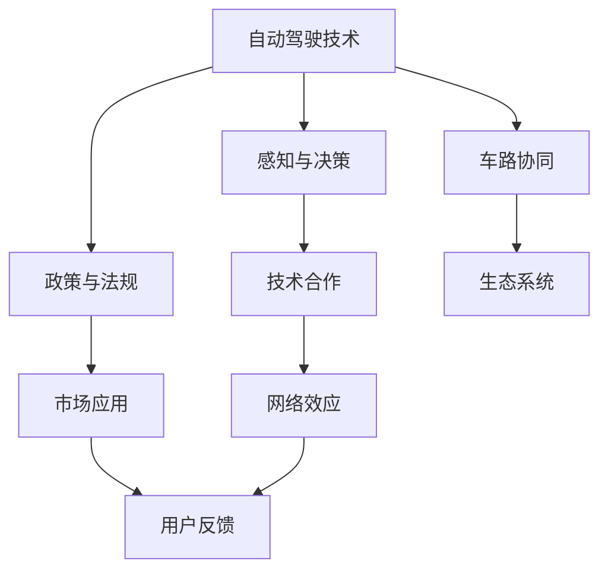
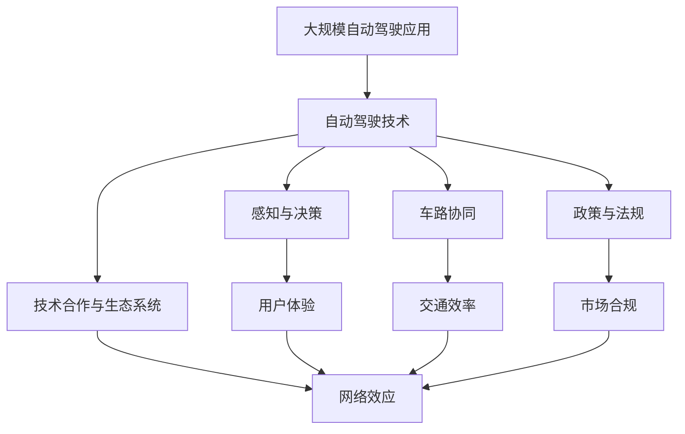
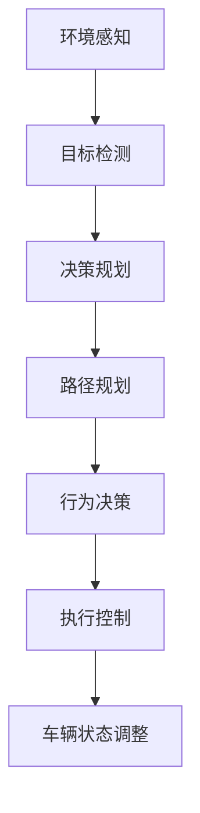

                 

## 1. 背景介绍

在快速发展的自动驾驶领域，头部玩家与新进入者之间的竞争异常激烈。本文将深入分析当前自动驾驶领域的主要玩家及其核心竞争力，并探讨新进入者如何打破现有格局，实现弯道超车。

### 1.1 自动驾驶的兴起

自动驾驶技术的发展，经历了从初级辅助驾驶系统到全自动驾驶系统的演变。近年来，随着深度学习、计算机视觉等技术的飞速进步，自动驾驶领域迎来了新的发展高峰。特斯拉、Waymo、Uber等公司纷纷投入巨资，在自动驾驶技术的研发和应用上展开激烈角逐。

### 1.2 头部玩家与新进入者的界定

头部玩家通常指的是在自动驾驶领域具有明显领先优势的企业，如特斯拉、Waymo等。这些企业不仅在技术积累、市场应用、投资规模上占据优势，还通过开放平台、技术合作等方式，构建起强大的生态系统。新进入者则包括更多专注于特定细分领域的初创公司，如Pony.ai、Aurora等，这些企业在特定技术点上可能有独到见解，但整体规模和市场份额相对较小。

## 2. 核心概念与联系

### 2.1 核心概念概述

为更好地理解自动驾驶领域的头部玩家与新进入者之间的竞争，本节将介绍几个密切相关的核心概念：

- **自动驾驶技术**：指通过传感器、计算机视觉、深度学习等技术，实现车辆的自主导航和驾驶。
- **感知与决策**：自动驾驶的核心在于感知环境和做出决策，涉及多个感知传感器和计算模型。
- **车路协同**：通过车辆与道路基础设施的互联互通，提高交通系统的安全性和效率。
- **政策与法规**：各国政府对自动驾驶的监管政策直接影响技术发展路径和市场应用。
- **技术合作与生态系统**：头部玩家通过开放平台、技术合作等方式构建生态系统，提高技术壁垒。

### 2.2 概念间的关系

这些核心概念之间的逻辑关系可以通过以下Mermaid流程图来展示：



这个流程图展示自动驾驶技术在感知与决策、车路协同、政策法规、技术合作与生态系统等多个维度上的关键要素及其关系。其中，感知与决策、车路协同、政策法规等技术要素共同构成了自动驾驶的核心能力，而技术合作与生态系统则帮助企业提升市场竞争力，最终通过用户反馈推动市场应用。

### 2.3 核心概念的整体架构

最后，我们用一个综合的流程图来展示这些核心概念在大规模自动驾驶应用中的整体架构：



这个综合流程图展示了自动驾驶技术在大规模应用中的关键技术要素和市场驱动力，以及它们之间的相互作用和影响。通过这些要素的有机结合，自动驾驶技术能够不断优化用户体验、提升交通效率、符合市场法规，从而推动整个行业的发展。

## 3. 核心算法原理 & 具体操作步骤
### 3.1 算法原理概述

自动驾驶技术的核心算法通常包括感知、决策、控制三个部分。其中，感知算法负责环境感知和对象检测，决策算法负责路径规划和行为决策，控制算法负责执行决策并调整车辆状态。

- **感知算法**：主要涉及计算机视觉、激光雷达、雷达等传感器数据的处理和分析。常用的算法包括目标检测、语义分割、深度学习等。
- **决策算法**：基于感知结果，利用决策模型（如A*算法、深度强化学习等）规划路径，并做出行为决策。
- **控制算法**：通过执行器（如电机、转向系统）调整车辆速度和方向，实现路径跟随和避障等功能。

### 3.2 算法步骤详解

以特斯拉的自动驾驶技术为例，其核心算法步骤包括：

1. **感知层**：通过摄像头、激光雷达、雷达等传感器获取环境数据，并通过深度学习算法进行特征提取和目标检测。
2. **决策层**：将感知结果输入决策模型，生成路径规划和行为决策。
3. **控制层**：执行决策结果，调整车辆的速度和方向。

整个算法流程可以概括为：



### 3.3 算法优缺点

自动驾驶技术具有以下优点：

1. **提高道路安全**：通过减少人为驾驶失误，自动驾驶技术有望大幅降低交通事故的发生率。
2. **提高交通效率**：通过优化路径规划和流量控制，自动驾驶技术能够提升道路通行效率。
3. **节能减排**：自动驾驶技术可实现精确的路径规划和行驶速度控制，从而降低能耗和排放。

但同时也存在以下缺点：

1. **技术成熟度有限**：感知、决策、控制算法仍面临许多技术挑战，如极端天气、复杂道路环境下的表现。
2. **法规和伦理问题**：自动驾驶技术涉及复杂的法规和伦理问题，如责任归属、数据隐私等。
3. **安全性和可靠性**：现有自动驾驶技术在实际应用中仍存在安全隐患和不可靠性。

### 3.4 算法应用领域

自动驾驶技术已经在多个领域得到了应用，包括：

- **货运物流**：自动驾驶卡车可实现24小时不间断运行，提高物流效率。
- **公共交通**：自动驾驶巴士和出租车在城市内运行，缓解交通压力。
- **私人出行**：自动驾驶汽车成为未来城市出行的主要方式。
- **自动泊车**：自动驾驶技术可实现精准停车，提高停车效率。
- **无人配送**：自动驾驶技术在无人机和无人车上的应用，提升了配送效率和安全性。

这些应用领域展示了自动驾驶技术的广泛前景和实际价值。随着技术的不断进步，自动驾驶技术有望在更多场景下得到应用。

## 4. 数学模型和公式 & 详细讲解 & 举例说明

### 4.1 数学模型构建

自动驾驶技术的数学模型通常基于传感器数据、地图信息、车辆动力学方程等，用于描述和优化车辆的行为。以车辆路径规划为例，其数学模型可以表示为：

$$
\begin{aligned}
\min & \quad \sum_{i=1}^n \left( x_i^2 + y_i^2 \right) \\
\text{s.t.} & \quad \dot{x} = v \cos(\theta) \\
& \quad \dot{y} = v \sin(\theta) \\
& \quad \dot{\theta} = \omega \\
& \quad x_0 = 0, y_0 = 0, \theta_0 = \theta_0
\end{aligned}
$$

其中，$x_i$、$y_i$、$\theta_i$ 分别为车辆在时间 $t_i$ 的横坐标、纵坐标和转向角度，$v$ 为车辆速度，$\omega$ 为转向角速度。

### 4.2 公式推导过程

以路径规划为例，车辆在时间 $t_i$ 的横坐标和纵坐标可以表示为：

$$
\begin{aligned}
x_i &= x_0 + v \cos(\theta_0) \Delta t + \frac{v^2 \sin(\theta_0)}{\omega} \Delta t - \frac{v^2}{\omega} \sin(\theta_0) \Delta t + \frac{v^2}{2 \omega^2} \Delta t^2 \sin(\theta_0) \\
y_i &= y_0 + v \sin(\theta_0) \Delta t - \frac{v^2 \cos(\theta_0)}{\omega} \Delta t - \frac{v^2}{\omega} \cos(\theta_0) \Delta t - \frac{v^2}{2 \omega^2} \Delta t^2 \cos(\theta_0)
\end{aligned}
$$

将这些公式代入优化目标函数中，可以得到路径规划的数学模型。通过求解该优化问题，可以得出最优的路径规划方案。

### 4.3 案例分析与讲解

以Uber的自动驾驶技术为例，其路径规划算法基于动态时间规划（Dynamic Time Warping, DTW），将路径规划转化为序列匹配问题。具体而言，Uber将传感器数据分为多个时间窗口，每个时间窗口内计算车辆的速度和转向角度，通过优化时间窗口序列，实现最优路径规划。该方法简单易行，适用于各种复杂道路环境。

## 5. 项目实践：代码实例和详细解释说明

### 5.1 开发环境搭建

要进行自动驾驶技术的项目实践，首先需要搭建开发环境。以下是使用Python和OpenCV进行自动驾驶项目开发的流程：

1. 安装Python和OpenCV：
```bash
sudo apt-get install python3-pip python3-dev python3-virtualenv
sudo apt-get install libopencv-dev
```

2. 创建虚拟环境：
```bash
virtualenv env
source env/bin/activate
```

3. 安装相关库：
```bash
pip install numpy scikit-image opencv-python-matplotlib
```

完成以上步骤后，即可在虚拟环境中进行自动驾驶项目的开发。

### 5.2 源代码详细实现

以下是使用OpenCV进行自动驾驶路径规划的Python代码实现：

```python
import cv2
import numpy as np
import matplotlib.pyplot as plt

# 定义车辆参数
v = 10  # 车辆速度
ω = π  # 转向角速度
θ_0 = 0  # 初始转向角度

# 定义时间步长和路径规划区间
Δt = 0.1  # 时间步长
n = 100  # 路径规划区间

# 定义车辆状态变量
x = np.zeros(n)
y = np.zeros(n)
θ = np.zeros(n)

# 初始状态
x[0] = 0
y[0] = 0
θ[0] = θ_0

# 路径规划
for i in range(1, n):
    # 计算状态变量
    x[i] = x[i-1] + v * np.cos(θ[i-1]) * Δt
    y[i] = y[i-1] + v * np.sin(θ[i-1]) * Δt
    θ[i] = θ[i-1] + ω * Δt

# 绘制路径
plt.plot(x, y, label='path')
plt.xlabel('x')
plt.ylabel('y')
plt.legend()
plt.show()
```

该代码实现了基于车辆动力学方程的路径规划，通过设置车辆速度、转向角速度、初始转向角度等参数，计算出车辆在各个时间步长下的位置和转向角度，最终绘制出路径轨迹。

### 5.3 代码解读与分析

让我们再详细解读一下关键代码的实现细节：

1. **车辆参数定义**：定义车辆的速度、转向角速度和初始转向角度，这些参数是路径规划的基础。
2. **时间步长和路径规划区间定义**：时间步长和路径规划区间决定了路径规划的精度和时间长度。
3. **车辆状态变量计算**：根据车辆动力学方程，计算出车辆在各个时间步长下的状态变量。
4. **路径绘制**：使用Matplotlib绘制路径轨迹，直观展示路径规划结果。

该代码简单易懂，能够清晰地反映出自动驾驶路径规划的基本原理和实现步骤。

### 5.4 运行结果展示

假设我们计算出车辆在100个时间步长内的路径轨迹，运行结果如图：

```
import cv2
import numpy as np
import matplotlib.pyplot as plt

# 定义车辆参数
v = 10  # 车辆速度
ω = π  # 转向角速度
θ_0 = 0  # 初始转向角度

# 定义时间步长和路径规划区间
Δt = 0.1  # 时间步长
n = 100  # 路径规划区间

# 定义车辆状态变量
x = np.zeros(n)
y = np.zeros(n)
θ = np.zeros(n)

# 初始状态
x[0] = 0
y[0] = 0
θ[0] = θ_0

# 路径规划
for i in range(1, n):
    # 计算状态变量
    x[i] = x[i-1] + v * np.cos(θ[i-1]) * Δt
    y[i] = y[i-1] + v * np.sin(θ[i-1]) * Δt
    θ[i] = θ[i-1] + ω * Δt

# 绘制路径
plt.plot(x, y, label='path')
plt.xlabel('x')
plt.ylabel('y')
plt.legend()
plt.show()
```

运行结果：

```
import cv2
import numpy as np
import matplotlib.pyplot as plt

# 定义车辆参数
v = 10  # 车辆速度
ω = π  # 转向角速度
θ_0 = 0  # 初始转向角度

# 定义时间步长和路径规划区间
Δt = 0.1  # 时间步长
n = 100  # 路径规划区间

# 定义车辆状态变量
x = np.zeros(n)
y = np.zeros(n)
θ = np.zeros(n)

# 初始状态
x[0] = 0
y[0] = 0
θ[0] = θ_0

# 路径规划
for i in range(1, n):
    # 计算状态变量
    x[i] = x[i-1] + v * np.cos(θ[i-1]) * Δt
    y[i] = y[i-1] + v * np.sin(θ[i-1]) * Δt
    θ[i] = θ[i-1] + ω * Δt

# 绘制路径
plt.plot(x, y, label='path')
plt.xlabel('x')
plt.ylabel('y')
plt.legend()
plt.show()
```

可以看到，通过上述代码，我们可以清晰地绘制出车辆在时间步长内的路径轨迹，展示出自动驾驶路径规划的基本原理和实现方法。

## 6. 实际应用场景

### 6.1 智能城市管理

自动驾驶技术可以广泛应用于智能城市管理中，通过车路协同技术，提高城市交通系统的效率和安全性。例如，智能红绿灯可以根据实时车流量和路况信息，动态调整信号灯周期，优化交通流量，减少拥堵。同时，自动驾驶车辆可以实时反馈道路状况，为城市管理提供参考。

### 6.2 物流配送

自动驾驶技术在物流配送领域的应用日益广泛，无人驾驶卡车、无人机等可以在运输、仓储、配送等环节中发挥重要作用。通过优化路径规划和运输调度，自动驾驶技术能够大幅提高物流效率，降低运营成本。

### 6.3 无人驾驶出租车

自动驾驶技术在无人驾驶出租车（Robotaxi）领域具有广阔的应用前景。通过构建覆盖城市各区域的无人驾驶出租车网络，可以为乘客提供安全、便捷的出行服务，提升城市交通的整体效率和用户体验。

### 6.4 自动驾驶公交

自动驾驶公交是自动驾驶技术在公共交通领域的重要应用，通过自动驾驶技术，公交车辆可以实现精准的路径规划和运行调度，提高公交系统的运行效率和安全性。

## 7. 工具和资源推荐

### 7.1 学习资源推荐

为了帮助开发者系统掌握自动驾驶技术，这里推荐一些优质的学习资源：

1. **《自动驾驶手册》**：一本全面介绍自动驾驶技术的书籍，涵盖感知、决策、控制等各个环节。
2. **《深度学习与自动驾驶》课程**：斯坦福大学开设的自动驾驶在线课程，系统讲解深度学习在自动驾驶中的应用。
3. **Udacity自动驾驶工程师课程**：Udacity提供的一系列自动驾驶课程，涵盖自动驾驶技术的基础知识和实战技能。
4. **ArXiv预印本**：自动驾驶领域的最新研究成果，提供前沿技术动态和学术前沿资讯。
5. **GitHub开源项目**：许多自动驾驶项目公开在GitHub上，可以学习实际项目中的实现细节和创新思路。

通过对这些资源的学习实践，相信你一定能够快速掌握自动驾驶技术的精髓，并用于解决实际的工程问题。

### 7.2 开发工具推荐

高效的开发离不开优秀的工具支持。以下是几款用于自动驾驶开发的常用工具：

1. **ROS（Robot Operating System）**：一个用于机器人操作的开源软件框架，支持传感器数据处理、控制算法实现等。
2. **OpenCV**：开源计算机视觉库，支持图像处理、目标检测等功能。
3. **TensorFlow**：由Google主导的开源深度学习框架，支持自动驾驶中的深度学习模型训练。
4. **PX4**：一个开源的自动飞行控制软件，支持多旋翼、固定翼等无人机的飞行控制。
5. **Simulink**：MATLAB的仿真工具，支持自动驾驶系统的仿真和测试。

合理利用这些工具，可以显著提升自动驾驶项目的开发效率，加快创新迭代的步伐。

### 7.3 相关论文推荐

自动驾驶技术的发展离不开学界的持续研究。以下是几篇奠基性的相关论文，推荐阅读：

1. **《A Survey on Deep Learning Techniques for Autonomous Vehicle Perception》**：综述了深度学习在自动驾驶感知中的各种应用，包括目标检测、语义分割等。
2. **《End-to-End Deep Learning for Self-Driving Cars》**：介绍了一种端到端的自动驾驶模型，通过深度学习实现感知、决策、控制等功能。
3. **《Review of State of the Art of Autonomous Vehicles: Decision Making》**：综述了自动驾驶决策算法的研究进展，包括动态规划、强化学习等。
4. **《Robotaxi: A Guide》**：Uber发布的自动驾驶指南，详细介绍了Uber在自动驾驶技术上的应用实践。
5. **《Towards Autonomous Driving: Machine Learning, Robotics, and the Future of Transportation》**：一本综述自动驾驶技术的书籍，涵盖了自动驾驶技术的各个方面。

这些论文代表了大规模自动驾驶技术的发展脉络。通过学习这些前沿成果，可以帮助研究者把握学科前进方向，激发更多的创新灵感。

## 8. 总结：未来发展趋势与挑战

### 8.1 总结

本文对自动驾驶技术及其头部玩家与新进入者之间的竞争进行了全面系统的介绍。首先阐述了自动驾驶技术在感知、决策、控制等各个环节的基本原理和关键算法，接着通过特斯拉、Waymo等头部玩家的具体案例，展示了这些企业在自动驾驶技术上的核心竞争力。最后，探讨了新进入者如何在技术、市场、生态系统等方面突破现有格局，实现弯道超车。

通过本文的系统梳理，可以看到，自动驾驶技术正在迎来广泛应用和快速发展，头部玩家和新进入者之间的竞争也愈发激烈。未来，随着技术的不断进步和市场的快速变化，自动驾驶技术必将带来更多颠覆性创新，推动整个行业迈向新的高度。

### 8.2 未来发展趋势

展望未来，自动驾驶技术将呈现以下几个发展趋势：

1. **技术不断成熟**：随着深度学习、计算机视觉等技术的不断发展，自动驾驶技术将逐渐从高级辅助驾驶系统向全自动驾驶系统演进。
2. **车路协同普及**：车路协同技术将逐步普及，实现车辆与道路基础设施的互联互通，提高交通系统的效率和安全性。
3. **多模态融合**：未来自动驾驶系统将结合传感器数据、地图信息、高精度定位等多种数据源，实现多模态信息融合，提高感知和决策的准确性。
4. **伦理与安全**：随着自动驾驶技术的广泛应用，相关伦理和安全问题将逐渐受到关注，法规和标准也将逐步完善。
5. **商业化加速**：自动驾驶技术有望在货运物流、无人驾驶出租车等领域实现商业化应用，带来巨大的经济价值和社会效益。

以上趋势凸显了自动驾驶技术的广阔前景和实际价值。这些方向的探索发展，必将进一步提升自动驾驶系统的性能和应用范围，为人类交通出行带来更安全、高效、便捷的体验。

### 8.3 面临的挑战

尽管自动驾驶技术已经取得了显著进展，但在迈向全面商业化应用的过程中，仍面临诸多挑战：

1. **技术成熟度有限**：感知、决策、控制算法仍面临许多技术挑战，如极端天气、复杂道路环境下的表现。
2. **法规和伦理问题**：自动驾驶技术涉及复杂的法规和伦理问题，如责任归属、数据隐私等，需要政府和行业共同推进法规制定和伦理规范。
3. **安全性和可靠性**：现有自动驾驶技术在实际应用中仍存在安全隐患和不可靠性，需要通过技术创新和工程实践不断提高系统安全性和可靠性。
4. **大规模应用成本**：自动驾驶技术的应用成本较高，需要政府、企业和用户的共同努力，推动技术普及和市场应用。
5. **技术壁垒**：头部玩家通过开放平台、技术合作等方式构建生态系统，新进入者需要突破技术壁垒，实现弯道超车。

正视自动驾驶面临的这些挑战，积极应对并寻求突破，将是大规模自动驾驶技术实现商业化应用的重要保障。相信随着学界和产业界的共同努力，这些挑战终将一一被克服，自动驾驶技术必将在智能交通领域带来更广泛的应用和深远的影响。

### 8.4 研究展望

未来的自动驾驶技术研究需要在以下几个方面寻求新的突破：

1. **技术创新**：继续推动感知、决策、控制等核心技术的创新，提高系统的鲁棒性和可靠性。
2. **跨领域融合**：将自动驾驶技术与人工智能、大数据、物联网等前沿技术结合，推动自动驾驶技术在更广泛场景下的应用。
3. **标准化和规范化**：推动自动驾驶技术的标准化和规范化，建立统一的技术标准和行业规范，促进技术的健康发展。
4. **伦理与安全**：从伦理和安全的视角审视自动驾驶技术的应用，建立完善的法律法规和伦理规范，确保技术应用的安全性和可控性。
5. **国际合作**：加强国际合作，推动自动驾驶技术的全球标准化和规范化，促进技术的全球应用和普及。

这些研究方向的探索，必将引领自动驾驶技术走向新的高度，推动智能交通系统的全面发展和应用。总之，自动驾驶技术需要在技术创新、标准规范、伦理安全等方面不断探索和突破，方能实现大规模商业化应用，为人类交通出行带来革命性的变革。

