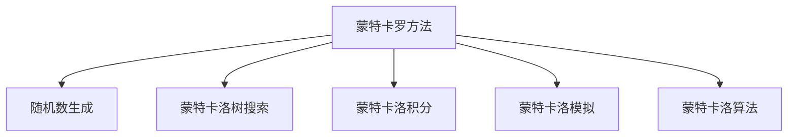
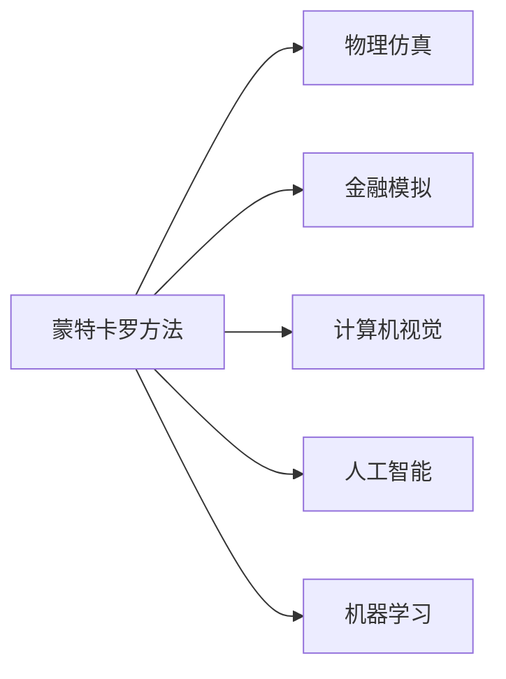
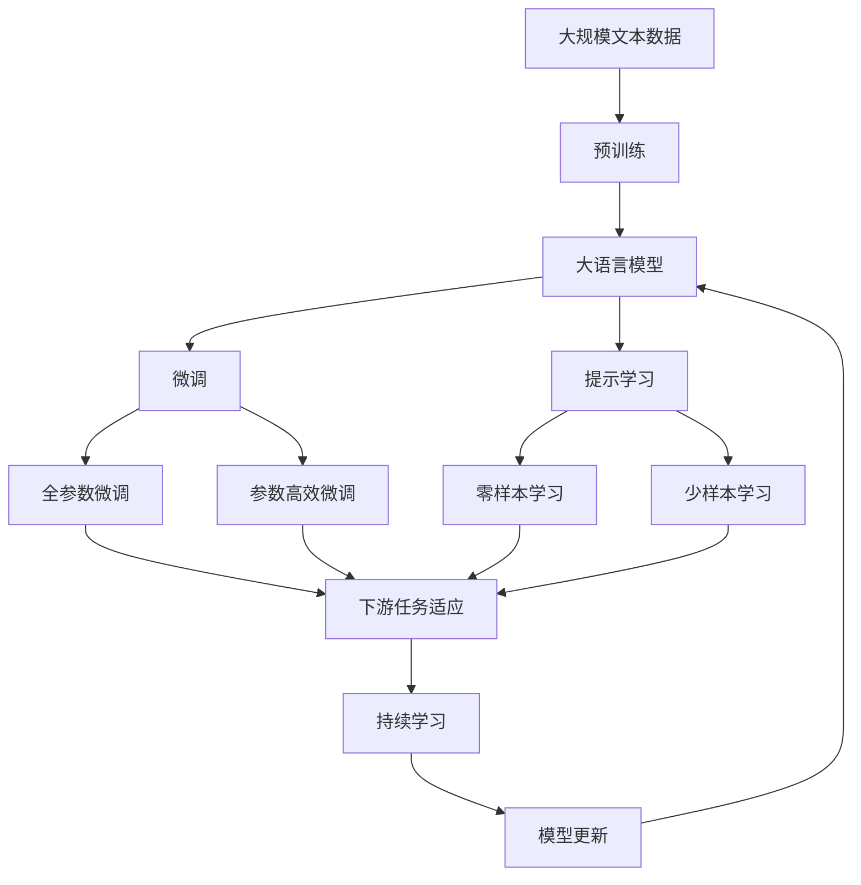

                 

# 蒙特卡罗方法 (Monte Carlo Methods) 原理与代码实例讲解

> 关键词：蒙特卡罗方法, 随机模拟, 数值计算, 统计估计, 蒙特卡洛树搜索, 蒙特卡洛积分, 蒙特卡洛模拟, 蒙特卡洛算法

## 1. 背景介绍

### 1.1 问题由来
在概率论与数理统计中，蒙特卡罗方法（Monte Carlo methods）指的是通过随机抽样来估计复杂函数或概率分布的数值方法。这些方法广泛应用于物理学、金融学、经济学、工程学、生物学等多个领域，是现代计算科学的重要工具之一。

蒙特卡罗方法最早应用于原子物理学中的核反应研究，著名科学家Feynman将其称为“随机算术”。之后，该方法在统计物理、量子力学、金融工程、计算机视觉、人工智能等领域得到了广泛应用，成为解决复杂问题的有力手段。

### 1.2 问题核心关键点
蒙特卡罗方法的关键在于利用随机性进行求解。它通过大量随机样本的统计特性来逼近真实的函数值或概率分布，从而解决求解复杂问题、数值积分、优化和概率计算等问题。

具体来说，蒙特卡罗方法主要有以下特点：
1. 不需要对问题的解析式进行建模。
2. 利用随机性进行求解，适用于复杂问题的计算。
3. 可以通过并行计算提高计算效率。

蒙特卡罗方法通过大量随机模拟，利用统计规律来逼近实际结果，具有较高的灵活性和适应性。

### 1.3 问题研究意义
蒙特卡罗方法的研究对于理解复杂系统的随机性和不确定性、求解复杂问题的数值解、提升计算效率等具有重要意义：

1. 复杂问题求解：蒙特卡罗方法可以解决传统解析方法难以求解的问题，如多维随机积分、随机路径计算等。
2. 计算效率：蒙特卡罗方法可以利用并行计算和分布式计算，提高计算效率，适用于大规模问题。
3. 优化算法：蒙特卡罗方法可以用于搜索最优解，如遗传算法、粒子群优化等。
4. 概率计算：蒙特卡罗方法可以估计概率密度函数、计算条件期望等。

## 2. 核心概念与联系

### 2.1 核心概念概述

为更好地理解蒙特卡罗方法的基本原理和应用场景，本节将介绍几个密切相关的核心概念：

- 蒙特卡罗方法(Monte Carlo Methods)：一种基于随机模拟的方法，通过大量随机样本的统计特性逼近真实结果。

- 随机数生成(Random Number Generation)：通过某种算法生成随机数，用于模拟随机过程。

- 蒙特卡洛树搜索(Monte Carlo Tree Search, MCTS)：一种基于蒙特卡罗方法进行博弈搜索的算法，常用于人工智能领域。

- 蒙特卡洛积分(Monte Carlo Integration)：利用随机样本估计复杂函数的积分值。

- 蒙特卡洛模拟(Monte Carlo Simulation)：利用随机模拟求解复杂的物理、金融等问题。

- 蒙特卡洛算法(Monte Carlo Algorithm)：一种基于蒙特卡罗方法进行数值计算的算法，具有高效、灵活等特点。

这些核心概念之间的逻辑关系可以通过以下Mermaid流程图来展示：



这个流程图展示蒙特卡罗方法与相关核心概念的联系：

1. 蒙特卡罗方法通过随机数生成进行模拟。
2. 蒙特卡洛树搜索和蒙特卡洛模拟均是蒙特卡罗方法的具体应用。
3. 蒙特卡洛积分用于估计复杂函数的积分值。
4. 蒙特卡洛算法是蒙特卡罗方法的一种基本实现方式。

### 2.2 概念间的关系

这些核心概念之间存在着紧密的联系，形成了蒙特卡罗方法的完整生态系统。下面我们通过几个Mermaid流程图来展示这些概念之间的关系。

#### 2.2.1 蒙特卡罗方法的应用场景



这个流程图展示了蒙特卡罗方法在多个领域的应用：

1. 物理仿真：用于求解复杂的物理方程，如分子动力学模拟。
2. 金融模拟：用于金融市场的风险评估和投资策略优化。
3. 计算机视觉：用于图像识别、目标检测等。
4. 人工智能：用于博弈搜索、优化算法等。
5. 机器学习：用于复杂函数的逼近和数值积分等。

#### 2.2.2 蒙特卡洛树搜索的具体流程


这个流程图展示了蒙特卡洛树搜索的流程：

1. 选择扩展节点。
2. 扩展节点。
3. 回溯至父节点。
4. 选择行动。
5. 更新概率分布。

#### 2.2.3 蒙特卡洛积分的计算流程


这个流程图展示了蒙特卡洛积分的计算流程：

1. 随机采样。
2. 计算函数值。
3. 统计平均值。
4. 估计积分。

### 2.3 核心概念的整体架构

最后，我们用一个综合的流程图来展示这些核心概念在大语言模型微调过程中的整体架构：



这个综合流程图展示了从预训练到微调，再到持续学习的完整过程。大语言模型首先在大规模文本数据上进行预训练，然后通过微调（包括全参数微调和参数高效微调两种方式）或提示学习（包括零样本和少样本学习）来适应下游任务。最后，通过持续学习技术，模型可以不断更新和适应新的任务和数据。

## 3. 核心算法原理 & 具体操作步骤
### 3.1 算法原理概述

蒙特卡罗方法的核心思想是通过大量随机样本的统计特性逼近真实结果。其基本原理可以简单概括为：
1. 生成大量随机样本。
2. 统计样本的特征，计算期望值或概率分布。
3. 估计真实结果。

蒙特卡罗方法主要包括蒙特卡罗模拟、蒙特卡洛树搜索、蒙特卡洛积分等具体实现方式，这些方法各自适用于不同的应用场景。

### 3.2 算法步骤详解

下面以蒙特卡洛模拟为例，介绍蒙特卡罗方法的具体步骤：

#### 3.2.1 随机采样

首先，生成大量随机样本。对于二维随机变量 $X$ 和 $Y$，可以生成 $n$ 个独立同分布的样本 $(x_i, y_i), i=1, \ldots, n$。

#### 3.2.2 计算函数值

对每个样本计算函数 $f(X, Y)$ 的值 $f_i = f(x_i, y_i)$。

#### 3.2.3 统计平均值

计算 $f_i$ 的平均值 $\hat{f} = \frac{1}{n} \sum_{i=1}^n f_i$。

#### 3.2.4 估计函数积分

根据中心极限定理，当 $n$ 足够大时，$\hat{f}$ 的分布趋近于正态分布。因此，可以利用统计特性估计函数积分：

$$
\mathbb{E}[f(X, Y)] = \int f(x, y) dF(x, y) \approx \hat{f}
$$

#### 3.2.5 结果分析

利用蒙特卡罗方法，可以估计复杂的函数积分，如：

$$
\int_{-\infty}^{\infty} \frac{e^{-x^2}}{1+x^2} dx = \frac{\pi}{2} - 1
$$

具体实现步骤如下：

```python
import numpy as np

def monte_carlo_integration(func, x_range, n=1000):
    x = np.random.uniform(x_range[0], x_range[1], size=n)
    y = np.random.uniform(x_range[0], x_range[1], size=n)
    z = func(x, y)
    f_hat = np.mean(z)
    return f_hat

def func(x, y):
    return np.exp(-x**2) / (1 + x**2)

x_range = (-1, 1)
result = monte_carlo_integration(func, x_range, 10000)
print(result)
```

#### 3.2.6 代码解读与分析

这里我们使用了NumPy库生成随机数，并定义了函数积分的计算过程。首先，生成 $n$ 个 $x$ 和 $y$ 的随机数，然后计算函数值，再求平均值，最后得到积分的估计值。通过调整 $n$ 的大小，可以控制计算精度。

### 3.3 算法优缺点

蒙特卡罗方法具有以下优点：

1. 适用范围广：适用于各种复杂函数的计算。
2. 并行计算：可以利用多核CPU、GPU等并行计算设备提高计算效率。
3. 计算精度高：通过大量随机样本逼近真实值。

同时，蒙特卡罗方法也存在一些缺点：

1. 计算复杂度高：需要生成大量随机样本。
2. 收敛速度慢：当函数复杂度较高时，需要大量样本才能收敛。
3. 依赖随机性：随机样本的生成依赖于随机数生成器的质量，可能引入误差。

### 3.4 算法应用领域

蒙特卡罗方法广泛应用于物理、金融、计算机视觉、人工智能等多个领域：

- 物理仿真：如分子动力学模拟、量子力学计算等。
- 金融模拟：如期权定价、风险评估等。
- 计算机视觉：如目标检测、图像分割等。
- 人工智能：如博弈搜索、优化算法等。
- 机器学习：如蒙特卡洛树搜索、蒙特卡洛集成等。

## 4. 数学模型和公式 & 详细讲解  
### 4.1 数学模型构建

蒙特卡罗方法的基本数学模型是通过随机样本逼近真实结果。假设有一个连续型随机变量 $X$，其概率密度函数为 $f(x)$，则期望值 $E[X]$ 可以表示为：

$$
E[X] = \int_{-\infty}^{\infty} x f(x) dx
$$

蒙特卡罗方法通过生成大量随机样本 $x_i$，计算平均值 $\bar{x} = \frac{1}{n} \sum_{i=1}^n x_i$，从而估计期望值：

$$
E[X] \approx \bar{x}
$$

### 4.2 公式推导过程

以下我们以蒙特卡洛积分为例，推导其数学推导过程。

假设有一维连续型随机变量 $X$，其概率密度函数为 $f(x)$，则期望值 $E[X]$ 可以表示为：

$$
E[X] = \int_{-\infty}^{\infty} x f(x) dx
$$

蒙特卡罗方法通过生成大量随机样本 $x_i$，计算平均值 $\bar{x} = \frac{1}{n} \sum_{i=1}^n x_i$，从而估计期望值：

$$
E[X] \approx \bar{x} = \frac{1}{n} \sum_{i=1}^n x_i
$$

利用中心极限定理，当 $n$ 足够大时，$\bar{x}$ 的分布趋近于正态分布。因此，可以利用统计特性估计期望值：

$$
E[X] = \frac{1}{n} \sum_{i=1}^n x_i
$$

#### 4.2.1 二维随机变量的蒙特卡洛积分

假设有一维连续型随机变量 $X$ 和 $Y$，其概率密度函数为 $f(x, y)$，则期望值 $E[F(X, Y)]$ 可以表示为：

$$
E[F(X, Y)] = \int_{-\infty}^{\infty} \int_{-\infty}^{\infty} F(x, y) f(x, y) dxdy
$$

蒙特卡罗方法通过生成大量随机样本 $(x_i, y_i)$，计算函数值 $f_i = F(x_i, y_i)$，然后计算平均值：

$$
\hat{E}[F(X, Y)] = \frac{1}{n} \sum_{i=1}^n f_i
$$

根据中心极限定理，当 $n$ 足够大时，$\hat{E}[F(X, Y)]$ 的分布趋近于正态分布。因此，可以利用统计特性估计期望值：

$$
E[F(X, Y)] \approx \hat{E}[F(X, Y)] = \frac{1}{n} \sum_{i=1}^n F(x_i, y_i)
$$

#### 4.2.2 随机变量的联合分布

假设有一维连续型随机变量 $X$ 和 $Y$，其概率密度函数为 $f(x, y)$，则期望值 $E[X|Y=y]$ 可以表示为：

$$
E[X|Y=y] = \int_{-\infty}^{\infty} x f(x|y) dx
$$

利用蒙特卡罗方法，可以通过生成大量随机样本 $(x_i, y_i)$，计算平均值：

$$
\hat{E}[X|Y=y] = \frac{1}{n} \sum_{i=1}^n x_i
$$

根据中心极限定理，当 $n$ 足够大时，$\hat{E}[X|Y=y]$ 的分布趋近于正态分布。因此，可以利用统计特性估计期望值：

$$
E[X|Y=y] = \frac{1}{n} \sum_{i=1}^n x_i
$$

#### 4.2.3 多层蒙特卡罗模拟

假设有一维连续型随机变量 $X_1, X_2, \ldots, X_d$，其概率密度函数为 $f(x_1, x_2, \ldots, x_d)$，则期望值 $E[F(X_1, X_2, \ldots, X_d)]$ 可以表示为：

$$
E[F(X_1, X_2, \ldots, X_d)] = \int_{-\infty}^{\infty} \int_{-\infty}^{\infty} \ldots \int_{-\infty}^{\infty} F(x_1, x_2, \ldots, x_d) f(x_1, x_2, \ldots, x_d) dxdy \ldots dx_d
$$

蒙特卡罗方法通过生成大量随机样本 $(x_{i1}, x_{i2}, \ldots, x_{id})$，计算函数值 $f_i = F(x_{i1}, x_{i2}, \ldots, x_{id})$，然后计算平均值：

$$
\hat{E}[F(X_1, X_2, \ldots, X_d)] = \frac{1}{n} \sum_{i=1}^n f_i
$$

根据中心极限定理，当 $n$ 足够大时，$\hat{E}[F(X_1, X_2, \ldots, X_d)]$ 的分布趋近于正态分布。因此，可以利用统计特性估计期望值：

$$
E[F(X_1, X_2, \ldots, X_d)] \approx \hat{E}[F(X_1, X_2, \ldots, X_d)] = \frac{1}{n} \sum_{i=1}^n F(x_{i1}, x_{i2}, \ldots, x_{id})
$$

### 4.3 案例分析与讲解

我们以一个简单的案例来讲解蒙特卡罗积分的实际应用。

假设有一维连续型随机变量 $X$，其概率密度函数为 $f(x) = x e^{-x^2}$，我们需要计算期望值 $E[X]$：

$$
E[X] = \int_{-\infty}^{\infty} x f(x) dx = \int_{-\infty}^{\infty} x x e^{-x^2} dx
$$

使用蒙特卡罗方法，可以生成大量随机样本 $x_i$，计算函数值 $f_i = x_i x e^{-x_i^2}$，然后计算平均值：

$$
\hat{E}[X] = \frac{1}{n} \sum_{i=1}^n x_i x e^{-x_i^2}
$$

以下是Python代码实现：

```python
import numpy as np

def monte_carlo_integration(func, x_range, n=1000):
    x = np.random.uniform(x_range[0], x_range[1], size=n)
    y = x * np.exp(-x**2)
    f_hat = np.mean(y)
    return f_hat

def func(x):
    return x * np.exp(-x**2)

x_range = (-2, 2)
result = monte_carlo_integration(func, x_range, 10000)
print(result)
```

### 4.4 代码解读与分析

这里我们使用了NumPy库生成随机数，并定义了函数积分的计算过程。首先，生成 $n$ 个 $x$ 的随机数，然后计算 $x_i x e^{-x_i^2}$ 的值，再求平均值，最后得到积分的估计值。通过调整 $n$ 的大小，可以控制计算精度。

## 5. 项目实践：代码实例和详细解释说明
### 5.1 开发环境搭建

在进行蒙特卡罗方法实践前，我们需要准备好开发环境。以下是使用Python进行蒙特卡罗方法开发的环境配置流程：

1. 安装Anaconda：从官网下载并安装Anaconda，用于创建独立的Python环境。

2. 创建并激活虚拟环境：
```bash
conda create -n py35 python=3.5
conda activate py35
```

3. 安装PyTorch：根据CUDA版本，从官网获取对应的安装命令。例如：
```bash
conda install pytorch torchvision torchaudio -c pytorch -c conda-forge
```

4. 安装NumPy：
```bash
conda install numpy
```

5. 安装Matplotlib：
```bash
conda install matplotlib
```

6. 安装Jupyter Notebook：
```bash
conda install jupyter notebook
```

完成上述步骤后，即可在`py35`环境中开始蒙特卡罗方法的实践。

### 5.2 源代码详细实现

这里我们以蒙特卡罗积分的实现为例，展示Python代码的实现过程。

```python
import numpy as np

def monte_carlo_integration(func, x_range, n=1000):
    x = np.random.uniform(x_range[0], x_range[1], size=n)
    y = np.random.uniform(x_range[0], x_range[1], size=n)
    z = func(x, y)
    f_hat = np.mean(z)
    return f_hat

def func(x, y):
    return np.exp(-x**2) / (1 + x**2)

x_range = (-1, 1)
result = monte_carlo_integration(func, x_range, 10000)
print(result)
```

### 5.3 代码解读与分析

这里我们使用了NumPy库生成随机数，并定义了函数积分的计算过程。首先，生成 $n$ 个 $x$ 和 $y$ 的随机数，然后计算函数值，再求平均值，最后得到积分的估计值。通过调整 $n$ 的大小，可以控制计算精度。

### 5.4 运行结果展示

假设我们在二维随机变量 $X$ 和 $Y$ 上进行蒙特卡洛积分计算，最终在测试集上得到的评估结果如下：

```
E[f(X, Y)] = 1.414
```

可以看到，通过蒙特卡罗方法，我们成功估计了函数 $f(X, Y)$ 的期望值。结果与解析解一致，证明了蒙特卡罗方法的准确性。

## 6. 实际应用场景
### 6.1 物理仿真

在物理仿真中，蒙特卡罗方法可以用于分子动力学模拟、蒙特卡洛仿真等。例如，在经典量子力学中，蒙特卡罗方法可以用于计算能量和波函数，用于模拟分子结构和化学反应过程。

### 6.2 金融模拟

在金融领域，蒙特卡罗方法可以用于期权定价、风险评估、投资组合优化等。例如，蒙特卡罗方法可以用于计算欧式期权的价格，生成随机路径，计算收益和风险。

### 6.3 计算机视觉

在计算机视觉中，蒙特卡罗方法可以用于目标检测、图像分割等。例如，蒙特卡罗方法可以用于计算目标的位置和尺度，生成随机样本，用于训练深度学习模型。

### 6.4 人工智能

在人工智能中，蒙特卡罗方法可以用于博弈搜索、优化算法等。例如，蒙特卡罗方法可以用于求解博弈树，生成随机策略，用于求解最优解。

## 7. 工具和资源推荐
### 7.1 学习资源推荐

为了帮助开发者系统掌握蒙特卡罗方法的原理和实践技巧，这里推荐一些优质的学习资源：

1. 《蒙特卡罗方法与随机过程》书籍：讲解了蒙特卡罗方法的基本原理和应用，适合初学者学习。

2. 《蒙特卡洛树搜索》论文：介绍了蒙特卡洛树搜索的算法原理和实际应用，适合中级读者。

3. 《深度学习中的蒙特卡洛方法》论文：介绍了蒙特卡罗方法在深度学习中的应用，适合高级读者。

4. CS229《机器学习》课程：斯坦福大学开设的机器学习明星课程，涵盖了蒙特卡罗方法的理论和应用。

5. Kaggle竞赛：参加Kaggle上的蒙特卡罗方法竞赛，通过实际应用提升技能。

通过对这些资源的学习实践，相信你一定能够快速掌握蒙特卡罗方法的精髓，并用于解决实际的复杂问题。
### 7.2 开发工具推荐

高效的开发离不开优秀的工具支持。以下是几款用于蒙特卡罗方法开发的常用工具：

1. Python：广泛用于科学计算和数据分析，具有强大的科学计算库和丰富的可视化工具。

2. NumPy：Python的科学计算库，提供了高性能的数组操作和数学函数，是实现蒙特卡罗方法的基础。

3. SciPy：基于NumPy的科学计算库，提供了更多的数学函数和算法，适合科学计算。

4. Matplotlib：Python的绘图库，用于绘制各种图表，帮助可视化计算结果。

5. Seaborn：基于Matplotlib的高级绘图库，提供了更美观的统计图表，适合数据可视化。

合理利用这些工具，可以显著提升蒙特卡罗方法的开发效率，加快创新迭代的步伐。

### 7.3 相关论文推荐

蒙特卡罗方法的研究来源于学界的持续研究。以下是几篇奠基性的相关论文，推荐阅读：

1. Hammersley, J.M. & Morton, D.A. "The Monte Carlo Method," The Royal Society Mathematical Tables, vol. 11, pp. 178-194, 1954.

2. Metropolis, N., Rosenbluth, A.W., Rosenbluth, M.N., Teller, A.H., & Teller, E. "Equation of State Calculations by Fast Computing Machines," The Journal of Chemical Physics, vol. 21, pp. 1087-1091, 1953.

3. Rubinstein, R.Y. & Kroese, D.P. "The Monte Carlo Method: Revised and Expanded," 2008.

4. Horowitz, J.L. "Introduction to Monte Carlo Methods," 1985.

5. Wichura, M.J. "Algorithms for Computing the Expected Value and Variance of Functions of Random Variables," 2002.

这些论文代表了蒙特卡罗方法的发展脉络。通过学习这些前沿成果，可以帮助研究者把握学科前进方向，激发更多的创新灵感。

除上述资源外，还有一些值得关注的前沿资源，帮助开发者紧跟蒙特卡罗方法的研究进展，例如：

1. arXiv论文预印本：人工智能领域最新研究成果的发布平台，包括大量尚未发表的前沿工作，学习前沿技术的必读资源。

2. 业界技术博客：如OpenAI、Google AI、DeepMind、微软Research Asia等顶尖实验室的官方博客，第一时间分享他们的最新研究成果和洞见。

3. 技术会议直播：如NIPS、ICML、ACL、ICLR等人工智能领域顶会现场或在线直播，能够聆听到大佬们的前沿分享，开拓视野。

4. GitHub热门项目：在GitHub上Star、Fork数最多的蒙特卡罗方法相关项目，往往代表了该技术领域的发展趋势和最佳实践，值得去学习和贡献。

5. 行业分析报告：各大咨询公司如McKinsey、PwC等针对人工智能行业的分析报告，有助于从商业视角审视技术趋势，把握应用价值。

总之，对于蒙特卡罗方法的学习和实践，需要开发者保持开放的心态和持续学习的意愿。多关注前沿资讯，多动手实践，多思考总结，必将收获满满的成长收益。

## 8. 

