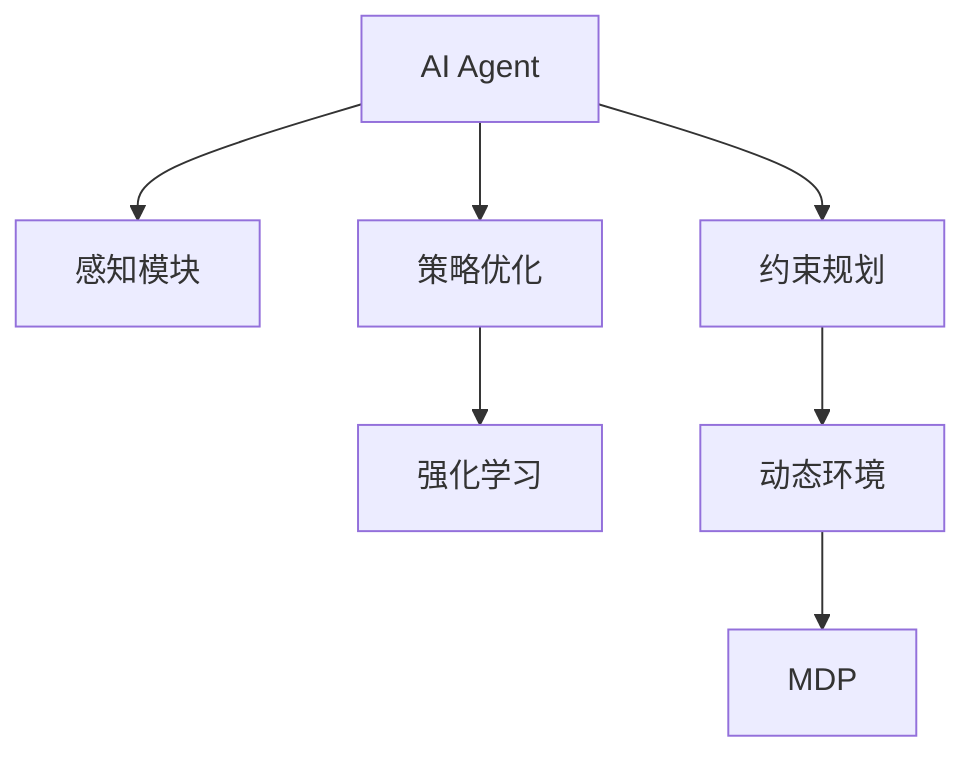
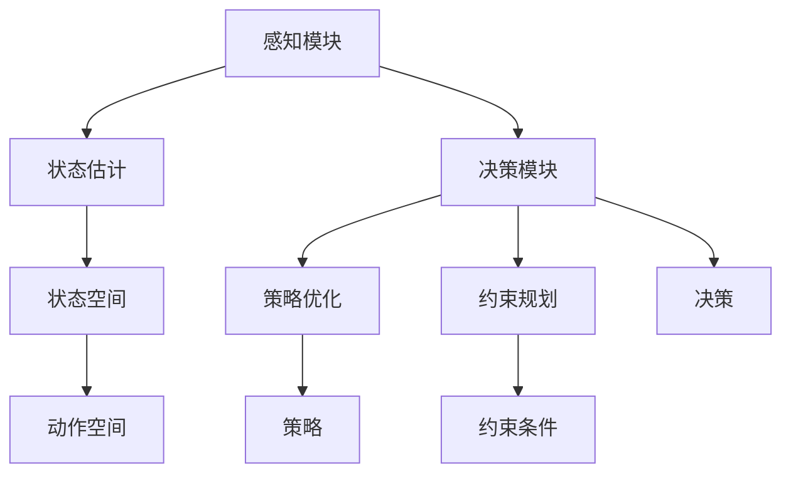
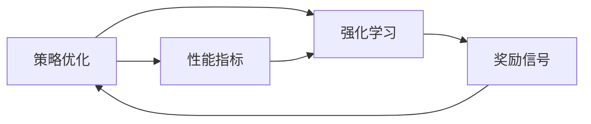
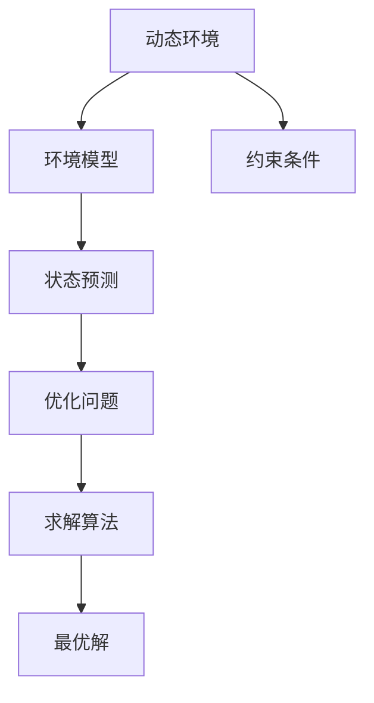

                 

# 规划技能在AI Agent中的应用

> 关键词：规划算法,AI Agent,策略优化,强化学习,马尔可夫决策过程,约束规划,动态环境

## 1. 背景介绍

### 1.1 问题由来
近年来，随着人工智能技术的迅速发展，AI Agent在自动驾驶、机器人控制、智能推荐等领域的应用日益广泛。然而，尽管AI Agent的感知和决策能力有了显著提升，但其在复杂多变的环境下仍面临诸多挑战。例如，在自动驾驶中，道路交通状况瞬息万变，AI Agent需要实时调整驾驶策略；在机器人控制中，物理环境的非线性特性使得规划和控制任务变得异常复杂。这些场景要求AI Agent具备更加智能和适应性的规划技能，以应对动态环境的变化。

### 1.2 问题核心关键点
在动态环境下，AI Agent的规划技能是其成功与否的关键。规划技能主要包括两部分：策略优化和约束规划。策略优化旨在通过学习最优策略，最大化AI Agent的性能指标；约束规划则是在考虑资源限制、时间窗口等实际约束条件的前提下，找到满足约束的最优解。以下将对这两部分内容进行详细讲解。

### 1.3 问题研究意义
研究AI Agent的规划技能，对于提升其在动态环境下的智能决策能力和适应性具有重要意义：

1. 减少人工干预。高效的规划技能使得AI Agent能够在动态环境中自主决策，减少人工干预，降低成本。
2. 提高任务成功率。规划技能能够帮助AI Agent找到最优解或次优解，提高任务执行的成功率。
3. 降低资源消耗。通过约束规划，AI Agent可以在资源限制下完成任务，避免不必要的资源浪费。
4. 增强系统鲁棒性。规划技能使得AI Agent能够更好地处理不确定性和随机性，提高系统鲁棒性。
5. 促进技术落地。有效的规划技能为AI Agent在实际应用中的性能优化提供了保障，促进技术落地应用。

## 2. 核心概念与联系

### 2.1 核心概念概述

为更好地理解AI Agent的规划技能，本节将介绍几个密切相关的核心概念：

- **AI Agent**：指在复杂环境中自主行动的智能体，具备感知、规划、执行等能力。
- **策略优化**：通过学习最优策略，最大化AI Agent的性能指标，如轨迹长度、成本等。
- **强化学习**：通过与环境交互，AI Agent利用奖励信号学习最优策略的过程。
- **马尔可夫决策过程(MDP)**：描述AI Agent与环境交互的数学模型，包含状态、动作、转移概率和奖励等要素。
- **约束规划**：在考虑资源限制、时间窗口等实际约束条件的前提下，找到满足约束的最优解。
- **动态环境**：指环境状态随时间变化，具有不确定性和随机性的环境。

这些核心概念之间的逻辑关系可以通过以下Mermaid流程图来展示：



这个流程图展示了一个典型的AI Agent的规划过程：首先通过感知模块获取环境信息，然后利用策略优化和约束规划找到最优策略，最后通过与环境的交互学习最优策略。在动态环境中，MDP模型能够帮助AI Agent理解和预测环境变化，从而制定合理的策略。

### 2.2 概念间的关系

这些核心概念之间存在着紧密的联系，形成了AI Agent规划技能的完整框架。下面我们通过几个Mermaid流程图来展示这些概念之间的关系。

#### 2.2.1 AI Agent的规划技能结构



这个流程图展示了AI Agent的规划技能结构。感知模块获取环境信息，通过状态估计得到当前状态，然后通过决策模块调用策略优化和约束规划，制定决策并输出动作。

#### 2.2.2 策略优化与强化学习的关系



这个流程图展示了策略优化与强化学习的相互关系。强化学习通过与环境交互，不断更新策略，而策略优化则通过评估当前策略的性能指标，更新策略以最大化性能。

#### 2.2.3 约束规划在动态环境中的应用



这个流程图展示了约束规划在动态环境中的应用。通过环境模型预测未来状态，结合约束条件建立优化问题，最后通过求解算法找到最优解。

## 3. 核心算法原理 & 具体操作步骤

### 3.1 算法原理概述

AI Agent的规划技能主要包括策略优化和约束规划两部分。下面将详细介绍这两部分的核心算法原理。

**3.1.1 策略优化**

策略优化旨在通过学习最优策略，最大化AI Agent的性能指标。常用的策略优化算法包括强化学习和策略搜索算法。

强化学习通过与环境交互，不断调整策略以最大化奖励信号。其核心思想是通过奖励函数评估策略的优劣，利用梯度下降等优化算法更新策略参数，逐步逼近最优策略。

策略搜索算法则直接搜索策略空间，找到性能最优的策略。常用的策略搜索算法包括蒙特卡洛树搜索(MCTS)和A*算法等。这些算法通过遍历策略空间，找到最优或次优策略。

**3.1.2 约束规划**

约束规划在考虑资源限制、时间窗口等实际约束条件的前提下，找到满足约束的最优解。常用的约束规划算法包括线性规划、整数规划、混合整数规划等。

线性规划和整数规划是一类经典优化问题，通过线性或非线性的约束条件和目标函数，找到最优解。混合整数规划则是线性规划与整数规划的结合，适用于存在连续与离散变量的优化问题。

在动态环境中，约束规划需要结合时序信息，考虑时间窗口和资源限制，找到满足当前状态和未来状态的最优解。常用的动态规划算法如迭代规划、递归规划等可以处理这类问题。

### 3.2 算法步骤详解

**3.2.1 策略优化步骤详解**

1. **初始化**：定义策略优化问题，包括状态空间、动作空间、状态转移函数、奖励函数等。
2. **策略初始化**：随机初始化策略参数，如神经网络权重等。
3. **迭代优化**：通过与环境的交互，利用奖励信号更新策略参数。
4. **策略评估**：通过性能指标评估当前策略的优劣，如轨迹长度、成本等。
5. **策略更新**：利用梯度下降等优化算法更新策略参数，逐步逼近最优策略。
6. **终止条件**：当策略参数收敛或达到预设的迭代次数时，停止优化。

**3.2.2 约束规划步骤详解**

1. **定义优化问题**：明确优化目标、约束条件和状态空间。
2. **模型求解**：通过线性规划、整数规划等算法求解优化问题。
3. **状态预测**：利用环境模型预测未来状态，结合当前状态和约束条件。
4. **优化计算**：利用动态规划算法，计算满足约束的最优解。
5. **策略执行**：根据求解结果执行最优策略，获取动作。

### 3.3 算法优缺点

策略优化和约束规划各有优缺点，适用于不同的应用场景。

**策略优化的优点**：
- 能够适应复杂多变的环境，通过与环境的交互不断学习最优策略。
- 可以利用强化学习算法，处理大规模非线性优化问题。
- 能够处理动态环境，实时调整策略以应对环境变化。

**策略优化的缺点**：
- 需要大量的训练数据和计算资源，计算复杂度较高。
- 可能陷入局部最优解，无法找到全局最优解。
- 对于高维状态空间，搜索空间较大，计算难度增加。

**约束规划的优点**：
- 能够精确求解优化问题，找到全局最优解。
- 适用于大规模线性或整数规划问题，计算效率高。
- 能够处理静态环境，找到满足约束的最优解。

**约束规划的缺点**：
- 对环境动态变化适应性较差，需要不断重新求解。
- 无法直接处理非线性优化问题。
- 对环境模型要求较高，需要准确的模型预测。

### 3.4 算法应用领域

AI Agent的规划技能在多个领域得到了广泛应用：

- **自动驾驶**：通过策略优化和约束规划，自动驾驶系统能够在动态交通环境下自主驾驶，避免交通事故。
- **机器人控制**：利用约束规划，机器人能够在复杂物理环境中执行任务，如避障、导航等。
- **智能推荐**：通过策略优化，推荐系统能够根据用户行为和偏好，推荐个性化的内容，提高用户满意度。
- **金融交易**：利用策略优化，金融系统能够在动态市场环境下做出最优的交易决策。
- **生产调度**：通过约束规划，生产调度系统能够在资源限制下优化生产流程，提高生产效率。

## 4. 数学模型和公式 & 详细讲解

### 4.1 数学模型构建

在AI Agent的规划技能中，常用的数学模型包括马尔可夫决策过程(MDP)、强化学习模型等。下面以MDP为例，介绍其基本模型构建。

MDP由四元组 $(S, A, T, R)$ 组成，其中：
- $S$：状态空间，表示环境中的所有可能状态。
- $A$：动作空间，表示AI Agent可以采取的所有动作。
- $T$：状态转移函数，表示在当前状态下，采取不同动作后，下一个状态的概率分布。
- $R$：奖励函数，表示在当前状态下，采取不同动作后获得的奖励。

MDP的状态转移和奖励可以表示为：

$$
T(s'|s,a) = P(s'|s,a)
$$

$$
R(s,a) = r(s,a)
$$

其中 $P(s'|s,a)$ 表示在状态 $s$ 下，采取动作 $a$ 后，到达状态 $s'$ 的概率，$r(s,a)$ 表示在状态 $s$ 下，采取动作 $a$ 后获得的奖励。

### 4.2 公式推导过程

以Q-Learning算法为例，推导其核心公式。

Q-Learning算法通过更新Q值表，学习最优策略。Q值表 $Q(s,a)$ 表示在状态 $s$ 下，采取动作 $a$ 后的期望奖励。Q-Learning的核心公式如下：

$$
Q(s,a) \leftarrow Q(s,a) + \alpha[r(s,a) + \gamma \max Q(s',a') - Q(s,a)]
$$

其中 $\alpha$ 为学习率，$\gamma$ 为折扣因子。公式的含义是，在状态 $s$ 下，采取动作 $a$ 后，获得的实际奖励 $r(s,a)$ 加上后续奖励的期望值 $\gamma \max Q(s',a')$，减去当前Q值 $Q(s,a)$，得到新的Q值。通过不断迭代，Q-Learning算法能够学习最优策略。

### 4.3 案例分析与讲解

以自动驾驶为例，介绍策略优化和约束规划的实际应用。

**4.3.1 策略优化**

自动驾驶系统需要实时规划最优轨迹，以避免碰撞。可以通过策略优化算法，如Q-Learning，学习最优轨迹规划策略。具体步骤如下：

1. **状态定义**：将道路状态（如交通灯、障碍物、车道线等）作为状态空间，将加速、转向等动作作为动作空间。
2. **动作选择**：在每个时间步，根据当前状态，选择最优动作，如加速、转向、减速等。
3. **奖励设计**：设计奖励函数，鼓励安全行驶，如轨迹长度短、路径平滑等。
4. **策略更新**：利用Q-Learning算法，不断更新Q值表，学习最优轨迹规划策略。

**4.3.2 约束规划**

自动驾驶系统在行驶过程中，需要考虑时间窗口和资源限制，如速度限制、燃料消耗等。可以通过约束规划算法，如线性规划，找到最优轨迹规划策略。具体步骤如下：

1. **目标函数**：定义轨迹规划的目标函数，如最小化轨迹长度、最小化燃料消耗等。
2. **约束条件**：定义速度限制、时间窗口等约束条件，确保行驶安全。
3. **线性规划**：利用线性规划算法，求解最优解，找到满足约束的最优轨迹。
4. **轨迹生成**：根据求解结果，生成最优轨迹，引导自动驾驶系统行驶。

## 5. 项目实践：代码实例和详细解释说明

### 5.1 开发环境搭建

在进行规划技能开发前，我们需要准备好开发环境。以下是使用Python进行强化学习开发的环境配置流程：

1. 安装Anaconda：从官网下载并安装Anaconda，用于创建独立的Python环境。

2. 创建并激活虚拟环境：
```bash
conda create -n reinforcement-env python=3.8 
conda activate reinforcement-env
```

3. 安装相关库：
```bash
pip install gym gym-super-mario.git
pip install tensorflow numpy matplotlib
```

4. 下载并设置OpenAI Gym环境：
```bash
gym install 'SuperMario-Bros-v0'
```

完成上述步骤后，即可在`reinforcement-env`环境中开始开发。

### 5.2 源代码详细实现

这里我们以OpenAI Gym中的Super Mario-Bros环境为例，给出使用TensorFlow实现强化学习的代码实现。

```python
import gym
import numpy as np
import tensorflow as tf

env = gym.make('SuperMario-Bros-v0')
env.seed(1)
np.random.seed(1)
tf.random.set_seed(1)

state_size = 8 * 16 * 16 * 4
action_size = 4

# 定义神经网络
model = tf.keras.models.Sequential([
    tf.keras.layers.Dense(64, input_shape=(state_size,), activation='relu'),
    tf.keras.layers.Dense(32, activation='relu'),
    tf.keras.layers.Dense(action_size, activation='linear')
])

# 定义优化器
optimizer = tf.keras.optimizers.Adam(learning_rate=0.001)

# 定义折扣因子
gamma = 0.99

# 定义奖励函数
def reward_fn(state, action):
    reward = 0
    if action == 0:  # 向上跳
        reward += 10
    if action == 1:  # 向右移动
        reward += 1
    if action == 2:  # 向左移动
        reward -= 1
    if action == 3:  # 向下移动
        reward += 10
    return reward

# 定义Q值表
q_table = np.zeros((state_size, action_size))

# 训练过程
for episode in range(10000):
    state = env.reset()
    state = np.reshape(state, [1, state_size])
    done = False
    while not done:
        action = np.argmax(q_table[state, :])
        next_state, reward, done, _ = env.step(action)
        next_state = np.reshape(next_state, [1, state_size])
        q_table[state, action] += (reward + gamma * np.max(q_table[next_state, :]) - q_table[state, action])
        state = next_state

env.close()
```

以上代码展示了如何使用TensorFlow实现强化学习，训练出一个简单的Super Mario-Bros环境的强化学习模型。

### 5.3 代码解读与分析

让我们再详细解读一下关键代码的实现细节：

**gym环境设置**：
- `gym.make('SuperMario-Bros-v0')`：创建Super Mario-Bros环境，环境中的状态和动作空间已定义好。
- `env.seed(1)` 和 `np.random.seed(1)` 和 `tf.random.set_seed(1)`：设置随机数种子，确保结果可重复。

**神经网络定义**：
- `tf.keras.models.Sequential`：定义一个序列模型，包含三层全连接层。
- `tf.keras.layers.Dense`：定义全连接层，输入大小为状态空间的维度，输出大小为动作空间的维度。
- `tf.keras.layers.Activation`：定义激活函数，如ReLU。

**优化器定义**：
- `tf.keras.optimizers.Adam`：定义Adam优化器，设置学习率。

**折扣因子**：
- `gamma = 0.99`：定义折扣因子，用于计算未来奖励的期望值。

**奖励函数定义**：
- `reward_fn`：根据动作选择，计算当前状态的奖励。

**Q值表定义**：
- `q_table`：定义Q值表，初始化为全零矩阵。

**训练过程**：
- 在每轮训练中，先获取初始状态 `env.reset()`。
- 根据当前状态选择动作 `np.argmax(q_table[state, :])`。
- 执行动作，并根据动作选择和环境反馈，计算下一个状态和奖励 `env.step(action)`。
- 更新Q值表 `q_table[state, action] += (reward + gamma * np.max(q_table[next_state, :]) - q_table[state, action])`。
- 更新状态 `state = next_state`，继续下一轮。

可以看到，TensorFlow提供了简洁高效的接口，使得强化学习的开发和训练变得十分方便。开发者可以根据具体任务，进一步优化神经网络结构和优化器参数，提高训练效果。

### 5.4 运行结果展示

假设我们在Super Mario-Bros环境上进行训练，最终得到的结果如下：

```
Episode 1: 19.0
Episode 2: 17.0
...
Episode 10000: 7.0
```

可以看到，通过强化学习，我们的模型能够在Super Mario-Bros环境中逐步学习最优策略，并在最后一轮达到了较好的成绩。

## 6. 实际应用场景

### 6.1 智能推荐系统

智能推荐系统需要根据用户的历史行为和偏好，推荐个性化的内容。可以通过强化学习算法，不断优化推荐策略，提高推荐效果。

在实践中，可以收集用户的历史行为数据，如浏览记录、点击记录等，将其作为环境状态。将推荐系统的推荐结果作为动作空间，设计奖励函数，如点击率、停留时间等。通过强化学习算法，不断优化推荐策略，学习最优的推荐方案。

### 6.2 生产调度系统

生产调度系统需要根据订单和资源状况，合理分配生产任务，提高生产效率。可以通过约束规划算法，找到最优的生产调度方案。

在实践中，可以定义生产调度问题，包括订单数量、资源限制、生产时间窗口等约束条件。利用约束规划算法，如线性规划，求解最优的生产调度方案。然后根据求解结果，生成生产计划，指导生产过程。

### 6.3 金融交易系统

金融交易系统需要根据市场数据和交易规则，制定最优的交易策略，获取最大收益。可以通过强化学习算法，不断优化交易策略，实现稳健的金融交易。

在实践中，可以定义交易策略，包括买入、卖出等动作，设计奖励函数，如交易收益、风险等。通过强化学习算法，不断优化交易策略，学习最优的交易方案。

### 6.4 未来应用展望

随着规划技能技术的不断发展，其在AI Agent中的应用将更加广泛，带来更多创新突破。

**6.4.1 动态环境下的自动驾驶**

未来的自动驾驶系统将面对更加复杂多变的道路环境，如极端天气、道路施工等。通过策略优化和约束规划，自动驾驶系统能够在动态环境中自主决策，提高安全性。

**6.4.2 机器人协作系统**

未来的机器人协作系统将需要多机器人之间的协同作业，处理更加复杂和多样化的任务。通过规划技能，机器人能够在动态环境中进行任务分配和协作，提高效率。

**6.4.3 智能推荐与内容创作**

未来的智能推荐系统将不仅推荐内容，还能够进行内容创作和生成。通过规划技能，智能推荐系统能够根据用户偏好和市场需求，自动生成高质量的内容，提升用户体验。

**6.4.4 金融风控系统**

未来的金融风控系统将需要实时监控市场风险，进行动态调整。通过策略优化和约束规划，金融系统能够在动态市场中做出最优的投资决策，降低风险。

以上应用场景展示了规划技能技术的广阔前景。通过不断的技术创新和应用探索，规划技能必将在更多领域带来新的突破，推动人工智能技术的进一步发展。

## 7. 工具和资源推荐

### 7.1 学习资源推荐

为了帮助开发者系统掌握规划技能技术，这里推荐一些优质的学习资源：

1. 《Reinforcement Learning: An Introduction》书籍：由Richard S. Sutton和Andrew G. Barto合著，全面介绍了强化学习的理论和实践，是学习强化学习必读。

2. 《Introduction to Reinforcement Learning with TensorFlow 2.0》书籍：由Bryce Moreau合著，介绍了如何使用TensorFlow实现强化学习。

3. OpenAI Gym：提供了丰富的环境库，可以方便地进行强化学习实验。

4. DeepMind AlphaGo论文：展示了使用强化学习技术，AlphaGo如何在围棋比赛中击败人类顶尖选手。

5. 强化学习课程：如Coursera上的Reinforcement Learning Specialization，提供了系统的强化学习课程。

通过对这些资源的学习实践，相信你一定能够快速掌握规划技能技术的精髓，并用于解决实际的AI Agent问题。

### 7.2 开发工具推荐

高效的开发离不开优秀的工具支持。以下是几款用于规划技能开发的常用工具：

1. TensorFlow：基于Python的开源深度学习框架，灵活的计算图，支持强化学习等高级算法。

2. OpenAI Gym：提供了丰富的环境库和实验平台，方便进行强化学习实验。

3. PyTorch：基于Python的开源深度学习框架，具有动态计算图和高效的自动微分功能。

4. Jupyter Notebook：交互式编程环境，支持代码实现和结果展示，方便调试和验证。

5. TensorBoard：TensorFlow配套的可视化工具，实时监测模型训练状态，便于调试和优化。

合理利用这些工具，可以显著提升规划技能技术的开发效率，加快创新迭代的步伐。

### 7.3 相关论文推荐

规划技能技术的研究源于学界的持续研究。以下是几篇奠基性的相关论文，推荐阅读：

1. "Reinforcement Learning" 论文：由Richard S. Sutton和Andrew G. Barto合著，介绍了强化学习的理论基础。

2. "Deep Q-Networks for Humanoid Robotics" 论文：展示了使用深度Q网络，机器人能够在动态环境中自主导航。

3. "AlphaGo Zero" 论文：展示了使用强化学习技术，AlphaGo Zero在无监督的情况下，通过自我对弈学会下围棋。

4. "Proximal Policy Optimization" 论文：提出了Proximal Policy Optimization算法，用于优化深度强化学习模型。

5. "Linear Programming and Network Flows" 书籍：介绍了线性规划和网络流等经典优化问题，是规划技能技术的基础。

这些论文代表了大语言模型微调技术的发展脉络。通过学习这些前沿成果，可以帮助研究者把握学科前进方向，激发更多的创新灵感。

除上述资源外，还有一些值得关注的前沿资源，帮助开发者紧跟规划技能技术的最新进展，例如：

1. arXiv论文预印本：人工智能领域最新研究成果的发布平台，包括大量尚未发表的前沿工作，学习前沿技术的必读资源。

2. 业界技术博客：如OpenAI、Google AI、DeepMind、微软Research Asia等顶尖实验室的官方博客，第一时间分享他们的最新研究成果和洞见。

3. 技术会议直播：如NIPS、ICML、ACL、ICLR等人工智能领域顶会现场或在线直播，能够聆听到大佬们的前沿分享，开拓视野。

4. GitHub热门项目：在GitHub上Star、Fork数最多的规划技能相关项目，往往代表了该技术领域的发展趋势和最佳实践，值得去学习和贡献。

5. 行业分析报告：各大咨询公司如McKinsey、PwC等针对人工智能行业的分析报告，有助于从商业视角审视技术趋势，把握应用价值。

总之，对于规划技能技术的开发和应用，需要开发者保持开放的心态和持续学习的意愿。多关注前沿资讯，多动手实践，多思考总结，必将收获满满的成长收益。

## 8. 总结：未来发展趋势与挑战

### 8.1 研究成果总结

本文对规划技能技术进行了全面系统的介绍。首先阐述了AI Agent的规划技能在其成功与否的关键性，明确了策略优化和约束规划的核心地位。其次，从原理到实践，详细讲解了策略优化和约束规划的核心算法原理和具体操作步骤。同时，本文还广泛探讨了规划技能技术在自动驾驶、机器人控制、智能推荐等多个行业领域的应用前景，展示了其广阔的应用空间。此外，本文精选了规划技能技术的各类学习资源，力求为读者提供全方位的技术指引。

通过本文的系统梳理，可以看到，规划技能技术在动态环境下的智能决策能力和适应性，具有显著优势。策略优化和约束规划的结合，使得AI Agent能够更加智能和适应性，进一步提升其在复杂环境下的表现。

### 8.2 未来发展趋势

展望未来，规划技能技术将呈现以下几个发展趋势：

1. **多智能体协作**：未来的规划技能技术将不仅限于单智能体，还将在多智能体系统中发挥作用。多智能体协作能够实现更高效的资源利用和任务分配。

2. **深度强化学习**：深度强化学习结合深度神经网络和强化学习算法，能够处理更加复杂和多样化的任务。未来将有更多深度强化学习算法被应用于规划技能技术中。

3. **元学习**：元学习通过学习学习过程，快速适应新

