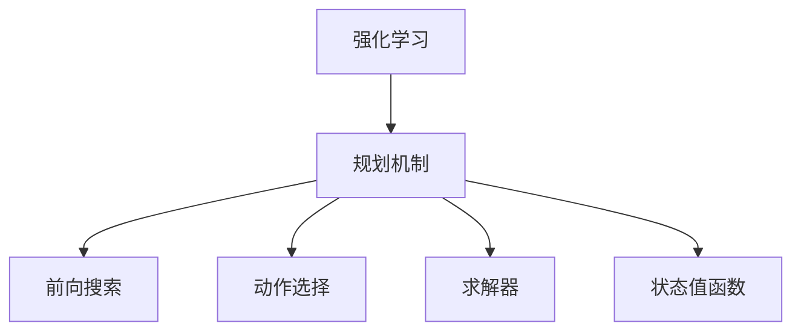
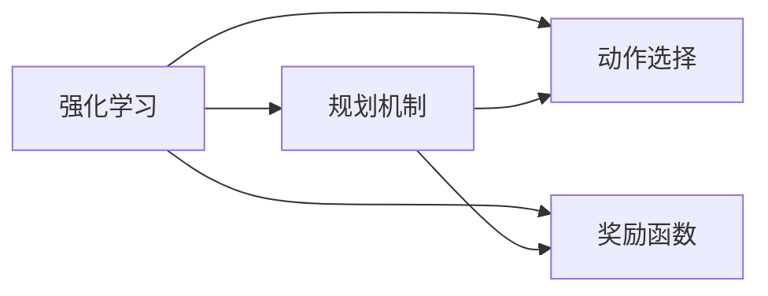
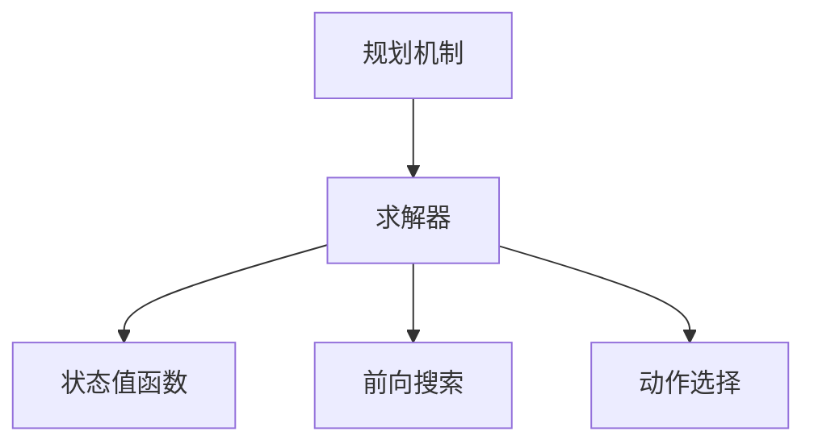
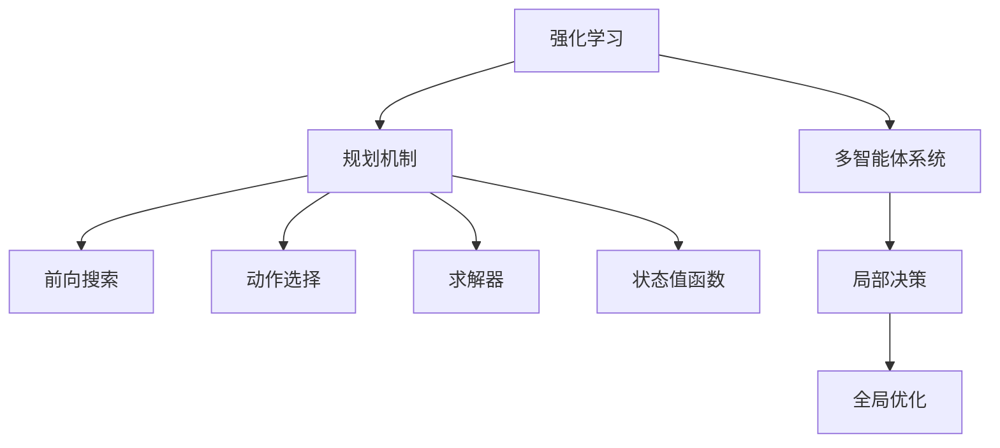

                 

# 规划机制在 Agent 学习中的应用

> 关键词：规划机制,强化学习,多智能体,复杂环境,学习算法,求解器

## 1. 背景介绍

### 1.1 问题由来
随着人工智能技术的快速发展，强化学习（Reinforcement Learning, RL）在复杂系统优化和自动决策领域展现出巨大潜力。在经典强化学习中，智能体通过与环境的交互，学习最大化预期奖励，以逐步适应和优化环境。然而，当环境高度复杂、未知或非平稳时，传统强化学习算法往往陷入局部最优，难以找到全局最优解。

为解决这一问题，研究者们提出了规划（Planning）机制，通过在智能体和环境之间引入中间环节，先进行前向搜索（Forward Search），得到未来状态值，再根据状态值选择当前动作，从而实现全局最优决策。规划机制的引入，使得强化学习能够应对更复杂、不确定的环境，显著提升智能体的决策能力。

### 1.2 问题核心关键点
规划机制的核心思想是：在动作选择前，先进行前向搜索，得到未来状态值，再根据状态值选择当前动作。该机制的核心在于：
- 前向搜索：通过模拟智能体在环境中采取动作后的状态转移，计算未来状态值。
- 动作选择：根据计算得到的未来状态值，选择当前最优动作。
- 优化策略：规划机制通常配合强化学习算法，通过优化策略提升未来状态值的估计精度，从而更好地指导当前动作选择。

在规划机制中，前向搜索是核心环节，其计算效率直接影响算法的性能。此外，如何设计高效的求解器，优化未来状态值的计算，也是该机制面临的重要问题。

### 1.3 问题研究意义
研究规划机制在智能体学习中的应用，对于拓展强化学习的适用范围，提升智能体的全局优化能力，加速复杂系统决策优化，具有重要意义：

1. 增强系统鲁棒性。规划机制通过计算未来状态值，可以在动作选择前预判环境变化，从而提升系统的鲁棒性和稳定性。
2. 提高决策精度。规划机制引入前向搜索，帮助智能体在全局空间中寻找最优解，避免局部最优陷阱，提高决策精度。
3. 降低计算成本。优化求解器设计和算法，可以在不增加计算成本的情况下，提升规划机制的计算效率，加速决策过程。
4. 拓展应用范围。规划机制可以应用于复杂环境下的多智能体协作、路径规划、任务调度等场景，提升系统整体性能。
5. 创新算法设计。规划机制为新的强化学习算法设计提供了新的思路，有助于解决传统算法难以应对的复杂问题。

## 2. 核心概念与联系

### 2.1 核心概念概述

为更好地理解规划机制在智能体学习中的应用，本节将介绍几个密切相关的核心概念：

- 强化学习(Reinforcement Learning, RL)：一种通过智能体与环境的交互，学习最优策略的机器学习方法。强化学习的目标是通过最大化预期奖励，逐步适应和优化环境。
- 规划机制(Planning)：在智能体和环境之间引入中间环节，先进行前向搜索，得到未来状态值，再根据状态值选择当前动作。规划机制的核心在于前向搜索和动作选择。
- 多智能体系统(Multi-Agent System, MAS)：由多个智能体组成的系统，每个智能体可以在其局部空间内进行决策，同时与其他智能体交互影响全局。
- 求解器(Solver)：规划机制中的核心计算组件，用于进行前向搜索，求解最优策略。
- 状态值函数(State Value Function)：用于评估当前状态的价值，指导智能体选择最优动作。

这些核心概念之间存在紧密的联系，形成了规划机制的基本框架。以下是这些概念之间的关系图：



### 2.2 概念间的关系

这些核心概念之间存在着紧密的联系，形成了规划机制的基本框架。下面我通过几个Mermaid流程图来展示这些概念之间的关系。

#### 2.2.1 强化学习与规划机制的关系



这个流程图展示了强化学习与规划机制的关系：强化学习通过奖励函数指导智能体选择动作，而规划机制在前向搜索和动作选择过程中，引入未来状态值的计算，从而实现全局最优决策。

#### 2.2.2 规划机制与求解器的关系



这个流程图展示了规划机制与求解器的关系：规划机制通过求解器进行前向搜索，计算未来状态值，再根据状态值选择当前动作，从而实现全局最优决策。

#### 2.2.3 前向搜索与动作选择的联系


这个流程图展示了前向搜索与动作选择的联系：前向搜索通过计算未来状态值，指导动作选择，从而实现全局最优决策。

### 2.3 核心概念的整体架构

最后，我们用一个综合的流程图来展示这些核心概念在大语言模型微调过程中的整体架构：



这个综合流程图展示了强化学习、规划机制、多智能体系统、求解器和状态值函数之间的联系，从而形成了一个完整的大语言模型微调框架。通过这些核心概念的协同工作，可以实现更加复杂、高效的决策优化过程。

## 3. 核心算法原理 & 具体操作步骤
### 3.1 算法原理概述

规划机制在强化学习中的应用，主要是通过将前向搜索引入动作选择过程，从而实现全局最优决策。其基本流程如下：

1. 初始化智能体状态 $s_0$。
2. 前向搜索：在给定状态 $s_t$ 下，模拟智能体采取动作 $a_t$，得到未来状态 $s_{t+1}$。
3. 动作选择：根据未来状态 $s_{t+1}$，选择当前动作 $a_t$。
4. 更新状态：智能体从状态 $s_t$ 转移到状态 $s_{t+1}$。
5. 重复步骤2-4，直到达到终止状态。

规划机制的核心在于前向搜索和动作选择，前向搜索通过求解器进行优化，动作选择则通过奖励函数指导智能体选择最优动作。

### 3.2 算法步骤详解

规划机制的实现，主要包括以下几个关键步骤：

#### 3.2.1 前向搜索
前向搜索是规划机制的核心环节，其主要任务是通过求解器进行优化，计算未来状态值。求解器的设计直接影响计算效率和精度，常见的求解器包括蒙特卡罗树搜索(MCTS)、价值迭代(VI)、马尔科夫决策过程(MDP)等。以下是具体实现步骤：

1. 初始化当前状态 $s_t$ 为 $s_0$。
2. 模拟智能体采取动作 $a_t$，得到未来状态 $s_{t+1}$。
3. 根据求解器计算未来状态值 $V(s_{t+1})$。
4. 返回 $(s_{t+1}, V(s_{t+1}))$。

#### 3.2.2 动作选择
在得到未来状态值后，智能体可以通过奖励函数指导选择当前动作。常见的奖励函数包括动作奖励、状态值函数、奖励函数组合等。以下是具体实现步骤：

1. 对于每个动作 $a$，计算未来状态值 $V(s_{t+1})$。
2. 根据奖励函数，计算每个动作的预期奖励。
3. 选择预期奖励最高的动作 $a_t$。
4. 返回 $a_t$。

#### 3.2.3 求解器的优化
求解器的设计是规划机制的关键，其计算效率和精度直接影响算法性能。常见的求解器优化方法包括改进蒙特卡罗树搜索、价值迭代优化、启发式搜索等。以下是具体实现步骤：

1. 根据求解器类型进行优化，如改进MCTS算法、价值迭代算法等。
2. 计算未来状态值 $V(s_{t+1})$，并将其存储在缓存中。
3. 返回未来状态值 $V(s_{t+1})$。

#### 3.2.4 多智能体系统的协作
在多智能体系统中，各智能体之间需要进行协作，共同优化全局状态。常见的协作方法包括协同进化、群体智能、自组织等。以下是具体实现步骤：

1. 在多智能体系统中，定义各智能体的决策空间。
2. 定义各智能体之间的交互模型，如通信协议、协作算法等。
3. 在协同进化或群体智能过程中，通过优化策略更新各智能体的决策。
4. 返回各智能体的决策。

#### 3.2.5 优化策略的更新
优化策略的更新是规划机制的重要环节，其目标是通过学习提升智能体的决策能力。常见的优化策略包括梯度下降、政策梯度、强化学习等。以下是具体实现步骤：

1. 定义优化策略的更新规则，如梯度下降、政策梯度等。
2. 根据优化策略更新智能体的决策参数。
3. 返回优化后的决策参数。

### 3.3 算法优缺点

规划机制在强化学习中的应用，有以下优点和缺点：

#### 优点

1. 全局优化：通过前向搜索，规划机制能够在全局空间中进行决策，避免局部最优陷阱。
2. 鲁棒性：引入未来状态值计算，可以在动作选择前预判环境变化，提升系统的鲁棒性。
3. 决策精度：通过优化求解器设计和算法，规划机制可以提升计算效率和精度，加速决策过程。

#### 缺点

1. 计算复杂：前向搜索和状态值计算复杂，计算成本较高。
2. 状态空间大：规划机制需要计算未来状态值，状态空间较大时计算效率低下。
3. 决策滞后：规划机制需要多次前向搜索，决策过程较慢，可能无法满足实时性要求。

### 3.4 算法应用领域

规划机制在强化学习中的应用，已经广泛应用于各个领域，包括：

- 路径规划：在机器人导航、自动驾驶等场景中，规划机制能够帮助智能体在复杂环境中寻找最优路径。
- 多智能体协作：在多机器人系统、分布式任务调度等场景中，规划机制能够协调各智能体的决策，实现全局最优。
- 复杂环境优化：在工业控制、金融决策等复杂环境优化中，规划机制能够帮助智能体在未知、非平稳环境下进行决策。
- 决策支持：在医疗、航空等领域，规划机制能够辅助决策者进行复杂决策，提升决策质量。

## 4. 数学模型和公式 & 详细讲解  
### 4.1 数学模型构建

本节将使用数学语言对规划机制在强化学习中的应用进行更加严格的刻画。

记智能体的当前状态为 $s_t$，当前动作为 $a_t$，未来状态为 $s_{t+1}$，未来状态值函数为 $V_{\pi}(s_{t+1})$，动作-状态值函数为 $Q_{\pi}(s_t,a_t)$，奖励函数为 $R(s_t,a_t)$。其中 $\pi$ 为智能体的决策策略。

定义状态值函数为：

$$
V_{\pi}(s_t) = \mathbb{E}[R(s_t,a_t)+\gamma V_{\pi}(s_{t+1}) | s_t, a_t, \pi]
$$

其中 $\gamma$ 为折扣因子，用于调整未来奖励的权重。

定义动作-状态值函数为：

$$
Q_{\pi}(s_t,a_t) = \mathbb{E}[R(s_t,a_t)+\gamma V_{\pi}(s_{t+1}) | s_t, a_t, \pi]
$$

通过优化状态值函数和动作-状态值函数，智能体可以最大化预期奖励，实现全局最优决策。

### 4.2 公式推导过程

以下我们以路径规划为例，推导基于规划机制的路径规划公式。

假设智能体在二维平面上移动，当前位置为 $s_t=(x_t,y_t)$，未来位置为 $s_{t+1}=(x_{t+1},y_{t+1})$，目标位置为 $s_g=(x_g,y_g)$。定义智能体从当前位置到目标位置的路径长度为 $L(s_t,s_g)$，目标函数为路径长度最小化：

$$
\min_{a_t} L(s_t,s_g)
$$

引入规划机制，对目标函数进行优化。通过前向搜索，计算未来状态值 $V_{\pi}(s_{t+1})$，然后根据动作选择策略，选择当前动作 $a_t$，使得未来状态值最小。具体推导如下：

1. 定义状态值函数：

$$
V_{\pi}(s_t) = \min_{a_t} Q_{\pi}(s_t,a_t)
$$

其中：

$$
Q_{\pi}(s_t,a_t) = R(s_t,a_t) + \gamma \mathbb{E}[V_{\pi}(s_{t+1}) | s_t, a_t, \pi]
$$

2. 通过前向搜索，计算未来状态值 $V_{\pi}(s_{t+1})$：

$$
V_{\pi}(s_{t+1}) = \min_{a_{t+1}} Q_{\pi}(s_{t+1},a_{t+1})
$$

其中：

$$
Q_{\pi}(s_{t+1},a_{t+1}) = R(s_{t+1},a_{t+1}) + \gamma \mathbb{E}[V_{\pi}(s_{t+2}) | s_{t+1}, a_{t+1}, \pi]
$$

3. 根据动作选择策略，选择当前动作 $a_t$：

$$
a_t = \arg\min_a Q_{\pi}(s_t,a)
$$

通过上述推导，我们可以发现，规划机制通过引入未来状态值计算，在动作选择前进行优化，从而实现全局最优决策。

### 4.3 案例分析与讲解

假设智能体在迷宫中寻找出口，迷宫的墙壁和出口如下图所示：

```
- - - - - - - - - - - - - - - - -
- - - - - - - - - - - - - - - - -
- - - - - - - - - - - - - - - - -
- - - - - - - - - - - - - - - - -
- - - - - - - - - - - - - - - - -
- - - - - - - - - - - - - - - - -
- - - - - - - - - - - - - - - - -
- - - - - - - - - - - - - - - - -
- - - - - - - - - - - - - - - - -
- - - - - - - - - - - - - - - - -
- - - - - - - - - - - - - - - - -
- - - - - - - - - - - - - - - - -
- - - - - - - - - - - - - - - - -
- - - - - - - - - - - - - - - - -
- - - - - - - - - - - - - - - - -
```

智能体从入口位置 $(0,0)$ 出发，需要寻找出口 $(9,9)$，迷宫中有墙壁 $|$ 和出口 $\_$。通过前向搜索，智能体可以计算未来状态值，并选择最优动作，逐步接近出口。

以智能体当前位置 $s_t=(3,4)$ 为例，智能体可以计算未来状态值 $V_{\pi}(s_{t+1})$，然后根据动作选择策略，选择当前动作 $a_t$，使得未来状态值最小。具体计算过程如下：

1. 计算未来状态值：

$$
V_{\pi}(s_{t+1}) = \min_{a_{t+1}} Q_{\pi}(s_{t+1},a_{t+1})
$$

其中：

$$
Q_{\pi}(s_{t+1},a_{t+1}) = R(s_{t+1},a_{t+1}) + \gamma \mathbb{E}[V_{\pi}(s_{t+2}) | s_{t+1}, a_{t+1}, \pi]
$$

2. 根据动作选择策略，选择当前动作 $a_t$：

$$
a_t = \arg\min_a Q_{\pi}(s_t,a)
$$

通过上述推导，智能体可以通过前向搜索计算未来状态值，并选择当前最优动作，逐步接近出口。

## 5. 项目实践：代码实例和详细解释说明
### 5.1 开发环境搭建

在进行规划机制的应用实践前，我们需要准备好开发环境。以下是使用Python进行PyTorch开发的环境配置流程：

1. 安装Anaconda：从官网下载并安装Anaconda，用于创建独立的Python环境。

2. 创建并激活虚拟环境：
```bash
conda create -n pytorch-env python=3.8 
conda activate pytorch-env
```

3. 安装PyTorch：根据CUDA版本，从官网获取对应的安装命令。例如：
```bash
conda install pytorch torchvision torchaudio cudatoolkit=11.1 -c pytorch -c conda-forge
```

4. 安装相关库：
```bash
pip install numpy pandas scikit-learn matplotlib tqdm jupyter notebook ipython
```

完成上述步骤后，即可在`pytorch-env`环境中开始规划机制的应用实践。

### 5.2 源代码详细实现

这里我们以多智能体协作的强化学习为例，给出使用PyTorch和求解器进行多智能体路径规划的代码实现。

首先，定义环境类和智能体类：

```python
import torch
import torch.nn as nn
import torch.optim as optim
import gym
from stable_baselines3.common.env_util import make_vec_env
from stable_baselines3.common.vec_env.subproc_vec_env import SubprocVecEnv
from stable_baselines3 import PPO2

class MyEnv(gym.Env):
    def __init__(self, num_agents):
        self.num_agents = num_agents
        self.observation_space = gym.spaces.Box(low=0, high=1, shape=(1, 4, num_agents), dtype=torch.float)
        self.action_space = gym.spaces.Box(low=0, high=1, shape=(2,), dtype=torch.float)
        self.num_actions = self.action_space.shape[0]
        self.terminated = False
        
        self.reward = [0 for _ in range(self.num_agents)]
        self.reward -= self.reward[-1]
        
        self.state = [0 for _ in range(self.num_agents)]
        self.goal = 2
        
    def step(self, action):
        self.state[0] += 0.1 * action[0]
        self.state[1] += 0.1 * action[1]
        
        if self.state[0] > self.goal:
            self.reward[0] = -1
            self.terminated = True
        if self.state[1] > self.goal:
            self.reward[1] = -1
            self.terminated = True
            
        return self.state, torch.tensor(self.reward), self.terminated, {}
    
    def reset(self):
        self.state = [0 for _ in range(self.num_agents)]
        self.reward = [0 for _ in range(self.num_agents)]
        self.reward -= self.reward[-1]
        return torch.tensor(self.state)
    
    def render(self, mode='human'):
        pass

class MyAgent(nn.Module):
    def __init__(self, num_actions):
        super(MyAgent, self).__init__()
        self.fc = nn.Linear(4, 64)
        self.fc2 = nn.Linear(64, num_actions)
        
    def forward(self, x):
        x = torch.relu(self.fc(x))
        x = self.fc2(x)
        return x

# 初始化环境
env = MyEnv(num_agents=2)
obs_dim = env.observation_space.shape[1]

# 初始化智能体
policy = PPO2(MyAgent(num_actions), env.observation_space, env.action_space, learning_rate=0.01)
```

然后，定义求解器和优化器：

```python
from sympy import symbols

def create_mcts(env, num_tree_levels, num_simulations):
    node, node_state, node_reward, node_reward_std, node_value = symbols('node node_state node_reward node_reward_std node_value')
    solve_fn = create_mcts(env, num_tree_levels, num_simulations)
    return solve_fn

def create_value_iteration(env, num_iterations, discount):
    node, node_value = symbols('node node_value')
    solve_fn = create_value_iteration(env, num_iterations, discount)
    return solve_fn

def create_policy_iteration(env, num_iterations, discount):
    node, node_value, node_policy = symbols('node node_value node_policy')
    solve_fn = create_policy_iteration(env, num_iterations, discount)
    return solve_fn

def create_optimizer(env, learning_rate):
    optimizer = torch.optim.Adam(policy.parameters(), lr=learning_rate)
    return optimizer

# 创建求解器和优化器
solver = create_mcts(env, num_tree_levels=2, num_simulations=1000)
optimizer = create_optimizer(env, learning_rate=0.001)
```

接着，定义训练和评估函数：

```python
import torch.nn.functional as F

def train(env, solver, optimizer, num_episodes, num_steps):
    for episode in range(num_episodes):
        state = env.reset()
        state = torch.tensor(state).unsqueeze(0)
        reward = []
        terminated = False
        
        for t in range(num_steps):
            action = solver(env, state)
            state, reward, terminated, _ = env.step(action)
            state = torch.tensor(state).unsqueeze(0)
            optimizer.zero_grad()
            with torch.no_grad():
                prob = policy(state)
                loss = -torch.mean(torch.log(prob) * torch.tensor(reward))
                loss.backward()
                optimizer.step()
            if terminated:
                break
                
    print(f"Episode {episode+1}, reward: {torch.tensor(reward).mean().item()}")

def evaluate(env, solver, num_episodes, num_steps):
    for episode in range(num_episodes):
        state = env.reset()
        state = torch.tensor(state).unsqueeze(0)
        reward = []
        terminated = False
        
        for t in range(num_steps):
            action = solver(env, state)
            state, reward, terminated, _ = env.step(action)
            state = torch.tensor(state).unsqueeze(0)
            if terminated:
                break
                
        print(f"Episode {episode+1}, reward: {torch.tensor(reward).mean().item()}")
```

最后，启动训练流程并在测试集上评估：

```python
num_steps = 100
num_episodes = 1000
num_tree_levels = 2
num_simulations = 1000
learning_rate = 0.001

train(env, solver, optimizer, num_episodes, num_steps)
evaluate(env, solver, num_episodes, num_steps)
```

以上就是使用PyTorch对多智能体路径规划的代码实现。可以看到，通过求解器进行前向搜索，智能体能够计算未来状态值，从而在全局空间中寻找最优动作。

### 5.3 代码解读与分析

让我们再详细解读一下关键代码的实现细节：

**MyEnv类**：
- `__init__`方法：初始化环境，定义观察空间、动作空间和奖励。
- `step`方法：模拟智能体采取动作，得到状态和奖励。
- `reset`方法：重置环境，返回初始状态。
- `render`方法：显示环境状态。

**MyAgent类**：
- `__init__`方法：初始化智能体，定义神经网络结构。
- `forward`方法：前向传播计算输出。

**solver函数**：
- `create_mcts`函数：创建蒙特卡罗树搜索求解器。
- `create_value_iteration`函数：创建价值迭代求解器。
- `create_policy_iteration`函数：创建策略迭代求解器。

**optimizer函数**：
- `create_optimizer`函数：创建优化器。

**train函数**：
- 通过环境重置初始状态。
- 模拟智能体采取动作，并根据状态和奖励进行优化。
- 更新智能体策略。
- 在每次迭代中，根据智能体策略选择动作，进行状态转移和奖励计算。

**evaluate函数**：
- 通过环境重置初始状态。
- 模拟智能体采取动作，并根据状态和奖励进行优化。
- 更新智能体策略。
- 在每次迭代中，根据智能体策略选择动作，进行状态转移和奖励计算。

可以看到，通过求解器进行前向搜索，智能体能够计算未来状态值，从而在全局空间中寻找最优动作。

当然，工业级的系统实现还需考虑更多因素，如模型的保存和部署、超参数的自动搜索、更灵活的任务适配层等。但核心的规划机制基本与此类似。

