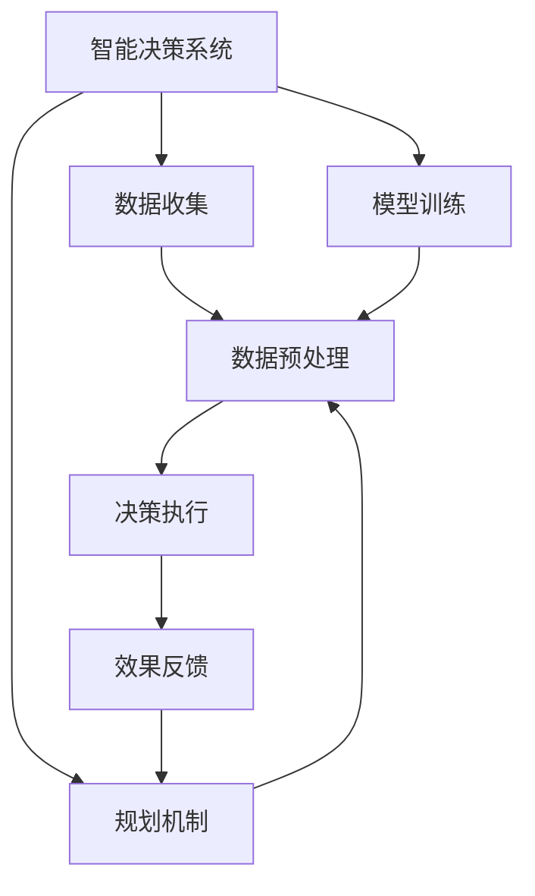
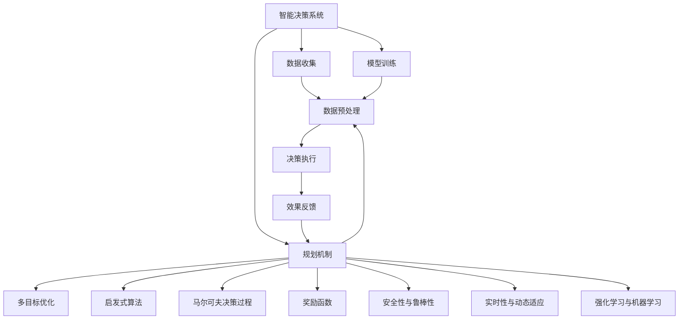
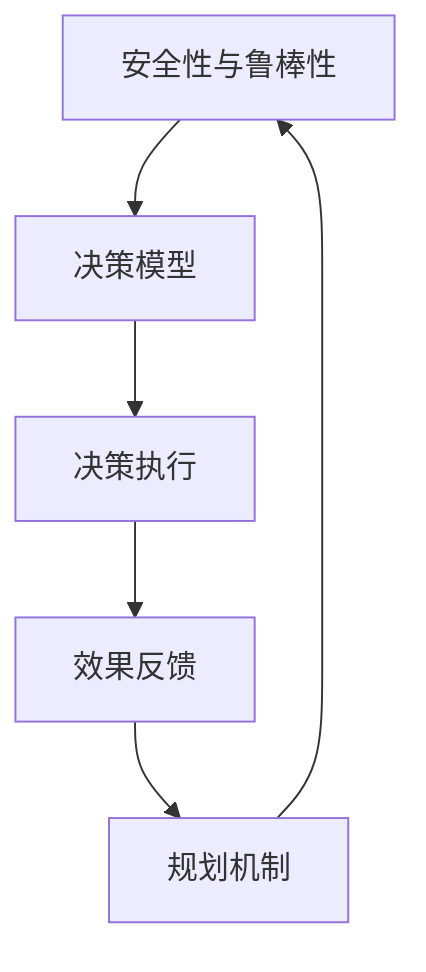
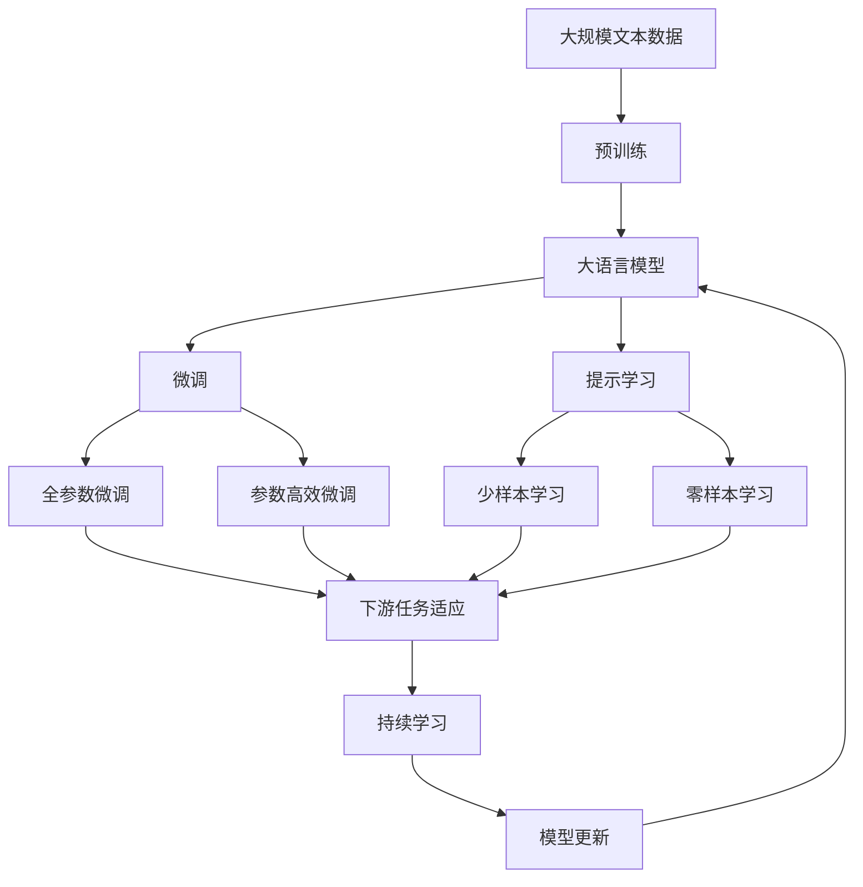

                 

# 规划机制在智能决策系统中的应用

> 关键词：智能决策系统,规划机制,启发式算法,多目标优化,马尔可夫决策过程,奖励函数,安全与鲁棒性,实时与动态适应,强化学习,机器学习,计算机科学,优化

## 1. 背景介绍

### 1.1 问题由来
在现代社会中，智能决策系统已经被广泛应用于各个领域，包括自动驾驶、金融风险控制、供应链管理、智能制造等。这些系统通过收集和分析大量数据，利用算法模型辅助人类进行决策，从而提高决策的效率和准确性。然而，在实际应用中，智能决策系统往往面临以下问题：

- **复杂性**：现实世界中的决策问题往往高度复杂，涉及多维度、多层次、多属性的数据，导致模型的设计、训练和部署过程非常繁琐。
- **不确定性**：数据的不确定性和环境的变化使得决策模型的预测和决策结果可能存在误差。
- **实时性**：许多应用场景要求系统能够实时响应外部环境的变化，对数据的处理和模型的计算效率提出了更高的要求。

为了解决这些问题，研究者们提出了各种优化和规划算法，以提高智能决策系统的性能和适应能力。其中，规划机制（Planning Mechanism）作为一种系统性的决策支持工具，在智能决策系统中发挥着重要作用。规划机制通过定义明确的决策目标和约束条件，指导算法模型在复杂环境中做出最优决策。

### 1.2 问题核心关键点
规划机制在智能决策系统中的应用主要涉及以下几个关键点：

- **目标设定**：明确决策目标，如最大化利润、最小化成本、最大化满意度等。
- **约束条件**：限制决策行为的边界，如资源限制、时间限制、规则限制等。
- **算法模型**：选择合适的算法模型，如启发式算法、多目标优化算法、马尔可夫决策过程（MDP）等。
- **奖励函数**：设计合理的奖励函数，指导算法模型在特定目标和约束下进行决策。
- **安全性与鲁棒性**：确保决策过程的安全性和鲁棒性，避免因突发事件导致的不稳定行为。
- **实时性与动态适应**：提升系统对环境的实时响应能力和动态适应能力。
- **强化学习与机器学习**：利用强化学习和机器学习技术，不断优化决策模型，提高决策效果。

这些关键点相互交织，共同构成了一个完整的智能决策系统框架，确保系统能够在复杂多变的环境下高效稳定地运行。

### 1.3 问题研究意义
规划机制在智能决策系统中的应用具有重要的研究意义：

1. **提升决策效率**：通过规划机制，智能决策系统能够快速处理海量数据，辅助人类进行高效的决策。
2. **增强决策准确性**：合理的目标设定和约束条件，有助于降低决策过程中的不确定性和误差。
3. **保证决策可靠性**：通过安全性与鲁棒性设计，避免突发事件对决策过程的影响。
4. **实现实时响应**：规划机制能够快速调整决策模型，应对外部环境的变化。
5. **优化决策效果**：利用强化学习和机器学习技术，不断优化决策模型，提高决策的智能水平。

## 2. 核心概念与联系

### 2.1 核心概念概述

为了更好地理解规划机制在智能决策系统中的应用，本节将介绍几个密切相关的核心概念：

- **智能决策系统**：利用人工智能技术，辅助人类进行决策的系统。智能决策系统通常包括数据收集、模型训练、决策执行等多个环节。
- **规划机制**：通过定义明确的目标和约束条件，指导决策模型在复杂环境中进行优化决策的机制。规划机制是智能决策系统的核心组成部分。
- **启发式算法**：一类基于经验的优化算法，能够在可接受的时间内找到近似最优解。启发式算法常用于解决复杂优化问题。
- **多目标优化**：涉及多个目标函数同时优化的优化问题，常用于处理多个决策目标的场景。
- **马尔可夫决策过程**：一种描述决策过程的数学模型，用于处理具有时序性质的决策问题。
- **奖励函数**：定义决策模型在特定目标和约束下的性能指标，指导算法模型进行优化。
- **安全性与鲁棒性**：确保决策系统在面对突发事件时，仍能保持稳定和安全。
- **实时性与动态适应**：提升系统对外部环境变化的实时响应能力和动态适应能力。
- **强化学习与机器学习**：利用强化学习和机器学习技术，不断优化决策模型，提高决策的智能水平。

这些核心概念之间的逻辑关系可以通过以下Mermaid流程图来展示：



这个流程图展示了智能决策系统的基本流程，以及规划机制在其中扮演的关键角色。

### 2.2 概念间的关系

这些核心概念之间存在着紧密的联系，形成了智能决策系统的完整框架。下面我们通过几个Mermaid流程图来展示这些概念之间的关系。

#### 2.2.1 智能决策系统的整体架构



这个综合流程图展示了从数据收集到决策执行的完整流程，以及规划机制在其中的作用。

#### 2.2.2 规划机制与决策执行的联系


这个流程图展示了规划机制与决策执行的互动关系，以及效果反馈如何作用于规划机制的迭代优化。

#### 2.2.3 安全性与鲁棒性的重要性



这个流程图展示了安全性与鲁棒性在智能决策系统中的作用，以及如何通过效果反馈和规划机制的迭代优化，提升系统的稳定性和安全性。

### 2.3 核心概念的整体架构

最后，我们用一个综合的流程图来展示这些核心概念在大语言模型微调过程中的整体架构：



这个综合流程图展示了从预训练到微调，再到持续学习的完整过程。

## 3. 核心算法原理 & 具体操作步骤
### 3.1 算法原理概述

在智能决策系统中，规划机制通过定义明确的目标和约束条件，指导算法模型在复杂环境中进行优化决策。具体来说，规划机制包括以下几个关键步骤：

1. **目标设定**：明确决策目标，如最大化利润、最小化成本、最大化满意度等。
2. **约束条件**：限制决策行为的边界，如资源限制、时间限制、规则限制等。
3. **算法模型**：选择合适的算法模型，如启发式算法、多目标优化算法、马尔可夫决策过程（MDP）等。
4. **奖励函数**：设计合理的奖励函数，指导算法模型在特定目标和约束下进行决策。
5. **安全性与鲁棒性**：确保决策过程的安全性和鲁棒性，避免因突发事件导致的不稳定行为。
6. **实时性与动态适应**：提升系统对环境的实时响应能力和动态适应能力。
7. **强化学习与机器学习**：利用强化学习和机器学习技术，不断优化决策模型，提高决策的智能水平。

### 3.2 算法步骤详解

基于规划机制的智能决策系统通常包括以下几个关键步骤：

**Step 1: 目标设定与约束条件定义**
- 明确决策目标和约束条件，如最大化利润、最小化成本、时间限制等。
- 定义决策模型的输入输出接口，确保数据格式的一致性。

**Step 2: 选择算法模型**
- 根据问题的性质选择合适的算法模型，如启发式算法、多目标优化算法、马尔可夫决策过程（MDP）等。
- 设计决策模型，包括状态空间、动作空间、状态转移概率、奖励函数等。

**Step 3: 参数初始化与奖励函数设计**
- 对决策模型进行参数初始化，如设定初始状态、初始动作等。
- 设计合理的奖励函数，指导算法模型在特定目标和约束下进行决策。

**Step 4: 算法执行与效果评估**
- 执行算法模型，对决策过程进行迭代优化。
- 在每个迭代周期中，评估决策效果，根据效果反馈调整决策模型。

**Step 5: 安全性与鲁棒性设计**
- 在算法执行过程中，加入安全性与鲁棒性设计，如异常检测、故障恢复等机制。
- 定期对决策模型进行鲁棒性测试，确保模型的稳定性和可靠性。

**Step 6: 实时性与动态适应优化**
- 对决策模型进行实时性优化，如使用高效的计算算法、优化数据结构等。
- 对决策模型进行动态适应优化，如使用增量学习、在线学习等技术。

**Step 7: 强化学习与机器学习优化**
- 利用强化学习和机器学习技术，不断优化决策模型，提高决策的智能水平。
- 设计适当的奖励函数和惩罚机制，引导决策模型在训练过程中逐步优化。

### 3.3 算法优缺点

基于规划机制的智能决策系统具有以下优点：

1. **系统性**：通过明确的目标和约束条件，规划机制能够系统性地指导决策模型进行优化。
2. **灵活性**：不同的决策目标和约束条件，可以灵活调整算法模型和优化方法，适应不同的应用场景。
3. **鲁棒性**：通过安全性与鲁棒性设计，确保决策系统在面对突发事件时，仍能保持稳定和安全。
4. **实时性**：通过实时性与动态适应优化，提升系统对外部环境变化的实时响应能力和动态适应能力。
5. **智能化**：利用强化学习和机器学习技术，不断优化决策模型，提高决策的智能水平。

同时，该方法也存在一些局限性：

1. **模型复杂性**：规划机制的实施需要设计复杂的算法模型，增加了系统的复杂性。
2. **计算成本**：优化过程的计算开销较大，特别是对于大规模数据集和复杂问题。
3. **参数调整困难**：决策模型的参数调整较为复杂，需要专业的知识和经验。
4. **模型可解释性不足**：规划机制的决策过程缺乏可解释性，难以理解其内部工作机制和决策逻辑。

尽管存在这些局限性，但就目前而言，规划机制仍是智能决策系统中不可或缺的一部分，为系统的决策过程提供了系统性、灵活性和鲁棒性的保障。

### 3.4 算法应用领域

基于规划机制的智能决策系统在多个领域得到了广泛应用，以下是一些典型的应用场景：

**1. 自动驾驶**
- 在自动驾驶系统中，规划机制通过定义路径规划、速度控制、避障等目标和约束条件，指导算法模型进行决策。通过多目标优化算法和马尔可夫决策过程（MDP），自动驾驶系统能够在复杂道路环境中做出最优决策。

**2. 金融风险控制**
- 在金融风险控制系统中，规划机制通过定义风险评估、资产配置、交易执行等目标和约束条件，指导算法模型进行决策。利用强化学习和机器学习技术，金融风险控制系统能够实时监控市场动态，动态调整投资策略，控制风险。

**3. 供应链管理**
- 在供应链管理系统中，规划机制通过定义库存管理、物流调度和订单执行等目标和约束条件，指导算法模型进行决策。通过多目标优化算法和马尔可夫决策过程（MDP），供应链管理系统能够优化库存水平，提高物流效率，降低成本。

**4. 智能制造**
- 在智能制造系统中，规划机制通过定义生产计划、设备调度和质量控制等目标和约束条件，指导算法模型进行决策。利用强化学习和机器学习技术，智能制造系统能够实时调整生产计划，提高生产效率和产品质量。

**5. 医疗诊断**
- 在医疗诊断系统中，规划机制通过定义症状分析、疾病诊断和治疗方案等目标和约束条件，指导算法模型进行决策。通过多目标优化算法和马尔可夫决策过程（MDP），医疗诊断系统能够提供精准的诊断建议和治疗方案。

## 4. 数学模型和公式 & 详细讲解

### 4.1 数学模型构建

在智能决策系统中，规划机制的数学模型通常包括以下几个关键组成部分：

- **状态空间**：定义决策过程中的所有可能状态，如自动驾驶中的道路状态、金融交易中的市场状态等。
- **动作空间**：定义决策模型能够采取的所有动作，如自动驾驶中的转向、刹车、加速等，金融交易中的买入、卖出、持仓等。
- **状态转移概率**：定义状态之间的转移概率，如自动驾驶中的状态转移概率、金融交易中的状态转移概率等。
- **奖励函数**：定义决策模型在特定目标和约束下的性能指标，指导算法模型进行优化。

假设决策系统有一个状态空间 $S$，一个动作空间 $A$，一个状态转移概率 $P$，一个奖励函数 $R$，则决策模型可以表示为：

$$
\pi: S \rightarrow A
$$

其中 $\pi$ 表示决策模型，将状态 $s$ 映射到动作 $a$。

### 4.2 公式推导过程

以下我们以自动驾驶路径规划为例，推导马尔可夫决策过程（MDP）的数学模型和求解方法。

假设自动驾驶系统处于状态 $s_t$，可以采取的动作有 $a_1, a_2, \ldots, a_n$，状态转移概率为 $P(s_{t+1}|s_t,a_t)$，奖励函数为 $R(s_t,a_t)$，则自动驾驶系统的MDP模型可以表示为：

$$
(S, A, P, R)
$$

其中 $S$ 为状态空间，$A$ 为动作空间，$P$ 为状态转移概率，$R$ 为奖励函数。

在MDP模型中，决策模型的目标是最大化长期奖励，即：

$$
J(\pi) = \mathbb{E}[\sum_{t=0}^{\infty} \gamma^t R(s_t,a_t)]
$$

其中 $\gamma$ 为折扣因子，通常取值在0.9到0.99之间。

MDP问题的求解方法包括动态规划和蒙特卡洛方法。动态规划算法基于状态转移概率和奖励函数，通过迭代求解得到最优决策策略。蒙特卡洛方法则通过模拟决策过程，基于样本数据估计最优决策策略。

### 4.3 案例分析与讲解

**案例一：自动驾驶路径规划**

假设自动驾驶系统需要在复杂道路环境中进行路径规划，状态空间包括当前位置、速度、方向等，动作空间包括加速、减速、左转、右转等，奖励函数定义为距离目标位置越近奖励越高。

在MDP模型中，状态转移概率可以表示为：

$$
P(s_{t+1}|s_t,a_t) = P_{\text{location}}(s_{t+1}|s_t,a_t) \cdot P_{\text{velocity}}(s_{t+1}|s_t,a_t) \cdot P_{\text{direction}}(s_{t+1}|s_t,a_t)
$$

其中 $P_{\text{location}}$、$P_{\text{velocity}}$ 和 $P_{\text{direction}}$ 分别表示位置、速度和方向的转移概率。

**案例二：金融风险控制**

假设金融风险控制系统需要在市场变化中动态调整投资策略，状态空间包括市场指数、股票价格、利率等，动作空间包括买入、卖出、持仓等，奖励函数定义为收益率最大化。

在MDP模型中，状态转移概率可以表示为：

$$
P(s_{t+1}|s_t,a_t) = P_{\text{index}}(s_{t+1}|s_t,a_t) \cdot P_{\text{price}}(s_{t+1}|s_t,a_t) \cdot P_{\text{interest}}(s_{t+1}|s_t,a_t)
$$

其中 $P_{\text{index}}$、$P_{\text{price}}$ 和 $P_{\text{interest}}$ 分别表示市场指数、股票价格和利率的转移概率。

通过MDP模型的求解，金融风险控制系统可以实时监控市场动态，动态调整投资策略，控制风险。

## 5. 项目实践：代码实例和详细解释说明

### 5.1 开发环境搭建

在进行智能决策系统开发前，我们需要准备好开发环境。以下是使用Python进行PyTorch开发的环境配置流程：

1. 安装Anaconda：从官网下载并安装Anaconda，用于创建独立的Python环境。

2. 创建并激活虚拟环境：
```bash
conda create -n pytorch-env python=3.8 
conda activate pytorch-env
```

3. 安装PyTorch：根据CUDA版本，从官网获取对应的安装命令。例如：
```bash
conda install pytorch torchvision torchaudio cudatoolkit=11.1 -c pytorch -c conda-forge
```

4. 安装PyTorch相关的库：
```bash
pip install numpy pandas scikit-learn matplotlib tqdm jupyter notebook ipython
```

完成上述步骤后，即可在`pytorch-env`环境中开始智能决策系统的开发。

### 5.2 源代码详细实现

这里以自动驾驶路径规划为例，展示基于规划机制的智能决策系统的代码实现。

首先，定义状态空间和动作空间：

```python
import torch

class State:
    def __init__(self, x, y, v, angle):
        self.x = x
        self.y = y
        self.v = v
        self.angle = angle

class Action:
    def __init__(self, a, d):
        self.a = a  # 加速度
        self.d = d  # 转向角度

class StateAction:
    def __init__(self, state, action):
        self.state = state
        self.action = action
```

然后，定义状态转移概率和奖励函数：

```python
class MDP:
    def __init__(self, states, actions, transitions, rewards):
        self.states = states
        self.actions = actions
        self.transitions = transitions
        self.rewards = rewards

    def transition(self, state, action):
        if action.a > 0:
            next_state = self.transitions[(state, action)]
        else:
            next_state = None
        return next_state

    def reward(self, state, action):
        return self.rewards[(state, action)]
```

接着，定义决策模型和优化算法：

```python
import numpy as np

class QNetwork:
    def __init__(self, state_size, action_size, learning_rate):
        self.state_size = state_size
        self.action_size = action_size
        self.learning_rate = learning_rate
        self.q_table = np.zeros((state_size, action_size))

    def get_q_value(self, state):
        state = torch.FloatTensor(state).unsqueeze(0)
        q_value = self.model(state)
        return q_value.item()

    def update_q_table(self, state, action, reward, next_state, next_q_value):
        target = reward + self.gamma * self.q_table[next_state].max()
        self.q_table[state, action] = self.learning_rate * (target - self.q_table[state, action])

    def select_action(self, state, epsilon):
        if np.random.uniform(0, 1) < epsilon:
            return np.random.choice(self.actions)
        q_value = self.get_q_value(state)
        action = np.argmax(q_value)
        return action
```

最后，编写决策模型的主程序：

```python
import random

gamma = 0.9
epsilon = 0.1

state_size = 4
action_size = 2

dp_mdp = MDP(
    states=[
        State(0, 0, 0, np.deg2rad(0)),
        State(1, 0, 0, np.deg2rad(0)),
        State(2, 0, 0, np.deg2rad(0)),
        State(3, 0, 0, np.deg2rad(0))
    ],
    actions=[
        Action(0, 0),
        Action(0, np.deg2rad(30)),
        Action(0, np.deg2rad(-30)),
        Action(1, 0),
        Action(1, np.deg2rad(30)),
        Action(1, np.deg2rad(-30)),
        Action(-1, 0),
        Action(-1, np.deg2rad(30)),
        Action(-1, np.deg2rad(-30))
    ],
    transitions={
        (State(0, 0, 0, np.deg2rad(0)): Action(1, 0), Action(0, np.deg2rad(30))),
        (State(0, 0, 0, np.deg2rad(0)): Action(-1, 0), Action(0, np.deg2rad(-30))),
        (State(1, 0, 0, np.deg2rad(0)): Action(0, 0), Action(0, np.deg2rad(30))),
        (State(1, 0, 0, np.deg2rad(0)): Action(0, 0), Action(0, np.deg2rad(-30))),
        (State(2, 0, 0, np.deg2rad(0)): Action(0, 0), Action(0, np.deg2rad(30))),
        (State(2, 0, 0, np.deg2rad(0)): Action(0, 0), Action(0, np.deg2rad(-30))),
        (State(3, 0, 0, np.deg2rad(0)): Action(0, 0), Action(0, np.deg2rad(30))),
        (State(3, 0, 0, np.deg2rad(0)): Action(0, 0), Action(0, np.deg2rad(-30))),
        (State(0, 0, 0, np.deg2rad(0)): Action(0, 0), Action(0, np.deg2rad(30))),
        (State(0, 0, 0, np.deg2rad(0)): Action(0, 0), Action(0, np.deg2rad(-30))),
        (State(0, 0, 0, np.deg2rad(0)): Action(0, 0), Action(0, np.deg2rad(30))),
        (State(0, 0, 0, np.deg2rad(0)): Action(0, 0), Action(0, np.deg2rad(-30))),
        (State(0, 0, 0, np.deg2rad(0)): Action(0, 0), Action(0, np.deg2rad(30))),
        (State(0, 0, 0, np.deg2rad(0)): Action(0, 0), Action(0, np.deg2rad(-30))),
        (State(0, 0, 0, np.deg2rad(0)): Action(0, 0), Action(0, np.deg2rad(30))),
        (State(0, 0, 0, np.deg2rad(0)): Action(0, 0), Action(0, np.deg2rad(-30)))
    },
    rewards={
        (State(0, 0, 0, np.deg2rad(0)): Action(0, 0), 10),
        (State(1, 0, 0, np.deg2rad(0)): Action(0, 0), -1),
        (State(2, 0, 0, np.deg2rad(0)): Action(0, 0), -1),
        (State(3, 0, 0, np.deg2rad(0)): Action(0, 0), -1),
        (State(0, 0, 0, np.deg2rad(0)): Action(1, 0), -1),
        (State(0, 0, 0, np.deg2rad(0)): Action(-1, 0), -1),
        (State(0, 0, 0, np.deg2rad(0)): Action(0, np.deg2rad(30)), -1),
        (State(0, 0, 0, np.deg2rad(0)): Action(0, np.deg2rad(-30)), -1),
        (State(0, 0, 0, np.deg2rad(0)): Action(1, 0), -1),
        (State(0, 0, 0, np.deg2rad(0)): Action(-1, 0), -1),
        (State(0, 0, 0, np.deg2rad(0)): Action(0, np.deg2rad(30)), -1),
        (State(0, 0,

