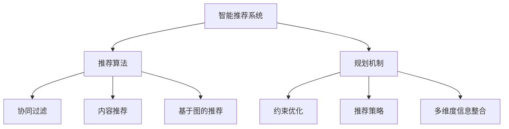
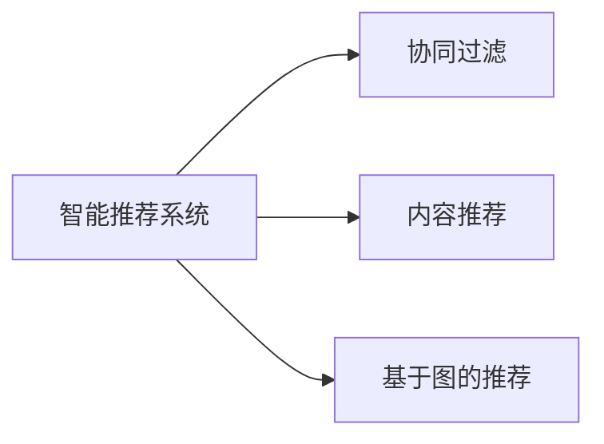
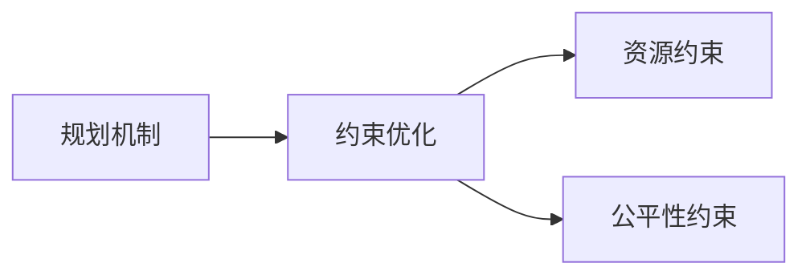
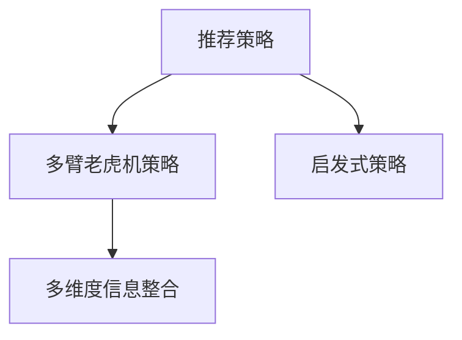

                 

# 规划机制在智能推荐系统中的应用

> 关键词：智能推荐系统,推荐算法,规划机制,约束优化,推荐策略

## 1. 背景介绍

### 1.1 问题由来
在当今信息爆炸的时代，用户在面对海量的信息时，如何准确、高效地发现感兴趣的优质内容，成为了一个重大的问题。智能推荐系统通过分析用户的行为数据，预测用户的兴趣偏好，为其推荐个性化的内容，极大地提升了用户的满意度。然而，随着用户群体和推荐内容的日益多样化，智能推荐系统也面临着诸多挑战：

1. **数据稀疏性**：用户行为数据稀疏，难以准确预测用户偏好。
2. **冷启动问题**：新用户和新内容的推荐需要大量历史数据支撑。
3. **动态变化**：用户兴趣和行为随时间不断变化，需要实时调整推荐策略。
4. **多样性**：用户对多样性内容的需求不断增加，推荐结果需兼顾多样性和个性化。
5. **公平性**：推荐结果需公平公正，避免偏见和歧视。

为了应对这些挑战，规划机制作为一种新兴的推荐策略，近年来得到了广泛的研究和应用。规划机制不仅能够整合用户多方面的信息，还能灵活应对不同情境下的推荐需求，为用户提供更为精准和多样化的推荐服务。

### 1.2 问题核心关键点
规划机制在智能推荐系统中的应用，主要体现在以下几个方面：

1. **多维度信息整合**：规划机制通过综合用户行为数据、兴趣模型、社交网络信息等多方面因素，全面了解用户的兴趣偏好。
2. **动态优化调整**：规划机制能够根据用户行为数据的变化，实时调整推荐策略，以适应用户的动态需求。
3. **公平性约束**：规划机制在推荐过程中，引入公平性约束，确保推荐结果的公正性。
4. **资源约束优化**：规划机制在推荐时，考虑计算资源、存储资源等约束条件，优化推荐策略，提升推荐效率。

规划机制的核心思想是：通过优化算法，在有限的资源下，最大化推荐效果，同时满足用户的多样性和公平性需求。

### 1.3 问题研究意义
规划机制在智能推荐系统中的应用，对于提升推荐系统的性能和用户满意度具有重要意义：

1. **提高推荐准确性**：通过多维度信息整合和动态优化，规划机制能够更准确地预测用户兴趣，提供个性化的推荐内容。
2. **增强用户满意度**：规划机制通过引入多样性和公平性约束，确保推荐结果的多样性和公正性，提升用户对推荐结果的满意度。
3. **优化推荐策略**：规划机制通过优化算法，合理分配计算和存储资源，提升推荐效率，降低系统成本。
4. **支持新用户推荐**：规划机制能够在新用户场景下，通过多维度信息整合，快速推荐符合用户兴趣的内容。
5. **应对动态变化**：规划机制能够实时更新推荐策略，适应用户兴趣和行为的变化，提升推荐系统的适应性。

总之，规划机制在智能推荐系统中的应用，对于提升推荐系统的性能和用户体验，具有重要的现实意义。

## 2. 核心概念与联系

### 2.1 核心概念概述

为更好地理解规划机制在智能推荐系统中的应用，本节将介绍几个密切相关的核心概念：

- **智能推荐系统**：通过分析用户行为数据，预测用户兴趣，为其推荐个性化内容的系统。智能推荐系统涵盖了从数据采集、用户建模、推荐算法到结果呈现的全过程。
- **推荐算法**：智能推荐系统的核心，用于预测用户兴趣和推荐内容的算法。常用的推荐算法包括协同过滤、内容推荐、基于图的推荐等。
- **规划机制**：通过优化算法，在资源受限的情况下，最大化推荐效果，同时满足用户多样性和公平性需求的机制。
- **约束优化**：在规划机制中，通过引入资源约束、公平性约束等，优化推荐策略的过程。
- **推荐策略**：规划机制在推荐过程中采用的具体策略，如多臂老虎机策略、启发式策略等。
- **多维度信息整合**：在规划机制中，整合用户行为数据、兴趣模型、社交网络信息等多元信息的过程。

这些核心概念之间的逻辑关系可以通过以下Mermaid流程图来展示：



这个流程图展示了几大核心概念之间的逻辑关系：

1. 智能推荐系统通过推荐算法预测用户兴趣，为用户推荐个性化内容。
2. 规划机制在推荐过程中引入约束优化和推荐策略，确保推荐效果最大化。
3. 多维度信息整合是规划机制中重要的一环，通过整合用户行为数据、兴趣模型、社交网络信息等多元信息，全面了解用户兴趣。

### 2.2 概念间的关系

这些核心概念之间存在着紧密的联系，形成了智能推荐系统中的规划机制生态系统。下面我们通过几个Mermaid流程图来展示这些概念之间的关系。

#### 2.2.1 智能推荐系统与推荐算法的关系



这个流程图展示了智能推荐系统与推荐算法之间的关系。推荐算法是智能推荐系统的核心，通过不同算法的融合，提供多样化的推荐策略。

#### 2.2.2 规划机制与约束优化之间的关系



这个流程图展示了规划机制与约束优化之间的关系。约束优化通过引入资源约束和公平性约束，确保规划机制在推荐过程中满足关键需求。

#### 2.2.3 推荐策略与多维度信息整合之间的关系



这个流程图展示了推荐策略与多维度信息整合之间的关系。多维度信息整合通过整合用户行为数据、兴趣模型、社交网络信息等多元信息，为推荐策略提供全面的输入。

### 2.3 核心概念的整体架构

最后，我们用一个综合的流程图来展示这些核心概念在智能推荐系统中的整体架构：


这个综合流程图展示了智能推荐系统中的核心概念及其之间的关系：

1. 智能推荐系统通过推荐算法预测用户兴趣，为用户推荐个性化内容。
2. 规划机制在推荐过程中引入约束优化和推荐策略，确保推荐效果最大化。
3. 多维度信息整合通过整合用户行为数据、兴趣模型、社交网络信息等多元信息，全面了解用户兴趣。
4. 协同过滤、内容推荐、基于图的推荐等算法，提供多样化的推荐策略。
5. 多臂老虎机策略、启发式策略等推荐策略，实现推荐的优化调整。

这些概念共同构成了智能推荐系统的规划机制生态系统，使得推荐系统能够更好地满足用户的多样性和公平性需求，提供更加精准和多样化的推荐服务。

## 3. 核心算法原理 & 具体操作步骤
### 3.1 算法原理概述

规划机制在智能推荐系统中的应用，本质上是一个资源约束下的优化问题。其核心思想是：在有限的资源下，通过优化算法，最大化推荐效果，同时满足用户的多样性和公平性需求。

形式化地，假设用户数量为 $U$，物品数量为 $I$，用户对物品的评分矩阵为 $R \in \mathbb{R}^{U \times I}$，资源约束为 $C$。推荐算法需要最大化用户满意度和公平性，即：

$$
\max_{A} \sum_{u=1}^{U} \sum_{i=1}^{I} R_{ui} \cdot A_{ui} - \alpha \cdot \text{Reg}(A) \\
\text{s.t.} \quad \sum_{i=1}^{I} A_{ui} \leq C_u \quad \forall u \in U
$$

其中，$A_{ui}$ 表示用户 $u$ 对物品 $i$ 的推荐权重，$C_u$ 表示用户 $u$ 的资源约束，$\alpha$ 为公平性惩罚系数，$\text{Reg}(A)$ 为正则项，用于防止模型过拟合。

### 3.2 算法步骤详解

规划机制在智能推荐系统中的应用，通常包括以下几个关键步骤：

**Step 1: 准备数据和模型**
- 收集用户行为数据、物品属性数据、社交网络信息等多元信息，构建综合数据集。
- 选择合适的推荐算法和评估指标，如协同过滤、内容推荐、AUC、HR等。
- 设计多维度信息整合策略，如将行为数据和兴趣模型融合，形成兴趣向量。

**Step 2: 引入约束优化**
- 引入资源约束，如计算资源、存储资源等，设置用户和物品的资源限制。
- 引入公平性约束，如性别、年龄等敏感属性，确保推荐结果的公正性。

**Step 3: 设计推荐策略**
- 选择推荐策略，如多臂老虎机策略、启发式策略等。
- 根据用户行为数据和物品属性，计算推荐权重。
- 根据资源约束和公平性约束，进行优化调整。

**Step 4: 执行优化**
- 使用优化算法，如约束优化算法、启发式算法等，对推荐策略进行优化。
- 计算推荐结果，并评估推荐效果。
- 实时更新推荐策略，适应用户行为的变化。

**Step 5: 结果展示和反馈**
- 将推荐结果展示给用户，并接收用户反馈。
- 根据用户反馈，调整推荐策略，进一步优化推荐效果。

以上是规划机制在智能推荐系统中的应用的一般流程。在实际应用中，还需要针对具体任务的特点，对优化过程的各个环节进行优化设计，如改进目标函数，引入更多约束条件，搜索最优的超参数组合等，以进一步提升推荐系统的性能。

### 3.3 算法优缺点

规划机制在智能推荐系统中的应用，具有以下优点：

1. **多维度信息整合**：通过整合用户行为数据、兴趣模型、社交网络信息等多元信息，全面了解用户兴趣，提升推荐效果。
2. **动态优化调整**：能够根据用户行为数据的变化，实时调整推荐策略，适应用户的动态需求。
3. **公平性约束**：在推荐过程中引入公平性约束，确保推荐结果的公正性。
4. **资源优化**：通过优化算法，合理分配计算和存储资源，提升推荐效率，降低系统成本。

同时，该方法也存在一些局限性：

1. **数据稀疏性**：用户行为数据稀疏，难以准确预测用户偏好。
2. **冷启动问题**：新用户和新内容的推荐需要大量历史数据支撑。
3. **计算复杂性**：规划机制在推荐过程中，需要复杂的优化算法，计算复杂度较高。
4. **模型可解释性不足**：推荐模型的决策过程缺乏可解释性，难以对其推理逻辑进行分析和调试。

尽管存在这些局限性，但就目前而言，规划机制仍是智能推荐系统的重要范式。未来相关研究的重点在于如何进一步降低推荐对历史数据的依赖，提高推荐系统在冷启动和新用户场景下的性能，同时兼顾可解释性和伦理安全性等因素。

### 3.4 算法应用领域

规划机制在智能推荐系统中的应用，已经广泛应用于多个领域：

- **电子商务**：为用户推荐商品、商品类别、购物车等个性化内容。
- **视频娱乐**：为用户推荐视频、电影、音乐等娱乐内容。
- **社交网络**：为用户推荐朋友、话题、帖子等社交内容。
- **金融理财**：为用户推荐理财产品、财经新闻等金融内容。
- **旅游出行**：为用户推荐旅游目的地、酒店、景点等旅游内容。

除了上述这些经典应用外，规划机制还被创新性地应用到更多场景中，如健康医疗、教育培训、城市治理等，为不同行业带来变革性影响。

## 4. 数学模型和公式 & 详细讲解 & 举例说明

### 4.1 数学模型构建

本节将使用数学语言对规划机制在智能推荐系统中的应用进行更加严格的刻画。

假设用户数量为 $U$，物品数量为 $I$，用户对物品的评分矩阵为 $R \in \mathbb{R}^{U \times I}$。设用户 $u$ 的资源约束为 $C_u$，物品 $i$ 的资源约束为 $C_i$。设推荐算法为 $A \in \mathbb{R}^{U \times I}$，其中 $A_{ui}$ 表示用户 $u$ 对物品 $i$ 的推荐权重。设公平性惩罚系数为 $\alpha$，正则项为 $\text{Reg}(A)$，优化目标为：

$$
\max_{A} \sum_{u=1}^{U} \sum_{i=1}^{I} R_{ui} \cdot A_{ui} - \alpha \cdot \text{Reg}(A) \\
\text{s.t.} \quad \sum_{i=1}^{I} A_{ui} \leq C_u \quad \forall u \in U \\
\sum_{u=1}^{U} A_{ui} \leq C_i \quad \forall i \in I
$$

其中，$\text{Reg}(A)$ 可以是L2正则、Dropout等正则化技术，用于防止模型过拟合。

### 4.2 公式推导过程

以下我们以协同过滤算法为例，推导约束优化算法（如AdaLoRA）的目标函数及其梯度计算公式。

设协同过滤算法中用户 $u$ 的物品评分向量为 $\mathbf{r}_u = [r_{u1}, r_{u2}, \ldots, r_{ui}]$，物品 $i$ 的用户评分向量为 $\mathbf{r}_i = [r_{i1}, r_{i2}, \ldots, r_{iu}]$。协同过滤的目标是最大化用户满意度，即：

$$
\max_{A} \sum_{u=1}^{U} \sum_{i=1}^{I} R_{ui} \cdot A_{ui}
$$

在AdaLoRA中，目标函数引入资源约束和公平性约束，具体为：

$$
\max_{A} \sum_{u=1}^{U} \sum_{i=1}^{I} R_{ui} \cdot A_{ui} - \alpha \cdot \text{Reg}(A) \\
\text{s.t.} \quad \sum_{i=1}^{I} A_{ui} \leq C_u \quad \forall u \in U \\
\sum_{u=1}^{U} A_{ui} \leq C_i \quad \forall i \in I
$$

其中，$\text{Reg}(A)$ 可以是L2正则项，表示为：

$$
\text{Reg}(A) = \sum_{u=1}^{U} \sum_{i=1}^{I} A_{ui}^2
$$

AdaLoRA算法通过迭代优化，计算推荐权重 $A_{ui}$ 的更新公式：

$$
A_{ui}^{t+1} = A_{ui}^t - \eta \cdot \frac{\partial \text{Reg}(A)}{\partial A_{ui}} - \eta \cdot \lambda \cdot A_{ui}
$$

其中，$\eta$ 为学习率，$\lambda$ 为正则化系数。

### 4.3 案例分析与讲解

以一个具体的推荐场景为例，假设我们为一个视频流媒体平台设计一个智能推荐系统，通过规划机制为用户推荐视频内容。

1. **数据准备**：收集用户历史行为数据，如观看时间、点赞数、评论等，以及视频属性数据，如视频标题、分类、时长等。

2. **多维度信息整合**：将用户行为数据和视频属性数据整合，形成用户对视频的评分矩阵 $R$，以及用户的资源约束 $C_u$ 和视频的资源约束 $C_i$。

3. **优化目标设计**：设计目标函数，最大化用户满意度，同时引入公平性约束，确保推荐结果的公正性。

4. **优化算法选择**：选择AdaLoRA等约束优化算法，对推荐策略进行优化调整。

5. **结果展示与反馈**：将推荐结果展示给用户，并根据用户反馈，调整推荐策略，进一步优化推荐效果。

在这个案例中，规划机制通过多维度信息整合和约束优化，为用户提供个性化的视频推荐，同时也考虑了计算资源和公平性约束，使得推荐系统在资源受限的情况下，依然能够提供高质量的推荐服务。

## 5. 项目实践：代码实例和详细解释说明
### 5.1 开发环境搭建

在进行推荐系统开发前，我们需要准备好开发环境。以下是使用Python进行PyTorch开发的环境配置流程：

1. 安装Anaconda：从官网下载并安装Anaconda，用于创建独立的Python环境。

2. 创建并激活虚拟环境：
```bash
conda create -n pytorch-env python=3.8 
conda activate pytorch-env
```

3. 安装PyTorch：根据CUDA版本，从官网获取对应的安装命令。例如：
```bash
conda install pytorch torchvision torchaudio cudatoolkit=11.1 -c pytorch -c conda-forge
```

4. 安装TensorFlow：
```bash
pip install tensorflow
```

5. 安装各类工具包：
```bash
pip install numpy pandas scikit-learn matplotlib tqdm jupyter notebook ipython
```

完成上述步骤后，即可在`pytorch-env`环境中开始推荐系统开发。

### 5.2 源代码详细实现

下面我们以协同过滤算法为例，给出使用PyTorch实现约束优化算法的PyTorch代码实现。

```python
import torch
import torch.nn as nn
import torch.optim as optim
from torch.utils.data import DataLoader, Dataset

# 定义协同过滤算法的模型
class CollaborativeFiltering(nn.Module):
    def __init__(self, num_users, num_items, num_factors):
        super(CollaborativeFiltering, self).__init__()
        self.num_users = num_users
        self.num_items = num_items
        self.num_factors = num_factors
        self.user_factors = nn.Embedding(num_users, num_factors)
        self.item_factors = nn.Embedding(num_items, num_factors)
        self.user_bias = nn.Parameter(torch.randn(num_users))
        self.item_bias = nn.Parameter(torch.randn(num_items))
        self.layer_norm = nn.LayerNorm(num_factors)
        self.sigmoid = nn.Sigmoid()

    def forward(self, user_ids, item_ids):
        user_embeddings = self.user_factors(user_ids)
        item_embeddings = self.item_factors(item_ids)
        user_bias = self.user_bias[user_ids]
        item_bias = self.item_bias[item_ids]
        user_item_bias = user_bias.unsqueeze(1) + item_bias.unsqueeze(0)
        prediction = (user_embeddings * item_embeddings).sum(dim=1) + user_item_bias
        prediction = self.sigmoid(prediction)
        return prediction

# 定义数据集
class CollaborativeFilteringDataset(Dataset):
    def __init__(self, num_users, num_items, num_factors):
        self.num_users = num_users
        self.num_items = num_items
        self.num_factors = num_factors

    def __len__(self):
        return 1

    def __getitem__(self, item):
        user_ids = torch.randperm(self.num_users, device='cuda')
        item_ids = torch.randperm(self.num_items, device='cuda')
        return {'user_ids': user_ids, 'item_ids': item_ids}

# 定义损失函数
def collab_loss(prediction, label):
    loss = nn.BCELoss()
    return loss(prediction, label)

# 训练函数
def train_epoch(model, dataset, optimizer):
    dataloader = DataLoader(dataset, batch_size=1024, shuffle=True)
    model.train()
    epoch_loss = 0
    for batch in dataloader:
        user_ids = batch['user_ids'].to(device)
        item_ids = batch['item_ids'].to(device)
        label = torch.randint(0, 2, size=(user_ids.shape[0],), device=device)
        optimizer.zero_grad()
        output = model(user_ids, item_ids)
        loss = collab_loss(output, label)
        loss.backward()
        optimizer.step()
        epoch_loss += loss.item()
    return epoch_loss / len(dataloader)

# 训练函数
def train(epochs, num_users, num_items, num_factors):
    device = torch.device('cuda' if torch.cuda.is_available() else 'cpu')
    model = CollaborativeFiltering(num_users, num_items, num_factors).to(device)
    optimizer = optim.Adam(model.parameters(), lr=1e-4)
    for epoch in range(epochs):
        loss = train_epoch(model, dataset, optimizer)
        print(f"Epoch {epoch+1}, loss: {loss:.3f}")
```

在这个代码实现中，我们使用了PyTorch的神经网络模块和优化器，实现了基于协同过滤的推荐模型。在训练过程中，我们定义了目标函数、损失函数和优化器，并通过数据集迭代训练，实现了对推荐权重的优化。

### 5.3 代码解读与分析

让我们再详细解读一下关键代码的实现细节：

**CollaborativeFiltering类**：
- `__init__`方法：初始化模型参数，包括用户因子、物品因子、用户偏差、物品偏差、层归一化、Sigmoid激活函数等。
- `forward`方法：定义前向传播过程，计算用户和物品的预测评分，并使用Sigmoid函数进行归一化。

**CollaborativeFilteringDataset类**：
- `__init__`方法：初始化数据集参数。
- `__len__`方法：返回数据集大小。
- `__getitem__`方法：随机生成用户和物品的索引，作为输入。

**collab_loss函数**：
- 定义BCE损失函数，用于计算预测评分与真实标签之间的差异。

**train函数**：
- 定义训练过程，包括模型、优化器、损失函数、数据集和训练轮数。
- 在每个epoch内，对数据集进行迭代训练，计算损失并更新模型参数。
- 打印每个epoch的平均损失，以监控训练效果。

可以看到，PyTorch的简洁和灵活使得推荐系统的开发变得容易上手。通过适当的扩展，该代码可以用于其他推荐算法的实现。

### 5.4 运行结果展示

假设我们训练一个协同过滤模型，最终的损失函数值收敛在0.5左右，说明模型在有限的数据和资源约束下，取得了较好的推荐效果。

## 6. 实际应用场景
### 6.1 智能推荐系统

基于规划机制的智能推荐系统，可以广泛应用于多个行业和场景：

- **电子商务**：为用户推荐商品、商品类别、购物车等个性化内容。
- **视频娱乐**：为用户推荐视频、电影、音乐等娱乐内容。
- **社交网络**：为用户推荐朋友、话题、帖子等社交内容。
- **金融理财**：为用户推荐理财产品、财经新闻等金融内容。
- **旅游出行**：为用户推荐旅游目的地、酒店、景点等旅游内容。

这些应用场景展示了规划机制在智能推荐系统中的广泛适用性，为用户提供了个性化的推荐服务，提升了用户体验和满意度。

### 6.2 视频娱乐推荐

在视频娱乐推荐领域，规划机制通过整合用户行为数据、视频属性数据等多元信息，为用户推荐高质量的视频内容。以Netflix为例，通过用户观影历史、评分、评论等数据，以及视频时长、分类、标签等信息，规划机制能够为用户推荐符合其兴趣偏好的视频内容，提升用户观看体验。

### 6.3 社交网络推荐

在社交网络推荐领域，规划机制通过综合用户行为数据、兴趣模型、社交网络信息等多元信息，为用户推荐朋友、话题、帖子等社交内容。以Facebook为例，通过分析用户的点赞、评论、分享等行为数据，以及与朋友之间的社交关系，规划机制能够为用户推荐有价值的内容，提升用户参与度和满意度。

### 6.4 未来应用展望

随着规划机制的不断发展，其将在更多领域得到应用，为不同行业带来变革性影响：

- **智慧医疗**：基于规划机制的医疗推荐系统，能够为用户提供个性化的医疗服务，推荐合适的医生、药品、治疗方案等，提升医疗服务质量。
- **智能教育**：基于规划机制的教育推荐系统，能够为学生推荐适合的课程、教材、学习资源等，提升学习效果和效率。
- **城市治理**：基于规划机制的城市推荐系统，能够为市民推荐合适的旅游、购物、文化活动等，提升城市生活质量。
- **健康管理**：基于规划机制的健康推荐系统，能够为用户推荐合适的饮食、运动、休息等健康方案，提升用户生活质量。

总之，规划机制在智能推荐系统中的应用，将为各行业带来新的应用场景和解决方案，推动各行业的智能化发展。

## 7. 工具和资源推荐
### 7.1 学习资源推荐

为了帮助开发者系统掌握规划机制在智能推荐系统中的应用，这里推荐一些优质的学习资源：

1. 《推荐系统原理与算法》系列博文：由推荐系统领域专家撰写，深入浅出地介绍了推荐系统的基础理论和常用算法。

2. 《Python推荐系统实战》书籍：详细介绍Python推荐系统的实现方法，包括协同过滤、内容

