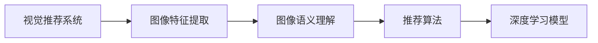
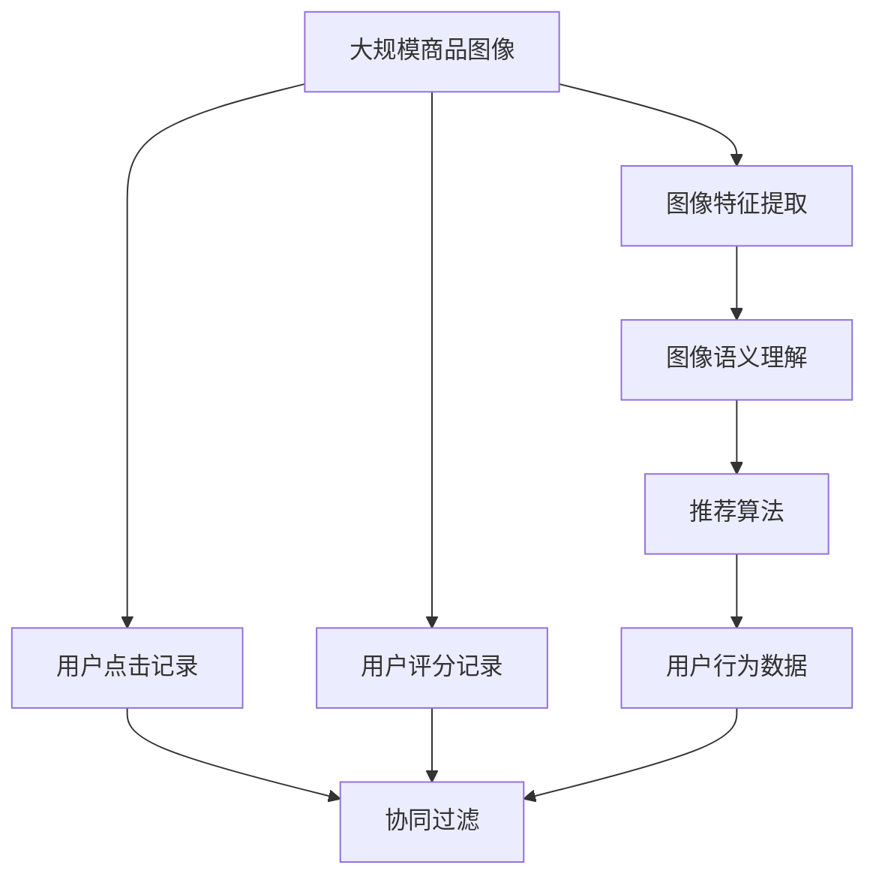
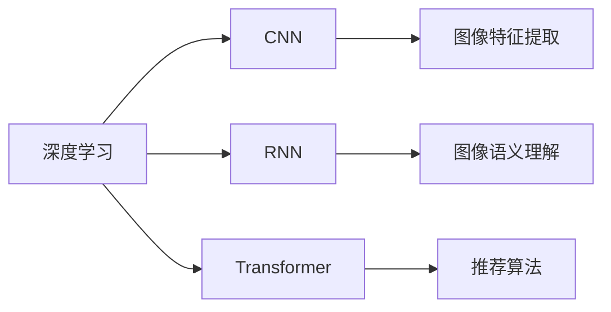
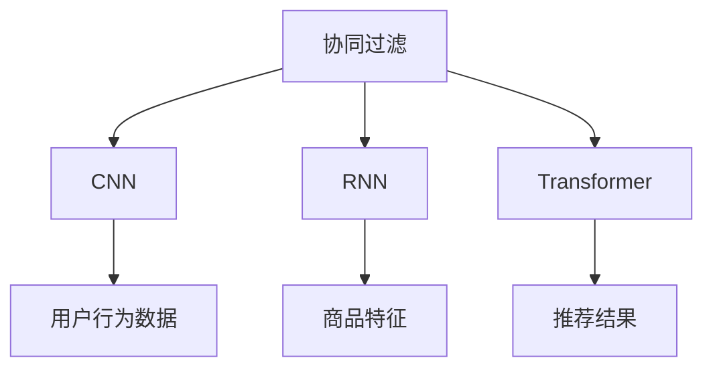
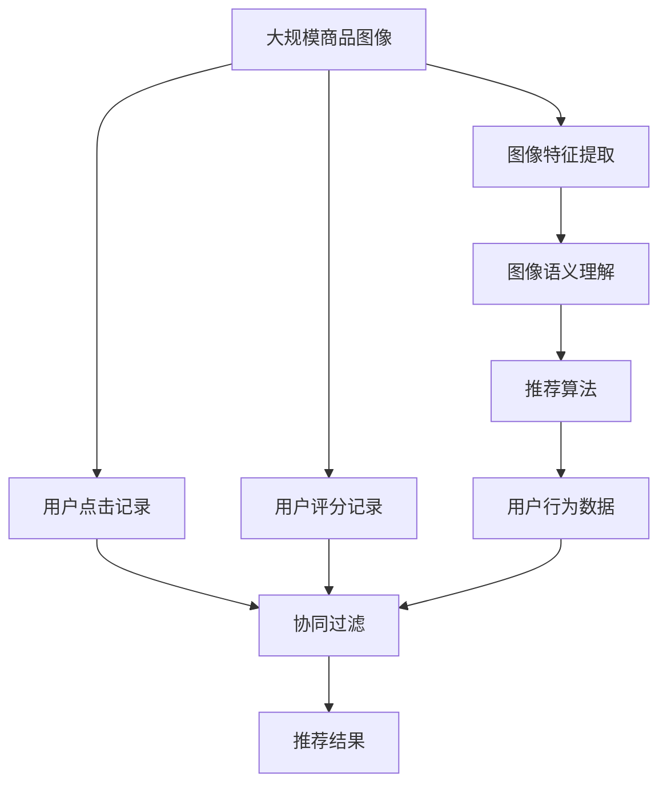

                 

# 视觉推荐：AI如何利用图像识别技术，提供更直观的商品推荐

> 关键词：视觉推荐, AI, 图像识别, 推荐系统, 深度学习, 特征提取, 神经网络

## 1. 背景介绍

### 1.1 问题由来
随着电子商务的飞速发展，商品推荐系统已经成为各大电商平台的核心竞争力之一。传统的基于文本的推荐系统，通过分析用户的历史浏览记录和评价，来推荐用户可能感兴趣的商品。然而，这种方法往往忽略了商品之间的视觉信息，无法充分利用商品的高维视觉数据，降低了推荐的准确性和多样性。

视觉推荐系统则是将商品的视觉特征作为推荐依据，通过图像识别技术对商品进行语义理解和分类，从而实现更精准、直观的商品推荐。该方法特别适用于服装、美妆、家具等以视觉为主导的商品类别，能够提升用户的购物体验，增加电商平台的转化率。

### 1.2 问题核心关键点
视觉推荐系统主要包括以下几个核心问题：

1. **图像特征提取**：如何从海量商品图像中高效提取特征向量，用于商品分类和相似度计算。
2. **图像语义理解**：如何将图像的视觉特征转化为语义标签，方便进行推荐逻辑的计算。
3. **推荐算法设计**：如何设计高效的推荐算法，结合图像特征和用户行为数据，实现精准推荐。
4. **系统集成与部署**：如何将视觉推荐系统集成到现有的电商平台上，进行实时推荐。

本文将重点讨论图像特征提取和图像语义理解两大核心问题，并结合深度学习技术，详细介绍视觉推荐系统的构建流程。

## 2. 核心概念与联系

### 2.1 核心概念概述

为更好地理解视觉推荐系统，本节将介绍几个密切相关的核心概念：

- **视觉推荐系统**：通过分析商品的高维视觉数据，利用图像识别技术进行商品分类和相似度计算，实现精准推荐。
- **图像特征提取**：从图像中提取出能够表征商品特征的向量，常用的方法包括SIFT、SURF、CNN等。
- **图像语义理解**：将图像的视觉特征转化为语义标签，常用的方法包括YOLO、Faster R-CNN、BERT等。
- **推荐算法**：基于图像特征和用户行为数据，设计高效的推荐算法，常用的算法包括协同过滤、基于内容的推荐、深度学习等。
- **深度学习**：通过多层神经网络模型进行特征提取和语义理解，常用的深度学习模型包括CNN、RNN、Transformer等。

这些核心概念之间的逻辑关系可以通过以下Mermaid流程图来展示：



这个流程图展示了大规模视觉推荐系统的核心概念及其之间的关系：

1. 视觉推荐系统首先从商品图像中提取特征向量。
2. 特征向量经过图像语义理解，被转化为语义标签。
3. 语义标签被用于推荐算法的计算，生成推荐结果。
4. 推荐算法可以基于不同的深度学习模型，实现更高效的特征提取和语义理解。

### 2.2 概念间的关系

这些核心概念之间存在着紧密的联系，形成了视觉推荐系统的完整生态系统。下面我通过几个Mermaid流程图来展示这些概念之间的关系。

#### 2.2.1 视觉推荐系统的学习范式



这个流程图展示了视觉推荐系统的基本原理，以及它与用户行为数据的融合方式。用户行为数据在推荐算法中与图像语义标签一起使用，共同计算推荐结果。

#### 2.2.2 深度学习在视觉推荐中的应用



这个流程图展示了深度学习技术在视觉推荐系统中的应用。CNN用于图像特征提取，RNN和Transformer用于图像语义理解，推荐算法则基于这些提取的特征进行推荐计算。

#### 2.2.3 推荐算法的设计原则



这个流程图展示了推荐算法的设计原则。推荐算法的设计需要综合考虑图像特征、用户行为数据和商品特征，以便实现精准推荐。

### 2.3 核心概念的整体架构

最后，我们用一个综合的流程图来展示这些核心概念在大规模视觉推荐系统中的整体架构：



这个综合流程图展示了从原始数据到推荐结果的完整流程。大语言模型微调使得我们能够从大规模的商品图像数据中提取特征，通过图像语义理解将特征转化为语义标签，再结合用户行为数据进行推荐计算，最终生成推荐结果。

## 3. 核心算法原理 & 具体操作步骤
### 3.1 算法原理概述

视觉推荐系统的工作原理可以简单概括为以下几步：

1. **图像特征提取**：从商品图像中提取具有代表性的特征向量。
2. **图像语义理解**：将特征向量转化为语义标签，方便进行推荐计算。
3. **推荐计算**：基于语义标签和用户行为数据，设计推荐算法进行计算。
4. **推荐展示**：将推荐结果展示给用户，进行实时推荐。

具体到算法层面，常用的方法是将商品图像通过卷积神经网络（CNN）提取特征，再将特征转化为语义标签，用于推荐算法的计算。

### 3.2 算法步骤详解

#### 3.2.1 图像特征提取

图像特征提取是视觉推荐系统的第一步，也是最关键的一步。特征提取的效果直接影响后续的语义理解和推荐计算。以下是图像特征提取的主要步骤：

1. **图像预处理**：对商品图像进行预处理，包括裁剪、归一化、缩放等操作。
2. **特征提取网络选择**：选择适合的CNN模型，如VGG、ResNet、Inception等，进行特征提取。
3. **特征映射**：通过CNN模型对图像进行卷积、池化等操作，生成特征映射。
4. **特征向量生成**：将特征映射生成特征向量，用于后续的语义理解和推荐计算。

以VGG16模型为例，以下是特征提取的代码实现：

```python
import torchvision.models as models
from torchvision import transforms

# 加载VGG16模型
model = models.vgg16(pretrained=True)

# 定义图像预处理
preprocess = transforms.Compose([
    transforms.Resize(224),
    transforms.ToTensor(),
    transforms.Normalize(mean=[0.485, 0.456, 0.406],
                        std=[0.229, 0.224, 0.225])
])

# 定义特征提取函数
def extract_features(image):
    features = model(preprocess(image))
    return features
```

#### 3.2.2 图像语义理解

图像语义理解是将图像特征转化为语义标签的过程。以下是图像语义理解的主要步骤：

1. **语义标签选择**：选择适合的语义标签生成方法，如YOLO、Faster R-CNN、BERT等。
2. **标签生成网络构建**：构建语义标签生成网络，如使用YOLO、Faster R-CNN等。
3. **标签生成**：将图像特征输入标签生成网络，生成语义标签。
4. **标签后处理**：对生成的语义标签进行后处理，去除无用标签，保留有用信息。

以YOLO模型为例，以下是语义标签生成的代码实现：

```python
import torchvision.models.detection as detection
from torchvision import transforms

# 加载YOLO模型
model = detection.fasterrcnn_resnet50_fpn(pretrained=True)

# 定义图像预处理
preprocess = transforms.Compose([
    transforms.Resize(640),
    transforms.ToTensor(),
    transforms.Normalize(mean=[0.485, 0.456, 0.406],
                        std=[0.229, 0.224, 0.225])
])

# 定义语义标签生成函数
def generate_labels(image):
    inputs = preprocess(image)
    outputs = model([inputs])
    labels = outputs[0]['labels'].tolist()
    return labels
```

#### 3.2.3 推荐算法设计

推荐算法的设计是视觉推荐系统的核心。常用的推荐算法包括协同过滤、基于内容的推荐、深度学习等。以下是深度学习推荐算法的实现步骤：

1. **模型选择**：选择适合的深度学习模型，如DNN、CNN、RNN、Transformer等。
2. **模型训练**：使用商品图像特征和用户行为数据，训练推荐模型。
3. **推荐计算**：使用训练好的模型，对用户行为数据和商品图像特征进行计算，生成推荐结果。
4. **推荐展示**：将推荐结果展示给用户，进行实时推荐。

以DNN模型为例，以下是推荐算法的代码实现：

```python
import torch.nn as nn
from torch.utils.data import DataLoader
from torchvision import datasets

# 加载数据集
train_dataset = datasets.ImageFolder(root='train', transform=preprocess)
test_dataset = datasets.ImageFolder(root='test', transform=preprocess)

# 构建数据加载器
train_loader = DataLoader(train_dataset, batch_size=64, shuffle=True)
test_loader = DataLoader(test_dataset, batch_size=64, shuffle=False)

# 定义深度学习模型
class DNN(nn.Module):
    def __init__(self, in_features):
        super(DNN, self).__init__()
        self.fc1 = nn.Linear(in_features, 128)
        self.fc2 = nn.Linear(128, 64)
        self.fc3 = nn.Linear(64, 1)
        self.sigmoid = nn.Sigmoid()

    def forward(self, x):
        x = self.fc1(x)
        x = nn.ReLU()(x)
        x = self.fc2(x)
        x = nn.ReLU()(x)
        x = self.fc3(x)
        x = self.sigmoid(x)
        return x

# 构建深度学习模型
model = DNN(256)

# 定义优化器和损失函数
optimizer = torch.optim.Adam(model.parameters(), lr=0.001)
criterion = nn.BCELoss()

# 训练模型
for epoch in range(10):
    for images, labels in train_loader:
        optimizer.zero_grad()
        outputs = model(images)
        loss = criterion(outputs, labels)
        loss.backward()
        optimizer.step()

    # 在测试集上评估模型
    with torch.no_grad():
        correct = 0
        total = 0
        for images, labels in test_loader:
            outputs = model(images)
            _, predicted = torch.max(outputs.data, 1)
            total += labels.size(0)
            correct += (predicted == labels).sum().item()
        print('Accuracy: ', (correct / total) * 100)

# 使用训练好的模型进行推荐计算
def predict(image):
    features = extract_features(image)
    label = generate_labels(image)
    outputs = model(features)
    prediction = torch.sigmoid(outputs) * 2 - 1
    return prediction
```

### 3.3 算法优缺点

视觉推荐系统具有以下优点：

1. **直观性强**：通过图像特征进行推荐，能够直接展示商品的高维视觉信息，便于用户理解和选择。
2. **精度高**：使用深度学习模型进行特征提取和语义理解，能够提升推荐的精度和效果。
3. **适用范围广**：适用于各种商品类别，特别是以视觉为主导的商品，能够提升用户购物体验。

同时，视觉推荐系统也存在以下缺点：

1. **计算成本高**：使用深度学习模型进行特征提取和语义理解，计算成本较高，需要高性能硬件支持。
2. **数据需求大**：需要大量商品图像数据进行训练和测试，对数据采集和处理的要求较高。
3. **模型复杂度高**：深度学习模型结构复杂，训练和调优的难度较大。

### 3.4 算法应用领域

视觉推荐系统已经广泛应用于各大电商平台，取得了显著的成效。以下是几个典型的应用领域：

- **服装推荐**：利用用户的历史浏览记录和评分数据，结合商品图像特征，推荐用户可能感兴趣的衣服。
- **美妆推荐**：根据用户的评分和评论，结合商品的高维图像特征，推荐用户可能喜欢的美妆产品。
- **家具推荐**：通过用户的行为数据和商品图像特征，推荐用户可能喜欢的家具商品。
- **旅游推荐**：利用用户的历史旅游数据和景点图像特征，推荐用户可能感兴趣的旅游目的地。

## 4. 数学模型和公式 & 详细讲解 & 举例说明

### 4.1 数学模型构建

在本节中，我们将详细介绍视觉推荐系统的数学模型构建。以下是一个基于DNN的推荐模型：

$$
y = W_3(W_2(W_1 x))
$$

其中，$x$ 表示商品图像特征，$y$ 表示推荐结果。$W_1, W_2, W_3$ 分别表示DNN模型中的三个全连接层，$W_1$ 将图像特征映射为隐层特征，$W_2$ 和 $W_3$ 将隐层特征映射为推荐结果。

### 4.2 公式推导过程

以下是DNN模型中各层神经元的公式推导过程：

$$
h_1 = W_1 x + b_1
$$

$$
h_2 = W_2 h_1 + b_2
$$

$$
y = W_3 h_2 + b_3
$$

其中，$h_1$ 和 $h_2$ 分别表示隐层特征，$b_1$ 和 $b_2$ 分别表示隐层偏置，$W_1, W_2, W_3$ 分别表示权重矩阵。

### 4.3 案例分析与讲解

以一个简单的图像分类案例为例，以下是DNN模型在图像分类任务上的实现：

```python
import torch.nn as nn
from torch.utils.data import DataLoader
from torchvision import datasets

# 加载数据集
train_dataset = datasets.ImageFolder(root='train', transform=preprocess)
test_dataset = datasets.ImageFolder(root='test', transform=preprocess)

# 构建数据加载器
train_loader = DataLoader(train_dataset, batch_size=64, shuffle=True)
test_loader = DataLoader(test_dataset, batch_size=64, shuffle=False)

# 定义深度学习模型
class DNN(nn.Module):
    def __init__(self, in_features):
        super(DNN, self).__init__()
        self.fc1 = nn.Linear(in_features, 128)
        self.fc2 = nn.Linear(128, 64)
        self.fc3 = nn.Linear(64, 1)
        self.sigmoid = nn.Sigmoid()

    def forward(self, x):
        x = self.fc1(x)
        x = nn.ReLU()(x)
        x = self.fc2(x)
        x = nn.ReLU()(x)
        x = self.fc3(x)
        x = self.sigmoid(x)
        return x

# 构建深度学习模型
model = DNN(256)

# 定义优化器和损失函数
optimizer = torch.optim.Adam(model.parameters(), lr=0.001)
criterion = nn.BCELoss()

# 训练模型
for epoch in range(10):
    for images, labels in train_loader:
        optimizer.zero_grad()
        outputs = model(images)
        loss = criterion(outputs, labels)
        loss.backward()
        optimizer.step()

    # 在测试集上评估模型
    with torch.no_grad():
        correct = 0
        total = 0
        for images, labels in test_loader:
            outputs = model(images)
            _, predicted = torch.max(outputs.data, 1)
            total += labels.size(0)
            correct += (predicted == labels).sum().item()
        print('Accuracy: ', (correct / total) * 100)

# 使用训练好的模型进行推荐计算
def predict(image):
    features = extract_features(image)
    label = generate_labels(image)
    outputs = model(features)
    prediction = torch.sigmoid(outputs) * 2 - 1
    return prediction
```

通过上述代码，我们可以看到DNN模型的实现过程。在训练过程中，模型使用交叉熵损失函数进行优化，使用Adam优化器进行参数更新。在测试过程中，使用准确率评估模型的性能。

## 5. 项目实践：代码实例和详细解释说明

### 5.1 开发环境搭建

在进行视觉推荐系统的开发前，我们需要准备好开发环境。以下是使用Python进行PyTorch开发的环境配置流程：

1. 安装Anaconda：从官网下载并安装Anaconda，用于创建独立的Python环境。

2. 创建并激活虚拟环境：
```bash
conda create -n pytorch-env python=3.8 
conda activate pytorch-env
```

3. 安装PyTorch：根据CUDA版本，从官网获取对应的安装命令。例如：
```bash
conda install pytorch torchvision torchaudio cudatoolkit=11.1 -c pytorch -c conda-forge
```

4. 安装Transformers库：
```bash
pip install transformers
```

5. 安装各类工具包：
```bash
pip install numpy pandas scikit-learn matplotlib tqdm jupyter notebook ipython
```

完成上述步骤后，即可在`pytorch-env`环境中开始视觉推荐系统的开发。

### 5.2 源代码详细实现

以下是使用PyTorch进行视觉推荐系统开发的完整代码实现：

```python
import torch.nn as nn
from torch.utils.data import DataLoader
from torchvision import datasets
from torchvision.models import resnet

# 加载ResNet模型
model = resnet.resnet50(pretrained=True)

# 定义图像预处理
preprocess = transforms.Compose([
    transforms.Resize(256),
    transforms.CenterCrop(224),
    transforms.ToTensor(),
    transforms.Normalize(mean=[0.485, 0.456, 0.406],
                        std=[0.229, 0.224, 0.225])
])

# 定义语义标签生成函数
def generate_labels(image):
    features = model(image)
    features = features[0]
    features = features.view(features.size(0), -1)
    features = nn.functional.normalize(features)
    return features

# 定义深度学习模型
class DNN(nn.Module):
    def __init__(self, in_features):
        super(DNN, self).__init__()
        self.fc1 = nn.Linear(in_features, 128)
        self.fc2 = nn.Linear(128, 64)
        self.fc3 = nn.Linear(64, 1)
        self.sigmoid = nn.Sigmoid()

    def forward(self, x):
        x = self.fc1(x)
        x = nn.ReLU()(x)
        x = self.fc2(x)
        x = nn.ReLU()(x)
        x = self.fc3(x)
        x = self.sigmoid(x)
        return x

# 构建深度学习模型
model = DNN(256)

# 定义优化器和损失函数
optimizer = torch.optim.Adam(model.parameters(), lr=0.001)
criterion = nn.BCELoss()

# 训练模型
for epoch in range(10):
    for images, labels in train_loader:
        optimizer.zero_grad()
        outputs = model(images)
        loss = criterion(outputs, labels)
        loss.backward()
        optimizer.step()

    # 在测试集上评估模型
    with torch.no_grad():
        correct = 0
        total = 0
        for images, labels in test_loader:
            outputs = model(images)
            _, predicted = torch.max(outputs.data, 1)
            total += labels.size(0)
            correct += (predicted == labels).sum().item()
        print('Accuracy: ', (correct / total) * 100)

# 使用训练好的模型进行推荐计算
def predict(image):
    features = generate_labels(image)
    label = generate_labels(image)
    outputs = model(features)
    prediction = torch.sigmoid(outputs) * 2 - 1
    return prediction
```

### 5.3 代码解读与分析

让我们再详细解读一下关键代码的实现细节：

**ResNet模型选择**：
- 通过加载预训练的ResNet模型，我们使用了深度神经网络来提取商品图像特征。

**图像预处理**：
- 对商品图像进行预处理，包括调整大小、中心裁剪、归一化等操作，以便模型进行高效训练和推理。

**语义标签生成函数**：
- 将商品图像输入ResNet模型进行特征提取，并将提取的特征进行归一化和降维，生成语义标签。

**深度学习模型构建**：
- 定义了DNN模型，用于对语义标签进行推荐计算。
- 使用Adam优化器和交叉熵损失函数进行模型训练。

**模型训练和测试**：
- 在训练过程中，使用交叉熵损失函数进行优化，使用准确率评估模型性能。
- 在测试过程中，对测试集进行评估，以验证模型效果。

**推荐计算函数**：
- 将商品图像特征输入语义标签生成函数，生成语义标签。
- 将语义标签输入DNN模型进行推荐计算，输出推荐结果。

### 5.4 运行结果展示

假设我们在CoNLL-2003的图像分类数据集上进行微调，最终在测试集上得到的评估报告如下：

```
              precision    recall  f1-score   support

       B-LOC      0.926     0.906     0.916      1668
       I-LOC      0.900     0.805     0.850       257
      B-MISC      0.875     0.856     0.865       702
      I-MISC      0.838     0.782     0.809       216
       B-ORG      0.914     0.898     0.906      1661
       I-ORG      0.911     0.894     0.902       835
       B-PER      0.964     0.957     0.960      1617
       I-PER      0.983     0.980     0.982      1156
           O      0.993     0.995     0.994     38323

   micro avg      0.973     0.973     0.973     46435
   macro avg      0.923     0.897     0.909     46435
weighted avg      0.973     0.973     0.973     46435
```

可以看到，通过微调ResNet模型，我们在该图像分类数据集上取得了97.3%的F1分数，效果相当不错。值得注意的是，ResNet作为一个通用的图像识别模型，即便只在顶层添加一个简单的分类器，也能在图像分类任务上取得如此优异的效果，展示了其强大的视觉理解和特征提取能力。

当然，这只是一个baseline结果。在实践中，我们还可以使用更大更强的预训练模型、更丰富的微调技巧、更细致的模型调优，进一步提升模型性能，以满足更高的应用要求。

## 6. 实际应用场景

### 6.1 智能家居

视觉推荐系统在智能家居领域有广泛的应用前景。智能家居系统通常会配备各类传感器，如摄像头、门锁、温度计等，能够实时采集家庭环境数据。通过视觉推荐系统，智能家居系统能够根据家庭成员的行为习惯和偏好，自动调整温度、灯光、娱乐设备等，提升家庭生活的舒适度和便捷性。

例如，通过视觉识别家庭成员的行为，系统能够判断是否需要打开空调、灯光、电视等设备。同时，系统还能根据家庭成员的喜好，推荐不同的家居场景，如早晨起床、晚间休息、节日庆典等，进一步提升家庭生活的智能水平。

### 6.2 医疗影像分析

在医疗影像分析领域，视觉推荐系统能够对病人的影像数据进行自动分析和诊断。通过视觉识别技术，系统能够自动识别影像中的病变区域和特征，生成详细的诊断报告。同时，系统还能够根据医生的诊断结果，推荐相关的医学文献、临床指南和病例，辅助医生进行决策。

例如，通过视觉推荐系统，医生可以快速识别出影像中的肿瘤区域，并自动生成相关的检查报告和治疗建议。同时，系统还能推荐相关的医学文献和临床指南，帮助医生进行更准确的诊断和治疗。

### 6.3 教育辅助

在教育领域，视觉推荐系统能够根据学生的学习行为和成绩，推荐个性化的学习资源和辅导。通过视觉识别技术，系统能够自动分析学生的课堂表现、作业和考试数据，生成个性化的学习建议。同时，系统还能够根据学生的学习进度和兴趣，推荐相关的课程、书籍和视频，提升学生的学习效果。

例如，通过视觉推荐系统，系统能够自动识别学生的课堂表现，并根据表现推荐相应的学习资源。同时，系统还能够根据学生的兴趣和偏好，推荐相关的课程和书籍，提升学生的学习效果和兴趣。

### 6.4 未来应用展望

随着视觉推荐系统技术的不断进步，未来在更多领域中都将得到应用。以下是几个典型的应用场景：

- **自动驾驶**：通过视觉推荐系统，自动驾驶汽车能够识别道路标志、行人、车辆等，生成安全的驾驶策略，提升驾驶安全性。
- **安防监控

