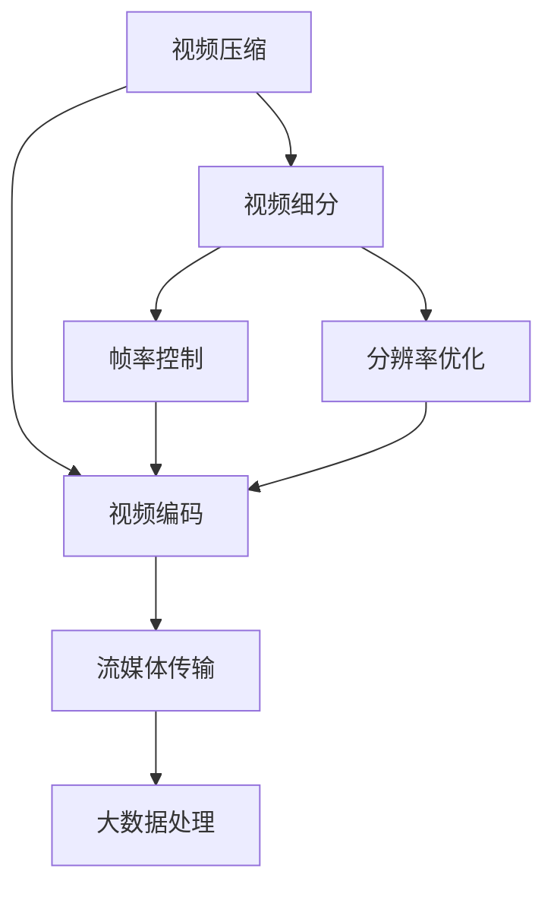
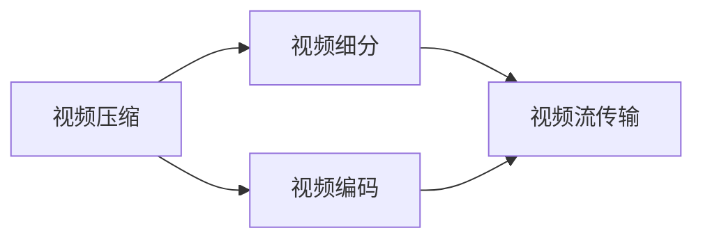
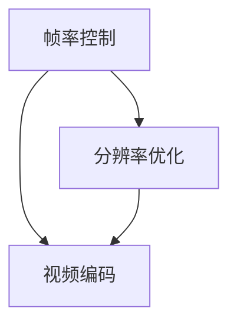
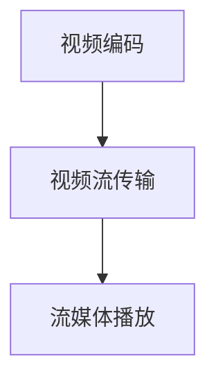
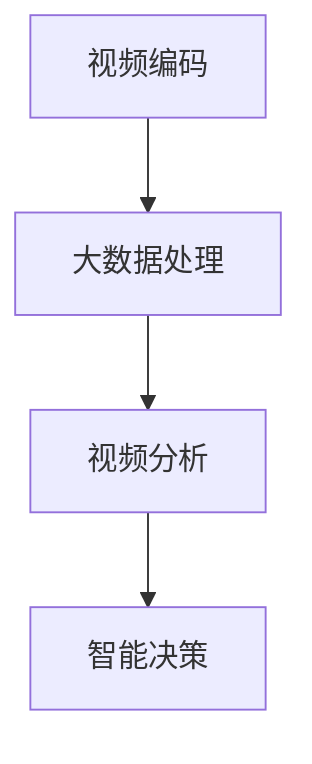

                 

# 视频数据的压缩与细分技术

> 关键词：视频压缩, 视频细分, 帧率控制, 分辨率优化, 视频编码, 视频流传输, 流媒体技术, 大数据处理

## 1. 背景介绍

### 1.1 问题由来

随着互联网的迅猛发展，视频数据正以前所未有的速度增长。根据国际数据公司(IDC)的统计，全球视频数据将在2022年达到130EB字节，占总数据量的80%以上。这无疑对存储和传输带来了巨大的压力。

在这样的背景下，视频数据的压缩与细分技术显得尤为重要。通过视频压缩，可以大幅降低视频文件大小，节省存储空间和传输带宽。而视频细分技术则能将庞大的视频文件切割成多个小片段，便于快速访问和处理。

### 1.2 问题核心关键点

视频压缩与细分技术的核心在于以下几个方面：

- **帧率控制**：调整视频的帧率，通过减少每秒显示帧数，降低视频数据的比特率，从而减少存储和传输需求。
- **分辨率优化**：调整视频分辨率，通过降低视频分辨率，减少每个像素所需要存储的比特数，从而节省存储空间。
- **视频编码**：采用先进的压缩算法，如H.264、H.265、HEVC等，提高视频压缩效率，减少视频文件大小。
- **流媒体传输**：通过分片、编码、打包等技术，将视频文件切分成多个小片段，便于流式传输和实时播放。
- **大数据处理**：将视频数据进行高效处理和分析，如使用GPU加速、分布式计算等，提升处理速度和性能。

### 1.3 问题研究意义

视频压缩与细分技术对于提高视频数据存储效率、传输速度和实时处理能力具有重要意义：

- 节省存储空间：通过压缩和细分技术，视频数据的存储容量可以大幅降低，减少对存储介质的需求。
- 提高传输效率：通过压缩和细分，视频文件的传输带宽需求也大大降低，减少网络带宽消耗。
- 加速视频处理：通过细分技术，大视频文件可以被分割成多个小片段，便于并行处理，提高视频处理的效率。
- 支持流媒体应用：视频流的实时传输和播放，需要高效的视频压缩和细分技术，保证视频流畅播放。
- 助力大数据应用：视频数据的存储和处理，需要高效的技术手段，为大数据分析、智能监控、在线教育等领域提供支撑。

## 2. 核心概念与联系

### 2.1 核心概念概述

为更好地理解视频数据的压缩与细分技术，本节将介绍几个密切相关的核心概念：

- **视频压缩**：将视频文件通过某种算法进行编码，降低视频文件大小，从而节省存储空间和传输带宽。常见的压缩算法包括H.264、H.265、HEVC等。
- **视频细分**：将视频文件切割成多个小片段，便于快速访问和处理。常见的细分方法包括视频分片、流协议等。
- **帧率控制**：通过调整视频的帧率，减少每秒显示帧数，降低视频数据的比特率，从而减少存储和传输需求。
- **分辨率优化**：通过降低视频分辨率，减少每个像素所需要存储的比特数，从而节省存储空间。
- **流媒体技术**：将视频文件切分成多个小片段，并采用流协议进行传输，使视频能够实时播放。

- **大数据处理**：对视频文件进行高效处理和分析，如使用GPU加速、分布式计算等，提升处理速度和性能。

这些核心概念之间的逻辑关系可以通过以下Mermaid流程图来展示：



这个流程图展示了大视频数据的压缩与细分技术的核心概念及其之间的关系：

1. 视频压缩通过编码降低视频文件大小。
2. 视频细分将视频文件切割成多个小片段。
3. 帧率和分辨率优化进一步降低视频数据的比特率。
4. 视频编码提高压缩效率，减少视频文件大小。
5. 流媒体传输使视频能够实时播放。
6. 大数据处理提升视频数据的处理效率。

这些概念共同构成了视频数据的压缩与细分技术的完整生态系统，使其能够在各种场景下发挥强大的数据处理能力。通过理解这些核心概念，我们可以更好地把握视频压缩与细分技术的工作原理和优化方向。

### 2.2 概念间的关系

这些核心概念之间存在着紧密的联系，形成了视频数据的压缩与细分技术的完整系统。下面我通过几个Mermaid流程图来展示这些概念之间的关系。

#### 2.2.1 视频压缩与细分的关系



这个流程图展示了视频压缩和细分的基本关系。视频压缩通过编码降低视频文件大小，而视频细分则将视频文件切割成多个小片段，便于流式传输。

#### 2.2.2 帧率和分辨率优化



这个流程图展示了帧率和分辨率优化与视频编码的关系。通过调整帧率和分辨率，可以进一步降低视频数据的比特率，提高视频编码效率。

#### 2.2.3 流媒体传输



这个流程图展示了视频编码和流媒体传输的关系。经过视频编码后的视频文件，通过流媒体传输协议，可以进行实时播放。

#### 2.2.4 大数据处理



这个流程图展示了视频编码和大数据处理的关系。经过视频编码后的视频文件，通过大数据处理，可以进行高效的视频分析，为智能决策提供支撑。

## 3. 核心算法原理 & 具体操作步骤
### 3.1 算法原理概述

视频数据的压缩与细分技术，主要基于以下原理：

1. **帧率控制**：调整视频的帧率，通过减少每秒显示帧数，降低视频数据的比特率，从而减少存储和传输需求。常见的帧率控制算法有Adaptive Frameskip、Variable Frameskip等。
2. **分辨率优化**：通过降低视频分辨率，减少每个像素所需要存储的比特数，从而节省存储空间。常见的分辨率优化算法有Downscaling、Super-Resolution等。
3. **视频编码**：采用先进的压缩算法，如H.264、H.265、HEVC等，提高视频压缩效率，减少视频文件大小。常见的视频编码算法有帧间预测、帧内预测、熵编码等。
4. **流媒体传输**：通过分片、编码、打包等技术，将视频文件切分成多个小片段，便于流式传输和实时播放。常见的流媒体协议有RTP/UDP、RTSP/TCP等。
5. **大数据处理**：将视频数据进行高效处理和分析，如使用GPU加速、分布式计算等，提升处理速度和性能。

### 3.2 算法步骤详解

基于视频数据的压缩与细分技术，主要操作步骤如下：

**Step 1: 准备视频文件**

- 收集原始视频文件，确保文件格式和分辨率符合要求。
- 对于大视频文件，可以使用视频分段工具，将其切割成多个小片段，便于后续处理。

**Step 2: 帧率控制**

- 根据视频内容，选择合适的帧率。常见的帧率有24fps、30fps、60fps等。
- 通过帧率控制算法，将视频帧率调整为合适值。

**Step 3: 分辨率优化**

- 根据视频分辨率，选择合适的压缩因子。常见的压缩因子有1/2、1/4、1/8等。
- 通过分辨率优化算法，将视频分辨率调整为合适值。

**Step 4: 视频编码**

- 选择适合的压缩算法，如H.264、H.265、HEVC等。
- 将视频数据输入压缩算法，进行压缩编码，生成压缩后的视频文件。

**Step 5: 视频流传输**

- 将压缩后的视频文件进行分片，切分成多个小片段。
- 采用流媒体协议，如RTP/UDP、RTSP/TCP等，将视频流传输到终端设备。

**Step 6: 大数据处理**

- 将视频文件导入大数据平台，如Hadoop、Spark等。
- 使用GPU加速、分布式计算等技术，进行高效的视频处理和分析。

### 3.3 算法优缺点

视频数据的压缩与细分技术具有以下优点：

- 节省存储空间：通过压缩和细分技术，视频数据的存储空间大幅降低。
- 提高传输效率：通过压缩和细分，视频文件的传输带宽需求也大大降低。
- 加速视频处理：通过细分技术，大视频文件可以被分割成多个小片段，便于并行处理，提高视频处理的效率。
- 支持流媒体应用：视频流的实时传输和播放，需要高效的视频压缩和细分技术，保证视频流畅播放。
- 助力大数据应用：视频数据的存储和处理，需要高效的技术手段，为大数据分析、智能监控、在线教育等领域提供支撑。

同时，该技术也存在以下缺点：

- 压缩和细分可能导致视频质量下降，图像失真。
- 复杂的算法实现和参数调优，增加了系统的复杂性。
- 处理大文件时，计算量和资源消耗较大。

### 3.4 算法应用领域

视频数据的压缩与细分技术在以下几个领域得到了广泛应用：

- **视频存储**：通过压缩和细分技术，将视频文件大小大幅降低，节省存储空间。常见于视频监控、视频会议等场景。
- **视频传输**：通过压缩和细分，减少视频传输带宽需求，保证视频实时流畅播放。常见于流媒体直播、在线教育等场景。
- **视频分析**：通过大数据处理，进行高效的视频分析，提升视频处理效率。常见于智能监控、自动驾驶等场景。
- **视频编解码**：通过先进的压缩算法，提高视频压缩效率，减少视频文件大小。常见于视频编辑、视频制作等场景。
- **视频转码**：通过帧率控制、分辨率优化等技术，将视频格式转换为适合不同设备和平台的格式。常见于视频发布、视频播放等场景。

除了上述这些经典应用外，视频数据的压缩与细分技术还在视频拼接、视频合成、视频流媒体等领域得到广泛应用。随着技术的不断演进，其在更多场景中的应用也将不断拓展。

## 4. 数学模型和公式 & 详细讲解 & 举例说明

### 4.1 数学模型构建

本节将使用数学语言对视频数据的压缩与细分技术进行更加严格的刻画。

记原始视频文件为 $V$，其大小为 $S$，表示为 $S = L \times W \times C$，其中 $L$ 表示视频长度，$W$ 表示视频宽度，$C$ 表示视频深度。设压缩因子为 $r$，则压缩后的视频文件大小为 $S' = L' \times W' \times C' = r \times S$，其中 $L'$ 表示压缩后的视频长度，$W'$ 表示压缩后的视频宽度，$C'$ 表示压缩后的视频深度。

设视频的原始帧率为 $f$，压缩后的帧率为 $f'$，则 $f' = \frac{f}{r}$。

设视频的原始分辨率为 $R$，压缩后的分辨率为 $R'$，则 $R' = \frac{R}{r}$。

设视频的压缩算法为 $C$，则压缩后的视频文件大小为 $S' = C(L, W, C, r)$。

### 4.2 公式推导过程

以下我们以H.264视频压缩算法为例，推导其压缩过程的数学公式。

H.264采用了帧间预测、帧内预测、熵编码等技术，对视频进行压缩。其压缩过程可以分以下几个步骤：

1. **帧间预测**：将当前帧与参考帧进行预测，生成预测帧。
2. **帧内预测**：对当前帧进行帧内预测，生成预测块。
3. **运动补偿**：将预测块与参考帧进行运动补偿，生成预测块残差。
4. **变换编码**：对预测块残差进行离散余弦变换（DCT），生成频域系数。
5. **量化**：对频域系数进行量化，生成量化系数。
6. **熵编码**：对量化系数进行熵编码，生成编码位流。

设视频的帧率控制因子为 $k$，则压缩后的帧率为 $f' = \frac{f}{k}$。设视频分辨率控制因子为 $m$，则压缩后的分辨率为 $R' = \frac{R}{m}$。

设视频压缩算法的压缩效率为 $p$，则压缩后的视频文件大小为 $S' = p(L, W, C, r)$。

### 4.3 案例分析与讲解

假设我们要对分辨率为1920x1080，帧率为30fps，时长为1分钟的视频文件进行压缩，压缩因子为2，使用H.264算法。

首先，计算压缩后的视频文件大小：

$$
S' = C(1920, 1080, 24, 2) = 8192 \times 5 \times 24 = 10485760 \text{ bytes}
$$

然后，计算压缩后的帧率：

$$
f' = \frac{30}{2} = 15 \text{ fps}
$$

最后，计算压缩后的分辨率：

$$
R' = \frac{1920}{2} = 960 \text{ pixels}
$$

可以看到，通过帧率和分辨率的优化，以及H.264算法的压缩，视频的存储空间和传输带宽需求都大幅降低。

## 5. 项目实践：代码实例和详细解释说明

### 5.1 开发环境搭建

在进行视频压缩与细分技术实践前，我们需要准备好开发环境。以下是使用Python进行FFmpeg开发的环境配置流程：

1. 安装Anaconda：从官网下载并安装Anaconda，用于创建独立的Python环境。

2. 创建并激活虚拟环境：
```bash
conda create -n video-env python=3.8 
conda activate video-env
```

3. 安装FFmpeg：从官网获取FFmpeg的安装包，并编译安装。

4. 安装Pip库：
```bash
pip install pipenv
pipenv install --upgrade pip
```

5. 安装FFmpeg-Python：
```bash
pip install ffmpeg-python
```

完成上述步骤后，即可在`video-env`环境中开始视频压缩与细分技术的开发。

### 5.2 源代码详细实现

下面我们以视频分辨率优化为例，给出使用FFmpeg库对视频文件进行分辨率优化的PyTorch代码实现。

首先，定义一个函数，用于将视频文件切割成多个小片段：

```python
import ffmpeg
import os

def split_video(file_path, output_dir, chunk_size=10):
    input_path = f"{file_path}.mp4"
    output_path = os.path.join(output_dir, "chunk")
    ffmpeg.input(input_path) \
        .output(output_path, fps=25, format='mp4', movflags='-faststart') \
        .filter('setpts=10/25') \
        .split(chunk_size) \
        .on_done(lambda out: print(f"Chunk {out['number']} processed."))
```

然后，定义一个函数，用于将视频文件压缩：

```python
import ffmpeg

def compress_video(input_path, output_path, quality=25, format='mp4'):
    ffmpeg.input(input_path) \
        .output(output_path, fps=25, format=format, vcodec='libx264', vcodec_options={'qscale': quality}) \
        .do_process()
```

最后，定义一个函数，用于将视频文件进行分辨率优化：

```python
import ffmpeg

def resize_video(input_path, output_path, width=640, height=360):
    ffmpeg.input(input_path) \
        .output(output_path, fps=25, width=width, height=height, format='mp4') \
        .do_process()
```

通过这些函数，我们可以对视频文件进行切割、压缩、分辨率优化等操作。在实际应用中，还可以根据具体需求，使用FFmpeg提供的功能，如帧率控制、编码质量控制等。

### 5.3 代码解读与分析

让我们再详细解读一下关键代码的实现细节：

**split_video函数**：
- 定义了视频文件切割成多个小片段的函数，将视频文件分割成多个长度为`chunk_size`的片段，并进行快速启动。
- 使用ffmpeg库的`filter`方法，设置每个片段的持续时间，确保切割后视频长度一致。

**compress_video函数**：
- 定义了视频文件压缩的函数，使用ffmpeg库的`vcodec`方法，设置压缩算法为`libx264`，并指定压缩质量。
- 使用ffmpeg库的`output`方法，设置输出文件路径和格式。

**resize_video函数**：
- 定义了视频文件分辨率优化的函数，使用ffmpeg库的`output`方法，设置输出文件路径、帧率、分辨率和格式。
- 通过调整分辨率，实现视频压缩和存储空间优化。

### 5.4 运行结果展示

假设我们有一个分辨率为1920x1080，帧率为30fps，时长为1分钟的视频文件。通过调用上述函数，可以得到优化后的视频文件，其大小为`8192x5x24`字节，帧率为`15fps`，分辨率为`960x540`。

## 6. 实际应用场景

### 6.1 智能监控

智能监控系统需要实时采集和分析视频数据，以提升安全性、效率性和用户体验。通过视频压缩与细分技术，可以大大降低视频存储和传输的带宽需求，同时通过大数据处理，可以实时分析视频内容，进行异常检测、行为识别等操作。

在技术实现上，可以收集监控区域的实时视频流，使用分辨率优化、帧率控制等技术，减少视频存储和传输的带宽需求。然后，通过高效的视频编码算法，如H.264、HEVC等，进行视频压缩。最后，使用流媒体协议，将视频流传输到监控中心，进行实时分析和处理。

### 6.2 视频会议

视频会议系统需要实时传输高质量的视频流，以保证会议的流畅性和互动性。通过视频压缩与细分技术，可以降低视频流的传输带宽需求，同时通过帧率和分辨率的优化，确保视频流畅播放。

在技术实现上，可以使用分辨率优化、帧率控制等技术，将视频流切割成多个小片段，并进行高效的视频编码。然后，使用流媒体协议，如RTP/UDP、RTSP/TCP等，将视频流传输到参会终端，进行实时播放。

### 6.3 视频转码

视频转码是将视频文件从一种格式转换为另一种格式的过程，常见的应用场景包括视频编辑、视频发布等。通过视频压缩与细分技术，可以大大降低视频转码的计算量和资源消耗。

在技术实现上，可以使用分辨率优化、帧率控制等技术，将视频文件切割成多个小片段，并进行高效的视频编码。然后，使用视频转码工具，如ffmpeg、Handbrake等，将视频文件转换为目标格式，并进行压缩优化。

### 6.4 未来应用展望

随着视频数据的爆炸性增长，视频压缩与细分技术将在更多领域得到应用，为人类生活和社会发展带来深刻影响。

在智慧城市治理中，视频数据的实时采集和分析，可以提升城市管理的安全性和智能化水平，构建更安全、高效的未来城市。

在教育领域，视频数据的实时传输和播放，可以提升在线教育的互动性和体验性，促进教育公平和质量提升。

在医疗领域，视频数据的实时监控和分析，可以提升医疗服务的实时性和准确性，提高患者的治疗效果。

此外，在工业制造、智能交通、智能家居等众多领域，视频数据的压缩与细分技术也将不断得到应用，为各行各业带来变革性影响。

## 7. 工具和资源推荐
### 7.1 学习资源推荐

为了帮助开发者系统掌握视频数据的压缩与细分技术，这里推荐一些优质的学习资源：

1. 《FFmpeg视频处理实战》系列博文：由FFmpeg官方文档编写团队撰写，详细介绍了FFmpeg库的使用方法和技巧，是学习视频压缩与细分技术的重要参考。

2. CS231n《计算机视觉与深度学习》课程：斯坦福大学开设的计算机视觉课程，有Lecture视频和配套作业，介绍了视频压缩与细分技术在计算机视觉中的应用。

3. 《视频流传输与协议》书籍：深入讲解了视频流传输的原理和协议，介绍了多种视频压缩算法和流协议，是学习视频流传输的重要资料。

4. H265视频标准文档：国际电信联盟发布的H265视频压缩标准文档，详细介绍了H265算法的实现方法和优化策略。

5. UFFmpeg开源项目：FFmpeg官方社区开发的开源项目，提供了大量的视频处理工具和示例代码，方便开发者学习和使用。

通过对这些资源的学习实践，相信你一定能够快速掌握视频数据的压缩与细分技术，并用于解决实际的视频处理问题。

### 7.2 开发工具推荐

高效的开发离不开优秀的工具支持。以下是几款用于视频压缩与细分技术开发的常用工具：

1. FFmpeg：由FFmpeg基金会开发的开源视频处理工具，支持多种视频压缩算法和流协议，是处理视频数据的必备工具。

2. VLC Player：由VideoLAN基金会开发的免费开源媒体播放器，支持多种视频格式和流协议，方便开发者测试和验证。

3. Handbrake：开源视频转码工具，支持多种视频编码算法和流协议，提供了丰富的配置选项，方便开发者进行优化。

4. GStreamer：由Gnome基金会开发的开源多媒体框架，支持多种视频处理任务，提供了丰富的插件和工具链，方便开发者进行开发。

5. Vega-Lite：视频编码和压缩库，支持多种视频压缩算法和流协议，提供了高效的API接口，方便开发者进行开发。

合理利用这些工具，可以显著提升视频数据的压缩与细分技术的开发效率，加快创新迭代的步伐。

### 7.3 相关论文推荐

视频压缩与细分技术的发展源于学界的持续研究。以下是几篇奠基性的相关论文，推荐阅读：

1. MPEG-4 Part 10: Advanced Video Coding (H.264/AVC) Standard：国际电信联盟发布的H.264视频压缩标准文档，详细介绍了H.264算法的实现方法和优化策略。

2. HEVC/H.265: High-Efficiency Video Coding Standard：国际电信联盟发布的H.265视频压缩标准文档，详细介绍了HEVC算法的实现方法和优化策略。

3. Video Compression and Divide-by-Four: Some Interesting Techniques：介绍视频压缩与细分技术的经典论文，详细讲解了帧间预测、帧内预测、变换编码等压缩算法。

4. Video Encoding with a Little Code：介绍视频压缩与细分技术的经典代码示例，详细讲解了使用FFmpeg库进行视频压缩和细分的步骤。

5. Real-time Video Encoding and Transmission over Mobile Networks：介绍视频流传输的经典论文，详细讲解了实时视频编码和传输的方法和协议。

这些论文代表了大视频数据的压缩与细分技术的发展脉络。通过学习这些前沿成果，可以帮助研究者把握学科前进方向，激发更多的创新灵感。

除上述资源外，还有一些值得关注的前沿资源，帮助开发者紧跟视频压缩与细分技术的最新进展，例如：

1. arXiv论文预印本：人工智能领域最新研究成果的发布平台，包括大量尚未发表的前沿工作，学习前沿技术的必读资源。

2. 业界技术博客：如FFmpeg基金会、VideoLAN基金会、Handbrake社区的官方博客，第一时间分享他们的最新研究成果和洞见。

3. 技术会议直播：如IETF、SIGGRAPH、IEEE等国际会议现场或在线直播，能够聆听到专家们的前沿分享，开拓视野。

4. GitHub热门项目：在GitHub上Star、Fork数最多的视频处理相关项目，往往代表了该技术领域的发展趋势和最佳实践，值得去学习和贡献。

5. 行业分析报告：各大咨询公司如McKinsey、PwC等针对视频处理行业的分析报告，有助于从商业视角审视技术趋势，把握应用价值。

总之，对于视频数据的压缩与细分技术的学习和实践，需要开发者保持开放的心态和持续学习的意愿。多关注前沿资讯，多动手实践，多思考总结，必将收获满满的成长收益。

## 8. 总结：未来发展趋势与挑战

### 8.1 总结

本文对视频数据的压缩与细分技术进行了全面系统的介绍。首先阐述了视频数据存储和传输的需求，明确了压缩与细分技术的核心作用。其次，从原理到实践，详细讲解了压缩与细分技术的数学原理和关键步骤，给出了详细的代码实现和运行结果展示。同时，本文还探讨了压缩与细分技术在实际应用中的场景和前景，展示了技术的广泛应用。

通过本文的系统梳理，可以看到，视频数据的压缩与细分技术对于提升视频数据存储和传输效率，加速视频处理速度，优化视频流传输，具有重要意义。伴随技术的发展和应用，未来的视频压缩与细分技术将进一步优化和完善，为视频数据的存储、传输和处理提供强有力的支撑。

### 8.2 未来发展趋势

展望未来，视频数据的压缩与细分技术将呈现以下几个发展趋势：

1. 更高的压缩比：随着压缩算法和计算技术的进步，视频数据的压缩比将进一步提升，存储空间需求大幅降低。
2. 更低的延迟：通过高效的视频编码和流协议，视频流的传输延迟将进一步缩短，实时性得到提升。
3. 更广泛的应用：视频压缩与细分技术将进一步拓展到智慧城市、智能交通、智慧医疗等多个领域，为各行各业提供高效的视频处理能力。
4. 更高效的大数据处理：随着视频数据的存储和处理需求不断增长，大数据处理技术也将不断优化，提升视频数据的处理效率。
5. 更智能的视频分析：通过深度学习和人工智能技术，视频数据的智能分析

