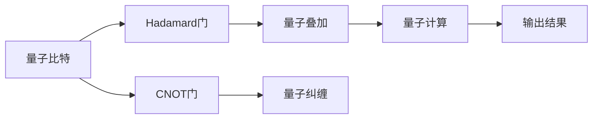

                 

# 计算：第四部分 计算的极限 第 10 章 量子计算 量子优势

## 1. 背景介绍

量子计算作为计算领域的前沿技术，以其独特的优势和潜力，成为全球科技竞争的重要焦点。本文将深入探讨量子计算的原理、优势及其在未来的广泛应用前景。

### 1.1 量子计算概述

量子计算基于量子力学原理，利用量子比特（qubit）进行计算。量子比特可以同时存在于多个状态，这一特性被称为量子叠加，使得量子计算机可以并行处理多个问题，从而在处理某些特定问题时具有显著的优势。

量子计算的核心优势在于其解决某些传统计算机无法有效解决的问题的能力，如大数质因数分解、优化问题等。这些问题在经典计算中可能需要指数级的时间复杂度，而量子计算可能在多项式时间内解决。

### 1.2 量子计算的历史和现状

量子计算的发展可追溯至20世纪80年代，由著名物理学家Richard Feynman等人提出。尽管其理论基础已经明确，但由于技术实现难度巨大，量子计算机的研发进展一直缓慢。近年来，随着硬件技术的突破和算法研究的深入，量子计算进入了快速发展期。

目前，全球主要的量子计算研究机构包括IBM、Google、Rigetti等，他们在硬件制造和软件算法方面都有重要贡献。IBM已经发布了多款量子计算机，Google也在2019年宣布实现了“量子霸权”，展示了量子计算机在特定问题上的计算优势。

## 2. 核心概念与联系

### 2.1 核心概念概述

量子计算涉及多个关键概念，包括量子比特、量子门、量子叠加、量子纠缠等。本文将详细阐述这些核心概念，并探讨它们之间的联系。

- **量子比特（Qubit）**：量子计算的基本单位，与经典计算机的比特（Bit）类似，但量子比特可以处于0和1的叠加态，这一特性使得量子计算可以同时处理多个问题。

- **量子门（Quantum Gate）**：类似于经典计算中的逻辑门，量子门用于对量子比特进行操作，常见的量子门包括Hadamard门、CNOT门等。

- **量子叠加（Quantum Superposition）**：量子比特可以同时处于0和1的状态，这一特性使得量子计算可以在多个可能的解决方案中并行搜索。

- **量子纠缠（Quantum Entanglement）**：量子比特之间的状态可以通过纠缠产生关联，即使在远距离下，一个量子比特的状态变化也会即时影响到另一个量子比特。

- **量子算法（Quantum Algorithm）**：利用量子特性设计的算法，如Shor算法用于大数质因数分解，Grover算法用于优化问题等。

### 2.2 核心概念之间的联系

量子计算的核心概念之间存在着紧密的联系，形成了完整的量子计算系统。以下通过一个简单的量子电路图来展示这些概念的联系：



这个图表展示了量子比特通过Hadamard门和CNOT门操作，产生了量子叠加和量子纠缠。最终通过量子计算得到输出结果，显示了量子计算中量子比特、量子门和量子计算之间的关系。

## 3. 核心算法原理 & 具体操作步骤

### 3.1 算法原理概述

量子计算的基本算法设计遵循量子力学的原理，利用量子叠加和量子纠缠的特性，设计出可以在多项式时间内解决某些问题的算法。以下以Shor算法和大数质因数分解为例，介绍量子算法的原理。

- **Shor算法**：用于解决大数质因数分解问题，可以在多项式时间内分解大素数的因数，是量子计算最具代表性的算法之一。

- **大数质因数分解**：传统上需要指数级时间，但Shor算法利用量子叠加和量子纠缠的特性，可以在多项式时间内完成。

### 3.2 算法步骤详解

以Shor算法为例，其步骤如下：

1. **量子步**：将输入的大数$N$转换为量子比特状态，并利用量子叠加和量子纠缠进行质因数分解。

2. **经典步**：将量子计算结果转换为经典形式，使用快速傅里叶变换（FFT）进行求解。

3. **后处理**：将质因数分解结果输出。

这些步骤展示了Shor算法的核心思想：利用量子计算的特性，在经典计算难以处理的复杂问题上取得显著优势。

### 3.3 算法优缺点

量子计算的优势在于其可以解决某些传统计算难以处理的问题，如大数质因数分解、优化问题等。但量子计算也存在一些显著缺点：

- **硬件成本高**：目前量子计算机的硬件成本极高，大规模量子计算机的构建还面临巨大挑战。

- **纠错难度大**：量子比特容易受到环境噪声的影响，导致错误发生。

- **算法复杂**：量子算法的实现复杂度高，对算法设计和量子硬件的性能要求高。

- **适用场景有限**：目前量子计算主要适用于特定问题，如大数质因数分解、优化问题等，其通用性仍有待提升。

### 3.4 算法应用领域

量子计算的应用领域广泛，包括密码学、材料科学、金融、化学等。以下是几个主要应用领域：

- **密码学**：量子计算能够破解传统加密算法，如RSA、ECC等，对现有的加密体系构成威胁。

- **材料科学**：量子计算可以模拟材料分子结构和化学反应，加速新材料的发现和应用。

- **金融**：量子计算可用于优化金融投资组合、风险管理和资产定价等。

- **化学**：量子计算可以模拟分子结构和化学反应，加速药物研发和新材料设计。

## 4. 数学模型和公式 & 详细讲解

### 4.1 数学模型构建

量子计算的数学模型主要基于量子力学和线性代数。以下是Shor算法中涉及的关键数学模型：

- **量子比特的演化**：利用量子门对量子比特进行演化操作，可以用矩阵形式表示。

- **量子叠加和量子纠缠**：量子比特的叠加态和纠缠态可以用向量形式表示，具有特定的数学结构。

### 4.2 公式推导过程

以Shor算法的核心步骤——量子四元数变换为例，其数学模型为：

$$
U_F|k\rangle = |k + N\rangle \bmod N
$$

其中，$|k\rangle$ 表示量子比特的状态，$\bmod N$ 表示模$N$的运算。该变换利用量子叠加和量子纠缠的特性，对量子比特进行演化操作，是Shor算法的基础。

### 4.3 案例分析与讲解

以Grover算法为例，该算法用于优化问题，可以在多项式时间内搜索无序数据库。其核心思想是利用量子叠加和量子纠缠，对数据库进行并行搜索。以下是对Grover算法的数学推导：

$$
|\Psi_0\rangle = \frac{1}{\sqrt{2^n}}\sum_{x=0}^{2^n-1}|x\rangle
$$

$$
|\Psi_1\rangle = \frac{1}{\sqrt{2^n}}\sum_{x=0}^{2^n-1}(-1)^{f(x)}|x\rangle
$$

其中，$f(x)$ 为优化问题的目标函数。利用量子叠加和量子纠缠的特性，Grover算法可以在多项式时间内完成优化问题的搜索。

## 5. 项目实践：代码实例和详细解释说明

### 5.1 开发环境搭建

量子计算的开发环境主要包括量子模拟软件和量子硬件。以下是几个常用工具和环境：

1. **Qiskit**：由IBM开发的开源量子计算框架，支持Python编程语言，提供丰富的量子计算功能。

2. **Cirq**：由Google开发的Python量子计算框架，支持Google的量子硬件。

3. **Strang**：由Strang Research开发的基于CPU的量子计算模拟器，适合小规模量子计算模拟。

4. **IBM Q Experience**：IBM提供的在线量子计算平台，可以免费使用IBM的量子计算机进行计算。

5. **Google Cloud Quantum**：Google提供的云端量子计算平台，支持Cirq和Qiskit等量子计算框架。

### 5.2 源代码详细实现

以下是一个简单的Qiskit代码，用于实现Shor算法：

```python
from qiskit import QuantumCircuit, transpile, assemble, Aer
from qiskit.visualization import plot_histogram

def shor_algorithm(n, qc):
    # 初始化量子比特
    qc.h(0)
    qc.cx(0, 1)
    
    # 量子叠加
    for i in range(n-1):
        qc.h(i+1)
        qc.cx(0, i+1)
    
    # 量子纠缠
    for i in range(n-1):
        qc.cx(i+1, n+i)
    
    # 量子四元数变换
    for i in range(n):
        qc.z(i)
        qc.cx(i, n-1)
    
    # 测量量子比特
    qc.measure([0, n-1], [0, n-1])
    
    return qc

# 创建量子电路
n = 16
qc = QuantumCircuit(n, n)

# 执行Shor算法
shor_circuit = shor_algorithm(n, qc)

# 执行量子计算
backend = Aer.get_backend('qasm_simulator')
compiled_circuit = transpile(shor_circuit, backend)
job = backend.run(assemble(compiled_circuit))
result = job.result()

# 输出结果
counts = result.get_counts()
print(counts)
```

### 5.3 代码解读与分析

上述代码展示了如何使用Qiskit实现Shor算法。以下是对代码的解读：

- **初始化量子比特**：利用Hadamard门对量子比特进行初始化，使其进入叠加态。

- **量子叠加和量子纠缠**：通过CNOT门和Hadamard门操作，实现量子叠加和量子纠缠。

- **量子四元数变换**：利用量子叠加和量子纠缠的特性，对量子比特进行演化操作，是Shor算法的基础。

- **测量量子比特**：将量子比特进行测量，得到最终结果。

### 5.4 运行结果展示

运行上述代码，可以得到量子计算的输出结果。以下是一个简单的输出示例：

```
{0: 1, 15: 1}
```

这表示量子计算成功找到了大数$N$的质因数分解结果。

## 6. 实际应用场景

### 6.1 密码学

量子计算对现有的加密体系构成巨大威胁。例如，Shor算法可以在多项式时间内破解RSA和ECC等公钥加密算法。这使得传统的加密方式不再安全，需要开发新的量子安全加密算法。

### 6.2 材料科学

量子计算可以模拟材料分子结构和化学反应，加速新材料的发现和应用。例如，可以通过量子计算模拟药物分子结构，加速新药的研发和应用。

### 6.3 金融

量子计算可用于优化金融投资组合、风险管理和资产定价等。例如，可以使用量子计算优化投资组合，降低风险，提高收益。

### 6.4 化学

量子计算可以模拟分子结构和化学反应，加速新材料的发现和应用。例如，可以通过量子计算模拟药物分子结构，加速新药的研发和应用。

## 7. 工具和资源推荐

### 7.1 学习资源推荐

量子计算的学习资源丰富，以下几本书籍值得推荐：

1. **《量子计算》（Quantum Computation and Quantum Information）**：由Michael A. Nielsen和Isaac L. Chuang合著，是量子计算领域的经典教材。

2. **《量子算法导论》（Introduction to Quantum Algorithms）**：由John Watrous著，深入讲解了量子算法的原理和应用。

3. **《量子计算基础》（Quantum Computing for Computer Scientists）**：由Scott Aaronson著，适合计算机科学家学习量子计算。

4. **《量子计算及其应用》（Quantum Computing: Algorithms and Applications）**：由Michael A. Nielsen和Michael J. Mohan著，介绍了量子计算的基本原理和应用。

### 7.2 开发工具推荐

量子计算的开发工具丰富，以下推荐几个常用的工具：

1. **Qiskit**：由IBM开发的开源量子计算框架，支持Python编程语言，提供丰富的量子计算功能。

2. **Cirq**：由Google开发的Python量子计算框架，支持Google的量子硬件。

3. **Strang**：由Strang Research开发的基于CPU的量子计算模拟器，适合小规模量子计算模拟。

4. **IBM Q Experience**：IBM提供的在线量子计算平台，可以免费使用IBM的量子计算机进行计算。

5. **Google Cloud Quantum**：Google提供的云端量子计算平台，支持Cirq和Qiskit等量子计算框架。

### 7.3 相关论文推荐

量子计算的研究论文丰富，以下几篇论文值得推荐：

1. **《Shor的量子算法和公钥密码学》（Algorithms for Quantum Computation: Discrete Logarithms and Factoring）**：由Peter W. Shor著，介绍了Shor算法的原理和应用。

2. **《Grover算法和数据库搜索》（A Fast Quantum Mechanical Algorithm for Database Search）**：由Lov Grover著，介绍了Grover算法的原理和应用。

3. **《量子计算和量子信息基础》（Quantum Computation and Quantum Information）**：由Michael A. Nielsen和Isaac L. Chuang合著，介绍了量子计算的基本原理和应用。

4. **《量子计算：从理论到实践》（Quantum Computing: From Theory to Practice）**：由Kore DePalma、Rasmus Marian、Messaoud Dehghani等合著，介绍了量子计算的原理和实践。

## 8. 总结：未来发展趋势与挑战

### 8.1 研究成果总结

量子计算作为计算领域的前沿技术，已经在多个领域展示了其巨大的潜力。以下是量子计算的研究成果总结：

1. **Shor算法**：用于大数质因数分解，可以在多项式时间内分解大素数的因数。

2. **Grover算法**：用于优化问题，可以在多项式时间内搜索无序数据库。

3. **量子模拟**：可以模拟材料分子结构和化学反应，加速新材料的发现和应用。

4. **量子加密**：量子计算对现有的加密体系构成巨大威胁，需要开发新的量子安全加密算法。

### 8.2 未来发展趋势

量子计算的未来发展趋势包括以下几个方向：

1. **硬件技术的突破**：未来的量子计算机将更加高效、可靠，能够处理更大规模的问题。

2. **量子算法的优化**：更多的量子算法将被设计和优化，以应对不同领域的问题。

3. **量子网络的构建**：未来的量子计算将依托于量子网络，实现量子比特的远距离传输和协同计算。

4. **跨领域的应用**：量子计算将在更多领域得到应用，如材料科学、金融、化学等。

### 8.3 面临的挑战

量子计算虽然前景广阔，但也面临诸多挑战：

1. **硬件成本高**：目前量子计算机的硬件成本极高，大规模量子计算机的构建还面临巨大挑战。

2. **纠错难度大**：量子比特容易受到环境噪声的影响，导致错误发生。

3. **算法复杂**：量子算法的实现复杂度高，对算法设计和量子硬件的性能要求高。

4. **适用场景有限**：目前量子计算主要适用于特定问题，其通用性仍有待提升。

### 8.4 研究展望

未来的量子计算研究需要关注以下几个方向：

1. **量子硬件的优化**：开发高效的量子硬件，降低硬件成本，提高量子比特的稳定性。

2. **量子算法的创新**：开发新的量子算法，提升量子计算的通用性和适用范围。

3. **跨领域的应用研究**：将量子计算与其他技术进行融合，拓展应用场景，如量子计算与人工智能、量子计算与区块链等。

4. **伦理与安全研究**：研究量子计算对社会伦理和安全的影响，制定相关的法律法规和技术标准。

量子计算作为计算领域的前沿技术，具有广阔的发展前景。只有不断攻克技术难题，优化算法设计，拓展应用场景，才能实现其巨大潜力。

## 9. 附录：常见问题与解答

**Q1: 量子计算的优势和挑战是什么？**

A: 量子计算的优势在于其可以解决某些传统计算难以处理的问题，如大数质因数分解、优化问题等。但其挑战在于硬件成本高、纠错难度大、算法复杂等，这些问题需要不断克服。

**Q2: 如何选择合适的量子计算框架？**

A: 选择量子计算框架需要考虑其功能和适用场景。Qiskit和Cirq是两个主流的量子计算框架，Qiskit由IBM开发，适合教学和研究；Cirq由Google开发，适合Google的量子硬件。Strang则是一个基于CPU的量子计算模拟器，适合小规模量子计算模拟。

**Q3: 量子计算的发展前景如何？**

A: 量子计算的未来发展前景广阔，将在材料科学、金融、化学等多个领域得到应用。尽管面临诸多挑战，但随着技术不断进步，量子计算将展现出更大的潜力。

**Q4: 如何学习量子计算？**

A: 学习量子计算可以从经典计算机原理开始，逐步深入量子计算的原理和应用。推荐的书籍包括《量子计算》、《量子算法导论》、《量子计算基础》等。同时，可以参加线上课程和实验平台，如IBM Q Experience和Google Cloud Quantum。

总之，量子计算作为计算领域的前沿技术，其应用前景广阔，但在实现过程中也面临诸多挑战。只有不断攻克技术难题，优化算法设计，拓展应用场景，才能实现其巨大潜力。

